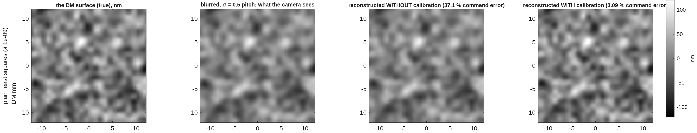
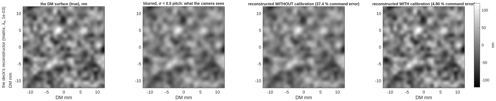
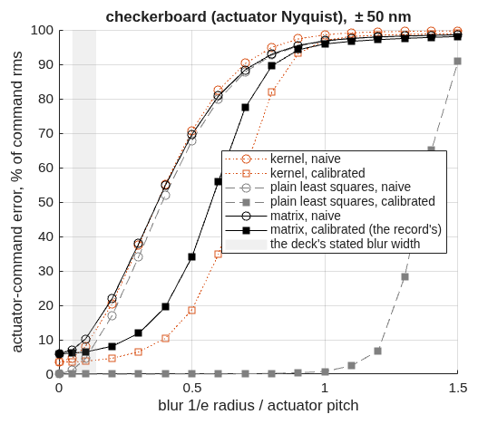
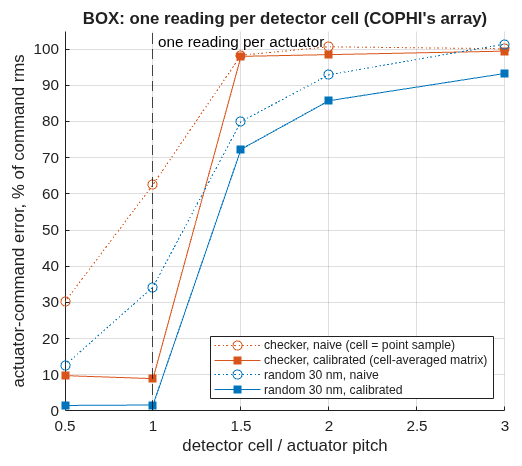

<!--
deck_blur.md -- pupil-image blur and the DM gauge, step by step (Fang Shi's question).
DRAFT -- pending Dave's sign-off.  Build: python3 make_brief_slides.py deck_blur.md
Source: MACOS_resources/mmacos/templates/40_benches/tg_psi_dm96_oap/pupil_blur_demo.m
(CCMac 2026-10-09, TO's rework per BRIEF_to_pupil_blur, CC's plain-least-squares line and
step figure); records runs/pupil_blur_demo/*.txt; macos/REPORT_pupil_blur.md.
Figures are the tool's own PNGs, cropped at the panel level (figs/blur_*.png), never re-rendered.
-->

# Pupil-Image Blur and the DM Gauge
When does a blurred image of the deformable mirror cost the gauge accuracy?  A known surface, blurred by a kernel of swept width, reconstructed without and with calibration, by a plain least-squares read and by the gauge's own reconstructor; the built benches placed on the same axis.
D. C. Redding, with Claude Code.
October 2026.  Working record; engine-free (the model is the DM's influence functions and a Gaussian blur).
DRAFT — pending review.
~ The question (Fang Shi, 2026-10-08 talk): the DM is imaged onto the gauge's camera through lenses or off-axis mirrors; how much does the image's blur cost after calibration, and when would it matter?  The answer in one line: blur is a roll-off of the DM's highest spatial frequencies; a calibrated read removes it until the roll-off at the actuator spacing's Nyquist frequency reaches the reconstructor's own floor; the built legs sit two orders of magnitude below that.

## The question, and how it is answered | Four steps anyone can check by eye; the only physics is the DM's influence function and a blur kernel
::: left
- **1. A known surface.**  96 × 96 actuators at 1 mm spacing (the "pitch"); each actuator lifts a Gaussian bump of 0.85 mm 1/e radius; a random 30 nm rms command (the gauge's working surface) and, as the hardest case, a ±50 nm checkerboard — the finest pattern the DM can make.
- **2. The blur.**  The surface is convolved with a Gaussian of 1/e radius σ, swept from 0 to 1.5 pitch, plus 20 pm of read noise per map pixel: this is what the camera sees.  (A detector-cell average — a box — is the second kernel, for a photodiode array.)
- **3. The reconstruction.**  The actuator commands are recovered from the blurred map by least squares against a response matrix (one column per lit actuator), **without calibration** — the matrix built from the unblurred influence, as if no one knew about the blur — and **with calibration** — the matrix built from the blurred influence, which is what measuring the response matrix through the camera does automatically.
- **4. The score.**  rms of (recovered − true) commands over the 2852 lit actuators, as a percentage of the command rms; and the reconstructed surface against the true one.
::: right
- **Two reconstructors.**  *Plain least squares*: the matrix inverted with no regularization to speak of (λ = 10⁻⁹) — the simplest possible estimator.  *The gauge's own*: the same matrix with the record's Tikhonov weight (λ_m = 10⁻³ of the median column energy, `matrix_lam` in every bench run) — what every number in the gauge deck used.  The regularization protects the measured matrix against its own noise, at the price of a floor: 1.0 % on the random surface and 6 % on the checkerboard at zero blur, photon-independent.
- **The built benches on the axis.**  The rigorous tool (`tg96_pupilsim`, engine-traced) gives each leg's transfer at the actuator Nyquist frequency: 0.9999 (lens rig), 0.9994 (mirror rig).  The Gaussian with the same transfer has σ = 0.006 and 0.016 pitch — where they sit on the curves.
~ `pupil_blur_demo.m` (`templates/40_benches/tg_psi_dm96_oap/`), ~1 min, no engine; record `runs/pupil_blur_demo/pupil_blur_demo_report.txt`.  Approximations: the blur acts on the phase map (the small-phase limit, 0.1 wave here); the legs are matched to a Gaussian at the Nyquist transfer only.

## Step by step, plain least squares | The 30 nm working surface, blurred at σ = 0.5 pitch (54 % transfer at the actuator Nyquist): the uncalibrated read returns the blurred surface; the calibrated read returns the true one
::: full
{h=3.1}
| plain least squares at σ = 0.5 pitch | command error | reconstructed surface vs true |
|---|---|---|
| without calibration | **37 %** | 5.1 nm rms — the blurred surface itself (it differs from the true one by 5.2 nm rms) |
| with calibration | **0.09 %** | 0.007 nm rms |
- **Without calibration the read is faithful to the wrong thing:** it reproduces the blurred surface, so every feature is softened and the command error is a third of the command.  **With calibration** the blur is in the forward model and the inversion undoes it: the true surface to 7 pm, with the 20 pm read noise as the only residual.
~ `pupil_blur_demo_steps.png`, top row; the "steps figure" line of the report.

## Step by step, the gauge's own reconstructor | The same surface and blur through the regularized read the deck used: calibration still removes most of the blur, but the regularization's floor shows
::: full
{h=3.1}
| the gauge's reconstructor at σ = 0.5 pitch | command error | reconstructed surface vs true |
|---|---|---|
| without calibration | **37 %** | 5.2 nm rms |
| with calibration | **4.8 %** | 0.23 nm rms |
- **The 4.8 % is the regularization, not the blur:** at zero blur this estimator already carries 1.0 % on this surface, and as the blur erases the finest content the fixed weight λ_m bites harder on what is left.  The plain read shows what the data support (0.09 %); the gauge's read shows what its weight chooses to keep.  The weight is a knob — the record's 10⁻³ guards the measured matrix's own noise; the trade is measured on the next slide's backup.
~ `pupil_blur_demo_steps.png`, bottom row.

## The curves: error against blur width | The uncalibrated read degrades from a twentieth of a pitch; the calibrated plain read holds to about 0.8 pitch and fails at 1.1 when the blur has erased the actuator-scale content; the gauge's reconstructor holds to 0.3–0.4 pitch
::: left
{h=3.6}
::: right
{h=3.6}
- **Uncalibrated:** 2 % at 0.1 pitch, 8 % at 0.2, 37 % at 0.5 (random surface); the checkerboard is half gone at 0.4.
- **Calibrated, plain:** at the noise floor (0.04 %) to 0.5 pitch, 0.35 % at 0.8, then the matrix turns ill-conditioned (the transfer at Nyquist is 8 % at 1.0 pitch, 5 % at 1.1) and the read collapses by 1.3.
- **Calibrated, the gauge's:** 1.3 % at 0.2 pitch, 2.8 % at 0.4, 4.8 % at 0.5 — the floor plus the regularization's growing share.
~ `pupil_blur_demo_curve.png`, top-left two panels; the sweep tables in the report.

## Where the built benches sit | Both legs are at a hundredth of a pitch, where the uncalibrated cost is a few hundredths of a percent and the calibrated cost is unmeasurable — so the 0.13 / 0.29 % the gauge deck attributed to "blur" is mostly something else
::: full
{h=3.3}
- **Lens rig:** σ = 0.006 pitch; blur costs **0.004 %** of the surface uncalibrated; the deck quoted 0.13 %.  **Mirror rig:** σ = 0.016 pitch; **0.024 %** against 0.29 %.  More than 3× apart on both: a finding.  A Gaussian would need 0.036 / 0.054 mm to cost the quoted shares.
- **What the shares are instead:** a registration shift of the size the records show (0.4 µm on the lens rig) costs 0.047 % — a third of the lens share; the mirror's error sits in the lowest spatial band, which no blur produces.  The deck's number stands; its attribution to blur does not.  Calibrated, both legs read within 0.1 % of their zero-blur floors.
~ Report §"the built leg on the axis" and §"the cross-check"; the pupilsim records `runs/pupilsim_redo_lens`, `_oap` (stage 2, Nyquist gain, min over u and v).

## A detector cell instead of a blur: one reading per actuator, or nothing | For a photodiode-array gauge (COPHI) the "blur" is the cell average; the actuator-space read survives a cell of one pitch and collapses at 1.5
::: left
{h=3.4}
::: right
| cell (pitch) | readings per lit actuator | checkerboard, calibrated | 30 nm surface, calibrated |
|---|---|---|---|
| 0.5 | 5.45 | 9.8 % | 1.5 % |
| 1.0 | 1.34 | 9.0 % | 1.6 % |
| 1.5 | 0.58 | 98 % | 72 % |
| 2.0 | 0.32 | 98 % | 86 % |
- **The collapse between 1 and 1.5 pitch is counting, not blur:** fewer readings than lit actuators, and the actuator-space fit has nothing to determine it.  A coarse array must be read in a low-order basis (modes), never in actuator space — the form the COPHI campaign's photodiode row takes.
~ Report §"the BOX kernel"; `'kernel','box'`.

## What is approximate, and how to run it | The demo is a model of the blur alone; its three idealizations are stated, and every number is one command away
::: left
- **The blur acts on the phase map.**  A camera blurs intensity; the four-step phase of blurred fringes equals the blurred phase only near null — true at 0.1 wave (the 30 nm surface), not at a wave.
- **The built legs are not Gaussians.**  The rigorous tool finds a phase gain cos φ with amplitude cross-talk sin φ and a distortion; the Gaussian is matched to it at the actuator-Nyquist transfer only.
- **The lit set** is the demo's 2852 actuators (0.85 × 0.74 of the aperture radius); the benches light 5072 (lens) and 6948 (mirror) from the traced cone.  The error is a per-actuator rms, so the count sets the edge-to-interior ratio, not the scale.
::: right
```
cd <path>/mmacos/templates/40_benches/tg_psi_dm96_oap
matlab
>> pupil_blur_demo                    % ~1 min, no engine
>> pupil_blur_demo('steps_sig', 0.8)  % the steps at another blur
>> pupil_blur_lam_m                   % the weight vs noise (backup)
```
- **Test:** `./run_mmacos_tests.sh tPupilBlurDemo` (5 assertions, ~7 s; the all-unknowns solve kept as the must-fail control).
~ Public: nasa-jpl/MACOS_resources, branch dev-candidate.

## Backup

## The reconstructor's floor: regularization against noise | The gauge's weight sets a bias that scales with the weight; the noise floor sits at the unregularized read, about a picometer at 10¹⁴ photons
::: full
| λ_m | noise-free | 20 pm per pixel | 10¹³ photons | 10¹⁴ photons |
|---|---|---|---|---|
| 10⁻³ (the record) | 306 pm | 306 | 306 | 306 |
| 10⁻⁴ | 31.6 | 33.1 | 31.7 | 31.6 |
| 10⁻⁵ | 3.17 | 10.9 | 4.23 | 3.28 |
| 10⁻⁶ | 0.32 | 10.5 | 2.86 | 0.95 |
| 10⁻⁷ | 0.03 | 10.5 | 2.85 | 0.90 |
- **The bias scales with λ_m** (306 pm = 1.0 % of the 30 nm surface at the record's weight) and is photon-independent; **the noise part plateaus** at the unregularized least-squares floor, 0.90 pm at 10¹⁴ photons and 2.85 at 10¹³ — the gauge deck's 1.4 / 2.3 pm class.  So the record's 1 % is a regularization choice, not physics.  **Caveat:** the bench's measured matrix carries noise and model error in its columns that λ_m guards; lowering it is re-gated on the measured matrix (the bench's Stage E sweep), not read off this ideal-matrix bound.
~ `pupil_blur_lam_m.m`, record `pupil_blur_lam_m_report.txt` (TO, 2026-10-09); ideal matrix, the record's random 30 nm surface, 2852 lit actuators, shot noise per 0.25 mm pixel.

## Records behind each slide | Every number is in a committed run record
::: full
| slide | record |
|---|---|
| 3, 4 | `runs/pupil_blur_demo/pupil_blur_demo_steps.png`; the "steps figure" line of `pupil_blur_demo_report.txt` |
| 5 | `pupil_blur_demo_curve.png`; the two sweep tables (regularized and plain) in the report |
| 6 | the report's "built leg on the axis" and "cross-check" sections; `runs/pupilsim_redo_lens/`, `runs/pupilsim_redo_oap/` |
| 7 | the report's "BOX kernel" section |
| 9 | `runs/pupil_blur_demo/pupil_blur_lam_m_report.txt` |
~ `macos/REPORT_pupil_blur.md` (TO), `macos/NOTE_to_ccmac_pupil_blur_review.md` (CC), `macos/BRIEF_to_pupil_blur.md`; the gauge deck's pupil-imaging slide and `REPORT_gauge_ifo.md` §6b carry the corrected attribution.
