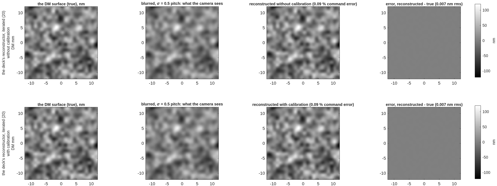
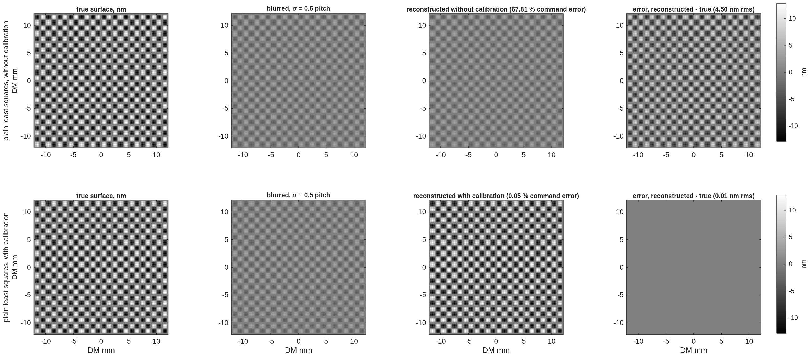

<!--
deck_blur.md -- pupil-image blur and the DM gauge, step by step (Fang Shi's question).
DRAFT -- pending Dave's sign-off.  Build: python3 make_brief_slides.py deck_blur.md
Source: MACOS_resources/mmacos/templates/40_benches/tg_psi_dm96_oap/pupil_blur_demo.m
(CCMac 2026-10-09, TO's rework per BRIEF_to_pupil_blur, CC's plain-least-squares line and
step figure); records runs/pupil_blur_demo/*.txt; macos/REPORT_pupil_blur.md.
Figures are the tool's own PNGs, cropped at the panel level (figs/blur_*.png), never re-rendered.
-->

# Pupil-Image Blur and the DM Gauge
When does a blurred image of the deformable mirror cost the gauge accuracy?  A known surface, blurred by a kernel of swept width, reconstructed without and with calibration, by a plain least-squares read and by the gauge's own reconstructor; the built benches placed on the same axis.
D. C. Redding, with Claude Code.
October 2026.  Working record; engine-free (the model is the DM's influence functions and a Gaussian blur).
DRAFT — pending review.
~ The question (Fang Shi, 2026-10-08 talk): the DM is imaged onto the gauge's camera through lenses or off-axis mirrors; how much does the image's blur cost after calibration, and when would it matter?  The answer in one line: blur is a roll-off of the DM's highest spatial frequencies; a one-shot read needs calibration to undo it, and a servo converges to the true surface with or without it until the roll-off at the actuator spacing's Nyquist frequency takes the loop's stability; the built legs sit two orders of magnitude below either limit.

## The question, and how it is answered | Four steps anyone can check by eye; the only physics is the DM's influence function and a blur kernel
::: left
- **1. A known surface.**  96 × 96 actuators at 1 mm spacing (the "pitch"); each actuator lifts a Gaussian bump of 0.85 mm 1/e radius; a random 30 nm rms command (the gauge's working surface) and, as the hardest case, a ±50 nm checkerboard — the finest pattern the DM can make.
- **2. The blur.**  The surface is convolved with a Gaussian of 1/e radius σ, swept from 0 to 1.5 pitch, plus 20 pm of read noise per map pixel: this is what the camera sees.  (A detector-cell average — a box — is the second kernel, for a photodiode array.)
- **3. The reconstruction.**  The actuator commands are recovered from the blurred map by least squares against a response matrix (one column per lit actuator)
-- **without calibration** — the matrix built from the unblurred influence, as if no one knew about the blur
-- **with calibration** — the matrix built from the blurred influence, which is what measuring the response matrix through the camera does automatically
- **4. The score.**  rms of (recovered − true) commands over the 2852 lit actuators, as a percentage of the command rms; and the reconstructed surface against the true one.
::: right
- **Two reconstructors, and two ways to use them.**
-- *Plain least squares*: the matrix inverted with no regularization to speak of (λ = 10⁻⁹) — the simplest estimator, and the indicator of where any estimator converges.
-- *The gauge's own*: the same matrix with the record's Tikhonov weight (λ_m = 10⁻³ of the median column energy), which protects the measured matrix against its own noise at the price of shrinking a single estimate (1 % on this surface at zero blur).
-- Each is shown **one shot** (a capture, an absolute read) and **driven to convergence** as the gauge's servo uses it: read the residual, correct, read again.
- **The DM surface gauge performance.**  The rigorous tool (`tg96_pupilsim`, engine-traced) gives each leg's transfer at the actuator Nyquist frequency: 0.9999 (lens rig), 0.9994 (mirror rig).  The Gaussian with the same transfer has σ = 0.006 and 0.016 pitch — where they sit on the curves.
~ `pupil_blur_demo.m` (`templates/40_benches/tg_psi_dm96_oap/`), ~1 min, no engine; record `runs/pupil_blur_demo/pupil_blur_demo_report.txt`.  Approximations: the blur acts on the phase map (the small-phase limit, 0.1 wave here); the legs are matched to a Gaussian at the Nyquist transfer only.

## Step by step, plain least squares | The 30 nm working surface blurred at σ = 0.5 pitch (54 % transfer at the actuator Nyquist): read without calibration the estimate is the blurred surface; read with calibration it is the true one; one gray scale for all four panels, the error on the same scale
::: full
{h=4.3}
- **Without calibration** the read is faithful to the wrong thing: it reproduces the blurred surface (37 % command error; 5.1 nm rms from the true, which is the blurred surface's own 5.2 nm).  **With calibration** the blur is in the forward model and the inversion undoes it: 0.09 %, 7 pm rms — the 20 pm read noise is the only residual.
~ `pupil_blur_demo_steps.png`, rows 1–2; the "steps figure" line of the report.

## Step by step, the gauge's reconstructor, one step | The same surface and blur through the regularized read the gauge deck used, applied once: the shrinkage shows — and it is not the estimator's accuracy
::: full
{h=4.3}
- **One step, calibrated: 4.8 %, 0.23 nm rms** against the plain read's 0.09 %.  The difference is the regularization's shrinkage, which already costs 1 % at zero blur and more as the blur erases the finest content.  A single regularized step is a shrunk estimate, not where the estimator converges — the gauge never uses it once; its servo applies it repeatedly (next slide).
~ `pupil_blur_demo_steps.png`, rows 3–4.

## Step by step, the gauge's reconstructor driven to convergence | Applied as the servo applies it — read the residual, correct, read again — the regularized estimator converges to the plain read's answer, with and even without calibration
::: full
{h=4.3}
- **Converged, calibrated: 0.087 %, 7 pm** — the plain least-squares answer; the regularization set the convergence rate, not the accuracy.  **Converged, uncalibrated: 0.09 %, 7 pm as well** — the blur is in the loop's plant, so the loop corrects what the camera sees until the camera sees nothing, and a blurred residual of zero is a residual of zero for every frequency the blur passes.  Calibration matters for a one-shot read (a capture, an absolute measurement); for hold it sets the stability margin: the uncalibrated loop over-corrects the attenuated frequencies and diverges beyond 0.6 pitch of blur (next slide).
~ `pupil_blur_demo_steps.png`, rows 5–6; the "ITERATED TO CONVERGENCE" sweep in the report.

## The checkerboard, the hardest pattern | ±50 nm on alternate actuators is only ±13 nm of surface (neighboring bumps cancel); blurred at 0.5 pitch it nearly vanishes; the uncalibrated read returns the faint version, the calibrated read the full one
::: full
{h=4.5}
~ `pupil_blur_demo_maps.png`.  Without calibration 68 % command error (4.5 nm rms of surface); with 0.05 % (0.01 nm).

## The curves: error against blur width | One-shot reads degrade from a twentieth of a pitch without calibration and hold to about 0.8 pitch with it; the servo converges to the same accuracy with or without calibration until the loop's stability goes, at 0.6 pitch uncalibrated and 0.8 calibrated
::: left
{h=3.5}
::: right
{h=3.5}
- **One shot, uncalibrated:** 2 % at 0.1 pitch, 8 % at 0.2, 37 % at 0.5.  **One shot, calibrated, plain:** at the noise floor (0.04 %) to 0.5 pitch, 0.35 % at 0.8, collapse by 1.3 when the blur has erased the actuator-scale content (8 % transfer at 1.0 pitch).  **One shot, the gauge's, one step:** 1.3 % at 0.2, 4.8 % at 0.5 — shrinkage.
- **Iterated to convergence (the servo):** calibrated, the plain answer to 0.7 pitch then the same collapse; uncalibrated, the same to 0.5 pitch, 2.7 % at 0.6, divergent beyond — the loop's gain at the attenuated frequencies exceeds 2.
~ `pupil_blur_demo_curve.png`, top-left two panels; the three sweep tables in the report.

## Where the built benches sit | Both legs are at a hundredth of a pitch, where the uncalibrated cost is a few hundredths of a percent and the calibrated cost is unmeasurable — so the 0.13 / 0.29 % the gauge deck attributed to "blur" is mostly something else
::: full
{h=3.3}
- **Lens rig:** σ = 0.006 pitch; blur costs **0.004 %** of the surface uncalibrated; the deck quoted 0.13 %.  **Mirror rig:** σ = 0.016 pitch; **0.024 %** against 0.29 %.  More than 3× apart on both: a finding.  A Gaussian would need 0.036 / 0.054 mm to cost the quoted shares.
- **What the shares are instead:** a registration shift of the size the records show (0.4 µm on the lens rig) costs 0.047 % — a third of the lens share; the mirror's error sits in the lowest spatial band, which no blur produces.  The deck's number stands; its attribution to blur does not.  Calibrated, both legs read within 0.1 % of their zero-blur floors.
~ Report §"the built leg on the axis" and §"the cross-check"; the pupilsim records `runs/pupilsim_redo_lens`, `_oap` (stage 2, Nyquist gain, min over u and v).

## A detector cell instead of a blur: one reading per actuator, or nothing | For a photodiode-array gauge (COPHI) the "blur" is the cell average; the actuator-space read survives a cell of one pitch and collapses at 1.5
::: left
{h=3.4}
::: right
| cell (pitch) | readings per lit actuator | checkerboard, calibrated | 30 nm surface, calibrated |
|---|---|---|---|
| 0.5 | 5.45 | 9.8 % | 1.5 % |
| 1.0 | 1.34 | 9.0 % | 1.6 % |
| 1.5 | 0.58 | 98 % | 72 % |
| 2.0 | 0.32 | 98 % | 86 % |
- **The collapse between 1 and 1.5 pitch is counting, not blur:** fewer readings than lit actuators, and the actuator-space fit has nothing to determine it.  A coarse array must be read in a low-order basis (modes), never in actuator space — the form the COPHI campaign's photodiode row takes.
~ Report §"the BOX kernel"; `'kernel','box'`.

## What is approximate, and how to run it | The demo is a model of the blur alone; its three idealizations are stated, and every number is one command away
::: left
- **The blur acts on the phase map.**  A camera blurs intensity; the four-step phase of blurred fringes equals the blurred phase only near null — true at 0.1 wave (the 30 nm surface), not at a wave.
- **The built legs are not Gaussians.**  The rigorous tool finds a phase gain cos φ with amplitude cross-talk sin φ and a distortion; the Gaussian is matched to it at the actuator-Nyquist transfer only.
- **The lit set** is the demo's 2852 actuators (0.85 × 0.74 of the aperture radius); the benches light 5072 (lens) and 6948 (mirror) from the traced cone.  The error is a per-actuator rms, so the count sets the edge-to-interior ratio, not the scale.
::: right
```
cd <path>/mmacos/templates/40_benches/tg_psi_dm96_oap
matlab
>> pupil_blur_demo                    % ~1 min, no engine
>> pupil_blur_demo('steps_sig', 0.8)  % the steps at another blur
>> pupil_blur_lam_m                   % the weight vs noise (backup)
```
- **Test:** `./run_mmacos_tests.sh tPupilBlurDemo` (5 assertions, ~7 s; the all-unknowns solve kept as the must-fail control).
~ Public: nasa-jpl/MACOS_resources, branch dev-candidate.

## Backup

## The reconstructor's floor: regularization against noise | The gauge's weight sets a bias that scales with the weight; the noise floor sits at the unregularized read, about a picometer at 10¹⁴ photons
::: full
| λ_m | noise-free | 20 pm per pixel | 10¹³ photons | 10¹⁴ photons |
|---|---|---|---|---|
| 10⁻³ (the record) | 306 pm | 306 | 306 | 306 |
| 10⁻⁴ | 31.6 | 33.1 | 31.7 | 31.6 |
| 10⁻⁵ | 3.17 | 10.9 | 4.23 | 3.28 |
| 10⁻⁶ | 0.32 | 10.5 | 2.86 | 0.95 |
| 10⁻⁷ | 0.03 | 10.5 | 2.85 | 0.90 |
- **The one-step shrinkage scales with λ_m** (306 pm = 1.0 % of the 30 nm surface at the record's weight) and is photon-independent; **the noise part plateaus** at the unregularized least-squares floor, 0.90 pm at 10¹⁴ photons and 2.85 at 10¹³ — the gauge deck's 1.4 / 2.3 pm class.  Driven to convergence the shrinkage is gone (slide 5); it sets how many steps the servo needs, not where it ends.  **Caveat:** the bench's measured matrix carries noise and model error in its columns that λ_m guards; lowering it is re-gated on the measured matrix (the bench's Stage E sweep), not read off this ideal-matrix bound.
~ `pupil_blur_lam_m.m`, record `pupil_blur_lam_m_report.txt` (TO, 2026-10-09); ideal matrix, the record's random 30 nm surface, 2852 lit actuators, shot noise per 0.25 mm pixel.

## Records behind each slide | Every number is in a committed run record
::: full
| slide | record |
|---|---|
| 3, 4, 5 | `runs/pupil_blur_demo/pupil_blur_demo_steps.png`; the "steps figure" line of `pupil_blur_demo_report.txt` |
| 6 | `pupil_blur_demo_maps.png` |
| 7 | `pupil_blur_demo_curve.png`; the three sweep tables (regularized one step, iterated, plain) in the report |
| 8 | the report's "built leg on the axis" and "cross-check" sections; `runs/pupilsim_redo_lens/`, `runs/pupilsim_redo_oap/` |
| 9 | the report's "BOX kernel" section |
| 11 | `runs/pupil_blur_demo/pupil_blur_lam_m_report.txt` |
~ `macos/REPORT_pupil_blur.md` (TO), `macos/NOTE_to_ccmac_pupil_blur_review.md` (CC), `macos/BRIEF_to_pupil_blur.md`; the gauge deck's pupil-imaging slide and `REPORT_gauge_ifo.md` §6b carry the corrected attribution.
