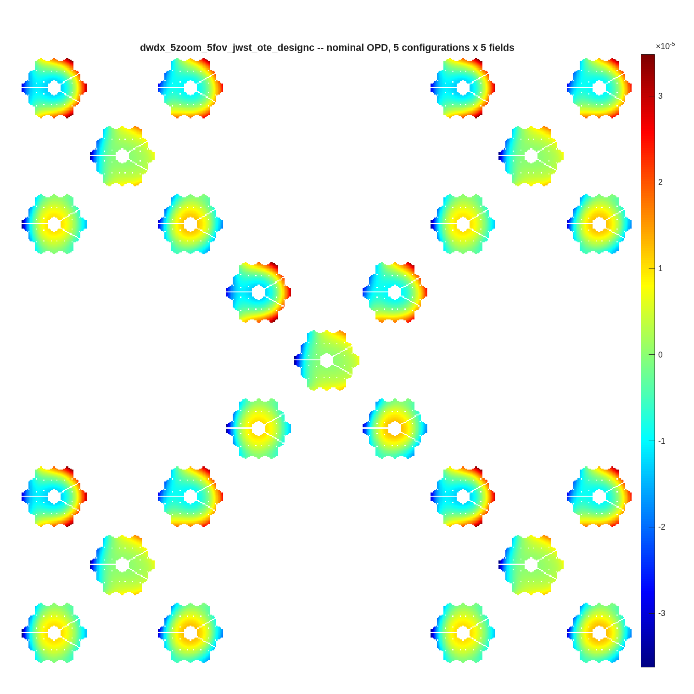
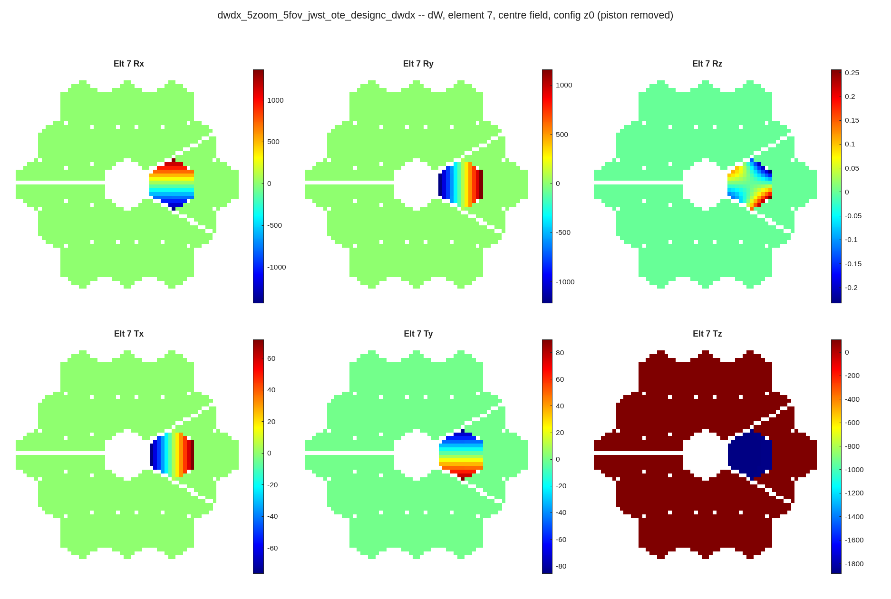
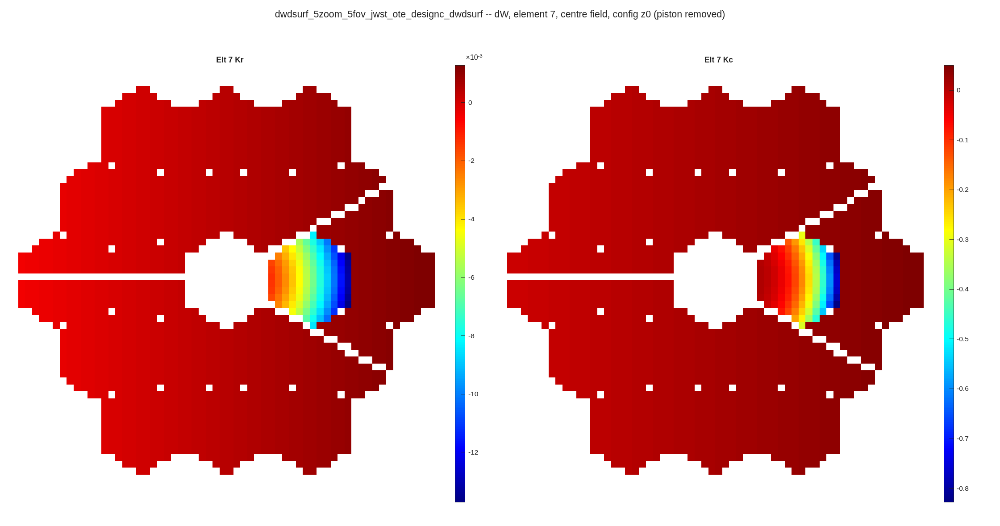
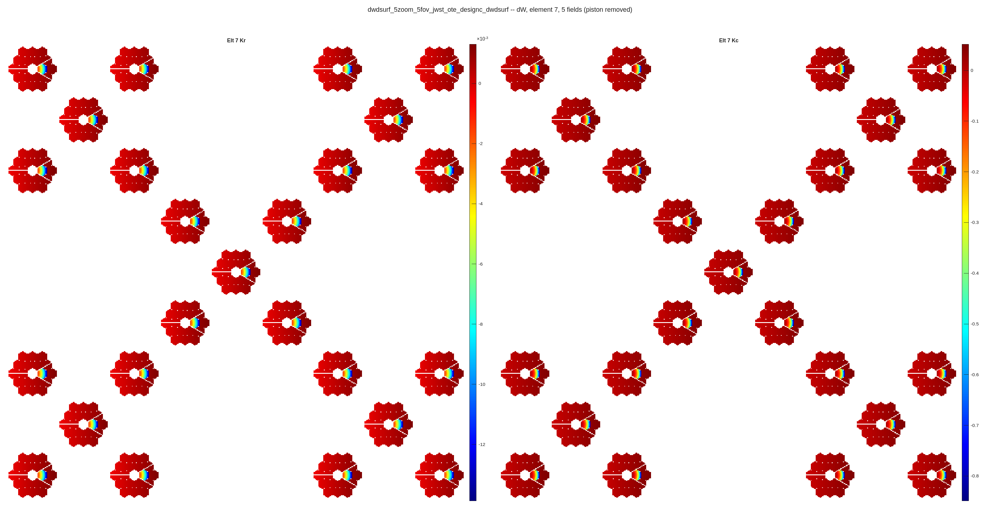
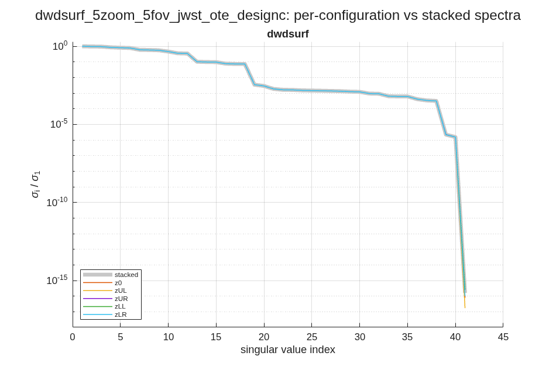

# The four dW rungs on one segment: rigid body, figure, prescription, grid
jwst_ote_designc.in (the zoom_5x5 fixture), model 512, 63-ray grid, stop at the FSM (element 25), wavefront read at the ExitPupil Return (27); 5 zoom states x 5 field points = 25 blocks, 54 595 rows; segment 7 shown in every rung
~ DRAFT 2026-09-10.  Every figure is a file `run_sensitivities` wrote, unmodified: `templates/50_sensitivities/zoom_5x5/<name>_opdall.png`, `<name>_svspec_configs.png`, `<name>_<ch>_channels.png` and the per-element pages in `<name>_pages/`.  Display conventions are the plotters': colormap jet, autoscaled per panel, piston removed, exact zeros not drawn.  Harvest conventions: `orient=raw`, `sign=opl`, `opd_ref=mean` (the defaults; the report header names them).  Units: BaseUnits mm of OPD per unit parameter.

## Every column is a difference of two of these maps | the nominal wavefront at all 25 (zoom state, field) blocks -- the canvas each Jacobian column is scattered onto
::: left
{h=4.6}
::: right
- One harvest, four rungs: the same field set, the same stop, the same exit-pupil reset -- only the perturbed quantity changes
- 54 595 rows: every valid ray of all 25 blocks (2 183-2 184 per block; ray loss differs slightly between them).  All four rungs share these rows
- Per-field exit-pupil reset: `reset_xp` re-finds the pupil per block, so the gross field tilt is out and the tiles show residual aberration
- Configuration axis: element 25 (a flat FSM at a pupil) points to the four corners of a 0.5 arcmin square; blocks stack as ROWS
~ `dwdx_5zoom_5fov_jwst_ote_designc_opdall.png`.  The 25-block harvest takes 175-378 s per rung on this box (gfortran mex).

## Rigid body: clocking a segment barely moves the wavefront | dW/dx, 138 channels over 22 optics + the PM group, rank 129; Rz is four decades below Rx/Ry, same units
{h=4.7}
~ `<name>_pages/<name>_dwdx_elt7_center.png`.  Segment 7 column norms (rms, per unit DOF): Rx 1.56e+02, Ry 1.59e+02, Rz 2.09e-02, Tx 9.91e+00, Ty 9.78e+00, Tz 4.54e+02.  Rz is four decades below Rx/Ry -- clocking a circular-footprint segment barely moves the wavefront.  22 optics x 6 DOFs + the PM group's 6 = 138 harvested; 132 are saved, because element 4 (the virtual centre segment, column norms 1e-16) is dropped number-free by `flag_zero_norm_channels`.

## Figure: only a non-zero-mean mode moves the reference | dW/dz, 60 channels (20 optics x 3 modes), rank 60, cond+ 33; three modes of segment 7's own basis
{h=4.3}
~ `<name>_pages/<name>_dwdz_elt7_center.png`.  Full 54 595 x 60, rank 60, cond+ 3.32e+01; segment-only 54 595 x 45, cond+ 1.06e+01.  The rung harvests every lMon-bearing optic, so the SM and TM appear beside the 18 segments.  The whole-pupil colour is the `opd_ref=mean` default; under `opd_ref='chief'` those pixels read exactly 0 (Luis round 4, 2026-09-09).

## Prescription: Kr and Kc are gradients, not focus blobs | dW/dsurf, 42 channels (21 powered optics x Kr, Kc), rank 40, cond+ 6.5e+05
{h=4.3}
~ `<name>_pages/<name>_dwdsurf_elt7_center.png`.  Peak 1.4e-02 mm per mm of radius and 8.5e-01 mm per unit conic -- different units, so the panels are autoscaled independently and the two are not comparable by eye.  Full 54 595 x 42, rank 40: two channels are dead (element 4, the virtual centre segment).  Segments count as powered since the 2026-09-05 eligibility ruling; before it this rung harvested the SM and TM alone (4 channels).

## Grid influence: the best-conditioned rung | dW/dgrid, 60 channels on the segment's own clocked grid, rank 60, cond+ 5.7
{h=4.3}
~ `<name>_pages/<name>_dwdgrid_elt7_center.png`.  Full 54 595 x 60, rank 60, cond+ 5.72e+00 -- best of the four.  Basis: `macos.segment_grid_basis`, Zernike modes 4-6 over each segment's true (irregular) footprint, `orthogonalize` true.  The Rx is grid-augmented first (`macos.design.grid_augment_rx`), which REPLACES the stale parent-frame grid lines SegMirMaker replicates into segment blocks; poking those instead paints a central dot and collapses the rank.

## Every column carries the (zoom, field) axis | the multi-field page shows one channel across all 25 blocks; the spectra show what the configuration axis adds
::: left
{h=3.9}
::: right
{h=3.4}
::: full
~ `<name>_pages/<name>_dwdsurf_elt7_multi.png` and `dwdsurf_..._svspec_configs.png` (both the dW/dsurf rung).  A flat mirror at a pupil tilts the wavefront to first order and the per-field pupil reset removes it, so the configuration's effect on the Jacobian is the SECOND-order residual: 5.3e-06 relative against 1.9e-04 with the pupil frozen (measured on the dW/dx rung; `run_dwdx_5zoom_5fov.m`'s header carries the definition of the statistic).

## Reading a 275-page harvest | the contact sheet indexes every channel to its page; the text index names the channels on each
::: left
{h=5.4}
::: right
| rung | channels | rank | cond+ | pages | runtime s |
|---|---|---|---|---|---|
| dW/dx | 138 | 129 | 2.0e+10 | 92 | 378 |
| dW/dz | 60 | 60 | 3.3e+01 | 60 | 190 |
| dW/dsurf | 42 | 40 | 6.5e+05 | 63 | 192 |
| dW/dgrid | 60 | 60 | 5.7e+00 | 60 | 175 |
~ THE E4 ROW IS ROUND-OFF, AND THE SHEET NOW SAYS SO.  Element 4 is the virtual centre segment; its six columns are dead -- Rx, Rz, Tz are EXACTLY zero over all 54 595 rows (nothing drawn, `rms 0`) and Ry, Tx, Ty carry max 1.06e-14 / 8.47e-16 / 8.47e-16 mm on 612 / 8 641 / 2 491 rows, taking 3-4 distinct values each: the finite-difference floor of a re-trace, 17 decades below element 5 (column max 1.405e+03, rms 1.614e+02).  Autoscaled thumbnails with no colorbar painted those few pixels across the full jet range, which reads as structure; the per-panel rms is the scale the colours were missing (`rms 4.3e-15` against `rms 1.6e+02` one row down).  Panel rms is of the map AS DRAWN -- valid pixels, piston removed -- so it differs from the column rms over all rows.  `flag_zero_norm_channels` catches the column and the driver drops it from the saved .mat; the figures are drawn before that drop.
~ Panels are drawn at a floor of 3.5 in per OPD map / 1.2 in per field tile and the pages follow, so a 19-segment harvest is 275 readable pages (17 MB) instead of one sheet of specks.  `<name>_<ch>_channels.png` is that contact sheet; `<name>_pages_index.txt` lists every page with its element and channels; the full-size pages are in `<name>_pages/` (gitignored -- regenerate with the four `run_dwd*_5zoom_5fov.m` drivers).
