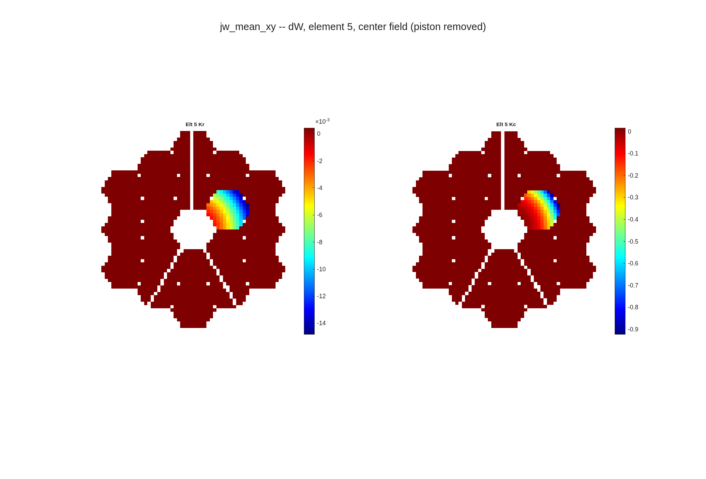
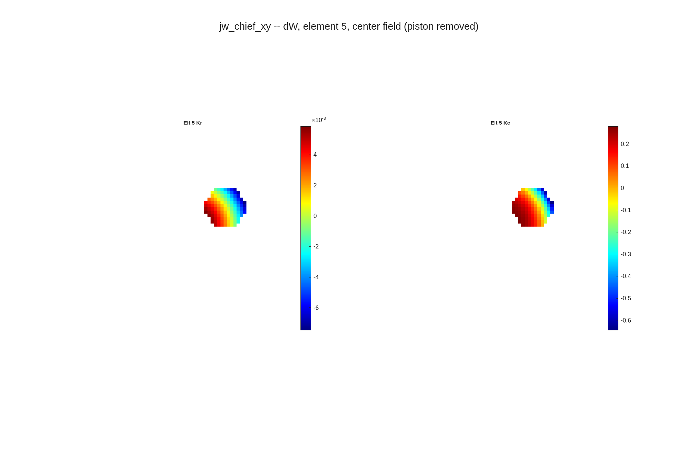
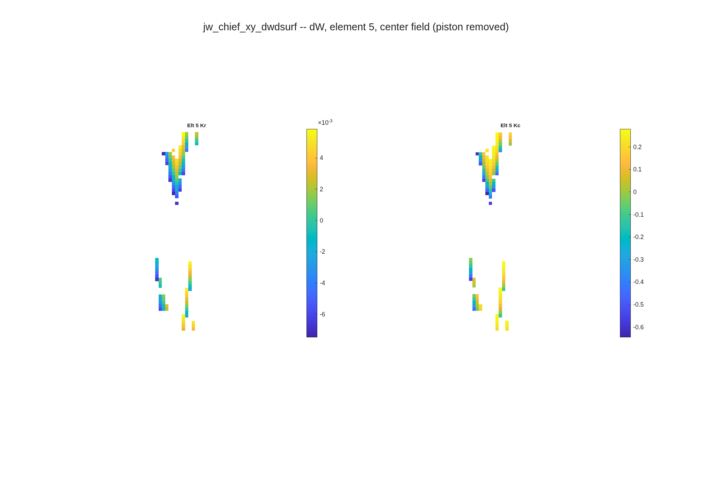
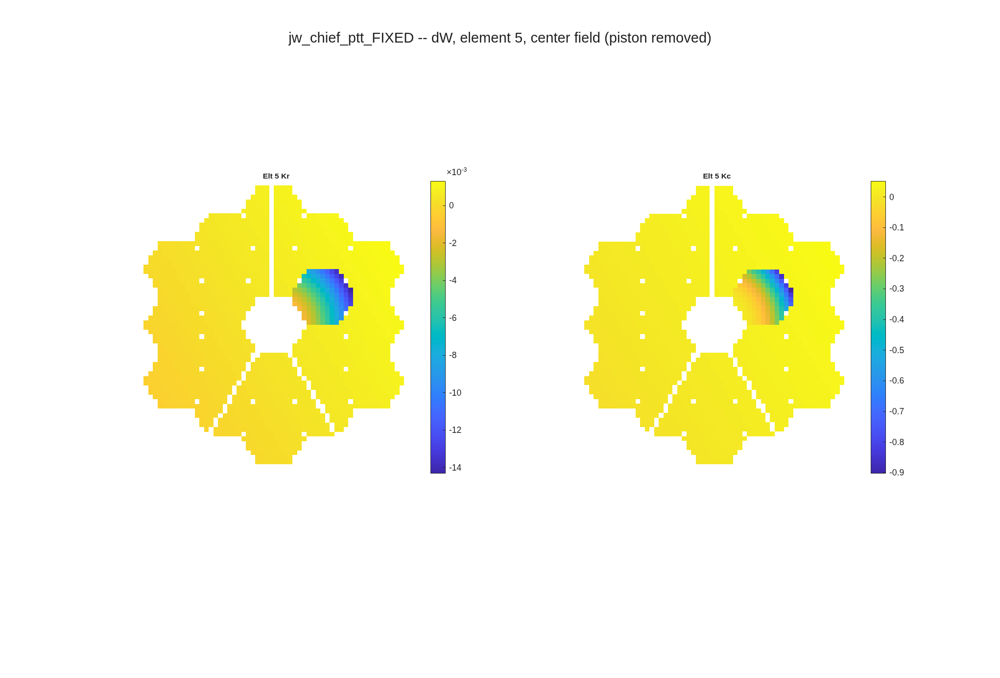
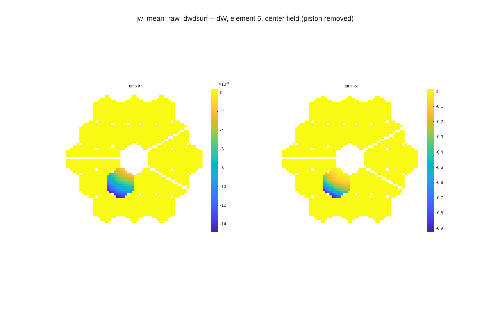
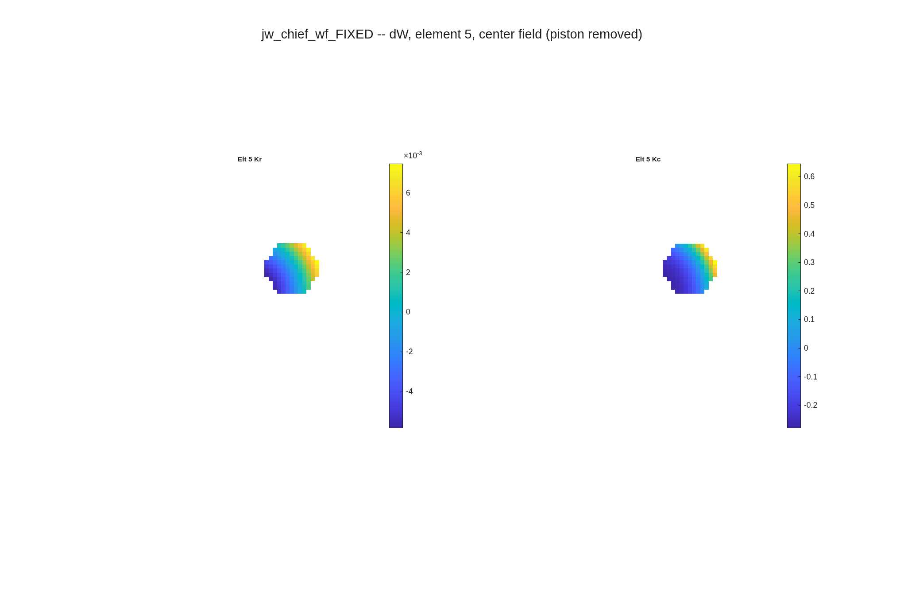

# dw/dsurf on the JWST OTE deck: what each option does to one segment's column
jwst_ote_designc.in (Luis's zoom deck), model 512, 63-ray grid, stop at the FSM (element 25), wavefront read at the ExitPupil Return (27); Seg2 (element 5) poked alone in radius (Kr) and conic (Kc) through run_sensitivities, centre field
~ DRAFT 2026-09-10.  Every figure is the runner's own centre-field page (<name>_pages/*_elt5_center.png), unmodified: MATLAB default colormap, autoscaled, piston removed by the page plotter, zeros not drawn.  Every option shown is a run_sensitivities option since 2026-09-09 ('orient', 'sign', 'opd_ref', and 'elts' now reach the dwdsurf channel).  Numbers: dW/dp per unit parameter, mm of OPD per mm (Kr) / per unit (Kc), centre field, single configuration.

## The OPD reference decides what the unpoked segments read | the runner's own centre-field page, unmodified: mean paints the other 17 segments, chief shows only the poked one
::: left
{h=3.2}
::: right
{h=3.2}
::: full
~ run_sensitivities pages (<name>_pages/*_elt5_center.png), orient xy, sign opl, surf_remove_ptt off, piston removed by the page plotter, MATLAB default colormap, autoscaled.  Under mean the offset on the unpoked segments is -(N_k/N) x mean(poked response): Kr 4.40e-4, Kc 1.66e-2 per unit parameter (5.4% / 4.5% of the poked segment's rms), equal on all 17 to 6e-16.

## Under orient xy the page itself was scrambled | the same chief-reference page before and after the plotter fix; the raw-orientation page was always clean
::: left
{h=3.2}
::: right
{h=3.2}
::: full
~ sensitivities/per_field_indx.m; gate tRunSensitivities/test_per_element_page_index_follows_orient_xy (xy page == raw page transposed to 0; the old recipe differs by more than 10% of the map).  This is the picture Luis was reading as a residual.

## Why: a column is a difference of two referenced maps | poking one segment moves the aperture-mean reference; the chief ray's does not move unless its own segment is poked
::: stack
- Engine OPD :: path length minus a reference: whole-aperture mean (default) or the chief ray's own path (macos.opd_ref)
- Under mean :: the poked segment shifts the mean by (N_k/N) x its mean response; every ray inherits the shift as a piston
- Under chief :: the reference is one ray; on this deck it passes through the virtual centre segment (element 4), so every REAL segment's poke leaves it alone and the other segments read 0
- The one gap :: a deck whose chief ray sits on a real segment (e5hex1: the centre one) moves the reference when that segment is poked; the others then read -m(chief), 5% of that segment's rms for Kr.  A fixed nominal reference length (engine OPDRefRayLen branch, one api wrapper) localises every column
~ Gates: tOpdRef/test_driver_single_segment_poke_is_local_under_chief (e5hex1, driver path; fails on the previous code) and tRunSensitivities/test_dwdsurf_channel_honours_elts_orient_and_opd_ref.  The default stays 'mean' until the fixed-length reference lands: no committed baseline moves.

## PTT removal does not remove the leak; it relabels it as a tilt | with surf_remove_ptt on, the mean and chief pages become identical and a tilt runs across all 18 segments
::: left
{h=3.2}
::: right
{h=3.2}
::: full
~ Runner pages, unmodified.  The fit is global, so the poked segment biases it: the unpoked segments' rms goes from 4.4e-4 (flat offset under mean) to 7.0e-4 (tilt), the same under either reference.

## Orientation transposes the array; sign negates it | raw is the engine array (index 1 along global X), xy is its transpose; wavefront is opl negated
::: left
{h=3.2}
::: right
{h=3.2}
::: full
~ Runner pages, unmodified.  Orientation anchor: Seg2 sits at (X, Y) = (-1137, +657) mm; in the xy page its footprint is at (+10, -6.5) px from the pupil centre, i.e. columns run along xGrid = -X and rows along yGrid = -Y (the deck's source frame).  'xy' fixes the transpose, not the sign of each axis.

## What to run | the options, where they live, and the recommended call on a segmented deck
| option | values | now taken by | recommended (segmented) |
|---|---|---|---|
| opd_ref | mean (default), chief | all 8 dw_d* drivers, the core, run_sensitivities | chief |
| orient | raw (default), xy | same | xy for display |
| sign | opl (default), wavefront | same | as the consumer needs |
| elts | [] (all eligible), ids | run_sensitivities -> all four channels (dwdsurf was dropped) | the segments of interest |
| surf_remove_ptt / remove_ptt | false (default), true | dwdsurf driver + runner | false (not a substitute for the reference) |
~ run_sensitivities(RX, ..., 'channels', "dwdsurf", 'elts', 5, 'orient', 'xy', 'opd_ref', 'chief').  The reference is re-applied after every Rx reload (a load resets it).  Open for Dave: the fixed nominal reference and the default flip (PLAN 0.x).
