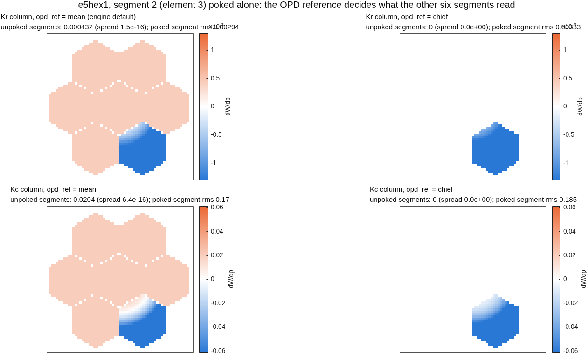
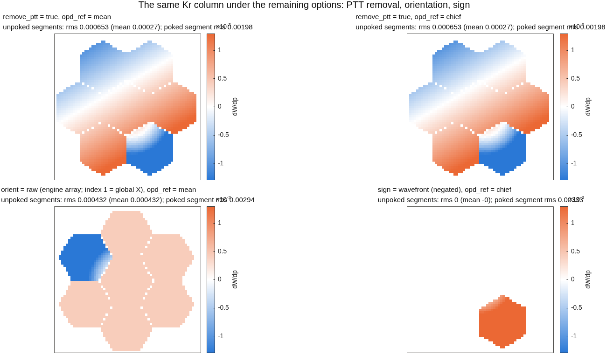

# dw/dsurf on a segmented pupil: what each option does to one segment's column
e5hex1, 7 hex segments, model 128, 63-ray grid; segment 2 (element 3) poked alone in radius (Kr) and conic (Kc)
~ DRAFT 2026-09-09.  Driver macos.dw_dsurf; every option is also a run_sensitivities option since this date.

## The OPD reference decides what the unpoked segments read | mean reference: one constant on the other six; chief reference: exactly zero
::: full
{h=5.0}
~ Offset on the unpoked segments under mean = -(N_k/N) x mean(poked response): Kr 4.32e-4, Kc 2.04e-2 per unit parameter (13% / 11% of the poked segment's rms), equal on all six to 3e-16.  OPD in mm per mm of Kr / per unit Kc; orient xy, sign opl, remove_ptt off.

## Why: a column is a difference of two referenced maps | poking one segment moves the aperture-mean reference; the chief ray's does not move unless its own segment is poked
::: stack
- Engine OPD :: path length minus a reference: whole-aperture mean (default) or the chief ray's own path (macos.opd_ref)
- Under mean :: the poked segment shifts the mean by (N_k/N) x its mean response; every ray inherits the shift as a piston
- Under chief :: the reference is one ray on the centre segment; any other segment's poke leaves it alone -> other segments read 0
- The one gap :: poking the centre segment moves the chief's path too; the others then read -m(chief), 5% of that segment's rms for Kr.  A fixed nominal reference length (engine OPDRefRayLen branch, one api wrapper) localises every column
~ Gate: tOpdRef/test_driver_single_segment_poke_is_local_under_chief (fails on the previous code).  Default stays 'mean' until the fixed-length reference lands: no committed baseline moves.

## The other options do not remove the leak; they relabel it | PTT removal fits the whole column, orientation transposes, sign negates
::: full
{h=5.0}
~ remove_ptt fits global piston/tip/tilt to the whole column: the poked segment biases the fit, so the six unpoked segments trade a flat offset for a tilt and the reference choice no longer matters; orient raw = the engine array (index 1 along global X), xy = imagesc-ready; sign wavefront negates every wavefront output.

## What to run | the options, where they live, and the recommended call on a segmented deck
| option | values | now taken by | recommended (segmented) |
|---|---|---|---|
| opd_ref | mean (default), chief | all 8 dw_d* drivers, the core, run_sensitivities | chief |
| orient | raw (default), xy | same | xy for display |
| sign | opl (default), wavefront | same | as the consumer needs |
| surf_remove_ptt / remove_ptt | false (default), true | dwdsurf driver + runner | false (not a substitute for the reference) |
~ run_sensitivities(RX, ..., 'channels', "dwdsurf", 'orient', 'xy', 'opd_ref', 'chief').  Re-applied after every Rx reload (a load resets the reference).  Open for Dave: the fixed nominal reference and the default flip (PLAN 0.x).
