<!--
deck_dyson.md — dyson5: a VSWIR Dyson imaging spectrometer designed from the spec.
DRAFT — the deck grows with the challenge; every number is from a committed
runner stage in mmacos/challenges/dyson5 (records dyson5_s*.txt).
Build: python3 make_brief_slides.py deck_dyson.md
Figures: the runner's own PNGs, copied unmodified into figs_dyson/ (no crops yet).
Sources: challenges/dyson5/README.md + BRIEF_dyson5_beat{1,2,2c,3}.md (TO),
NOTE_mg2018_digest.md (CC), BRIEF_to_dyson5.md (the lane brief).
Style: doc/DECK_STYLE.md (lean main path, one Backup divider, layout + map per
result slide, figures unmodified, conventions stated once).
-->

# A VSWIR Dyson Imaging Spectrometer, Designed From the Spec
An EMIT-class push-broom spectrometer (F/1.8, 3000 × 500 pixels at 18 µm, 380–2500 nm) designed with MACOS from the public specification alone, scored on smile, keystone and the response functions, and checked by physical-optics propagation.
D. C. Redding, with Claude Code.
October 2026.  Working record; no proprietary prescription is used.
DRAFT — in progress.  Every number is from a committed, parameterized runner (mmacos, `dyson5_run`); records and figures are the runner's own output.  Design of record: the compact variant (step R4): keystone 0.0026 px, smile 0.005 px, CRF 1.33 px, 76 % of the energy in one pixel, at a 220 mm block.  The propagated point-spread function reproduces the ray centroids to 0.002 px, so these are the numbers a detector sees.

## Contents | The target, the methods, the forms, the design ladder, the evidence
::: left
- **3** The target and how it is scored
- **4** The two methods, and the words used here
- **5** The Dyson as traced by the engine
- **6** The Offner as traced by the engine
- **7** The concentric Dyson and its scaling law
- **8** Two independent ray traces agree
- **9** The seed, scored
- **10** The departure ladder
- **11** The departure ladder, by the numbers
::: right
- **12** What each departure buys
- **13** The compact variant, as traced by the engine
- **14** The compact variant: the prescription
- **15** The compact variant in section
- **16** The compact variant, scored
- **17** The trade at a glance
- **18** The propagation twin
- **19** Slit diffraction loss
- **20** Next steps
- **21** Run it yourself
- **22** Backup

## The target and how it is scored | Joe's specification, EMIT-class; the metrics stated once, here
::: left
| item | value |
|---|---|
| F-number (air-equivalent, image space) | 1.8 |
| focal plane | 3000 spatial × 500 spectral pixels, 18 µm |
| slit | 54 mm; spectral height 9 mm |
| band | 380–2500 nm, 4.24 nm per pixel |
| smile, keystone | < 0.1 pixel |
| SRF FWHM | < 1.5–2.0 pixels |
| CRF FWHM | < 1.5 pixels |
| radiometric chain | throughput, grating efficiency, QE, slit loss vs wavelength |
::: right
- **Smile:** centroid drift along the slit at fixed wavelength; **keystone:** drift across wavelength at fixed slit position; both in pixels from ray centroids.
- **SRF, CRF:** slit ⊗ line-spread function ⊗ pixel ⊗ Airy, FWHM in pixels (Mouroulis & Green 2018 definitions); the Airy diameter at 2500 nm is 11 µm, under the 18 µm pixel, so the incoherent chain is valid.
- **Design rules adopted from the literature:** distortion to ~1 % of a pixel at design, > 75 % of the energy in one pixel, degraded spots accepted for uniformity, the grating is the stop.
- **Realism (Jim):** as-built SRF is 2.5–3 pixels, slits are 2 pixels wide, the systems are photon-limited; smile and keystone drive the design.
~ The 54 mm slit is 2.3× EMIT's; Table 3 of the review places this spec in the ALIS class (3200 spatial pixels, 380–2500 nm).  Public comparison point: Carbon-I (arXiv:2505.22545), F/2.2, 2040–2380 nm.

## The two methods, and the words used here | Ray tracing scores the design; wave propagation checks it
::: left
- **Ray tracing (MACOS, "the engine"):** rays leave a point on the slit at one wavelength, refract through the block and meniscus, diffract at the grating into the design order, and land on the detector.  The centroid of the landed rays per slit position and wavelength gives the field-angle and wavelength maps; their drift gives smile and keystone; the spread of the rays, convolved with the slit width and the pixel, gives the response functions.
- **Wave propagation (the "twin"):** the same prescription, but the light is carried as a complex wavefront.  The ray trace sets the phase on a reference sphere before the detector; a Fourier transform propagates it to the detector plane and gives the point-spread function with diffraction.  From it: the centroid again (checked against the rays), ensquared energy with diffraction, the response functions with diffraction.
::: right
- **The chain:** the geometric solver, in MATLAB, that lays out each form from its design conditions, solves the chief ray, the groove period and the focus by exact 3-D ray trace, and writes the prescription the engine traces.  Engine and chain are checked against each other ray by ray.
- **The ladder, steps R0–R4:** the sequence of design freedoms added one at a time, each step re-solved and re-scored.  **Seed:** the starting concentric design.  **Operand:** a quantity the solver drives to a target.  **Trade:** the one table that compares the steps.
- **Ensquared energy:** the fraction of a point image's energy inside one 18 µm pixel.  **SRF, CRF:** spectral and cross-track response functions, the instrument's line shape in the two directions, quoted as FWHM in pixels.
~ Every number in the deck is a committed runner output; records are listed in Backup.

## The Dyson as traced by the engine | The concentric seed with every aperture declared: the beams clear every body; the grating is 270 mm wide on a 0.70 m radius and the slit sits 18 mm from the band
::: left
- **The prescription:** `challenges/dyson5/dyson5_s1_dyson.in`; bodies, rays and labels are read back from the engine.  Radii are |R|; apertures are the declared circular radii (footprint plus 5 mm); z along the axis from the block's face.
| E | name | type | surface | R (mm) | K | aperture r (mm) | z (mm) |
|---|---|---|---|---|---|---|---|
| 1 | BlockFaceIn | Refractor | Flat | - | - | 32.1 | 0.5 |
| 2 | BlockSphereOut | Refractor | Conic | 220.0 | 0 | 73.2 | 220.0 |
| 3 | Grating | Grating | Conic | 708.4 | 0 | 142.6 | 708.4 |
| 4 | BlockSphereIn | Refractor | Conic | 220.0 | 0 | 73.2 | 220.0 |
| 5 | BlockFaceOut | Refractor | Flat | - | - | 32.4 | 0.5 |
| 6 | PreFPA | Reference | Flat | - | - | - | 1.3 |
| 7 | FPA | FocalPlane | Flat | - | - | - | 0.3 |
::: right
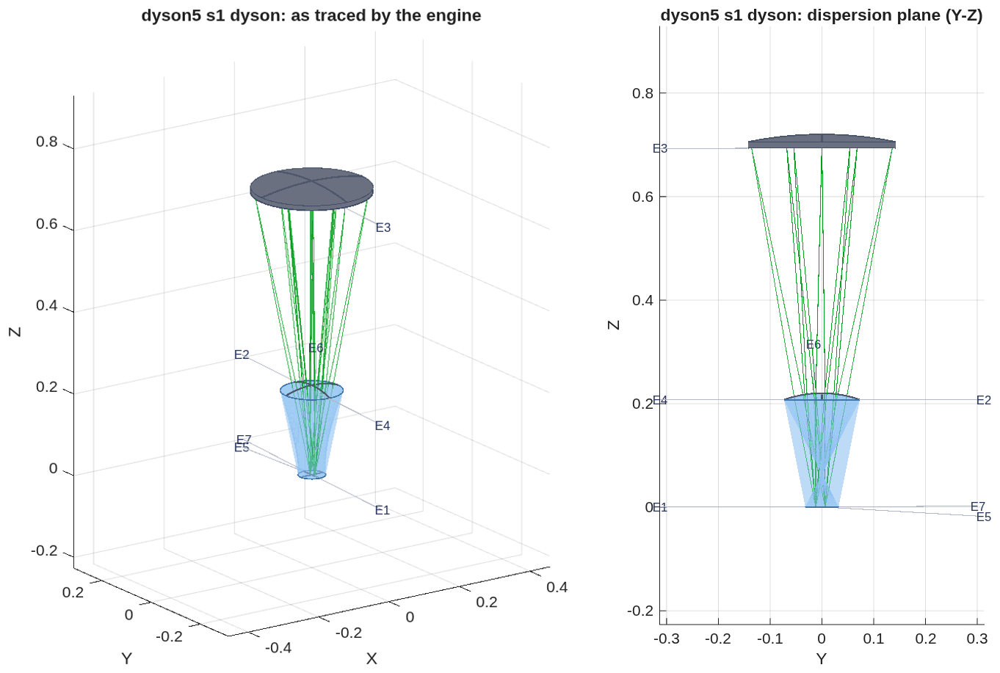
- **Clearance:** the worst pair is the returning beam against the detector carrier, +1.11 mm with no cold shield; the slit sits at +6 mm and this wavelength lands at −12 mm on the same face.

## The Offner as traced by the engine | The all-reflective reference at F/2.8, re-posed at 0.22 R: the two mirror zones with the grating between the beams, clearing its mount by 10.2 mm
::: left
- **The prescription:** `challenges/dyson5/dyson5_s1_offner.in`, F/2.8, slit offset 0.22 R; the concave mirror used in two zones (E1, E3) with the convex grating (E2) at the stop; classical corrections: convex radius × 1.0034, second zone × 0.951 with a 0.3 mm offset.
| E | name | type | surface | R (mm) | K | aperture r (mm) | z (mm) |
|---|---|---|---|---|---|---|---|
| 1 | M1 | Reflector | Conic | 500.0 | 0 | 119.3 | -486.6 |
| 2 | Grating | Grating | Conic | 250.9 | 0 | 49.9 | -250.9 |
| 3 | M3 | Reflector | Conic | 475.5 | 0 | 113.2 | -463.8 |
| 4 | PreFPA | Reference | Flat | - | - | - | -0.8 |
| 5 | FPA | FocalPlane | Flat | - | - | - | 0.2 |
::: right
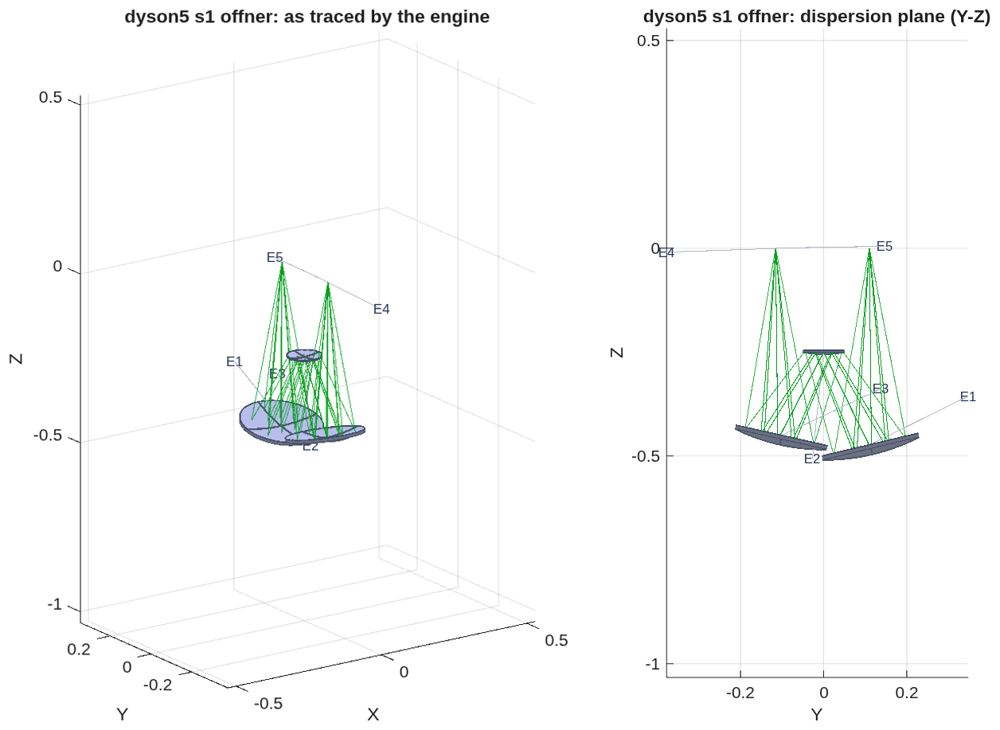
- **As corrected:** keystone 0.028 px, CRF 1.20 px, SRF 3.69 px, 23 % of the energy in one pixel; the beams clear the grating's mount by 10.2 mm.  It is the reference form and the ground where the propagation twin is validated (order 0: pupil OPD 8e-11 m, 85 % in one pixel).

## The concentric Dyson and its scaling law | The classical condition verified by exact trace; at this slit the concentric block needs r ≥ 213 mm
- **The Dyson condition** R_g = n·r / (n − 1) is the blur minimum by exact 3-D trace: 0.67 µm at the condition against 4–5 µm at ±5 %, image at −h, residual fifth order (h⁴·¹⁷, r⁻³·¹⁹).
- **The scaling answer, before any element was added:** a single concentric block meets a quarter-pixel corner blur only at r ≥ 213 mm, about twice flight scale, which is why the flight forms add an asphere, a meniscus or an air gap.
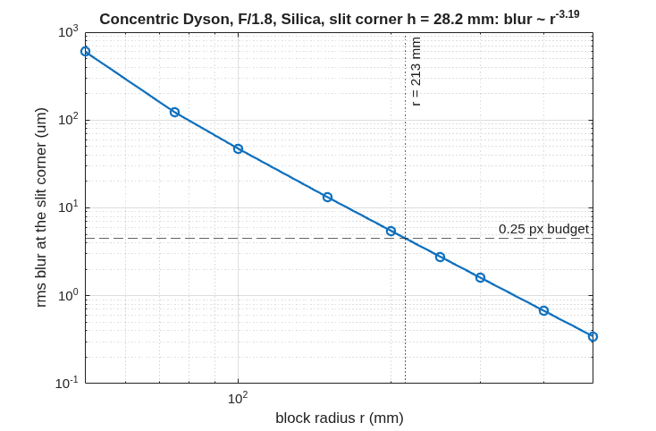

## Two independent ray traces agree | The design solver and MACOS place every ray within a nanometre of each other, so the prescription is what the solver intended
::: left
- **Two programs, one prescription.** The design solver (MATLAB) lays out each form from its design rules and writes the prescription.  MACOS then traces that prescription on its own.  The check: every ray MACOS launches is re-traced by the solver through the same surfaces, and the two land within 1e-9 m at every surface; the dispersed band spans the detector to 1 %.
- **The check is not trivial.** With the aspheric block face of ladder step R2 the agreement is 1e-12 m per ray, while a solver that ignores the asphere misses by 0.26 mm.
- **Wave propagation agrees too.** On the Offner at order 0 the propagated point image is a clean Airy pattern, 85 % of its energy in one pixel, with a pupil error of 8e-11 m.
::: right
- **What the checks found in MACOS, and fixed** (details in Backup): glass names were ignored when a prescription loaded; propagation inside glass used the vacuum wavelength; a grating's groove spacing was held constant along the curved surface instead of along the chord; the grating's path-length term had the matching defect.  Each now has a regression test written from the physics.
~ Regression tests: 15 in five classes; the MACOS fast suite stands at 504 pass, 0 fail (2026-10-01).

## The seed, scored | The concentric seed at a 220 mm block meets smile; keystone and the corner blur are the work
- **Smile is met at the seed** (below 0.01 pixel on both forms); the field-angle map is linear along the slit as designed.
- **SRF sits at 2.02 pixels on both forms**, the floor set by the 2-pixel slit; re-scored on the engine after the grating fixes (the earlier ramp with wavelength was the groove-period defect, not the design).
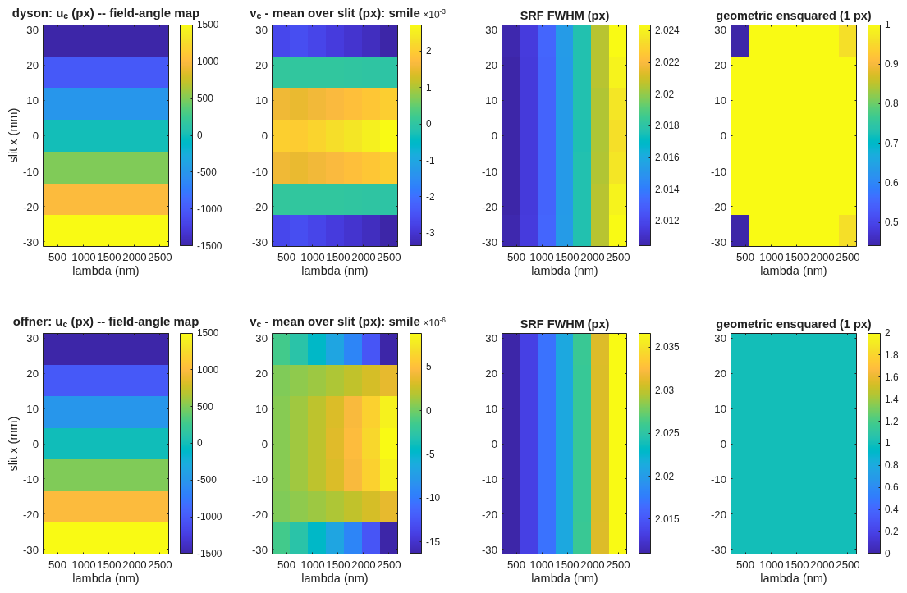

## The departure ladder | Each step solved on the exact chain with pixel-unit smile and keystone in the merit from the first pass, then emitted and scored in the engine
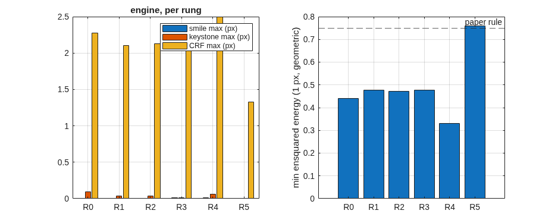

## The departure ladder, by the numbers | Keystone falls 37-fold at fixed scale; the meniscus pays only with the block offset and grating radius moving with it
::: full
| step | what moves | keystone (px) | smile (px) | CRF FWHM (px) | ensquared, 1 px | length (mm) | grating footprint (mm) | glass (L) |
|---|---|---|---|---|---|---|---|---|
| R0 | concentric seed | 0.095 | 0.006 | 2.28 | 0.44 | 708 | 275 | 22.2 |
| R1 | grating-radius factor, face offset | 0.038 | 0.003 | 2.10 | 0.48 | 704 | 274 | 22.3 |
| R2 | + conic and h⁴, h⁶ terms on the block face | 0.037 | 0.004 | 2.13 | 0.47 | 704 | 274 | 22.3 |
| R3 | + block centre off the grating's, along the dispersion | 0.011 | 0.008 | 2.10 | 0.48 | 698 | 272 | 22.1 |
| R4a | meniscus corrector alone | 0.063 | 0.012 | 2.49 | 0.33 | 698 | 270 | 22.3 |
| **R4** | **meniscus with all variables (the compact variant)** | **0.0026** | 0.005 | **1.33** | **0.76** | 694 | 269 | 22.7 |
| size alone | block radius free (341 mm) | 0.024 | 0.001 | 1.34 | 0.74 | 1099 | 427 | 82.8 |
~ SRF FWHM is 2.02–2.05 px on every step: the 2-pixel-slit floor.  Length = slit plane to grating vertex; footprint = diameter of the grating hits over slit centre and ends × band edges; glass = block cap + meniscus.  Record `dyson5_s3_trade.txt`.

## What each departure buys | De-concentring the block solves the distortion; the face asphere is inert; the blur is bought only by size or by the compact form
::: left
- **Keystone:** 0.095 → 0.011 pixels at fixed scale, nine times inside the 0.1-pixel specification and at the literature's 1 % design rule; smile stays below 0.01 pixel throughout.
- **The block-face asphere does nothing here:** step R2 converges to 10 nm sags, and a one-dimensional scan about R1 is a steep bowl centred at zero.  An axisymmetric figure acts on every field point alike and cannot cancel a residual that grows as h⁴ along the slit.
::: right
- **The blur does not move on any step, and the reason is on record:** the dispersed image sits 12 mm from the order-0 image, so the slit corner's effective field height is about 32 mm, and the h⁴/r³ law predicts the measured 0.4 px rms.
- **Two routes buy it:** size alone (0.74 ensquared at a 341 mm block, 1.1 m long, 83 L of glass) or the compact variant: a meniscus corrector in the air gap, solved together with the block offset and the grating radius, reaches the same at the 220 mm block — 63 % of the length, 27 % of the glass.
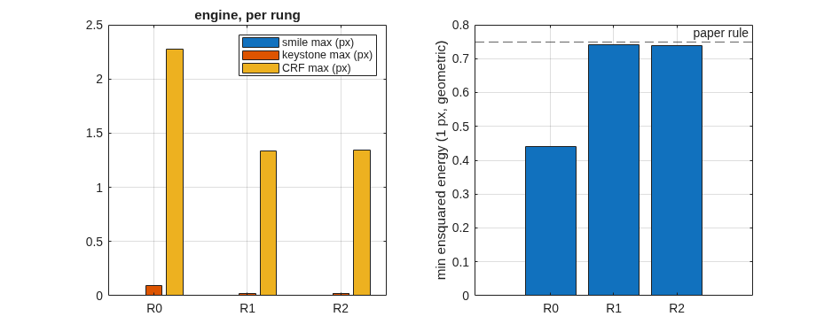

## The compact variant, as traced by the engine | Step R4: the meniscus corrector in the air gap between the block and the grating; the design of record at a 220 mm block
- **Eleven surfaces:** the block's flat and spherical faces, the meniscus, the grating, and the same faces again on the way back to the focal plane; the element table is on the next slide.
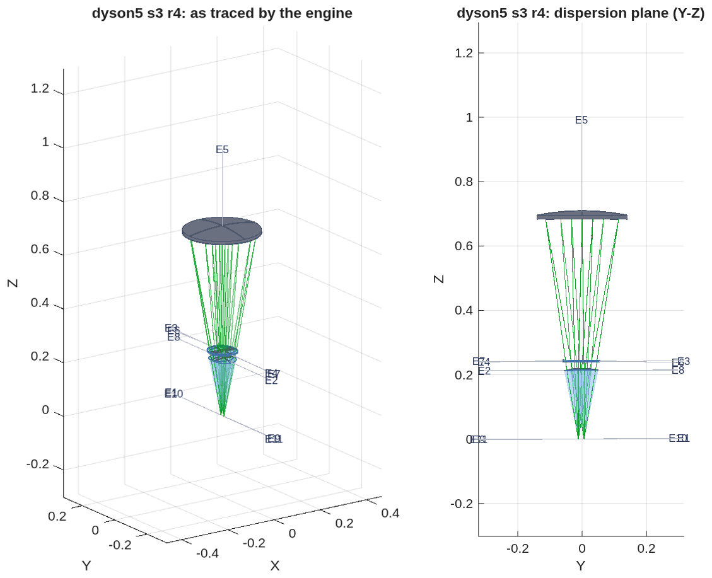
- **Clearance:** the returning beam passes the detector carrier by 1.19 mm with no cold shield; any shield fails the check, so a fold prism at the slit is the next layout step.

## The compact variant: the prescription | The eleven elements of step R4 as written in `dyson5_s3_r4.in`; radii are |R|, apertures the declared circular radii, z along the axis from the block's face
::: full
| E | name | type | surface | R (mm) | K | aperture r (mm) | z (mm) |
|---|---|---|---|---|---|---|---|
| 1 | BlockFaceIn | Refractor | Flat | - | - | 32.2 | 0.7 |
| 2 | BlockSphereOut | Refractor | Aspheric | 220.0 | -0.00650944 | 73.0 | 219.1 |
| 3 | MenA_out | Refractor | Conic | 1828.1 | 0 | 77.7 | 240.0 |
| 4 | MenB_out | Refractor | Conic | 2000.0 | 0 | 78.0 | 244.0 |
| 5 | Grating | Grating | Conic | 697.8 | 0 | 140.1 | 697.8 |
| 6 | MenB_in | Refractor | Conic | 2000.0 | 0 | 78.1 | 244.0 |
| 7 | MenA_in | Refractor | Conic | 1828.1 | 0 | 77.8 | 240.0 |
| 8 | BlockSphereIn | Refractor | Aspheric | 220.0 | -0.00650944 | 73.1 | 219.1 |
| 9 | BlockFaceOut | Refractor | Flat | - | - | 32.6 | 0.7 |
| 10 | PreFPA | Reference | Flat | - | - | - | 0.9 |
| 11 | FPA | FocalPlane | Flat | - | - | - | -0.1 |
~ The two block faces and the meniscus appear twice because the light passes them on the way out and back; the engine traces them as separate surfaces.

## The compact variant in section | Dispersion plane and slit direction, to scale: block, meniscus, grating; slit and focal plane on the block's face
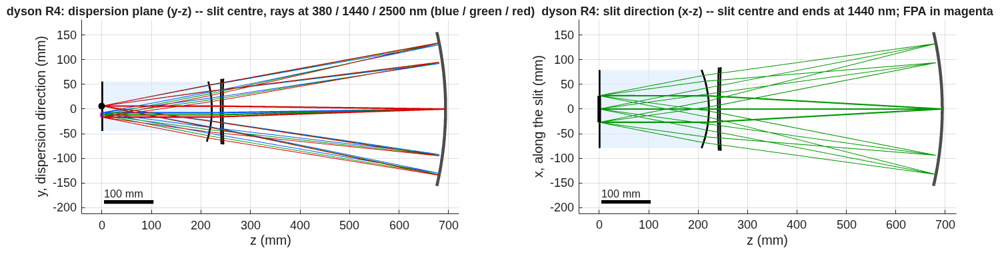
- **Sizes:** block radius 220 mm (217 mm thick, 85 mm face), meniscus 4 mm thick at radii near 2 m, grating 269 mm across on a 0.69 m radius; slit plane to grating vertex 694 mm.
- **The solve ends on its bounds** (plate thickness and radii), and three solves from the same seed found a multimodal landscape; the global search over the meniscus is the next step.

## The compact variant, scored | Keystone 0.0026 px, smile 0.005 px, CRF 1.33 px, SRF 2.03 px; ensquared energy 0.76 geometric and 0.75 with diffraction
- **Checked by propagation:** the point-spread function's centroid equals the ray centroid to 0.0022 px along the dispersion and 0.0003 px along the slit at every slit position and wavelength, so a detector sees these numbers.
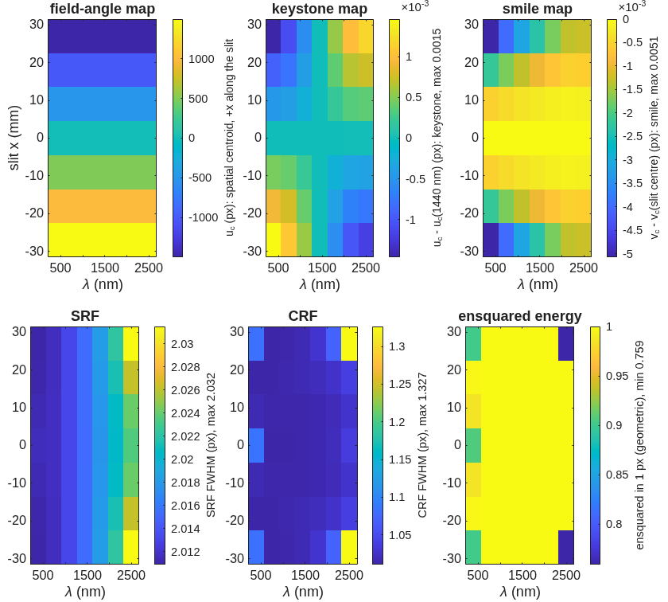

## The trade at a glance | Distortion, response functions and ensquared energy per step, both records; the specification and the literature rules as lines
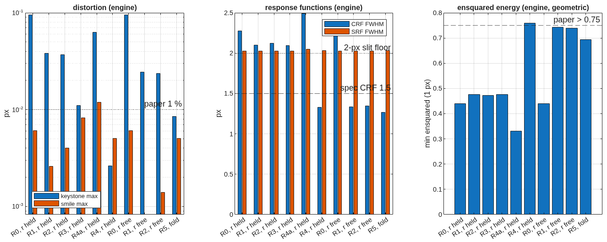

## The propagation twin | A far-field terminal on a reference sphere, re-posed per slit position and wavelength, agrees with the ray centroids to 0.0013 px
- **What it checks:** the ray-side scorer's centroids and response functions against physical-optics propagation through the same decks; across a grating the comparison is made in phase (modulo λ), never as unwrapped lengths.
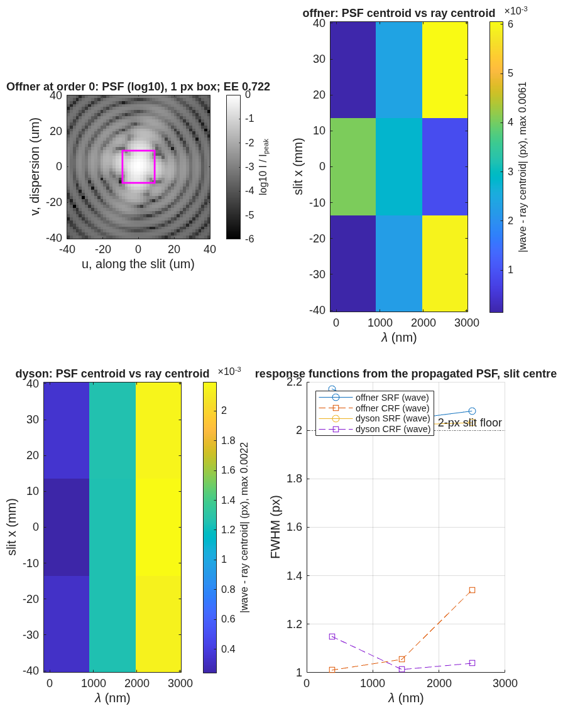

## Slit diffraction loss | A 36 µm slit at F/1.8: the engine's far-field leg against the sinc² closed form
- **The model:** a uniformly lit 36 µm slit of zero length, propagated as a far-field wave to the grating's plane 0.70 m away on a 255-point grid; loss = the energy landing outside the F/1.8 acceptance.  The closed form is the exact sinc² integral for the same slit and acceptance.
- **Under 2.5 % over the band by both,** but they disagree by a factor that changes sign: the engine reads 0.3× the closed form at 380 nm and 1.36× at 2500 nm.  Which of the grid, the window (11 % wider than the acceptance) or the slit's missing length explains it is being tested; the number is not yet design-grade.
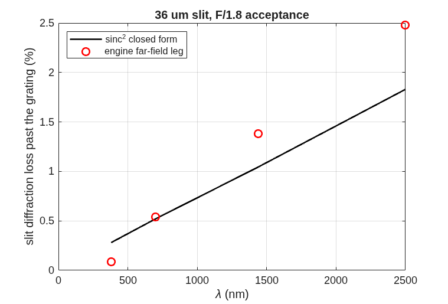

## Next steps | Clearance on the design of record, the global meniscus search, and the telescope that feeds the slit
::: left
- **R5, the slit-to-detector split:** the returning beam clears the detector carrier by 1.2 mm with no cold shield; a fold prism at the slit (the literature's answer) is the next layout step, scored under the same clearance check.
- **Beat 4:** a global search over the meniscus (the R4 solve ends on its bounds), then the native multi-wavelength optimizer with the same smile and keystone operands.
::: right
- **Beat 5, the telescope:** EMIT parameters — 420 km, 60 m ground sample, 0.143 mrad IFOV, focal length 126 mm, 70 mm aperture at F/1.8, 24.6° cross-track field onto the 54 mm slit, telecentric and flat; the telescope's exit pupil on the grating.  Then spectrometer and telescope traced end to end as one deck.
- **Then the radiometric chain against the band.**
- **Future work, once the design of record is stable:** a surface-by-surface tour of the prescription (role, ray footprint, clearance, and the field where a propagation leg ends, per surface); spot diagrams in the Mouroulis & Green form, slit positions down and wavelengths across inside the 18 µm pixel box; the telescope and the end-to-end instrument; polarization sensitivity of the Dyson against the Offner, since the Dyson's near-normal incidence is what the literature credits for its low sensitivity.

## Run it yourself | One parameter file, one runner, every stage through it
::: full
```
cd <path>/MACOS_resources/mmacos                   % the mmacos folder of the repository (the engine is built already)
matlab                                            % start MATLAB here
>> run('mmacos_setup.m');                          % puts the engine and the design tools on the path
>> addpath('challenges/dyson5');
>> OUT = dyson5_run();                             % stage s0 only: the scaling law, no engine needed
>> OUT = dyson5_run(struct('stages', {{'s1','s2','s3'}}));   % emit the decks, score them, run the ladder
>> OUT = dyson5_run(struct('Fno', 2.0, 'block_r_m', 0.25, 'stages', {{'s1','s2','s3'}}));  % your own instance
```
- **Changeable design parameters live in one file, `dyson5_params.m`:** F-number, pixel count and pitch, band, slit width in pixels, block radius, glass, diffraction order, the slit offset, the ladder's steps and weights, the aperture and mount margins, the detector package.  Pass any of them as fields of the struct to drive a different solution; every record in this deck is a stage output under `challenges/dyson5/`.
- **Where designs have closed so far:** F/1.8 with a 220 mm silica block, 54 mm slit, 380–2500 nm, 18 µm pixels, order 1 (the design of record); block radii 50–500 mm scanned at order 0 for the scaling law, where a concentric block meets the quarter-pixel blur only above 213 mm; the Offner reference at F/2.8.  The meniscus solve ends on its bounds, so outside this envelope (faster than F/1.8, blocks under 150 mm, slits beyond 54 mm) closure is untested; a sweep is queued.
- **Checks:** `./run_mmacos_tests.sh tSpectrometerRx` and the four grating, glass and propagation classes, all in the fast suite.

## Backup
Diagnostics, the engine findings, and the conventions behind the main path.

## Backup: four engine findings, each with a regression test | Found by the challenge's checks on 2026-09-30 and 10-01, fixed in the engine the same day
::: full
| finding | symptom | fix | test |
|---|---|---|---|
| glass names ignored at load | a `GlassElt= Silica` element traced as air in every binding | the glass catalog is blanked once at allocation, not on every load | `tGlassDispersion` (3) |
| vacuum wavelength inside glass | a propagation leg in a medium ran at the wrong Fresnel number by n | every kernel takes λ/n of the leg's medium | `tPropMedium` (3): z in n ≡ z/n in vacuum |
| groove period along the surface | 2.8 / 3.3 px rms spectral blur at 2500 nm (Offner / Dyson) | the local grating vector is the un-normalised projection of the ruling direction (chord-ruled) | `tGratingImmersed` (4), `test_grating_chord` |
| grating path-length jump | 4 waves rms of pupil OPD where the rays converged to 0.05 µm | the jump is the groove count from the vertex along the ruling direction | `tGratingOpl` (2) |
~ Flat gratings are unchanged by the last two.  A fifth item, a short `AsphCoef=` line killing the host process, now pads with zero and warns (`tRxShortAsph`).

## Backup: records and tools behind each slide | Every number traces to a runner stage and its record file
::: full
| slide | runner stage | record | tool |
|---|---|---|---|
| scaling law | s0 (engine-free) | `dyson5_s0_scaling.txt` | `design/src/dyson_layout.m`, `dyson_scaling.m` |
| as traced (both forms) | `dyson5_view_figs.m` | `*_view3d.png`, `*_viewyz.png` | `macos.view_rx` on the deck |
| seed scored | s1 emit, s2 score | `dyson5_s1.txt`, `dyson5_s2.txt`, `dyson5_s2_maps.png` | `spectrometer_geom.m`, `spectrometer_rx.m`, `spectrometer_score.m` |
| chain vs engine | gate | `tests/tSpectrometerRx.m` | per-ray re-trace, 1e-9 m |
| propagation twin | s2w (opt-in, model 512) | `dyson5_s2w.txt` | `spectrometer_wave.m` |
| departure ladder, R4, trade | s3, s3free, s3b | `dyson5_s3.txt`, `dyson5_s3free.txt`, `dyson5_s3_trade.txt`, `dyson5_s3_layout_r*.png`, `dyson5_s3_maps_r*.png` | `dyson_ladder.m`, `dyson5_trade.m` |
| slit loss | s2l | `dyson5_s2l.txt`, `dyson5_s2l_slitloss.png` | far-field leg vs sinc² |
~ Conventions behind the scaling law: block index n(silica, 1 µm) = 1.450417; in-glass marginal half-angle u = asin(1 / 2nF); field height h from the Dyson axis on the flat face; the slit corner is h = hypot(27 mm, 8 mm).

## Backup: conventions pinned on the way | Engine facts the chain depends on, stated once
::: left
- **`ChfRayPos`** is where rays start and must lie before the first surface; at load the engine folds `zSource` in once, after which it is the physical source.
- **`macos.stop`** aims immediately and its first pass is one step short on this deck (3.6 mrad): declare the stop first, then write the exact chief ray.
- **A `Return` coincident with the focal plane drops the rays**; use a `Reference` upstream.
::: right
- **An immersed grating carries its glass on its own element**: the grating branch takes the exit index from the element as written.
- **`ray_info_get`** returns the outgoing direction at the traced element.
- **Centre of curvature** is the vertex plus |Kr| along `psiElt`; `KrElt` is stored as −|R|.
~ Reference document: `optical_design/SPECTROMETER_DESIGN_REFERENCE.md` (forms, conditions, metrics, references).
