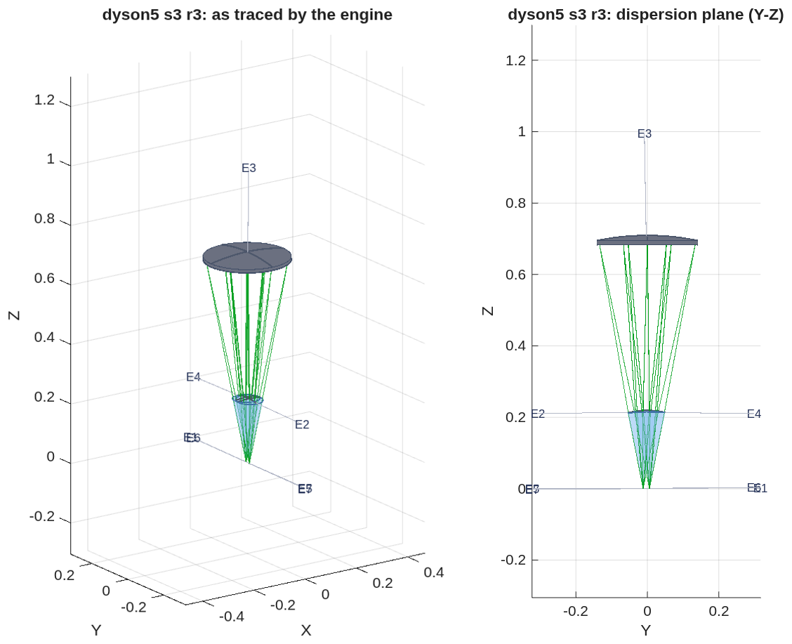
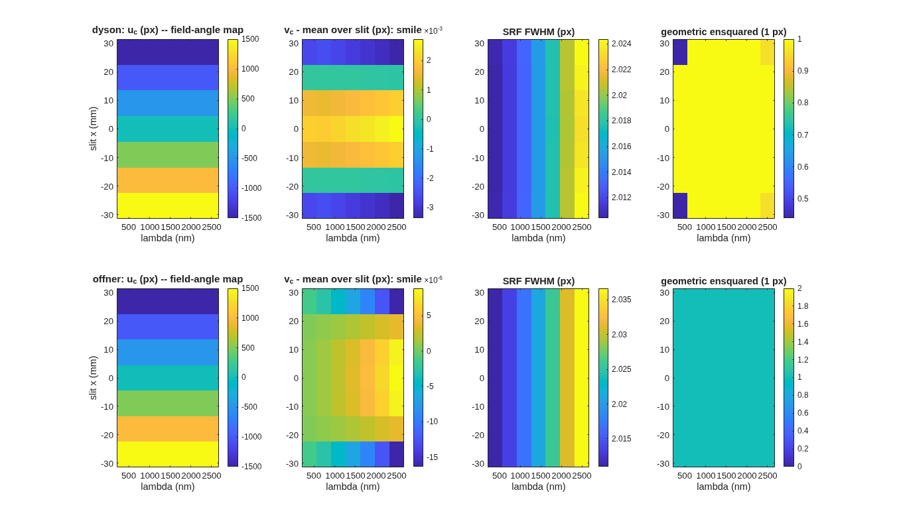

<!--
deck_dyson.md — dyson5: a VSWIR Dyson imaging spectrometer designed from the spec.
DRAFT — the deck grows with the challenge; every number is from a committed
runner stage in mmacos/challenges/dyson5 (records dyson5_s*.txt).
Build: python3 make_brief_slides.py deck_dyson.md
Figures: the runner's own PNGs, copied unmodified into figs_dyson/ (no crops yet).
Sources: challenges/dyson5/README.md + BRIEF_dyson5_beat{1,2,2c,3}.md (TO),
NOTE_mg2018_digest.md (CC), BRIEF_to_dyson5.md (the lane brief).
Style: doc/DECK_STYLE.md (lean main path, one Backup divider, layout + map per
result slide, figures unmodified, conventions stated once).
-->

# A VSWIR Dyson Imaging Spectrometer, Designed From the Spec
An EMIT-class push-broom spectrometer (F/1.8, 3000 × 500 pixels at 18 µm, 380–2500 nm) designed with MACOS from the public specification alone, scored on smile, keystone and the response functions, and checked by physical-optics propagation.
D. C. Redding, with Claude Code.
October 2026.  Working record; no proprietary prescription is used.
DRAFT — in progress.  Every number is from a committed, parameterized runner (mmacos, `dyson5_run`); records and figures are the runner's own output.

## Contents | The target, the forms, the design ladder, the evidence
::: left
- **3** The target and how it is scored
- **4** The Dyson as traced by the engine
- **5** The Offner as traced by the engine
- **6** The concentric Dyson and its scaling law
- **7** The exact chain and the engine agree
- **8** The seed, scored
- **9** The departure ladder
::: right
- **10** The departure ladder, by the numbers
- **11** What each departure buys
- **12** Next: the compact variant
- **13** Run it yourself
- **14** Backup

## The target and how it is scored | Joe's specification, EMIT-class; the metrics stated once, here
::: left
| item | value |
|---|---|
| F-number (air-equivalent, image space) | 1.8 |
| focal plane | 3000 spatial × 500 spectral pixels, 18 µm |
| slit | 54 mm; spectral height 9 mm |
| band | 380–2500 nm, 4.24 nm per pixel |
| smile, keystone | < 0.1 pixel |
| SRF FWHM | < 1.5–2.0 pixels |
| CRF FWHM | < 1.5 pixels |
| radiometric chain | throughput, grating efficiency, QE, slit loss vs wavelength |
::: right
- **Smile:** centroid drift along the slit at fixed wavelength; **keystone:** drift across wavelength at fixed slit position; both in pixels from ray centroids.
- **SRF, CRF:** slit ⊗ line-spread function ⊗ pixel ⊗ Airy, FWHM in pixels (Mouroulis & Green 2018 definitions); the Airy diameter at 2500 nm is 11 µm, under the 18 µm pixel, so the incoherent chain is valid.
- **Design rules adopted from the literature:** distortion to ~1 % of a pixel at design, > 75 % of the energy in one pixel, degraded spots accepted for uniformity, the grating is the stop.
- **Realism (Jim):** as-built SRF is 2.5–3 pixels, slits are 2 pixels wide, the systems are photon-limited; smile and keystone drive the design.
~ The 54 mm slit is 2.3× EMIT's; Table 3 of the review places this spec in the ALIS class (3200 spatial pixels, 380–2500 nm).  Public comparison point: Carbon-I (arXiv:2505.22545), F/2.2, 2040–2380 nm.

## The Dyson as traced by the engine | Step R3 of the ladder: silica block, air gap, concave grating at the stop; rays from the slit return dispersed to the focal plane on the block's face
- **The prescription:** `challenges/dyson5/dyson5_s3_r3.in`, seven elements; the block's spherical face (E2), the grating (E3, radius 0.71 m at the Dyson condition for a 220 mm block), and the focal plane on the flat face.  Bodies, rays and labels are read back from the engine.
- **The slit sits on the block's flat face**, so the glass is the source medium and only the spherical face is a refracting element; the dispersion is the fan in the right-hand (Y-Z) view returning to the face.


## The Offner as traced by the engine | The all-reflective twin: concave mirror, convex grating at the common centre, concave mirror; all in air
- **The prescription:** `challenges/dyson5/dyson5_s1_offner.in`, five elements; the concave mirror (E1, used twice), the convex grating (E2) at the stop, the focal plane at the slit's conjugate.
- **Why it is in the deck:** it is where the physical-optics twin is validated (order 0: pupil OPD 8e-11 m, 94 % of the energy in one pixel), and it is the trade's reference form.


## The concentric Dyson and its scaling law | The classical condition verified by exact trace; at this slit the concentric block needs r ≥ 213 mm
- **The Dyson condition** R_g = n·r / (n − 1) is the blur minimum by exact 3-D trace: 0.67 µm at the condition against 4–5 µm at ±5 %, image at −h, residual fifth order (h⁴·¹⁷, r⁻³·¹⁹).
- **The scaling answer, before any element was added:** a single concentric block meets a quarter-pixel corner blur only at r ≥ 213 mm, about twice flight scale, which is why the flight forms add an asphere, a meniscus or an air gap.


## The exact chain and the engine agree | Every engine ray re-traced by the chain from the engine's own launch directions lands within 1e-9 m
::: left
- **The check:** the engine's chief ray and every ray of its grid are re-traced through the chain's surfaces from the engine's launch directions; agreement is per ray, every surface, 1e-9 m; the dispersed band spans the focal plane to 1 %.
- **With the aspheric block face (ladder step R2):** agreement 1e-12 m per ray; a sphere-only chain misses by 0.26 mm, so the check is not vacuous.
- **The physical-optics twin:** a far-field terminal on a reference sphere upstream of the focal plane, re-posed per slit position and wavelength; on the Offner at order 0 the pupil OPD is 8e-11 m and the Airy spot puts 94 % of its energy in one 18 µm pixel.
::: right
- **What the checks found in the engine, now fixed** (details in Backup): glass names were ignored at load; propagation inside glass used the vacuum wavelength; the grating groove period was held constant along the curved surface instead of along the chord; the grating's path-length jump had the matching defect.  Each has a regression test written from the physics, not from the engine.
~ Regression tests: `tSpectrometerRx` (3), `tGratingOpl` (2), `tGratingImmersed` (4), `tGlassDispersion` (3), `tPropMedium` (3); mmacos fast suite 501 pass, 0 fail (2026-10-01).

## The seed, scored | The concentric seed at a 220 mm block meets smile; keystone and the corner blur are the work
- **Smile is met at the seed** (below 0.01 pixel on both forms); the field-angle map is linear along the slit as designed.
- **These maps predate the grating fixes of 2026-10-01:** the SRF ramp with wavelength is the groove-period defect, not the design; the re-scored maps replace this figure.


## The departure ladder | Each step solved on the exact chain with pixel-unit smile and keystone in the merit from the first pass, then emitted and scored in the engine


## The departure ladder, by the numbers | Keystone falls nine-fold at fixed scale; smile and SRF stay at their floors
::: full
| step | what moves | keystone (px) | smile (px) | CRF FWHM (px) | ensquared, 1 px |
|---|---|---|---|---|---|
| R0 | concentric seed | 0.095 | 0.006 | 2.28 | 0.44 |
| R1 | grating-radius factor, face offset | 0.038 | 0.003 | 2.10 | 0.48 |
| R2 | + conic and h⁴, h⁶ terms on the block face | 0.037 | 0.004 | 2.13 | 0.47 |
| R3 | + block centre 0.86 mm off the grating's, along the dispersion | **0.011** | 0.008 | 2.10 | 0.48 |
~ SRF FWHM is 2.02 px on every step: the floor set by the 2-pixel slit.  Records `dyson5_s3.txt`; the free-radius variant in `dyson5_s3free.txt`.

## What each departure buys | De-concentring the block solves the distortion; the face asphere is inert; the blur is bought only by size or by the compact form
::: left
- **Keystone:** 0.095 → 0.011 pixels at fixed scale, nine times inside the 0.1-pixel specification and at the literature's 1 % design rule; smile stays below 0.01 pixel throughout.
- **The block-face asphere does nothing here:** step R2 converges to 10 nm sags, and a one-dimensional scan about R1 is a steep bowl centred at zero.  An axisymmetric figure acts on every field point alike and cannot cancel a residual that grows as h⁴ along the slit.
::: right
- **The blur does not move on any step, and the reason is on record:** the dispersed image sits 12 mm from the order-0 image, so the slit corner's effective field height is about 32 mm, and the h⁴/r³ law predicts the measured 0.4 px rms.
- **Two routes buy it:** size alone (the free-radius variant reaches 0.74 ensquared at a 341 mm block) or the literature's compact variant, a separate mirror and a meniscus — the next step.


## Next: the compact variant | Step R4 under the identical operands and scorer, so the trade is one table
::: left
- **R4:** the compact Dyson of the review — a separate mirror and a meniscus — solved on the same chain with the same smile and keystone operands, emitted and engine-scored like every other step.
- **One trade table:** R3 (de-concentred block at 220 mm), the free-radius block (341 mm), and R4, on keystone, smile, CRF, SRF, ensquared energy, length, footprint, element count and glass volume.
::: right
- **Then the physical-optics twin on the chosen design:** PSF centroids against ray centroids, SRF and CRF from the propagated PSF, the slit-width diffraction loss against the sinc² closed form.
- **Then the native multi-wavelength optimizer** with the same operands, to confirm the chain's optimum from the engine side.
~ Across a grating the wavefront is defined only modulo λ (the groove staircase); every OPD comparison in the twin is made in phase or on the complex field, never as unwrapped lengths.

## Run it yourself | One parameter file, one runner, every stage through it
::: full
```
run('<path>/mmacos/mmacos_setup.m');
addpath('<path>/mmacos/challenges/dyson5');
OUT = dyson5_run();                                      % stage s0: the scaling law (engine-free)
OUT = dyson5_run(struct('stages', {{'s1','s2','s3'}}));  % emit, score, ladder
```
- **Knobs** live in `dyson5_params.m` (F-number, pixel, band, slit, block radius, ladder options); every record in this deck is a stage output under `challenges/dyson5/`.
- **Engine checks:** `./run_mmacos_tests.sh tSpectrometerRx` and the four grating / glass / propagation classes, all in the fast suite.

## Backup
Diagnostics, the engine findings, and the conventions behind the main path.

## Backup: four engine findings, each with a regression test | Found by the challenge's checks on 2026-09-30 and 10-01, fixed in the engine the same day
::: full
| finding | symptom | fix | test |
|---|---|---|---|
| glass names ignored at load | a `GlassElt= Silica` element traced as air in every binding | the glass catalog is blanked once at allocation, not on every load | `tGlassDispersion` (3) |
| vacuum wavelength inside glass | a propagation leg in a medium ran at the wrong Fresnel number by n | every kernel takes λ/n of the leg's medium | `tPropMedium` (3): z in n ≡ z/n in vacuum |
| groove period along the surface | 2.8 / 3.3 px rms spectral blur at 2500 nm (Offner / Dyson) | the local grating vector is the un-normalised projection of the ruling direction (chord-ruled) | `tGratingImmersed` (4), `test_grating_chord` |
| grating path-length jump | 4 waves rms of pupil OPD where the rays converged to 0.05 µm | the jump is the groove count from the vertex along the ruling direction | `tGratingOpl` (2) |
~ Flat gratings are unchanged by the last two.  A fifth item, a short `AsphCoef=` line killing the host process, now pads with zero and warns (`tRxShortAsph`).

## Backup: records and tools behind each slide | Every number traces to a runner stage and its record file
::: full
| slide | runner stage | record | tool |
|---|---|---|---|
| scaling law | s0 (engine-free) | `dyson5_s0_scaling.txt` | `design/src/dyson_layout.m`, `dyson_scaling.m` |
| as traced (both forms) | `dyson5_view_figs.m` | `*_view3d.png`, `*_viewyz.png` | `macos.view_rx` on the deck |
| seed scored | s1 emit, s2 score | `dyson5_s1.txt`, `dyson5_s2.txt`, `dyson5_s2_maps.png` | `spectrometer_geom.m`, `spectrometer_rx.m`, `spectrometer_score.m` |
| chain vs engine | gate | `tests/tSpectrometerRx.m` | per-ray re-trace, 1e-9 m |
| propagation twin | s2w (opt-in, model 512) | `dyson5_s2w.txt` | `spectrometer_wave.m` |
| departure ladder | s3, s3free | `dyson5_s3.txt`, `dyson5_s3free.txt`, `dyson5_s3*_ladder.png` | `dyson_ladder.m` |
~ Conventions behind the scaling law: block index n(silica, 1 µm) = 1.450417; in-glass marginal half-angle u = asin(1 / 2nF); field height h from the Dyson axis on the flat face; the slit corner is h = hypot(27 mm, 8 mm).

## Backup: conventions pinned on the way | Engine facts the chain depends on, stated once
::: left
- **`ChfRayPos`** is where rays start and must lie before the first surface; at load the engine folds `zSource` in once, after which it is the physical source.
- **`macos.stop`** aims immediately and its first pass is one step short on this deck (3.6 mrad): declare the stop first, then write the exact chief ray.
- **A `Return` coincident with the focal plane drops the rays**; use a `Reference` upstream.
::: right
- **An immersed grating carries its glass on its own element**: the grating branch takes the exit index from the element as written.
- **`ray_info_get`** returns the outgoing direction at the traced element.
- **Centre of curvature** is the vertex plus |Kr| along `psiElt`; `KrElt` is stored as −|R|.
~ Reference document: `optical_design/SPECTROMETER_DESIGN_REFERENCE.md` (forms, conditions, metrics, references).
