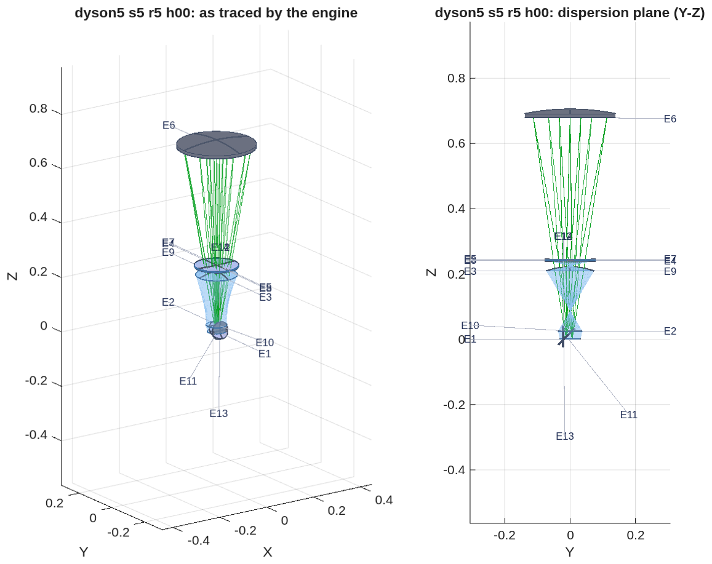
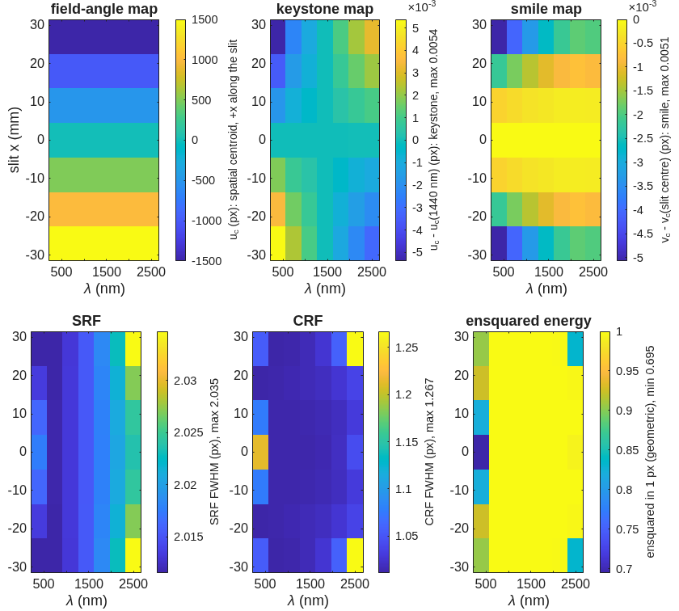
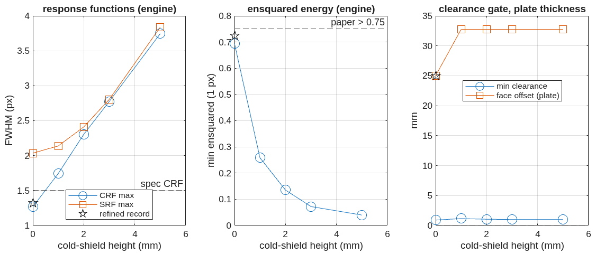
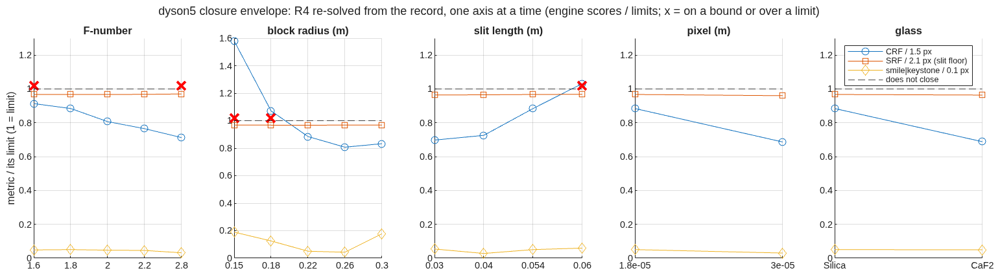
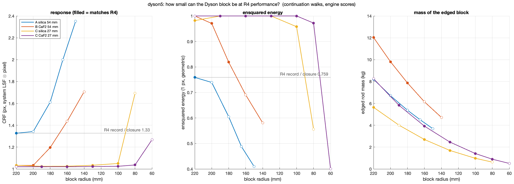
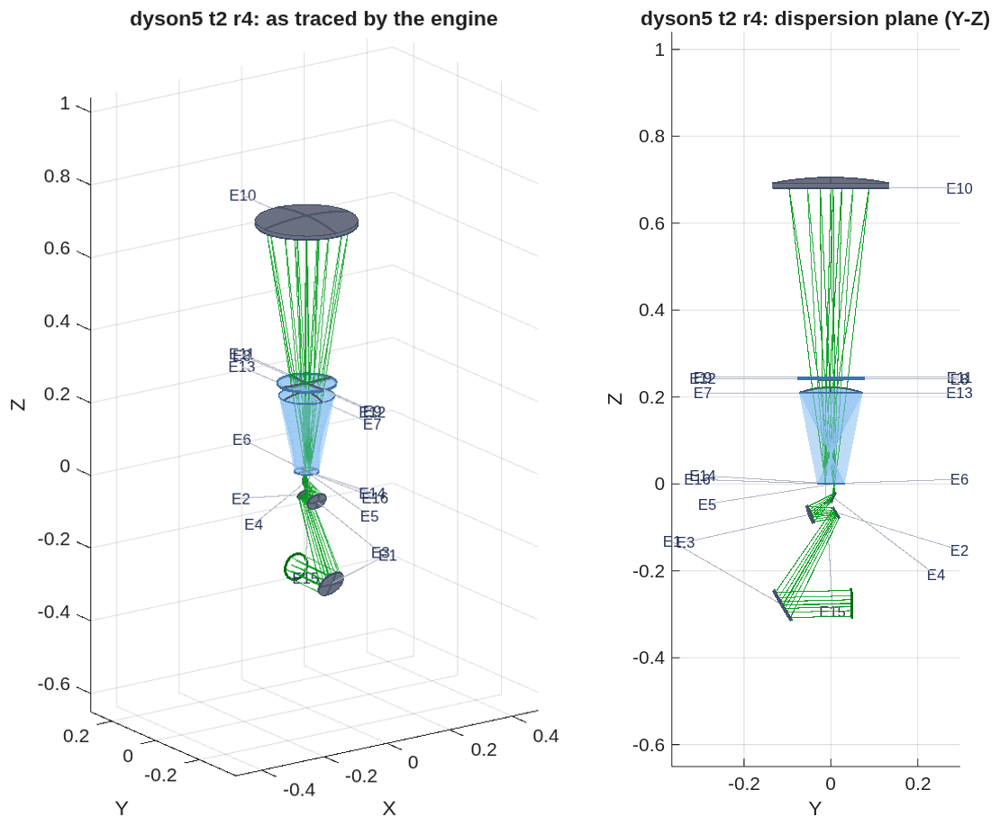

<!--
deck_dyson.md — dyson5: a VSWIR Dyson imaging spectrometer designed from the spec.
DRAFT — the deck grows with the challenge; every number is from a committed
runner stage in mmacos/challenges/dyson5 (records dyson5_s*.txt).
Build: python3 make_brief_slides.py deck_dyson.md
Figures: the runner's own PNGs, copied unmodified into figs_dyson/; the *_rc.png
copies are recomposed at the panel level only (recompose.py), the *_views.png are
the engine's two renders tiled (tile_views.py).
Sources: challenges/dyson5/README.md + BRIEF_dyson5_beat{1,2,2c,3,3b,3c,4a,4b,4c,4d,4e,5}.md (TO),
NOTE_mg2018_digest.md (CC), BRIEF_to_dyson5.md (the lane brief).
Style: doc/DECK_STYLE.md (lean main path, one Backup divider, layout + map per
result slide, figures unmodified, conventions stated once).
Producer items for TO (not on the deck): the R5 layout figure's two panel titles
overlap at the figure's width; a zoom inset of the fold at the base.
-->

# A VSWIR Dyson Imaging Spectrometer, Designed From the Spec
An EMIT-class push-broom spectrometer (F/1.8, 3000 × 500 pixels at 18 µm, 380–2500 nm) designed with MACOS from the public specification alone, scored on smile, keystone and the response functions, and checked by physical-optics propagation.
D. C. Redding, with Claude Code.
October 2026.  Working record; no proprietary prescription is used.
DRAFT — in progress.  Every number is from a committed, parameterized runner (mmacos, `dyson5_run`); records and figures are the runner's own output.  Design of record: the compact variant (step R4): keystone 0.0026 px, smile 0.005 px, CRF 1.33 px, 76 % of the energy in one pixel, at a 220 mm block.  The propagated point-spread function reproduces the ray centroids to 0.002 px, so these are the numbers a detector sees.  The fold-prism layout (step R5) takes the detector package out of the slit's plane at CRF 1.27 px and 70 % in one pixel; a cold shield cannot be bought in this form, since every millimetre of air before the detector costs about 0.5 px of CRF.  The block's size follows the slit: shared between two 27 mm modules, a 130 mm silica block of 1.6 kg with no meniscus images at the pixel (CRF 1.03 px) with half the record's air-glass crossings, against 220 mm, 8.2 kg and a 4 mm meniscus for one module.

## Contents | The target, the methods, the forms, the design ladder, the evidence
::: left
- **3** The target and how it is scored
- **4** The two methods, and the words used here
- **5** The Dyson as traced by the engine
- **6** The Offner as traced by the engine
- **7** The concentric Dyson and its scaling law
- **8** Two independent ray traces agree
- **9** The seed, scored
- **10** The departure ladder
- **11** The departure ladder, by the numbers
- **12** What each departure buys
- **13** The compact variant, as traced by the engine
- **14** The compact variant: the prescription
- **15** The compact variant in section
- **16** The compact variant, scored
::: right
- **17** The trade at a glance
- **18** The propagation twin
- **19** Slit diffraction loss
- **20** The fold prism, as traced by the engine
- **21** The fold prism: the prescription
- **22** The fold prism, scored
- **23** The cold shield: the air gap is the price
- **24** Where the design closes
- **25** How small can the block be
- **26** The block-size trade, by the numbers
- **27** The telescope that feeds the slit
- **28** Telescope and spectrometer end to end
- **29** Next steps
- **30** Run it yourself
- **31** Backup

## The target and how it is scored | Joe's specification, EMIT-class; the metrics stated once, here
::: left
| item | value |
|---|---|
| F-number (air-equivalent, image space) | 1.8 |
| focal plane | 3000 spatial × 500 spectral pixels, 18 µm |
| slit | 54 mm; spectral height 9 mm |
| band | 380–2500 nm, 4.24 nm per pixel |
| smile, keystone | < 0.1 pixel |
| SRF FWHM | < 1.5–2.0 pixels |
| CRF FWHM | < 1.5 pixels |
| radiometric chain | throughput, grating efficiency, QE, slit loss vs wavelength |
::: right
- **Smile:** centroid drift along the slit at fixed wavelength; **keystone:** drift across wavelength at fixed slit position; both in pixels from ray centroids.
- **SRF, CRF:** slit ⊗ line-spread function ⊗ pixel ⊗ Airy, FWHM in pixels (Mouroulis & Green 2018 definitions); the Airy diameter at 2500 nm is 11 µm, under the 18 µm pixel, so the incoherent chain is valid.
- **Design rules adopted from the literature:** distortion to ~1 % of a pixel at design, > 75 % of the energy in one pixel, degraded spots accepted for uniformity, the grating is the stop.
- **Realism (Jim):** as-built SRF is 2.5–3 pixels, slits are 2 pixels wide, the systems are photon-limited; smile and keystone drive the design.
~ The 54 mm slit is 2.3× EMIT's; Table 3 of the review places this spec in the ALIS class (3200 spatial pixels, 380–2500 nm).  Public comparison point: Carbon-I (arXiv:2505.22545), F/2.2, 2040–2380 nm.

## The two methods, and the words used here | Ray tracing scores the design; wave propagation checks it
::: left
- **Ray tracing (MACOS, "the engine"):** rays leave a point on the slit at one wavelength, refract through the block and meniscus, diffract at the grating into the design order, and land on the detector.  The centroid of the landed rays per slit position and wavelength gives the field-angle and wavelength maps; their drift gives smile and keystone; the spread of the rays, convolved with the slit width and the pixel, gives the response functions.
- **Wave propagation (the "twin"):** the same prescription, but the light is carried as a complex wavefront.  The ray trace sets the phase on a reference sphere before the detector; a Fourier transform propagates it to the detector plane and gives the point-spread function with diffraction.  From it: the centroid again (checked against the rays), ensquared energy with diffraction, the response functions with diffraction.
::: right
- **The chain:** the geometric solver, in MATLAB, that lays out each form from its design conditions, solves the chief ray, the groove period and the focus by exact 3-D ray trace, and writes the prescription the engine traces.  Engine and chain are checked against each other ray by ray.
- **The ladder, steps R0–R5:** the sequence of design freedoms added one at a time, each step re-solved and re-scored.  **Seed:** the starting concentric design.  **Operand:** a quantity the solver drives to a target.  **Trade:** the one table that compares the steps.
- **Ensquared energy:** the fraction of a point image's energy inside one 18 µm pixel.  **SRF, CRF:** spectral and cross-track response functions, the instrument's line shape in the two directions, quoted as FWHM in pixels.
~ Every number in the deck is a committed runner output; records are listed in Backup.

## The Dyson as traced by the engine | The concentric seed with every aperture declared: the beams clear every body; the grating is 270 mm wide on a 0.70 m radius and the slit sits 18 mm from the band
::: left
- **The prescription:** `challenges/dyson5/dyson5_s1_dyson.in`; bodies, rays and labels are read back from the engine.  Radii are |R|; apertures are the declared circular radii (footprint plus 5 mm); z along the axis from the block's face.
| E | name | type | surface | R (mm) | K | aperture r (mm) | z (mm) |
|---|---|---|---|---|---|---|---|
| 1 | BlockFaceIn | Refractor | Flat | - | - | 32.1 | 0.5 |
| 2 | BlockSphereOut | Refractor | Conic | 220.0 | 0 | 73.2 | 220.0 |
| 3 | Grating | Grating | Conic | 708.4 | 0 | 142.6 | 708.4 |
| 4 | BlockSphereIn | Refractor | Conic | 220.0 | 0 | 73.2 | 220.0 |
| 5 | BlockFaceOut | Refractor | Flat | - | - | 32.4 | 0.5 |
| 6 | PreFPA | Reference | Flat | - | - | - | 1.3 |
| 7 | FPA | FocalPlane | Flat | - | - | - | 0.3 |
::: right

- **Clearance:** the worst pair is the returning beam against the detector carrier, +1.11 mm with no cold shield; the slit sits at +6 mm and this wavelength lands at −12 mm on the same face.

## The Offner as traced by the engine | The all-reflective reference at F/2.8, re-posed at 0.22 R: the two mirror zones with the grating between the beams, clearing its mount by 10.2 mm
::: left
- **The prescription:** `challenges/dyson5/dyson5_s1_offner.in`, F/2.8, slit offset 0.22 R; the concave mirror used in two zones (E1, E3) with the convex grating (E2) at the stop; classical corrections: convex radius × 1.0034, second zone × 0.951 with a 0.3 mm offset.
| E | name | type | surface | R (mm) | K | aperture r (mm) | z (mm) |
|---|---|---|---|---|---|---|---|
| 1 | M1 | Reflector | Conic | 500.0 | 0 | 119.3 | -486.6 |
| 2 | Grating | Grating | Conic | 250.9 | 0 | 49.9 | -250.9 |
| 3 | M3 | Reflector | Conic | 475.5 | 0 | 113.2 | -463.8 |
| 4 | PreFPA | Reference | Flat | - | - | - | -0.8 |
| 5 | FPA | FocalPlane | Flat | - | - | - | 0.2 |
::: right

- **As corrected:** keystone 0.028 px, CRF 1.20 px, SRF 3.69 px, 23 % of the energy in one pixel; the beams clear the grating's mount by 10.2 mm.  It is the reference form and the ground where the propagation twin is validated (order 0: pupil OPD 8e-11 m, 85 % in one pixel).

## The concentric Dyson and its scaling law | The classical condition verified by exact trace; at this slit the concentric block needs r ≥ 213 mm
- **The Dyson condition** R_g = n·r / (n − 1) is the blur minimum by exact 3-D trace: 0.67 µm at the condition against 4–5 µm at ±5 %, image at −h, residual fifth order (h⁴·¹⁷, r⁻³·¹⁹).
- **The scaling answer, before any element was added:** a single concentric block meets a quarter-pixel corner blur only at r ≥ 213 mm, about twice flight scale, which is why the flight forms add an asphere, a meniscus or an air gap.


## Two independent ray traces agree | The design solver and MACOS place every ray within a nanometre of each other, so the prescription is what the solver intended
::: left
- **Two programs, one prescription.** The design solver (MATLAB) lays out each form from its design rules and writes the prescription.  MACOS then traces that prescription on its own.  The check: every ray MACOS launches is re-traced by the solver through the same surfaces, and the two land within 1e-9 m at every surface; the dispersed band spans the detector to 1 %.
- **The check is not trivial.** With the aspheric block face of ladder step R2 the agreement is 1e-12 m per ray, while a solver that ignores the asphere misses by 0.26 mm.
- **Wave propagation agrees too.** On the Offner at order 0 the propagated point image is a clean Airy pattern, 85 % of its energy in one pixel, with a pupil error of 8e-11 m.
::: right
- **What the checks found in MACOS, and fixed** (details in Backup): glass names were ignored when a prescription loaded; propagation inside glass used the vacuum wavelength; a grating's groove spacing was held constant along the curved surface instead of along the chord; the grating's path-length term had the matching defect; the multi-wavelength optimizer's derivative loop overran its array on a spot-size target.  Each now has a regression test written from the physics.
~ Regression tests: 15 in five classes plus the optimizer's; the MACOS fast suite stands at 510 pass, 0 fail (2026-10-01).

## The seed, scored | The concentric seed at a 220 mm block meets smile; keystone and the corner blur are the work
- **Smile is met at the seed** (below 0.01 pixel on both forms); the field-angle map is linear along the slit as designed.
- **SRF sits at 2.02 pixels on both forms**, the floor set by the 2-pixel slit; re-scored on the engine after the grating fixes (the earlier ramp with wavelength was the groove-period defect, not the design).


## The departure ladder | Each step solved on the exact chain with pixel-unit smile and keystone in the merit from the first pass, then emitted and scored in the engine


## The departure ladder, by the numbers | Keystone falls 37-fold at fixed scale; the meniscus pays only with the block offset and grating radius moving with it
::: full
| step | what moves | keystone (px) | smile (px) | CRF FWHM (px) | ensquared, 1 px | length (mm) | grating footprint (mm) | glass (L) |
|---|---|---|---|---|---|---|---|---|
| R0 | concentric seed | 0.095 | 0.006 | 2.28 | 0.44 | 708 | 275 | 22.2 |
| R1 | grating-radius factor, face offset | 0.038 | 0.003 | 2.10 | 0.48 | 704 | 274 | 22.3 |
| R2 | + conic and h⁴, h⁶ terms on the block face | 0.037 | 0.004 | 2.13 | 0.47 | 704 | 274 | 22.3 |
| R3 | + block centre off the grating's, along the dispersion | 0.011 | 0.008 | 2.10 | 0.48 | 698 | 272 | 22.1 |
| R4a | meniscus corrector alone | 0.063 | 0.012 | 2.49 | 0.33 | 698 | 270 | 22.3 |
| **R4** | **meniscus with all variables (the compact variant)** | **0.0026** | 0.005 | **1.33** | **0.76** | 694 | 269 | 22.7 |
| R5 | + slit plate and fold prism: the detector out of the slit's plane | 0.0085 | 0.005 | 1.27 | 0.70 | 694 | 269 | 19.2 |
| size alone | block radius free (341 mm) | 0.024 | 0.001 | 1.34 | 0.74 | 1099 | 427 | 82.8 |
~ SRF FWHM is 2.02–2.05 px on every step: the 2-pixel-slit floor.  Length = slit plane to grating vertex; footprint = diameter of the grating hits over slit centre and ends × band edges; glass = the full hemispherical cap + meniscus, an upper bound: edged to its clear aperture the R4 block is a rod 147 mm across and 221 mm long, 3.7 L and 8.2 kg in silica.  Record `dyson5_s3_trade.txt`.

## What each departure buys | De-concentring the block solves the distortion; the face asphere is inert; the blur is bought only by size or by the compact form
::: left
- **Keystone:** 0.095 → 0.011 pixels at fixed scale, nine times inside the 0.1-pixel specification and at the literature's 1 % design rule; smile stays below 0.01 pixel throughout.
- **The block-face asphere does nothing here:** step R2 converges to 10 nm sags, and a one-dimensional scan about R1 is a steep bowl centred at zero.  An axisymmetric figure acts on every field point alike and cannot cancel a residual that grows as h⁴ along the slit.
::: right
- **The blur does not move on any step, and the reason is on record:** the dispersed image sits 12 mm from the order-0 image, so the slit corner's effective field height is about 32 mm, and the h⁴/r³ law predicts the measured 0.4 px rms.
- **Two routes buy it:** size alone (0.74 ensquared at a 341 mm block, 1.1 m long, 83 L of glass) or the compact variant: a meniscus corrector in the air gap, solved together with the block offset and the grating radius, reaches the same at the 220 mm block — 63 % of the length, 27 % of the glass.


## The compact variant, as traced by the engine | Step R4: the meniscus corrector in the air gap between the block and the grating; the design of record at a 220 mm block
- **Eleven surfaces:** the block's flat and spherical faces, the meniscus, the grating, and the same faces again on the way back to the focal plane; the element table is on the next slide.
- **Clearance:** the returning beam passes the detector carrier by 1.19 mm with no cold shield, and any shield fails the check; the fold prism of step R5 (slide 20) moves the detector out of the slit's plane.


## The compact variant: the prescription | The eleven elements of step R4 as written in `dyson5_s3_r4.in`; radii are |R|, apertures the declared circular radii, z along the axis from the block's face
::: full
| E | name | type | surface | R (mm) | K | aperture r (mm) | z (mm) |
|---|---|---|---|---|---|---|---|
| 1 | BlockFaceIn | Refractor | Flat | - | - | 32.2 | 0.7 |
| 2 | BlockSphereOut | Refractor | Aspheric | 220.0 | -0.00650944 | 73.0 | 219.1 |
| 3 | MenA_out | Refractor | Conic | 1828.1 | 0 | 77.7 | 240.0 |
| 4 | MenB_out | Refractor | Conic | 2000.0 | 0 | 78.0 | 244.0 |
| 5 | Grating | Grating | Conic | 697.8 | 0 | 140.1 | 697.8 |
| 6 | MenB_in | Refractor | Conic | 2000.0 | 0 | 78.1 | 244.0 |
| 7 | MenA_in | Refractor | Conic | 1828.1 | 0 | 77.8 | 240.0 |
| 8 | BlockSphereIn | Refractor | Aspheric | 220.0 | -0.00650944 | 73.1 | 219.1 |
| 9 | BlockFaceOut | Refractor | Flat | - | - | 32.6 | 0.7 |
| 10 | PreFPA | Reference | Flat | - | - | - | 0.9 |
| 11 | FPA | FocalPlane | Flat | - | - | - | -0.1 |
~ The two block faces and the meniscus appear twice because the light passes them on the way out and back; the engine traces them as separate surfaces.

## The compact variant in section | Dispersion plane and slit direction, to scale: block, meniscus, grating; slit and focal plane on the block's face

- **Sizes:** block radius 220 mm (217 mm thick, 85 mm face), meniscus 4 mm thick at radii near 2 m, grating 269 mm across on a 0.69 m radius; slit plane to grating vertex 694 mm.
- **A global search over the meniscus** (12 starts over its position, thickness and both curvatures, every R4 variable free) found four feasible basins at similar merit and none better on the detector: the lowest merit buys 0.0007 px of keystone, already 40× inside the specification, for +0.15 px of CRF and −0.10 of ensquared energy.  The R4 of record stands.

## The compact variant, scored | Keystone 0.0026 px, smile 0.005 px, CRF 1.33 px, SRF 2.03 px; ensquared energy 0.76 geometric and 0.75 with diffraction
- **Checked by propagation:** the point-spread function's centroid equals the ray centroid to 0.0022 px along the dispersion and 0.0003 px along the slit at every slit position and wavelength, so a detector sees these numbers.


## The trade at a glance | Distortion, response functions and ensquared energy per step, both records and the fold; the specification and the literature rules as lines


## The propagation twin | A far-field terminal on a reference sphere, re-posed per slit position and wavelength, agrees with the ray centroids to 0.0013 px
- **What it checks:** the ray-side scorer's centroids and response functions against physical-optics propagation through the same decks; across a grating the comparison is made in phase (modulo λ), never as unwrapped lengths.


## Slit diffraction loss | A 36 µm slit at F/1.8: 0.3 % of the light misses the grating at 380 nm and 1.8 % at 2500 nm, by the engine and by the closed form alike
- **The model:** a uniformly lit 36 µm slit of zero length, propagated as a far-field wave to the grating's plane 0.70 m away; loss = the energy landing outside the F/1.8 acceptance.  The closed form is the exact sinc² integral for the same slit and acceptance.
- **The engine reads 1.04 / 1.14 / 0.90 / 0.86 × the closed form at 380 / 700 / 1440 / 2500 nm** once two conditions are met, each found by a one-knob test: the far-field window at least twice the acceptance (a window 11 % wider than the acceptance folds the diffracted tail back inside and reads 0.3× at 380 nm), and the energy normalised to the propagating region |sin θ| ≤ 1 (the planar transform carries 0.7–1.3 % of the energy beyond it at the long end and read 1.36× at 2500 nm).  The residual at the long end is the grid pitch across an acceptance only four sidelobes wide.
- **The number for the radiometric chain:** loss past the grating 0.28 % at 380 nm, 0.5 % at 700, 1.0 % at 1440, 1.8 % at 2500 nm (closed form; the engine reads 0.29 / 0.59 / 0.94 / 1.57 %).  The telescope's cone is not yet in the model; the literature puts the partially coherent case near 10 %.


## The fold prism, as traced by the engine | Step R5: a slit plate and a mirror-coated fold prism cemented to the block; the detector 27 mm from the slit, every clearance pair positive
- **The form:** the slit stands 1 mm in air before a 24 mm plate cemented to the block's face; under the image a prism with a 45° mirror-coated plane 16 mm below the face folds the beam away from the slit, and the detector sits 1 mm in air beyond the prism's exit face (E11–E14 in the table on the next slide).  Total internal reflection is not available: at F/1.8 in silica the marginal rays reach 30° against a 43.6° critical angle, so the fold is a coated mirror inside the glass.
- **Solved as a ladder step:** R4's eleven variables plus the slit plane's axial position, the face offset bounded at the fold's scale, warm-started from R4; the groove period and the focus re-solved at every iterate.
- **Clearance:** the detector package (54 × 9 mm plus a 5 mm carrier, 10 mm deep) is 27 mm from the slit; the worst pair is the package against the fold mirror's mount at +0.90 mm.  Record `dyson5_s5_r5_h00.in`.


## The fold prism: the prescription | The fourteen elements of step R5 as written in `dyson5_s5_r5_h00.in`; radii are |R|, apertures the declared circular radii, z along the axis from the slit
::: full
| E | name | type | surface | R (mm) | K | aperture r (mm) | z (mm) |
|---|---|---|---|---|---|---|---|
| 1 | PlateIn | Refractor | Flat | - | - | 32.3 | 1.0 |
| 2 | BlockFaceIn | Refractor | Flat | - | - | 37.0 | 25.0 |
| 3 | BlockSphereOut | Refractor | Aspheric | 220.0 | -0.00657465 | 73.3 | 221.9 |
| 4 | MenA_out | Refractor | Conic | 1971.2 | 0 | 77.6 | 240.0 |
| 5 | MenB_out | Refractor | Conic | 1980.0 | 0 | 78.0 | 244.0 |
| 6 | Grating | Grating | Conic | 694.0 | 0 | 139.3 | 694.0 |
| 7 | MenB_in | Refractor | Conic | 1980.0 | 0 | 78.0 | 244.0 |
| 8 | MenA_in | Refractor | Conic | 1971.2 | 0 | 77.7 | 240.0 |
| 9 | BlockSphereIn | Refractor | Aspheric | 220.0 | -0.00657465 | 73.4 | 221.9 |
| 10 | BlockFaceOut | Refractor | Flat | - | - | 37.3 | 25.0 |
| 11 | FoldMirror | Reflector | Flat | - | - | 35.3 | 9.0 |
| 12 | PrismExit | Refractor | Flat | - | - | 32.7 | 9.0 |
| 13 | PreFPA | Reference | Flat | - | - | - | 9.0 |
| 14 | FPA | FocalPlane | Flat | - | - | - | 9.0 |
~ The plate (E1–E2) and the block face (E2, E10) are glass to glass: the engine traces the cemented face as a refraction between equal indices.  The fold mirror (E11) is a reflector inside the glass; after it the axis runs along −y, so E12–E14 share the fold's z and stand at y = −20 to −21 mm (slit at y = +6 mm).  Groove period 114.4 µm.

## The fold prism, scored | Keystone 0.0085 px, smile 0.005 px, CRF 1.27 px, SRF 2.04 px; 70 % of the energy in one pixel
- **Against the compact variant:** CRF 1.33 → 1.27 px and keystone 0.0026 → 0.0085 px, both well inside the specification; ensquared energy 0.76 → 0.70, under the literature's 0.75 rule.  A refinement from the same basin at twice the iterations reached 0.73 with CRF 1.32 px, so the trade between the two is real and small.


## The cold shield: the air gap is the price | A shield of height h needs h + 1 mm of air before the detector, and every millimetre of air costs about 0.5 px of CRF
- **Measured on the compact variant before any re-solve:** widening its 0.85 mm air gaps at slit and detector to 2 and 3 mm takes the CRF from 1.33 to 1.78 and 1.96 px and the keystone from 0.02 to 0.23 and 0.42 px.  Physics, not the solver: a plane air-to-glass boundary ahead of an F/1.8 cone carries spherical and field aberration that grows with the gap, which is why Dyson slits and detectors are proximate.
- **The sweep:** shield heights 0, 1, 2, 3 and 5 mm, the same gap on the slit side to keep the object and image media equal, a full twelve-variable re-solve at each, scored in the engine and run through the clearance gate with the package in the folded frame.  Every point clears; the CRF climbs 1.27 → 1.75 → 2.31 → 2.78 → 3.75 px and the re-solve does not recover it.  The record is the tallest shield that closes: none.
- **What that leaves:** a shield inside the 1 mm the design tolerates; a cold window cemented as the prism's exit face with the shield as the detector housing behind it (the next R5 variant); or a slower cone, since the F/2.2 point of the closure envelope has CRF 1.15 px at R4 and could spend some of it on air.


## Where the design closes | The compact variant re-solved one parameter at a time from the record: F/1.8–2.2, blocks of 220–300 mm, slits to 54 mm, both pixels and both glasses close
- **Method:** from the R4 of record, one axis at a time, every point a full eleven-variable re-solve on the exact chain, then emitted and scored in the engine.  A point closes when smile and keystone are under 0.1 px, CRF under 1.5 px, SRF under 2.0 px and no variable sits on a bound.  The detector stays 54 × 9 mm; the pixel count follows the slit length and the pitch.
- **Outside the envelope the first metric to fail is the CRF:** 2.37 and 1.61 px at 150 and 180 mm blocks (the h⁴/r³ law of the scaling slide), 1.55 px at a 60 mm slit (by 0.05 px).  F/1.6 and F/2.8 end on the meniscus bounds with the CRF itself at 1.37 and 1.07 px: a bound to widen, not a form that fails.  Smile and keystone never exceed 0.02 px on any point.  A 30 µm pixel or a CaF2 block puts all of the energy in one pixel; the corner, F/1.6 with a 150 mm block, does not close.


## How small can the block be | The slit is the lever: shared between two 27 mm modules the block falls from 220 mm to 130 mm or less, and the meniscus is no longer needed
- **Why the record is 220 mm thick:** in the Dyson form the flat face sits at the center of curvature, so the block's thickness is its radius, and the blur law of the scaling slide (h⁴/r³) ties the radius to the slit length.
- **The trade:** each point is a full re-solve walked down in radius, warm-started from the next larger block and scored in the engine, with the meniscus (solid lines, step R4) and without it (dashed, step R3); a filled marker meets the specification and a ringed one also matches the record's own scores.


## The block-size trade, by the numbers | Two modules with no meniscus: a 130 mm silica block at 1.6 kg images at the pixel with half the air-glass crossings of the record
::: full
| configuration | block radius and thickness (mm) | edged mass (kg) | air-glass crossings, uncoated throughput | CRF (px) | ensquared, 1 px | smile / keystone (px) |
|---|---|---|---|---|---|---|
| **R4 of record: silica, one 54 mm slit, meniscus** | 220 | 8.2 | 8, 0.76 | 1.33 | 0.76 | 0.005 / 0.003 |
| CaF2, one 54 mm slit, no meniscus | 240 | 14.3 | 4, 0.88 | 1.21 | 0.82 | 0.005 / 0.006 |
| **silica, two 27 mm slits, no meniscus** | 130 | 1.6 each | 4, 0.87 | 1.03 | 1.00 | 0.007 / 0.009 |
| silica, two 27 mm slits, no meniscus, smallest matching the record | 100 | 0.9 each | 4, 0.87 | 1.25 | 0.80 | 0.008 / 0.012 |
| CaF2, two 27 mm slits, no meniscus, smallest matching the record | 80 | 0.9 each | 4, 0.88 | 1.02 | 1.00 | 0.002 / 0.007 |
- **The meniscus was paying for the long slit.** With one 54 mm slit, silica closes only with the meniscus, a plate 4 mm thick and 155 mm across that the solve wants thinner still; the thicker meniscus designs of the global search (about 30 mm) miss the specification at CRF 1.64 and 1.72 px.  Without a meniscus, one module closes only in CaF2 and only at 240 mm and 14 kg.
- **With two modules it is not needed:** the plain block matches the record from 220 mm down to 100 mm in silica and 80 mm in CaF2, with four air-glass crossings where the record has eight, 15 % more light before any coating, and no thin part to make, mount or shake.  CaF2 still images at the pixel at 80 mm, where silica has fallen to CRF 1.49 px; silica needs 130 mm for the same image.  An 80 mm CaF2 block or a 130 mm silica block is a materials choice the ray trace cannot make.
- **What two modules cost:** two gratings and two detectors of 1500 pixels, and a swath split ahead of the slits, since each block is wider than its slit and the slits cannot abut.  The slit-to-detector clearance stays near 0.5 mm at every size.  Halving the glass path also halves the wavefront error from index inhomogeneity and thermal gradients, estimated at 0.4 waves each for the 220 mm block.
~ Record `dyson5_size.txt` (CCMac, 2026-10-02): 48 engine-scored points; throughput is the uncoated Fresnel product at 1 µm, normal incidence; the Mac's engine reproduces the Linux record of R4 to four decimals.

## The telescope that feeds the slit, at Jim's numbers | f = 330 mm, 183 mm at F/1.8, 9.4° per 3k module or 4.7° per 1.5k; three forms traced in the engine, none yet packaged at the pixel
- **The target moved.**  Jim's 30 m ground sample from 550 km on 18 µm pixels sets f = 330 mm and 183 mm at F/1.8; the swath is 9.4° cross-track for a 3k module, 4.7° for a 1.5k one, with a telecentric, flat image on the slit.  The EMIT-parameter three-mirror of the earlier beat (f = 126 mm, 24.6°, 67 px at the slit) stands as the layout and end-to-end machinery; the designs below are at the new numbers.
- **The coaxial three-mirror parent (two routes).**  The chain's offset solves at 9–10° leave a field-constant residual — the parent's own aberration off its axis — 2 944 nm at best with the clearance gate failing, 6–65 px rms spots in the engine.  The design layer's Korsch TMA with conics solved by the native optimizer at a scanned bias is diffraction-limited on axis (0.008 waves) and holds to ±1.5°: at 1° bias the strip centre is 0.41 px but the imageable half-field is a third of the swath, and the bias cannot be raised to unobscure.  Three conics do not correct 9.4° at F/1.8 on the coaxial form.  **The unobscured eccentric section of the same parent** (pupil decentered 205 mm, the beam passing below M2 to M3 and a focal plane beside it, no hole, no central obstruction) is the first packaged imaging telescope in the record: three conics hold the **1.5k strip at 8.9 px** (4.3 px at the strip centre), every body clear, 1.05 kg of mirror — at a plate scale of 447 mm, not the 330 mm the ground sample asks.  Asked to hold the plate scale too (the optimizer's new per-field image-position rows), the same three conics give up the blur: blur and plate scale compete, and the 3k strip's ends sit at 10 mm on this form.  Both modules need more than conics: aspheres through the native optimizer, or freeform.
- **The two-mirror modified Schwarzschild (the review's form for this regime).**  Convex primary, concave secondary, the stop virtual at M2's front focus so the output is telecentric; closed-form first order, exact chain, engine equal to chain on every ray.  On axis — obscured, M1 in the image cone — it images: **1.10 px** max rms spot for the 1.5k module (0.59 on axis), **4.26 px** for the 3k, each solved on its own strip with M1 and M2 aspheres, the review's own TMS scaled to this focal length sitting at 2.3–4.6 px.  It packages only with the strip 30° off axis: with the clearance operand made smooth (an exact segment-to-disc distance and a softmin over rays, where a sampled minimum had stalled every step) the packaged solves reach **123 px** (1.5k, +5.4 mm clear) and **178 px** (3k, +4.8 mm) and stall at the wall's knee.  The bound settles it: with the wall switched off, the same 30° layouts still sit at **25 px** (3k; and the 1.5k solve ran pathological) — the form, not the solver, is out at this bias.  **Verdict: no packaged Schwarzschild images at the pixel at f = 330 mm, F/1.8; no end-to-end row for it.**


## Telescope and spectrometer end to end | One prescription of 16 (R4) and 19 (R5) elements, the grating its stop; the spectrometer's scorer sees the telescope's blur
- **The deck.**  The telescope's surfaces are prepended to the spectrometer of record — sky, M1, M2, M3, fold, the slit as a pass-through reference, then block, meniscus, grating and detector — with a collimated 70 mm source per field and the grating declared the stop.  Gate `tTelescopeRx`: every ray at the slit and at the detector within 1e-9 m of the design solver's.
- **The score (7 fields × 7 wavelengths, the spectrometer's own scorer):** with R4 smile 3.1 px, keystone 0.59 px, SRF 15.7 px, CRF 15.5 px; R5 the same to 0.03 px.  Against the spectrometer alone (smile 0.005, keystone 0.003, CRF 1.33 px) these are the telescope's 67 px blur passing through.  Clearance across both +0.75 mm with R4; with R5 the fold mirror's blur-widened footprint meets the detector package at −0.11 mm.
- **What it establishes:** the end-to-end machinery is in place and gated — a telescope deck of record, a combined prescription with the stop at the grating, the admitted fraction per field, the clearance gate across both instruments.  Records `dyson5_t2.txt`, decks `dyson5_t2_r4.in`, `dyson5_t2_r5.in`.


## The 1.5k telescope of record: three off-axis aspheres | Every field admitted, plate scale held, the strip at the pixel end to end: smile 0.51, keystone 0.01, CRF 1.22, SRF 2.20 px; clearance +39 mm
::: left
- **The pupil is a first-order condition.**  The section's exit pupil must sit near infinity to feed the near-telecentric Dyson (its chiefs cross 14–44 m away; it accepts chiefs within 0.09° of its own).  A Korsch with a real intermediate focus between M2 and M3 can never be telecentric, so the layout was re-posed with M3 in front of that focus (the Cook/EMIT form, `tma_layout` 'telecentric'): chiefs within 0.5° across the strip, every field admitted, the plate scale calibrated by the parent's f-number.
- **Two levers closed the strip edge, neither a figure term.**  The merit: the per-ray transverse spot at the slit with the per-field image positions, in place of the wavefront rms (at F/1.8 with tens of µm of path error the image is far from diffraction-limited, and the wavefront merit flattened the field by trading the centre).  The geometry: M2 and M3 tilt and decenter and the focus as variables, which every earlier solve had frozen from first order.  With both, conics + h⁴/h⁶ with each mirror's own vertex and axis — three off-axis aspheres, no freeform — image the 1.5k strip at **8 / 14 µm as placed at the centre / ±2.3° edge** (0.4 / 0.8 px).
- **Through the 130 mm module** (4° bias, 190 mm decenter, m₂ = 3.0 parent; the Dyson rolled 180° about the chief): smile 0.51 px, keystone 0.01 px, CRF 1.22 px, SRF 2.20 px, plate 327 / 331 mm, every field admitted; clearance +39 mm telescope-internal, +0.38 mm overall (the Dyson's own package).  Deck `dyson5_tA_GM_1k5_bAs.in`.
- **The 3k section** needs genuine freeform (M2 1.7 mm of departure at 126 mrad) and reaches smile 2.05 / keystone 0.05 / CRF 4.22 / SRF 4.90 px; its figure and geometry work against each other, which points at the stop's position (M2) as the next layout question.
::: right

~ Maps: the stage-B asphere solve on the wavefront merit (edges 19 px); the solve of record is scored in `dyson5_tA_GM_*` / `dyson5_t5f_GM_*` (maps next).

## What it took to reach the pixel at the strip edge | The defect was cross-track astigmatism growing as the square of the field; figure terms alone flattened the strip by trade, the merit and the geometry removed it
::: left
- **It was not focus or the mirrors' power split:** along the strip the along-track focus is flat, the cross-track focus curves 2–4 mm and the two line foci at the edge sit 2.2–5.3 mm apart; no secondary magnification flattens both, and a field lens has no leverage at the slit.
- **Figure terms alone trade the centre for the edge.**  Zernike departures on all three mirrors took the 1.5k edge 291 → 170 µm while the centre went 29 → 73 µm; on 3k 1086 → 485 µm for a centre of 68 → 190 µm.  A control with the wavefront merit written per ray gave the same flattening: the merit, not the surfaces, set the trade.
- **The transverse merit and the geometry removed it.**  Per-ray spot rows at the slit plus M2/M3 tilt, decenter and focus as variables: 1.5k edge 170 → 13 µm, centre 73 → 6 µm, with the freeform coefficients collapsing to a re-fitted set of off-axis aspheres (surface residual ≤ 17 µm, re-optimised as aspheres: the slide before).  The emission had to be re-solved, not just re-fitted: a 1.7 mrad slope residual is a millimetre of blur over 0.3 m.
::: right
| step (1.5k, same seed, same budget) | as-placed spot centre / edge | e2e smile / keystone / CRF / SRF (px) |
|---|---|---|
| conics + aspheres, wavefront merit | 37 / 343 µm | 3.26 / 0.63 / 15.5 / 5.9 |
| + Zernike freeform, wavefront merit | 99 / 219 | 0.82 / 0.33 / 7.7 / 9.2 |
| same DOFs, transverse (spot) merit | 18 / 27 | 1.54 / 0.03 / 2.34 / 4.46 |
| + M2/M3 tilt, decenter, focus | 6 / 13 | 0.60 / 0.02 / 1.49 / 2.30 |
| three off-axis aspheres, same merit and geometry | 8 / 14 | 0.51 / 0.01 / 1.22 / 2.20 |
~ Records `dyson5_tA_EP_*`, `dyson5_tA_pz_*`, `dyson5_tA_FF_*`, `dyson5_tA_GM_*`; the e2e rows through the engine-placed join (identity with the chain join to every printed digit on the aspheric deck).  Solves run to a fixed evaluation budget; none is converged in the optimizer's sense.

## Next steps | The native optimizer on the record, the cold window, and the telescope that feeds the slit
::: left
- **The native multi-wavelength optimizer (MACOS CALIB) confirms the compact variant:** the engine's spot-size solve over 5 slit positions × 6 wavelengths, the double-pass copies of each surface linked as one, smile and keystone held as walls between iteration chunks, the engine's design read back under an identity check (2e-16 m).  With the blur freedoms (block face radius and conic, meniscus faces, focus) every step is rejected: R4 is a local optimum of the engine's merit as well as the chain's.  With the grating's position free the engine bought blur with 15 px of keystone in five iterations and the wall rejected it: the reason the design needs distortion operands, queued as an engine feature.  From a deliberate 0.3 mm defocus the same solve cuts the spot from 97 to 21 µm, so it moves when there is something to gain.  The block's asphere joins the freedoms now that its differential step is fixed (Backup).
- **The cold window:** the R5 variant with the shield as the detector housing behind a window cemented as the prism's exit face, under the same clearance gate.
- **One module or two (a project decision):** one 54 mm module needs the 220 mm, 8 kg block and its thin meniscus; two 27 mm modules need a plain 130 mm block of 1.6 kg each, with the swath split ahead of the slits.  The choice also sets the telescope's field: 24.6° for one, or 12.3° each for two.
- **The radiometric chain against the band:** throughput, grating efficiency, detector quantum efficiency and the slit loss above.
::: right
- **The telescope's image:** the 1.5k module has its telescope of record — three off-axis aspheres at the pixel end to end (CRF 1.22 px, clearance +39 mm).  Next: the 3k module's layout (the stop at M2; an asphere-only solve), a FWHM-faithful instrument merit for the final rung, the field weighting as a project ruling, and the end-to-end row with each module's Dyson as the entry in the comparison for Jim.  Queued in the engine: the fixed-station reference sphere and the asphere + Zernike surface option.
- **Future work, once the design of record is stable:** a surface-by-surface tour of the prescription (role, ray footprint, clearance, and the field where a propagation leg ends, per surface); spot diagrams in the Mouroulis & Green form, slit positions down and wavelengths across inside the 18 µm pixel box; the telescope and the end-to-end instrument; polarization sensitivity of the Dyson against the Offner, since the Dyson's near-normal incidence is what the literature credits for its low sensitivity; and, once the telescope exists, full diffraction from the slit through the grating to the detector, to put a number on the slit's truncation of the telescope's image (the literature expects about a 10 % effect on the response functions).

## Run it yourself | One parameter file, one runner, every stage through it
::: full
```
cd <path>/MACOS_resources/mmacos                   % the mmacos folder of the repository (the engine is built already)
matlab                                            % start MATLAB here
>> run('mmacos_setup.m');                          % puts the engine and the design tools on the path
>> addpath('challenges/dyson5');
>> OUT = dyson5_run();                             % stage s0 only: the scaling law, no engine needed
>> OUT = dyson5_run(struct('stages', {{'s1','s2','s3'}}));   % emit the decks, score them, run the ladder
>> OUT = dyson5_run(struct('stages', {{'s5','s4env'}}));     % the fold prism sweep; the closure envelope
>> OUT = dyson5_run(struct('Fno', 2.0, 'block_r_m', 0.25, 'stages', {{'s1','s2','s3'}}));  % your own instance
```
- **Changeable design parameters live in one file, `dyson5_params.m`:** F-number, pixel count and pitch, band, slit width in pixels, block radius, glass, diffraction order, the slit offset, the ladder's steps and weights, the aperture and mount margins, the detector package, the fold's depth and the cold-shield height.  Pass any of them as fields of the struct to drive a different solution; every record in this deck is a stage output under `challenges/dyson5/`.
- **Where designs close (slide 24):** F/1.8–2.2, block radii 220–300 mm, slits to 54 mm, 18 and 30 µm pixels, silica and CaF2, each a full re-solve scored in the engine; outside, the CRF fails first (150 and 180 mm blocks, the 60 mm slit), and F/1.6 and F/2.8 end on the meniscus bounds.  Also on the record: block radii 50–500 mm at order 0 for the scaling law, and the Offner reference at F/2.8.
- **Checks:** `./run_mmacos_tests.sh tSpectrometerRx` and the four grating, glass and propagation classes, all in the fast suite.

## Backup
Diagnostics, the engine findings, and the conventions behind the main path.

## Backup: eight engine findings, each with a regression test | Found by the challenge's checks on 2026-09-30 to 10-03, fixed in the engine the same day
::: full
| finding | symptom | fix | test |
|---|---|---|---|
| glass names ignored at load | a `GlassElt= Silica` element traced as air in every binding | the glass catalog is blanked once at allocation, not on every load | `tGlassDispersion` (3) |
| vacuum wavelength inside glass | a propagation leg in a medium ran at the wrong Fresnel number by n | every kernel takes λ/n of the leg's medium | `tPropMedium` (3): z in n ≡ z/n in vacuum |
| groove period along the surface | 2.8 / 3.3 px rms spectral blur at 2500 nm (Offner / Dyson) | the local grating vector is the un-normalised projection of the ruling direction (chord-ruled) | `tGratingImmersed` (4), `test_grating_chord` |
| grating path-length jump | 4 waves rms of pupil OPD where the rays converged to 0.05 µm | the jump is the groove count from the vertex along the ruling direction | `tGratingOpl` (2) |
| optimizer derivative stride | a spot-size optimisation over several fields overwrote memory on its second field (the derivative columns advanced by the wavefront's size, not the objective's) and crashed or hung the host | advance by the objective's size, as the value loop does | `tSpectrometerRx` native leg, `tDesignTelescope` (70, unchanged) |
| ray behind the surface after a pupil reference | a two-mirror whose entrance-pupil reference sits 5 mm ahead of its convex primary scattered every ray but the chief in a one-call trace (93 mm rms), while an element-by-element trace was right — by accident | the root of the conic after a reference is the one whose hit point is nearest the element's reference point (its vertex, or an off-axis section's pole), not the one whose length matches the ray's distance to the vertex (which the ray's height dominated); a restarted trace resets its "previous element" per ray | `tTraceRestart` (2) on the deck itself; exit-pupil radii unchanged to the bit on four decks |
| beam conditions only under a beam target | the chief's direction and position at an element could not be scored with a spot or wavefront target, one target served every field, and a multi-field beam solve scored the last field alone | the beam rows ride on any target; a position target per field; a weight; the ray centroid as the position | `tBeamRows` (3): telecentric under a spot target, two fields met by one piston, centroid vs chief |
| optimizer asphere step and failure exit | an aspheric coefficient was probed by a fixed 1e-10, round-off on a deck in metres: a zero derivative column, a singular matrix at the first step, and a `stop` on that path that ended the MATLAB process | the step is 1e-3 of the coefficient (sag-based for a zero one); the failure restores the optics and returns a flag | `tAsphCalib` (2): a spoiled paraboloid driven back to zero; the failure path with the host alive |
~ Flat gratings are unchanged by the grating fixes; the wavefront-target optimizer, which every telescope design used, was never affected by the fifth.  A seventh item, a short `AsphCoef=` line killing the host process, now pads with zero and warns (`tRxShortAsph`); the same guard for `ZernCoef=` is queued.

## Backup: four more findings from the telescope's eccentric section | Found 2026-10-04 to 10-05, each invisible on a coaxial design, each fixed the same day
::: full
| finding | symptom | fix | test |
|---|---|---|---|
| ray on the far sheet of a hyperboloid | 40 of 1185 rays on the section's M3 (sheets 22 mm apart) took the second sheet: 44 mm of extra path, a 10 mm spot tail, every ray reported as passing — 7.8 mm rms wavefront at the focal plane while an outlier-cut spot read 400 µm | the intersection is the root on the sheet the vertex is on (the normal's axial component keeps the sign it has at the vertex); first crossing on a tie; the first crossing alone is wrong, since M2's far sheet sits in the beam | `tFwdRoot` (5); 406 decks pre/post identical |
| optimizer aperture sized at one field | the circle declared for the asphere solve enclosed the nominal field's footprint only; the strip-edge fields lost every ray on M3 and were dropped by the solve (the 9.9999e36 sentinel), which then drove M3's conic blind to them | the circle encloses the footprint over every field of the solve | `tAsphHook` (3): its first pin was the wavefront of the surviving rays; re-pinned |
| stop aimed at the parent vertex | the exit-pupil finder and the optimizer set the stop on M1 with no offset; on an eccentric section that is the parent vertex, 190 mm from the beam, and the pupil sphere was placed for the wrong beam | the stop at the deck's object-space stop point | `tStopApStop` (4) |
| Zernike origin at the parent vertex | the emitter placed each mirror's Zernike origin at its vertex while the axes were the section pole's, so freeform terms on a section were evaluated 3.8 radii outside the unit disc (1 µm of defocus moved the chief 0.19 mm instead of 0.005) | the origin is the element's pole | `tFreeformPole` (3) |
~ Every one of the four passed every existing check: the rays "passed", the solve "converged", the deck loaded.  What exposed them was a section whose beam is 190 mm from its parent's vertex — the first design in the record where the vertex and the lit patch are not the same place.

## Backup: records and tools behind each slide | Every number traces to a runner stage and its record file
::: full
| slide | runner stage | record | tool |
|---|---|---|---|
| scaling law | s0 (engine-free) | `dyson5_s0_scaling.txt` | `design/src/dyson_layout.m`, `dyson_scaling.m` |
| as traced (every form) | `dyson5_view_figs.m` | `*_view3d.png`, `*_viewyz.png` | `macos.view_rx` on the deck |
| seed scored | s1 emit, s2 score | `dyson5_s1.txt`, `dyson5_s2.txt`, `dyson5_s2_maps.png` | `spectrometer_geom.m`, `spectrometer_rx.m`, `spectrometer_score.m` |
| chain vs engine | gate | `tests/tSpectrometerRx.m` | per-ray re-trace, 1e-9 m |
| propagation twin | s2w (opt-in, model 512) | `dyson5_s2w.txt` | `spectrometer_wave.m` |
| departure ladder, R4, trade | s3, s3free, s3b | `dyson5_s3.txt`, `dyson5_s3free.txt`, `dyson5_s3_trade.txt`, `dyson5_s3_layout_r*.png`, `dyson5_s3_maps_r*.png` | `dyson_ladder.m`, `dyson5_trade.m` |
| meniscus search | tool | `dyson5_s3_r4global.txt` | `dyson_r4_global.m` |
| slit loss | s2l + tool | `dyson5_s2l.txt`, `dyson5_s2l_tests.txt`, `dyson5_s2l_slitloss.png` | far-field leg vs sinc²; `dyson5_slitloss_tests.m` |
| fold prism, cold shield | s5 | `dyson5_s5.txt`, `dyson5_s5_r5_h*.in`, `dyson5_s5_maps_r5.png`, `dyson5_s5_sweep.png` | `spectrometer_geom.m` (form `dyson_fold`), `spectrometer_clearance.m` |
| closure envelope | s4env | `dyson5_s4env.txt`, `dyson5_s4env.png`, `dyson5_s4env_*.in` | `dyson5_envelope.m` |
| native optimizer | s4 | `dyson5_s4.txt`, `dyson5_s4_r4n_seed.in` (the CALIB deck), `dyson5_s4_r4n.in` | `dyson_native.m` |
| block-size trade | `dyson5_size_trade.m` | `dyson5_size.txt`, `dyson5_size.png`, `dyson5_size_*.in`, `BRIEF_dyson5_size.md` | continuation walks over `dyson_ladder.m` |
| telescope, three-mirror at Jim's numbers | t3s, t3w, t3o, t3e | `dyson5_t3*.txt`, `BRIEF_dyson5_beat5c.md` | `tma_screen`, the offset solves on `telescope_geom.m` |
| telescope, modified Schwarzschild | t4 | `dyson5_t4*.txt`, `dyson5_t4_r2c_*.in`, `*_view*.png` | `tms_paraxial.m`, `tms_firstorder.m`, `tms_geom.m`, `tms_clear.m` |
| telescope, TMA parent by the design layer | `dyson5_tma_step1.m` | `dyson5_tma_step1.txt`, `dyson5_tma_step1_layout.png`, `BRIEF_dyson5_tma.md` | `macos.design.tma_layout`, `Telescope`, CALIB |
| end to end at Jim's f-number (informative) | t5e | `dyson5_t5e_1k5.txt`, `dyson5_t5e_1k5_e2e.in`, `dyson5_t5e_1k5_maps.png` | `tel_deck_geom.m` (the exact chain from a Telescope deck), the spectrometer's scorer |
| telescope, telecentric parent: first order, figure, decenter walk | tA (stages A, B, re-run) | `dyson5_tA_B3_*.txt`, `dyson5_t5e_tA_B3_*.txt/.png`, decks per point | `tma_layout` 'telecentric', `Telescope.optimize` with aspheres and position rows, `spectrometer_clearance` (mount once) |
| strip edge: metric, Petzval, freeform steps | tEP, tPZ, tFF | `dyson5_tA_EP_cp1/cp2*.txt`, `dyson5_tA_pz_1k5.txt`, `dyson5_tA_FF_1k5.txt`, `BRIEF_to_dyson5.md` addenda 42–44 | the reference-sphere evaluator and solver (`tEP_strict_solve_`), the line-focus probe, FreeForm decks with the asphere in the Mon channel and the Zernikes about the pole |
| telescope, TMA unobscured section (step 2/2b, Linux) | `dyson5_tma_step2_linux.m` | `dyson5_tma_step2_linux_d170.txt`, `_d190.txt`, `dyson5_tma_step2b_linux_d205.txt`, `_d205_1k5.in`, `_layout_*.png` | `Telescope.set_offaxis`, CALIB over the strip with the per-field position rows, `check_clipping` |
~ Conventions behind the scaling law: block index n(silica, 1 µm) = 1.450417; in-glass marginal half-angle u = asin(1 / 2nF); field height h from the Dyson axis on the flat face; the slit corner is h = hypot(27 mm, 8 mm).

## Backup: conventions pinned on the way | Engine facts the chain depends on, stated once
::: left
- **`ChfRayPos`** is where rays start and must lie before the first surface; at load the engine folds `zSource` in once, after which it is the physical source.
- **`macos.stop`** aims immediately and its first pass is one step short on this deck (3.6 mrad): declare the stop first, then write the exact chief ray.
- **A `Return` coincident with the focal plane drops the rays**; use a `Reference` upstream.
- **A reflector inside glass** (`Element= Reflector` carrying `GlassElt=`) is honoured: the fold mirror of step R5 lands every ray to 1e-9 m against the chain.
::: right
- **An immersed grating carries its glass on its own element**: the grating branch takes the exit index from the element as written.
- **`ray_info_get`** returns the outgoing direction at the traced element.
- **Centre of curvature** is the vertex plus |Kr| along `psiElt`; `KrElt` is stored as −|R|.
- **Across a grating the path difference is defined modulo λ:** compare wavefronts in phase, never as unwrapped lengths.
~ Reference document: `optical_design/SPECTROMETER_DESIGN_REFERENCE.md` (forms, conditions, metrics, references).
