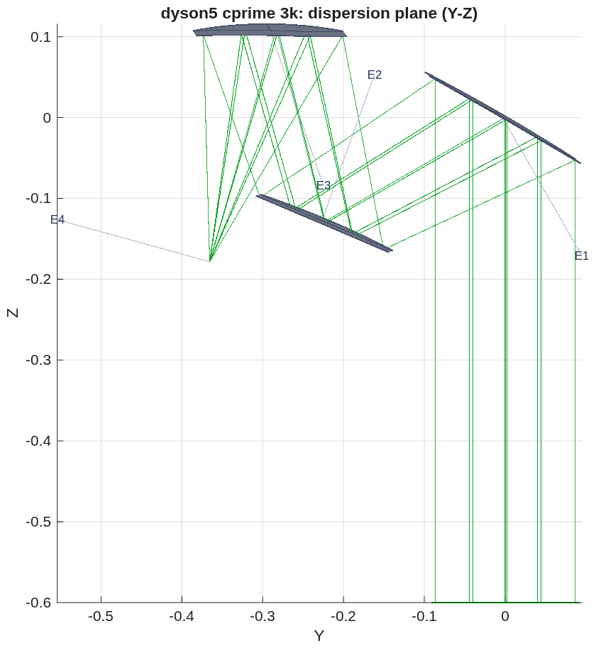
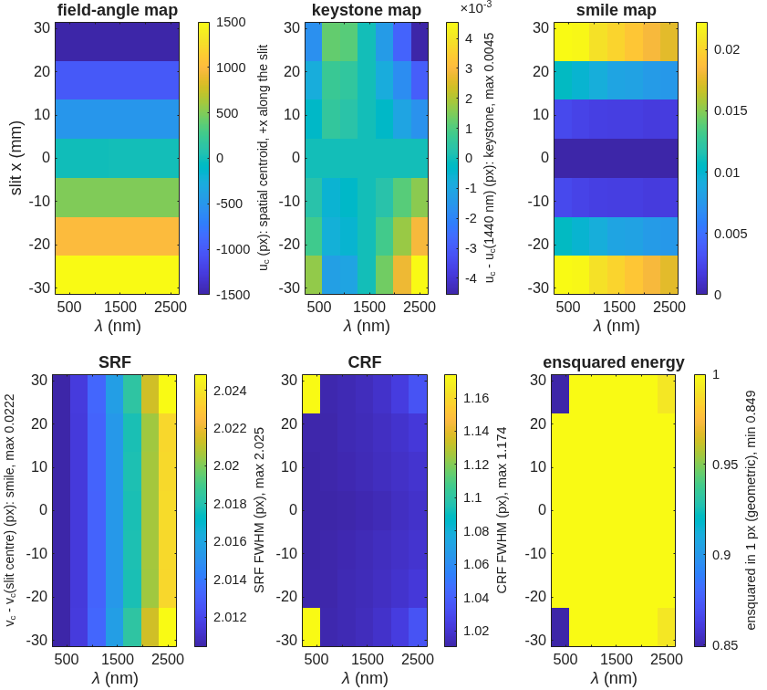

<!--
deck_dyson_3k.md -- the 3k Dyson module brought to the pixel: a freeform
telescope of the SBG form (tma_longslit R9) feeding the 240 mm CaF2 Dyson of
record.  Parallels deck_dyson_record.md (2026-10-06, sent to Jim and Joe).
DRAFT -- pending Dave's sign-off.  Build: python3 make_brief_slides.py deck_dyson_3k.md
Sources: macos/REPORT_dyson5_cprime.md; templates/10_telescopes/tma_longslit/README.md;
challenges/dyson5/dyson5_cprime_3k.in + dyson5_t5f_cprime_*; BRIEF_to_dyson5.md
addenda 47-49; the SBG VSWIR paper (Bradley et al., ICSO 2024, Proc. SPIE 13699).
Figures are the runners' own PNGs; the figs_dyson/*_rc.png copies are recomposed at the panel level (recompose.py: trimmed; the 7-panel maps strip in two rows), never re-rendered.
-->

# The 3k Dyson Module Brought to the Pixel
A freeform three-mirror telescope of the SBG VSWIR form, seeded from the published layout and solved to Joe's specification, feeding the 240 mm CaF2 Dyson of record: smile 0.02, keystone 0.006, CRF 1.17 pixels, 0.85 of the energy in one pixel, end to end over the 9.4° strip.
D. C. Redding, with Claude Code.
October 2026.  Working record; no proprietary prescription is used.
DRAFT — pending review.
~ Since the 2026-10-06 deck: Jim's answers and the project's own paper settled the trade toward two 3k modules and pointed at the telescope form; a design template built on that form reaches the pixel at every field of the strip, with the cone bounded and the slit telecentric; the 0.14-pixel "smile" that remained was the scorer's launch convention, not the optics.  Both modules now meet the specification end to end; SRF sits at the two-pixel slit's floor.  What is left is the spectrometer's: tolerances, the aspheric-lens form, throughput by band.

## Contents | What changed, the seed, the telescope of record, the module scored, how the solve got there, the two smile conventions, the spectrometer, the comparison, the questions
::: left
- **3** The target and how it is scored
- **4** What changed since the last deck: Jim's answers and the paper
- **5** The seed: the SBG form, first order
- **6** The telescope of record: freeform three-mirror, R9
- **7** The 3k module, scored: spectrometer, telescope, and the two together
- **8** The 3k module, end to end
- **9** How the solve got there: six rungs and three lessons
::: right
- **10** Smile is a convention: the launch, not the optics
- **11** The cone, the spec and the paper's beam
- **12** The spectrometer: toleranced, and a conic grating for margin
- **13** Two of 3k or four of 1.5k, updated
- **14** Questions for Jim and Joe
- **15** Next steps
- **16** Run it yourself
- **17** Backup: the first order by the numbers; the rungs per field; the chief-tilt diagnostic; the tolerance ladder by the numbers; the engine finding; records

## The target and how it is scored | Joe's specification at Jim's ground sample; the metrics stated once, with the paper's bounds in the same units
::: left
| item | Joe (this work) | the SBG VSWIR paper |
|---|---|---|
| F-number | 1.8 | 1.8 |
| aperture; focal length | 183 mm; 330 mm | 192 mm; 345 mm |
| pixels | 18 µm; 3000 cross-track, 500 spectral | 18 µm; 3072 × 512, 2 co-added spectrally |
| slit | 54 mm; 2 pixels (36 µm) | 54.45 mm; 36 µm |
| band | 380–2500 nm | 380–2500 nm |
| smile, keystone | < 0.1 px (1.8 µm) | 1.8 µm each (5 % of a co-added px; 10 % of a px) = 0.10 of our pixel |
| SRF FWHM | 1.5–2.0 px (27–36 µm) | < 1.8 co-added px (64.8 µm) |
| CRF FWHM | < 1.5 px (27 µm) | < 2.8 px (50.4 µm) |
| ARF FWHM (telescope, across the slit) | – | < 2.8 px (50.4 µm) |
| field per module | 9.4° (3k) | 8.9° |
::: right
- **Smile:** centroid drift along the slit at fixed wavelength; **keystone:** drift across wavelength at fixed slit position; both from ray centroids, in pixels.
- **SRF, CRF:** slit ⊗ line-spread function ⊗ pixel ⊗ Airy, FWHM (Mouroulis & Green 2018).  With a 2-pixel slit a perfect spectrometer gives SRF = 2.010–2.023 px over the band (slit, pixel and diffraction): the floor.
- **Energy in one pixel:** the fraction of a point image inside one 18 µm pixel; design rule 0.75.
- **End to end** is one prescription from the sky to the detector, the grating its stop, scored by the spectrometer's own scorer.  Smile end to end depends on how each field is launched onto the slit — slide 10 — so it is given under both conventions.
- **The paper's SRF is in co-added pixels** (36 µm); its bounds are converted to micrometers in every table here.
~ Every number is a MACOS ray trace of a committed prescription; no coatings, no tolerances.  Paper: Bradley et al., "Finalized optical design of the SBG VSWIR Wide Swath Imaging Spectrometer," ICSO 2024, Proc. SPIE 13699, 1369945 (Tables 1–3).

## What changed since the last deck: Jim's answers and the paper | The trade leans to two 3k modules; the telescope is designed alone, telecentric at the slit, with its cone bounded; the air gap stands; the paper's form is the seed
::: left
- **Two modules, not four.**  Jim: four telescopes, spectrometers and detectors cost integration, test and calibration, not mass; detectors come as 2k × 2k and 3k × 0.5k, a 1.5k × 0.5k is NRE.  Materials are "almost always a tiny fraction of the instrument cost," so the CaF2 volume is not the discriminator.  The paper's own trade reached the same answer: two identical telescope + Dyson modules, each half of the 180 km swath.
- **The telescope, designed separately.**  Jim: telescope and spectrometer each telecentric at the slit, the telescope a little faster than the spectrometer, and no rays at F/1.2.  The paper: the telescope optimized alone for uniform small spots along the slit under constraints on F/# anamorphicity, baffle clearance and working distance; then the Dyson added for end-to-end keystone and CRF.
- **The window is an order-sorting filter** and cannot be bonded to CaF2 (CTE); fused silica to silica has a bad bonding history.  Six crossings, 0.81 uncoated, is the baseline.
::: right
- **The paper's telescope** is a freeform TMA at f 345 mm, 192 mm, 8.9°, chosen over an even-asphere TMA for tolerance insensitivity, not nominal performance: spots 2–3 µm, "diffraction limited over most of the band," all aluminum at 280–300 K.
- **The paper's spectrometer** is an aspheric CaF2 Dyson lens with a conic grating (their Option B), no corrector lens, at 240 K; smaller than the telescope.
- **The Offner** does not go much below F/3 at reasonable size (Jim), which confirms the F/1.8 Offner's exit in the last deck.
- **AR and blaze** are tailored to the photon-starved long-wavelength end; throughput is a per-band number, not one figure.
~ Jim's comments of 2026-10-07 in line on the 10-06 note; the paper's numbers on this slide are its Tables 1–3 and Figs. 1 and 4.  Recorded in `BRIEF_to_dyson5.md` addendum 47.

## The seed: the SBG form, first order | The paper's layout digitized and scaled to Joe's focal length; with the stop at M2 the first order is telecentric in closed form, has no intermediate focus, and gives 299 mm of working distance for the Dyson
::: left
{h=4.6}
::: right
- **The seed:** the paper's Fig. 4b, read off its 200 mm scale bar and scaled by 330/345 — legs M1→M2 258 mm, M2→M3 246 mm, M3→slit 300 mm; chief incidence 30°, 37°, 15°; M2 the small mirror at the stop.
- **Two facts the first order forces.**  (1) **A tilted sphere cannot do it:** the legs are the same in and across the fold plane, so each mirror needs local radii at the chief with R_t / R_s = 1/cos² i (1.33, 1.57, 1.07); an off-axis conic section does this natively, and with the parent axis at the incidence angle all three are off-axis paraboloids — the seed.  (2) **The stop at M2 makes telecentricity closed-form:** M2 sits at M3's front focus.  M1 weak concave (f +1012 mm), M2 convex (−452), M3 f +246 = the M2→M3 leg; the marginal ray never crosses the axis between mirrors, so there is no intermediate image — the Korsch with a real M2–M3 focus cannot be telecentric with the stop at M2, and this family has no such focus.
- **In the engine, before any figure:** chiefs within 0.093° of the slit normal over ±4.7°, plate scale 329.99 mm, every field admitted, M2 footprint 136 mm, clearance +10 mm, working distance 299 mm; not imaging (2 mm spots).
~ Template `templates/10_telescopes/tma_longslit/` (parameters, runner, demo, README, test); first order `tls_first_order.txt`; `BRIEF_to_dyson5.md` addendum 48.  Beams: 183 mm at M1, 136 at M2, 166 at M3.

## The telescope of record: freeform three-mirror, R9 | Off-axis conic sections with a pole-frame polynomial of degree 3–6 on each mirror: FWHM 1.02 × 1.02 pixels at every field of the strip, chiefs within 0.033° of the slit normal, marginal rays between F/1.80 and F/1.89, clearance +12 mm
::: full
| field (±) | spot rms (µm) | FWHM along / across the slit (px) | energy in a pixel | chief to the slit normal | F/# along / across | chief − centroid across the slit (µm) |
|---|---|---|---|---|---|---|
| 0 | 1.8 | 1.02 / 1.02 | 1.00 | 0.000° | 1.894 / 1.806 | 0.00 |
| 1.175° | 2.2 | 1.02 / 1.02 | 1.00 | 0.002° | 1.894 / 1.803 | – |
| 2.35° | 2.5 | 1.02 / 1.02 | 1.00 | 0.008° | 1.893 / 1.801 | – |
| 3.525° | 2.0 | 1.02 / 1.02 | 1.00 | 0.018° | 1.892 / 1.798 | – |
| 4.7° | 2.3 | 1.02 / 1.02 | 1.00 | 0.033° | 1.889 / 1.797 | 0.03 (R7: 2.43) |
::: left
- **Geometry:** the seed's legs and incidences kept; the layout stays the form (unbounded, the incidence angles collapse to a coaxial train that self-obscures).  Plate scale 329.9 mm local, 330.1 along track.  Footprints M1 235 × 202, M2 132 × 166, M3 215 × 173 mm; freeform departure 0.46 / 0.55 / 1.11 mm P-V over the lit patch (the 1.5k asphere telescope: 2.1 mm on M1).  Clearance +12.1 mm; working distance 299.4 mm.
- **Figure:** a pole-frame polynomial (`Surface= Monomial`, degree 3–6, even in x); degree ≥ 3 leaves value, slope and curvature at the pole untouched, so the first order survives the figure.  Even aspheres about the parent axis were the wrong basis on these sections (the poles sit 0.9–1.5 m off axis).
::: right
- **The constraint rows that make it a long-slit front end, in every rung:** the chief angle to the slit normal per field (telecentric); a hinge on the marginal rays' F/# at the slit, along and across, outside [1.7, 1.8] (the paper's F/# anamorphicity); and, in R9, the chief − centroid offset across the slit (slide 10).
- **Not done:** no tolerancing, no coatings, no stray-light or mirror sizing beyond the footprints.
~ Prescription `challenges/dyson5/dyson5_cprime_3k.in` (= `tls_R9_ffo.in`); engine numbers, model 256, nine fields over ±4.7°, mirror-symmetric.  The gate `tTmaLongslit` re-scores it by name.  `REPORT_dyson5_cprime.md`.

## The 3k module, scored: spectrometer, telescope, and the two together | Both meet Joe's specification; together they image at the pixel over the strip; SRF is the two-pixel slit's floor
::: full
| criterion | Joe | paper | spectrometer alone (240 mm CaF2 Dyson) | telescope alone (R9) | together, end to end |
|---|---|---|---|---|---|
| smile | < 0.1 px | < 1.8 µm (0.10 px) | 0.005 px | – | 0.022 px slit-filled (0.4 µm); 0.016 px point-source shift |
| keystone | < 0.1 px | < 1.8 µm (0.10 px) | 0.006 px | – | 0.006 px (0.1 µm) |
| CRF FWHM | < 1.5 px | < 50.4 µm | 1.21 px | 1.02 px along the slit | 1.17 px (21 µm); 1.26 at roll 180° |
| SRF FWHM | 1.5–2.0 px | < 64.8 µm | 2.024 px (2-px slit) | 1.02 px across the slit (ARF 18.4 µm) | 2.025 px (36.5 µm) |
| energy in one 18 µm pixel | > 0.75 | – | 0.82 | 1.00 | 0.85 (0.81 at roll 180°) |
| image blur (rms, as placed) | – | 2–3 µm (paper) | – | 1.8–2.5 µm | – |
| plate scale | 330 mm | 345 | – | 329.9 / 330.1 mm | 330.1 mm |
| chief rays at the slit | telecentric | telecentric | – | within 0.033° | – |
| marginal rays at the slit | – | F/# anamorphicity bounded | – | F/1.80–1.89, none below 1.7 | grating admits 98.9 % |
| clearance, worst pair | > 0 | – | +0.54 mm (slit vs block face) | +12.1 mm | +0.6 mm (the spectrometer's pair) |
| glass, mass | – | – | 4.5 L, 14.3 kg | mirrors not yet sized | – |
~ Spectrometer: `dyson5_jim_3a.txt` (size:F:240); telescope: `dyson5_cprime_3k.in`, `REPORT_dyson5_cprime.md`; together: `dyson5_t5f_cprime_centroid_roll000.txt` / `_roll180`, `_chief_roll000` (the point-source shift), 7 fields × 7 wavelengths.  No coatings, no tolerances in any column.  SRF 2.025 against a floor of 2.010–2.023 (slit, pixel, diffraction): the Dyson adds at most 0.0015 px, 0.03 µm.

## The 3k module, end to end | The freeform telescope feeding the 240 mm CaF2 Dyson: smile 0.02, keystone 0.006, CRF 1.17, SRF 2.025 px at every slit position and wavelength; 98.9 % of the light through the grating; clearance +0.6 mm, the Dyson's own slit-to-block-face margin
::: left
{h=4.6}
::: right
{h=3.4}
- **CRF 1.02 px at the inner fields and 1.17 at the strip ends; SRF 2.02 everywhere; smile 0.022 → 0.018 px from 380 to 2500 nm; keystone 0.006 px at the ends, 0 at the center.**  Against the (c) solve of the last deck (smile 1.64, CRF 4.02, SRF 4.99, 4–10 % in a pixel), every line moved to the pixel.
~ Record `dyson5_t5f_cprime_centroid_roll000.txt` (each field's centroid on the slit line); the chief-launched twin `_chief_roll000.txt` gives the point-source shift 0.016 px; roll 180° about the chief: CRF 1.26, energy 0.81, the rest unchanged.  Prescription `dyson5_t5f_cprime_centroid_roll000_e2e.in` (3 telescope + 8 slit/Dyson elements).

## How the solve got there: six rungs and three lessons | The merit decided every step: equal weights spent the budget on the strip center; a constraint set weighted below one percent of the merit is not a test; the last tenth of a pixel of "smile" was the launch
::: full
| rung | what changed | outer-field FWHM along the slit (px) | e2e smile, point-source (px) | keystone (px) | CRF (px) | SRF (px) |
|---|---|---|---|---|---|---|
| R4 | conics + even aspheres on the seed layout | 5–7 | 0.73 | 0.009 | 2.5 | 3.9 |
| R5 | pole-frame freeform, centroid-bow rows added | 5–7 | 0.09 | 0.03 | 7.0 | 2.5 |
| R6 | R5 + 3000 more evaluations | 5–7 | 0.15 | 0.04 | 7.2 | 2.5 |
| R7 | warm from R4: along-slit rows ×3, outer fields ×2–3, bow rows kept | **1.02** | 0.14 | 0.006 | **1.18** | 2.025 |
| R8 | R7 + telecentric rows ×30 (a test of the chief angle) | 1.02 | 0.14 | 0.005 | 1.18 | 2.025 |
| **R9** | R7 + chief − centroid rows across the slit ×1000 | **1.02** | **0.016** | 0.006 | **1.17** | 2.025 |
- **Equal weights were the CRF wall.**  R5 and R6 weighted every field and both axes equally on rms spot size and spent it on the strip center (4 µm) while the outer half sat at 5–7 px along the slit; more budget on the same merit moved nothing.  Weighting the along-slit rows and the outer fields, from R4, took every field to the Airy floor in one rung.
- **A row set below one percent of the merit is not a test.**  R8's telecentric rows at ×30 were 0.4 % of the merit; the solver never worked on them and R8 is R7 to the third digit.  R9's offset rows at ×30 would have been 0.07 %; at ×1000 they dominated, and the solve converged in 507 evaluations.
- **The remaining 0.14 px of "smile" was the launch convention** (slide 10), and the row that removed its cause cost nothing at the pixel.
~ `REPORT_dyson5_cprime.md` (every rung and the four solves thrown out); the template's README, "What the ladder taught."  Each rung: 3000 evaluations of the engine's own trace (R9: 507), model 256.

## Smile is a convention: the launch, not the optics | The join lands each field's chief ray on the slit line and scores the centroid, so the telescope's coma — the chief-minus-centroid offset across the slit — read as smile; the Dyson fed with the telescope's chief angles does not move
::: left
| Dyson alone, each slit point's chief tilted by R7's angles | smile | keystone | CRF | SRF |
|---|---|---|---|---|
| base (the record) | 0.0050 | 0.0058 | 1.213 | 2.024 |
| along-track component (−0.51 mrad at the strip end) | 0.0049 | 0.0061 | 1.213 | 2.024 |
| cross-track component (±0.27 mrad) | 0.0048 | 0.0063 | 1.213 | 2.024 |
| along-track × 2 | 0.0049 | 0.0064 | 1.213 | 2.024 |
| both | 0.0048 | 0.0066 | 1.213 | 2.024 |
- **The chief angle is not the cause:** keystone moves (the hook is live), smile does not, even at twice the angle.
::: right
| rung | predicted from the telescope's offset | e2e smile, chief launch |
|---|---|---|
| R4 | 0.655 | 0.732 |
| R5 | 0.086 | 0.090 |
| R6 | 0.122 | 0.149 |
| R7 | 0.135 | 0.140 |
| R8 | 0.133 | 0.138 |
- **The offset predicts every rung:** on R7 the chief sits 0 / 0.2 / 0.7 / 1.4 / 2.4 µm from the centroid across the slit at 0 / 1.2 / 2.4 / 3.5 / 4.7°; the spread of that offset is the e2e smile.
- **Two conventions, both reported.**  *Slit-filled* (the paper's: its telescope-fed smile equals its spectrometer-alone smile): each field's centroid on the slit line — the spectrometer's smile, 0.022 px.  *Point-source*: the chief on the slit line — where a star's spectrum lands, 0.016 px on R9 (0.14 on R7).  R9's row on the offset closed the second without touching the first.
~ Diagnostic `tls_dyson_chief_tilt` (the spectrometer alone, the launch tilted per field); the join scorer `dyson5_t5f` now carries both launches (`tel5f_launch` chief | centroid), the record's rows reproduce under the first.

## The cone, the spec and the paper's beam | The marginal rays leave the telescope between F/1.80 and F/1.89 in the two directions, none below F/1.7; the along-slit F/1.89 is Joe's own aperture at Joe's focal length
::: left
- **Why it is a row:** the last deck's 3k solve let its marginal rays run to F/1.19 into an F/1.8 spectrometer; the grating, sized for F/1.8, passed 95–98 % of the light, and nothing in the merit knew.  Jim: "I don't see why some rays correspond to an f/1.2 cone."  The paper constrains the F/# anamorphicity.
- **The row:** a hinge on the working F/# of the marginal rays at the slit, along and across, outside [1.7, 1.8], in every rung.  R9: F/1.889–1.894 along the slit, F/1.797–1.806 across; the grating admits 98.9 % at every field.
::: right
- **Along the slit it sits above 1.8, and that is the specification:** D 183 mm at f 330 mm is F/1.803; a cone a little faster than the spectrometer's — Jim's "a little faster" — needs a larger entrance beam, the paper's 192 mm.  A spec question for Jim and Joe, not a solve question; the telescope holds Joe's numbers.
- **Across the slit** the cone is F/1.80: the slit truncates the image in that direction, and the across-slit FWHM (the paper's ARF) is 1.02 px against its 2.8 px bound.
~ `REPORT_dyson5_cprime.md`, R9 per-field table; F/# from the marginal rays as 1/(2 sin u).

## The spectrometer: toleranced, and a conic grating for margin | SRF sits at the two-pixel slit's floor; every large tolerance is a focus term the detector's focus removes; keystone sets the alignment tolerances at 26 µm and 35 µrad; a conic on the grating takes the energy in a pixel from 0.82 to 0.99
::: left
- **SRF is not a miss.**  Slit ⊗ LSF ⊗ pixel ⊗ Airy for a perfect spectrometer is 2.010 px at 380 nm and 2.023 at 2500 nm; the Dyson of record sits 0.0001–0.0015 px above that at every wavelength, alone and behind the telescope.  In the paper's units 36.5 µm against 64.8.  Joe's "1.5–2.0" is met at its floor; 1.5 would need a narrower slit.
- **The Dyson of record is the paper's Option A:** 240 mm CaF2, an aspheric lens (K 0.043 with h⁴, h⁶) and a spherical grating, no meniscus; smile 0.005, keystone 0.006, CRF 1.21, 0.82 of the energy in a pixel; 4.5 L, 14.3 kg.
- **Toleranced, 21 rows, alone and through the join:** every large sensitivity is a focus term — lens radius and thickness, the air space, slit and detector defocus, grating radius (the strongest: dR/R 10⁻⁴ costs CRF +1.9 px uncompensated, and a 76 µm detector refocus removes it to 0.006).  One-axis detector focus is the compensator; x/y adds nothing.  Smile is loose (≥ 300 µm or µrad).
::: right
- **Keystone sets the tolerances, and no compensator helps** (it is lateral color).  For the paper's as-built keystone (1.03 µm = 0.057 px): lens and grating decenter along the slit 26 µm, grating tilt 35 µrad, clocking 88 µrad; for Joe's 0.1 px: 47 µm, 47 µm, 64 µrad, 162 µrad.  The 1.5k Dyson is twice as sensitive (13 µm).  Linear where it matters (keystone vs decenter 1.10; CRF vs grating radius 1.03).
- **Thermal:** 1 K of CaF2 index is negligible (CRF +0.001); CaF2's radius and thickness terms cancel (+0.050 / −0.051 px per K); the open terms are the aluminum air space (−0.22 px per K) and the N-BK7 grating radius (+0.14) — focus terms, refocus-compensable, which is the paper's "CRF limits the spectrometer's temperature requirements."
- **Option B — a conic on the grating (K −0.004) with the lens re-solved:** alone CRF 1.03 (1.21), energy in a pixel 0.99 (0.82), keystone 0.002 (0.006); behind R9: CRF 1.06, energy 0.955, smile 0.012; SRF the floor in both.  Its keystone sensitivities are 6–45 % higher than A's (clocking most): **it buys nominal margin, not alignment insensitivity** — the paper's preference for B on tolerances is not reproduced by alignment alone (its as-built numbers include fabrication and thermal, not modeled here).  Recommended as the spectrometer candidate for its margin.
~ `REPORT_dyson5_spec.md` (the ladder, 3k and 1.5k, Option B and its ladder); `spectrometer_sens`, gate `tSpectrometerSens`.  The compensator residuals are given for detector focus alone and focus + x/y.  A full every-CTE soak is the next row.  Throughput by band follows.

## Two of 3k or four of 1.5k, updated | Both modules now image at the pixel end to end; the trade is labor, detectors and integration, not optics or glass — and Jim's and the paper's answer is two
::: full
| | 2 × CaF2, 3k, 54 mm slit | 4 × fused silica, 1.5k, 27 mm slit |
|---|---|---|
| block radius = thickness | 240 mm | 130 mm |
| spectrometer alone: smile / keystone / CRF / SRF / energy in a pixel | 0.005 / 0.006 / 1.21 / 2.02 px / 0.82 | 0.007 / 0.009 / 1.03 / 2.02 px / 1.00 |
| telescope | freeform three-mirror of the SBG form (R9): 1.02 px at every field | three off-axis aspheres: 0.4 px center, 0.8 px at the strip ends |
| end to end: smile / keystone / CRF / SRF | 0.02 / 0.006 / 1.17 / 2.025 px | 0.50 / 0.01 / 1.22 / 2.20 px |
| end to end: energy in one pixel | 0.85 over the strip | 0.30–0.89 (0.8 over the central third) |
| light admitted by the grating | 98.9 % per field | 99 % per field |
| clearance, worst pair | +0.6 mm (slit package vs block face) | +0.38 mm (detector package vs block face) |
| glass for 6000 pixels | 9.0 L, 28.5 kg CaF2 (12.4 L single crystal to carve) | 3.0 L, 6.6 kg fused silica |
| telescopes / spectrometers / detectors | 2 / 2 / 2 × (3072 × 512, a standard format) | 4 / 4 / 4 × (1.5k × 0.5k, NRE) |
| integration, test, calibration | two of each | four of each (Jim: the cost that dominates) |
| materials | "a tiny fraction of the instrument cost" (Jim) | the same |
~ Records `dyson5_jim_3a.txt`, `dyson5_t5f_GM_1k5_bAs_ap.txt`, `dyson5_t5f_cprime_centroid_roll000.txt`.  The four-module block (0.97 × 0.41 × 0.76 m, 14.6 kg of optics) of the last deck stands as the fallback.  The air gap at the window stands on both (six crossings, 0.81 uncoated).

## Questions for Jim and Joe | Three the ray trace cannot settle
- **The entrance beam.**  Joe's 183 mm at f 330 mm is F/1.803, so the telescope's cone along the slit is F/1.89 and cannot be "a little faster than the spectrometer" without a larger beam; the paper's is 192 mm.  Is the aperture Joe's number or the paper's?
- **The slit and SRF.**  With a 2-pixel slit the SRF floor is 2.01–2.02 px (36 µm) with the pixel and diffraction, where this design sits to 0.03 µm; the paper's bound is 64.8 µm.  Is the 1.5–2.0 px range read against a 2-pixel slit, or does the project want a narrower slit at the throughput's expense?
- **The spectrometer's form.**  Our Dyson of record is the paper's Option A and meets the specification; its Option B (the conic grating) buys energy in a pixel 0.82 → 0.99 here but not alignment insensitivity.  What drove B in the build — fabrication, thermal, or the margin?
~ Still open from the last round: the detector window's gap (now answered: an order-sorting filter, not bonded) and the AR by band.

## Next steps | The spectrometer's tolerances and form; the telescope's tolerances and sizing; the record
::: left
- **Spectrometer:** the every-CTE thermal soak row; fabrication terms (figure, the grating's period and groove errors) in the ladder; throughput by band with the blaze; Option B as the candidate, its keystone tolerances (25 µm, 33 µrad) stated beside its margin.
- **Telescope:** the same ladder on R9 (mirror decenter, tilt, figure; the slit's position), the mirrors sized with baffles, the two modules' lines of sight canted to their strips, as the four-module block was.
::: right
- **The record:** the template `tma_longslit` is general (one parameter file: f, D, F/#, strip, slit, the cone bound, working distance, the seed legs); its default run is this module.  A note to Jim and Joe with this deck, superseding "the 3k module is not there yet."
- **In the engine, from this round:** the api's element stop now takes the CLI's range (it refused the secondary of a four-element telescope); both launch conventions in the join scorer; the spectrometer's chief-tilt diagnostic.
~ `BRIEF_to_dyson5.md` addenda 48–49.

## Run it yourself | One parameter file, one runner, every stage through it; the telescope is a template any long-slit spectrometer can use
::: full
```
cd <path>/MACOS_resources/mmacos                   % the mmacos folder of the repository (the engine is built already)
matlab
>> run('mmacos_setup.m');
>> addpath('templates/10_telescopes/tma_longslit');  addpath('challenges/dyson5');
>> P = tma_longslit_params;                        % f, D, F/#, strip, slit, pixel, the telecentric and cone bounds, the seed legs
>> OUT = tma_longslit_run({'first_order','section','figure','score','e2e'}, P);   % the ladder to the deck of record, then the join
>> OUT = dyson5_run(struct('stages', {{'t5f'}}, 'tel5f_deck', 'dyson5_cprime_3k.in'));   % the 3k module end to end, both launches
```
- **Changeable parameters live in two files:** `tma_longslit_params.m` for the telescope (spec, seed, rows and weights, field set), `dyson5_params.m` for the Dyson (F-number, pixels, band, slit, block radius, glass, order, the join).  Every record in this deck is a stage output under `challenges/dyson5/` or the template's folder.
- **Checks:** `./run_mmacos_tests.sh tTmaLongslit tSpectrometerRx tTelescopeRx tStopReload` and the grating, glass, propagation and root-pick classes, all in the fast suite (566 pass, 0 fail, 2026-10-07).  `tTmaLongslit` re-scores the deck of record by name.

## Backup

## The first order by the numbers | The seed's legs at f 330 mm, the powers the telecentric closure gives, the beams, and where the alternatives fail
::: left
| item | value |
|---|---|
| legs M1→M2, M2→M3, M3→slit | 258.3, 245.8, 299.4 mm (paper: 270, 257, 313 at f 345) |
| chief incidence M1, M2, M3 | 30°, 37°, 15° |
| focal lengths M1, M2, M3 | +1012, −452, +246 mm (M3's = the M2→M3 leg) |
| entrance pupil | virtual, 347 mm behind M1 |
| beams at M1, M2, M3 | 183, 136, 166 mm |
| intermediate focus | none (the marginal ray never crosses the axis) |
| chief to the slit normal, section as emitted | ≤ 0.093° over ±4.7° |
| plate scale as emitted | 329.99 mm local, 329.87 at the edge |
::: right
- **Stop at M1, or between M1 and M2:** also telecentric, but it flips the form and M2 grows to 310 / 220–250 mm.
- **Tilted spheres:** cannot meet the first order in both sections (R_t / R_s = 1.33, 1.57, 1.07 needed); off-axis conic sections can — paraboloids when the parent axis is at the incidence angle.
- **The paper's drawing left one thing open** — whether the beam passes through a focus between M2 and M3 — and the numbers settled it: it does not.
~ `tls_first_order.txt`; template README, "The two facts the first order forces."

## The rungs per field | What each rung's telescope looked like along the slit, and what the join made of it
::: full
| rung | DOFs | spot FWHM along the slit, fields 0 → 4.7° (px) | chief − centroid across the slit at 4.7° (µm) | e2e CRF / smile (point-source) |
|---|---|---|---|---|
| R4 | conics, θ, focus, h⁴ h⁶ | 1–2 center, 5–7 outer | 9.1 | 2.5 / 0.73 |
| R5 | + pole-frame freeform 3–6, centroid-bow rows | 1 center, 5–7 outer | 1.1 | 7.0 / 0.09 |
| R6 | R5, +3000 evaluations | as R5 | 1.5 | 7.2 / 0.15 |
| R7 | from R4: along-slit ×3, outer fields ×2–3 | 1.02 everywhere | 2.43 | 1.18 / 0.14 |
| R8 | R7 + telecentric ×30 | 1.02 | 2.4 | 1.18 / 0.14 |
| R9 | R7 + offset rows ×1000 | 1.02 | 0.03 | 1.17 / 0.016 |
- The four solves thrown out (unbounded layout, free R_t / R_s, closure variants, a resume defect) are in the report; none changed the form.
~ `REPORT_dyson5_cprime.md`; `tma_longslit/runs_*.log`.

## The chief-tilt diagnostic | How the smile's cause was isolated without a solve
::: full
- **The hypothesis:** the telescope's chief rays reach the slit up to 0.51 mrad from its normal in the dispersion direction, even in field and roughly quadratic — smile's shape — and a Dyson's spectral centroid moves with the input chief angle.
- **Why it could not be tested by hand on the joined deck:** each field has two sky angles but needs three conditions (land on the slit line, two chief-angle components), and the join re-aims every launch through the grating, so a telecentric error appears there as a pupil shift.
- **The test:** the spectrometer alone, each slit point's input chief tilted by the telescope's measured angles, scored as the record is (slide 10's left table).  Smile 0.0050 → 0.0049; keystone moves, so the hook is live.  The hypothesis is dead; the chief − centroid offset model (right table) predicts all five rungs.
- **Why R8 said nothing:** its telecentric rows were 0.4 % of the merit.
~ `tls_dyson_chief_tilt.m` (wraps the launch; the library untouched), its `.mat`; the template README.

## The tolerance ladder by the numbers | One perturbation at a time on the 3k Dyson of record, scored alone and through the R9 join; the compensator is the detector's focus
::: full
| perturbation (unit) | CRF, uncompensated (px) | CRF after detector refocus | keystone (px) | the tolerance for the paper's keystone CBE / for Joe's 0.1 px |
|---|---|---|---|---|
| lens decenter along the slit, 10 µm | – | – | 0.0099 | 26 µm / 47 µm |
| grating decenter along the slit, 10 µm | – | – | 0.0099 | 26 µm / 47 µm |
| grating tilt about the slit, 10 µrad | – | – | 0.0074 | 35 µrad / 64 µrad |
| grating clocking, 10 µrad | – | – | 0.0029 | 88 µrad / 162 µrad |
| grating radius dR/R 10⁻⁴ | +1.93 | +0.006 | – | focus-compensated |
| lens radius, thickness; air space; slit, detector defocus | focus terms | ≤ 0.006 | – | focus-compensated |
| CaF2 index, 10⁻⁵ (1 K) | +0.0014 | – | – | negligible |
| CaF2 radius + thickness per K (CTE) | +0.050 − 0.051 | – | – | cancel |
| aluminum air space per K; N-BK7 grating radius per K | −0.22; +0.14 | focus terms | – | refocus-compensated |
- **Keystone is lateral color: no compensator touches it.**  Smile is loose everywhere (≥ 300 µm or µrad).  Linearity at 2×: keystone vs decenter 1.10, CRF vs grating radius 1.03, SRF 2.6 (quadratic, and at the floor).
- **The 1.5k Dyson** has the same pattern at twice the keystone sensitivity (1.82 × 10⁻³ px per µm: 13 µm for the paper's CBE, 25 µm for Joe).  **Option B** raises the keystone sensitivities 6–45 % (clocking most): 25 µm, 33 µrad, 64 µrad.
~ `REPORT_dyson5_spec.md`; 21 rows; the paper's Option A as-built keystone 5.7 % of a pixel = 1.03 µm (Table 2).  Compensator residuals for focus alone and focus + x/y are both in the report (x/y adds nothing: the metrics are relative).

## An engine finding from this round | The api refused an element stop on the secondary of a four-element telescope
::: full
- **`stop_info_set` refused `iElt ≥ nElt−2` and `nElt ≤ 3`** — the original wrapper's range, with no engine reason — so `macos.stop(2)` failed on every M1-M2-M3-FP deck while the prescription keyword `ApStop=` and the CLI's STOP (1..nElt) accepted it.  The template worked around it with one deck per field until the fix.  Now the CLI's range; gate `tStopReload/test_stop_accepts_the_secondary_of_a_four_element_deck`.
- **Also from this round, in the tools:** both launch conventions in the join scorer (`dyson5_t5f`, `tel5f_launch`), the per-field chief-angle components in every rung table, the spectrometer's chief-tilt diagnostic.
~ macos `a09cd59`; resources `9845c2d`.

## Records behind each slide | Every number traces to a runner stage and its record file
::: full
| slide | record |
|---|---|
| 5 | `tma_longslit/tls_first_order.txt`, `tls_section_layout.png`; `dyson5_cprime_3k_viewyz.png` |
| 6 | `challenges/dyson5/dyson5_cprime_3k.in`; `REPORT_dyson5_cprime.md` (R9); `tTmaLongslit` |
| 7, 8 | `dyson5_jim_3a.txt`; `dyson5_t5f_cprime_centroid_roll000.txt`, `_roll180.txt`, `_chief_roll000.txt`; `_e2e.in`, `_maps.png`, `_e2e_viewyz.png` |
| 9, 10 | `REPORT_dyson5_cprime.md` (R4–R9); `tls_dyson_chief_tilt.mat`; `tls_e2e_both_conventions.mat` |
| 11 | R9 per-field table (`REPORT_dyson5_cprime.md`) |
| 12 | `dyson5_jim_3a.txt`; `REPORT_dyson5_spec.md`; `spectrometer_sens`, `tSpectrometerSens`; `BRIEF_to_dyson5.md` addendum 49 |
| 13 | `dyson5_jim_3a.txt`, `dyson5_t5f_GM_1k5_bAs_ap.txt`, `dyson5_block4.txt` |
~ All under `MACOS_resources/mmacos/challenges/dyson5/` and `templates/10_telescopes/tma_longslit/`, branch dev-candidate; the reports under `macos/`.  Public: nasa-jpl/macos, nasa-jpl/MACOS_resources.
