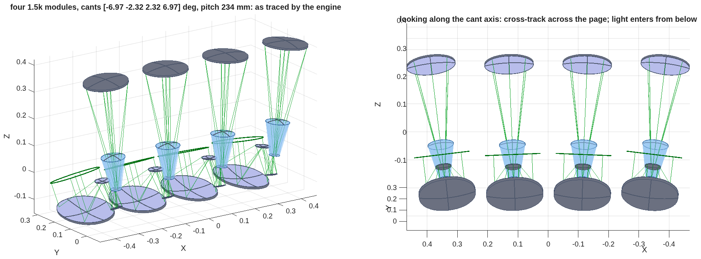
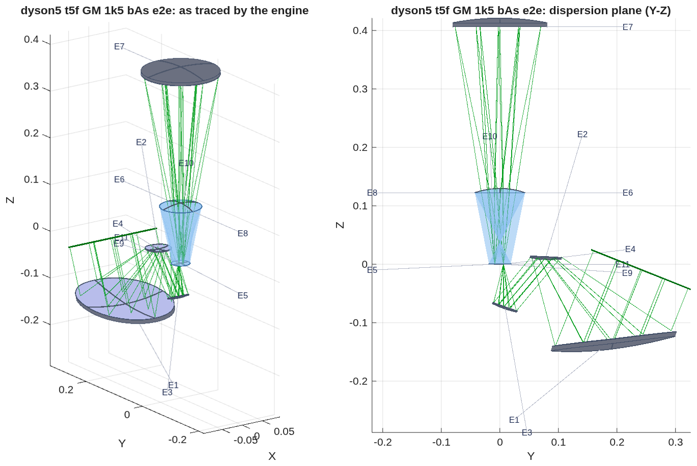
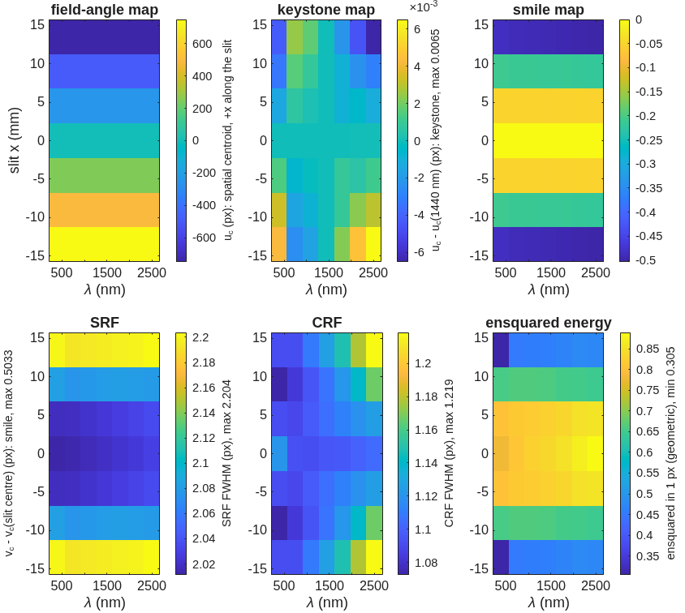
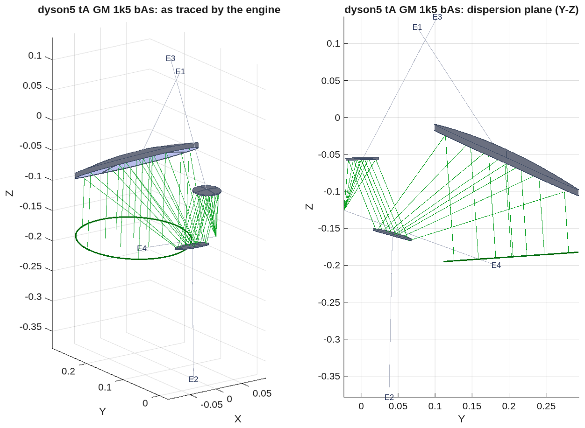
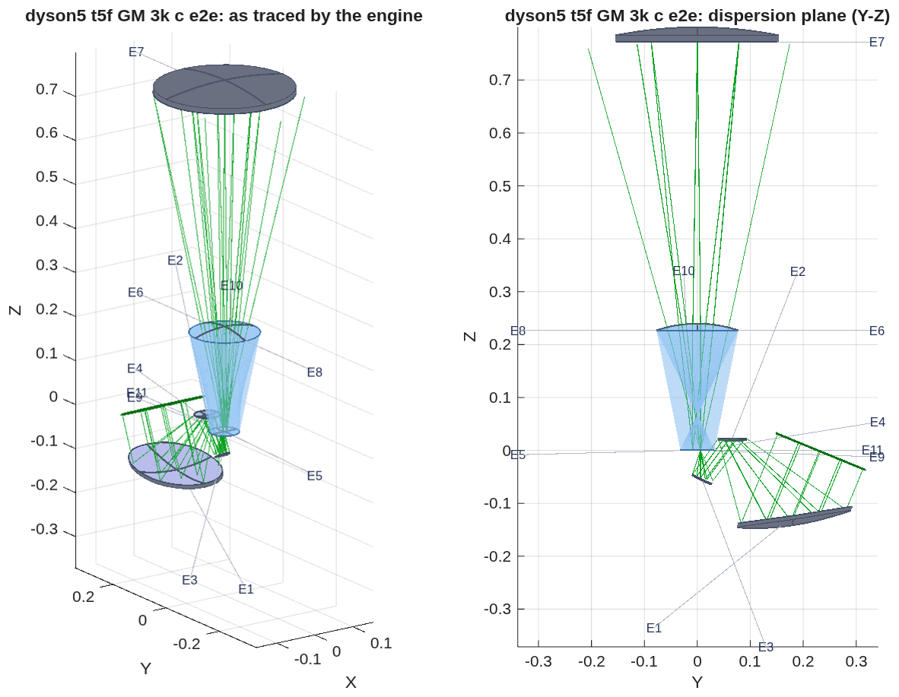
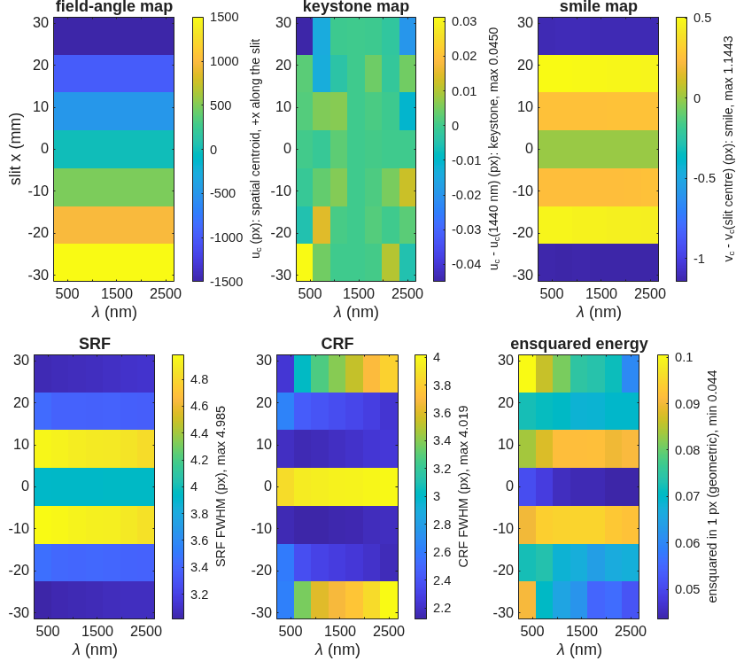

<!--
deck_dyson_record.md — dyson5: the instrument of record (telescope + Dyson) at Jim's numbers,
the short deck for Jim and Joe (2026-10-06).  The full working record stays in deck_dyson.md.
Build: python3 make_brief_slides.py deck_dyson_record.md
Figures: the runner's own PNGs, copied unmodified into figs_dyson/; the *_rc.png copies are
recomposed at the panel level only (recompose.py), the *_views.png are the engine's two
renders tiled (tile_views.py).  Producers: dyson5_t5f.m (maps), dyson5_view_figs.m (views),
spectrometer_maps_fig.m, dyson5_size_fig.m, dyson5_trade.m.
Sources: challenges/dyson5/README.md, BRIEF_dyson5_jim.md (3a), BRIEF_dyson5_size.md,
BRIEF_dyson5_tma.md, BRIEF_to_dyson5.md addenda 42–45, records dyson5_t5f_GM_*.txt.
Style: doc/DECK_STYLE.md + doc/STYLE_REPORTS.md (lean main path, one Backup divider,
layout + map per result slide, figures unmodified, conventions stated once).
-->

# A VSWIR Dyson Spectrometer and Its Telescope, Designed From the Spec
An EMIT-class push-broom spectrometer (F/1.8, 18 µm pixels, 380–2500 nm) at Jim's ground sample (30 m from 550 km), designed with MACOS from the public specification and scored on smile, keystone and the response functions, telescope and spectrometer together.
D. C. Redding, with Claude Code.
October 2026.  Working record; no proprietary prescription is used.
~ DRAFT for review, 2026-10-06.  The 1.5k module (1500 cross-track pixels, a 27 mm slit) has a spectrometer of record and a first telescope that together image at the pixel end to end: smile 0.50, keystone 0.01, CRF 1.22, SRF 2.20 pixels, every clearance positive; four such modules carry 6000 pixels in 6.6 kg of fused silica.  The telescope is not finished and the 3k module's resolution is not yet at the pixel level (CRF 4.2 pixels); the deck asks for help with both.

## Contents | The target, the two ways to build it, the 1.5k module scored, the comparison for Jim, the open module, the questions
::: left
- **3** The target and how it is scored
- **4** What the instrument does, and two ways to build it
- **5** Four 1.5k modules fill the swath
- **6** The four strips on the ground
- **7** The 1.5k module, scored: spectrometer, telescope, and the two together
- **8** The 1.5k module, end to end
- **9** The telescope so far: three off-axis aspheres
::: right
- **10** The spectrometer of record for the 1.5k module
- **11** To fill the swath: two of 3k pixels in CaF2 or four of 1.5k in silica?
- **12** The 3k Dyson module: where it stands
- **13** Alternatives to the Dyson for the 3k slit
- **14** Questions
- **15** Next steps
- **16** Run it yourself
- **17** Backup: how the telescope reached the pixel; the Dyson design ladder; the 54 mm design; the block-size trade; the methods and the checks; fourteen engine findings; records

## The target and how it is scored | Joe's specification at Jim's ground sample; the metrics stated once, here
::: left
| item | value |
|---|---|
| F-number (air-equivalent, image space) | 1.8 |
| pixels | 18 µm; 3000 cross-track per module (or 1500), 500 spectral |
| slit | 54 mm (3k module) or 27 mm (1.5k module); 2 pixels wide |
| band | 380–2500 nm, 4.24 nm per pixel |
| smile, keystone | < 0.1 pixel |
| SRF FWHM; CRF FWHM | < 1.5–2.0 pixels; < 1.5 pixels |
| ground sample (Jim) | 30 m from 550 km: f = 330 mm, 183 mm aperture at F/1.8 |
| cross-track field | 9.4° per 3k module, 4.7° per 1.5k module |
::: right
- **Smile:** centroid drift along the slit at fixed wavelength; **keystone:** drift across wavelength at fixed slit position; both in pixels from ray centroids.
- **SRF, CRF:** slit ⊗ line-spread function ⊗ pixel ⊗ Airy, FWHM in pixels (Mouroulis & Green 2018); the Airy diameter at 2500 nm is 11 µm, under the pixel, so the incoherent chain is valid.
- **Energy in one pixel:** the fraction of a point image inside one 18 µm pixel; the literature's design rule is 0.75.
- **A module** is one telescope, one spectrometer and one detector; **end to end** is one prescription from the sky to the detector, the grating its stop, scored by the spectrometer's own scorer.
- **As-built realism (Jim):** SRF 2.5–3 pixels, slits 2 pixels wide, photon-limited systems; smile and keystone drive the design.
~ Every number is a MACOS ray trace of a committed prescription, checked ray by ray against an independent solver (Backup); no coatings, no tolerances.  Public comparison point: Carbon-I (arXiv:2505.22545), F/2.2.

## What the instrument does, and two ways to build it | A push-broom VSWIR imaging spectrometer: 6000 cross-track pixels at 30 m from 550 km, a 180 km swath over 18.8°, 500 bands from 380 to 2500 nm; two 3k modules or four 1.5k modules see the same swath at the same sampling, cut into different strips
::: left
- **What it does:** from 550 km, each 18 µm pixel sees 30 m on the ground; a line of 6000 pixels across the track is a 180 km swath, 18.8° wide; the spacecraft's motion sweeps the line along the track; the spectrometer spreads each pixel's light over 500 bands at 4.24 nm per band from 380 to 2500 nm, at F/1.8.  Smile and keystone under 0.1 pixel keep every band of a pixel on the same ground, and the response widths near 1–2 pixels keep the bands and the pixels distinct.
- **A module** is one telescope, one slit, one spectrometer, one detector.  The swath is divided among the modules; each telescope points at its own strip and the strips abut.  The spec is met module by module, and the whole swath is the sum.
- **Two ways to cut it:** two modules of 3000 pixels (a 54 mm slit, a 9.4° telescope each) or four of 1500 (27 mm, 4.7°).  Same pixels, same ground sample, same bands, same F-number, same outer edge of the swath (9.4° off nadir either way); they differ in slit length, and everything on the right follows from that.
::: right
| | 2 × 3000 | 4 × 1500 |
|---|---|---|
| slit | 54 mm | 27 mm |
| telescope field per module | 9.4° | 4.7° |
| spectrometer block (no meniscus) | CaF2, 240 mm | fused silica, 130 mm |
| glass for the swath | 28.5 kg; 12.4 L of single crystal | 6.6 kg; a melt |
| telescopes, gratings, detectors | 2, 2, 2 × 3k | 4, 4, 4 × 1.5k |
| telescope today | freeform, not at the pixel | three off-axis aspheres, at the pixel |
~ The block follows the slit (slide 10): halving the slit halves the block's thickness and drops the meniscus and the CaF2; the telescope's field halves with it, which is what made the 1.5k telescope reachable first.  The 6000-pixel swath is Jim's framing of the trade; Joe's specification is written per 3000-pixel module.

## Four 1.5k modules fill the swath | Side by side across the track at a 234 mm pitch, each canted to its own strip: no body touches another and no body sits in another's sky beam; the block of four is 0.97 × 0.41 × 0.76 m, 300 L, with 14.6 kg of optics
::: full
{h=3.7}
| item | value |
|---|---|
| pitch across the track; worst margins | 234 mm (module 204 mm + 20 mm gap); body to body +25 mm, body in another's 183 mm sky beam +29 mm |
| envelope of the four | 965 × 411 × 758 mm, 300 L |
| optics per module; for the swath | 3.65 kg (block 1.6, three mirrors 1.4, grating 0.6); 14.6 kg |
~ Bodies are the engine's surface hits + 5 mm aperture + 10 mm mount; mirrors and grating as 10 mm blanks, the block from `dyson5_size.txt`.  Not included: structure, detectors and their cooling, electronics, baffles.  Each module's internal clearances are the record's by construction.  Record `dyson5_block4.txt`; tool `dyson5_block4.m`.

## The four strips on the ground, and the four focal planes | Each module's slit admits ±2.338°, 1500 pixels; canted ±2.32° and ±6.97° the strips overlap by 10 pixels at each join and cover 18.6°, 180 km from 550 km, with no along-track offset; each detector holds its strip across 1500 spatial pixels and the band across 500
::: full
{h=4.4}
- **Why the overlap is needed:** the telescope's plate scale puts 1500 pixels over 4.676°, not the 4.7° of the first-order layout; abutting at 4.7° would leave an 8-pixel gap (230 m) at each join.  **No along-track offset:** the four lines of sight lie in one cross-track plane, so the strips image the same ground line at the same time; a staggered module arrangement would shift a line by the stagger over the altitude, under a microradian.  **Unique pixels:** 5970 over 18.6°, 29.9 m per pixel at nadir, 30.7 m at the edge.
~ Record `dyson5_block4.txt` (strip edges per module, overlaps, swath); the admitted strip from `dyson5_t5f_GM_1k5_bAs.txt`.

## The 1.5k module, scored: spectrometer, telescope, and the two together | The spectrometer meets every line of the specification; the telescope reaches the pixel at the strip center and 0.8 px at its ends; together they image at the pixel over the strip, with the energy in a pixel falling toward the ends
::: full
| criterion | specification | spectrometer alone (130 mm silica Dyson) | telescope alone (three off-axis aspheres) | together, end to end |
|---|---|---|---|---|
| smile | < 0.1 px | 0.007 px | – | 0.50 px |
| keystone | < 0.1 px | 0.009 px | – | 0.01 px |
| CRF FWHM | < 1.5 px | 1.03 px | – | 1.22 px |
| SRF FWHM | < 1.5–2.0 px | 2.02 px (2-pixel slit) | – | 2.20 px |
| energy in one 18 µm pixel | > 0.75 (design rule) | 1.00 | – | 0.78–0.89 over the central third; 0.65 at ±9 mm; 0.30–0.48 at the ends |
| image blur (rms spot, as placed) | – | – | 8 µm center, 14 µm at ±2.3° (0.4 / 0.8 px) | – |
| plate scale | 330 mm | – | 327 mm center, 331 mm edge | 327 / 331 mm |
| light admitted by the grating stop | all | all | chiefs within 0.5° across the strip | 99 % at every field |
| uncoated throughput | – | 0.87 (four air-glass crossings) | three reflections, not scored | – |
| clearance, worst pair | > 0 | +0.38 mm (detector package vs block face) | +39 mm (M1→M2 beam vs M3) | +0.38 mm (the spectrometer's pair) |
| glass, mass | – | 0.75 L, 1.6 kg | mirrors not yet sized | – |
~ Spectrometer: `dyson5_size.txt` row D (130 mm), `dyson5_jim_3a.txt`; telescope: `dyson5_tA_GM_1k5_bAs.txt`; together: `dyson5_t5f_GM_1k5_bAs_ap.txt`, 7 fields × 7 wavelengths.  No coatings, no tolerances in any column.  The 3k module's columns: slide 12.

## The 1.5k module, end to end | Three off-axis aspheres feeding a 130 mm silica Dyson: smile 0.50, keystone 0.01, CRF 1.22, SRF 2.20 px over the whole strip; 99 % of the light admitted at every field; clearances +39 mm inside the telescope, +0.38 mm overall
::: left
{h=4.5}
::: right
{h=4.5}
~ Energy in one pixel end to end: 0.78–0.89 over the central third of the strip, 0.65 at ±9 mm, 0.30–0.48 at the strip ends (±13.5 mm); the spectrometer alone puts 1.00 in the pixel, the rest is the telescope's 8–14 µm blur.  Plate scale 327 mm at the center, 331 at the edge (330 specified).  Record `dyson5_t5f_GM_1k5_bAs_ap.txt` (re-scored 2026-10-06 with the grating's aperture enforced; 1 % of the sky beam falls outside the grating); prescription `dyson5_t5f_GM_1k5_bAs_e2e.in`, 11 elements.

## The telescope so far: three off-axis aspheres | f = 330 mm, 183 mm aperture, F/1.8: an unobscured section of a three-mirror parent, M3 ahead of the intermediate focus so the exit pupil sits at infinity, as the Dyson requires; a first design that reaches the pixel, not a finished one
::: full
| mirror | R (mm) | K | h⁴, h⁶ coefficients (m⁻³, m⁻⁵) | departure from the best-fit sphere over the lit patch (mm) | vertex z (mm) |
|---|---|---|---|---|---|
| M1 (concave) | 395.6 | −1.672 | +0.944, −1.010 | 2.1 | −5.8 |
| M2 (convex) | 109.8 | −2.836 | +70.6, +1300 | 0.3 | −152.4 |
| M3 (concave) | 159.3 | −0.517 | −1.66, +2306 | 0.01 | −59.5 |
| focal plane | flat | – | – | – | −125.7 |
::: left
- **Geometry:** the beam passes 190 mm from the parent axis, the strip is biased 4° and the Dyson is rolled 180° about the chief ray; from the first-order layout M2 is tilted 0.95° and moved 6 mm, M3 tilted 6.6° and moved 24 mm, the focal plane 8.5 mm along the axis.  No hole, no central obstruction.
- **Image as placed:** 8 µm rms at the strip center, 14 µm at the ±2.3° edge (0.4 / 0.8 pixel); every field admitted; the strip's chief rays within 0.5° of each other at the slit.
- **Not done:** the strip ends sit at 0.8 px (0.3–0.5 of the energy in a pixel through the Dyson); M1 departs 2.1 mm from its best-fit sphere and M3 is tilted 6.6°; no tolerancing, no coatings, no stray-light or mirror sizing; the solve ran to a fixed budget and is not converged.  Help in bringing it home is one of the questions (slide 14).
::: right
{h=3.4}
~ Radii are |R|; vertex z along the parent axis in the prescription's frame; the h⁴/h⁶ terms are about each mirror's own vertex and axis.  Prescription `dyson5_tA_GM_1k5_bAs.in`; solve record `dyson5_tA_GM_1k5_bAs.txt`.  The story of how it was reached, and the forms that did not work, is in the Backup.

## The spectrometer of record for the 1.5k module | A 130 mm fused-silica block with no meniscus: CRF 1.03 px, all the energy in one pixel, 1.6 kg, four air-glass crossings
::: full
- **The block follows the slit.**  In the Dyson form the flat face sits at the center of curvature, so the block's thickness is its radius, and the corner blur grows as h⁴/r³ with the slit's half-length h.  Halving the slit from 54 to 27 mm lets the block fall from 220 mm to 130 mm and drops the meniscus.
- **The 27 mm module, at 130 mm:** CRF 1.03 px, SRF 2.02 px, smile 0.007, keystone 0.009 px, 1.00 of the energy in one pixel; grating 171 mm across on a 0.41 m radius; slit plane to grating 414 mm; 0.75 L, 1.6 kg edged; uncoated throughput 0.87 over four crossings.  It tolerates 1.5 mm of air at the slit and detector for free (CRF 1.04 px).
- **The 54 mm single module, for comparison:** silica needs the 220 mm block and a 4 mm meniscus (CRF 1.33 px, 0.76 in one pixel, eight crossings, 8.2 kg); CaF2 at 240 mm needs none (CRF 1.21 px, 0.82, 14.3 kg).

~ Record `dyson5_size.txt` (48 engine-scored points, each a full re-solve); the working-distance scan and the throughput routes in `dyson5_jim_3b.txt`.  The 54 mm designs and their ladder: Backup.

## To fill the swath: two of 3k pixels in CaF2 or four of 1.5k in silica? | On the spectrometer side four small silica modules win on glass; with the telescope included, the 1.5k module images at the pixel end to end and the 3k module does not yet
::: full
| | 2 × CaF2, 3k, 54 mm slit | 4 × fused silica, 1.5k, 27 mm slit |
|---|---|---|
| block radius = thickness | 240 mm | 130 mm |
| grating diameter; slit plane to grating | 318 mm; 787 mm | 171 mm; 414 mm |
| spectrometer alone: CRF; energy in one pixel | 1.21 px; 0.82 | 1.03 px; 1.00 |
| spectrometer alone: smile / keystone | 0.005 / 0.006 px | 0.007 / 0.009 px |
| air-glass crossings; uncoated throughput | 4; 0.88 | 4; 0.87 |
| glass per block, edged | 4.5 L, 14.3 kg | 0.75 L, 1.6 kg |
| glass for 6000 pixels | 9.0 L, 28.5 kg | 3.0 L, 6.6 kg |
| single-crystal CaF2 to carve from | 6.2 L per block, 12.4 L in all | none: fused silica is a melt |
| telescopes / gratings / detectors | 2 / 2 / 2 × 3k | 4 / 4 / 4 × 1.5k |
| telescope so far | freeform three-mirror, not at the pixel (open) | three off-axis aspheres (slide 9) |
| end to end: smile / keystone / CRF / SRF | 1.64 / 0.05 / 4.02 / 4.99 px | 0.50 / 0.01 / 1.22 / 2.20 px |
| end to end: energy in one pixel | 0.04–0.10 | 0.30–0.89 (0.8 over the central third) |
| clearance, worst pair | +0.06 mm (M2→M3 beam against the block face) | +0.38 mm (detector package against the block face) |
| light admitted by the grating | 95–98 % per field | 99 % per field |
~ Carve = a cylinder of clear aperture + 20 mm by thickness + 20 mm; CaF2 is not priced here.  A cold detector adds a dewar window to every row alike; cementing it to the block keeps the count at four.  The 3k telescope is the freeform solve of 2026-10-05, scored before its next layout step (slide 12).  Records `dyson5_jim_3a.txt`, `dyson5_t5f_GM_1k5_bAs_ap.txt`, `dyson5_t5f_GM_3k_c_ap.txt`.

## The 3k Dyson module: where it stands | The same parent with a 9.4° strip needs freeform mirrors and is not yet at the pixel: CRF 2.2–4.0 px, 4–10 % of the energy in one pixel, 95–98 % of the light through the grating, clearance +0.06 mm
::: left
{h=3.0}
- **What the solve gave:** Zernike freeform terms on all three mirrors (M2 carries 1.7 mm of departure at 126 mrad of slope) with the same merit and geometry freedoms as the 1.5k: smile 1.64, keystone 0.05, CRF 4.02, SRF 4.99 px.  Its marginal rays leave at up to F/1.2, so the grating, sized for F/1.8, passes 95–98 % of the light; the beam between M2 and M3 passes the block's face by 0.06 mm.
- **Why it stalls:** on this section the figure terms and the mirror positions work against each other (the freeform norm grows as the geometry moves), which points at the stop's position.  **Next:** the stop at M2 instead of M1; an asphere-only solve from the same seed; the field weighting across the strip as a project ruling.
::: right
{h=4.3}
~ Record `dyson5_t5f_GM_3k_c_ap.txt` (the grating's aperture enforced; Backup); prescription `dyson5_t5f_GM_3k_c_e2e.in`.  The solve ran to the 1.5k's evaluation budget and is not converged in the optimizer's sense.

## Alternatives to the Dyson for the 3k slit | The Dyson was assumed for this challenge; the literature offers three other forms at a 54 mm slit, and the record's own result points at a fourth; the Offner was tried at F/1.8 and is out
::: left
- **The Offner (concave sphere used twice, convex grating at the stop): tried at F/1.8 and 54 mm, out.**  All-reflective, no CaF2, no air-glass crossings, a cold shield for free; the review's long-slit example is F/2.8, 48 mm, 30 µm pixels.  At F/1.8 the grating is 0.28 R across and the slit must sit at 0.29–0.32 R to pass beside it.  With the classical corrections and the ring free, the best point (R = 0.5 m, 0.5 m long, 4.8 kg of blanks) reaches smile 0.17, keystone 0.18 and CRF 2.24 px, but the spectral blur is 7–9 px rms at every R to 1.25 m: an aberration along the dispersion the corrections do not touch (3–6 px, wavelength-independent) plus the grating's term at F/1.8 (+2–4 px by 2500 nm).  Energy in a pixel 0.01.  The next form of that family is the Offner–Chrisp (a third mirror), not tried.
- **The prism Dyson (the review's BPDS, 3200 px, 18 µm, F/2, 57.6 mm slit):** a freeform prism in place of the grating, 54 cm long with a 19 cm prism; achieved smile 3 % and keystone 1 % of a pixel.  It is the published answer in this regime, and its size is the price.
- **A long-slit Dyson with a separate mirror and a meniscus** (the review's compact variant, about 60 % of the BPDS's size, six more air-glass faces): the family the 220 mm meniscus design belongs to.
::: right
- **Split the slit, keep one telescope.**  The record's own finding is that at 3k the spectrometer closes (CaF2 at 240 mm, or silica with the meniscus) and the telescope does not.  A 3k telescope feeding two 1.5k Dysons through a split slit keeps two telescopes and four small silica blocks, but it needs the 3k telescope, which is the open item.
- **What the ray trace can settle next:** the prism Dyson needs a dispersing prism added to the layout chain (the engine traces one already); the Offner–Chrisp needs a three-mirror layout solver.  Each is a few days; whether either is worth it is a question for Jim and Joe.
~ Review: Mouroulis & Green, Opt. Eng. 57(4) 040901 (2018), Table 2 and Table 5.  Offner at F/1.8: `dyson5_off18.txt`, `BRIEF_dyson5_jim.md` 3c (seed, fixed-ring and free-ring rows at R = 0.5–1.25 m; mass as 10 mm Zerodur blanks).  The prism Dyson and the Offner–Chrisp are not traced here.

## Questions | Two decisions the ray trace cannot make, and help with the part that is not done
- **Are four modules acceptable?**  The 1.5k module now has a telescope at the pixel end to end (slides 7–9); the 3k module does not yet (slide 12).  At the same 6000 cross-track pixels, four telescopes, spectrometers and detectors in 6.6 kg of fused silica against two in 28.5 kg of CaF2: is four a packaging the project would entertain?
- **Is CaF2 a realistic option for the 3,000 option?**  Two 240 mm blocks need 12.4 L of single-crystal CaF2 to carve from (6.2 L each, clear aperture + 20 mm each way; 19.6 L at the 300 mm blocks that put all the energy in a pixel).  What does that cost against two to four fused-silica blocks of 0.75 L?
- **The telescope is a first design, and does not meet all inferred requirements:** the strip ends at 0.8 px, 2 mm of aspheric departure on M1, no tolerancing.
- **We ask for help in bringing it home:** What telescope forms have worked at 183 mm, F/1.8 and a 4.7–9.4° strip into a telecentric slit?  More generally, what are we missing, for throughput (beyond cementing the window and a two-layer coating, 0.81 → 0.91) and for performance that the public record does not show?
~ Also open from the last round: whether the detector window is cemented to the block in the builds (six crossings and 0.81 uncoated, against four and 0.87).

## Next steps | The 3k telescope, the cold window, the radiometric chain
::: left
- **The 3k telescope:** the stop at M2; an asphere-only solve from the freeform seed; a merit written on the response-function width for the final step; the field weighting across the strip as a ruling.
- **The 1.5k module's package:** the cold window cemented as the block's exit face with the shield as the detector housing behind it, under the same clearance check; the 1.5 mm of working distance the 130 mm module tolerates is where it goes.
- **The radiometric chain against the band:** throughput, grating efficiency, detector quantum efficiency and the slit's diffraction loss (0.3 % at 380 nm to 1.8 % at 2500 nm past the grating, before the telescope's cone).
::: right
- **In the engine:** a fixed-station reference sphere for the wavefront merit on telecentric designs; an asphere-plus-Zernike surface in one declaration; a short-line guard for every multi-value prescription keyword.
- **Later, once the design of record is stable:** full diffraction from the slit through the grating to the detector (the slit's truncation of the telescope's image, about 10 % on the response functions in the literature); polarization sensitivity of the Dyson against the Offner; a surface-by-surface tour of the prescription.

## Run it yourself | One parameter file, one runner, every stage through it
::: full
```
cd <path>/MACOS_resources/mmacos                   % the mmacos folder of the repository (the engine is built already)
matlab                                            % start MATLAB here
>> run('mmacos_setup.m');                          % puts the engine and the design tools on the path
>> addpath('challenges/dyson5');
>> OUT = dyson5_run(struct('stages', {{'s1','s2','s3'}}));   % emit the Dyson decks, score them, run the design ladder
>> OUT = dyson5_run(struct('stages', {{'t5f'}}));           % the telescope + Dyson end to end from a telescope deck
>> OUT = dyson5_run(struct('Fno', 2.0, 'block_r_m', 0.25, 'stages', {{'s1','s2','s3'}}));  % your own instance
```
- **Changeable design parameters live in one file, `dyson5_params.m`:** F-number, pixel count and pitch, band, slit width, block radius, glass, diffraction order, the ladder's steps and weights, the aperture and mount margins, the detector package, the telescope deck and the Dyson it feeds.  Every record in this deck is a stage output under `challenges/dyson5/`.
- **Checks:** `./run_mmacos_tests.sh tSpectrometerRx tTelescopeRx` and the grating, glass, propagation and root-pick classes, all in the fast suite (536 pass, 0 fail, 2026-10-05).

## Backup
How the telescope reached the pixel, the Dyson design ladder, the superseded 54 mm designs, the methods and checks, the engine findings, the records.

## How the telescope reached the pixel at the strip edge | The defect was cross-track astigmatism growing as the square of the field; figure terms alone flattened the strip by trade, the merit and the geometry removed it
::: left
- **The pupil is a first-order condition.**  The Dyson accepts chief rays within 0.09° of its own, so the telescope's exit pupil must sit near infinity.  A three-mirror with a real intermediate focus between M2 and M3 cannot be telecentric; with M3 ahead of that focus the chiefs sit within 0.5° across the strip and every field is admitted.
- **It was not focus or the mirrors' power split:** along the strip the along-track focus is flat, the cross-track focus curves 2–4 mm and the two line foci at the edge sit 2–5 mm apart; no secondary magnification flattens both, and a field lens has no leverage at the slit.
- **Figure terms alone trade the center for the edge:** Zernike departures on all three mirrors took the 1.5k edge 291 → 170 µm while the center went 29 → 73 µm.  A control with the wavefront merit written per ray gave the same trade: the merit, not the surfaces, set it.
- **Two levers removed it, neither a figure term:** the merit written on the per-ray transverse spot at the slit with the per-field image positions (at F/1.8 with tens of µm of path error the wavefront rms flattens the field by trading the center), and M2/M3 tilt, decenter and the focus as variables.  With both, the freeform terms collapsed to a re-fitted set of off-axis aspheres, re-solved as aspheres: the record.
::: right
| step (1.5k, same seed, same budget) | as-placed spot, center / edge | end to end: smile / keystone / CRF / SRF (px) |
|---|---|---|
| conics + aspheres, wavefront merit | 37 / 343 µm | 3.26 / 0.63 / 15.5 / 5.9 |
| + Zernike freeform, wavefront merit | 99 / 219 | 0.82 / 0.33 / 7.7 / 9.2 |
| same freedoms, transverse (spot) merit | 18 / 27 | 1.54 / 0.03 / 2.34 / 4.46 |
| + M2/M3 tilt, decenter, focus | 6 / 13 | 0.60 / 0.02 / 1.49 / 2.30 |
| **three off-axis aspheres, same merit and geometry** | **8 / 14** | **0.51 / 0.01 / 1.22 / 2.20** |
~ Records `dyson5_tA_EP_*`, `dyson5_tA_pz_*`, `dyson5_tA_FF_*`, `dyson5_tA_GM_*`; the end-to-end rows through the engine-placed join.  Solves run to a fixed evaluation budget; the emission is re-solved, not re-fitted (a 1.7 mrad slope residual is a millimeter of blur over 0.3 m).  The coaxial three-mirror and the two-mirror modified Schwarzschild were tried first and do not image a 4.7° strip at F/1.8 packaged: `deck_dyson.md` slide 27.

## The Dyson design ladder at the 54 mm slit, by the numbers | Keystone falls 37-fold at a fixed 220 mm block; the corner blur is bought only by the meniscus or by size
::: full
| step | what moves | keystone (px) | smile (px) | CRF FWHM (px) | energy in 1 px | length (mm) | grating footprint (mm) | glass (L) |
|---|---|---|---|---|---|---|---|---|
| R0 | concentric seed | 0.095 | 0.006 | 2.28 | 0.44 | 708 | 275 | 22.2 |
| R1 | grating-radius factor, face offset | 0.038 | 0.003 | 2.10 | 0.48 | 704 | 274 | 22.3 |
| R2 | + conic and h⁴, h⁶ terms on the block face | 0.037 | 0.004 | 2.13 | 0.47 | 704 | 274 | 22.3 |
| R3 | + block center off the grating's, along the dispersion | 0.011 | 0.008 | 2.10 | 0.48 | 698 | 272 | 22.1 |
| R4a | meniscus corrector alone | 0.063 | 0.012 | 2.49 | 0.33 | 698 | 270 | 22.3 |
| **R4** | **meniscus with all variables (the 54 mm design of record)** | **0.0026** | 0.005 | **1.33** | **0.76** | 694 | 269 | 22.7 |
| R5 | + slit plate and fold prism: the detector out of the slit's plane | 0.0085 | 0.005 | 1.27 | 0.70 | 694 | 269 | 19.2 |
| size alone | block radius free (341 mm) | 0.024 | 0.001 | 1.34 | 0.74 | 1099 | 427 | 82.8 |
~ Each step solved on the exact chain with pixel-unit smile and keystone in the merit, then emitted and scored in the engine.  SRF FWHM is 2.02–2.05 px on every step: the 2-pixel-slit floor.  The concentric condition R_g = n·r/(n − 1) is the blur minimum by exact trace; a single concentric block meets a quarter-pixel corner blur only at r ≥ 213 mm, which is why every flight form adds an asphere, a meniscus or an air gap.  Record `dyson5_s3_trade.txt`.

## The 54 mm design of record: the meniscus-corrected Dyson (step R4) | Keystone 0.0026 px, smile 0.005 px, CRF 1.33 px, 0.76 of the energy in one pixel at a 220 mm silica block; superseded for the 1.5k module by the plain 130 mm block
::: left
- **Eleven surfaces:** the block's flat and spherical faces, a 4 mm meniscus in the air gap, the grating, and the same faces on the way back; block radius 220 mm, grating 269 mm across on a 0.69 m radius, slit plane to grating 694 mm.
- **Decentering the block solves the distortion; the meniscus buys the blur.**  Keystone 0.095 → 0.011 px comes from the block's center moving off the grating's along the dispersion; the corner blur does not move on any step without the meniscus or a 341 mm block.  A global search over the meniscus (12 starts) found no better basin on the detector.
- **Checked by propagation:** the point-spread function's centroid equals the ray centroid to 0.002 px at every slit position and wavelength.
- **A cold shield cannot be bought in this form:** every millimeter of air before the detector costs about 0.5 px of CRF; a fold prism takes the detector out of the slit's plane at CRF 1.27 px and 0.70 in one pixel.
::: right
{h=4.4}
~ Prescription `dyson5_s3_r4.in`; records `dyson5_s3.txt`, `dyson5_s3_r4global.txt`, `dyson5_s2w.txt`, `dyson5_s5.txt` (the fold prism and the cold-shield sweep).  The full ladder, the fold prism and the closure envelope: `deck_dyson.md`.

## The block-size trade, by the numbers | Two modules with no meniscus: a 130 mm silica block at 1.6 kg images at the pixel with half the air-glass crossings of the 54 mm design
::: full
| configuration | block radius and thickness (mm) | edged mass (kg) | air-glass crossings, uncoated throughput | CRF (px) | energy in 1 px | smile / keystone (px) |
|---|---|---|---|---|---|---|
| silica, one 54 mm slit, meniscus (R4) | 220 | 8.2 | 8, 0.76 | 1.33 | 0.76 | 0.005 / 0.003 |
| CaF2, one 54 mm slit, no meniscus | 240 | 14.3 | 4, 0.88 | 1.21 | 0.82 | 0.005 / 0.006 |
| **silica, two 27 mm slits, no meniscus** | **130** | **1.6 each** | **4, 0.87** | **1.03** | **1.00** | 0.007 / 0.009 |
| silica, two 27 mm slits, smallest matching R4 | 100 | 0.9 each | 4, 0.87 | 1.25 | 0.80 | 0.008 / 0.012 |
| CaF2, two 27 mm slits, smallest matching R4 | 80 | 0.9 each | 4, 0.88 | 1.02 | 1.00 | 0.002 / 0.007 |
- **The meniscus was paying for the long slit.**  With one 54 mm slit, silica closes only with the meniscus; without one, a single module closes only in CaF2 at 240 mm.  With two modules the plain block matches R4 from 220 mm down to 100 mm in silica and 80 mm in CaF2, with four crossings where R4 has eight and no thin part to make, mount or shake.  Halving the glass path also halves the wavefront error from index inhomogeneity and thermal gradients (0.4 waves each at 220 mm).
- **Throughput routes measured on the 130 mm module:** cementing the dewar window to the block, 6 → 4 crossings, 0.81 → 0.87; a two-layer broadband anti-reflection coating, +4 % (a 6:1 band is wide for a simple stack); the two together about 0.91.
~ Record `dyson5_size.txt` (CCMac, 2026-10-02): 48 engine-scored points; throughput is the uncoated Fresnel product at 1 µm, normal incidence.  Routes: `dyson5_jim_3b.txt`.

## The methods, and the checks behind every number | Ray tracing scores the design, wave propagation checks it, and two independent traces agree ray by ray
::: left
- **Ray tracing (MACOS):** rays leave a point on the slit at one wavelength, refract through the block, diffract at the grating into the design order and land on the detector; the centroid per slit position and wavelength gives smile and keystone, the spread convolved with the slit and the pixel gives the response functions.  End to end, the rays leave the sky and the grating is the stop.
- **Wave propagation:** the same prescription carried as a complex wavefront to the detector; its point-spread function's centroid equals the ray centroid to 0.002 px at every slit position and wavelength, so a detector sees the ray numbers.  Across a grating the comparison is made in phase (modulo λ).
- **Two programs, one prescription:** the design solver (MATLAB) lays out each form and writes the prescription; MACOS traces it on its own; every ray is re-traced by the solver and the two agree to 1e-9 m at every surface (1e-12 m with the aspheric block face, where a solver that ignores the asphere misses by 0.26 mm).  For the freeform telescope decks, which the solver cannot model, the end-to-end join is placed from engine traces and reproduces the solver's join on an aspheric deck to every printed digit.
::: right
- **The optimizer:** the design layer's native multi-field solve (MACOS CALIB) for the conics and aspheres; a Levenberg–Marquardt solve on the engine's own per-ray spot residuals, with Jacobian scaling, for the freeform and geometry steps.  Solves run to a fixed evaluation budget.
- **Clearance:** every design passes a check of each beam leg against every body (mirror blanks on their best-fit spheres, the block, the slit mask, the detector package with a 5 mm carrier); the number quoted is the worst pair's margin.
- **Slit diffraction loss:** a 36 µm slit at F/1.8 loses 0.3 % of the light past the grating at 380 nm and 1.8 % at 2500 nm, by the engine's far-field leg and by the closed sinc² form alike.
~ Regression tests: the spectrometer and telescope prescriptions, the grating, glass, propagation and root-pick classes, in the MACOS fast suite (536 pass, 0 fail, 2026-10-05).

## Eight engine findings from the spectrometer, each with a regression test | Found by the design's own checks between 2026-09-30 and 10-03, fixed in the engine the same day
::: full
| finding | symptom | fix |
|---|---|---|
| glass names ignored at load | a `GlassElt= Silica` element traced as air | the glass catalog is blanked once at allocation, not on every load |
| vacuum wavelength inside glass | a propagation leg in a medium ran at the wrong Fresnel number by n | every kernel takes λ/n of the leg's medium |
| groove period along the surface | 2.8 / 3.3 px rms spectral blur at 2500 nm (Offner / Dyson) | the local grating vector is the projection of the ruling direction, un-normalized (chord-ruled) |
| grating path-length jump | 4 waves rms of pupil error where the rays converged to 0.05 µm | the jump is the groove count from the vertex along the ruling direction |
| optimizer derivative stride | a multi-field spot-size solve overwrote memory on its second field | advance by the objective's size, as the value loop does |
| ray behind the surface after a pupil reference | a two-mirror with its pupil reference 5 mm ahead of a convex primary scattered every ray in a one-call trace | the conic root nearest the element's reference point; a restarted trace resets its previous element per ray |
| beam conditions only under a beam target | chief direction and position could not be scored with a spot or wavefront target | the beam rows ride on any target; a position target per field; the centroid as the position |
| optimizer asphere step and failure exit | a fixed 1e-10 probe step: a zero derivative column, a singular matrix, and a `stop` that ended the host process | the step is 1e-3 of the coefficient (sag-based for a zero one); the failure restores the optics and returns a flag |
~ Tests: `tGlassDispersion`, `tPropMedium`, `tGratingImmersed` + `test_grating_chord`, `tGratingOpl`, `tSpectrometerRx`, `tTraceRestart`, `tBeamRows`, `tAsphCalib`.  Flat gratings are unchanged by the grating fixes; the wavefront-target optimizer, which every telescope design used, was never affected by the fifth.

## Six more findings: the eccentric section, the Offner, the 3k join | Found 2026-10-04 to 10-06, each invisible on the designs before it, each fixed the same day
::: full
| finding | symptom | fix |
|---|---|---|
| ray on the far sheet of a hyperboloid | 40 of 1185 rays on the section's M3 took the second sheet: 44 mm of extra path, every ray reported as passing | the root on the sheet the vertex is on; 406 prescriptions pre/post identical |
| optimizer aperture sized at one field | the strip-edge fields lost every ray on M3 and were dropped by the solve | the aperture encloses the footprint over every field of the solve |
| stop aimed at the parent vertex | on an eccentric section the pupil sphere was placed 190 mm from the beam | the stop at the prescription's object-space stop point |
| Zernike origin at the parent vertex | freeform terms on a section evaluated 3.8 radii outside the unit disc | the origin is the element's pole |
| a grating never vignetted by its aperture | the 3k end-to-end deck passed 21 % of its center-field rays 154–213 mm from the grating's axis against a 154 mm declared aperture; four grating routines computed the aperture verdict and then overwrote it with an unrelated check | the verdict is kept; the 1.5k row moves by 0.01 px, the 3k row by 0.4 px of smile |
| clearance check blind to a beam through a disc | the check measured distance to body samples, which cannot go negative for a mirror or grating disc: an F/1.8 Offner beam through its grating read +0.2 mm (it is −33 mm) | every beam segment is tested against the surface inside its aperture and mount; all 54 Dyson records re-check bit-identical |
~ Tests: `tFwdRoot` (5), `tAsphHook` (3), `tStopApStop` (4), `tFreeformPole` (3), `tGratingAperture` (3), `tSpectrometerRx/test_clearance_sees_a_beam_through_a_body`.  Each passed every existing check; what exposed the first four was a section whose beam is 190 mm from its parent's vertex, the fifth a telescope whose cone overfills the spectrometer's stop, the sixth a form whose stop sits in its own beams.

## Records behind each slide | Every number traces to a runner stage and its record file
::: full
| slide | runner stage | record | tool |
|---|---|---|---|
| 1.5k module end to end; the 3k module | t5f on `dyson5_tA_GM_1k5_bAs.in` / `dyson5_tA_GM_3k_c.in` | `dyson5_t5f_GM_1k5_bAs.txt`, `dyson5_t5f_GM_3k_c.txt`, `*_e2e.in`, `*_maps.png` | `dyson5_t5f.m` (the engine-placed join), `spectrometer_score.m`, `spectrometer_clearance.m` |
| the telescope of record | `dyson5_tma_step5.m` (the geometry + merit steps) | `dyson5_tA_GM_1k5_bAs.txt`, `dyson5_tA_GM_conicfit.txt`, `BRIEF_dyson5_tma.md`, `BRIEF_to_dyson5.md` addenda 42–45 | `macos.design.tma_layout` 'telecentric', `Telescope.optimize`, the per-ray spot solver |
| four modules fill the swath | `dyson5_block4.m` | `dyson5_block4.txt`, `dyson5_block4_views.png`, `dyson5_block4_swath.png` | the e2e deck moved rigidly four times; `macos.view_rx`; surface-hit margins |
| the spectrometer of record; block-size trade | `dyson5_size_trade.m` | `dyson5_size.txt`, `dyson5_size.png`, `dyson5_size_*.in`, `BRIEF_dyson5_size.md` | continuation walks over `dyson_ladder.m` |
| comparison for Jim | `dyson5_jim.m` ('3a', '3b') | `dyson5_jim_3a.txt`, `dyson5_jim_3b.txt`, `BRIEF_dyson5_jim.md` | re-cut of `dyson5_size.mat`; `macos.design.thinfilm_rt` |
| design ladder, R4, trade | s3, s3free, s3b | `dyson5_s3.txt`, `dyson5_s3free.txt`, `dyson5_s3_trade.txt`, `dyson5_s3_layout_r*.png`, `dyson5_s3_maps_r*.png` | `dyson_ladder.m`, `dyson5_trade.m` |
| fold prism, cold shield | s5 | `dyson5_s5.txt`, `dyson5_s5_r5_h*.in` | `spectrometer_geom.m` (form `dyson_fold`) |
| chain vs engine; propagation twin; slit loss | gate; s2w; s2l | `tests/tSpectrometerRx.m`, `tTelescopeRx.m`; `dyson5_s2w.txt`; `dyson5_s2l.txt` | per-ray re-trace; `spectrometer_wave.m`; far-field leg vs sinc² |
| engine renders | `dyson5_view_figs.m` | `*_view3d.png`, `*_viewyz.png` | `macos.view_rx` on the prescription |
~ Conventions: block index n(silica, 1 µm) = 1.450417; radii quoted as |R|; the engine stores `KrElt` as −|R| and the center of curvature at the vertex plus |R| along the surface normal.  Reference document: `optical_design/SPECTROMETER_DESIGN_REFERENCE.md`.
