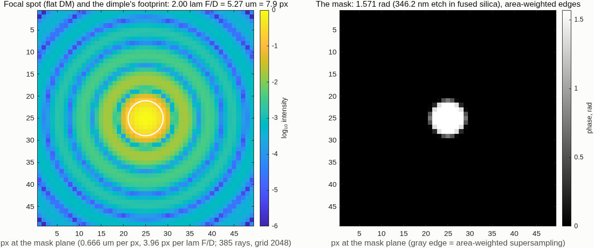
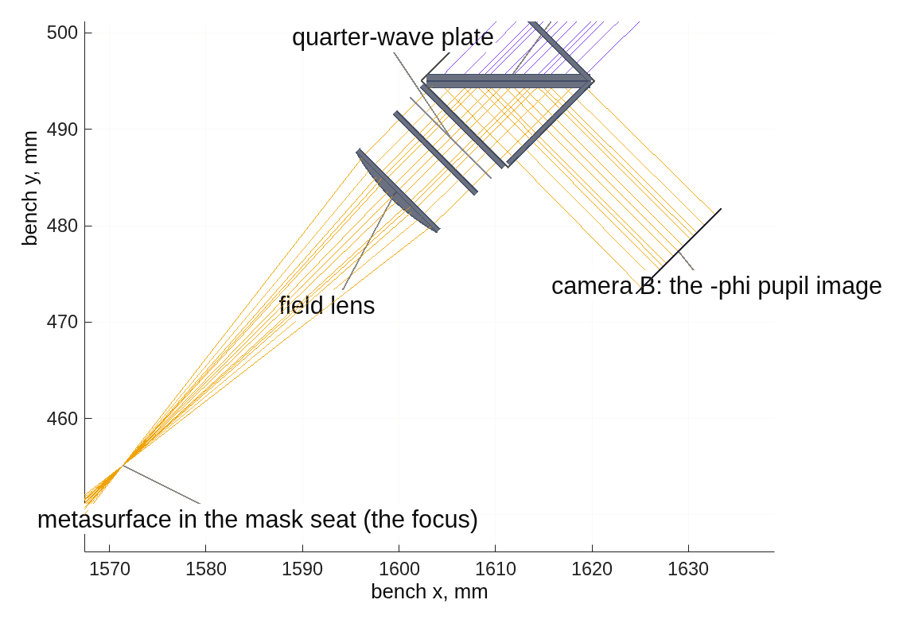
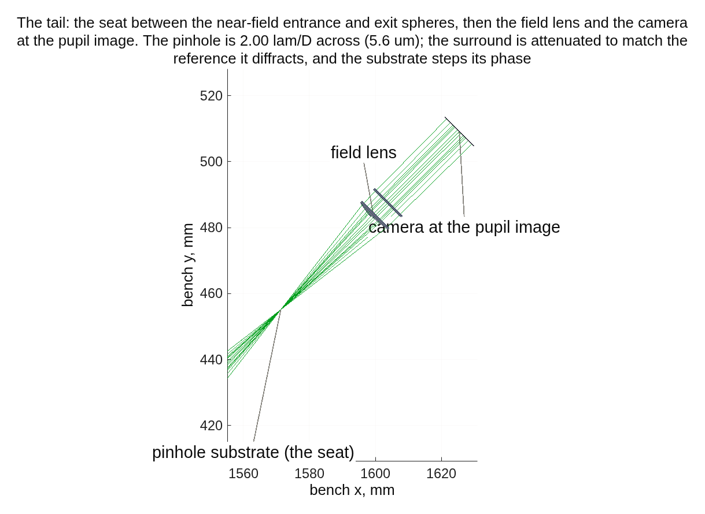
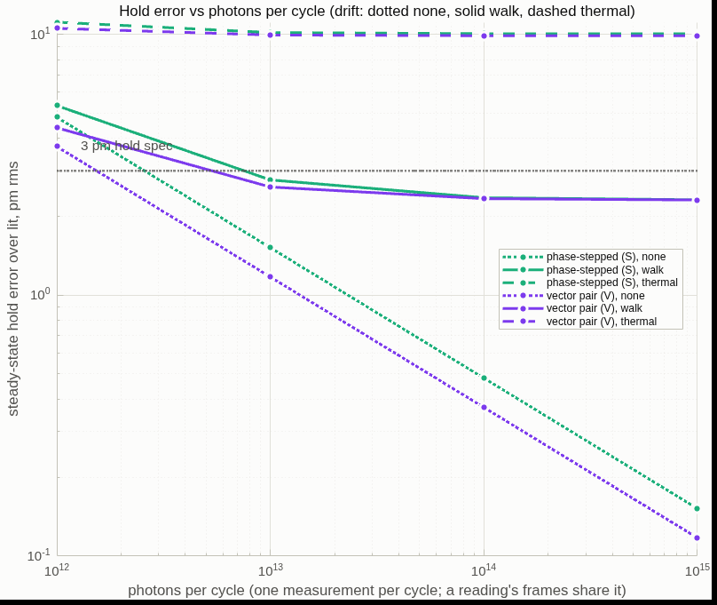
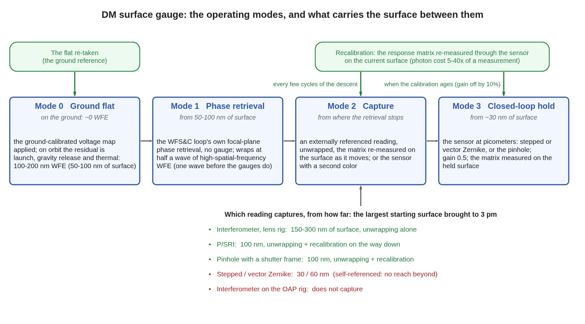
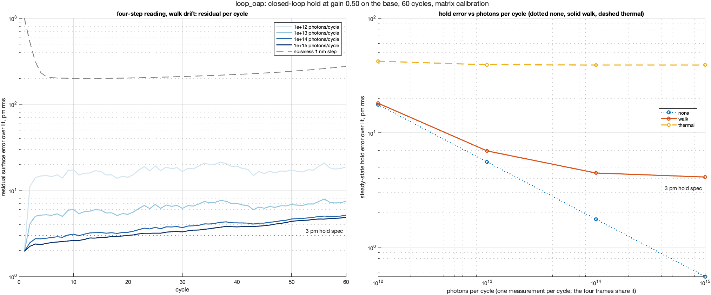
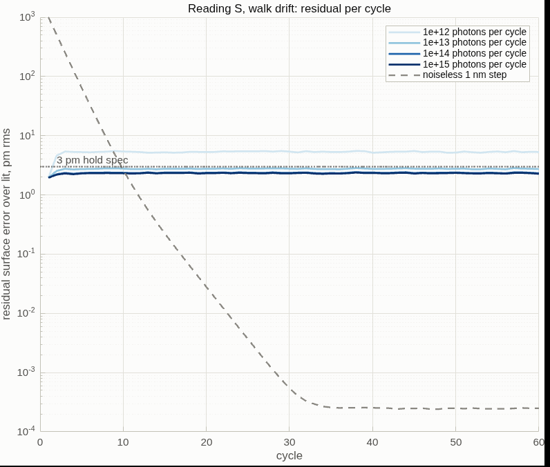
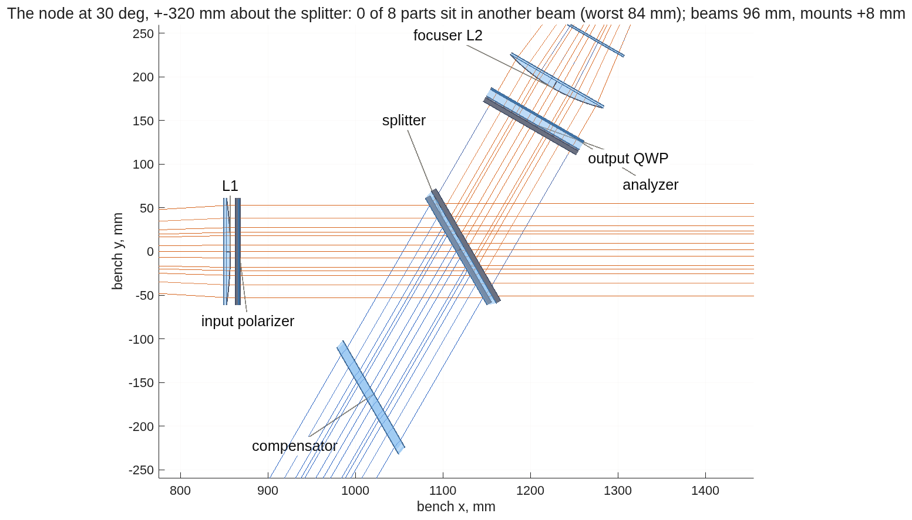
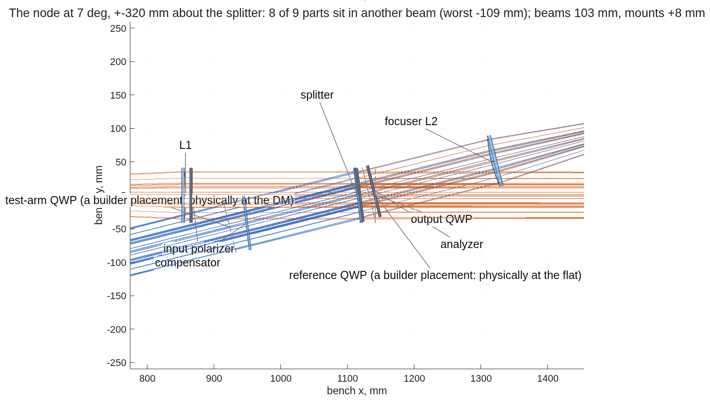

<!--
deck_gauges.md — DM Surface Gauge Comparison.  DRAFT — pending Dave's
sign-off; the builder suppresses the export mark on DRAFT decks.
Build: python3 make_brief_slides.py deck_gauges.md
Assembled 2026-09-14 (CCL) from the three lane reports and the plan:
  tg_psi_dm96_oap/REPORT_gauge_ifo.md (+ REPORT_oap.md, README) — CCMac
  pdi_dm96/REPORT_gauge_pdi.md (+ README) — TO
  zwfs_dm96/README.md + deck_zwfs.md — CCL
  macos/BRIEF_gauge_deck.md sections 5-11 (rulings, outline, capture, OAP,
  analyzer, future work, modes, complex amplitude, one bench)
  raw material with every run tag: deck_gauges_material.md
Figures are the tools' own PNGs, unmodified except panel crops
(crop_panels.py: a fractional box cut from a lane's layout figure, white
margins trimmed).  The flow diagram and the switching schematic are drawn
by gauge_modes_flow.m and gauge_one_bench.m.
Rules (Dave 2026-09-13): each approach once, in its best configuration;
stories in backup; succinct; more slides rather than fuller ones;
American English; photons per measurement.
-->

# DM Surface Gauge Comparison
Four ways to measure a 96×96 deformable mirror's surface to picometers on one optical bench — a phase-shifting interferometer, a Zernike sensor, its polarized version, and a point-diffraction sensor — scored on the same mirror, the same light, and the same two jobs: hold the surface in a servo, and capture its shape after launch.
D. C. Redding, with Claude Code.
September 2026.  For the JPL HWO WFS&C discussion group.
DRAFT — pending review.  Every number here comes from a committed run of one shared, parameterized model (MACOS, mmacos); the run tags are on the provenance slide.  Bench geometry under revision (2026-09-15): the record's 7° splitter is not buildable; the splitter goes to 22.5° (ruled 2026-09-15; the layouts show it), and the substrates, part thicknesses and camera are in the model (2026-09-16: the sensors do not move; the interferometer's 10 mm plates cost its flat null, its differential rows being re-measured).  The reflective front end has been redesigned and re-measured (rows, servo, descent, sensors, 2026-09-16); the lenses-versus-mirrors comparison is now measured on both rigs.

## Contents | Three jobs, one bench, four ways of sensing
::: left
- **3** Introduction: the three jobs and how they are scored
- **4** The bench layout
- **6** Parts
- **9** Twyman-Green interferometer
- **16** Zernike sensor
- **18** Vector Zernike sensor
- **21** Point-diffraction sensor
- **24** Performance: rows, capture, photons, servo
::: right
- **30** Lenses versus off-axis parabolas
- **31** The reflective front end and its performance
- **33** Comparison and recommendation
- **36** Measuring the complex amplitude
- **37** Summary and future work
- **43** Run it yourself
- **44** Backup

## The three jobs, and how each is scored | Measure the mirror's surface to picometers; capture its post-launch shape, 100-200 nm of wavefront, into the servo's reach; hold it there in a servo
::: left
- **The DM:** 96×96 actuators on a 1 mm pitch, 96 mm across.  On orbit its surface must stay constant to well under 10 pm, measured often and held by a closed loop.  Every test runs on a random 30 nm rms working surface, not a flat: the gauge never operates at null.
- **Job 1, measure:** read a change of 10 nm on one actuator, of 1 nm on 47 actuators, and a dense random 10 nm pattern, on the 30 nm surface with the response matrix measured on it; and keep that accuracy as the surface moves away from the calibration (capture range).
- **Job 2, capture:** bring the largest possible starting surface, 100-200 nm of wavefront, down to the servo's floor; every phase reading wraps at ±158 nm of surface (±π at 632.8 nm, double pass), so this is a wrapping problem before it is a noise problem.
- **Job 3, hold:** the servo at picometers on the 30 nm rms working surface, its set point: the light per cycle that holds changes about it to 3 pm rms under a 2 pm per-cycle random walk, and whether the reading leaves a fixed error.
::: right
| score | meaning |
|---|---|
| gain | recovered change ÷ true change; 1.0 is perfect; quoted after calibration |
| floor | rms of the actuators that were not changed, in picometers |
| SNR | recovered change ÷ floor; above 5 counts as detected |
| photons per measurement | all frames of one measurement summed; 1e14 photons at 633 nm = 31 µJ = 0.13 s of a 1 mW laser at 25% throughput |
| capture range to 10% | the largest working surface at which a 10 nm change on the 47 sites reads within 10%, the matrix left as calibrated at 30 nm |
| capture | the largest starting surface the servo brings to 3 pm |
| hold, one number | photons per cycle that hold 3 pm rms in a 60-cycle loop at gain 0.5 |
~ Measuring a change costs two measurements.  The 96×96 at 385 detector pixels per pupil is the flight-like sampling; most rows here are at 193 pixels, which the sampling study showed reads the same numbers.

## One bench, four ways of sensing | Everything shares the front end: a filtered HeNe, a collimator, a plate splitter at 22.5°, a 700 mm leg to the mirror, a focuser to an internal focus, a field lens to a camera at the pupil image; the collimator and focuser are lenses or off-axis parabolas
::: left
{h=2.6}
::: right
{h=2.6}
::: full
| | lenses (L1, L2: 103 mm singlets) | off-axis parabolas (OAP1 20°, OAP2 25°) |
|---|---|---|
| for | on axis, no polarization from folds; inexpensive parts; every record reading was measured on it | no glass in the beam: works at any color (a second color for capture is free), no ghosts; the focus lands on the mask without adjustment, and the residual with a flat mirror is 0.029 nm against the lens rig's 0.13; every part clears by 33 mm |
| against | one color at a time; each plate in the converging beam adds aberration (0.03 wave per 2 mm); the detector leg reaches its best focus only after a numerical adjustment; faces need anti-reflection coating | the metal folds polarize: the vector reading needs its two channels calibrated (634 pm raw, 0.054 pm calibrated; a quarter-wave overcoat halves the raw error); 10 µrad of mirror tilt moves the null 95-103 nm; the raw four-step reading wraps between 60 and 120 nm of surface on both rigs (a base past λ/2 reads 91 nm whatever it is); both capture with unwrapping |
| where it stands | the record | measured 2026-09-16: reads 0.99 / 2.4 pm and 0.99 / 161 pm with the lens rig's cross-talk; holds 3 pm from 1.7e13 photons per cycle (lens 2.0e13); captures from 200 nm; the pinhole and the calibrated vector pair pass |
~ The reference arm (a 103 mm flat on a piezo, 564 mm leg) is the interferometer's; shuttered, the same bench is every other sensor.  Run tags bench_bs22, oapdraw3, oapifo2, oapsens22; the priced comparison is on the lenses-versus-mirrors slides.

## The splitter angle: three options | The record's 7° cannot be built; 22.5° clears every part and is the choice; 30° adds margin at the price of a wider bench and more plate polarization
::: full
{h=2.0}
| impact | 7° (record) | 22.5° (choice) | 30° |
|---|---|---|---|
| node clearance, worst part | −109 mm: not buildable | compensator +16 mm; output optics +55 / +65; L2 +100 | compensator +57; the rest +178 or more |
| bench shape | all four legs within 14° of one line | mirror leg at 45° to the source leg | mirror leg at 60° |
| plate's polarization (mean diattenuation, uniform) | 0.5% | 5.5% | 10% |
| pupil-varying part (the lenses; what the sensors feel) | 1.1e-3 rms | 1.1e-3 rms | 1.1e-3 rms |
| vector sensor, channel phase difference / 100 nm pokes | 1.63 mrad / 9.0 pm | 1.66 mrad / 8.8 pm | 1.69 mrad / 9.1 pm |
| transmitted beam shift in the 2.6 mm plate | 0.1 mm | 0.36 mm (1.4 at 10 mm) | 0.50 mm |
| interferometer snapshot form | the small-angle case | its plate systematics re-run at this angle | larger |
~ The sensors reproduce their rows at every angle; the interferometer's snapshot form is the one thing the angle changes, through the plate's polarization, and the cube form is built for 45°.  Run tags bs22_dev, bs30_dev; the panels at 7° and 30° are on the backup clearance slide.

## Parts common to every configuration | The front end and the detector leg, from the parameter sheet; the substrates are now decided (10 mm splitter and compensator, 2 mm fused-silica plates under every polarizing element, a 2 mm mask plate, 4 mm lens edges) and go into every deck from here
::: full
| part | size and figure | coating | count | purpose |
|---|---|---|---|---|
| laser, spatially filtered | HeNe 632.8 nm, 1 mW class; beam 51 mm radius after L1 | — | 1 | the source; 1e14 photons per measurement is 0.13 s |
| collimator L1 | f 857 mm, 103 mm, plano-convex conic; modeled 5 mm center, to be a real singlet | anti-reflection | 1 | collimates onto the mirror |
| plate splitter | 103 mm, 22.5° incidence, 50/50; 10 mm thick: shifts the transmitted beam 1.39 mm, the flat null 0.13 → 20 nm, the reading attenuated 13% (floor, not gain; rows hold) | 50/50 front coating, AR back | 1 | splits to the mirror and the reference arm |
| compensator plate | 103 mm, matched to the splitter, in the mirror leg | AR | 1 | balances the glass path through the splitter |
| deformable mirror | 96×96, 1 mm pitch, 96 mm, 700 mm leg | protected aluminum | 1 | the test object; its surface is the measurand |
| focuser L2 | f 429 mm, 103 mm, plano-convex conic; modeled 8 mm center | AR | 1 | the internal focus at F/4.2 where the masks sit |
| mask seat | translation stage at the internal focus | — | 1 | selects the sensor: clear window, dimple, metasurface, pinhole |
| field lens | f 43 mm, 21 mm; at the seed station 10.8 mm past the focus (slide 15) | AR | 1 | reimages the DM: 9.8 mm across on the 96 mm beam, 38 mm behind it |
| camera A | sCMOS 2048×2048, 6.5 µm, binned 4 to 377 px across the 9.8 mm image; or a 24 µm-pixel camera unbinned (408) | — | 1 | every configuration's pupil image |
| mounts, bench | 2 m × 1 m table; 103 mm mounts on the node parts, 25 mm clearance | — | — | the 22.5° layout clears every part |
~ The detector leg (focuser, mask seat, field lens, camera) is focused once and shared; only the mask seat's contents and what follows the field lens change between configurations.

## Parts specific to the interferometer | What the reference arm and the two phase-shift forms add to the common bench
::: full
| form | part | size and figure | coating / material | count | purpose |
|---|---|---|---|---|---|
| all | reference flat on a piezo stage | 103 mm, λ/20; 564 mm leg; stroke over one wave | protected aluminum | 1 | the external reference; the four phase steps in the piezo form |
| snapshot | input polarizer; two arm quarter-wave plates; output quarter-wave plate | 103 mm zero-order plates on 2-3 mm substrates; azimuths 45 / 0 / 45 / 0° | AR | 4 | codes the four channels in polarization |
| snapshot | polarization camera, in place of camera A | micro-polarizer array 0 / 45 / 90 / 135°, 3.45 µm pixels, 680 per orientation across the pupil | — | 1 | the four analyzer channels at once; no rotating stage |
| cube (backup) | cemented polarizing cube in place of the plate and compensator | 103 mm class MacNeille, symmetric stack | ZnS / cryolite on n 1.655 glass | 1 | the split as polarization physics; no compensator |
~ The hybrid form uses the snapshot parts for every change measurement and the piezo for the absolute calibration; both live on the same bench.

## Parts specific to the sensors | What each focal-plane sensor adds to the common bench: one substrate on the mask seat, and the vector sensor's split behind the field lens
::: full
| configuration | part | size and figure | material | count | purpose |
|---|---|---|---|---|---|
| Zernike | etched mask plate | fused silica, 2-3 mm; a 3×3 array of dimples 346 nm deep (a quarter wave), the record's 5.3 µm (2.0 λF/D) | bare fused silica | 1 | the reference from the beam's own core; stepped by translating between depths |
| vector Zernike | geometric-phase metasurface | in the mask seat: a half-wave dimple pattern, +90° on one circular state and −90° on the other | dielectric metasurface on fused silica | 1 | the two images with opposite dimple sign |
| vector Zernike | quarter-wave plate; polarizing cube; camera B | zero-order plate at λ/300 on a 2 mm substrate; 12.7 mm cemented MacNeille cube; a second sCMOS like camera A | AR; ZnS / cryolite | 3 | separates the two circular states onto two cameras, both frames at once |
| stepped pinhole | pinhole plate on a phase-stepping stage; shutter | fused silica, 2-3 mm; 5.27 µm pinhole, surround attenuated to 0.72 in amplitude; steps of an eighth wave | metal-film attenuator | 2 | the reference from the core through the pinhole; the shutter frame reads the reference alone |
| P/SRI (backup) | pickoff plate; lens Lr1; pinhole into a single-mode waveguide with a thermo-optic phase shifter; lens Lr2; two folds; compensator; recombiner; camera C | 60/40 plate at 45°; f 300 mm F/2.9; 3.7 µm; f 300 mm mirrored; 150 mm flats at 45°; 21.9 mm of glass; 50/50 plate at 45°; sCMOS | AR; protected-metal folds | 9 | the two-arm form with a reference that does not move with the surface |
~ The Zernike, vector and pinhole plates share one substrate on the seat.  Full parts tables with vendors' classes are in each lane's README.

## Interferometer: Twyman-Green, four phase steps | Its best form is the hybrid: a polarization snapshot for every change measurement, a piezo four-step for the absolute calibration; the reference arm makes it the one gauge that captures a whole wave of figure
::: left
- **How it reads:** the test beam from the mirror interferes with the flat's beam; four frames at four phase steps give the phase at every pixel.  The snapshot form takes the four frames at once through polarization optics (no drift within a scan); the piezo form steps the flat in time (no polarization systematics).  Each removes the other's error.
- **On the 30 nm surface, matrix measured on it:** 10 nm on one actuator 0.991 / 2 pm / SNR 6076; 1 nm on 52 sites 0.990 / 1 pm; dense 10 nm 0.990, 168 pm.
- **Servo:** 3 pm from 5.5e12 photons per cycle with noise only, 2.0e13 under a 2 pm per-cycle actuator walk; a fixed error of about 9% on a noiseless step, from the four-step's roll-off.
::: right
| added to the front end | value |
|---|---|
| reference flat on a piezo stage | 103 mm, protected aluminum, 564 mm leg |
| compensator plate | matched to the splitter |
| snapshot form: input polarizer, two arm quarter-wave plates, output quarter-wave plate, analyzer | zero-order plates on 2-3 mm substrates (to be modeled); azimuths 45 / 0 / 45 / 0 / 0° |
| frames per measurement | 4 (snapshot: at once; piezo: in sequence) |
~ Run tags lens_deck, loop_lens, lens_deck_se2; the three phase-shift forms are priced in backup.

## Interferometer: the node at 22.5° | Every part clears every beam it is not in; the output plate and analyzer sit 160 mm behind the splitter, ahead of the focuser; the four snapshot channels come from a polarization camera, not a rotating analyzer
::: full
{h=4.2}
~ The analyzer's four orientations are taken at once by a polarization camera (a micro-polarizer array at 0 / 45 / 90 / 135° on the pixels); the model rotates an ideal analyzer between its four frames, the same measurement.  A rotating stage would make the snapshot a sequential scan.  The plates here are drawn as ideal surfaces; the next model round gives each a 2-3 mm substrate, which in these collimated legs adds path only.  Drawn by dmg_bench_clearance.

## Interferometer, station by station | The key signals along the train for the flat mirror and for the 30 nm working surface, on the redesigned mirror rig: the absolute map is within 2% of the engine's field, the differential rows within 2.4 pm
::: full
{h=3.2}
- **The residual column is the absolute read against the engine:** 0.00 pm on the flat, 626 pm on the 30 nm surface (2% of the figure); the differential rows the servo uses read the same surface's changes to 2.4 pm, which is why the matrix is measured on the surface.
~ Run tag stnoap (the redesigned mirror rig, seed detector leg; bit-identical to the servo run's figure).  The lens rig's figure exists but its residual panel reads 62 nm against the engine, a misregistration under investigation, so it is not shown.

## Interferometer: pupil image quality | The camera sees the DM sharply on both front ends; against a single global mapping the image is distorted by a third of a pitch at the edge on lenses and most of a pitch on mirrors, which the measured response matrix absorbs and a geometric mapping would not
::: left
{h=2.6}
::: right
| DM mm unless stated | lens rig | mirror rig |
|---|---|---|
| distortion vs one affine: rms / edge | 0.13 / 0.30 | 0.45 / 0.85 |
| blur over the actuator band: rms / max | 0.023 / 0.060 | 0.032 / 0.093 |
| image surface: defocus / tilt (mm of sag) | 3.8 / 0.0 | -0.5 / 0.45 |
| focal spot on axis / at the actuator-band tilt | 0.16 / 0.16 λF/D | 0.00 / 2.3 λF/D |
- **Method:** the DM declared the stop; the field a tilt about it (a spatial frequency on its surface); two traces a small field step apart cross at each zone's image at the camera; scored in DM millimeters against the 1 mm pitch and the 0.4 mm pixel.
- **The mirror rig's focus is perfect on axis and coma-limited off it** (2.3 λF/D at the actuator-band tilt); not a pupil-image or mask-sensor cost, a number to know for any off-axis reading at the seat.
~ Run tags pupilq_lens, pupilq_oap (tg96_pupilq, model 512); tg_psi_dm96_oap/REPORT_bench_realism.md section 6.  Requested by Fang Shi.

## The question: must the pupil imaging be simulated, and how? | Is it possible or even necessary to simulate the effect of the pupil imaging geometry on the pupil images of the DM?  Convolve the pupil image with the complex amplitude?  (Dave, 2026-09-16)
::: full
- **The right model is coherent imaging:** the field at the camera is the field at the DM convolved with the complex point-spread function of the detector leg; equivalently, the leg's transfer function at a DM spatial frequency is the aperture function at the matching focal-plane position, phase included.  A convolution of the intensity image would be wrong; a convolution of complex amplitudes is the Fourier statement of the same thing.
- **For the mask sensors it is already in the runner:** the mask sandwich propagates the field to the seat, applies the mask, and propagates back to the pupil image, mask shape and all.
- **For the interferometer the aperture at the focus is wide** (the field lens, 21 mm at F/4.2: a coherent resolution of 13 µm at the DM against a 1 mm pitch), so the leg's resolution is not the question.  What is: the phase of the transfer function over the actuator band, set by how far each zone's image lies from the camera plane.  That is simulated on the next slide.
- **When a small field stop sits at the focus** (a spatial filter of a few λ/D), the pupil image is low-pass filtered and actuator responses blur; then one aperture element at the seat through the existing sandwich answers it in one run.
~ The answer as given on 2026-09-16, before the simulation; the next slide supersedes its "not needed" with numbers.

## Pupil imaging: the DM's modes through the detector leg | The leg's point-spread function, zone by zone from the rays, applied to the DM's field and read out as the interferometer reads: every mode is observable; the lens rig's camera is not at the pupil image, and 4 mm fixes it
::: left
{h=3.1}
::: right
| gain at the actuator Nyquist (2 mm) | center | edge | worst | 30 nm surface, error |
|---|---|---|---|---|
| lens rig, camera as built | 0.990 | 0.973 | 0.954 | 1.2 nm |
| lens rig, camera +4.3 mm | 0.997 | 0.998 | 0.993 | 0.4 nm |
| mirror rig, as built | 1.000 | 0.999 | 0.997 | 0.2 nm |
- **How:** the DM the stop; 41 tilts over the actuator band; each zone's image walk integrates to its wavefront (defocus and astigmatism to 0.3 nm), whose transform is the zone's complex PSF; the DM field filtered zone by zone, the reference arm through the same leg, angle of the product read as the surface.
- **The image is a bowl the camera sits ahead of** on the lens rig: 2.6 mm on axis, 6 mm at the edge (the tail was tuned on the flat-mirror null, which cannot see pupil defocus).  The mirror rig's thin-lens seat is within 1.3 mm of its image.
- **The beam of record under-filled the DM** (77 / 82 mm of 96): the baffle is now opened and the aperture sits on the DM; runs from 2026-09-17 carry the full 96 mm.
~ Run tags pupilsim_lens, pupilsim_oap (tg96_pupilsim; run it yourself: tg96_pupil_batch.sh both); REPORT_bench_realism.md section 7.  The engine's own plane-to-plane check through reference surfaces is built and needs the station-to-station form (in progress).

## Improving the pupil image: the options, assessed | The tail geometry is the whole story: the seed field-lens station images the DM flat; the detector move is second-order once the tail is right; no flattener can fix the tuned bowl; true collimation is worth doing for itself
::: full
| lens rig variant | zone image vs the detector, mm (on axis / mean / edge) | astigmatism | Nyquist gain, as built / worst | with the detector at the image mean | 30 nm surface error | distortion |
|---|---|---|---|---|---|---|
| tuned tail (field lens 39.8 mm past the focus, conic −2.59) | +2.6 / +4.3 / +6.0 | 1.05 mm | 0.979 / 0.954 | +4.3 mm: 0.993 worst | 1.2 → 0.4 nm | 0.27 mm |
| **seed tail** (field lens 10.8 mm past the focus, conic −2.11) | −0.5 / −0.7 / −1.0 | 0.08 mm | 0.9992 / 0.9986 | −0.7 mm: 0.9999 | 0.24 → 0.06 nm | 0.003 mm |
| tuned tail, spherical field lens | +2.6 / +1.5 / +0.3 | 0.59 mm | 0.996 / 0.992 | +1.5 mm: 0.994 | 0.54 → 0.34 nm | 0.30 mm |
| true collimation, tuned tail | +2.7 / +3.9 / +5.1 | 0.80 mm | 0.982 / 0.965 | +3.9 mm: 0.996 | 1.1 → 0.3 nm | 0.13 mm |
| true collimation, seed tail | −0.5 / −0.8 / −1.1 | 0.11 mm | 0.9991 / 0.9980 | −0.8 mm: 0.9999 | 0.26 → 0.08 nm | 0.035 mm |
| mirror rig, as built (seed tail) | −0.4 / −0.6 / −1.3 | 0.09 mm | 0.9993 / 0.9974 | −0.6 mm: 0.9994 | 0.23 → 0.09 nm | 0.72 mm |
- **The null tuner bought its 0.13 nm flat-mirror null with the pupil image:** it moved the field lens to its own focal length behind the focus, where the pupil rides 4.6 mm high on a 12 mm asphere.  At the seed station the pupil rides 1.2 mm high and the DM images flat.  The null it gives up (9 nm) is a fixed pattern the reference frame removes.
- **A flattener behind the tuned tail is not an optic:** its bowl is a 5 mm-radius surface in image space.  **True collimation** (the record's source sits 14 mm inside the hyperbolic collimator's focus) halves the distortion and is needed for any re-tune and for the physical-optics chain.
~ Recommendation: lens rig, field lens held at the seed station, conic and trim re-tuned with the image surface in the objective, detector at the image mean; mirror rig, the 0.6 mm move; collimator fixed first; rows re-run on the corrected tail and the 96 mm beam together.  Run tag pupil_options (tg96_pupil_options); REPORT_bench_realism 7.1.

## Zernike sensor: a quarter-wave dimple at the focus | The beam interferes with its own core: no reference arm; the best reading steps the dimple's depth through four frames and inverts pixel by pixel
::: left
- **How it reads:** a 5.3 µm etched dimple (2.0 λF/D) delays the center of the focal spot a quarter wave; that light spreads back over the pupil and acts as the reference.  Three etch depths plus a clear frame make the four-frame stepped reading, which has no branch fold.
- **On the 30 nm surface, matrix measured on it:** 10 nm on one actuator 0.989 / 5 pm / SNR 2160; 1 nm on 47 sites 0.999 / 4 pm; dense 10 nm 0.984, 0.68 nm.
- **Servo:** 3 pm from 2.6e12 photons per cycle noise only, 7.5e12 under the 2 pm walk; no fixed error (a noiseless step goes to 0.000 pm).
::: right
{h=3.0}
~ Added to the front end: one fused-silica plate, 2-3 mm thick, with a 3×3 array of etched spots (one in the beam at a time; the 346 nm etch is a quarter wave at 632.8 nm), on a translation stage.  Nothing else.  The plate's thickness in the F/4.2 beam is 0.03 wave of spherical aberration and a 0.7 mm focus shift the tail absorbs (to be modeled).  Run tags matbase, matbase385, loop193.

## Zernike sensor, station by station | The key signals along the train for the flat mirror and for the 30 nm working surface: the raw pixel map on the working surface is off by 4.8 nm because the sensor's reference is made from the beam, which is why the response matrix is measured on the surface
::: full
![Row 1 the flat mirror, row 2 the 30 nm working surface.  Left to right: the mirror command; the focal spot at the mask (log scale) with the dimple's footprint; the dimple's phase; the reference wave the dimple makes at the detector; the clear frame and the first depth frame of the four; the surface recovered from the four frames; the raw map minus the engine's own field at the detector (0 on the flat, 4.8 nm rms on the working surface).  The runner's own figure, run stations193 at 193 pixels per pupil.](figs/stations193_stations_S.png){h=3.0}
- **The reference wave** (fourth column) is the core of the focal spot spread back over the pupil: on the working surface it has changed, so the raw four-frame map carries a 4.8 nm bias.  The matrix measured on the surface absorbs it, which is how the stepped reading reaches 5 pm on its rows.
~ The residual column is the raw pixel map against the engine's field, before any calibration; the performance rows and the servo use the calibrated estimate.

## Vector Zernike sensor: the polarized dimple | A geometric-phase metasurface in the same seat delays the two circular polarizations by +90° and −90°; a quarter-wave plate and a polarizing cube send the two images to two cameras, both frames at once
::: left
- **How it reads:** the two images are the sensor with its dimple sign flipped; per pixel they give the cosine and sine of the phase together, so the inversion is exact with no branch choice and no stepping.  Two simultaneous frames per measurement.
- **On the 30 nm surface, matrix measured on it:** 10 nm on one actuator 0.9935 / 4 pm / SNR 2830; 1 nm on 47 sites 0.9992 / 3 pm; dense 10 nm 0.9999, 0.33 nm — the best line in the comparison.
- **Servo:** 3 pm from 1.5e12 photons per cycle noise only, 5.3e12 under the 2 pm walk; no fixed error.
::: right
| added to the front end | value |
|---|---|
| metasurface | geometric-phase (half-wave) dimple in the etched plate's seat: +90° on one circular state, −90° on the other |
| quarter-wave plate | zero order on a 2 mm substrate (0.05 wave of spherical aberration in the F/3.6 leg, to be modeled), fast axis at 45° between the cube's s and p; spec λ/300 |
| polarizing cube | 12.7 mm cemented MacNeille, behind the field lens |
| cameras | two, both 20.7 mm behind the cube at the 7.5 mm pupil image; a 6.5 µm sCMOS (13 mm sensor) binned 3 to 385 |
| frames per measurement | 2, simultaneous |
~ Two cameras rather than one: the 7.5 mm pupil image 32 mm behind the field lens would need a 17° split for side-by-side images, past a calcite prism's limit.  Run tags v193base, vloop193.

## Vector Zernike sensor: the layout | The leg from the focus to the two cameras, both channel decks traced by the engine
::: full
{h=4.2}
- **The same polarization camera as the interferometer's snapshot form would replace the cube and one camera:** behind the quarter-wave plate the two circular channels are the 0° and 90° pixels of the micro-polarizer array, so the two images land on one sensor, registered by construction.  The price is half the pixels per channel and the array's extinction in place of the cube's, a term the model already carries (the analyzer, on the systematics slide).
~ Drawn by zwfs_vlayout.m from the two emitted decks (the engine does not split rays); the whole train is on the front-end slide.  The metasurface and the plate are drawn as ideal surfaces and the cameras as planes; the next model round draws the substrates and the 13 mm sensors.

## Vector Zernike sensor, station by station | The two images taken at once, and a raw map within 25 pm of the engine's field on the 30 nm working surface: the pixel-by-pixel solve needs no calibration to read the surface
::: full
{h=3.0}
- **On the flat the two images are complementary** (dark center on A, bright on B: the dimple's sign); on the working surface each carries the surface's structure, and their per-pixel combination gives the phase with no branch choice and no stepping.
~ The 25 pm is the raw absolute map's error on a 30 nm surface with the flat's calibration; on the same surface the calibrated reading is 0.9935 / 4 pm.

## Point-diffraction sensor: a stepped pinhole with a shutter frame | The best common-path form: a 5.3 µm pinhole with an attenuated surround at the focus, five phase steps of the substrate, plus one pinhole-only frame per state that keeps the calibration honest far from null
::: left
- **How it reads:** the pinhole passes the core of the focal spot as the reference; the surround, attenuated to 0.72 in amplitude, passes the rest.  The substrate steps the surround's phase through five frames (the Schwider-Hariharan scan, insensitive to step error); a sixth frame with the surround shuttered measures the reference by itself.
- **On the 30 nm surface, matrix measured on it:** 10 nm on one actuator 0.9935 / 4 pm / SNR 2790; 1 nm on 47 sites 0.9992 / 3 pm; dense 10 nm 0.9985, 338 pm.
- **Servo:** 3 pm from 2.3e12 photons per cycle noise only, 7.0e12 under the walk; no fixed error.  The shutter frame is what lets it read to 480 nm of surface (next slides).
- **Not yet modeled: how the phase is stepped.**  These results step the surround's phase by an ideal increment ("magic"), with a step-error knob only.  The photonic phase shifter of the two-arm form, and the stage or etched steps of this one, have no device physics yet: coupling, loss, drift.
::: right
| added to the front end | value |
|---|---|
| pinhole substrate | fused silica, 2-3 mm, in the mask seat; pinhole 5.27 µm (2.0 λF/D at F/4.2), clear |
| surround | attenuated to 0.72 in amplitude (0.52 in power), phase-stepped on a stage |
| shutter | over the surround: one pinhole-only frame per state |
| frames per measurement | 6: the five-step scan plus the shutter frame |
~ The two-arm form of this sensor (the P/SRI: a pickoff, a reference lens, a 3.7 µm pinhole feeding a single-mode waveguide with a photonic phase shifter, a recombiner) is a capture instrument here; its trade is in backup.  Run tags pdi193fbase, ploop193, pdi193state.

## Point-diffraction sensor: the layout | The leg from the focuser to the camera, with the pinhole substrate at the internal focus
::: full
{h=4.6}
~ Drawn by pdi_run from the emitted deck (pdi_layout.png in pdi_dm96); the whole train is on the front-end slide.  The pinhole plate is drawn as a surface and the camera as a plane; the next model round draws the 2-3 mm substrate and the 13 mm sensor.

## Stepped pinhole, station by station | The pinhole passes the core as the reference, the attenuated surround passes the rest; the first step frame and the shutter frame; a raw map within 0.18 nm of the engine's field on the working surface
::: full
![Row 1 the flat mirror, row 2 the 30 nm working surface.  Left to right: the mirror command; the focal spot with the pinhole's footprint; the pinhole plate's transmission (the clear pinhole, the surround at 0.72); the reference wave at the detector; the first frame of the five-step scan and the shutter frame (the surround closed, the pinhole's light alone); the surface recovered from the scan; the raw map minus the engine's field (0 on the flat, 0.18 nm rms on the working surface).  Run stations193.](figs/stations193_stations_P.png){h=3.0}
- **The shutter frame measures the reference by itself**, state by state; that is what lets this reading keep its calibration to 480 nm of surface where the dimple's self-reference collapses at 60.
~ The 0.18 nm is the raw map's error with the flat's calibration; through the matrix on the surface the pinhole reads 0.9935 / 4 pm, the same as the vector dimple.

## Performance side by side | Every reading on the same 30 nm working surface, the response matrix measured on it: the four best readings are within 1% of each other and within 2 pm on the floor
::: full
| reading (frames per measurement) | 10 nm on one actuator: gain / floor / SNR | 1 nm on 47 sites: gain / floor | dense random 10 nm: gain / error |
|---|---|---|---|
| interferometer, lens rig (4) | 0.991 / 2 pm / 6076 | 0.990 / 1 pm (52 sites) | 0.990 / 168 pm |
| interferometer, mirror rig (4) | 0.996 / 2 pm / 5301 | 0.958 / 1 pm (52 sites) | 0.950 / 2.1 nm |
| Zernike, linear one frame (1) | 1.04 / 21 pm / 492 | 1.05 / 22 pm | 1.04 / 4.7 nm |
| Zernike, exact one frame (1) | 0.78 / 74 pm | 0.90 / 35 pm | 0.86 / 5.2 nm |
| Zernike, stepped (4) | 0.989 / 5 pm / 2160 | 0.999 / 4 pm | 0.984 / 0.68 nm |
| vector Zernike (2) | 0.9935 / 4 pm / 2830 | 0.9992 / 3 pm | 0.9999 / 0.33 nm |
| stepped pinhole (6) | 0.9935 / 4 pm / 2790 | 0.9992 / 3 pm | 0.9985 / 338 pm |
| P/SRI, reference arm traced (4) | 0.9935 / 2 pm / 4895 | 0.9924 / 1 pm | 0.9926 / 144 pm |
- **The one-frame Zernike readings lose:** the linear one is biased 4-5% and floors at 21 pm; the exact one-frame reading misreads the sign past the quarter-wave fold (7.8% of pixels on this surface) and diverges in a servo.
- **The interferometer's 52-site rows count the sites its pupil lights; the others use 47.**  The interferometer's dense-pattern error, 168 pm against 0.33-0.68 nm, is its reference arm: it does not make its reference from the beam.
~ Run tags: lens_deck, oap_deck, matbase, matbase385, v193base, pdi193fbase, pfdeck.  The interferometer rows are at 385 pixels per pupil, the rest at 193; the 385 checks read the same.  The sensor rows re-run on the 22.5° bench of record (gate22_193) hold to the digit: stepped 0.989 / 5 pm, vector 0.994 / 3, pinhole 0.994 / 3 on one actuator; 0.998 / 4, 0.998 / 3, 0.998 / 3 on 47 sites.

## Capture range: how far from null each reading works | With the calibration left as measured at 30 nm, the self-referenced sensors hold 10% accuracy only to 36-70 nm of surface; the externally referenced ones, and the pinhole with its shutter frame, hold to 480 nm and beyond
::: left
| reading | range to 10%, calibration aging from 30 nm |
|---|---|
| Zernike exact one frame | 36 nm |
| Zernike stepped | 42 nm |
| Zernike linear | 44 nm |
| pinhole, no shutter frame | 62 nm |
| vector Zernike | 70 nm |
| pinhole with a shutter frame | 480 nm and beyond (1.02 / 1.06 / 1.13 at 120 / 240 / 480) |
| P/SRI | 480 nm and beyond (within 1% at 100) |
| interferometer, lens rig | 322 nm single site; 480 and beyond on the grid |
| the sensors on the mirror rig, 385 px (Zernike stepped / vector / pinhole) | 36 / 59 / 52 nm: the lens rig's numbers |
::: right
- **Why the sensors age:** their reference is made from the beam's own core, and the core changes with the surface.  Past 100 nm rms (2 rad of phase) the core collapses and the reading goes blind.
- **The shutter frame fixes the pinhole's version of this:** measuring the reference by itself each state removes the surface dependence, for one more frame.
- **Re-measuring the matrix on the surface restores every reading's gain** to within 5% at 60-160 nm — at a photon price (next slide).
~ Run tags cap385, cap385p, pdi193state, lens_deck, oap_deck, oapsens385 (the mirror rig at 385 px, the Mac); 385 pixels per pupil, 47 sites (52 for the interferometer).

## Capture range, second half: the photon price of working off null | The matrix re-measured on the surface holds the gain; the light for 1 pm then rises 5-40× for the self-referenced sensors and not at all for the P/SRI
::: full
| reading | 1 nm on 47 sites, matrix re-measured at 60 / 90 / 120 / 160 nm: gain / floor | photons per measurement for 1 pm at 30 / 60 / 120 / 160 nm |
|---|---|---|
| Zernike linear | 0.96 / 25, 0.95 / 21, 0.96 / 17, 0.97 / 13 pm | 9.2e13, 1.8e14, 6.2e14, 4.6e14 |
| Zernike stepped | 0.93 / 59, 0.96 / 29, 0.97 / 22, 0.97 / 20 pm | 8.8e13, then 1e15 class |
| vector Zernike | 1.00 / 3, 0.96 / 47, 0.97 / 23, 0.97 / 21 pm | 6.1e13, 1.1e14, 2.2e15, 2.4e15 |
| stepped pinhole | 1.00 / 3, 0.96 / 41, 0.97 / 19, 0.97 / 17 pm | 9.8e13, 1.7e14, tens of times more at 120-160 |
| P/SRI | 1.000 / 3, 1.001 / 2, 1.001 / 2, 1.002 / 2 pm | 3.7e14, 4.1e14, 6.6e14, 3.7e14 |
| interferometer, lens rig | 0.99 / 1 pm, correlation 0.9999, flat to 160 nm | 2.5e14, stable to 160 nm |
| interferometer, mirror rig (record 7°) | 0.958, correlation 0.980 to 160 nm | 6.2e14, stable |
| interferometer, either rig | 0.99 / 2 pm to 60 nm; between 60 and 120 nm the raw four-step reading wraps (the base past λ/2 of surface reads 91 nm rms whatever it is) on lens and mirror rigs alike; unwrapping restores it (next slides) | — |
- **What this says:** off null, a self-referenced sensor keeps its accuracy through recalibration but pays in light (2e15 photons is 0.8 mJ, 3 s of a 1 mW laser); the two-arm instruments pay nothing because their reference does not move with the surface.
~ Run tags cap385_b60-b160, cap385p_b60-b160, noise193_b30-b160, noise193p_b30-b160, lens_deck, oap_deck.  Photons are per measurement, all frames summed, 6 noise realizations per point.

## Photons for 1 pm | On the flat calibration the sensors need 3-6e13 photons per measurement and the interferometer 1.4-2.5e14; on the working surface the sensors' cost roughly doubles, on either front end, and the two-arm instruments' does not
::: left
| reading | photons for 1 pm, flat matrix | on the 30 nm surface, matrix on it |
|---|---|---|
| stepped pinhole | 3.3e13 | 9.8e13 |
| vector Zernike | 4.7e13 | 6.1e13 |
| Zernike stepped | 5.4e13 | 8.8e13 |
| Zernike linear | 5.4e13 | 9.2e13 |
| P/SRI | 2.0e14 | 3.7e14 |
| interferometer, lens rig | 1.4e14 (servo form) | 2.5e14 |
| interferometer, mirror rig, record 7° | 4.9e14 | 6.2e14 |
| stepped pinhole / vector Zernike / Zernike stepped, redesigned mirror rig | — | 8.5e13 / 7.3e13 / 5.8e13 |
::: right
{h=2.6}
~ One measurement at 1e14 photons is 31 µJ: 0.13 s of a 1 mW laser at 25% throughput.  The camera's well depth, not the laser, sets the time (future-work slide).  Run tags pdi193f, v193noise, rec193full, noise193_b30, noise193p_b30, pfdeck, loop_lens, lens_deck, oap_deck, oapnoise22 (the sensors on the mirror rig).

## The servo: holding 3 pm | In closed loop at gain 0.5 the vector Zernike holds 3 pm from 1.5-1.7e12 photons per cycle, the pinhole and stepped Zernike from 2.3-2.7e12, the interferometer from 5.4-5.5e12, on either front end — and the sensors carry no fixed error
::: left
| reading | 3 pm, noise only | 3 pm under a 2 pm per-cycle walk | floor under a 5 pm per-cycle ramp | noiseless 1 nm step after 60 cycles |
|---|---|---|---|---|
| vector Zernike | 1.5e12 | 5.3e12 | 9.9 pm | 0.000 pm |
| stepped pinhole | 2.3e12 | 7.0e12 | 9.9 pm | 0.000 pm |
| Zernike stepped | 2.6e12 | 7.5e12 | 10.0 pm | 0.000 pm |
| Zernike linear | 2.1e12 | 7.3e12 | 27.6 pm | 1.2 pm, still falling |
| P/SRI | 5.1e12 | 1.5e13 | 9.9 pm | 0.000 pm |
| interferometer, lens rig | 5.5e12 | 2.0e13 | 13.1 pm | 87 pm (8.6%), rising |
| vector Zernike, mirror rig | 1.7e12 | 5.7e12 | 9.8 pm | — |
| stepped pinhole, mirror rig | 2.5e12 | 7.4e12 | 9.9 pm | — |
| Zernike stepped, mirror rig | 2.7e12 | 7.9e12 | 10.0 pm | — |
| interferometer, mirror rig, redesigned | 5.4e12 | 1.7e13 | 10.0 pm | — |
| interferometer, mirror rig, record (7°) | 3.4e13 | never (4.1 pm floor) | 39 pm | 276 pm (27.6%) |
::: right
{h=2.5}
~ 7.5e12 photons per cycle is 2.4 µJ, 9 ms of a 1 mW laser.  The ramp floor of 10 pm is the loop's lag (rate ÷ gain), the same for every reading with no fixed error, and it is low-order: 9.2 of its 10 pm sits below 4 cycles per aperture, so a faster or higher-gain low-order loop removes it while light buys nothing.  Both drift floors are the textbook formulas, reproduced by the engine to 1%.  The exact one-frame Zernike reading diverges in the loop.  Run tags vloop193, ploop193, loop193, pfdeck_loop, loop_lens, loop_oap, oapifol2, oaploop22 (the sensors on the mirror rig).

## Capturing the initial figure | From a 100 nm rms surface (200 nm of wavefront) only the externally referenced readings converge: the interferometer with unwrapping alone; the pinhole and the P/SRI with unwrapping and a matrix re-measured every 10 cycles
::: left
| reading | largest start brought to 3 pm | what it takes |
|---|---|---|
| Zernike stepped, linear | 30 nm | reading alone; unwrapping changes nothing |
| vector Zernike | 60 nm | reading alone |
| stepped pinhole, no shutter | 60 nm | reading alone |
| stepped pinhole with shutter frame | 100 nm (200 nm WFE) | unwrap + re-measure every 10: 0.21 pm at 1e15, 2.1 pm at 1e13, 3 pm by cycle 26 |
| P/SRI | 100 nm | unwrap + re-measure: 0.25 pm; ceiling between 100 and 150 |
| interferometer, lens rig | 300 nm (600 nm WFE) | unwrap alone: 3 pm in 16 / 18 / 21 / 25 / 43 cycles from 60 / 100 / 150 / 200 / 300 nm |
| interferometer, mirror rig, redesigned | 200 nm (400 nm WFE) | unwrap alone: 3 pm in 17 / 19 cycles from 100 / 200 nm, contraction 0.50 |
| interferometer, mirror rig, record (7°) | none | stalls at 5.9 / 24 / 53 nm from 60 / 150 / 300 |
::: right
- **The wrap is not the limit for the self-referenced sensors:** past 60 nm their differential comes back at 24-28 nm whatever the truth, with zero residues — the focal reference has collapsed, the reading is blind, not folded.
- **Unwrapping alone is not enough for the pinhole or the P/SRI:** the calibration measured at the start is wrong by the time the surface has moved; re-measuring it every 10 cycles (3 times in the descent) closes the loop.  Cadence is not the constraint; the cycle count is.
- **The interferometer needs no recalibration** because its reference is the flat, not the beam.
~ 1e13 and 1e15 photons per cycle give the same convergence: capture is reference-limited, not light-limited.  Run tags cap_nouw, cap_uw, cap_state_uw_recal, descent193, descent_lens, descent_oap, oapdesc2.

## Lenses or off-axis mirrors: the record | On the record's 7° mirror rig the interferometer lost its servo and its capture and the focus-critical sensors broke; the cause was read as fold coma.  It was not (next slide): the collimator was fed 25 mm inside its focus
::: left
| | lens rig | off-axis mirror rig (bare aluminum) |
|---|---|---|
| interferometer, 1 nm on 52 sites | 0.990 / 1 pm | 0.958 / 1 pm |
| interferometer, dense 10 nm | 0.990 / 168 pm | 0.950 / 2.1 nm |
| mode-to-mode cross-talk | below 0.06 | about 0.18 |
| servo, 3 pm under the walk | 2.0e13 | never |
| noiseless step, fixed error | 8.6% | 27.6% |
| capture from 60-300 nm | converges | stalls |
| alignment: 10 µrad tilt of a mirror | — | 95-103 nm of null shift |
| Zernike stepped, 10 nm on one actuator | 0.989 / 5 pm | 1.000 / 4 pm; 47 sites 0.967 |
| vector Zernike, 100 nm pokes | 0.05 pm | 19.6 pm: fails its gate |
| stepped pinhole, 100 nm pokes | 1.9 pm | 94 pm: fails its gate |
::: right
- **What the record saw:** residual astigmatism and coma leaking between the mirror's modes; open-loop rows tolerated it, a servo did not.  At the mask seat the blur was 1.1 λF/D once the seat was refocused by a 6.1 mm trim, and the more focus-critical the mask feature, the worse: the 2 λF/D dimple survived, the polarized dimple degraded, the pinhole broke.
- **What it was:** the collimator fed 25 mm inside its focus, a 926 µrad residual the fold turns into coma, linear in the angle; the 6.1 mm trim is that error refocused.  Fed at its focus the blur is zero at every fold angle.
- **Coatings do not rescue it:** bare and protected aluminum give the same rows; the retardance variation they add is 0.5 mrad, a floor.
~ Run tags oap_deck, loop_oap, descent_oap, zoap (all on the 7° rig with the 25 mm conjugate error; the seat-trim solve is in tg_psi_dm96_oap/REPORT_gauge_ifo.md section 4).  These rows stand as the record of what a misfed collimator costs; the redesigned rig's measurements are on the next slide.

## The reflective front end, redesigned | Fed at its focus and re-solved at the 22.5° splitter, the mirror rig is buildable (every part clears by 33 mm), its focus lands on the mask seat without adjustment, and its residual with a flat mirror is 4.6× smaller than the lens rig's; its measured performance is on the next slide
::: left
{h=3.4}
::: right
| | record's mirror rig (7°) | redesigned (22.5°) |
|---|---|---|
| collimation after the collimator | 926 µrad rms (a 28.8 m focus) | 0.00 |
| blur at the mask seat, best focus | 1.1 λF/D at a 6.1 mm trim | 0.000 λF/D at zero trim |
| residual with a flat mirror | 12.9 nm after focus adjustment | 0.029 nm with none (lens rig 0.13 after adjustment) |
| clearance, worst part | fails (a plate 10 mm past the pole) | +33.4 mm over 8 parts |
| rays lost | 2-33% by fold angle | 0 |
- **Two defects, both removed:** the builder placed the point source 25 mm inside the collimator's focus (a lens hides that in its tuned figures; a parabola cannot), and the input polarizer sat 10 mm past the collimator's pole, inside the incoming cone and the mirror's own sag.  The polarizer moves into the source leg.
- **The "fold coma" was the conjugate error turned into coma by the fold**, linear in the angle, not quadratic; at the design point there is nothing left for a smaller fold to recover.
~ Off-axis parabolas: OAP1 parent f 757 mm, off-axis 551 mm, 20°; OAP2 parent f 352 mm, off-axis 328 mm, 25°; each on a tip/tilt mount.  Run tags fold1-4, conj, zseat, oap22d, oapdraw3, oapifo2, oapifol2, oapdesc2, oapsens22, vqw22, vmap22; tg_psi_dm96_oap/REPORT_reflective.md (TO).

## The reflective front end, measured | On the redesigned mirror rig the interferometer reads, holds and captures at the lens rig's numbers, and both focus-critical sensors pass; the record's reflective losses were the misfed collimator, not the mirrors
::: full
| | record's mirror rig (7°) | redesigned (22.5°, seed detector leg) | lens rig |
|---|---|---|---|
| interferometer, 10 nm on one actuator | 0.995 / 2 pm | 0.992 / 2.4 pm | 0.992 / 2.2 pm |
| interferometer, dense random 10 nm | 0.749 / 4.8 nm | 0.991 / 161 pm | 0.989 / 168 pm |
| mode-to-mode cross-talk | 0.22-0.48 | 0.006-0.02 | 0.005-0.03 |
| interferometer servo: 3 pm noise only / under the 2 pm walk | 3.4e13 / never | 5.4e12 / 1.7e13 | 5.5e12 / 2.0e13 |
| sensors' servo under the walk: vector / pinhole / stepped | — | 5.7e12 / 7.4e12 / 7.9e12 | 5.3e12 / 7.0e12 / 7.5e12 |
| capture with unwrapping | stalls from 60 nm | 3 pm from 200 nm in 19 cycles | 3 pm from 300 nm in 43 cycles |
| vector Zernike, 100 nm pokes (fold gate) | 19.6 pm, fails | 634 pm raw; 0.054 pm calibrated: passes | 0.05 pm |
| stepped pinhole, 100 nm pokes | 94 pm, fails | 0.27 pm: passes | 1.9 pm |
| sensors' capture with unwrapping (vector / pinhole / stepped) | — | 3 pm from 60 nm in 21 / 19 cycles; from 100 nm both diverge; the stepped reading never (its one-frame estimate past the fold) | — |
- **The vector pair's raw error on the mirror rig is channel amplitude imbalance from the metal folds** (1.08 between its two circular channels on bare aluminum; a quarter-wave overcoat halves the error), not channel phase; calibrating the two channels removes it.  The rows hold uncalibrated on every coating.
- **Closed:** the raw interferometer reading wraps between 60 and 120 nm of surface on both rigs, lens and mirror alike (a base the four-step cannot follow reads λ/2 ÷ √12 = 91 nm rms, measured 89-92 on both); the capture range is set by the reading, not the optics, and unwrapping restores it.  The detector leg here is the geometric seed; the tuner's winner is now gated against the seed through the same estimator, so a leg that does not read cannot be handed to a bench.
~ Run tags oapifo2, oapifol2, oapdesc2, oapsens22, vqw22, vmap22, oapuw2, lensuw2, oaploop22, oapcap22 and oapsens385 (the Mac, 2026-09-16); tg_psi_dm96_oap/REPORT_reflective.md (TO, 2026-09-16).

## What can spoil each reading, priced | Every systematic we could model is either calibrated by the response matrix measured through the sensor, or shown small; one line per approach
::: full
| approach | term | uncalibrated size | after the matrix measured on the surface |
|---|---|---|---|
| interferometer | piezo step error 2% / 5% | gain 0.974 / 0.954; floor 2 → 5 / 9 pm | common mode in the servo: 5.4e12 vs 5.5e12 |
| interferometer | camera 1/f walk, 1e-3 of signal within a scan | +13% light for 3 pm | — |
| interferometer, snapshot | splitter diattenuation (plate); cube R_p | at the built 22.5°: arm rotation 1.56°, gain +0.9% (11.7% at the record's 45°); 2.1% (cube, naive stack) | residual after a measured matrix 1.4e-3 (lens), 5.5e-4 (mirrors); symmetric stack 0 |
| Zernike | model out of focus (the early model); sampling; color | floor 744 → 67 pm on correction; dimple needs 6 pixels; one etch reads five colors within 3% | — |
| vector Zernike | metasurface retardance error 0.1 rad | 750 pm on a 12 nm figure | rows 0.9934 / 4 pm, the ideal numbers |
| vector Zernike | the arm's polarization (six tilted glass faces) | 9 pm on 12 nm; 6 nm per rad of channel phase | nothing to 0.1 rad; 10% gain loss at 0.3 |
| vector Zernike | the analyzer: cube extinction; plate error λ/300 | 3.5 pm; 165 pm (1.4% of the figure) | gain within 0.7%, floors within 4 pm |
| pinhole | 2% step error | 4.9 pm with the five-frame scan (421 pm with four-step least squares) | differential rows error-free to the digit |
| pinhole, P/SRI | camera bias drifting within a scan | 5.3 / 10.7 pm at 1e15 (the linear Zernike: 10.8 nm) | — |
| P/SRI | its own reference arm walking | 4% more light over a hundredfold range of walk | a path change is piston, the mode the estimator nulls |
~ Nothing is left open on the vector sensor's line.  Run tags lens_deck_se2/se5, loop_lens_cam, tg_psi_dm, tg_psi_dm_v2, v2g, v3arm, an193, pdi193se_sh5, pcam193ri, rw193.

## Recommendation | Hold with the vector Zernike sensor; capture with the interferometer, or with the stepped pinhole's shutter frame if a second arm is not wanted; build on lenses; build one bench that switches
::: left
- **Hold:** the polarized dimple is the best reading on every line — 3 pm from 1.5e12 photons per cycle, two frames taken at once, no stepping, no fold, no fixed error, and every systematic we modeled calibrated by the matrix measured through it.  The stepped scalar dimple is the fallback with no polarization optics, at 1.7× the light.
- **Capture:** the interferometer takes 100-600 nm of wavefront to 2 pm in tens of cycles with unwrapping alone.  In the common path, the stepped pinhole with a shutter frame captures 200 nm of wavefront with unwrapping and three recalibrations.  A second color is the sensors' own route (future work).
- **Front end:** either builds.  The redesigned mirror rig matches the lens rig on the rows, the servo (interferometer 1.7e13 vs 2.0e13 photons per cycle; the sensors within 10%) and capture (200 nm), and its sensors pass once calibrated; it buys any color and no glass in the beam, and costs alignment tolerance (10 µrad = 100 nm of null) and a polarization calibration of the vector reading.  The record's stance was lenses; the measured trade is now on the table for a ruling.
::: right
- **The bench:** one layout with the reference arm shuttered, the mask seat translated, the quarter-wave plate in or out, and the P/SRI arm behind a flip-in plate (the one-bench slide).  Capture with the interferometer, hand off inside the sensor's 60 nm reach, hold with the sensor at a third of the light.
- **What the numbers do not decide:** the pinhole and the vector dimple tie on the working surface (0.9935 / 4 pm both); the dimple wins the servo by 1.5×, the pinhole wins capture range for one extra frame.  A bench that carries both costs one substrate.
~ Draft stance approved 2026-09-13; the wording is for review.

## The modes, from launch to hold | Four operating modes and what carries the surface between them: the ground flat, the loop's own phase retrieval, capture, and the servo hold, with recalibration events
::: full
{h=4.6}
~ The loop's own focal-plane phase retrieval wraps at half a wave of high-spatial-frequency wavefront, one wave before the gauges do; its reach sets what capture must cover.  Drawn by gauge_modes_flow.m.

## The complex amplitude, for two-mirror control | Every approach but the one-frame Zernike readings returns the pupil field's amplitude as well as its phase from frames it already takes; no separate camera is needed
::: left
| reading | amplitude from its own frames? | how |
|---|---|---|
| Zernike, one frame | no | the solve assumes the flat's amplitude |
| Zernike, stepped | yes | its clear frame is the pupil intensity; the depths give the field |
| vector Zernike | yes, with one clear frame | the pair alone is ambiguous; the pair plus the clear frame is exact |
| pinhole, P/SRI | yes | the stepped solve is the field against a known reference |
| interferometer | yes | fringe modulation is the test amplitude times the reference's |
::: right
- **The vector pair alone cannot:** its two images fix the field only up to a mirror image about the reference wave, and at gauge-level phases (a 100 nm poke is 1.9 rad) the true field crosses that line.  Solving both from the pair diverges.
- **The pair plus the state's clear frame reads both exactly:** through a 5% and a 20% dip in pupil amplitude the phase comes back at 0.02 and 0.13 pm, where the phase-only solve misreads by 237 and 952 pm; the hold rows are unchanged to the digit.  Three frames.
~ Run tag an193_clear; the runner's mask.v_clear reading and its amplitude-dip check.  On orbit with starlight, the field's amplitude is what the second mirror's control needs.

## One bench, every mode | Nothing is realigned: the mask seat translates, the reference arm is shuttered, the quarter-wave plate goes in or out, and the P/SRI arm sits behind a flip-in plate
::: full
{h=4.4}
~ The polarizing cube and camera B stay in every mode: with the laser p-polarized the cube transmits 98% to camera A.  The cemented-cube interferometer (backup) is the one form that does not switch in.  An engine-traced drawing of this bench is a follow-up; the schematic is gauge_one_bench.m.

## Future work: capture beyond one wave with a second color | Unwrapping works while neighboring pixels differ by less than half a wave; a figure of more than a wave with actuator-scale structure needs a coarse ruler
::: left
- **Where unwrapping stops:** at 4 pixels per actuator a 100-200 nm rms actuator pattern is 0.7-1.4 rad per pixel and unwraps; quilting, print-through or a stuck actuator at more than a wave does not.
- **A second color makes a synthetic wavelength:** 632.8 + 700 nm gives 6.6 µm, an unambiguous surface range of 1.6 µm (double pass); 632.8 + 780 nm gives 3.35 µm and 0.84 µm.  The coarse pair captures, the single color holds; the coarse solve is 5-10× noisier.
- **The machinery exists:** the runner already traces one physical mask at five colors (the dimple is 1.57 rad at 632.8 nm, 1.42 at 700); the measurement to add is the start ladder with a two-color coarse solve feeding the single-color loop, per reading.
::: right
| color pair | synthetic wavelength | unambiguous surface | noise cost |
|---|---|---|---|
| 632.8 + 700 nm | 6.6 µm | 1.6 µm | 10× |
| 632.8 + 780 nm | 3.35 µm | 0.84 µm | 5× |
~ The two-color interferometer is the classic form; the same trick applies to the dimple and the pinhole through their color stage.

## Future work: other approaches worth a look | Seven candidates, none modeled here, each with one sentence on what it would buy
::: full
- **Shack-Hartmann or modulated pyramid as the capture stage:** many waves of range, no wrap, far from picometers; hands off to the gauge inside its range.
- **Phase diversity (two defocused pupil images):** wide range, common path, iterative; a capture candidate with the existing camera and one translation stage.
- **White-light scanning in the interferometer:** an absolute surface with no wrap, slow; a one-time capture tool.
- **A model-based large-figure solve:** the mirror's influence functions as the basis of a nonlinear fit to the sensor's frames; the estimator already carries the basis.
- **Vector Zernike with a polarization camera:** one camera instead of the cube and two, at a quarter of the pixels per image.
- **Heterodyne or lock-in detection:** immunity to slow drift and 1/f electronics, for a frequency-shifted reference; the two-arm instruments can carry it, the common-path sensors cannot.
- **Direct actuator metrology (capacitive, optical):** a coarse reference the optical gauge is calibrated against.

## Future work: from this model to as-built performance | The model today has ideal optics, a perfect camera, photon noise, and mirror and camera drift; five additions, in the order they are likely to matter
::: full
- **The camera sets the measurement time, not the laser:** 1e14 photons over 1e5 pupil pixels is 1e9 electrons per pixel; with a 1e5-electron well that is 1e4 co-added frames, 100 s at 100 frames per second, against 0.13 s of laser.  Price well depth, frame rate, read noise (as the square root of the frame count), bit depth, gain nonlinearity, pixel-response nonuniformity, persistence between the stepped frames.
- **Optical surface errors:** every lens, mirror, plate and the mask substrate with a typical figure (λ/10 to λ/20, a 1/f² spectrum) on the element; the sensors' reference core sees the low orders (0.16 wave of defocus moved every number in the early model); the dimple's etch depth and the mask's flatness.
- **Alignment and stability:** the sensitivities exist (10 µm, 10 µrad); add the mask's centering drift on the focal spot, the bench's thermal expansion, source pointing and wavelength drift, laser polarization angle, and the two-arm instruments' non-common-path air and mounts.
- **More drift in the loop:** actuator hysteresis and creep, command quantization (14-16 bits: 0.1-0.5 nm steps as a floor), influence-function error, vibration within a stepped scan.
- **The error budget in the JPL form:** per reading, fixed terms after calibration, drift terms weighted by the servo bandwidth, noise terms in quadrature, to a held error at a stated light and time.  This deck's comparison table is its first column.
~ The telescope-level version of this (an allocation table rolled through the sensitivity model, then the closed-loop predictor) is being planned separately; it is a later add to this deck.

## Next: the interferometer redone on the improved bench | Three defects of the modeled bench were found and fixed on 2026-09-17: the record's numbers describe a bench we will not build, so they are being redone on the one we will
::: left
- **The beam is the DM now:** the record's beam was the source cone, 77 mm on lenses and 82 on mirrors on a 96 mm mirror, the outer actuator rings unlit; the baffle is opened and the aperture sits on the DM.
- **The lens rig is collimated for real:** the record's source sits 14 mm inside its collimator's focus (41 waves of curvature across the beam); the source moves to the focus and both lens figures are re-solved.
- **The detector leg keeps its pupil image:** the field lens stays at the seed station, its figure and the camera trim tuned on the interferometer's own reading (the recovered surface), not on the flat-mirror null; the camera at the image surface's mean.
- **Substrates in every deck** (previous slides), a larger-pixel camera priced.
::: right
- **Redone on both rigs, the Mac carrying the mirror rig:** rows on the 30 nm surface, station figures, pupil image, capture ladders and their photon price, photons for 1 pm, servo, descent, window placement, alignment sensitivities, the plates and the polarization at the built angle, the vector pair; each gated against the record.
- **The engine's own plane-to-plane propagation of the detector leg** (the coronagraph model's reference surfaces, every leg propagated) validated leg by leg on the collimated bench, then set beside the zone-PSF model on the pupil slides; once it holds it is the full physical model for the sensors' legs too.
- **The coronagraph field servo resumes after this** (its prescription step corrected twice; the next steps unchanged).
- **Package A passed on both rigs (TO, 2026-09-17 13:30):** collimated, re-tuned on the reading, re-emitted.  Nyquist gain 1.0000 (lens) / 0.9994 (mirrors) worst; the 30 nm surface recovered to 42 pm (lens, 29× the record's tuned tail) and 92 pm (mirrors); single pokes 0.9998 peak; the lens rig's amplitude cross-talk 0.005 (was a third); certified at twice the sampling the tunes ran at.  Distortion is a mapping, not a gate.
~ The interim report of 2026-09-18 carries the current record, labeled; the redo lands in its next revision.  Package B (the engine's plane-to-plane chain) and C (the runs) follow; the Mac carries C's mirror side.  Plan: BRIEF_to_tg_redo.md (packages A0, A, B, C); tools tg96_pupilsim, tg96_pupil_options, tg96_pupil_s2s.

## How every configuration was analyzed | One repeatable path, ten steps, the same for all four approaches: a new sensor is a new reading class in the shared runner plus its gate, then steps 4 to 10 unchanged
::: left
| step | what | gate or output |
|---|---|---|
| 1 | one parameter sheet and one runner per approach; batch wrappers | every number has a run tag |
| 2 | build the bench from the sheet, trace it; clearance of end bodies and node parts; detector-leg focus; sampling budget | every part clears by 25 mm; 6 pixels across the mask feature |
| 3 | model gates before any number | mask round trip, reference-wave surrogate, working-state amplitude, the reading on 100 nm pokes |
| 4 | calibration: the response matrix measured through the sensor, on the 30 nm working surface | piston null carried; stencil-site fit |
| 5 | rows on the working surface: 10 nm on one actuator; 1 nm on 47 sites; dense 10 nm | gain, floor, SNR |
::: right
| step | what | gate or output |
|---|---|---|
| 6 | capture range: the aging ladder to 10%; the matrix re-measured at 60 to 160 nm with its photon cost | range in nm; photons per rung |
| 7 | photons: noise fit over 1e8 to 1e14 per measurement, flat and on-surface matrix | photons for 1 pm |
| 8 | closed loop in the shared loop code: noise, walk, ramp; noiseless step; within-scan drift | photons per cycle for 3 pm; fixed error |
| 9 | descent: the start ladder with unwrapping and recalibration on and off | largest start brought to 3 pm |
| 10 | systematics one at a time, uncalibrated and through the matrix; layout drawn from the emitted deck; parts from the sheet; report numbers first | one line per term on the systematics slide |
~ The scoring library (the loop, the unwrapper, the arm and analyzer maps, the clearance check) is shared by the three lanes; nothing is copied between them.  The path is recorded as reference memory so the next configuration follows it in a day.

## Run it yourself | One parameter sheet and one runner per approach, shared code underneath; every number here is reproduced by the commands below
::: left
- **Interferometer** (tg_psi_dm96_oap): `tg96_run` for the lens rig; `tg96_run('bench.optics','oap','tag','oap')` for the mirror rig; `./tg96_batch.sh lens_deck "'stages',{'bench','deck'},'battery.noise',true"`; `./tg96_batch.sh loop_lens "'stages',{'bench','loop','figs'}"`.
- **Pupil image** (tg_psi_dm96_oap): `tg96_pupilq('rig','lens')`, `tg96_pupilsim('rig','oap')`; both tools, both rigs: `./tg96_pupil_batch.sh both` (knobs: P.pupil in tg96_params).
- **Zernike sensors** (zwfs_dm96): `out = zwfs_run;` (bench + battery + figures); `zwfs_run('tag','ng385','NGRID',385)`; `zwfs_run('MODEL',2048,'NGRID',385,'param_file','macos_param_2048.txt')`; `./zwfs_batch.sh loop193 "'stages',{'bench','loop','figs'}"`.
- **Point-diffraction** (pdi_dm96): `P = pdi_params; out = pdi_run(P);`; `pdi_run('pdi.DIA_LAMD',1.0,'stages',{'bench','battery','figs'})`; `./pdi_batch.sh TAG "pdi_params, 'stages',{'bench','loop','figs'}"`.
::: right
- **The other gauges on the mirror rig:** `zwfs_run('bench.optics','oap','bench.coat_oap','bareAl','readings',{'L','S','V','P','PF'},'stages',{'bench','battery','noise','loop'},'mask.v_arm','engine')`.
- **Where:** MACOS_resources/mmacos/templates/40_benches/{tg_psi_dm96_oap, zwfs_dm96, pdi_dm96}, the shared scoring library dm_gauge_lib, branch dev-candidate.  A model-1024 run needs about 11 GB; the batch wrappers run one at a time.
- **Gates:** every stage asserts its own gates (the mask round trip, the reference-wave surrogate, the fold, the pinhole, the analyzer); tDmgLoop 15/15; the mmacos fast suite 481/0.
~ Each directory's README carries the full command list and the run-tag index.

## Backup: the interferometer's three phase-shift forms | The four frames are the same in the model; the forms differ in what they get wrong
::: full
| form | how the four steps are made | what it gets wrong | priced |
|---|---|---|---|
| piezo four-step | the reference flat stepped in time | step miscalibration; camera and mirror drift within a scan | step error 2% / 5%: gain 0.974 / 0.954, floors 5 / 9 pm; in the servo common mode (5.4e12 vs 5.5e12); camera walk 1e-3 within a scan: +13% light; mirror walk within a scan: 1.6e13 vs 1.7-2.0e13 |
| polarization snapshot | four analyzer channels at once | polarization systematics, fixed by design; no within-scan drift | plate rig at the record's 45°: the splitter's diattenuation rotates the test arm 7.5°, gain +11.7% (at the built 22.5°: 1.56°, +0.9%), nulled to 1.00000 by an analyzer sweep and a 3.8° plate clock; cube rig: R_p 2.1% for a naive stack, 0 for the symmetric one, 2.27× the delivered power |
| hybrid | snapshot for the change, piezo for the absolute step | each half removes the other's error | the recommended form; its value is the absolute calibration more than drift immunity: the four-step already tolerates all three sequential terms in hold |
~ Run tags lens_deck_se2, lens_deck_se5, loop_lens_se2, loop_lens_cam, loop_lens_intra, tg_psi_dm, tg_psi_dm_v2.

## Backup: the substrates in, the full beam, the seed tail (Mac cycle 3a, 2026-09-17) | On the bench as it will be built but before the collimator fix, the mirror rig reads; the lens rig's flat null grows to 92 nm on the record's misfed collimator and the multi-site row breaks, which is the redo's package A in one number
::: full
| rows on the 30 nm surface, matrix on it (four-step) | lens rig, seed tail, substrates in (cycle 3a) | **lens rig, redo bench (cycle 3b)** | mirror rig, seed tail, substrates in (3a) | mirror rig, redo bench (3b) | the record (tuned tail, no substrates, 77 / 82 mm beam) |
|---|---|---|---|---|---|
| flat-mirror null | 92.4 nm rms | 59.3 nm | 26.3 nm | 26.5 nm | 0.13 nm lens / 0.03 mirrors |
| 10 nm on one actuator: gain / error / SNR | 1.003 / 1 pm / 10645 | 1.004 / 1.4 pm / 7741 | 0.986 / 2.2 pm / 6472 | 0.986 / 2.3 pm / 6044 | 0.992 / 2.2 pm (lens), 0.992 / 2.4 (mirrors) |
| 1 nm on the grid (112-120 sites) | 0.754 / 61.5 pm / 135 | **0.993 / 10 pm / 246** | 0.981 / 4.5 pm / 309 | 0.981 / 4.4 pm / 310 | 0.999 / 4 pm |
| capture to 10%, single site / grid | 480 nm and beyond / outside at the first rung | 480+ / 480+ | 480+ / 480+ | 480+ / 480+ | 322 / 480 and beyond |
| pupil image on the 96 mm beam | 9.5 mm (341 px) | 11.3 mm (384 px) | 11.1 mm (384 px) | 11.1 mm | 7.8 / 8.0 mm |
| pupil imaging on these decks (tg96_pupilsim): image surface vs the camera / Nyquist gain / distortion / 30 nm surface error | within ±0.3 mm / 0.9999 / 0.008 mm / 0.08 nm | flat to 0.001 mm / 1.0000 / 0.04 mm / 0.04 nm (TO's gate record) | within −0.6 to +0.4 mm / 0.9996 / 0.72 mm (the parabola pair's mapping) / 0.10 nm | tilt 0.43, defocus −0.45 / 0.9994 / 0.72 / 0.09 nm | tuned tail: 2.6 to 6 mm / 0.954 / 0.27 mm / 1.2 nm |
| the sensors on the mirror rig at 385 px, substrates in: stepped-Zernike rows, single / grid | — | — | 0.993 / 5 pm; 0.995 / 4 pm | identical (the sensor bench is the same) | 0.991 / 4; 0.999 / 4 (no substrates) |
| the sensors' capture to 10%: stepped / vector / pinhole | — | — | 35 / 51 / 42 nm | identical | 36 / 59 / 52 nm (no substrates) |
- **Read it as the redo's justification:** with the 10 mm plates and the 2 mm windows in, the seed tail's null on the lens rig's misfed collimator reaches 92 nm, a third of a wave of wavefront, and the 112-site row at 1 nm falls to 0.75 through the fold, while one actuator still reads to 1 pm.  Package A (the collimator at its focus, the tail tuned on the reading) is what restores it; the mirror rig, already fed at its focus, holds its rows at 0.98 to 0.99 with a 26 nm fixed-pattern null the reference frame removes.
- **The redo bench restores the lens rig's grid row** (0.754 to 0.993) and leaves a 59 nm null; the mirror rig is unchanged by design.  **The null that remains on both rigs is the mask plate's spherical aberration** in the F/4.2 beam (a 2 mm plate: about 0.1 wave rms), a fixed pattern the reference frame removes and the reading-tuned tail does not chase; TO's null decomposition prices it.
- **The pupil image is not what limits either rig:** on the seed tail with the substrates in, the DM images within a third of a millimeter of the camera on lenses (0.9999 at the actuator Nyquist, 0.08 nm on the working surface) and within 0.6 mm on mirrors; the lens rig's 92 nm null is the plate's spherical aberration and the misfed collimator, not the imaging.  **The mask plate costs the sensors a little capture** (vector 59 to 51 nm, pinhole 52 to 42) and no gain.
- **One clearance line moved:** with the thicker plates and the larger beam the compensator sits 16 mm from the source beam against the 25 mm rule; it moves down the DM leg in the redo.
~ Run tags sub96_lens, sub96_oap, pupilsim_sub96_lens, pupilsim_sub96_oap, sub96_oapsens (cycle 3a); redo96_lens, redo96_oap (cycle 3b); redo96_oapsens (3b); the Mac, 2026-09-17.

## Backup: the interferometer on the mirror rig | Open loop it reads; in a servo it does not hold, and from a large start it does not capture
::: left
| | lens | mirror rig, bare Al |
|---|---|---|
| single 10 nm, flat | 0.9916 / 2.2 pm | 0.9950 / 2.1 pm |
| flat-mirror null | 0.13 nm | 13.1 nm (cancels differentially) |
| modal transfer gain | 0.96-0.99 | 0.63-0.95 |
| cross-talk | below 0.06 | 0.18 (0.42 with an ideal reflector) |
| photons for 1 pm | 2.5e14 | 6.2e14 |
| servo, noise only | 5.5e12 | 3.4e13 |
| collimator tilt 10 µrad | — | 95 nm null shift, 9.5 nm per µrad |
| focuser tilt 10 µrad | — | 103 nm, 10.3 nm per µrad |
::: right
{h=2.4}
~ The mirror rig's own layout (oap_vlayout.png in tg_psi_dm96_oap) folds in the splitter's plane; the engine's seat-trim solve put the mask seat 6.14 mm from the lens default.  Run tags oap_deck, loop_oap, descent_oap; REPORT_oap.md items D3-D7 and B.

## Backup: the Zernike readings that lost, and the fold | One frame is not enough: the linear reading imprints error under a slow drift, and the exact one-frame reading diverges once actuators sit past the quarter-wave fold
::: left
- **Linear, one frame:** holds noise and walk like the stepped reading (2.1e12 / 7.3e12) but floors at 27.6 pm under the 5 pm ramp and is still creeping at cycle 60: a persistent low-order residual makes it imprint fine-scale error (26 pm above 12 cycles per aperture).
- **Exact, one frame with a sign prior:** a 1 nm step grows to 99 nm in 60 cycles, 10 nm to 178 nm; the actuators whose footprint lies past the fold read with the wrong sign.
- **The fold:** on the 30 nm surface 7.8% of pupil pixels sit past the quarter-wave fold (7.7 / 12.6 / 16.9 / 20.6% at 30 / 40 / 50 / 60 nm rms); a dense 10 nm change moves 3.3% of them across it.  The stepped reading and the vector pair have no fold.
::: right
{h=2.6}
~ Run tags loop193, fold_diag, matbase385.

## Backup: the point-diffraction trades | The pinhole diameter of record is 2.0 λF/D; the P/SRI's traced reference arm moves with the state by 0.05% of the figure and costs twice the light
::: left
| | 2.0 λF/D pinhole | 1.0 λF/D pinhole |
|---|---|---|
| diameter | 5.27 µm | 2.64 µm |
| surround transmission (amplitude) | 0.72 | 0.28 |
| throughput | 0.82 | 0.29 |
| pixels across at the mask | 7.9 | 4.0 (below the 6 the sampling rule asks) |
| 10 nm on one actuator | 0.9935 / 4 pm | 0.9937 / 4 pm |
| capture range, no shutter | 62 nm | 120 nm and beyond |
| photons for 1 pm on the surface | 9.8e13 | 2.1e14 |
| 3 pm under the walk | below 1e13 | 3.6e13 |
::: right
- **The range the small pinhole buys, the shutter frame gives free** at the large one's throughput: 1.02 / 1.06 / 1.13 at 120 / 240 / 480 nm.
- **The P/SRI** (pickoff plate 60/40, a 300 mm F/2.9 reference lens, a 3.7 µm pinhole feeding a single-mode waveguide with a thermo-optic phase shifter, a mirrored second lens, folds, a 21.9 mm compensator, a 50/50 recombiner): balanced to zero path difference in the trace.  Its reference moving with the state costs 5.9 pm absolute on a 13 nm figure and 12% on the dense floor; frozen, 0.000.
- **Five frames beat four:** a 2% step error reads 4.9 pm (pinhole) and 2.2 pm (P/SRI) with the Schwider-Hariharan scan against 421 and 251 pm with four-step least squares.
~ Run tags pin20_1024, pin10_2048, pin20_loop, pin10_loop, pfdeck, pfdeck_frz, pdi193se_sh5, pdi193se_ls; layouts psri_layout.png and psri_render.png in pdi_dm96.

## Backup: drift within a measurement | A mirror that drifts during a stepped scan helps the stepped readings; a camera that drifts during the scan hurts them; the simultaneous readings see neither
::: left
| hold error at 1e15 photons per cycle | linear | stepped | vector | pinhole | P/SRI |
|---|---|---|---|---|---|
| 2 pm walk, mirror still during a scan | 2.38 | 2.32 | 2.32 | 2.32 | 2.33 pm |
| 2 pm walk, mirror drifting across the scan | 2.38 | 1.57 | 2.32 | 1.58 | 1.71 pm |
| 5 pm ramp, mirror still | 27.6 | 10.05 | 9.87 | 9.86 | 9.88 pm |
| 5 pm ramp, drifting across the scan | 27.6 | 7.16 | 9.87 | 6.70 | 7.30 pm |
| camera scale drifting 1e-3 across the scan | 10.8 nm | 5.4 | 89 pm | 5.3 | 10.7 pm |
::: right
- **Why the mirror's drift helps:** a scan reads the surface at its midpoint, a free half-step of prediction; 26-32% less hold error for the stepped readings.  The camera's drift is an additive bias, the opposite sign.
- **The P/SRI's reference arm walking** (a random path walk of 1e-3 to 1e-1 rad per cycle) costs 4% in light over that hundredfold range: a path change is piston, the one mode the actuator estimator nulls.  Not benign for absolute field work; a tilting reference is outside the model.
- **The paper's camera number** (0.13 electrons per pixel per cycle) is invisible to every reading: an electron is 1e-4 of a lit pixel's shot noise at 1e13 photons.
~ Run tags intra193_0, intra193, pcam193, pcam193r, pcam193ri, rw193_1e3/1e2/1e1, loop_lens_intra, loop_lens_cam.

## Backup: the vector sensor's polarization terms | The metasurface's retardance error, the arm's polarization aberration, and the analyzer, each from the engine's polarized traces of this bench
::: left
| term | uncalibrated, on 100 nm pokes (12 nm rms) | through the matrix measured on the surface |
|---|---|---|
| metasurface retardance error 0.02 / 0.05 / 0.10 / 0.20 rad | 153 / 380 / 750 / 1461 pm | 0.9934 / 4 pm at 0.10 and 0.20: the ideal rows |
| the arm, laser at 45° / 0° / 90° to the fold plane | 9.0 / 17.2 / 11.2 pm (ideal 0.05) | nothing through 0.1 rad of channel phase; 10% gain loss at 0.3 |
| the arm, design scan: 6 nm per rad of channel phase | 59 / 178 / 597 / 1877 pm at 0.01 / 0.03 / 0.1 / 0.3 rad | — |
| analyzer: cube extinction alone | 3.5 pm | 0.9934 / 4 pm |
| analyzer: plate λ/300; 1° azimuth; λ/100 | 165; 263; 496 pm | 0.9932 / 4; 0.9932 / 4; 0.9928 / 4 pm |
::: right
- **The arm:** six 7° glass faces give 5e-3 diattenuation and 0.9 mrad retardance; because the Jones matrix is real, the two circular channels differ in phase only, 1.6 mrad rms at the worst laser angle and 2e-5 along the fold plane's axis.  Rule: specify pupil-varying diattenuation, put the laser on the eigenaxis.
- **The analyzer:** a plate retardance error δ couples the two images with amplitude δ/2, an azimuth error θ with amplitude θ, engine-exact, opposite signs in the two ports; the cube's finite extinction adds 4-6e-4 incoherently.  Spec a zero-order plate at λ/300, azimuth to 1°.
- **A three-number fit on the flat's two images** recovers the metasurface's constants to five digits (0.048 pm).
~ Run tags v2g, v2loop, v3arm, v3s, v3loop, an193_cube/q300/q100/az1; zwfs_dm96 README V2-V4.

## Backup: the sensor model, sampling and color | The early Zernike model was out of focus by 4.9 m at the pupil image; corrected, every gate closes; the sampling rule and the color result follow from the corrected model
::: left
- **The correction:** the mask's exit reference sphere carried 23.9 mm against the entrance sphere's 352.7 mm, a 4.86 m defocus of the pupil image.  Symmetric spheres take the unmasked round trip from 0.159 to 1.8e-15 and the pupil brightness modulation under a 30 nm surface from 29% to 4e-16; the single-actuator floor fell from 744 to 67 pm before any other change.
- **Sampling:** mask pixels per λF/D = 0.74 × model ÷ rays; the dimple needs 6 pixels; 385 rays on a 2048 grid is the compliant run (7.9 pixels, 5 pixels per actuator), and a stencil-site fix in the actuator fit took the test actuator from 0.935 to 0.996.
- **Color:** five colors through one 346 nm etch, dimple phase 2.10 to 1.27 rad; the combination's minimum transfer is 0.991 against 0.962 for the best single color — 3%, not 3×; the linear reading gets worse (480 nm reads negative).
::: right
{h=2.6}
~ Run tags rec193full, m2048, m2048_lat, ng385_lat; zwfs_dm96 README S7-S9.

## Backup: the clearance scan behind the 22.5° choice | The record's clearance solve cleared the mirror, flat and camera bodies at the leg ends and never looked at the node; two 103 mm beams 2θ apart clear a part at distance d only if d·sin 2θ exceeds about 111 mm
::: left
| splitter | worst part | others |
|---|---|---|
| 7° (the record) | output plate −109 mm | eight parts in another beam: reference plate, analyzer, compensator, L2, polarizer, L1 |
| 15° | compensator −27 mm | output plate −17, analyzer −11, L2 +10 |
| 22.5° | compensator +16 mm | output plate +55, analyzer +65, L2 +100, L1 +153 |
| 30° | compensator +57 mm | output plate +178, analyzer +196, L2 +257, L1 +350 |
- **What moves:** the output plate and analyzer from 17 and 27 mm behind the splitter to 160 and 170 mm, just ahead of the focuser at 207 mm; nothing else, so the focused detector leg is untouched.
- **What it costs the sensors: nothing.**  At 30° the Zernike rows reproduce (0.9943 / 5 pm against 0.9942 / 5), the mask gates pass, and the arm's channel phase difference is 1.69 mrad against 1.63; the plate's diattenuation rises to 10% but uniformly, a non-term with the laser on its eigenaxis.
::: right
{h=2.4}
{h=2.4}
~ Clearance = lateral distance of a beam's chief where it crosses the part's plane, minus the beam radius (51 mm) and the part's radius plus an 8 mm mount.  Tool dmg_bench_clearance; run tag bs30_dev.  The interferometer's snapshot form feels the angle through the plate's polarization; its numbers re-run at the chosen angle.

## Backup: the path per configuration | The runner stages and knobs each approach went through, in the order they ran
::: full
| step | interferometer (tg96_run) | Zernike, scalar and vector (zwfs_run) | point-diffraction (pdi_run over zwfs_run) |
|---|---|---|---|
| build + gates | stage A clearance, A2 sampling, B build both arms; the detector leg's focus from tg96_tail; the wrapped phase difference | bench: the symmetric mask sandwich (the S7 correction), the mask gauge factory, gates G1 to G4, G8, G9, the mask figure | the pinhole gauge in the same seat; G5 (pinhole at full transmission equals the stepped Zernike); the P/SRI's two decks, G6, G7 |
| calibration + rows | stage deck: matrix on the 30 nm surface; single, 52-site grid, dense | battery: matrix on the surface (record mode, stencil fix); the same three rows; readings L, I, I+, S, V | battery through the shared runner; readings P (five-frame scan, shutter frame), PF (traced reference) |
| capture range | aging 30 to 480 nm; re-measured to 160; photons | the ladder with the capture-range print; base_rms rungs; noise stage per rung | the same knobs; the shutter frame's 480 nm |
| photons | S5 form and the loop's noise fit | noise stage: N(1 pm) flat and on-surface | noise stage; 2.0 vs 1.0 λF/D |
| loop | shared loop; PZT step error; camera and DM within-scan walks | shared loop: noise, walk, ramp, step; camera drift forms | shared loop; within-scan drift; reference-arm walk |
| descent | unwrap alone: 60 to 300 nm starts | the start ladder: self-referenced readings blind past 60 nm | unwrap + recalibration: 100 nm with the shutter frame |
| systematics | the three phase-shift forms; coatings; alignment (D4); OAP seat trim | V2 metasurface, V3 arm maps, V4 analyzer, V5 clear frame; color; sampling | step schemes; camera drift; reference motion and walk; pinhole diameter |
| layout + parts | the view_rx recipe: train, node, detector leg | zwfs_vlayout: both channel decks; the bench clearance tool | pdi_vfig_util: pinhole and P/SRI layouts |
~ Directories tg_psi_dm96_oap, zwfs_dm96, pdi_dm96 and the shared dm_gauge_lib under MACOS_resources/mmacos/templates/40_benches; each README's "run it yourself" reproduces its column.

## Backup: provenance | Every number in this deck has a run tag in a committed run directory of the shared model; the three lane reports carry the full tables
::: full
- **Interferometer** (tg_psi_dm96_oap/runs): lens_deck, lens_deck_se2, lens_deck_se5, loop_lens, loop_lens_cam, loop_lens_intra, loop_lens_se2, descent_lens, oap_deck, loop_oap, descent_oap, oap_bareAl, oap_coat, oap_jones, zoap (the 7° rigs); lens22, lens22g, lens22h, node22t, fold1-4, loss, loss_src, loss_a2, conj, zseat, zseat2, oap22d, oapdraw3, oap22d_tail, tailA, tailB, oapifo2, oapifol2, oapdesc2, oapuw2, lensuw2, thk22, sub22, aoi_lens22, aoi_oap22, gate3_win, gate3_lens, wrapoap, wraplens, stnoap, stnlens, pupilq_lens, pupilq_oap (the 22.5° bench and the redesigned reflective rig); pdi_dm96/runs/psriclear2 (the P/SRI bench through the clearance tool).  Reports REPORT_gauge_ifo.md (CCMac) with REPORT_oap.md, REPORT_bench_realism.md and REPORT_reflective.md (TO), and README.md.
- **Zernike sensors** (zwfs_dm96/runs): matbase, matbase385, m2048, m2048_lat, cap385, cap385_b60-b160, noise193_b30-b160, rec193full, loop193, loop385, v193base, v193noise, vloop193, fold_diag, v2g, v2loop, v3arm, v3s, v3loop, an193_ref/cube/q300/q100/az1/bound/clear, stations193, gate22_193, sub22, thk22 (the 22.5° bench with substrates and thicknesses), oapsens22, oapsens22n, vqw22, vmap22, oaploop22, oapnoise22 (the sensors on the redesigned mirror rig).  README.md (CCL) and deck_zwfs.md.
- **Point-diffraction** (pdi_dm96/runs, and the pre-split records in zwfs_dm96/runs): pdi193f, pdi193fbase, pdi193state, pdi193se_ls, pdi193se_sh5, ploop193, pcam193, pcam193r, pcam193ri, pfdeck, pfdeck_frz, pfdeck_loop, cap385p, cap385p_b60-b160, noise193p_b30-b160, cap_nouw, cap_uw, cap_uw_recal, cap_state_uw, cap_state_uw_recal, descent193, descent193s, descent193f, intra193_0, intra193, rw193_1e3/1e2/1e1, pin20_1024, pin20_loop, pin10_2048, pin10_loop.  Report REPORT_gauge_pdi.md (TO) and README.md.
- **Plan and rulings:** macos/BRIEF_gauge_deck.md sections 5-11.  Raw material with every figure's pixel size: demo_session/deck_gauges_material.md.
- **Engine:** MACOS on dev-candidate; mmacos fast suite 481 pass, 0 fail (2026-09-14); the polarization physics (Jones pupils, coatings, retarders, the metasurface's leak) from the engine's own polarized traces.
~ Model sizes: 1024 grid with 193 rays for most rows, 2048 with 385 for the compliant sampling; one engine MATLAB at a time on the box, 11-20 GB.
