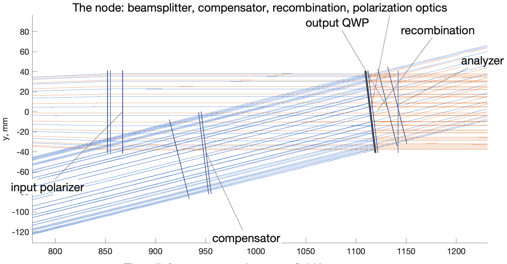

<!--
deck_gauges.md — DM Surface Gauge Comparison.  DRAFT — pending Dave's
sign-off; the builder suppresses the export mark on DRAFT decks.
Build: python3 make_brief_slides.py deck_gauges.md
Assembled 2026-09-14 (CCL) from the three lane reports and the plan:
  tg_psi_dm96_oap/REPORT_gauge_ifo.md (+ REPORT_oap.md, README) — CCMac
  pdi_dm96/REPORT_gauge_pdi.md (+ README) — TO
  zwfs_dm96/README.md + deck_zwfs.md — CCL
  macos/BRIEF_gauge_deck.md sections 5-11 (rulings, outline, capture, OAP,
  analyzer, future work, modes, complex amplitude, one bench)
  raw material with every run tag: deck_gauges_material.md
Figures are the tools' own PNGs, unmodified except panel crops
(crop_panels.py: a fractional box cut from a lane's layout figure, white
margins trimmed).  The flow diagram and the switching schematic are drawn
by gauge_modes_flow.m and gauge_one_bench.m.
Rules (Dave 2026-09-13): each approach once, in its best configuration;
stories in backup; succinct; more slides rather than fuller ones;
American English; photons per measurement.
-->

# DM Surface Gauge Comparison
Four ways to measure a 96×96 deformable mirror's surface to picometers on one optical bench — a phase-shifting interferometer, a Zernike sensor, its polarized version, and a point-diffraction sensor — scored on the same mirror, the same light, and the same two jobs: hold the surface in a servo, and capture its shape after launch.
D. C. Redding, with Claude Code.
September 2026.  For the JPL HWO WFS&C discussion group.
DRAFT — pending review.  Every number here comes from a committed run of one shared, parameterized model (MACOS, mmacos); the run tags are on the provenance slide.

## The two jobs, and how each is scored | Hold the surface to picometers in a servo; capture its post-launch shape, 100-200 nm of wavefront, and bring it into the servo's reach
::: left
- **The mirror:** 96×96 actuators on a 1 mm pitch, 96 mm across.  On orbit its surface must stay constant to well under 10 pm, measured often and held by a closed loop.  The working surface during every test is a random 30 nm rms shape, not a flat: the gauge never operates at null.
- **Hold:** a change of 10 nm on one actuator, or 1 nm on 47 actuators, or a dense random 10 nm pattern, read on the 30 nm surface with the response matrix measured on it.  Then the servo: the light per cycle that holds 3 pm rms.
- **Capture:** the largest starting surface the servo brings to 3 pm; every phase reading wraps at ±158 nm of surface (±π at 632.8 nm, double pass), so this is a wrapping problem before it is a noise problem.
::: right
| score | meaning |
|---|---|
| gain | recovered change ÷ true change; 1.0 is perfect; quoted after calibration |
| floor | rms of the actuators that were not changed, in picometers |
| SNR | recovered change ÷ floor; above 5 counts as detected |
| photons per measurement | all frames of one measurement summed; 1e14 photons at 633 nm = 31 µJ = 0.13 s of a 1 mW laser at 25% throughput |
| capture range to 10% | the largest working surface at which a 10 nm change on the 47 sites reads within 10%, the matrix left as calibrated at 30 nm |
| hold, one number | photons per cycle that hold 3 pm rms in a 60-cycle loop at gain 0.5 |
~ Measuring a change costs two measurements.  The 96×96 at 385 detector pixels per pupil is the flight-like sampling; most rows here are at 193 pixels, which the sampling study showed reads the same numbers.

## One bench, four ways of sensing | Everything shares the front end: a filtered HeNe, a collimator, a 7° plate splitter, a 700 mm leg to the mirror, a focuser to an internal focus, a field lens to a camera at the pupil image
::: full
{h=2.2}
::: left
| part | value |
|---|---|
| source | HeNe 632.8 nm, filtered, 51 mm beam radius |
| collimator L1 | f 857 mm, 103 mm, coated |
| plate splitter | 7° incidence, 2.6 mm thick, 50/50; compensator plate matched |
| deformable mirror | 96×96, 1 mm pitch, 96 mm, 700 mm leg |
::: right
| part | value |
|---|---|
| focuser L2 | f 429 mm, 103 mm; internal focus at F/4.2 |
| field lens | f 43 mm, 21 mm; pupil image 9.4 mm, 32 mm behind it |
| camera | 385 pixels across the pupil (1 Mpix class), 5 pixels per actuator |
| mask seat | one substrate at the internal focus, translated to select the sensor |
~ The reference arm (a 103 mm flat on a piezo stage, 564 mm leg) is the interferometer's; shuttered, the same bench is every other sensor.  Lenses, not off-axis mirrors: the choice is priced on the lenses-versus-mirrors slide.

## Interferometer: Twyman-Green, four phase steps | Its best form is the hybrid: a polarization snapshot for every change measurement, a piezo four-step for the absolute calibration; the reference arm makes it the one gauge that captures a whole wave of figure
::: left
- **How it reads:** the test beam from the mirror interferes with the flat's beam; four frames at four phase steps give the phase at every pixel.  The snapshot form takes the four frames at once through polarization optics (no drift within a scan); the piezo form steps the flat in time (no polarization systematics).  Each removes the other's error.
- **On the 30 nm surface, matrix measured on it:** 10 nm on one actuator 0.991 / 2 pm / SNR 6076; 1 nm on 52 sites 0.990 / 1 pm; dense 10 nm 0.990, 168 pm.
- **Servo:** 3 pm from 5.5e12 photons per cycle with noise only, 2.0e13 under a 2 pm per-cycle actuator walk; a fixed error of about 9% on a noiseless step, from the four-step's roll-off.
::: right
| added to the front end | value |
|---|---|
| reference flat on a piezo stage | 103 mm, protected aluminum, 564 mm leg |
| compensator plate | matched to the splitter |
| snapshot form: input polarizer, two arm quarter-wave plates, output quarter-wave plate, analyzer | zero-order plates; azimuths 45 / 0 / 45 / 0 / 0° |
| frames per measurement | 4 (snapshot: at once; piezo: in sequence) |
~ Run tags lens_deck, loop_lens, lens_deck_se2; the three phase-shift forms are priced in backup.

## Interferometer: the layout | The splitter node from above, with the compensator, the recombination, and the snapshot form's polarization optics; the whole train is on the front-end slide
::: full
{h=4.6}
~ Drawn by tg96_run from the emitted deck (lens_vlayout.png in tg_psi_dm96_oap); the detector tail beyond the focuser is the same as the sensors'.

## Zernike sensor: a quarter-wave dimple at the focus | The beam interferes with its own core: no reference arm; the best reading steps the dimple's depth through four frames and inverts pixel by pixel
::: left
- **How it reads:** a 5.3 µm etched dimple (2.0 λF/D) delays the center of the focal spot a quarter wave; that light spreads back over the pupil and acts as the reference.  Three etch depths plus a clear frame make the four-frame stepped reading, which has no branch fold.
- **On the 30 nm surface, matrix measured on it:** 10 nm on one actuator 0.989 / 5 pm / SNR 2160; 1 nm on 47 sites 0.999 / 4 pm; dense 10 nm 0.984, 0.68 nm.
- **Servo:** 3 pm from 2.6e12 photons per cycle noise only, 7.5e12 under the 2 pm walk; no fixed error (a noiseless step goes to 0.000 pm).
::: right
{h=3.0}
~ Added to the front end: one fused-silica plate with a 3×3 array of etched spots (one in the beam at a time; the 346 nm etch is a quarter wave at 632.8 nm), on a translation stage.  Nothing else.  Run tags matbase, matbase385, loop193.

## Vector Zernike sensor: the polarized dimple | A geometric-phase metasurface in the same seat delays the two circular polarizations by +90° and −90°; a quarter-wave plate and a polarizing cube send the two images to two cameras, both frames at once
::: left
- **How it reads:** the two images are the sensor with its dimple sign flipped; per pixel they give the cosine and sine of the phase together, so the inversion is exact with no branch choice and no stepping.  Two simultaneous frames per measurement.
- **On the 30 nm surface, matrix measured on it:** 10 nm on one actuator 0.9935 / 4 pm / SNR 2830; 1 nm on 47 sites 0.9992 / 3 pm; dense 10 nm 0.9999, 0.33 nm — the best line in the comparison.
- **Servo:** 3 pm from 1.5e12 photons per cycle noise only, 5.3e12 under the 2 pm walk; no fixed error.
::: right
| added to the front end | value |
|---|---|
| metasurface | geometric-phase (half-wave) dimple in the etched plate's seat: +90° on one circular state, −90° on the other |
| quarter-wave plate | zero order, fast axis at 45° between the cube's s and p; spec λ/300 |
| polarizing cube | 12.7 mm cemented MacNeille, behind the field lens |
| cameras | two, both 20.7 mm behind the cube at the pupil image |
| frames per measurement | 2, simultaneous |
~ Two cameras rather than one: the 9.4 mm pupil image 32 mm behind the field lens would need a 17° split for side-by-side images, past a calcite prism's limit.  Run tags v193base, vloop193.

## Vector Zernike sensor: the layout | The tail from the focus to the two cameras, both channel decks traced by the engine
::: full
{h=4.8}
~ Drawn by zwfs_vlayout.m from the two emitted decks (the engine does not split rays); the whole train is on the front-end slide.

## Point-diffraction sensor: a stepped pinhole with a shutter frame | The best common-path form: a 5.3 µm pinhole with an attenuated surround at the focus, five phase steps of the substrate, plus one pinhole-only frame per state that keeps the calibration honest far from null
::: left
- **How it reads:** the pinhole passes the core of the focal spot as the reference; the surround, attenuated to 0.72 in amplitude, passes the rest.  The substrate steps the surround's phase through five frames (the Schwider-Hariharan scan, insensitive to step error); a sixth frame with the surround shuttered measures the reference by itself.
- **On the 30 nm surface, matrix measured on it:** 10 nm on one actuator 0.9935 / 4 pm / SNR 2790; 1 nm on 47 sites 0.9992 / 3 pm; dense 10 nm 0.9985, 338 pm.
- **Servo:** 3 pm from 2.3e12 photons per cycle noise only, 7.0e12 under the walk; no fixed error.  The shutter frame is what lets it read to 480 nm of surface (next slides).
::: right
| added to the front end | value |
|---|---|
| pinhole substrate | fused silica in the mask seat; pinhole 5.27 µm (2.0 λF/D at F/4.2), clear |
| surround | attenuated to 0.72 in amplitude (0.52 in power), phase-stepped on a stage |
| shutter | over the surround: one pinhole-only frame per state |
| frames per measurement | 6: the five-step scan plus the shutter frame |
~ The two-arm form of this sensor (the P/SRI: a pickoff, a reference lens, a 3.7 µm pinhole feeding a single-mode waveguide with a photonic phase shifter, a recombiner) is a capture instrument here; its trade is in backup.  Run tags pdi193fbase, ploop193, pdi193state.

## Point-diffraction sensor: the layout | The tail from the focuser to the camera, with the pinhole substrate at the internal focus
::: full
{h=4.6}
~ Drawn by pdi_run from the emitted deck (pdi_layout.png in pdi_dm96); the whole train is on the front-end slide.

## Performance side by side | Every reading on the same 30 nm working surface, the response matrix measured on it: the four best readings are within 1% of each other and within 2 pm on the floor
::: full
| reading (frames per measurement) | 10 nm on one actuator: gain / floor / SNR | 1 nm on 47 sites: gain / floor | dense random 10 nm: gain / error |
|---|---|---|---|
| interferometer, lens rig (4) | 0.991 / 2 pm / 6076 | 0.990 / 1 pm (52 sites) | 0.990 / 168 pm |
| interferometer, mirror rig (4) | 0.996 / 2 pm / 5301 | 0.958 / 1 pm (52 sites) | 0.950 / 2.1 nm |
| Zernike, linear one frame (1) | 1.04 / 21 pm / 492 | 1.05 / 22 pm | 1.04 / 4.7 nm |
| Zernike, exact one frame (1) | 0.78 / 74 pm | 0.90 / 35 pm | 0.86 / 5.2 nm |
| Zernike, stepped (4) | 0.989 / 5 pm / 2160 | 0.999 / 4 pm | 0.984 / 0.68 nm |
| vector Zernike (2) | 0.9935 / 4 pm / 2830 | 0.9992 / 3 pm | 0.9999 / 0.33 nm |
| stepped pinhole (6) | 0.9935 / 4 pm / 2790 | 0.9992 / 3 pm | 0.9985 / 338 pm |
| P/SRI, reference arm traced (4) | 0.9935 / 2 pm / 4895 | 0.9924 / 1 pm | 0.9926 / 144 pm |
- **The one-frame Zernike readings lose:** the linear one is biased 4-5% and floors at 21 pm; the exact one-frame reading misreads the sign past the quarter-wave fold (7.8% of pixels on this surface) and diverges in a servo.
- **The interferometer's 52-site rows count the sites its pupil lights; the others use 47.**  The interferometer's dense-pattern error, 168 pm against 0.33-0.68 nm, is its reference arm: it does not make its reference from the beam.
~ Run tags: lens_deck, oap_deck, matbase, matbase385, v193base, pdi193fbase, pfdeck.  The interferometer rows are at 385 pixels per pupil, the rest at 193; the 385 checks read the same.

## Capture range: how far from null each reading works | With the calibration left as measured at 30 nm, the self-referenced sensors hold 10% accuracy only to 36-70 nm of surface; the externally referenced ones, and the pinhole with its shutter frame, hold to 480 nm and beyond
::: left
| reading | range to 10%, calibration aging from 30 nm |
|---|---|
| Zernike exact one frame | 36 nm |
| Zernike stepped | 42 nm |
| Zernike linear | 44 nm |
| pinhole, no shutter frame | 62 nm |
| vector Zernike | 70 nm |
| pinhole with a shutter frame | 480 nm and beyond (1.02 / 1.06 / 1.13 at 120 / 240 / 480) |
| P/SRI | 480 nm and beyond (within 1% at 100) |
| interferometer, lens rig | 322 nm single site; 480 and beyond on the grid |
::: right
- **Why the sensors age:** their reference is made from the beam's own core, and the core changes with the surface.  Past 100 nm rms (2 rad of phase) the core collapses and the reading goes blind.
- **The shutter frame fixes the pinhole's version of this:** measuring the reference by itself each state removes the surface dependence, for one more frame.
- **Re-measuring the matrix on the surface restores every reading's gain** to within 5% at 60-160 nm — at a photon price (next slide).
~ Run tags cap385, cap385p, pdi193state, lens_deck, oap_deck; 385 pixels per pupil, 47 sites (52 for the interferometer).

## Capture range, second half: the photon price of working off null | The matrix re-measured on the surface holds the gain; the light for 1 pm then rises 5-40× for the self-referenced sensors and not at all for the P/SRI
::: full
| reading | 1 nm on 47 sites, matrix re-measured at 60 / 90 / 120 / 160 nm: gain / floor | photons per measurement for 1 pm at 30 / 60 / 120 / 160 nm |
|---|---|---|
| Zernike linear | 0.96 / 25, 0.95 / 21, 0.96 / 17, 0.97 / 13 pm | 9.2e13, 1.8e14, 6.2e14, 4.6e14 |
| Zernike stepped | 0.93 / 59, 0.96 / 29, 0.97 / 22, 0.97 / 20 pm | 8.8e13, then 1e15 class |
| vector Zernike | 1.00 / 3, 0.96 / 47, 0.97 / 23, 0.97 / 21 pm | 6.1e13, 1.1e14, 2.2e15, 2.4e15 |
| stepped pinhole | 1.00 / 3, 0.96 / 41, 0.97 / 19, 0.97 / 17 pm | 9.8e13, 1.7e14, tens of times more at 120-160 |
| P/SRI | 1.000 / 3, 1.001 / 2, 1.001 / 2, 1.002 / 2 pm | 3.7e14, 4.1e14, 6.6e14, 3.7e14 |
| interferometer, lens rig | 0.99 / 1 pm, correlation 0.9999, flat to 160 nm | 2.5e14, stable to 160 nm |
| interferometer, mirror rig | 0.958, correlation 0.980 to 160 nm | 6.2e14, stable |
- **What this says:** off null, a self-referenced sensor keeps its accuracy through recalibration but pays in light (2e15 photons is 0.8 mJ, 3 s of a 1 mW laser); the two-arm instruments pay nothing because their reference does not move with the surface.
~ Run tags cap385_b60-b160, cap385p_b60-b160, noise193_b30-b160, noise193p_b30-b160, lens_deck, oap_deck.  Photons are per measurement, all frames summed, 6 noise realizations per point.

## Photons for 1 pm | On the flat calibration the sensors need 3-6e13 photons per measurement and the interferometer 1.4-2.5e14; on the working surface the sensors' cost roughly doubles and the two-arm instruments' does not
::: left
| reading | photons for 1 pm, flat matrix | on the 30 nm surface, matrix on it |
|---|---|---|
| stepped pinhole | 3.3e13 | 9.8e13 |
| vector Zernike | 4.7e13 | 6.1e13 |
| Zernike stepped | 5.4e13 | 8.8e13 |
| Zernike linear | 5.4e13 | 9.2e13 |
| P/SRI | 2.0e14 | 3.7e14 |
| interferometer, lens rig | 1.4e14 (servo form) | 2.5e14 |
| interferometer, mirror rig | 4.9e14 | 6.2e14 |
::: right
{h=2.6}
~ One measurement at 1e14 photons is 31 µJ: 0.13 s of a 1 mW laser at 25% throughput.  The camera's well depth, not the laser, sets the time (future-work slide).  Run tags pdi193f, v193noise, rec193full, noise193_b30, noise193p_b30, pfdeck, loop_lens, lens_deck, oap_deck.

## The servo: holding 3 pm | In closed loop at gain 0.5 the vector Zernike holds 3 pm from 1.5e12 photons per cycle, the pinhole and stepped Zernike from 2.3-2.6e12, the interferometer from 5.5e12 — and the sensors carry no fixed error
::: left
| reading | 3 pm, noise only | 3 pm under a 2 pm per-cycle walk | floor under a 5 pm per-cycle ramp | noiseless 1 nm step after 60 cycles |
|---|---|---|---|---|
| vector Zernike | 1.5e12 | 5.3e12 | 9.9 pm | 0.000 pm |
| stepped pinhole | 2.3e12 | 7.0e12 | 9.9 pm | 0.000 pm |
| Zernike stepped | 2.6e12 | 7.5e12 | 10.0 pm | 0.000 pm |
| Zernike linear | 2.1e12 | 7.3e12 | 27.6 pm | 1.2 pm, still falling |
| P/SRI | 5.1e12 | 1.5e13 | 9.9 pm | 0.000 pm |
| interferometer, lens rig | 5.5e12 | 2.0e13 | 13.1 pm | 87 pm (8.6%), rising |
| interferometer, mirror rig | 3.4e13 | never (4.1 pm floor) | 39 pm | 276 pm (27.6%) |
::: right
{h=2.5}
~ 7.5e12 photons per cycle is 2.4 µJ, 9 ms of a 1 mW laser.  The ramp floor of about 10 pm is the loop's lag at this gain, the same for every reading that has no fixed error.  The exact one-frame Zernike reading diverges in the loop.  Run tags vloop193, ploop193, loop193, pfdeck_loop, loop_lens, loop_oap.

## Capturing the initial figure | From a 100 nm rms surface (200 nm of wavefront) only the externally referenced readings converge: the interferometer with unwrapping alone; the pinhole and the P/SRI with unwrapping and a matrix re-measured every 10 cycles
::: left
| reading | largest start brought to 3 pm | what it takes |
|---|---|---|
| Zernike stepped, linear | 30 nm | reading alone; unwrapping changes nothing |
| vector Zernike | 60 nm | reading alone |
| stepped pinhole, no shutter | 60 nm | reading alone |
| stepped pinhole with shutter frame | 100 nm (200 nm WFE) | unwrap + re-measure every 10: 0.21 pm at 1e15, 2.1 pm at 1e13, 3 pm by cycle 26 |
| P/SRI | 100 nm | unwrap + re-measure: 0.25 pm; ceiling between 100 and 150 |
| interferometer, lens rig | 300 nm (600 nm WFE) | unwrap alone: 3 pm in 16 / 18 / 21 / 25 / 43 cycles from 60 / 100 / 150 / 200 / 300 nm |
| interferometer, mirror rig | none | stalls at 5.9 / 24 / 53 nm from 60 / 150 / 300 |
::: right
- **The wrap is not the limit for the self-referenced sensors:** past 60 nm their differential comes back at 24-28 nm whatever the truth, with zero residues — the focal reference has collapsed, the reading is blind, not folded.
- **Unwrapping alone is not enough for the pinhole or the P/SRI:** the calibration measured at the start is wrong by the time the surface has moved; re-measuring it every 10 cycles (3 times in the descent) closes the loop.  Cadence is not the constraint; the cycle count is.
- **The interferometer needs no recalibration** because its reference is the flat, not the beam.
~ 1e13 and 1e15 photons per cycle give the same convergence: capture is reference-limited, not light-limited.  Run tags cap_nouw, cap_uw, cap_state_uw_recal, descent193, descent_lens, descent_oap.

## Lenses or off-axis mirrors in the front end | The reflective rig is the budget choice; it costs the interferometer its servo and its capture, and it breaks the focus-critical sensors: the mirror fold's coma at the mask seat is 0.8 λF/D
::: left
| | lens rig | off-axis mirror rig (bare aluminum) |
|---|---|---|
| interferometer, 1 nm on 52 sites | 0.990 / 1 pm | 0.958 / 1 pm |
| interferometer, dense 10 nm | 0.990 / 168 pm | 0.950 / 2.1 nm |
| mode-to-mode cross-talk | below 0.06 | about 0.18 |
| servo, 3 pm under the walk | 2.0e13 | never |
| noiseless step, fixed error | 8.6% | 27.6% |
| capture from 60-300 nm | converges | stalls |
| alignment: 10 µrad tilt of a mirror | — | 95-103 nm of null shift |
| Zernike stepped, 10 nm on one actuator | 0.989 / 5 pm | 1.000 / 4 pm; 47 sites 0.967 |
| vector Zernike, 100 nm pokes | 0.05 pm | 19.6 pm: fails its gate |
| stepped pinhole, 100 nm pokes | 1.9 pm | 94 pm: fails its gate |
::: right
- **The mirror rig's fold is in the same plane as the splitter's**, and its residual astigmatism and coma leak between the mirror's modes.  Open-loop rows tolerate it; a servo does not.
- **At the mask seat the fold coma blurs the focus to 1.1 λF/D** once the seat is refocused (a 6.1 mm trim, the collimator's residual defocus refocused by the focuser).  The more focus-critical the mask feature, the worse: the 2 λF/D dimple survives, the polarized dimple degrades, the pinhole breaks.
- **Coatings do not rescue it:** bare and protected aluminum give the same rows; the retardance variation they add is 0.5 mrad, a floor.
~ Run tags oap_deck, loop_oap, descent_oap, zoap; the seat-trim solve is in tg_psi_dm96_oap/REPORT_gauge_ifo.md section 4.  Astigmatism scales with the fold angle squared: halving it lengthens the leg 1.33×.

## What can spoil each reading, priced | Every systematic we could model is either calibrated by the response matrix measured through the sensor, or shown small; one line per approach
::: full
| approach | term | uncalibrated size | after the matrix measured on the surface |
|---|---|---|---|
| interferometer | piezo step error 2% / 5% | gain 0.974 / 0.954; floor 2 → 5 / 9 pm | common mode in the servo: 5.4e12 vs 5.5e12 |
| interferometer | camera 1/f walk, 1e-3 of signal within a scan | +13% light for 3 pm | — |
| interferometer, snapshot | splitter diattenuation (plate); cube R_p | gain +11.7% (plate); 2.1% (cube, naive stack) | analyzer sweep nulls to 1.00000; symmetric stack 0 |
| Zernike | model out of focus (the early model); sampling; color | floor 744 → 67 pm on correction; dimple needs 6 pixels; one etch reads five colors within 3% | — |
| vector Zernike | metasurface retardance error 0.1 rad | 750 pm on a 12 nm figure | rows 0.9934 / 4 pm, the ideal numbers |
| vector Zernike | the arm's polarization (six tilted glass faces) | 9 pm on 12 nm; 6 nm per rad of channel phase | nothing to 0.1 rad; 10% gain loss at 0.3 |
| vector Zernike | the analyzer: cube extinction; plate error λ/300 | 3.5 pm; 165 pm (1.4% of the figure) | gain within 0.7%, floors within 4 pm |
| pinhole | 2% step error | 4.9 pm with the five-frame scan (421 pm with four-step least squares) | differential rows error-free to the digit |
| pinhole, P/SRI | camera bias drifting within a scan | 5.3 / 10.7 pm at 1e15 (the linear Zernike: 10.8 nm) | — |
| P/SRI | its own reference arm walking | 4% more light over a hundredfold range of walk | a path change is piston, the mode the estimator nulls |
~ Nothing is left open on the vector sensor's line.  Run tags lens_deck_se2/se5, loop_lens_cam, tg_psi_dm, tg_psi_dm_v2, v2g, v3arm, an193, pdi193se_sh5, pcam193ri, rw193.

## Recommendation | Hold with the vector Zernike sensor; capture with the interferometer, or with the stepped pinhole's shutter frame if a second arm is not wanted; build on lenses; build one bench that switches
::: left
- **Hold:** the polarized dimple is the best reading on every line — 3 pm from 1.5e12 photons per cycle, two frames taken at once, no stepping, no fold, no fixed error, and every systematic we modeled calibrated by the matrix measured through it.  The stepped scalar dimple is the fallback with no polarization optics, at 1.7× the light.
- **Capture:** the interferometer takes 100-600 nm of wavefront to 2 pm in tens of cycles with unwrapping alone.  In the common path, the stepped pinhole with a shutter frame captures 200 nm of wavefront with unwrapping and three recalibrations.  A second color is the sensors' own route (future work).
- **Front end:** lenses.  The mirror rig's fold coma walls the servo and breaks the pinhole.
::: right
- **The bench:** one layout with the reference arm shuttered, the mask seat translated, the quarter-wave plate in or out, and the P/SRI arm behind a flip-in plate (the one-bench slide).  Capture with the interferometer, hand off inside the sensor's 60 nm reach, hold with the sensor at a third of the light.
- **What the numbers do not decide:** the pinhole and the vector dimple tie on the working surface (0.9935 / 4 pm both); the dimple wins the servo by 1.5×, the pinhole wins capture range for one extra frame.  A bench that carries both costs one substrate.
~ Draft stance approved 2026-09-13; the wording is for review.

## The modes, from launch to hold | Four operating modes and what carries the surface between them: the ground flat, the loop's own phase retrieval, capture, and the servo hold, with recalibration events
::: full
{h=4.6}
~ The loop's own focal-plane phase retrieval wraps at half a wave of high-spatial-frequency wavefront, one wave before the gauges do; its reach sets what capture must cover.  Drawn by gauge_modes_flow.m.

## The complex amplitude, for two-mirror control | Every approach but the one-frame Zernike readings returns the pupil field's amplitude as well as its phase from frames it already takes; no separate camera is needed
::: left
| reading | amplitude from its own frames? | how |
|---|---|---|
| Zernike, one frame | no | the solve assumes the flat's amplitude |
| Zernike, stepped | yes | its clear frame is the pupil intensity; the depths give the field |
| vector Zernike | yes, with one clear frame | the pair alone is ambiguous; the pair plus the clear frame is exact |
| pinhole, P/SRI | yes | the stepped solve is the field against a known reference |
| interferometer | yes | fringe modulation is the test amplitude times the reference's |
::: right
- **The vector pair alone cannot:** its two images fix the field only up to a mirror image about the reference wave, and at gauge-level phases (a 100 nm poke is 1.9 rad) the true field crosses that line.  Solving both from the pair diverges.
- **The pair plus the state's clear frame reads both exactly:** through a 5% and a 20% dip in pupil amplitude the phase comes back at 0.02 and 0.13 pm, where the phase-only solve misreads by 237 and 952 pm; the hold rows are unchanged to the digit.  Three frames.
~ Run tag an193_clear; the runner's mask.v_clear reading and gate G9.  On orbit with starlight, the field's amplitude is what the second mirror's control needs.

## One bench, every mode | Nothing is realigned: the mask seat translates, the reference arm is shuttered, the quarter-wave plate goes in or out, and the P/SRI arm sits behind a flip-in plate
::: full
{h=4.4}
~ The polarizing cube and camera B stay in every mode: with the laser p-polarized the cube transmits 98% to camera A.  The cemented-cube interferometer (backup) is the one form that does not switch in.  An engine-traced drawing of this bench is a follow-up; the schematic is gauge_one_bench.m.

## Future work: capture beyond one wave with a second color | Unwrapping works while neighboring pixels differ by less than half a wave; a figure of more than a wave with actuator-scale structure needs a coarse ruler
::: left
- **Where unwrapping stops:** at 4 pixels per actuator a 100-200 nm rms actuator pattern is 0.7-1.4 rad per pixel and unwraps; quilting, print-through or a stuck actuator at more than a wave does not.
- **A second color makes a synthetic wavelength:** 632.8 + 700 nm gives 6.6 µm, an unambiguous surface range of 1.6 µm (double pass); 632.8 + 780 nm gives 3.35 µm and 0.84 µm.  The coarse pair captures, the single color holds; the coarse solve is 5-10× noisier.
- **The machinery exists:** the runner already traces one physical mask at five colors (the dimple is 1.57 rad at 632.8 nm, 1.42 at 700); the measurement to add is the start ladder with a two-color coarse solve feeding the single-color loop, per reading.
::: right
| color pair | synthetic wavelength | unambiguous surface | noise cost |
|---|---|---|---|
| 632.8 + 700 nm | 6.6 µm | 1.6 µm | 10× |
| 632.8 + 780 nm | 3.35 µm | 0.84 µm | 5× |
~ The two-color interferometer is the classic form; the same trick applies to the dimple and the pinhole through their color stage.

## Future work: other approaches worth a look | Seven candidates, none modeled here, each with one sentence on what it would buy
::: full
- **Shack-Hartmann or modulated pyramid as the capture stage:** many waves of range, no wrap, far from picometers; hands off to the gauge inside its range.
- **Phase diversity (two defocused pupil images):** wide range, common path, iterative; a capture candidate with the existing camera and one translation stage.
- **White-light scanning in the interferometer:** an absolute surface with no wrap, slow; a one-time capture tool.
- **A model-based large-figure solve:** the mirror's influence functions as the basis of a nonlinear fit to the sensor's frames; the estimator already carries the basis.
- **Vector Zernike with a polarization camera:** one camera instead of the cube and two, at a quarter of the pixels per image.
- **Heterodyne or lock-in detection:** immunity to slow drift and 1/f electronics, for a frequency-shifted reference; the two-arm instruments can carry it, the common-path sensors cannot.
- **Direct actuator metrology (capacitive, optical):** a coarse reference the optical gauge is calibrated against.

## Future work: from this model to as-built performance | The model today has ideal optics, a perfect camera, photon noise, and mirror and camera drift; five additions, in the order they are likely to matter
::: full
- **The camera sets the measurement time, not the laser:** 1e14 photons over 1e5 pupil pixels is 1e9 electrons per pixel; with a 1e5-electron well that is 1e4 co-added frames, 100 s at 100 frames per second, against 0.13 s of laser.  Price well depth, frame rate, read noise (as the square root of the frame count), bit depth, gain nonlinearity, pixel-response nonuniformity, persistence between the stepped frames.
- **Optical surface errors:** every lens, mirror, plate and the mask substrate with a typical figure (λ/10 to λ/20, a 1/f² spectrum) on the element; the sensors' reference core sees the low orders (0.16 wave of defocus moved every number in the early model); the dimple's etch depth and the mask's flatness.
- **Alignment and stability:** the sensitivities exist (10 µm, 10 µrad); add the mask's centering drift on the focal spot, the bench's thermal expansion, source pointing and wavelength drift, laser polarization angle, and the two-arm instruments' non-common-path air and mounts.
- **More drift in the loop:** actuator hysteresis and creep, command quantization (14-16 bits: 0.1-0.5 nm steps as a floor), influence-function error, vibration within a stepped scan.
- **The error budget in the JPL form:** per reading, fixed terms after calibration, drift terms weighted by the servo bandwidth, noise terms in quadrature, to a held error at a stated light and time.  This deck's comparison table is its first column.
~ The telescope-level version of this (an allocation table rolled through the sensitivity model, then the closed-loop predictor) is being planned separately; it is a later add to this deck.

## Run it yourself | One parameter sheet and one runner per approach, shared code underneath; every number here is reproduced by the commands below
::: left
- **Interferometer** (tg_psi_dm96_oap): `tg96_run` for the lens rig; `tg96_run('bench.optics','oap','tag','oap')` for the mirror rig; `./tg96_batch.sh lens_deck "'stages',{'bench','deck'},'battery.noise',true"`; `./tg96_batch.sh loop_lens "'stages',{'bench','loop','figs'}"`.
- **Zernike sensors** (zwfs_dm96): `out = zwfs_run;` (bench + battery + figures); `zwfs_run('tag','ng385','NGRID',385)`; `zwfs_run('MODEL',2048,'NGRID',385,'param_file','macos_param_2048.txt')`; `./zwfs_batch.sh loop193 "'stages',{'bench','loop','figs'}"`.
- **Point-diffraction** (pdi_dm96): `P = pdi_params; out = pdi_run(P);`; `pdi_run('pdi.DIA_LAMD',1.0,'stages',{'bench','battery','figs'})`; `./pdi_batch.sh TAG "pdi_params, 'stages',{'bench','loop','figs'}"`.
::: right
- **The other gauges on the mirror rig:** `zwfs_run('bench.optics','oap','bench.coat_oap','bareAl','readings',{'L','S','V','P','PF'},'stages',{'bench','battery','noise','loop'},'mask.v_arm','engine')`.
- **Where:** MACOS_resources/mmacos/templates/40_benches/{tg_psi_dm96_oap, zwfs_dm96, pdi_dm96}, the shared scoring library dm_gauge_lib, branch dev-candidate.  A model-1024 run needs about 11 GB; the batch wrappers run one at a time.
- **Gates:** every stage asserts its own gates (the mask round trip, the reference-wave surrogate, the fold, the pinhole, the analyzer); tDmgLoop 15/15; the mmacos fast suite 481/0.
~ Each directory's README carries the full command list and the run-tag index.

## Backup: the interferometer's three phase-shift forms | The four frames are the same in the model; the forms differ in what they get wrong
::: full
| form | how the four steps are made | what it gets wrong | priced |
|---|---|---|---|
| piezo four-step | the reference flat stepped in time | step miscalibration; camera and mirror drift within a scan | step error 2% / 5%: gain 0.974 / 0.954, floors 5 / 9 pm; in the servo common mode (5.4e12 vs 5.5e12); camera walk 1e-3 within a scan: +13% light; mirror walk within a scan: 1.6e13 vs 1.7-2.0e13 |
| polarization snapshot | four analyzer channels at once | polarization systematics, fixed by design; no within-scan drift | plate rig: the splitter's diattenuation rotates the test arm 7.5°, gain +11.7%, nulled to 1.00000 by an analyzer sweep and a 3.8° plate clock; cube rig: R_p 2.1% for a naive stack, 0 for the symmetric one, 2.27× the delivered power |
| hybrid | snapshot for the change, piezo for the absolute step | each half removes the other's error | the recommended form; its value is the absolute calibration more than drift immunity: the four-step already tolerates all three sequential terms in hold |
~ Run tags lens_deck_se2, lens_deck_se5, loop_lens_se2, loop_lens_cam, loop_lens_intra, tg_psi_dm, tg_psi_dm_v2.

## Backup: the interferometer on the mirror rig | Open loop it reads; in a servo it does not hold, and from a large start it does not capture
::: left
| | lens | mirror rig, bare Al |
|---|---|---|
| single 10 nm, flat | 0.9916 / 2.2 pm | 0.9950 / 2.1 pm |
| flat-mirror null | 0.13 nm | 13.1 nm (cancels differentially) |
| modal transfer gain | 0.96-0.99 | 0.63-0.95 |
| cross-talk | below 0.06 | 0.18 (0.42 with an ideal reflector) |
| photons for 1 pm | 2.5e14 | 6.2e14 |
| servo, noise only | 5.5e12 | 3.4e13 |
| collimator tilt 10 µrad | — | 95 nm null shift, 9.5 nm per µrad |
| focuser tilt 10 µrad | — | 103 nm, 10.3 nm per µrad |
::: right
{h=2.4}
~ The mirror rig's own layout (oap_vlayout.png in tg_psi_dm96_oap) folds in the splitter's plane; the engine's seat-trim solve put the mask seat 6.14 mm from the lens default.  Run tags oap_deck, loop_oap, descent_oap; REPORT_oap.md items D3-D7 and B.

## Backup: the Zernike readings that lost, and the fold | One frame is not enough: the linear reading imprints error under a slow drift, and the exact one-frame reading diverges once actuators sit past the quarter-wave fold
::: left
- **Linear, one frame:** holds noise and walk like the stepped reading (2.1e12 / 7.3e12) but floors at 27.6 pm under the 5 pm ramp and is still creeping at cycle 60: a persistent low-order residual makes it imprint fine-scale error (26 pm above 12 cycles per aperture).
- **Exact, one frame with a sign prior:** a 1 nm step grows to 99 nm in 60 cycles, 10 nm to 178 nm; the actuators whose footprint lies past the fold read with the wrong sign.
- **The fold:** on the 30 nm surface 7.8% of pupil pixels sit past the quarter-wave fold (7.7 / 12.6 / 16.9 / 20.6% at 30 / 40 / 50 / 60 nm rms); a dense 10 nm change moves 3.3% of them across it.  The stepped reading and the vector pair have no fold.
::: right
{h=2.6}
~ Run tags loop193, fold_diag, matbase385.

## Backup: the point-diffraction trades | The pinhole diameter of record is 2.0 λF/D; the P/SRI's traced reference arm moves with the state by 0.05% of the figure and costs twice the light
::: left
| | 2.0 λF/D pinhole | 1.0 λF/D pinhole |
|---|---|---|
| diameter | 5.27 µm | 2.64 µm |
| surround transmission (amplitude) | 0.72 | 0.28 |
| throughput | 0.82 | 0.29 |
| pixels across at the mask | 7.9 | 4.0 (below the 6 the sampling rule asks) |
| 10 nm on one actuator | 0.9935 / 4 pm | 0.9937 / 4 pm |
| capture range, no shutter | 62 nm | 120 nm and beyond |
| photons for 1 pm on the surface | 9.8e13 | 2.1e14 |
| 3 pm under the walk | below 1e13 | 3.6e13 |
::: right
- **The range the small pinhole buys, the shutter frame gives free** at the large one's throughput: 1.02 / 1.06 / 1.13 at 120 / 240 / 480 nm.
- **The P/SRI** (pickoff plate 60/40, a 300 mm F/2.9 reference lens, a 3.7 µm pinhole feeding a single-mode waveguide with a thermo-optic phase shifter, a mirrored second lens, folds, a 21.9 mm compensator, a 50/50 recombiner): balanced to zero path difference in the trace.  Its reference moving with the state costs 5.9 pm absolute on a 13 nm figure and 12% on the dense floor; frozen, 0.000.
- **Five frames beat four:** a 2% step error reads 4.9 pm (pinhole) and 2.2 pm (P/SRI) with the Schwider-Hariharan scan against 421 and 251 pm with four-step least squares.
~ Run tags pin20_1024, pin10_2048, pin20_loop, pin10_loop, pfdeck, pfdeck_frz, pdi193se_sh5, pdi193se_ls; layouts psri_layout.png and psri_render.png in pdi_dm96.

## Backup: drift within a measurement | A mirror that drifts during a stepped scan helps the stepped readings; a camera that drifts during the scan hurts them; the simultaneous readings see neither
::: left
| hold error at 1e15 photons per cycle | linear | stepped | vector | pinhole | P/SRI |
|---|---|---|---|---|---|
| 2 pm walk, mirror still during a scan | 2.38 | 2.32 | 2.32 | 2.32 | 2.33 pm |
| 2 pm walk, mirror drifting across the scan | 2.38 | 1.57 | 2.32 | 1.58 | 1.71 pm |
| 5 pm ramp, mirror still | 27.6 | 10.05 | 9.87 | 9.86 | 9.88 pm |
| 5 pm ramp, drifting across the scan | 27.6 | 7.16 | 9.87 | 6.70 | 7.30 pm |
| camera scale drifting 1e-3 across the scan | 10.8 nm | 5.4 | 89 pm | 5.3 | 10.7 pm |
::: right
- **Why the mirror's drift helps:** a scan reads the surface at its midpoint, a free half-step of prediction; 26-32% less hold error for the stepped readings.  The camera's drift is an additive bias, the opposite sign.
- **The P/SRI's reference arm walking** (a random path walk of 1e-3 to 1e-1 rad per cycle) costs 4% in light over that hundredfold range: a path change is piston, the one mode the actuator estimator nulls.  Not benign for absolute field work; a tilting reference is outside the model.
- **The paper's camera number** (0.13 electrons per pixel per cycle) is invisible to every reading: an electron is 1e-4 of a lit pixel's shot noise at 1e13 photons.
~ Run tags intra193_0, intra193, pcam193, pcam193r, pcam193ri, rw193_1e3/1e2/1e1, loop_lens_intra, loop_lens_cam.

## Backup: the vector sensor's polarization terms | The metasurface's retardance error, the arm's polarization aberration, and the analyzer, each from the engine's polarized traces of this bench
::: left
| term | uncalibrated, on 100 nm pokes (12 nm rms) | through the matrix measured on the surface |
|---|---|---|
| metasurface retardance error 0.02 / 0.05 / 0.10 / 0.20 rad | 153 / 380 / 750 / 1461 pm | 0.9934 / 4 pm at 0.10 and 0.20: the ideal rows |
| the arm, laser at 45° / 0° / 90° to the fold plane | 9.0 / 17.2 / 11.2 pm (ideal 0.05) | nothing through 0.1 rad of channel phase; 10% gain loss at 0.3 |
| the arm, design scan: 6 nm per rad of channel phase | 59 / 178 / 597 / 1877 pm at 0.01 / 0.03 / 0.1 / 0.3 rad | — |
| analyzer: cube extinction alone | 3.5 pm | 0.9934 / 4 pm |
| analyzer: plate λ/300; 1° azimuth; λ/100 | 165; 263; 496 pm | 0.9932 / 4; 0.9932 / 4; 0.9928 / 4 pm |
::: right
- **The arm:** six 7° glass faces give 5e-3 diattenuation and 0.9 mrad retardance; because the Jones matrix is real, the two circular channels differ in phase only, 1.6 mrad rms at the worst laser angle and 2e-5 along the fold plane's axis.  Rule: specify pupil-varying diattenuation, put the laser on the eigenaxis.
- **The analyzer:** a plate retardance error δ couples the two images with amplitude δ/2, an azimuth error θ with amplitude θ, engine-exact, opposite signs in the two ports; the cube's finite extinction adds 4-6e-4 incoherently.  Spec a zero-order plate at λ/300, azimuth to 1°.
- **A three-number fit on the flat's two images** recovers the metasurface's constants to five digits (0.048 pm).
~ Run tags v2g, v2loop, v3arm, v3s, v3loop, an193_cube/q300/q100/az1; zwfs_dm96 README V2-V4.

## Backup: the sensor model, sampling and color | The early Zernike model was out of focus by 4.9 m at the pupil image; corrected, every gate closes; the sampling rule and the color result follow from the corrected model
::: left
- **The correction:** the mask's exit reference sphere carried 23.9 mm against the entrance sphere's 352.7 mm, a 4.86 m defocus of the pupil image.  Symmetric spheres take the unmasked round trip from 0.159 to 1.8e-15 and the pupil brightness modulation under a 30 nm surface from 29% to 4e-16; the single-actuator floor fell from 744 to 67 pm before any other change.
- **Sampling:** mask pixels per λF/D = 0.74 × model ÷ rays; the dimple needs 6 pixels; 385 rays on a 2048 grid is the compliant run (7.9 pixels, 5 pixels per actuator), and a stencil-site fix in the actuator fit took the test actuator from 0.935 to 0.996.
- **Color:** five colors through one 346 nm etch, dimple phase 2.10 to 1.27 rad; the combination's minimum transfer is 0.991 against 0.962 for the best single color — 3%, not 3×; the linear reading gets worse (480 nm reads negative).
::: right
{h=2.6}
~ Run tags rec193full, m2048, m2048_lat, ng385_lat; zwfs_dm96 README S7-S9.

## Backup: provenance | Every number in this deck has a run tag in a committed run directory of the shared model; the three lane reports carry the full tables
::: full
- **Interferometer** (tg_psi_dm96_oap/runs): lens_deck, lens_deck_se2, lens_deck_se5, loop_lens, loop_lens_cam, loop_lens_intra, loop_lens_se2, descent_lens, oap_deck, loop_oap, descent_oap, oap_bareAl, oap_coat, oap_jones, zoap.  Report REPORT_gauge_ifo.md (CCMac), with REPORT_oap.md and README.md.
- **Zernike sensors** (zwfs_dm96/runs): matbase, matbase385, m2048, m2048_lat, cap385, cap385_b60-b160, noise193_b30-b160, rec193full, loop193, loop385, v193base, v193noise, vloop193, fold_diag, v2g, v2loop, v3arm, v3s, v3loop, an193_ref/cube/q300/q100/az1/bound/clear.  README.md (CCL) and deck_zwfs.md.
- **Point-diffraction** (pdi_dm96/runs, and the pre-split records in zwfs_dm96/runs): pdi193f, pdi193fbase, pdi193state, pdi193se_ls, pdi193se_sh5, ploop193, pcam193, pcam193r, pcam193ri, pfdeck, pfdeck_frz, pfdeck_loop, cap385p, cap385p_b60-b160, noise193p_b30-b160, cap_nouw, cap_uw, cap_uw_recal, cap_state_uw, cap_state_uw_recal, descent193, descent193s, descent193f, intra193_0, intra193, rw193_1e3/1e2/1e1, pin20_1024, pin20_loop, pin10_2048, pin10_loop.  Report REPORT_gauge_pdi.md (TO) and README.md.
- **Plan and rulings:** macos/BRIEF_gauge_deck.md sections 5-11.  Raw material with every figure's pixel size: demo_session/deck_gauges_material.md.
- **Engine:** MACOS on dev-candidate; mmacos fast suite 481 pass, 0 fail (2026-09-14); the polarization physics (Jones pupils, coatings, retarders, the metasurface's leak) from the engine's own polarized traces.
~ Model sizes: 1024 grid with 193 rays for most rows, 2048 with 385 for the compliant sampling; one engine MATLAB at a time on the box, 11-20 GB.
