<!-- Keysight/CodeV demo deck — DRAFT source (Dave edits here; rebuild:
     python3 make_brief_slides.py deck_keysight.md   (the LOCAL copy —
     it applies the geometry sidecar; the MACOS_sandbox/slides copy is
     synced from here)
     Layout: deck_keysight.geo.json carries Dave's manual pptx
     repositioning (pass 2) and is applied at every rebuild — recover
     future pptx edits with pptx_text_diff.py (text) + pptx_geo_diff.py
     (geometry, vs baseline_pass3.pptx = the build the edit deck was
     refreshed from 2026-08-30 pm), fold them into the md/sidecar.
     Render altered slides after every rebuild (standing rule, Dave 2026-08-29):
     soffice --headless --convert-to pdf deck_keysight.pptx --outdir renders/
     pdftoppm -png -f <first> -l <last> -r 100 renders/deck_keysight.pdf renders/v<N>
     (bump the v<N> tag every round — stale-image trap).
     Slide-3 ecosystem figure: make_ecosystem_fig.py (pymacos venv python).
     Cropped figures (crop_*.png): crop_figs.py — white-trim only, never content.
     Figures are symlinks in figs/ to committed artifacts — never regenerated.
     Order per Dave 2026-08-29 pm (amended 2026-08-30: IFO block = live-demo
     intro slide 14 [schematic + terminal prompt panel], then two recap
     slides shown AFTER the run): intro, C3-first Rodgers arc, C1/C2,
     IFO block, CTB, e2e6m, REVEAL, discussion, summary; capability +
     anchors + e2e trio in backup.  IFO schematic: make_ifo_schematic_fig.py.
     Sources: deck_rodgers_status.md (r1/r2), challenges/rodgers3 records (r3),
     tg_psi_dm README + BRIEF_tg_demo.md foot (IFO), e2e s6/s7A frames,
     BRIEF_r3_adjacent_demo.md delivery log, bench_ctb / e2e6m_r2 reports. -->

# MACOS — Optical Modeling, Analysis and Design, with an AI in the Loop
One ray-trace and physical-optics engine, four language surfaces, an AI-driven design layer — with two elements run live
D. C. Redding, with Claude Code — 1 September 2026.  Prepared for the Keysight CODE V team.  DRAFT — pending source sign-off.
~ Live elements: a telescope designed during the talk to an audience-chosen field specification (asked and launched once challenge 3 is on the table, revealed before the closing discussion), and a polarization phase-shifting interferometer measuring a deformable mirror.  All wavefront numbers are RMS wavefront error; each study states its reference convention where it reports.

## Four decades of NASA optical modeling | Technology development to flight: Hubble, JWST, TMT
::: full
- **Late 1980s:** the engine originates in NASA telescope technology development
-- ***Used for Star Wars control-system development and NASA SubMM telescope analysis.***
- **1991:** Hubble — prescription recovery correctly diagnosed the aberration from flight imagery
-- ***Prescription retrieval from image data has served other missions as well.***
- **JWST:** integrated observatory modeling and wavefront sensing and control development
-- ***Testbeds validated the models, and the validated models proved the space system.***
- **TMT, Keck and other space missions:** Observatory modeling, including segmented-aperture systems, testbeds, instrument studies.
-- ***Validated against testbed and operational data across those programs.***
- **We are now modernizing and extending the capabilities of our modeling to meet new challenges.**
-- ***New elements: Freeforms with aberrations, polarizers, complex masks and apodizers, completely general surfaces added through the API***
-- ***The same functionality, streamlined: linear model generation, simulation, multi-path, metrology and edge sensors***
-- ***New capabilities: design layer***
-- ***Code cleanup: improved robustness, automated testing, updating documentation***

## One engine, four surfaces | The same Fortran core answers a terminal, a library call, MATLAB, and Python
::: full
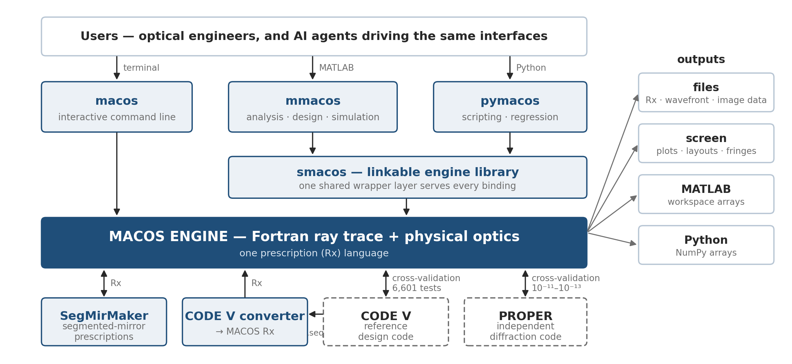{h=3.7}
- **Physics lives in the engine: a capability added there is everywhere at once**
- **One shared library layer serves the MATLAB and Python toolboxes.**
- **The prescription generators and the CODE V converter feed the same Rx language.**
- **CODE V and PROPER provide independent cross-checks.**
- **One source tree: github nasa-jpl/macos and /MACOS_resources contain it all.**

## Inside the toolbox | Five areas, organized the way the work flows — veneer, sensitivities, design, runners, worked examples
::: full
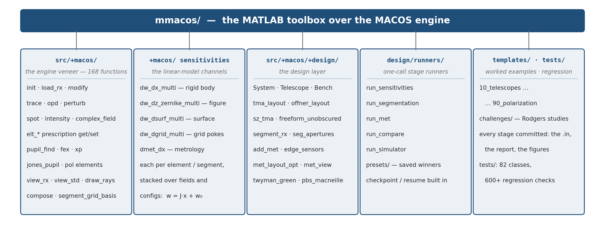{h=4.7}
~ Counts as of 2026-08.  Every area is exercised by the committed test suites and by the worked examples beside it — the same templates this talk's studies live in.  Rebuild the figure: make_mmacos_fig.py.

## Three design challenges, one method | CODE V benchmark studies reproduced first, then extended
::: full
| | challenge 1 (July) | challenge 2 (August) | challenge 3 (August) |
| the task, as posed | a three-mirror telescope, f/20, 5 m aperture: a 0.2°×0.2° field box offset 0.5° off axis | a three-mirror afocal telescope, 30×, 1 m aperture: a 0.5°×0.5° field offset 0.6°, a tilted cold stop the interface to the instrument | a three-mirror imager, f/4, 75 mm aperture: a 20°×20° field box centered 22° off axis, exit beam horizontal, hard beam–mirror clearances |
| the ladder, in steps | on-axis → offset, frozen → re-solved → tilt/decenter | on-axis → offset, frozen → re-solved → tilt/decenter | on-axis → offset, frozen → re-solved → + clearance constraints → + Zernike freedom |
| reported ladder (max RMS WFE) | 2 → 375 → 92 → 40 nm | 15 → 430 → 160 → 119 nm | 159 → 8810 → 168 → 117 → 53 nm |
| reproduction | 0.83–1.11× | 0.95–1.02× | 0.99–1.10× (all five steps) |
| the feature it proved | the field widened without freeforms — joint optics + focal-plane solves | pupil image quality, measured: metrics + the fourth-mirror trade | a super-wide-field imager family: the continuation walk + its frontier |
- Objective: meet the challenge, and use the solution to establish a design family. 
-- Build a solution code for each particular problem, using AI assistance.
-- Build another code to rapidly generate adjacent solutions, without AI assistance.
- Each challenge left a reusable template behind — the whole study re-runs at new parameters in one call.
- MACOS solves each problem with its own optimizer and the same degrees of freedom.
- MACOS separately re-traces the delivered prescriptions to compare design against design under one decoded metric.
- Challenges and solution prompts provided by Mike Rodgers (thanks Mike!).

## Challenge 3: moving a 20°×20° field 22° off axis | All five reported steps reproduce from the lens sequences before any extension is claimed
::: left
- The hardest of the three: a wide field box far off axis, an exit-beam pointing constraint, and hard clearance requirements between beam and mirrors.
- **Reproduction first:** all five reported design steps rebuild from the delivered lens sequences inside 0.8–1.25× — nothing tuned toward the reported numbers.
- **The study became a template:** one parameterized five-stage flow (solve on axis, map the offset, re-solve at the used field, add buildability constraints, add surface freedom) — re-running the whole study at new parameters is one call.
- **Every design passes the same gate sequence:**
-- 1 · traceability — every solve field reaches the detector (screened before solving)
-- 2 · map validity — all 121 dense-map fields present, none lost
-- 3 · exit-beam direction — the chief within tolerance of the horizontal pin
-- 4 · clearance — the signed beam–mirror floor at or above spec
-- 5 · score — strict RMS WFE against the reported ladder
-- pinned by regression checks with negative controls (the control reads 2989× the gate)
::: right
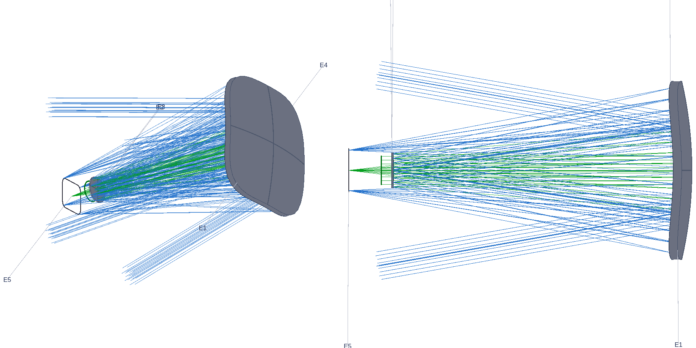{h=3.0}
~ Record: challenges/rodgers3 — packet, per-step prescriptions, regression checks with negative controls.

## Challenge 3: the numbers | Paying the same constraints lands the same design space — then a diagnosis beats the reported result
::: full
- **The buildability step:** enforcing the reported ≥35 mm clearance lands 113.6 nm at a 34.1 mm floor, against the reported 117 nm — 0.97×, same design space.  **The final step, diagnosed then beaten:** the gap to the reported 53 nm was the solve-field count, not physics; matching it lands 45.4 nm — 0.86× — at a floor 1.6 mm shy of the stated 35 mm.
- An unconstrained solve reads 58.3 nm — with the beam passing through the secondary.  The layout figure caught it; clearance constraints are part of the problem statement.
::: left
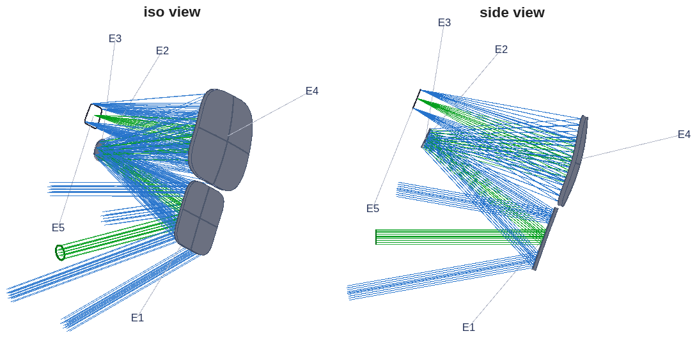{h=2.9}
::: right
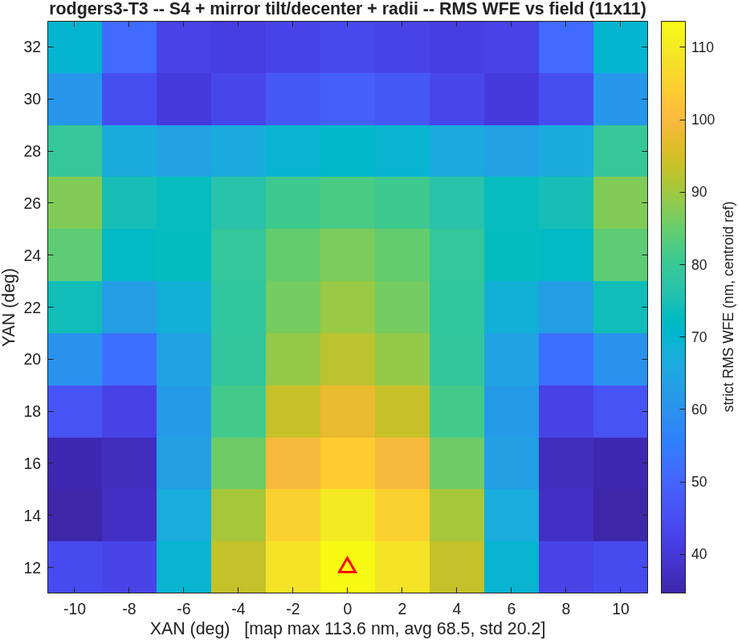{h=3.2}
~ Metric, stated once for this study: strict RMS WFE, reference sphere on the spot centroid on the frozen focal plane, anchored at the exit pupil, piston-only removal; headline = maximum of a dense 11×11 field map.

## From one design to a design family | Warm-started continuation solves what a cold start cannot
::: full
- **The cold start fails** (596 µm, most field points lose every ray); **the walk succeeds:** solve an easy 5° box, widen in steps, each warm-started from the last — 10.9 → 21.5 → 27.3 → 40.0 → 69.8 nm at 5/8/11/13/15°, 8531× better than the cold start.
- **The step table is the instrument's field-vs-packaging frontier:** every row a finished, checked design; the largest spec-compliant box is 11°×11° at 27.3 nm with a 25.1 mm clearance floor.
::: left
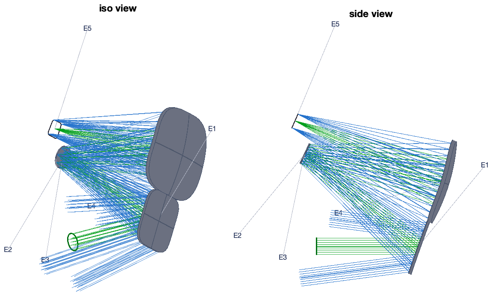{h=3.4}
::: right
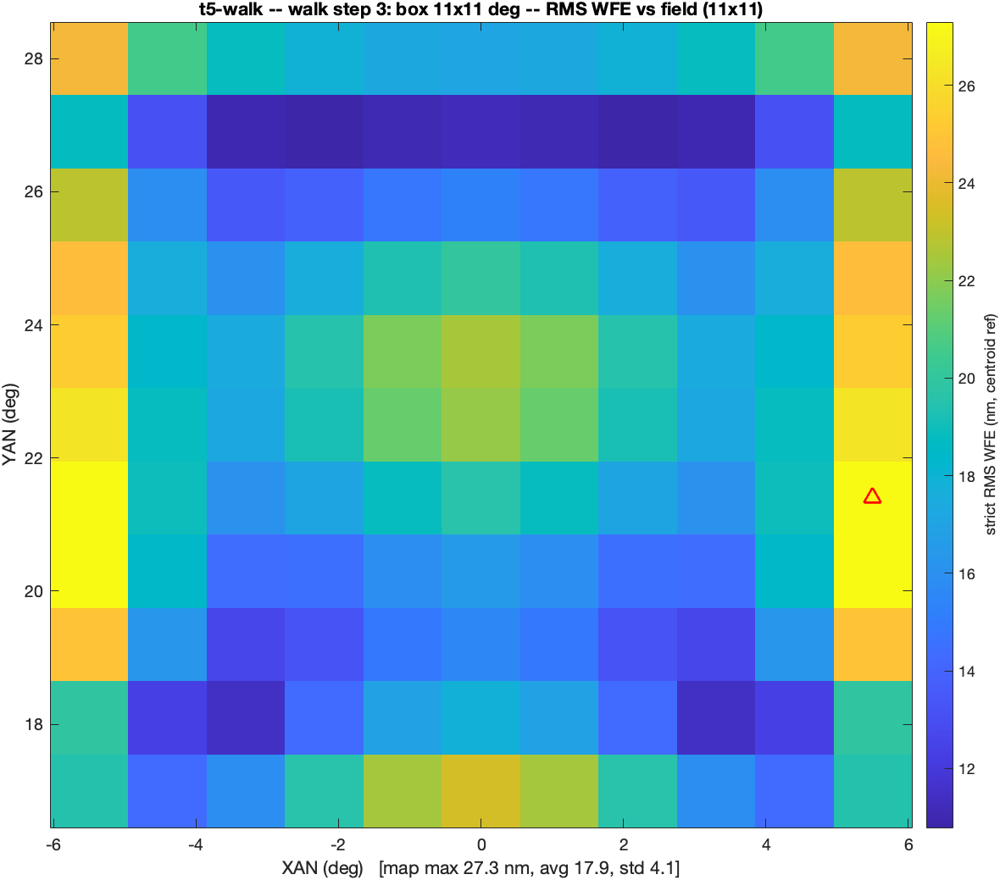{h=3.3}
~ This frontier is the basis of the live demonstration — next slide.

## The live demonstration: an adjacent instrument, designed during this talk | Kicked off now, in MATLAB; predicted first, revealed before the closing discussion
::: left
- **The ask:** name a field-box full width, anywhere in 5–15°, for the same instrument class — 150 mm f/3.3 at the +22.5° offset, same envelope, same clearance rules.
- **What happens:** the frontier states the prediction first; one MATLAB call launches a full-freedom solve, warm-started from the nearest committed design below the ask, and it runs while the talk continues (~15 min).
- **The AI is not driving:** the design knowledge is compiled into the driver — this is the "adjacent solutions, without AI assistance" half of the objective, running live.
- **The AI is available for questions.**
- **What the reveal shows:** the field map, the clearance floor and the exit-direction check, beside the stated prediction.  Every ask is a genuine continuation step, never a re-score of a stored design; a repeat run reproduces every printed digit.
::: right

```
$ matlab &                    % a fresh MATLAB, just for this solve

>> cd ~/dev/MACOS_resources/mmacos/templates/10_telescopes/offset_imager
>> OUT = oi_demo_step(12)     % <-- the room's width goes here (5-15 deg)

 warm start : committed walk step 3  (11 x 11 deg)
 predicted  : ~33.7 nm, ~24.8 mm floor  (frontier rows 11/13 deg)
 solving    : one full-freedom step ...  ~15 min

 ... at the reveal, the windows are already up; if needed:
>> oi_demo_show(OUT)          % live layout + WF map + fields
>> type(OUT.files.verdict)    % the verdict block
```
~ The literal demo-day sequence ($ = shell, >> = MATLAB); the rehearsal at 12° solved 33.6 nm against the ~33.7 prediction, and the 14° rehearsal beat its predict too.
~ In the mean time, continuing...

## Challenge 1: MACOS solves match the re-traced CODE V designs | Re-traced designs land 0.991–1.003× of reported; the MACOS solves score 0.97× design vs design
::: full
| design | MACOS, piston + tilt removed | bestfoc + LS tilt | CODE V reported |
| S2 verbatim | 482.8 / 272.0 | 371.4 / 201.4 | 374.6 / 200.0 |
| S3 MACOS solve | 116.8 / 68.1 | 86.8 / 50.5 | 91.6 / 46.4 |
| S3 CODE V re-traced | 121.0 / 67.9 | 91.9 / 50.2 | 91.6 / 46.4 |
| S4 MACOS solve | 65.6 / 36.4 | 41.2 / 21.9 | 39.8 / 22.5 |
| S4 CODE V re-traced | 67.6 / 36.7 | 39.8 / 22.1 | 39.8 / 22.5 |
::: left
- **The metric decoded:** the reported map subtracts per-field best focus + least-squares tip/tilt; re-scoring the same traces under that convention (third column) lands the re-traced designs at 0.991× / 1.003× / 1.000× of the reported max.
- **Design vs design, the reproduction closes:** the MACOS solves score 0.97× of the re-traced CODE V designs at both stages; under the reported convention the S3 solve (86.8 nm) beats the reported 91.6.  Conics agree to 1.5×10⁻⁴, rigid-body DOFs land on the same compensation branch, all signs matching.
- **The study returned more than it consumed:** two engine defects found and fixed (a silently inert exit-pupil keyword; collimated sources tracing a pupil 5% oversize, hidden for decades), and the joint-solve doctrine — optics + focal-plane pose in one DOF set, never alternating.
::: right
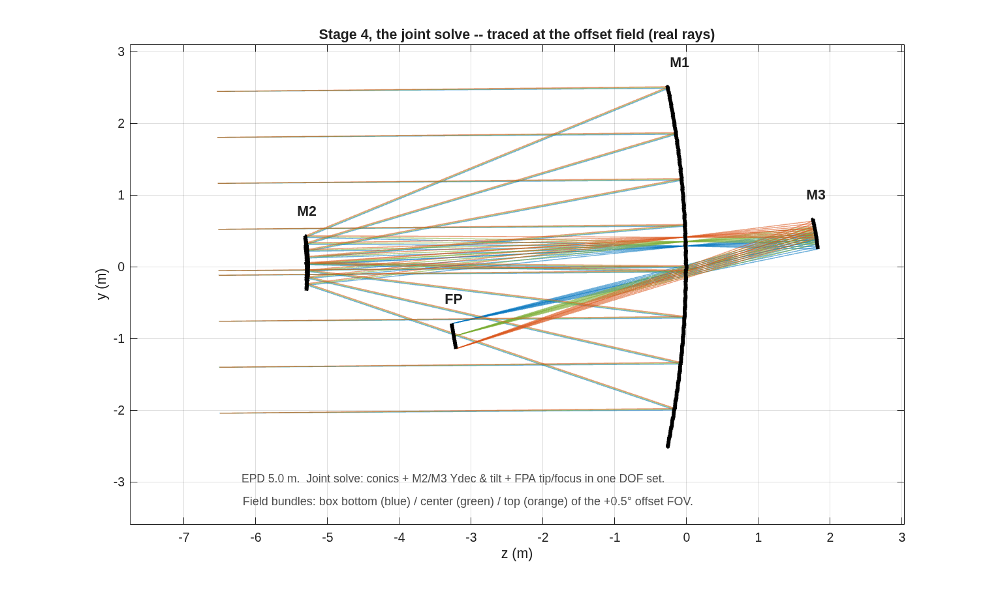{h=2.5}
~ Box max / avg, nm, at the .seq configuration.  Piston + per-field tip/tilt removed = a centroid-referenced sphere (a chief-referenced sphere leaves the tilt in).  Full record: design/rodgers1 — packet with 10 addenda, every retraction in place.

## Challenge 2: a 30× afocal feeding an instrument through a tilted cold stop | Reproduced, then extended: the pupil measured, the trade priced, the package cleared
::: left
- **The challenge:** a three-mirror afocal, 30×, 1 m aperture, a 0.5°×0.5° field offset 0.6° — feeding an instrument through a tilted cold stop, with the pupil quality left unmeasured by the source.
- **The pursuit:** transcribe and audit the delivered sequences, decode the reporting reference, reproduce all four variants — then extend where the source stopped: measure the pupil, price the fourth mirror, clear the package.
- **Achieved:** all four variants inside 0.95–1.02×; the reported 28.7× magnification measures 28.686×; the computed exit pupil falls 0.8 mm from the stop placed by hand in the source deck.

| variant | CODE V | MACOS / CODE V |
| on-axis | ≤ 15 nm | 0.99× |
| offset, frozen design | ≤ 430 nm | 1.01× |
| offset, re-solved | ≤ 160 nm | 0.95× |
| offset, tilt/dec | ≤ 119 nm | 1.02× |
::: right
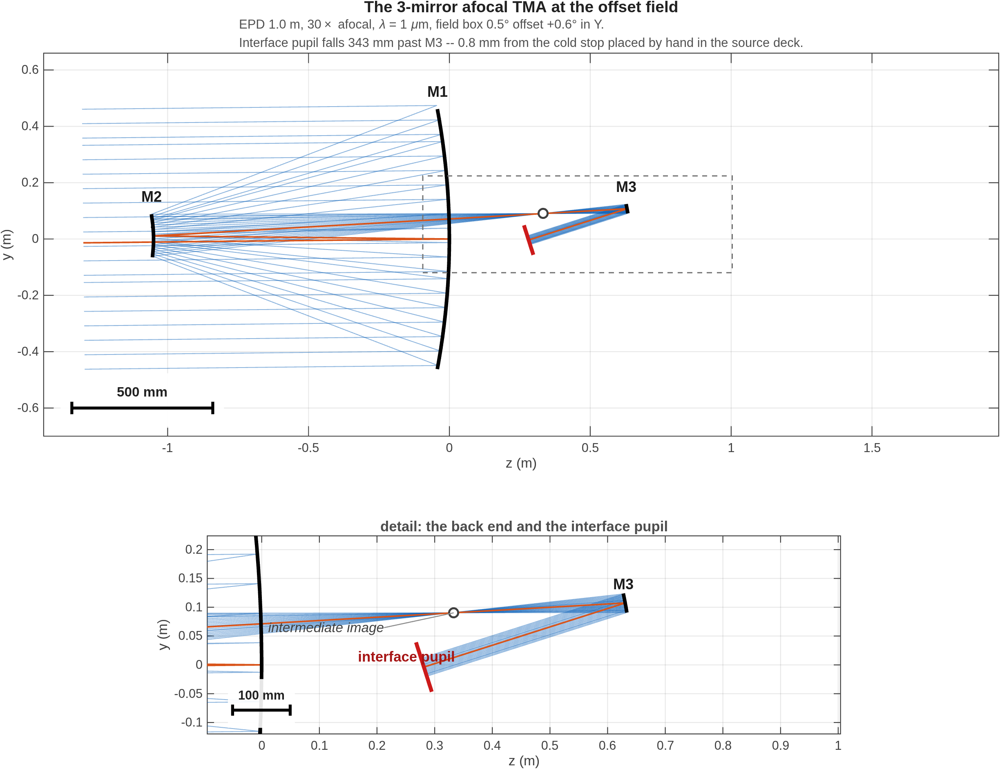{h=3.3}
~ The source's own pupil verdict — "with 3 mirrors, the pupil quality is not very good" — carries no metric; MACOS defines and measures one: next slide.  Audit rigor: the coordinate break lands the cold stop on the traced beam to 2×10⁻⁷ mm, where the wrong sign convention misses by 211–247 mm.  Full record: design/rodgers2.

## Challenge 2, extended: the pupil measured — and what a fourth mirror buys | Pupil blur 469 → 157 µm; the exchange costs image quality a factor 39
::: left
| metric | 3 mirrors | + 4th mirror |
| pupil blur | 469 µm | 157 µm |
| footprint wander on the cold stop | 557 µm | 161 µm |
| magnification variation | ±3.6% | 0.12% |
| wavefront error — the price paid | 119 nm | 10.4 µm |
- **The two qualities pull opposite ways:** the fourth mirror's power serves the pupil and costs the image — a factor-39 exchange.  Declining the power (a flat fourth mirror) keeps 266 nm and the three-mirror pupil.
- **The trade, constrained:** with the last mirror held behind the primary, the solutions split into two families; pupil distances under 220 mm leave no room for an instrument after the fold — 343 mm admits a 464 mm diameter.
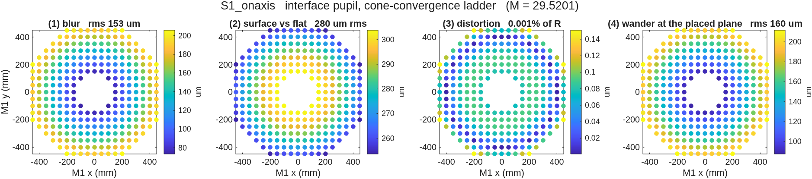{h=1.35}
::: right
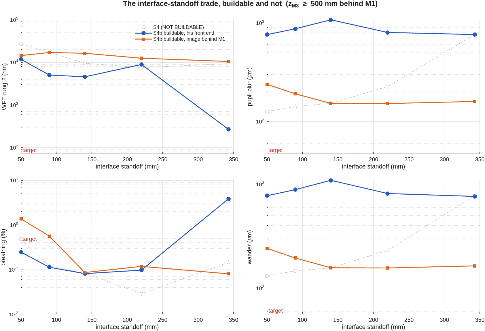{h=2.6}
~ Yardsticks: pupil imaging resolves 2.7 µm across the 33 mm pupil, depth of focus ~30 µm — the measured defects sit 50–350× above these floors.  Per-point trade table: the design/rodgers2 record.  Buildability re-prices this trade — next slide.

## Challenge 2: packaging — and the defect no fold could fix | The collimator stood in its own feed beam by −80 mm; a −10° extraction tilt clears it at +38 mm — wavefront 14% better
::: full
{h=3.1}
- **Why no single-field trace shows it, and no fold fixes it:** each field's feed beam clears the glass its own light uses by 10–27 mm — the collision is with the glass the *other* fields need, and one monolithic mirror must carry them all.  Body and beam unions are scaled copies of the same field box (separation needs a 2.43× scale ratio; measured 1.30), and a fold is an isometry: the best flat placement anywhere reproduces −79.9 mm to the last digit.
- **The fix is optical, and priced:** tilt the field mirror −10° and re-solve around it.  Clears at +37.8 mm with zero rays lost; wavefront 8993 vs 10407 nm; the interface holds (30.015×, 33.57 mm exit beam).  It packages itself — deepest optic 1.81× → 1.24× the M1–M2 spacing, zero fold flats.  The price is the fourth mirror's pupil control: blur 157 → 553 µm, breathing 0.12 → 0.82% — still 4× steadier than three mirrors.
~ The union check is now a standing gate: fails the committed deck, passes the cleared one — a margin is a number, not a body.  Three-way layouts: backup.  Record: challenges/afocal4/{packaging,clearing}.

## A second live demonstration: the AI drives an interferometer | A polarization Twyman–Green gauging a deformable mirror — armed in a terminal now, run on the room's cue
::: left
- **Why a Twyman–Green for a DM:** it is the Michelson topology fed with collimated light — both arms end on mirrors, so the DM takes one arm whole, at normal incidence, double pass (height counts twice), with a natural null against the reference flat.  A Mach–Zehnder has no natural seat for a mirror — its isolated arms and two ports serve dynamics and transmission, not figure.
- **Phase shifting, nothing moving in the interferometer:** the arms carry orthogonal polarizations; a quarter-wave plate makes them opposite circular; the analyzer angle θ writes fringe phase 2θ.  The analyzer sits in the recombined beam, where its motion adds only common phase — or is a pixelated camera (0/45/90/135° per 2×2 tile): all four steps in one snapshot.
- **Cube against plate:** the plate rig's diattenuation rotates one arm 7.5° and the gauge reads 11.7% high; the MacNeille cube parks each arm on a coating eigenaxis.  Both are built — the cube runs today.
::: right

```
$ claude                      % a fresh AI session, in the terminal

> Let's run the IFO demo.  Runbook is demo_session/RUNBOOK_ifo_demo.md
  — arm it and wait for my cue.

  Armed — v2, eight beats, beat 1 computed and waiting.  Say the word.

> tell us about the next step ...          > run it
  BUILD → LAYOUT → COATING → NULL → POKE → SWEEP → RECOVER → CALIBRATE
  (~45 s of compute across the run — the rest is conversation)
```
~ The dialog is the demonstration: the AI narrates each beat, runs it on the cue, pastes the real output, and answers the room's questions from the live session — figures open on the desktop as they draw.  Every beat has a committed fallback figure.
::: full
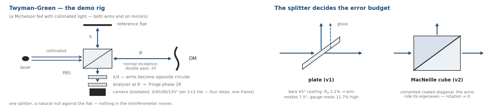{h=2.5}

## Recap: the interferometer, built and calibrated in the model | The plate rig's 11.7% error, caught and fixed — then designed out by a real MacNeille cube
::: left
- **The rig:** a polarizing Twyman–Green with a 16×16-actuator deformable mirror as the test optic — polarizers, waveplates, splitter and coatings are engine surfaces, not a Jones model appended after the trace.  Two builds: the v1 plate rig, and a v2 with a real cemented MacNeille cube — one coated 45° interface (engine vs textbook thin-film at 10⁻¹⁰; R+T = 1.000000000000 measured).
- **v1's catch:** splitter diattenuation rotates the test arm 7.5° from orthogonal — the gauge reads 11.7% high while fringe contrast moves 0.17% (a 69× blind spot); fixed by re-clocking one waveplate 3.77°, solved in 5 traces.
- **v2 designs the error out:** each arm rides a coating eigenaxis, where a diattenuator cannot rotate it — and the error budget inverts: a waveplate error now costs visible contrast instead of invisible scale.

| | plate (v1) | MacNeille cube (v2) |
| arm rotation from orthogonal | 7.479° | 5×10⁻⁶ ° |
| PSI scale gain | 1.117 | 0.999999 |
| alignment solve | +3.768° | none needed |
| delivered power | 0.169 | 0.384 (2.27×) |
| DM closure residual | 0.304 nm | 0.183 nm |
::: right
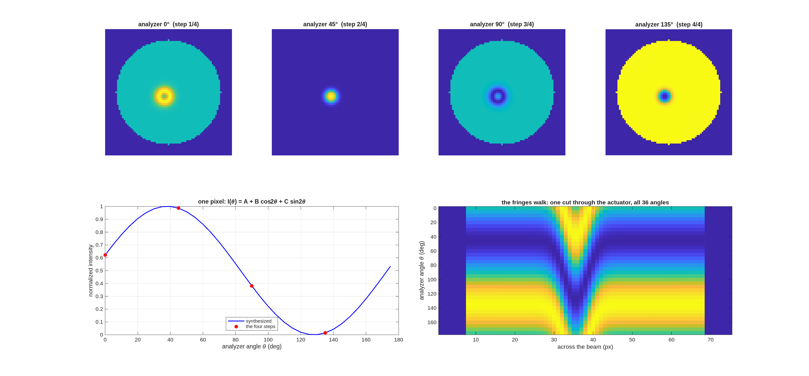{h=2.0}
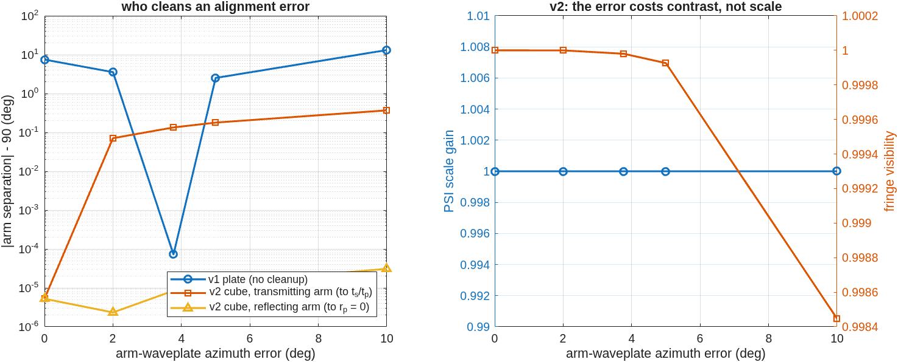{h=1.85}
~ Records: templates/90_polarization/tg_psi_dm (v1) + tg_psi_dm_v2 (the demo rig); 18 regression checks across the pair.  A PBS converts an invisible systematic into a visible one — a better reason to buy one than throughput.

## Recap: the measurement the room just watched | Eight beats, ~45 s of compute — 0.18 nm rms residual on 6.35 nm of figure
::: left
- **The eight beats, replayed:** build (the design condition hands back a dense flint, n = 1.6555 — why real polarizing cubes are not BK7) → layout → coating (R+T = 1.000000000000 measured; one termination choice moves R_p from 4×10⁻¹² to 2.1%) → null → poke → sweep → recover → calibrate.
- **The numbers that landed:** the null reads 73 pm with nothing aligned; the poked actuator recovers 146 nm against 150 injected — the bullseye's own half-fringe arithmetic; the full map lands 6.26 nm against 6.35 truth, 0.183 nm rms residual.
- **The calibration question:** gain 0.9912 ± 0.0020, linear to 0.00% — almost nothing to calibrate, and the two correlations say where the leftover error lives.
::: right
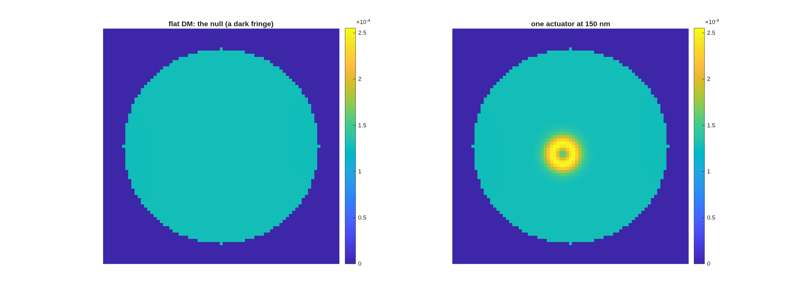{h=2.15}
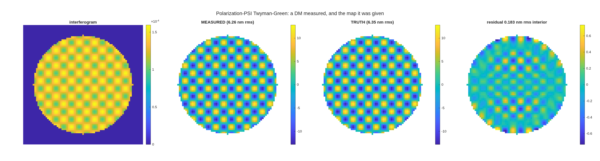{h=2.35}
~ Every number above is printed by the run itself; the sweep costs 36 frames and zero ray traces.  Both rigs run the same demo (v1 49.8 s, v2 47.0 s wall) — the committed beat figures stand in if a live beat stalls.

## A coronagraph testbed, end to end | Six mask families from the literature, scored on one footing — validated against PROPER station by station
::: left
- The full testbed model — off-axis parabolas, focal-plane masks, Lyot stop, two 32×32-actuator deformable mirrors — every mask generated at 8× sub-pixel resolution and binned to the model grid.
- **Validated externally:** a pure-PROPER run reads only the exported planes — no macos anywhere — and reproduces the bare image at correlation 1.000000, forming the same dark zone.

| mask (static, no control) | dark-zone mean | throughput |
| apodized-pupil Lyot (prolate) | 2.1×10⁻¹⁰ | 27% |
| vortex, matched Lyot | 1.4×10⁻⁸ | 81% |
| band-limited (4th order) | 2.7×10⁻⁸ | 36% |
| hard occulter | 2.5×10⁻⁷ | 25% |
| Roddier π-mask | 2.4×10⁻⁶ | 81% |
::: right
{h=1.6}
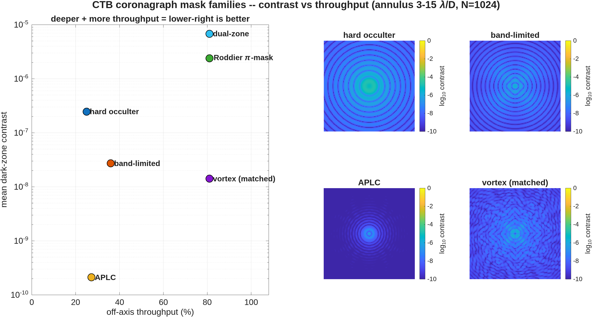{h=2.75}
~ Dark zone 3–15 λ/D, one grid, one normalization throughout; every mask formula taken from its source paper.  Record: templates/30_instruments/bench_ctb.

## The vortex against the Lyot stop | Charge 4 under-runs every fixed design at every throughput: 8.8×10⁻¹¹ at the band-limited mask's own 36%
::: left
- One mask, one dial: the vortex phase is fixed; only the Lyot stop fraction moves — a genuine depth-for-throughput dial, where each fixed design is a single point.
- **Readings from the curve:** at the apodized-pupil Lyot's operating point, charge 4 is deeper (8.8×10⁻¹¹ vs 2.1×10⁻¹⁰) at more throughput (36% vs 27%) — with no apodizer to fabricate.  At 81% throughput it still holds 8.0×10⁻⁹.
- Charge 4 runs ~4× deeper than charge 6 at every stop; the useful dial range is 0.50–0.90 — past 0.90 the rejected-starlight ring arrives inside the stop.
::: right
{h=3.5}
~ Same grid, annulus and normalization as the head-to-head; fixed-design markers read from the committed comparison, not re-scored.

## The mirrors close the loop | On the vortex chain: 1.7×10⁻⁸ → 6.8×10⁻¹⁵ — nothing left that the mirrors cannot remove
::: left
- **The control matrix is measured, not modeled:** every actuator poked and propagated through the full masked chain, so the correction solve has no model error to exploit; each iteration re-propagates and scores the measured contrast.
- **Two chains, two kinds of floor:** the hard occulter stops at 3.8×10⁻⁹ — physics, occulter-edge diffraction the mirrors cannot represent; the charge-4 vortex chain reaches 6.8×10⁻¹⁵ at half-nanometer strokes — the model's own double-precision floor.
- **The physics layers, measured:** the coated train's polarization floor rides flat at 1.1×10⁻¹⁵ at every bandwidth (a state change, not an aberration); the chromatic floor grows gently when control sampling matches the band — 8×10⁻¹³ mono to 5.4×10⁻¹¹ at a 20% band.
- **The vector-vortex verdict:** the zero-order plate's retardance leak is uncorrectable by any mirror but optically removable — a circular polarizer sandwich returns to the scalar floor under per-λ control; a crossed-linear sandwich goes decades deeper on the star, at the price of eight planet blind spots.
::: right
{h=2.35}
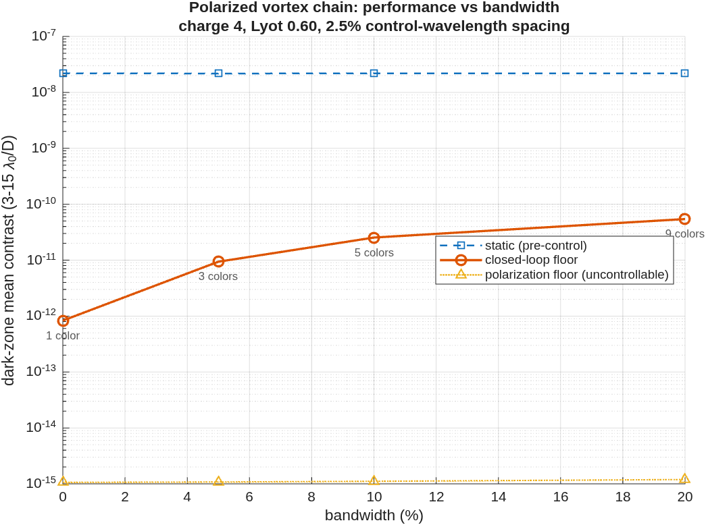{h=2.2}
~ 6.8×10⁻¹⁵ = dark-zone mean 3–15 λ/D, Strehl-normalized, monochromatic, noiseless sensing — the numerical floor of the noiseless model, not a hardware prediction.  Next layer of realism: camera-based sensing (pairwise probing), then FALCO driving the same DMs.

## From the testbed to an observatory | The proven coronagraph modeling, carried onto a telescope designed for it
::: full
- **The testbed is where the models are built and proven; the same modeling then builds the flight-like system:** an unobscured 6 m telescope from the design-layer templates — imaging leg and coronagraph leg, with the same DMs, apodizer, focal-plane mask and Lyot machinery — the telescope packaged to an 8 m launch shroud.
- **The coronagraph bench still needs packaging work:** the body-in-beam gate built for challenge 2, run on this train, finds the bench nicking the M1–M2 beam and the DM pocket's folded legs overlapping.  In the days ahead: the gate joins the template's standing checks; the bench clocks and drops out of the trunk beam by re-posing its pickoff fold — an optical null; the pocket's fold angles open with a small re-solve, priced in wavefront; the train re-verifies end to end.
::: left
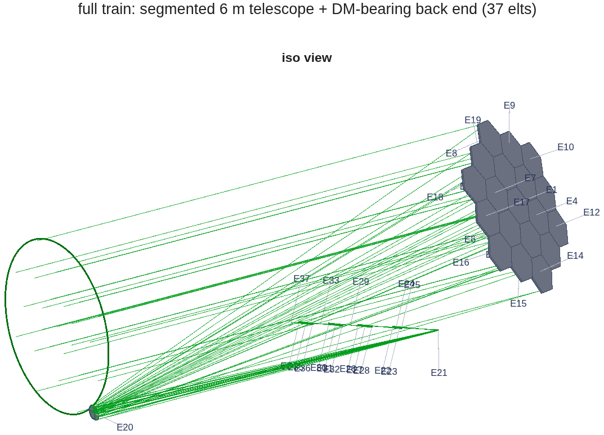{h=3.0}
~ The telescope is diffraction-limited at 500 nm (imaging-leg Strehl 0.9993).  Record: templates/80_end_to_end/e2e6m_r2.
::: right
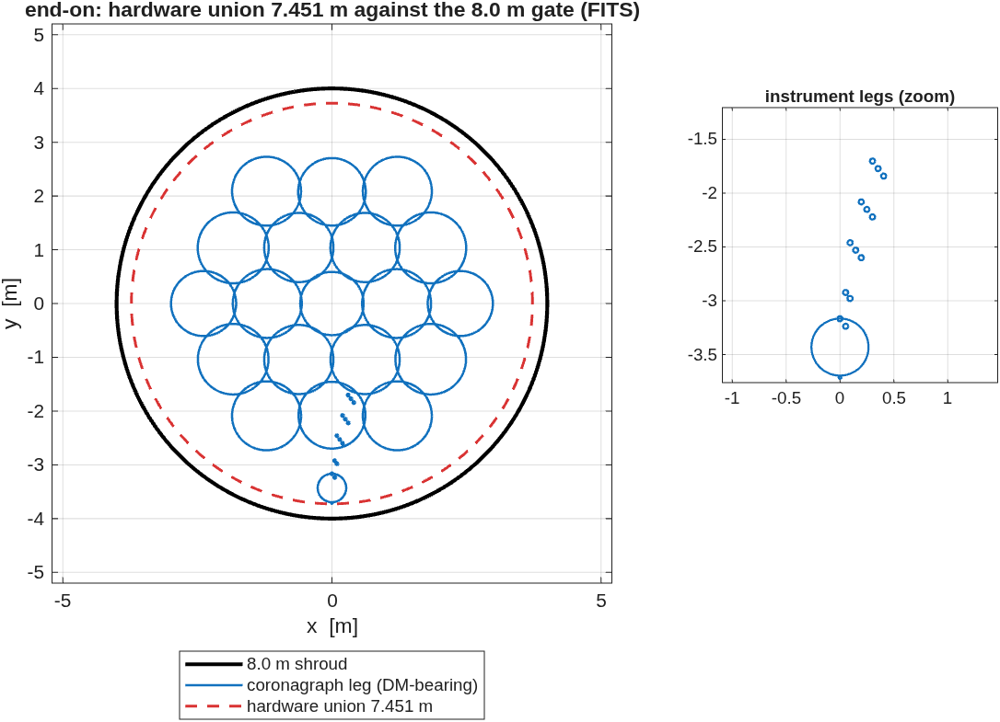{h=3.1}

## The linear model: the mathematics under the next six slides | Every matrix is measured from the engine, then closure-checked against it
::: full
- **The wavefront model:**   w  =  w₀ + J·x,    J = [ ∂w/∂x   ∂w/∂z   ∂w/∂grid ]
-- x stacks rigid-body states (6 DOF per optic and per group), segment Zernike figure modes, and grid/actuator influences; J's columns are engine-measured pokes through the full train, per field — the three families on the next three slides.
- **The metrology forward model:**   m  =  [ ∂l/∂x ; ∂e/∂x ]·x + n
-- laser-gauge lengths l and edge-sensor gaps e; a sensor layout is scored by the control information it carries — minimize trace( J Px̂ Jᵀ ), the wavefront error the estimator leaves behind.
- **Estimation and control:**   x̂  =  ( HᵀWH + ρI )⁻¹ HᵀW·m ;    u  ←  u − g·x̂
-- BLUE: weighted least squares with a ridge on the segment state; an integrator closes the rigid-body loop each frame.
- **Dark-hole control (EFC):**   Δa  =  −( Re(GᴴG) + λI )⁻¹ Re(GᴴE)
-- G = ∂E/∂a, the electric-field Jacobian of the DM actuators through the masked chain, engine-measured; a Tikhonov step, line-searched against measured contrast.
~ Notation as in the code: run_sensitivities builds the J families; the MET stage scores layouts on the trace merit; the simulator (r4) runs the BLUE estimator, the integrator, and the EFC step — and jacobian_check re-pokes the engine against every J before it is trusted.

## Segmentation, metrology, controls — on the observatory | The same segmentation and metrology machinery the smaller studies proved, at 6 m scale
::: left
- The primary segments hex-19 with physical apertures through the same segmentation product; every segment gets rigid-body and surface-figure sensitivity channels, stacked into one Jacobian — the control basis.
- Metrology and edge sensors are designed ON that Jacobian — 114 beams from the launcher stations shown — and the same matrices drive the estimator and the closed loop.
- **The channels themselves — dw/dx, dw/dz, dw/dgrid — follow on the next three slides, at readable size.**
::: right
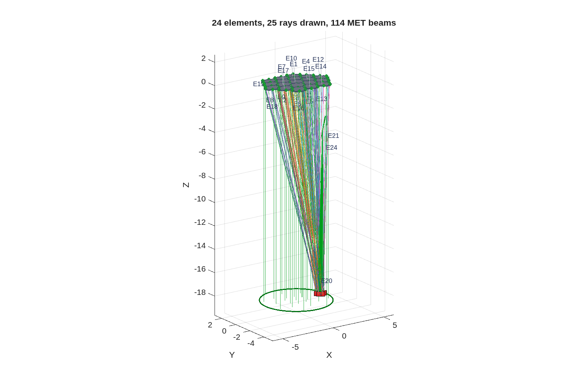{h=4.9}
~ Record: templates/80_end_to_end/e2e6m_r2, sensitivities + MET stages.

## The control basis I: rigid-body channels — dw/dx | Runner: macos.dw_dx_multi, harvested by run_sensitivities (stage r3) — OPD at the coronagraph exit pupil per unit rigid-body motion
::: full
{h=3.6}
- **Six rigid-body DOFs for every optic** — the 19 segments, M2-M4, both DMs, the 8 OAPs — plus the whole primary as one rigid group, five fields each, stacked into the control Jacobian.  The response lives on the moved segment's footprint and walks with field.  The coronagraph works the center field only — its stops vignette the corners; the imaging leg sees the full box.
~ Harvest on r1_seg_prop.in, the deck the simulator propagates; per-field FEX reset; closure gated by jacobian_check.  Every panel is one line from the saved Jacobian: OPD = v2m(dwdx(:,k), indx).  Record: templates/80_end_to_end/e2e6m_r2.

## The control basis II: segment-figure channels — dw/dz | Runner: macos.dw_dz_zernike_multi, harvested by run_sensitivities (stage r3) — MonZernike modes 4–11 on each segment
::: full
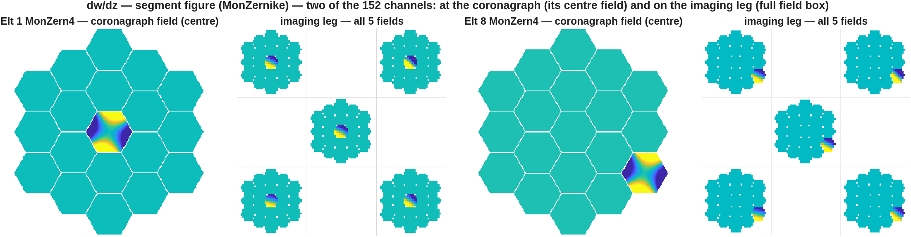{h=3.6}
- **Zernike figure modes 4–11** on each of the 19 segments, M2-M4, the 8 OAPs — five fields each.  Each channel is confined to its own segment; the mode shape is visible at a glance.
- Any element can have deformations described by up to 65 Zernike modes.
- MACOS supports 4 types of Zernikes, in normalized or raw forms.
~ Same harvest, metric and gates as dw/dx.  Record: templates/80_end_to_end/e2e6m_r2.

## The control basis III: shape-normalized modes — dw/dgrid | Runner: macos.dw_dgrid_multi, harvested by run_sensitivities (stage r3) — the grid influence basis on each segment
::: full
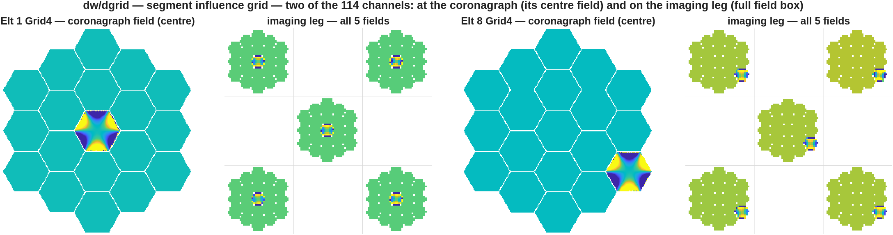{h=3.6}
- **GridData surfaces can be used to add nearly any surface departure form:** as-measured aberrations, Gram-Schmidt orthogonalized Zernike modes, and DM actuations are all used in coronagraphic telescope models.
- These plots illustrate grid-basis influence shapes on 2 of the 19 segments, using the interface for measured influence functions and actuator maps — the same machinery the DM Jacobians use.
~ Same harvest, metric and gates as dw/dx.  Record: templates/80_end_to_end/e2e6m_r2.

## A randomly disturbed observatory, simulated | The closed loop holds dark-zone contrast at 2.5×10⁻⁷ where the uncontrolled series drifts to 1.7×10⁻⁶
::: left
- Random segment drift is injected; the rigid-body loop senses through the designed metrology, estimates and corrects, while EFC re-solves the dark zone per scored frame — all on one model.
- **The disturbance interface is the point:** the same channels are built to ingest dynamical- and thermal-model time histories — simulating performance in the space environment.  Work in progress.
- Honest gap, attributed: the segmented-pupil contrast floor sits above the clear-pupil testbed's — the gaps and edges carry it, not the control.
::: right
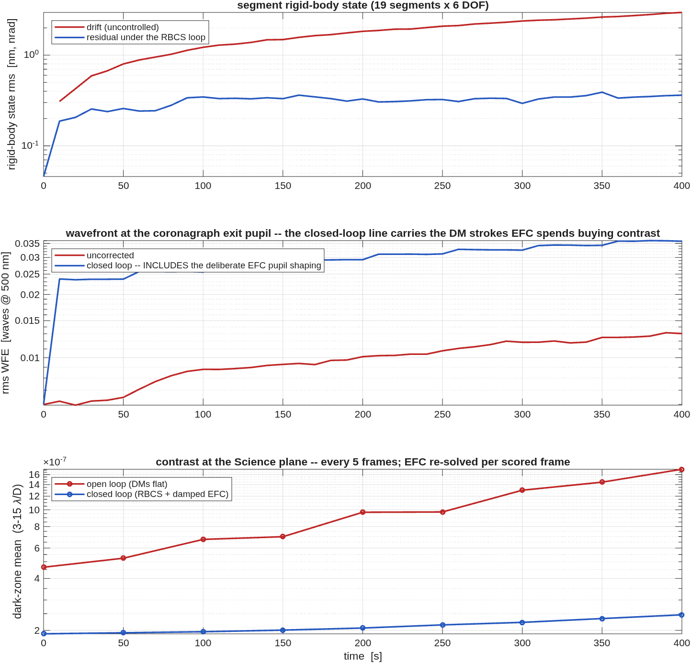{h=5.0}
~ Record: templates/80_end_to_end/e2e6m_r2, time-series stage.

## The live design, revealed | Predicted from the frontier before solving; solved in one warm-started step while we talked
::: left
- **The ask:** a field-box width, anywhere in 5–15°.  **The prediction, stated before the solve:** interpolated from the committed frontier rows.
- **The pre-run rehearsal of the default ask (12°):** predicted 33.7 nm; solved 33.6 nm — 1.00× — at a 24.9 mm clearance floor, both checks pass, in 15 minutes.
- The run is deterministic to every printed digit, and every ask is a genuine continuation step — never a re-score of a stored design.
::: right
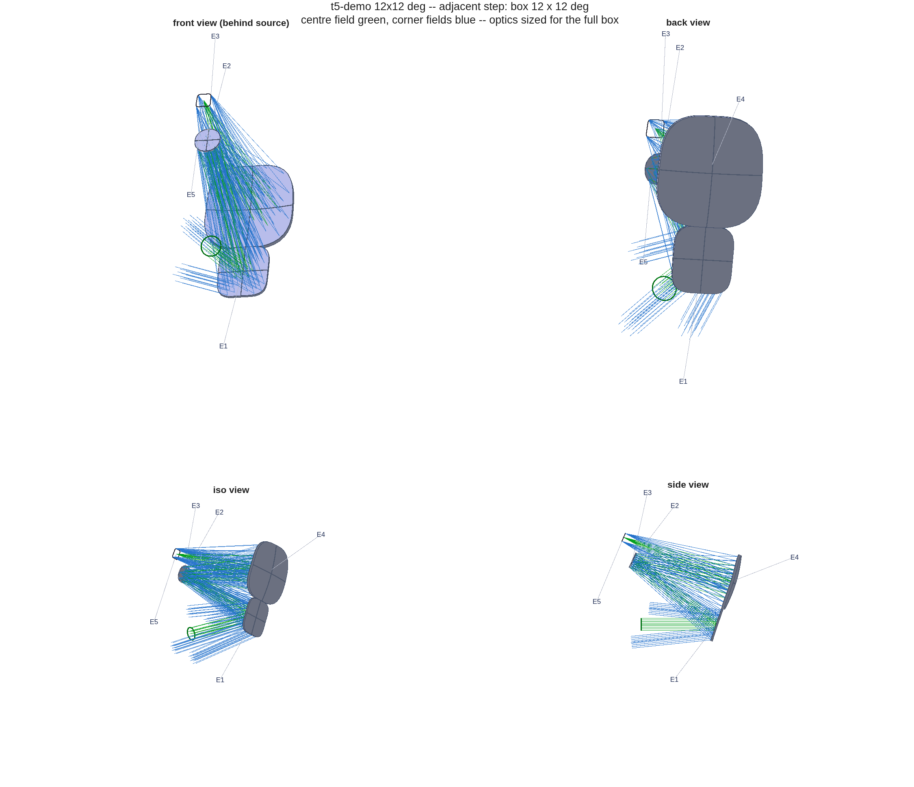{h=2.5}
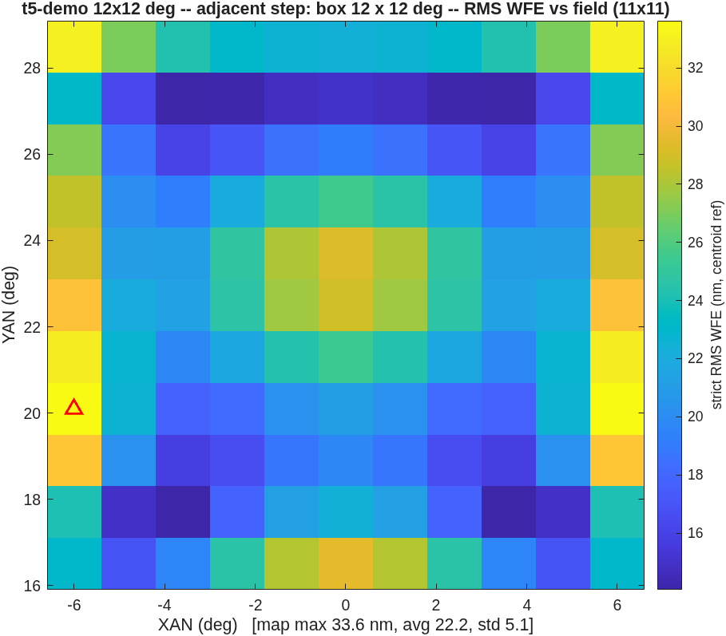{h=2.2}
~ On demo day the live run's figures replace these panels; this pre-generated bundle is the fallback if the room's ask matches nothing better.

## AI in design and analysis — the working questions | What we ask of an AI-driven study before believing it
::: full
- How is a result verified when the designer is a machine?  Here: regression checks with negative controls, layout figures read against every claim, and corrected signed measures — the checks caught the errors shown today.
- Where does the human rule?  Constraint choices, metric definitions, and every outward claim carry a human sign-off; the AI proposes, the record decides.
- Is it reproducible?  Every number in this deck rebuilds from committed scripts and committed records — including the design solved during this talk.
~ These are offered as discussion questions, not settled doctrine.

## Summary | One engine, validated; a toolbox that designs; an AI that drives it — all public
::: full
- One validated engine behind four language surfaces; a MATLAB design layer that took three CODE V benchmark studies from reproduction to extension.
- Two things happened live: a telescope designed to the audience's field specification in one warm-started step, and a polarization interferometer measuring a deformable mirror to 0.18 nm.
- The code is public: github.com/nasa-jpl/macos.
~ Contact and records: all studies cited are committed with packets and regression checks.

## Backup Slides

## What MACOS does today | System-level modeling from design through control
::: full
- **Applications:** error budgeting, integrated observatory simulation, wavefront sensing and control for segmented telescopes, coronagraph testbeds and instruments.
- **The linear-model workflow:** w = J·x + w₀ — wavefront sensitivity channels per element, per segment, per surface mode; stacked over fields and configurations; element groups move as one.
- **From model to control:** the same sensitivity matrices drive metrology design, estimator synthesis, and closed-loop simulation — one model, one bookkeeping, design to control.
~ Every capability shown today is in the committed test suites; validation anchors: next slide.

## The MATLAB toolbox and the design layer | Design → segmentation → sensitivities → metrology → simulation, each one call — fully public-domain
::: left
- **Drivers:** telescope/bench design builders, sensitivity supervisors (rigid-body, alignment, surface-grid), metrology placement, model-vs-model comparison, closed-loop simulators, study orchestrators.
- **One-call reconstructible studies:** every figure in this deck rebuilds from a committed script and committed records.
::: right
- **Utilities:** trace, wavefront, perturb, pupil find; layout and ray-bundle viewers; Jones pupils, polarization elements; segment grid bases and grid file IO; multi-wavelength composition; spot, intensity, complex field.
- **Why a design layer:** the whole stack is public-domain — a design study needs no proprietary prescription to start from.
~ The two live demonstrations exercised exactly these layers: the bench builder and a design-family driver.

## Validation anchors | The trust base, by physics domain
::: full
| domain | reference | agreement |
| geometric ray trace | CODE V comparison suite | 6,601 tests |
| physical optics | PROPER propagation library | 10⁻¹¹–10⁻¹³ well-sampled; 10⁻⁸–10⁻⁵ sampling-limited / post-focus |
| polarization | Born & Wolf / Abelès closed forms | 10⁻¹²–10⁻¹⁴ |
| polarization, lab | published protected-Al Mueller data | ~10⁻¹⁴ vs the model |
| build integrity | two compilers, one tree | bit-identical |
- The non-vacuity rule: every regression check is shown to fail against the pre-fix engine before it counts as protection.
~ Suites run per commit; counts as of 2026-08.

## The adjacent-design rehearsal bundle | Three widths, pre-run end to end at the demo settings
::: full
| ask | warm start | predicted | solved | clearance floor | checks | wall time |
| 7°×7° | 5° step | 18.0 nm | 20.0 nm (1.11×) | 93.8 mm | pass | 15.2 min |
| 12°×12° | 11° step | 33.7 nm | 33.6 nm (1.00×) | 24.9 mm | pass | 15.2 min |
| 14°×14° | 13° step | 54.9 nm | 51.2 nm (0.93×) | 24.9 mm | pass | 15.2 min |
- A repeat 12° run reproduces the bundle to every printed digit — the demonstration is deterministic.
- Wide asks pass: the committed frontier line understates the envelope (its widest rows stopped early on a wavefront-only criterion while the clearance penalty was still improving).
~ Bundle: templates/10_telescopes/offset_imager/demo_adjacent — figures, verdict text, prescriptions, run records.

## Challenge 2 packaging, three ways | The committed deck, the retired four-flat recipe, and the cleared tilt — engine truth on one scale
::: full
{h=3.4}
~ Committed: deepest optic 1.887 m = 1.81× the spacing, the feed beam through the collimator by −79.9 mm.  Four-flat recipe: 0.893 m deep, but a fold is an isometry — the interference rides across — and it does not close on the cleared deck (96 routes, every admissible one loses rays).  Cleared −10°: 1.287 m = 1.24×, zero flats, +37.8 mm of daylight.  Record: challenges/afocal4/{packaging,clearing}.

## Interferometer demonstration backups | One committed image per live beat
::: full
{h=2.2}
{h=2.2}
{h=2.2}
~ All eight beats have committed figures in templates/90_polarization/tg_psi_dm_v2 (v1 likewise); the driver opens them on the desktop as each beat runs.

## The e2e worked example: specification to design | A 4 m f/18 visible-band telescope from a closed-form seed — no starting prescription
::: left
- **The stage-runner sequence on the smaller worked example:** specification → design → segmentation → metrology → comparison → simulation, each stage a committed runner handing its prescription to the next.
- A 4 m f/18 telescope (f/1.75 primary) from a closed-form first-order seed; diffraction-limited over ±1′ alone, and the Offner ring-field relay buys the full ±2′ (Strehl floor 0.965, on pure spheres).
::: right
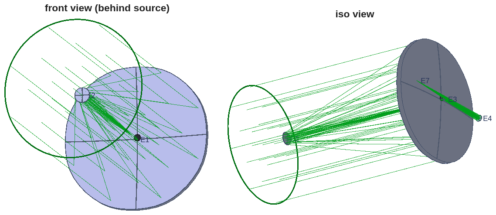{h=2.5}
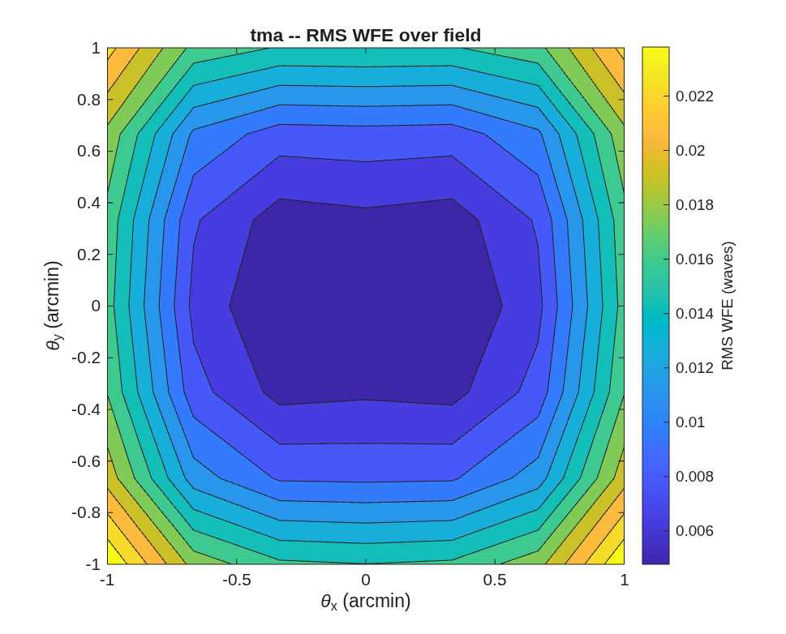{h=2.2}
~ Record: templates/80_end_to_end/e2e — staged worked example, committed at every step.

## The e2e worked example: segmentation and metrology | The monolith segments in one call; the metrology is designed on the same Jacobian
::: left
- The primary segments into a pie or hex tiling with physical apertures; every segment gets rigid-body and surface-figure sensitivity channels, stacked into one Jacobian — the control basis.
- Metrology is an optimization on that basis: edge-sensor and beam-launcher layouts scored by the control information they carry, not by symmetry; the winning pattern exports as a reusable preset.
::: right
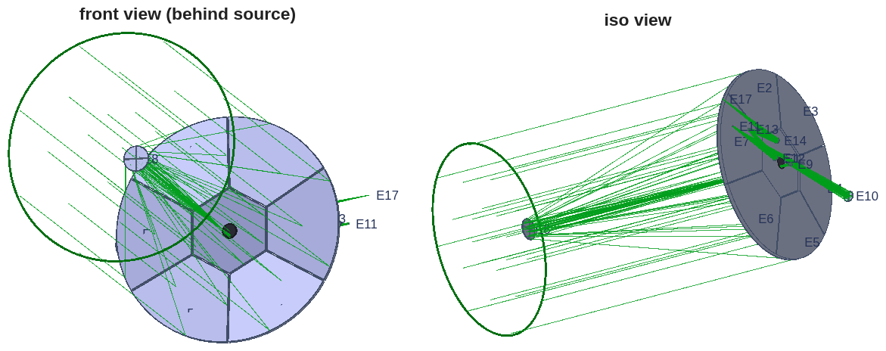{h=2.4}
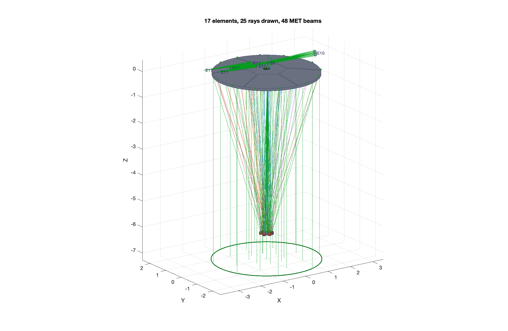{h=2.3}
~ Record: templates/80_end_to_end/e2e, stages 3–5.

## The e2e worked example: comparison and simulation | Segment drift of 10⁵ nm rms is sensed and held at ~7 nm corrected
::: full
- **Every linear model is checked against the engine before it is trusted:** step each channel, re-trace, render engine and model side by side (left).  **Then the simulator closes the loop on the same model:** inject drift, sense with the designed metrology, estimate, correct (right).
::: left
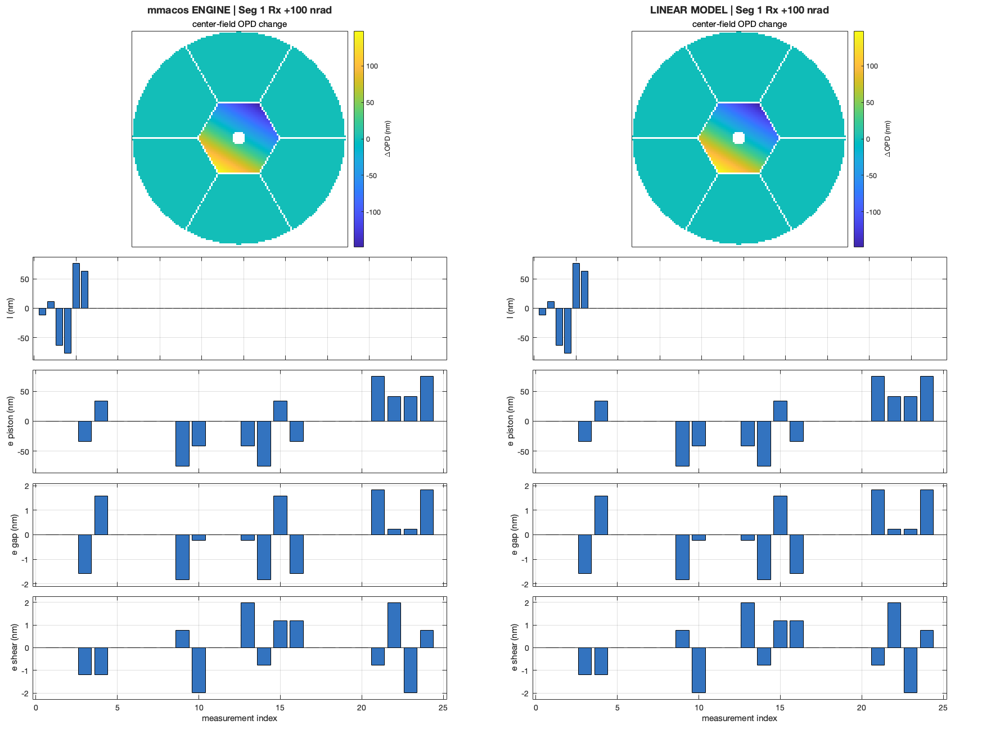{h=3.4}
::: right
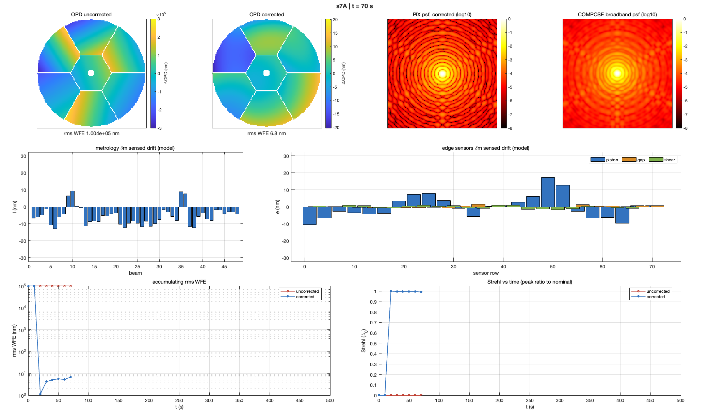{h=3.4}
~ Record: templates/80_end_to_end/e2e, comparison + simulator stages (s6/s7).
