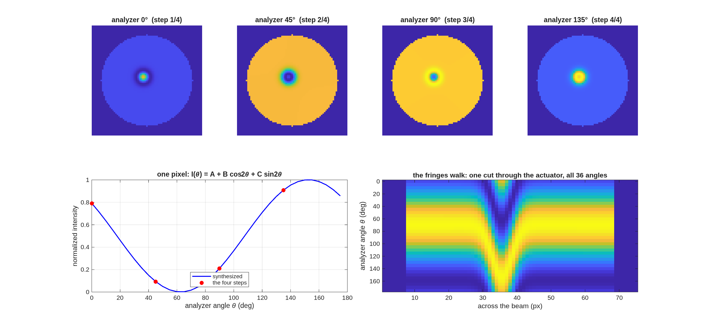
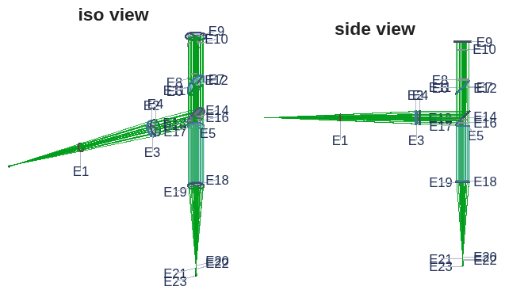
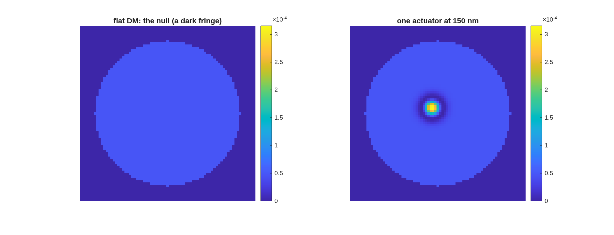
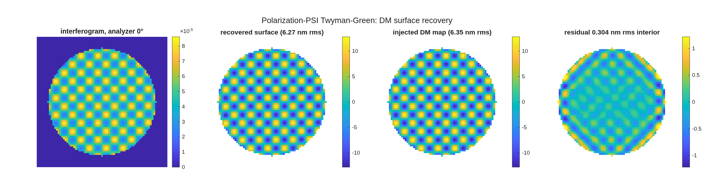
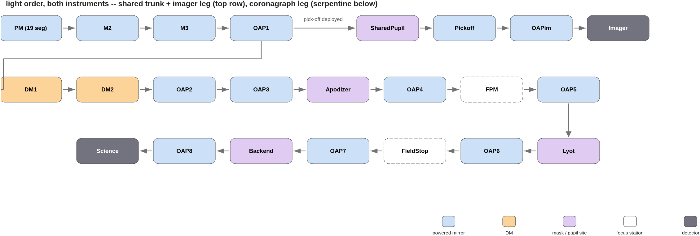
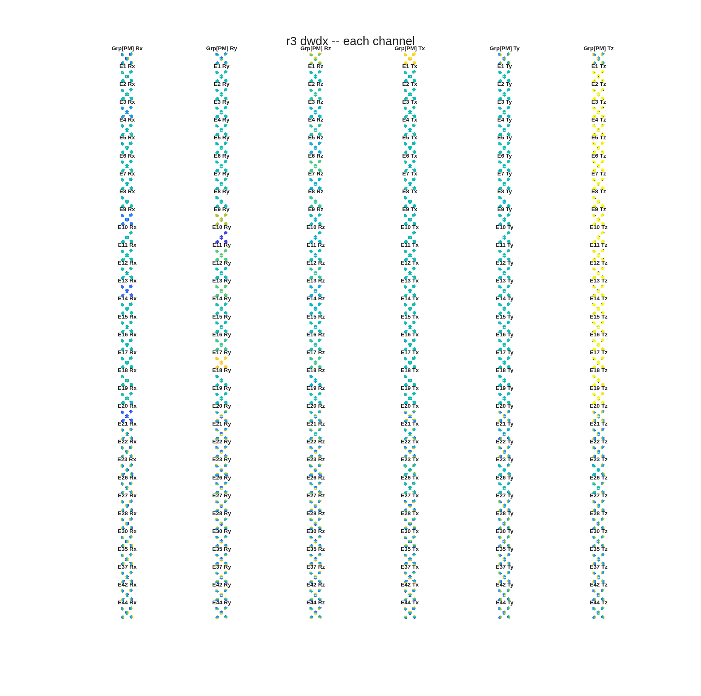

<!-- Keysight/CodeV demo deck — DRAFT source (Dave edits here; rebuild:
     python3 make_brief_slides.py deck_keysight.md   (the LOCAL copy —
     it applies the geometry sidecar; the MACOS_sandbox/slides copy is
     synced from here)
     Layout: deck_keysight.geo.json carries Dave's manual pptx
     repositioning (pass 2) and is applied at every rebuild — recover
     future pptx edits with pptx_text_diff.py (text) + pptx_geo_diff.py
     (geometry, vs baseline_pass2.pptx), fold them into the md/sidecar.
     Render altered slides after every rebuild (standing rule, Dave 2026-08-29):
     soffice --headless --convert-to pdf deck_keysight.pptx --outdir renders/
     pdftoppm -png -f <first> -l <last> -r 100 renders/deck_keysight.pdf renders/v<N>
     (bump the v<N> tag every round — stale-image trap).
     Slide-3 ecosystem figure: make_ecosystem_fig.py (pymacos venv python).
     Cropped figures (crop_*.png): crop_figs.py — white-trim only, never content.
     Figures are symlinks in figs/ to committed artifacts — never regenerated.
     Order per Dave 2026-08-29 pm: intro, C3-first Rodgers arc (kickoff slide 8),
     C1/C2, IFO block (principle + rig + live), modeling-sequence trio, CTB,
     e2e6m, REVEAL, discussion, summary; capability + anchors in backup.
     Sources: deck_rodgers_status.md (r1/r2), challenges/rodgers3 records (r3),
     tg_psi_dm README + BRIEF_tg_demo.md foot (IFO), e2e s6/s7A frames,
     BRIEF_r3_adjacent_demo.md delivery log, bench_ctb / e2e6m_r2 reports. -->

# MACOS — Optical Modeling, Analysis and Design, with an AI in the Loop
One ray-trace and physical-optics engine, four language surfaces, an AI-driven design layer — with two elements run live
D. C. Redding, with Claude Code — 1 September 2026.  Prepared for the Keysight CODE V team.  DRAFT — pending source sign-off.
~ Live elements: a telescope designed during the talk to an audience-chosen field specification (asked and launched once challenge 3 is on the table, revealed before the closing discussion), and a polarization phase-shifting interferometer measuring a deformable mirror.  All wavefront numbers are RMS wavefront error; each study states its reference convention where it reports.

## Four decades of NASA optical modeling | Technology development to flight: Hubble, JWST, TMT
::: full
- **Late 1980s:** the engine originates in NASA telescope technology development
-- ***Used for Star Wars control-system development and NASA SubMM telescope analysis.***
- **1991:** Hubble — prescription recovery correctly diagnosed the aberration from flight imagery
-- ***Prescription retrieval from image data has served other missions as well.***
- **JWST:** integrated observatory modeling and wavefront sensing and control development
-- ***Testbeds validated the models, and the validated models proved the space system.***
- **TMT, Keck and many space missions:** Observatory modeling, including segmented-aperture systems, testbeds, instrument studies.
-- ***Validated against testbed and flight data across those programs.***
- **We are now modernizing and extending the capabilities of our modeling to meet new challenges.**
-- ***New elements: Freeforms with aberrations, polarizers, complex masks and apodizers, completely general surfaces added through the API***
-- ***The same functionality, streamlined: linear model generation, simulation, multi-path, metrology and edge sensors***
-- ***New capabilities: design layer***
-- ***Code cleanup: improved robustness, automated testing, updating documentation***

## One engine, four surfaces | The same Fortran core answers a terminal, a library call, MATLAB, and Python
::: full
{h=3.7}
- **Physics lives in the engine: a capability added there is everywhere at once**
- **One shared library layer serves the MATLAB and Python toolboxes.**
- **The prescription generators and the CODE V converter feed the same Rx language.**
- **CODE V and PROPER provide independent cross-checks.**
- **One source tree: github nasa-jpl/macos and /MACOS_resources contain it all.**

## Inside the toolbox | Five areas, organized the way the work flows — veneer, sensitivities, design, runners, worked examples
::: full
{h=4.7}
~ Counts as of 2026-08.  Every area is exercised by the committed test suites and by the worked examples beside it — the same templates this talk's studies live in.  Rebuild the figure: make_mmacos_fig.py.

## Three design challenges, one method | CODE V benchmark studies reproduced first, then extended
::: full
| | challenge 1 (July) | challenge 2 (August) | challenge 3 (August) |
| the task, as posed | a three-mirror telescope, f/20, 5 m aperture: a 0.2°×0.2° field box offset 0.5° off axis | a three-mirror afocal telescope, 30×, 1 m aperture: a 0.5°×0.5° field offset 0.6°, a tilted cold stop the interface to the instrument | a three-mirror imager, f/4, 75 mm aperture: a 20°×20° field box centered 22° off axis, exit beam horizontal, hard beam–mirror clearances |
| the ladder, in steps | on-axis → offset, frozen → re-solved → tilt/decenter | on-axis → offset, frozen → re-solved → tilt/decenter | on-axis → offset, frozen → re-solved → + clearance constraints → + Zernike freedom |
| reported ladder (max RMS WFE) | 2 → 375 → 92 → 40 nm | 15 → 430 → 160 → 119 nm | 159 → 8810 → 168 → 117 → 53 nm |
| reproduction | 0.83–1.11× | 0.95–1.02× | 0.99–1.10× (all five steps) |
| the feature it proved | the field widened without freeforms — joint optics + focal-plane solves | pupil image quality, measured: metrics + the fourth-mirror trade | a super-wide-field imager family: the continuation walk + its frontier |
- Objective: meet the challenge, and use the solution to establish a design family. 
-- Build a solution code for each particular problem, using AI assistance.
-- Build another code to rapidly generate adjacent solutions, without AI assistance.
- Each challenge left a reusable template behind — the whole study re-runs at new parameters in one call.
- MACOS solves each problem with its own optimizer and the same degrees of freedom.
- MACOS separately re-traces the delivered prescriptions to compare design against design under one decoded metric.
- Challenges and solution prompts provided by Mike Rodgers (thanks Mike!).

## Challenge 3: moving a 20°×20° field 22° off axis | All five reported steps reproduce from the lens sequences before any extension is claimed
::: left
- The hardest of the three: a wide field box far off axis, an exit-beam pointing constraint, and hard clearance requirements between beam and mirrors.
- **Reproduction first:** all five reported design steps rebuild from the delivered lens sequences inside 0.8–1.25× — nothing tuned toward the reported numbers.
- **The study became a template:** one parameterized five-stage flow (solve on axis, map the offset, re-solve at the used field, add buildability constraints, add surface freedom) — re-running the whole study at new parameters is one call.
- **Every design passes the same gate sequence:**
-- 1 · traceability — every solve field reaches the detector (screened before solving)
-- 2 · map validity — all 121 dense-map fields present, none lost
-- 3 · exit-beam direction — the chief within tolerance of the horizontal pin
-- 4 · clearance — the signed beam–mirror floor at or above spec
-- 5 · score — strict RMS WFE against the reported ladder
-- pinned by regression checks with negative controls (the control reads 2989× the gate)
::: right
{h=3.0}
~ Record: challenges/rodgers3 — packet, per-step prescriptions, regression checks with negative controls.

## Challenge 3: the numbers | Paying the same constraints lands the same design space — then a diagnosis beats the reported result
::: full
- **The buildability step:** enforcing the reported ≥35 mm clearance lands 113.6 nm at a 34.1 mm floor, against the reported 117 nm — 0.97×, same design space.  **The final step, diagnosed then beaten:** the gap to the reported 53 nm was the solve-field count, not physics; matching it lands 45.4 nm — 0.86× — at a floor 1.6 mm shy of the stated 35 mm.
- An unconstrained solve reads 58.3 nm — with the beam passing through the secondary.  The layout figure caught it; clearance constraints are part of the problem statement.
::: left
{h=2.9}
::: right
{h=3.2}
~ Metric, stated once for this study: strict RMS WFE, reference sphere on the spot centroid on the frozen focal plane, anchored at the exit pupil, piston-only removal; headline = maximum of a dense 11×11 field map.

## From one design to a design family | Warm-started continuation solves what a cold start cannot
::: full
- **The cold start fails** (596 µm, most field points lose every ray); **the walk succeeds:** solve an easy 5° box, widen in steps, each warm-started from the last — 10.9 → 21.5 → 27.3 → 40.0 → 69.8 nm at 5/8/11/13/15°, 8531× better than the cold start.
- **The step table is the instrument's field-vs-packaging frontier:** every row a finished, checked design; the largest spec-compliant box is 11°×11° at 27.3 nm with a 25.1 mm clearance floor.
::: left
{h=3.4}
::: right
{h=3.3}
~ This frontier is the basis of the live demonstration — next slide.

## The live demonstration: an adjacent instrument, designed during this talk | Kicked off now, in MATLAB; predicted first, revealed before the closing discussion
::: left
- **The ask:** name a field-box full width, anywhere in 5–15°, for the same instrument class — 150 mm f/3.3 at the +22.5° offset, same envelope, same clearance rules.
- **What happens:** the frontier states the prediction first; one MATLAB call launches a full-freedom solve, warm-started from the nearest committed design below the ask, and it runs while the talk continues (~15 min).
- **No AI in this loop:** the design knowledge is compiled into the driver — this is the "adjacent solutions, without AI assistance" half of the objective, running live.
- **What the reveal shows:** the field map, the clearance floor and the exit-direction check, beside the stated prediction.  Every ask is a genuine continuation step, never a re-score of a stored design; a repeat run reproduces every printed digit.
::: right

```
$ matlab &                    % a fresh MATLAB, just for this solve

>> cd ~/dev/MACOS_resources/mmacos/templates/10_telescopes/offset_imager
>> OUT = oi_demo_step(12)     % <-- the room's width goes here (5-15 deg)

 warm start : committed walk step 3  (11 x 11 deg)
 predicted  : ~33.7 nm, ~24.8 mm floor  (frontier rows 11/13 deg)
 solving    : one full-freedom step ...  ~15 min

 ... at the reveal, the windows are already up; if needed:
>> oi_demo_show(OUT)          % live layout + WF map + fields
>> type(OUT.files.verdict)    % the verdict block
```
~ The literal demo-day sequence ($ = shell, >> = MATLAB); the rehearsal at 12° solved 33.6 nm against the ~33.7 prediction, and the 14° rehearsal beat its predict too.
~ In the mean time, continuing...

## Challenge 1: MACOS matches or beats the re-traced CODE V designs | Re-traced designs land 0.991–1.003× of reported; the MACOS solves score 0.97× design vs design
::: full
| design | centroid | (chief) | bestfoc + LS tilt | CODE V reported |
| S2 verbatim | 482.8 / 272.0 | (672.9 / 390.9) | 371.4 / 201.4 | 374.6 / 200.0 |
| S3 MACOS solve | 116.8 / 68.1 | (173.4 / 95.1) | 86.8 / 50.5 | 91.6 / 46.4 |
| S3 CODE V re-traced | 121.0 / 67.9 | (176.7 / 94.7) | 91.9 / 50.2 | 91.6 / 46.4 |
| S4 MACOS solve | 65.6 / 36.4 | (115.9 / 56.9) | 41.2 / 21.9 | 39.8 / 22.5 |
| S4 CODE V re-traced | 67.6 / 36.7 | (100.5 / 54.4) | 39.8 / 22.1 | 39.8 / 22.5 |
::: left
- **The metric decoded:** the reported map subtracts per-field best focus + least-squares tip/tilt; re-scoring the same traces under that convention (third column) lands the re-traced designs at 0.991× / 1.003× / 1.000× of the reported max.
- **Design vs design, the reproduction closes:** the MACOS solves score 0.97× of the re-traced CODE V designs at both stages; under the reported convention the S3 solve (86.8 nm) beats the reported 91.6.  Conics agree to 1.5×10⁻⁴, rigid-body DOFs land on the same compensation branch, all signs matching.
- **The study returned more than it consumed:** two engine defects found and fixed (a silently inert exit-pupil keyword; collimated sources tracing a pupil 5% oversize, hidden for decades), and the joint-solve doctrine — optics + focal-plane pose in one DOF set, never alternating.
::: right
{h=2.5}
~ Box max / avg, nm, at the .seq configuration; centroid reference primary, chief in parentheses.  Full record: design/rodgers1 — packet with 10 addenda, every retraction in place.

## Challenge 2: the 30× afocal telescope, reproduced | Parameters matched to the micron; all four design variants at 0.95–1.02×
::: left
- **Parameters matched:** the lens sequences transcribe verbatim with a full audit; the coordinate break lands the cold stop on the traced beam to 2×10⁻⁷ mm (the wrong sign convention misses by 211–247 mm on a 33 mm beam); the computed exit pupil falls 0.8 mm from the stop placed by hand in the source deck.
- **Performance matched:** all four design variants reproduce the reported wavefront numbers at the decoded reference; the reported 28.7× magnification of the frozen-offset variant measures 28.686×.

| variant | CODE V | MACOS / CODE V |
| on-axis | ≤ 15 nm | 0.99× |
| offset, frozen design | ≤ 430 nm | 1.01× |
| offset, re-solved | ≤ 160 nm | 0.95× |
| offset, tilt/dec | ≤ 119 nm | 1.02× |
::: right
{h=3.3}
~ The source deck reports wavefront error only; its pupil statement — "with 3 mirrors, the pupil quality is not very good" — has no metric.  MACOS defines and measures one: next slide.  Full record: design/rodgers2.

## Challenge 2, extended: the pupil measured — and what a fourth mirror buys | Pupil blur 469 → 157 µm; the exchange costs image quality a factor 39
::: left
| metric | 3 mirrors | + 4th mirror |
| pupil blur | 469 µm | 157 µm |
| footprint wander on the cold stop | 557 µm | 161 µm |
| magnification variation | ±3.6% | 0.12% |
| wavefront error — the price paid | 119 nm | 10.4 µm |
- **The two qualities pull opposite ways:** the fourth mirror's power serves the pupil and costs the image — a factor-39 exchange.  Declining the power (a flat fourth mirror) keeps 266 nm and the three-mirror pupil.
- **The trade, constrained:** with the last mirror held behind the primary, the solutions split into two families; pupil distances under 220 mm leave no room for an instrument after the fold — 343 mm admits a 464 mm diameter.
{h=1.35}
::: right
{h=2.6}
~ Yardsticks: pupil imaging resolves 2.7 µm across the 33 mm pupil, depth of focus ~30 µm — the measured defects sit 50–350× above these floors.  Per-point trade table: the design/rodgers2 record.  Packaging the 343 mm point: next slide.

## Challenge 2: packaging behind the primary | As committed, the deepest optic overhangs the M1–M2 span 1.81× — four folds bring it to 0.86×
::: full
{h=3.3}
- **The fix is real and priced:** zero rays lost, fold null asserted at 3×10⁻⁸ nm; costs stated, not smoothed — the new flats clear by +5.8 mm, are ~300 mm across and decentred 100–146 mm, and four 45° folds are an unopened polarization budget.
- **The measurement found what no fold can fix:** over the field box, the collimator stands in the union of its own feed beams — −55 mm against bare glass with no allowance at all.  A fold is an isometry and carries it across unchanged; the redesign is queued.
~ The recorded single-fold layout passed its gate on a 17.5-vs-15 mm margin while its flat clips the feed beam by −74 mm — a gate's margin is a number, not a body.  Record: challenges/afocal4/packaging.

## A Twyman–Green interferometer for measuring DM surfaces | Phase-shifting with no moving parts: the analyzer angle is the phase step
::: left
- **Why a Twyman–Green for a DM:** normal incidence (double pass, 2× sensitivity), a natural null against the flat reference, the fewest reference surfaces of any two-beam layout.  A Mach–Zehnder buys arm isolation, two ports and transmission testing — dynamics, not figure.
- **The polarization trick:** the two arms carry orthogonal polarizations, so they cannot interfere until projected; an output quarter-wave plate makes them opposite circular, and an analyzer at angle θ then writes fringe phase 2θ.
- **Four analyzer angles — 0 / 45 / 90 / 135° — are the four phase steps** of standard PSI, with nothing in the interferometer moving: the vibration immunity of polarization phase shifting.
- **The factor of two:** DM surface height h enters the optical path as 2h at normal incidence; the recovery closes against the injected map with exactly that factor.
::: right
{h=3.3}
~ Topology ruling and full physics: the template README, templates/90_polarization/tg_psi_dm.

## The interferometer, built and calibrated in the model | The plate rig's 11.7% error, caught and fixed — then designed out by a real MacNeille cube
::: left
- **The rig:** a polarizing Twyman–Green with a 16×16-actuator deformable mirror as the test optic — polarizers, waveplates, splitter and coatings are engine surfaces, not a Jones model appended after the trace.  Two builds: the v1 plate rig, and a v2 with a real cemented MacNeille cube — one coated 45° interface (engine vs textbook thin-film at 10⁻¹⁰; R+T = 1.000000000000 measured).
- **v1's catch:** splitter diattenuation rotates the test arm 7.5° from orthogonal — the gauge reads 11.7% high while fringe contrast moves 0.17% (a 69× blind spot); fixed by re-clocking one waveplate 3.77°, solved in 5 traces.
- **v2 designs the error out:** each arm rides a coating eigenaxis, where a diattenuator cannot rotate it — and the error budget inverts: a waveplate error now costs visible contrast instead of invisible scale.

| | plate (v1) | MacNeille cube (v2) |
| arm rotation from orthogonal | 7.479° | 5×10⁻⁶ ° |
| PSI scale gain | 1.117 | 0.999999 |
| alignment solve | +3.768° | none needed |
| delivered power | 0.169 | 0.384 (2.27×) |
| DM closure residual | 0.304 nm | 0.183 nm |
::: right
{h=2.0}
{h=1.85}
~ Records: templates/90_polarization/tg_psi_dm (v1, the rehearsed demo default) + tg_psi_dm_v2; 18 regression checks across the pair.  A PBS converts an invisible systematic into a visible one — a better reason to buy one than throughput.

## Live: measuring the deformable mirror | Seven steps, each seconds-fast — 0.30 nm rms residual on 6.35 nm of figure
::: left
- **The seven steps, from the MATLAB command line:** build the bench in one visible call → layout view → align (solve the waveplate re-clock, 7 traces) → null fringes (the analyzer basis, 6 traces) → poke one actuator live (3 traces) → sweep the analyzer, 36 frames with zero traces → full DM map, four-step PSI, closure.
- **What to watch:** the fringes bend exactly over the poked actuator; the sweep walks the fringes with the rig standing still; the recovered map lands beside the injected truth at 0.304 nm rms interior residual.
- **Nothing takes long enough to lose a room:** the longest step is ~5 s; the 36-frame sweep costs 0.036 s.
::: right
{h=2.15}
{h=2.35}
~ Timings measured, in the template README; every step has a pre-rendered backup image — a live hang costs ten seconds, not the demonstration.  Either rig runs the same seven steps (whole-demo v1 49.8 s, v2 47.0 s) — the rig choice is the presenter's.

## A coronagraph testbed, end to end | Six mask families from the literature, scored on one footing — validated against PROPER station by station
::: left
- The full testbed model — off-axis parabolas, focal-plane masks, Lyot stop, two 32×32-actuator deformable mirrors — every mask generated at 8× sub-pixel resolution and binned to the model grid.
- **Validated externally:** a pure-PROPER run reads only the exported planes — no macos anywhere — and reproduces the bare image at correlation 1.000000, forming the same dark zone.

| mask (static, no control) | dark-zone mean | throughput |
| apodized-pupil Lyot (prolate) | 2.1×10⁻¹⁰ | 27% |
| vortex, matched Lyot | 1.4×10⁻⁸ | 81% |
| band-limited (4th order) | 2.7×10⁻⁸ | 36% |
| hard occulter | 2.5×10⁻⁷ | 25% |
| Roddier π-mask | 2.4×10⁻⁶ | 81% |
::: right
{h=1.6}
{h=2.75}
~ Dark zone 3–15 λ/D, one grid, one normalization throughout; every mask formula taken from its source paper.  Record: templates/30_instruments/bench_ctb.

## The vortex against the Lyot stop | Charge 4 under-runs every fixed design at every throughput: 8.8×10⁻¹¹ at the band-limited mask's own 36%
::: left
- One mask, one dial: the vortex phase is fixed; only the Lyot stop fraction moves — a genuine depth-for-throughput dial, where each fixed design is a single point.
- **Readings from the curve:** at the apodized-pupil Lyot's operating point, charge 4 is deeper (8.8×10⁻¹¹ vs 2.1×10⁻¹⁰) at more throughput (36% vs 27%) — with no apodizer to fabricate.  At 81% throughput it still holds 8.0×10⁻⁹.
- Charge 4 runs ~4× deeper than charge 6 at every stop; the useful dial range is 0.50–0.90 — past 0.90 the rejected-starlight ring arrives inside the stop.
::: right
{h=3.5}
~ Same grid, annulus and normalization as the head-to-head; fixed-design markers read from the committed comparison, not re-scored.

## The mirrors close the loop | On the vortex chain: 1.7×10⁻⁸ → 6.8×10⁻¹⁵ — nothing left that the mirrors cannot remove
::: left
- **The control matrix is measured, not modeled:** every actuator poked and propagated through the full masked chain, so the correction solve has no model error to exploit; each iteration re-propagates and scores the measured contrast.
- **Two chains, two kinds of floor:** the hard occulter stops at 3.8×10⁻⁹ — physics, occulter-edge diffraction the mirrors cannot represent; the charge-4 vortex chain reaches 6.8×10⁻¹⁵ at half-nanometer strokes — the model's own double-precision floor.
- **The physics layers, measured:** the coated train's polarization floor rides flat at 1.1×10⁻¹⁵ at every bandwidth (a state change, not an aberration); the chromatic floor grows gently when control sampling matches the band — 8×10⁻¹³ mono to 5.4×10⁻¹¹ at a 20% band.
- **The vector-vortex verdict:** the zero-order plate's retardance leak is uncorrectable by any mirror but optically removable — a circular polarizer sandwich returns to the scalar floor under per-λ control; a crossed-linear sandwich goes decades deeper on the star, at the price of eight planet blind spots.
::: right
{h=2.35}
{h=2.2}
~ 6.8×10⁻¹⁵ = dark-zone mean 3–15 λ/D, Strehl-normalized, monochromatic, noiseless sensing — the numerical floor of the noiseless model, not a hardware prediction.  Next layer of realism: camera-based sensing (pairwise probing), then FALCO driving the same DMs.

## From the testbed to an observatory | The proven coronagraph modeling, carried onto a telescope designed for it
::: full
- **The testbed is where the models are built and proven; the same modeling then builds the flight-like system:** an unobscured 6 m telescope from the design-layer templates — imaging leg and coronagraph leg, with the same DMs, apodizer, focal-plane mask and Lyot machinery — packaged to an 8 m launch shroud, drawn and checked.
::: left
{h=1.9}
::: right
{h=2.9}
~ The telescope is one of the design-layer templates, diffraction-limited at 500 nm (imaging-leg Strehl 0.9993).  Record: templates/80_end_to_end/e2e6m_r2.

## Segmentation, metrology, controls — on the observatory | The same segmentation and metrology machinery the smaller studies proved, at 6 m scale
::: left
- The primary segments hex-19 with physical apertures through the same segmentation product; every segment gets rigid-body and surface-figure sensitivity channels, stacked into one Jacobian — the control basis.
- Metrology and edge sensors are designed ON that Jacobian — 114 beams from the launcher stations shown — and the same matrices drive the estimator and the closed loop.
::: right
{h=2.6}
{h=1.95}
~ Record: templates/80_end_to_end/e2e6m_r2, sensitivities + MET stages.

## A randomly disturbed observatory, simulated | The closed loop holds dark-zone contrast at 2.5×10⁻⁷ where the uncontrolled series drifts to 1.7×10⁻⁶
::: left
- Random segment drift is injected; the rigid-body loop senses through the designed metrology, estimates and corrects, while EFC re-solves the dark zone per scored frame — all on one model.
- **The disturbance interface is the point:** the same channels are built to ingest dynamical- and thermal-model time histories — simulating performance in the space environment.  Work in progress.
- Honest gap, attributed: the segmented-pupil contrast floor sits above the clear-pupil testbed's — the gaps and edges carry it, not the control.
::: right
{h=3.6}
~ Record: templates/80_end_to_end/e2e6m_r2, time-series stage.

## The live design, revealed | Predicted from the frontier before solving; solved in one warm-started step while we talked
::: left
- **The ask:** a field-box width, anywhere in 5–15°.  **The prediction, stated before the solve:** interpolated from the committed frontier rows.
- **The pre-run rehearsal of the default ask (12°):** predicted 33.7 nm; solved 33.6 nm — 1.00× — at a 24.9 mm clearance floor, both checks pass, in 15 minutes.
- The run is deterministic to every printed digit, and every ask is a genuine continuation step — never a re-score of a stored design.
::: right
{h=2.5}
{h=2.2}
~ On demo day the live run's figures replace these panels; this pre-generated bundle is the fallback if the room's ask matches nothing better.

## AI in design and analysis — the working questions | What we ask of an AI-driven study before believing it
::: full
- How is a result verified when the designer is a machine?  Here: regression checks with negative controls, layout figures read against every claim, and corrected signed measures — the checks caught the errors shown today.
- Where does the human rule?  Constraint choices, metric definitions, and every outward claim carry a human sign-off; the AI proposes, the record decides.
- Is it reproducible?  Every number in this deck rebuilds from committed scripts and committed records — including the design solved during this talk.
~ These are offered as discussion questions, not settled doctrine.

## Summary | One engine, validated; a toolbox that designs; an AI that drives it — all public
::: full
- One validated engine behind four language surfaces; a MATLAB design layer that took three CODE V benchmark studies from reproduction to extension.
- Two things happened live: a telescope designed to the audience's field specification in one warm-started step, and a polarization interferometer measuring a deformable mirror to 0.30 nm.
- The code is public: github.com/nasa-jpl/macos.
~ Contact and records: all studies cited are committed with packets and regression checks.

## Backup Slides

## What MACOS does today | System-level modeling from design through control
::: full
- **Applications:** error budgeting, integrated observatory simulation, wavefront sensing and control for segmented telescopes, coronagraph testbeds and instruments.
- **The linear-model workflow:** w = J·x + w₀ — wavefront sensitivity channels per element, per segment, per surface mode; stacked over fields and configurations; element groups move as one.
- **From model to control:** the same sensitivity matrices drive metrology design, estimator synthesis, and closed-loop simulation — one model, one bookkeeping, design to control.
~ Every capability shown today is in the committed test suites; validation anchors: next slide.

## The MATLAB toolbox and the design layer | Design → segmentation → sensitivities → metrology → simulation, each one call — fully public-domain
::: left
- **Drivers:** telescope/bench design builders, sensitivity supervisors (rigid-body, alignment, surface-grid), metrology placement, model-vs-model comparison, closed-loop simulators, study orchestrators.
- **One-call reconstructible studies:** every figure in this deck rebuilds from a committed script and committed records.
::: right
- **Utilities:** trace, wavefront, perturb, pupil find; layout and ray-bundle viewers; Jones pupils, polarization elements; segment grid bases and grid file IO; multi-wavelength composition; spot, intensity, complex field.
- **Why a design layer:** the whole stack is public-domain — a design study needs no proprietary prescription to start from.
~ The two live demonstrations exercised exactly these layers: the bench builder and a design-family driver.

## Validation anchors | The trust base, by physics domain
::: full
| domain | reference | agreement |
| geometric ray trace | CODE V comparison suite | 6,601 tests |
| physical optics | PROPER propagation library | 10⁻¹¹–10⁻¹³ well-sampled; 10⁻⁸–10⁻⁵ sampling-limited / post-focus |
| polarization | Born & Wolf / Abelès closed forms | 10⁻¹²–10⁻¹⁴ |
| polarization, lab | published protected-Al Mueller data | ~10⁻¹⁴ vs the model |
| build integrity | two compilers, one tree | bit-identical |
- The non-vacuity rule: every regression check is shown to fail against the pre-fix engine before it counts as protection.
~ Suites run per commit; counts as of 2026-08.

## The adjacent-design rehearsal bundle | Three widths, pre-run end to end at the demo settings
::: full
| ask | warm start | predicted | solved | clearance floor | checks | wall time |
| 7°×7° | 5° step | 18.0 nm | 20.0 nm (1.11×) | 93.8 mm | pass | 15.2 min |
| 12°×12° | 11° step | 33.7 nm | 33.6 nm (1.00×) | 24.9 mm | pass | 15.2 min |
| 14°×14° | 13° step | 54.9 nm | 51.2 nm (0.93×) | 24.9 mm | pass | 15.2 min |
- A repeat 12° run reproduces the bundle to every printed digit — the demonstration is deterministic.
- Wide asks pass: the committed frontier line understates the envelope (its widest rows stopped early on a wavefront-only criterion while the clearance penalty was still improving).
~ Bundle: templates/10_telescopes/offset_imager/demo_adjacent — figures, verdict text, prescriptions, run records.

## Interferometer demonstration backups | One pre-rendered image per live step
::: full
{h=2.2}
{h=2.2}
{h=2.2}
~ All seven steps have backups in templates/90_polarization/tg_psi_dm.

## The e2e worked example: specification to design | A 4 m f/18 visible-band telescope from a closed-form seed — no starting prescription
::: left
- **The stage-runner sequence on the smaller worked example:** specification → design → segmentation → metrology → comparison → simulation, each stage a committed runner handing its prescription to the next.
- A 4 m f/18 telescope (f/1.75 primary) from a closed-form first-order seed; diffraction-limited over ±1′ alone, and the Offner ring-field relay buys the full ±2′ (Strehl floor 0.965, on pure spheres).
::: right
{h=2.5}
{h=2.2}
~ Record: templates/80_end_to_end/e2e — staged worked example, committed at every step.

## The e2e worked example: segmentation and metrology | The monolith segments in one call; the metrology is designed on the same Jacobian
::: left
- The primary segments into a pie or hex tiling with physical apertures; every segment gets rigid-body and surface-figure sensitivity channels, stacked into one Jacobian — the control basis.
- Metrology is an optimization on that basis: edge-sensor and beam-launcher layouts scored by the control information they carry, not by symmetry; the winning pattern exports as a reusable preset.
::: right
{h=2.4}
{h=2.3}
~ Record: templates/80_end_to_end/e2e, stages 3–5.

## The e2e worked example: comparison and simulation | Segment drift of 10⁵ nm rms is sensed and held at ~7 nm corrected
::: full
- **Every linear model is checked against the engine before it is trusted:** step each channel, re-trace, render engine and model side by side (left).  **Then the simulator closes the loop on the same model:** inject drift, sense with the designed metrology, estimate, correct (right).
::: left
{h=3.4}
::: right
{h=3.4}
~ Record: templates/80_end_to_end/e2e, comparison + simulator stages (s6/s7).
