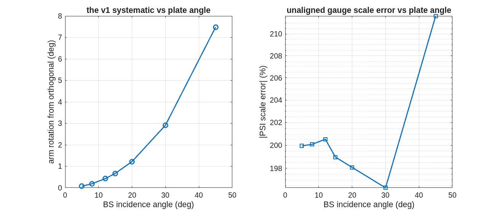
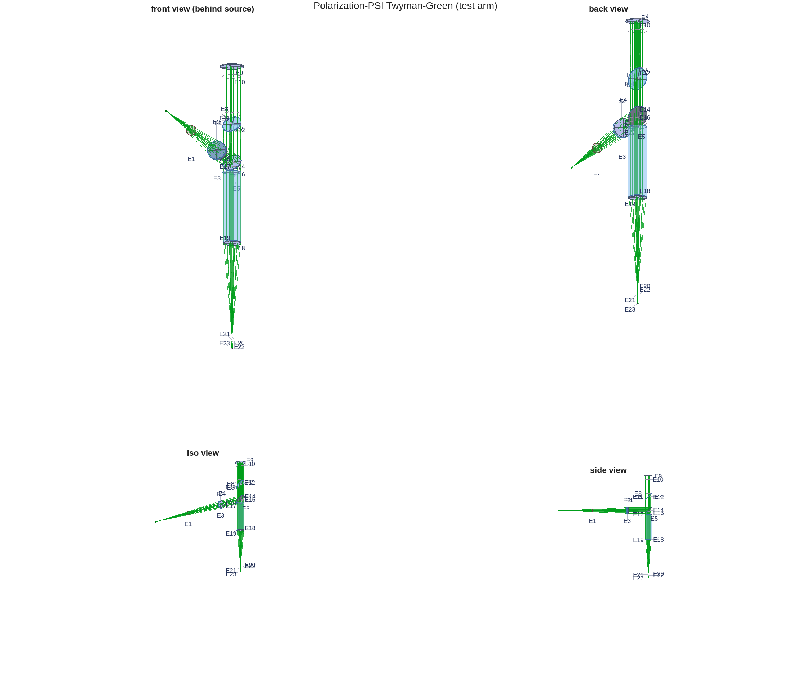
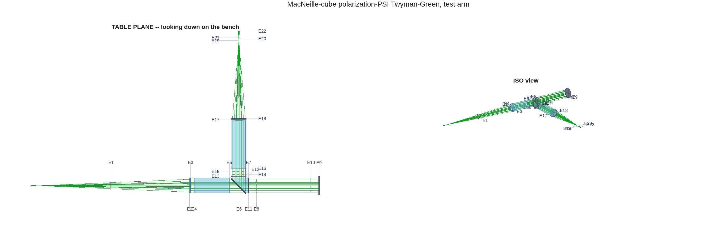
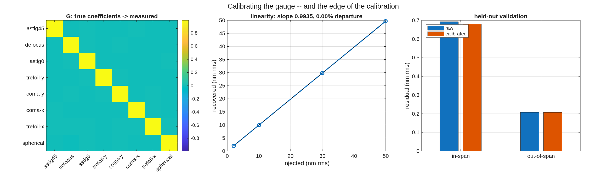
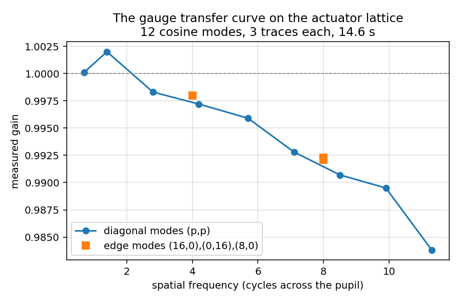

<!--
deck_tg_fang.md — DM surface gauge (polarization PSI Twyman–Green) for
Fang Shi.  DRAFT — pending Dave's sign-off; NO export marking until
reviewed.  Build: python3 make_brief_slides.py deck_tg_fang.md
Recast 2026-09-03 (Dave): options-first with decision table, then cube
details; first-order cost at 50/75/100 mm CA added.
Sources: templates/90_polarization/tg_psi_dm (v1) + tg_psi_dm_v2 (v2),
tg_aoi_ladder (option 3), tTgPol/tTgPol2 gates, 2026-09-02 live-demo
record, tg_widen rerun.  Cost slide = scaling estimates, vendor quotes
pending (footnoted).
-->

# A deformable-mirror surface gauge, modeled end to end
A polarization phase-shifting Twyman–Green in MACOS: three splitter options priced, the idealized gauge closed at 0.18 nm, and calibration taken to the actuator scale
D. C. Redding, with Claude Code.
September 2026.  Prepared for Fang Shi.
DRAFT — pending review.

## The instrument: a Twyman–Green, phase-stepped by polarization | The test optic is a mirror, so the Michelson topology gives it a whole arm at normal incidence
::: left
- **Why a Twyman–Green for a DM:** both arms end on mirrors, so the DM takes one arm whole, at normal incidence, double pass — height counts twice — with a natural null against the reference flat.  A Mach–Zehnder has no natural seat for a mirror: its isolated arms and two ports serve dynamics and transmission, not figure.
- **Phase shifting with nothing moving in the interferometer:** the arms carry orthogonal polarizations (polarizer and quarter-wave plates in the collimated legs); the analyzer angle θ writes fringe phase 2θ.  The analyzer sits in the recombined beam — or is a pixelated camera (0/45/90/135° per 2×2 tile): all four steps in one snapshot.
- **The one design decision left is the splitter.**  Three options follow, priced on the same model.
::: right
{h=3.2}
~ Test optic: a 16×16-actuator deformable mirror, influence-function surface model, HeNe 632.8 nm.  In every option the polarizing elements sit in the arms; the splitter differs.

## The three splitter options | One architecture, three splitters — the plate's incidence angle and the cube are the levers
::: left
- **Option 1 — plate at 45°:** the compact classic.  The plate's unequal s/p transmission rotates one arm's polarization 7.48° from orthogonal; the gauge reads 11.7% high until a one-waveplate alignment (+3.77°, solved in 5 traces) restores it.
- **Option 2 — MacNeille cube:** a real cemented polarizing cube.  Each arm rides a coating eigenaxis, so the rotation is structurally absent (5×10⁻⁶ °); no alignment, 2.27× the light — at a glass cost that grows steeply with aperture.
- **Option 3 — plate at a shallow angle (the VSG2 layout's ~10–15°):** the same plate architecture with the diattenuation attacked at its source — s/p asymmetry vanishes toward normal incidence.  Measured on the model: rotation 7.48° → 0.43° and scale error 11.7% → ~0.5% at 12°, with no alignment step.  The price is geometry: the arms separate at twice the incidence angle, so the bench stretches.
::: right
{h=2.5}
~ Ladder measured at 45/30/20/15/12/8/5°, design azimuths, unaligned; the 45° rung reproduces the committed v1 numbers exactly.  Sub-1% residuals at shallow angles carry rig-geometry effects at this fidelity — noted, not yet decomposed.

## The decision table | The cube buys its error budget with glass; the shallow plate buys most of it with bench length
::: full
| | plate 45° (v1) | plate ~12° (option 3) | MacNeille cube (v2) |
| arm rotation, unaligned | 7.479° | 0.426° | 5×10⁻⁶ ° |
| scale error, unaligned | 11.7% | ~0.5% | 1×10⁻⁴ % |
| alignment required | one waveplate, +3.768° | none at the 1% level | none |
| waveplate-error character | invisible scale | invisible scale, 18× attenuated | visible contrast, scale pinned |
| delivered power (fraction) | 0.169 | plate-class | 0.384 (2.27×) |
| hardware | plate + compensator | plate + compensator + ~2×CA of separation length per fold | cemented cube, CA³ glass |
| aperture cost scaling | CA² area | CA² area | CA³ mass + 1/CA homogeneity spec |
| full 16×16 closure measured | 0.304 nm rms | not yet run | 0.183 nm rms |
- **Reading:** option 1 needs the alignment solve or carries an invisible 11.7% systematic.  Option 3 removes ~95% of the systematic with geometry alone and keeps plate-class cost — the natural choice at large aperture.  Option 2 removes it structurally and converts residual waveplate errors from invisible scale to visible contrast — the best instrument, at a cost that grows as the cube of aperture.
~ All entries from committed runs (v1 example, v2 example, tg_aoi_ladder); "plate-class" and the closure gap are marked where not yet measured.

## First-order cost with clear aperture | The cube's glass grows as CA³ and its homogeneity spec tightens as 1/CA; plates grow as CA²
::: full
| clear aperture | 50 mm | 75 mm | 100 mm |
| cube: glass volume / mass (flint, ~3.5 g/cc) | 125 cm³ / ~0.4 kg | 420 cm³ / ~1.5 kg | 1000 cm³ / ~3.5 kg |
| cube: transmitted glass path | 50 mm | 75 mm | 100 mm |
| cube: index homogeneity for λ/20 transmitted WFE | Δn ≤ 6×10⁻⁷ | Δn ≤ 4×10⁻⁷ | Δn ≤ 3×10⁻⁷ |
| cube: coated + cemented hypotenuse area | 35 cm² | 80 cm² | 141 cm² |
| cube: availability class | top of catalog (2-inch) | custom | custom |
| plate + compensator: glass volume / mass (silica) | ~50 cm³ / ~0.11 kg | ~140 cm³ / ~0.3 kg | ~340 cm³ / ~0.75 kg |
| plate: transmitted glass path (2 substrates) | ~17 mm | ~25 mm | ~34 mm |
| plate: availability class | catalog | catalog | semi-custom flat |
- **The crossover argument:** below ~50 mm the cube is a catalog part and its error budget comes nearly free.  Above it, the cube is custom glass whose mass grows as CA³ and whose transmitted-wavefront homogeneity requirement passes beyond standard melt grades near 100 mm — while the shallow plate holds catalog-class cost and, from the ladder, gives up only ~0.4° of arm rotation.
~ Scaling estimates for planning: masses from geometry and nominal densities; homogeneity from Δn·L ≤ λ/20 at 633 nm; availability classes from current catalog size limits.  Vendor quotes are the real numbers — none are quoted here.

## Why the plate needs its alignment: the invisible error, caught in the model | Splitter diattenuation reads as 11.7% of scale while fringe contrast moves 0.17%
::: left
- **The finding (option 1, as designed):** the waveplate azimuths should leave the arms orthogonal at ∓45°.  Measured: reference exactly +45.0000°, test −37.52°.  The gauge's scale reads 11.7% high.
- **The mechanism:** every non-normal surface between polarizer and recombination transmits s and p unequally, and unequal transmission rotates a linear state.  The reference arm's waveplate cancels the rotation before it against the one after; the test arm's adds them.  Nothing downstream repairs it — a waveplate is lossless and cannot restore orthogonality.
- **Why it is dangerous on a bench:** contrast moves 0.17% while scale moves 11.7% — a 69× blind spot.  Every field phase in the model was exact throughout; the error lived entirely in the measurement.  On hardware this calibrates out only if you know to look for it.
::: right
{h=2.6}
~ The same mechanism, attenuated 18×, is what remains of option 3 at 12°; the cube removes it structurally.

## The cube in detail: real MacNeille physics, engine against textbook | One coated 45° interface; the design condition hands back a dense flint
::: left
- **A real cube, not bookkeeping:** a ZnS/cryolite quarter-wave stack on the cemented diagonal.  The MacNeille condition fixes the prism glass: n = 1.6555 — the model reproduces why real polarizing cubes are not BK7.
- **Engine against textbook:** coating reflectances match the thin-film reference calculation at the 10⁻¹⁰ level; R+T = 1.000000000000 measured across the two arm models; polarization extinction 2382:1.
- **A design subtlety the model caught:** satisfying the MacNeille (Brewster) condition at the layer interfaces is not enough.  For p-light the stack is one homogeneous slab, and only its total thickness matters: a 9-quarter-wave stack leaves R_p = 2.1%; the 8-quarter-wave form nulls it.  Both are textbook designs; one is a polarizer.
::: right
{h=3.1}

## The cube's real purchase: the error budget inverts | A waveplate error becomes visible contrast instead of invisible scale
::: left
- **On the plate**, a waveplate azimuth error appears as measurement scale — nothing in the fringes warns you.  **On the cube**, the same error is cleaned on the return leg (to coefficients the coating pins) and appears as fringe contrast — visible immediately, while the scale stays put.
- Measured: 10° of deliberate waveplate error moves the plate's arm rotation 13.15°; the cube's arms move 3×10⁻⁵ ° (reflecting arm) and 0.37° (transmitting arm), with the error emerging as contrast.
- **The instrument lesson:** a polarizing cube is worth buying for its error budget before its throughput — where the aperture makes it affordable.
::: right
{h=2.6}
~ v2 closure is also the best of the three: 0.183 nm rms against 0.304 for the aligned plate.

## The model behind the numbers | Engine surfaces, not appended matrices; the DM surface is data
::: full
- **Every element is physical and in the trace:** polarizers, waveplates, the splitter and its thin-film coating are engine surfaces — not a Jones model multiplied on afterward.  Applying the analyzer's matrix to the detector field is measurably wrong (the field there is 2.8×10⁻² non-transverse); the model traces through the analyzer instead.
- **The DM is a gridded surface:** a grid value is the surface height — a uniform 20 nm piston recovers 4π·dz/λ exactly and matches a rigid 20 nm mirror translation to 2.3×10⁻¹⁰ rad; the double pass supplies the factor 2.
- **The trust base:** 18 regression checks across the two rigs run per commit; every number in this deck is printed by a committed script.
~ Records: mmacos templates/90_polarization/tg_psi_dm (v1 + option-3 ladder) and tg_psi_dm_v2; checks tTgPol (9) + tTgPol2 (9).

## The idealized gauge, closed end to end | Null 73 pm with nothing aligned; the full map recovers to 0.183 nm rms on 6.35 nm of figure
::: left
- **The null:** 73 pm rms with nothing aligned — and the leftover is a smooth saddle, a systematic you could chase, not a noise floor.
- **One actuator poked 150 nm:** the bullseye does its own arithmetic — half a fringe double-passed is ~158 nm; the gauge recovers 146 nm.
- **The analyzer sweep costs no traces:** the detector field is bilinear in the analyzer axis, so 3 traces per arm span every analyzer angle exactly (3.5×10⁻¹⁰ against direct traces); 36 sweep frames render in 35 ms with nothing re-traced.  The one correction is a clean quadratic in ray angle at the analyzer (0.149·β²), verified over four decades.
- **Full closure:** a 16×16 checkerboard command at 6.35 nm rms truth recovers 6.26 nm measured — residual 0.183 nm rms, correlation 0.9996.
::: right
{h=2.15}
{h=2.35}
~ These are the numbers from the 2026-09-02 live run (eight beats, ~45 s of compute); every beat writes its figure and its numbers to the record.

## Calibration I: against low-order modes, the gauge is already at its floor | Gain 0.9912 ± 0.0020, linear to 0.00% — almost nothing to calibrate
::: left
- **The protocol:** inject known low-order surface commands, measure, fit gain — the standard bench calibration, run in the model where truth is exact.
- **The answer:** gain 0.9912 ± 0.0020 across the mode set, linear to 0.00% over the tested range.
- **The two correlations say where the leftover lives:** the residual correlates with the injected shape, not with the fringe field — a smoothing of the truth, not a phase error.  That pointed the follow-up: the gauge error is a spatial-frequency effect, so calibrate against spatial frequency — widen the basis, not the gain.
::: right
{h=3.0}
~ This beat was built live in answer to a calibration question during the 2026-09-02 demonstration; its conclusion is deliberately not the one it was built expecting.

## Calibration II: at the DM's own actuator scale | The gauge is a mild low-pass instrument: 1.6% roll-off at Nyquist, and its calibration transfers to a held-out command
::: left
- **The basis is the actuator lattice, not Zernikes:** the detector images the DM through optics that smooth, so the modes that diagonalize the gauge error are the command grid's own spatial frequencies — separable cosines on the 16×16 lattice, from near-piston to the checkerboard at Nyquist.
- **The measurement:** 12 cosine modes injected at 50 nm, three traces each; per-mode gain and cross-talk from a single least-squares fit.  Gain falls monotonically from 1.0001 at 0.7 cycles/pupil to 0.9838 at the checkerboard's 11.3 — a 1.6% roll-off at Nyquist, cross-talk below 1.1%.
- **Held-out validation:** the calibration matrix, built on the cosine set, is applied to a random command pattern it never saw: 0.300 → 0.296 nm rms on a 29.4 nm input (1.01%), and the residual's correlation with the command falls to −0.20 — what remains is the gauge floor, not a calibratable shape.  The in-span checkerboard checks the fit itself: 0.208 → 0.178 nm rms (2.80% of 6.35 nm).
::: right
{h=3.0}
~ 12 modes × 3 traces in 14.6 s.  The checkerboard is the Nyquist member of the cosine set — in the calibrated span by construction — so the random pattern is the honest test.

## What this offers a bench program | An instrument-error sandbox where truth is exact and every systematic prints
::: full
- **Catch the invisible class before hardware does:** the plate rig's 11.7% scale error moved contrast 0.17% — found on first closure in the model, because the model has the truth panel a bench lacks.
- **Price hardware choices in instrument terms:** the three-option table is the pattern — splitter angle, cube against plate, waveplate tolerances, coating terminations, analyzer options (rotating or pixelated) all price the same way.
- **Rehearse calibration protocols:** the low-order and actuator-scale calibrations are scripts; a planned bench protocol can run against the model first, with injected errors of chosen size.
- **What the model does not yet carry:** source noise, detector noise, vibration and drift — the idealized gauge is the systematic-error floor, not a bench prediction.  Adding measured-class realism is the natural next step, sized to a use case.
~ All records, checks and figures are committed and re-runnable; the full demonstration runs in under a minute of compute.

# Backup

## Provenance and records | Every number re-derives from a committed script
::: full
- v1 rig, finding and fix: templates/90_polarization/tg_psi_dm — example_tg_psi_dm.m (5 gates + closure), demo_tg_psi.m, README with the topology trade; tg_aoi_ladder.m = the option-3 angle ladder (this deck).
- v2 cube: templates/90_polarization/tg_psi_dm_v2 — pbs_macneille.m + thinfilm_rt.m (textbook thin-film reference, general incident medium), example, demo_tg_psi_v2.m (8 beats), tg_widen.m (actuator-scale calibration).
- Regression: tTgPol (9 checks) + tTgPol2 (9 checks) in the fast suite; the polarizing option's off-state is bit-identical to the plain Twyman–Green.
- Traps recorded so they are not re-derived: a circular state is analyzer-invariant in power (single-arm tripwires pass vacuously on the aligned rig); the four-step protocol's 4θ term is real at the detector (8.9×10⁻⁴ of the fringe) and cancels in the differential protocol (1.7×10⁻¹⁴ nm); diffraction-array row/column parity is calibrated on one actuator and verified on a second, never hard-coded.
- Option-3 open items: full 16×16 closure at 12°, decomposition of the sub-1% shallow-angle residuals (rig geometry against polarization), and a real splitter-coating design at shallow incidence.
