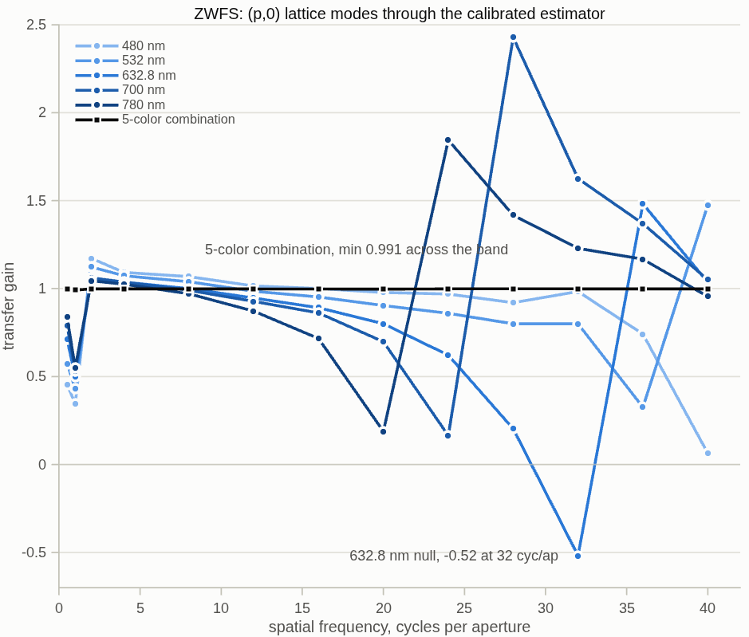

<!--
deck_zwfs.md — the Zernike wavefront sensor for the DM gauge, and how
it will be compared to the Twyman–Green IFO.  DRAFT — pending Dave's
sign-off; the builder suppresses the export mark on DRAFT decks.
Build: python3 make_brief_slides.py deck_zwfs.md
2026-09-09 fold 2: the literature scan (three slides after the head-to-head:
papers in priority order with synopses + references, and the conclusions /
next steps) from macos/REPORT_zwfs_lit_scan.md.
Status: covers the campaign through S1 (mask + response gates green) plus
the S6 multi-color excursion (2026-09-09 fold, Dave's 2026-09-08 ask);
the S2–S5 battery / head-to-head / photon pricing are reported in the
interferometer deck (deck_tg_fang) and referenced here; the vector step
is pending and says so.  Sources: templates/40_benches/zwfs_dm96 (S1, d6791d1),
vsg_wip/vsg2_params.m §9 (hardware), tg_psi_dm96 run 10 (IFO numbers),
BRIEF_zwfs_campaign.md (plan + rulings 2026-09-04).
-->

# A Zernike sensor for the DM gauge
The same 96 mm bench with the reference arm removed: a quarter-wave dimple at focus turns one camera frame into a wavefront measurement — set against the phase-shifting interferometer on the same deformable mirror
D. C. Redding, with Claude Code.
September 2026.
DRAFT — pending review.  Campaign status: sensor model verified; battery, head-to-head and photon pricing measured (reported in the interferometer deck); multi-color excursion and the literature scan folded here; vector step pending.

## The idea: the beam interferes with its own core | An etched dimple at the focus phase-shifts the heart of the beam; that light spreads back over the pupil as a built-in reference
::: left
- **One transparent plate, one tiny etched spot.**  At the focus, the core of the beam passes through the dimple and picks up a quarter-wave phase shift; everything outside misses it.  The shifted core light spreads back across the whole pupil image and interferes with the rest — a common-path interferometer with no second arm.
- **Pupil brightness becomes a phase map.**  Near a quarter wave of shift, the camera intensity is close to linear in the wavefront: one frame per measurement, no moving parts, no polarization optics.
- **The two prices:** the sensor cannot see piston and dims toward the very lowest spatial frequencies — the reference is made from the beam itself.  Measured so far the cost sits BELOW defocus: defocus itself already reads at 0.99 (2.0 λF/D spot, full resolution).  And the linear reading holds only for small departures — the range limit is a scheduled measurement.
::: right
{h=2.5}
~ The dimple takes 28.0% of the light — the encircled energy a 1.06 λF/D disk should take from a focused spot.

## The setup: the interferometer's test arm, alone | Same source, same splitter, same 700 mm DM leg, same lenses — the reference arm and every polarization element simply removed
::: left
- **Reused whole:** the TG96 bench solved for the 96×96, 1 mm-pitch DM — splitter at 7°, clearance-solved legs, the retuned detector optics.  The dimple sits at the internal focus of the existing detector leg, in the mask seat the bench already carried; the camera still views the DM image.
- **Removed:** the reference flat and its leg; the polarizer, four arm waveplates, output waveplate and analyzer.  Nothing else moves.
- **Why that discipline matters:** when the two instruments are scored against each other, the only difference is the sensing principle — not the glass, not the geometry.
::: right
{h=2.3}
~ Two model findings on the way, recorded in the campaign README: the mask must sit at the real focus (−5.58 mm from the textbook seed — the lens is the optimized one), and representing a µm-scale mask at focus needs a diffraction bracket around that plane (reference-sphere legs, the coronagraph-bench idiom).

## The mask is real hardware, modeled at its own numbers | 346.2 nm of etch in fused silica = 1.571 rad at 632.8 nm; a 9-spot substrate, one spot in the beam at a time
::: full
- **The part:** a transmissive fused-silica substrate carrying a 3×3 array of etched dimples of graded diameter — the VSG2 wavefront-sensor mask.  Etch depth 346.2 nm → phase 2π(n−1)d/λ = 1.571 rad ≈ a quarter wave at 632.8 nm.  Translating the substrate selects a spot; only one is ever in the beam.
| spot diameter (λF/D) | 1.06 (default) | 1.22 | 2.0 | 3.0 |
| here, at F/4.2 | 2.79 µm | 3.22 µm | 5.3 µm | 7.9 µm |
- **In the model:** the etched disk is a complex mask multiplied into the propagated field at the focal plane — edges area-weighted at 8× supersampling, the disk centered on the measured spot (the same alignment the real substrate gets by translation).  An exact identity gates it: the masked field equals the sum of the direct and dimple-diffracted parts to 15 digits, so the mask provably acts on the light.
- **Spot size is also a sampling lever:** a larger spot relaxes the focal-plane grid a high-resolution pupil leaves behind — the 96×96 runs use the 3.0 λF/D spot; the trade across the real spot table is a scheduled study.
~ Hardware numbers from the VSG2 ZWFS upgrade deck, carried in vsg2_params.m; substrate class Thorlabs W4101FT1.

## First light in the model | A known 8 nm ripple commanded on the DM comes back from ONE camera frame at gain 0.93 — and reads as nothing when the dimple is removed
::: left
- **The response chain, gated:** dimple resolved at 6.3 px on the focal grid; masked frame = direct + diffracted parts at 3×10⁻¹⁶; core fraction 0.280.
- **The measurement:** an 8 nm radial ripple on the DM, reconstructed from a single frame against the flat-state reference maps — gain 0.932, residual 0.45 nm, with the camera-to-DM mapping taken from traced rays (magnification 10.16, anamorphism 0.00%).
- **The control:** the same DM state read without the dimple recovers gain −0.07 — plain pupil imaging is phase-blind; the signal is the dimple's.
- **Low orders are less trouble than presumed:** defocus reads at 0.986 at full resolution.  The self-reference blindness lives at piston and tilt; the full response curve against the interferometer is the battery's job.
::: right
{h=2.6}
~ All numbers from zwfs_s1_report.txt (five gates, 20 s a run, development resolution); full-resolution battery pending.

## Measuring the DM: a poke and a low-order figure | One actuator pushed 20 nm reads at gain 0.45 through one frame; an 8 nm defocus at 0.99 — and a sampling sweep shows the spot size, not the camera, sets the trade
::: full
{h=1.85}
{h=1.85}
- **Swept, and it is not the camera:** poke gain does not move from 1.7× to 5× detector margin over the actuator scale, nor from 1.3 to 3.7 rays per actuator on the DM side.  The lever is the spot: 3.0 λF/D reads the poke at 0.59 but defocus falls to 0.78; 2.0 gives 0.45 and 0.99; the 1.06 hardware spot inverts the poke's sign.  The dimple diameter selects a band — no single spot serves both.
- **Why that is workable:** the transfer is flat in sampling and set by a known dimple — stable and calibratable.  The actuator-model fit (the agreed score) with a measured response absorbs it; that is the battery's reconstructor path toward the 1 pm ultimate target.
~ Linear reconstructor throughout; alternatives are a scheduled study.  Sweep record: zwfs_sweep.m (8 configs, 1.2 min).  Identical cases on the interferometer: poke gain 0.984 / 0.049 nm, defocus 1.024 / 0.086 nm (the Fang deck carries them).

## Color as a lever: the blind bands move with wavelength | Five colors through the one mask keep the combined transfer above 0.99; on a 30 nm working surface the single-actuator floor falls 720 → 224 pm
::: left
{h=4.3}
::: right
- **Why it works:** the dimple is fixed glass — its phase (π/2 at 632.8 nm) and its diameter in λ/D scale with wavelength, and so does the frequency where the response crosses zero: 40, 36, ~30, 24, 20 cycles/pupil at 480, 532, 632.8, 700, 780 nm.  Each color carries its own calibration: flat references, measured kernel, modal transfer.
- **The combination:** a multi-channel Wiener estimate on the actuator lattice weights each color by its own transfer, so a mode one color cannot see is carried by another.
- **What it buys** (linear reading, 632.8 nm alone → five colors): single-actuator floor on the 30 nm working surface 720 → 224 pm (SNR 9 → 35); dense random 16.4 → 7.2 nm; the grid case the sensor could not detect rises from SNR 1.5 to 3.4 — better, still short of detection.
- **The interferometer, same test:** unchanged at every color — its roll-off is geometric, not diffractive (its deck carries the slide).
::: full
~ Cost: K× frames per measurement.  Under equal weights the phase-stepped reading on a flat gets slightly worse (287 → 313 pm): weight colors by their measured systematic first.  Noiseless, 96×96; records zwfs_s6color.m / zwfs_s6color_report.txt, combiner dm_gauge_lib/dmg_color_comb.m.

## Side by side with the Twyman–Green | The interferometer dims at the finest patterns, the Zernike sensor at the very lowest and in range — the price of its one-frame economy
::: full
| | Twyman–Green PSI (measured) | Zernike sensor (this campaign) |
| reference beam | the second arm's flat | made from the beam's own focal core |
| one measurement costs | 6 traces (3 per arm), 4 fringe frames | 1 camera frame (+1 stored flat set) |
| polarization hardware | polarizer, 5 waveplates, analyzer | none |
| moving parts | none (polarization-stepped) | none |
| null, nothing aligned | 0.134 nm | to be measured |
| response rolls off at | fine patterns: 0.50 at the 96×96 checkerboard | the very lowest orders (piston/tilt; defocus already 0.99) |
| range in one frame set | half a wave, and unwrappable | small departures only; the fold point is a scheduled measurement |
| one actuator pushed 20 nm | gain 0.98, error 0.05 nm rms | gain 0.45–0.59, set by spot size, flat in sampling (next slide) |
| a 10 nm actuator change, differenced | 0.021 nm | the head-to-head |
- **Reading:** the interferometer measures any surface and pays at high spatial frequency; the Zernike sensor measures small changes cheaply — one frame, no polarization train — and pays at low spatial frequency and in range.  Neither table column is a winner until both are scored on the same question.
~ PSI column: tg_psi_dm96 run 10.  Differential entries are map-space; both instruments will be restated in actuator space before the head-to-head (next slide).

## The head-to-head, and how it will be scored | Same DM truth, same battery — and the score is how well an actuator change is recovered, through the DM's own actuation model
::: full
- **The metric (the design ruling):** measure a working state, apply a known deviation, measure again, difference the measurements — then fit the DM actuation model to the result and score the recovered actuator changes, not map pixels.  The actuator fit absorbs each instrument's roll-off inside the DM's own band, so the comparison is fair to both.
- **The interferometer's differential floor stands at** 0.021 nm on a 10 nm single-actuator change and 3.67 nm on a 10 nm random pattern (map space, base-independent) — both to be restated in actuator space before the sensor is scored against them.
- **The campaign from here:** camera registration by the two-poke doctrine at small strokes → the same 12-pattern battery at 48×48 and 96×96 → the differential head-to-head, including the working-state size where the sensor's linear reading folds.
- **Then the vector step:** a polarizing metasurface in place of the etched dimple gives the two polarizations opposite phase shifts — two pupil images in one frame, shifted opposite ways, so the sign ambiguity disappears and the usable range grows.  The engine's vector-diffraction and per-polarization mask machinery is already in place from the coronagraph work.
~ Registration pokes drop to ~20 nm for the sensor: a 150 nm poke is 3 rad of phase — outside the linear reading.  Measured since (S2–S5): 46 pm for the interferometer against 744 pm (linear) / 773 pm (phase-stepped) for the sensor on the 30 nm working surface; the interferometer deck carries the head-to-head, break scale and photon pricing.

## What the Zernike-sensor literature offers, in priority order | Twelve papers read; one import addresses this campaign's weak results directly: reconstruct with an iterated reference wave
::: full
| # | paper | what it gives this model |
| 1 | Ruane, Wallace, Steeves et al. 2020, JATIS 6, 045005 | Exact per-pixel reconstruction from the pupil amplitude, the reference wave b and the masked image; a sensitivity factor per pixel; a four-term systematic budget; 1 pm reached at 4.4×10⁵ frames; no loss to 25 % bandwidth |
| 2 | Doelman, Fagginger Auer, Escuti, Snik 2019, Opt. Lett. 44, 17 | Vector Zernike: ±π/2 on opposite circular polarizations gives two pupil images, an exact phase-and-amplitude solution, an iterated b, achromatic to 100 % bandwidth; the leakage terms are written down |
| 3 | N'Diaye, Vigan, Dohlen et al. 2016, A&A 592, A79 (ZELDA II) | Second-order reconstruction with b from the mask model; 1.06 λ/D at π/2; range −0.14 to +0.36 λ; the sensitivity factor drifts 10 % day to day on SPHERE |
| 4 | Chambouleyron, Cissé, Salama, Haffert, Wallace et al. 2024, SPIE 13097 | A phase-shifted pair (±π/2) yields cos φ and sin φ; iterative reconstructors reach about 1 rad rms; the bench limits were polarization crosstalk and defocus between the two pupils |
| 5 | Haffert 2024, A&A 683, A113 | Iterative nonlinear reconstructors reach machine precision below 0.25 rad rms; phase sorting extends to 0.75 rad; adding wavelengths to 1.4 rad rms |
| 6 | Darcis, Haffert, Chambouleyron, Doelman et al. 2025, A&A | Multi-wavelength gradient descent through the forward model: dynamic range for the scalar sensor, photon robustness across a wider band, two-wavelength unwrapping of petal errors |
~ Priority = payoff against this campaign's measured weak results (the base-crosstalk floors, the undetected grid-on-base case, the stepped-reading regression under equal-weight color combination).  Synopses and links: macos/REPORT_zwfs_lit_scan.md.

## Demonstrations, segmented mirrors, and the in-house precedent | Picometers by alternating DM states and averaging; segment piston by model iteration, underestimated below 50 % Strehl
::: full
| # | paper | what it gives this model |
| 7 | Steeves, Wallace, Kettenbeil, Jewell 2020, Optica 7, 1267 | 1.6 pm repeatability in 4.3 s by alternating flat and waffle DM states and averaging the differences; a reconstruction robust at the highest spatial frequencies |
| 8 | Wallace, Rao, Jensen-Clem, Serabyn 2011, SPIE 8126 | All-reflective phase-shifting Zernike interferometer: a dynamic, arbitrary core phase shift read in four steps gives phase and amplitude; low sensitivity to vibration, polarization and wavelength |
| 9 | Moore and Redding 2018, SPIE 10698 | Nonlinear polychromatic physical-optics reconstruction for picometer differential metrology on LUVOIR; the in-house precedent for the reconstructor above |
| 10 | Keck vector-Zernike segment control 2024 (arXiv 2404.08728); Wallace et al. 2022 (arXiv 2205.02241) | Segment piston by model-based iteration; 11 nm rms piston uncertainty; underestimation 2 to 4× below 50 % Strehl; fabricated shifts 0.30π and 0.68π instead of ±0.5π |
| 11 | HiCAT mid-order Zernike sensor 2024 (arXiv 2409.03411) | Per-segment piston, tip and tilt by interaction matrix; a minimal step of 125 ± 31 pm at SNR 4; 14-bit DM quantization reads as steps in the response |
| 12 | Shi et al. 2015, SPIE 9605 (Roman low-order sensor) | A reflective dimple on the focal-plane mask senses Z2 to Z11 from the rejected starlight: the spatially filtered form of the same sensor |
~ Also read: PIAA-ZWFS (2026, arXiv 2606.28136), lossless pupil apodization that closes the gap to the fundamental sensitivity limit by 10× — a design lever, not a model change.

## Conclusions: reconstruct with an iterated reference wave first | The frozen-reference linear reading is the un-iterated case of what every recent paper iterates; that is where the sensor's remaining floors come from
::: full
- **Why this comes first:** the base-crosstalk floors and the undetected grid-on-base case are the frozen-b error — the reference wave is calibrated on the flat DM and never updated, so a working surface moves the reference core and the linear reading reads it as crosstalk (S2b: defocus on a working surface read 0.74 under exact retrieval).  Every recent reconstructor iterates b; this model does not yet.
- **The spec:** solve each pixel exactly from the masked image, the pupil amplitude and b (Ruane 2020, eq. 36–37); re-propagate the estimate through the mask model to refresh b; repeat three to five times.  The engine's exact reference field gates the FFT surrogate for b to 10⁻¹⁰ before it is trusted — a check no bench can make.  Success: the grid-on-base case detected from one frame at SNR ≥ 5, and the hold-out gain within 3 % of 1 without the modal over-correction.
- **What this model has that the papers do not:** engine-exact reference and pupil fields, the ray-affine registration doctrine, actuator-space scoring through the DM influence model, the two-observables-per-pixel depth-ladder result, and the color-resolved migration of the response nulls.
~ Spec and provenance: macos/REPORT_zwfs_lit_scan.md, "Suggested first ZWFS task"; implemented as a third reading in dm_gauge_lib/dmg_zwfs_gauge beside the frozen-linear and phase-stepped readings.

## Conclusions: the follow-on imports, in order | Budget form, model-matched DM calibration, spot and color reruns on the new reconstructor, the vector sensor priced before it is built
::: full
- **The JPL budget form:** a per-pixel sensitivity factor from the measured fields predicts the photon-noise stage analytically, and the four systematic terms (pupil calibration at ½, reference wave at 1, dimple depth, initial phase) become the rows of the error budget.
- **Calibrate the DM through the sensor's own image model:** fit actuator positions and gains by matching sensor images of poke grids to a simulation that includes the propagation distances — the out-of-conjugate case.  The interferometer's detector sits off the DM conjugate after the null-tuned tail, so this is its lever too.
- **Rerun spot size and color on the new reconstructor:** the "larger spot, worse b" trade disappears once b is iterated, so the 1.06 / 2.0 / 3.0 λ/D sweep is due again; the five-color combination becomes a joint per-wavelength fit, which also removes the stepped-reading regression seen under equal weights.
- **Model the vector sensor before the metasurface is built:** the exact two-image solution and its leakage terms (retardance offsets, splitter rotation) run on the engine's polarization machinery; the bench limits at Keck and SEAL were defocus and crosstalk between the two pupil images, both priceable here.
- **The interferometer, for balance:** a PZT phase shift buys no model gain — its floors are geometric and color-independent — but on hardware an absolute phase scale and freedom from polarization systematics; the recommended form is a hybrid: polarization snapshot for the differential measurements, a PZT on the reference flat as calibrator.
~ Segmented-mirror lessons carried forward: the sensor reads segment piston but not global piston, DM quantization appears as steps in the response, and piston is underestimated below 50 % Strehl (Keck) — all three enter the e5-class segmented gauges.

# Backup

## Provenance and records | Every number re-derives from a committed script
::: full
- Campaign: templates/40_benches/zwfs_dm96 — zwfs_s1.m (five gates: sampling, superposition, reference wave, response, no-dimple control), zwfs_mask.m, zwfs_s1_figs.m (the figures here), zwfs_s1_report.txt, README with the findings chain; plan and rulings in macos/BRIEF_zwfs_campaign.md.
- Findings earned in S1, recorded so they are not re-derived: the stock detector leg is ray-traced (geometric) at the mask plane — a λ/D-scale mask needs the reference-sphere diffraction bracket (now a builder option, default off, existing decks bit-identical, suites green); the mask must sit at the optimized lens's real focus (−5.58 mm from the thin-lens seed, found by a peak scan the gate re-runs); the camera-to-DM frame must come from traced rays — a support-area estimate was 25% off and read a fine test pattern as "no response."
- Sign convention pinned by gate: surface height = −φ·λ/4π on this deck (single reflection doubles height).
- Correction trail (kept so it is not re-derived): early defocus readings of 0.54 and 0.32 were PATTERN-RADIUS bias — the source cone fills 74% of the aperture, and truth patterns drawn on the aperture radius overhang the light.  Corrected on the measured illuminated radius: 0.986.  Third frame lesson of the campaign; the campaign README carries all three.
- WF-estimate figures: zwfs_wf_figs.m (traced render + triptychs, model 1024 / 193-px camera / 2.0 λF/D spot; cases matched to tg96_wf_figs.m).
- Hardware source: "VSG2 Zernike Wavefront Sensor Update -v2" deck, parameters carried in templates/40_benches/vsg_wip/vsg2_params.m §9.
- Interferometer comparison column: templates/40_benches/tg_psi_dm96, run 10 (tg96_report.txt).
- Literature scan (2026-09-09): macos/REPORT_zwfs_lit_scan.md — twelve papers, ranked, with the PZT verdict for the interferometer and the spec for the iterated-reference-wave reconstructor.
