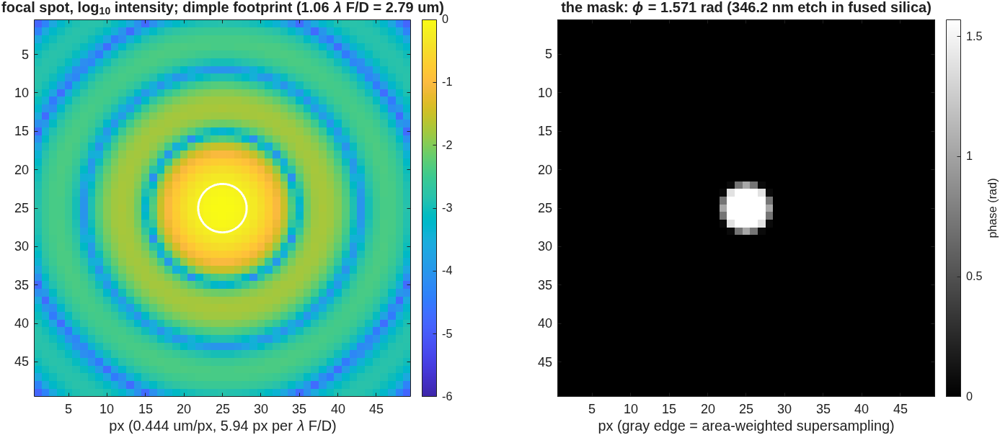
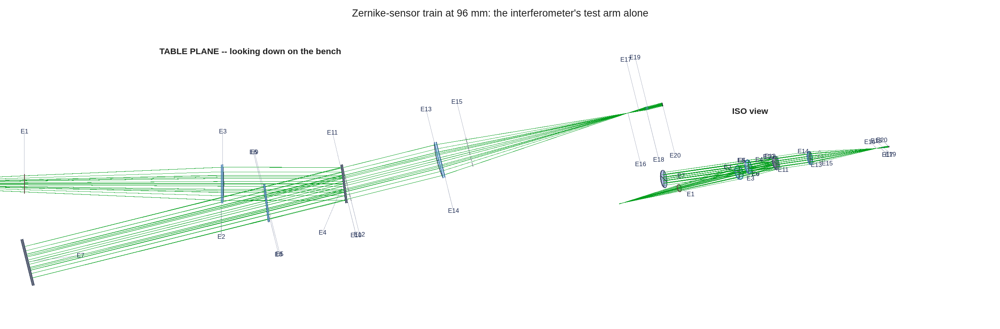
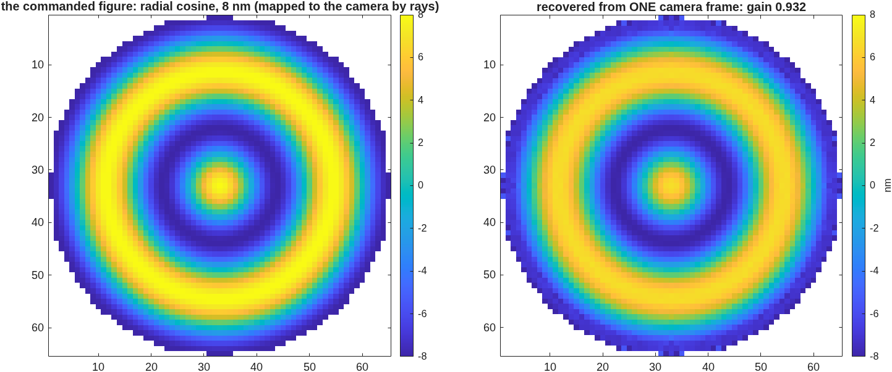
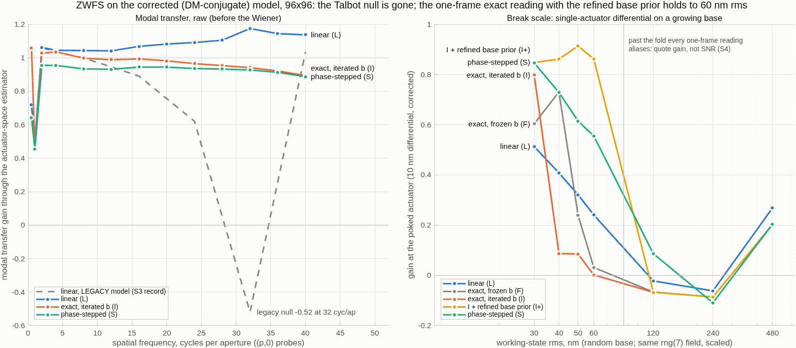
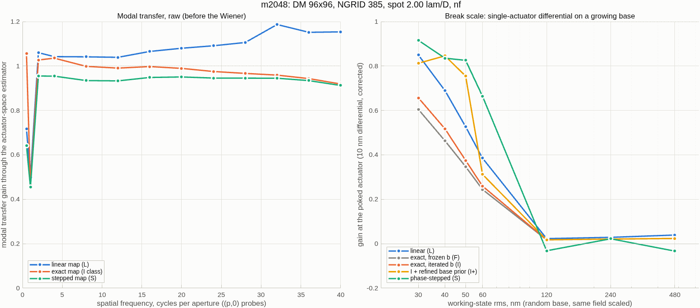
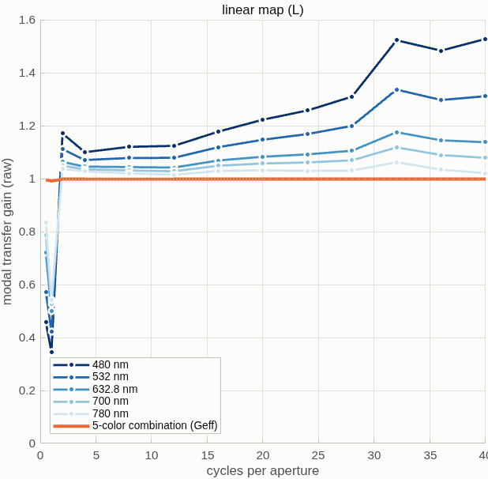
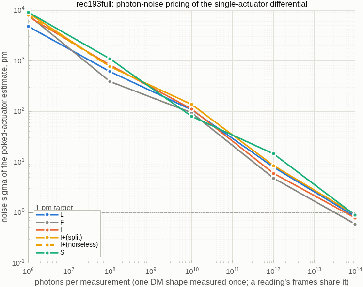
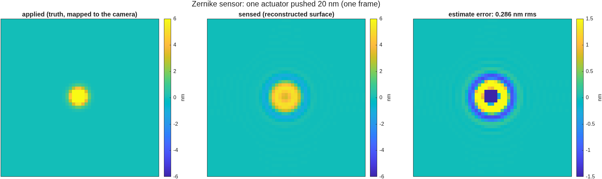
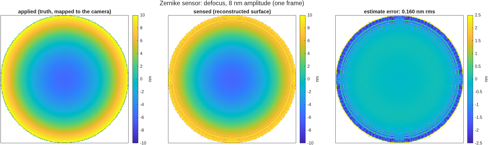

<!--
deck_zwfs.md — the Zernike wavefront sensor for the DM gauge, and how
it compares to the Twyman–Green IFO.  DRAFT — pending Dave's sign-off;
the builder suppresses the export mark on DRAFT decks.
Build: python3 make_brief_slides.py deck_zwfs.md
2026-09-10 fold 3b (Dave's review of fold 3): plain-words pass on every
slide; a "how the numbers are scored" slide defines gain / floor / SNR /
working surface / state / calibration once; the range slide now states
the accuracy after calibration and answers whether calibration can
absorb the gain variation; "photons per state" defined.
2026-09-10 fold 3 (S7 + S8): the sensor-model correction, the five
readings, sampling closed at MODEL 2048, colour and photon re-runs, the
multi-site working-surface range, the parameterized runner.  Figures are
the tools' own PNGs (zwfs_s7iter.png; zwfs_run outputs in
zwfs_dm96/runs/<tag>/), unmodified except one autocropped panel.
Sources: templates/40_benches/zwfs_dm96 (README S7/S8, runs/),
macos/BRIEF_zwfs_campaign.md, tg_psi_dm96 run 10 + S4/S5 (IFO numbers).
-->

# A Zernike sensor for the DM gauge
The same 96 mm bench with the reference arm removed: a quarter-wave dimple at the focus turns one camera frame into a wavefront measurement — compared with the phase-shifting interferometer on the same deformable mirror
D. C. Redding, with Claude Code.
September 2026.
DRAFT — pending review.  Status: the sensor model has been corrected (the early model was out of focus); five ways of reading the frames measured on the corrected model; sampling settled on a 2048 grid; colour and photon budgets re-run; one script with a parameter sheet reproduces every number; the polarizing (vector) version is still to come.

## The idea: the beam interferes with its own core | A small etched dimple at the focus delays the centre of the beam; that light spreads back over the pupil and acts as the reference
::: left
- **One glass plate, one tiny etched spot.**  At the focus, the centre of the beam passes through the dimple and is delayed by a quarter wave; the rest of the beam misses it.  The delayed light spreads back over the whole pupil image and interferes with the rest.  This is an interferometer with no second arm.
- **Pupil brightness becomes a phase map.**  Near a quarter wave of delay, the camera brightness is nearly proportional to the wavefront.  One frame per measurement, no moving parts, no polarization optics.  An exact pixel-by-pixel inversion (slide 8) removes the small-phase limit.
- **The two prices.**  The sensor cannot see piston, and it is weak at the very lowest spatial frequencies, because the reference is made from the beam itself.  On the corrected model the weak band is 0.5 to 1 cycle across the pupil (half response at 1 cycle); defocus and everything finer read near full response.
::: right
{h=2.5}
~ The dimple takes 28.0% of the light — the fraction a 1.06 λF/D disk should take from a focused spot.

## The setup: the interferometer's test arm, alone | Same source, same splitter, same 700 mm mirror leg, same lenses — the reference arm and every polarization element removed
::: left
- **Reused whole:** the TG96 bench laid out for the 96×96, 1 mm-pitch DM — splitter at 7°, legs solved for clearance, the tuned detector optics.  The dimple sits at the internal focus of the existing detector leg, in the mask seat the bench already had; the camera still views an image of the DM.
- **Removed:** the reference flat and its leg; the polarizer, four arm waveplates, output waveplate and analyzer.  Nothing else moves.
- **Why this matters:** when the two instruments are scored against each other, the only difference is how they sense — not the glass, not the geometry.
::: right
{h=2.3}
~ A mask a few microns across needs a diffraction calculation around the focus: two reference spheres, one before and one after the mask.  They must have the same radius — the finding on slide 7.

## How the numbers are scored | Every result on the following slides is a change in the DM, measured before and after, in actuator units
::: full
- **The test:** put the DM in some shape (the working surface), measure it; change a known set of actuators by a known amount (10 nm unless stated); measure again; subtract; fit the actuator pattern to the difference.  The score is how well the actuator changes come back.
- **Gain:** recovered change divided by the true change.  1.0 is perfect.  Gain is quoted after calibration: the sensor's response to one actuator and to patterns of each spatial frequency is measured on the flat DM and divided out.  A gain below 1 on a working surface is therefore an error the flat-DM calibration did not remove.
- **Floor:** the spread (rms) of the actuators that were not changed, in picometres.  It is what the measurement puts on actuators that should read zero.
- **SNR:** recovered change divided by the floor.  Above 5 counts as detected.
- **Working surface:** a random DM shape, 30 nm rms unless stated, present during the test.  It is the same random pattern every time, scaled.
- **State and frame:** a state is one DM shape measured once.  A measurement of a change costs two states.  A state costs one camera frame for the one-frame readings and four frames for the stepped reading; photon budgets are quoted per state.
~ 96×96 DM at 1 mm pitch unless stated (48×48 at 2 mm alongside).  The interferometer is scored the same way with the same code (dm_gauge_lib).  Target: 1 pm.

## The mask is real hardware, modelled with its own numbers | 346.2 nm of etch in fused silica = 1.571 rad at 632.8 nm; a substrate with nine spots, one in the beam at a time
::: full
- **The part:** a fused-silica plate with a 3×3 array of etched dimples of different diameters — the VSG2 wavefront-sensor mask.  Etch depth 346.2 nm gives a phase delay 2π(n−1)d/λ = 1.571 rad, a quarter wave at 632.8 nm.  Moving the plate selects a spot; only one is ever in the beam.
| spot diameter (λF/D) | 1.06 (default) | 1.22 | 2.0 (used) | 3.0 |
| here, at F/4.2 | 2.79 µm | 3.22 µm | 5.3 µm | 7.9 µm |
- **In the model:** the etched disk is a complex mask multiplied into the calculated field at the focus — edges area-weighted at 8× supersampling, the disk centred on the measured spot (the same alignment the real plate gets by moving it).  An exact identity checks it: the masked field equals the direct part plus the dimple's part to 15 digits, so the mask provably acts on the light.
- **Spot size sets the weak band:** on the corrected model, the 3.0 λF/D spot deepens the sensor's own dip below 2 cycles across the pupil (response 0.22 against 0.50 at 2.0 λF/D) and changes nothing above it.  2.0 λF/D is the spot used throughout.
~ Hardware numbers from the VSG2 ZWFS upgrade deck, carried in vsg2_params.m; substrate class Thorlabs W4101FT1.

## First light in the model | A known 8 nm ripple put on the DM comes back from one camera frame at gain 0.93, and reads as nothing when the dimple is removed
::: left
- **The chain, checked:** dimple 6.3 pixels across on the focal grid; masked frame = direct part + dimple part to 3×10⁻¹⁶; 0.280 of the light in the core.
- **The measurement:** an 8 nm ring pattern on the DM, rebuilt from a single frame against the flat-DM reference maps — gain 0.932, residual 0.45 nm; the camera-to-DM mapping comes from traced rays (magnification 10.16, no anamorphism).
- **The control:** the same DM shape read without the dimple gives gain −0.07.  Plain pupil imaging is blind to phase; the signal is the dimple's.
- **Low orders are less trouble than expected:** defocus reads at 0.986.  The blind spot is piston and tilt only.
::: right
{h=2.6}
~ Numbers from zwfs_s1_report.txt (five checks, 20 s a run, development resolution), taken on the model later found out of focus (next slide).  The five checks test structure, not accuracy, and still stand.

## The sensor model was out of focus; corrected, the ringing goes away | The exit sphere of the mask bracket had the wrong radius — a 4.9 m defocus of the pupil image, under every result of the first six stages
::: left
- **The defect:** the two reference spheres around the mask must share one radius so that, with no mask, the field comes back unchanged.  The exit sphere was written with a 23.9 mm radius against the entrance sphere's 352.7 mm; the engine then applied a quadratic phase at the focus, which is a defocus of the pupil image by 4.86 m.  Found while building the exact inversion, which needs the pupil brightness to be the same for every DM shape.
- **What it explained:** with no mask the field came back changed by 0.159 on a flat DM (now 1.8×10⁻¹⁵); a 30 nm DM shape changed the pupil brightness by 29% rms (now 4×10⁻¹⁶); the response to one actuator rang (peak 0.27, ring −0.16; now 0.75, no ring); the response had a null near 30 cycles across the pupil — a Talbot effect of the defocus, predicted at 34.
- **What the correction alone buys** (one-frame linear reading, 96×96, same frames): floor under a single-actuator change on the 30 nm surface 744 → 67 pm (SNR 9 → 80); the grid case the sensor could not detect goes from SNR 1.5 to 14; a dense random change 42 → 9.6 nm error.
::: right
{h=3.0}
~ The old emission is kept as a builder option so the first six stages reproduce byte for byte.  The interferometer traces the same tail by rays and was never affected.  Records: zwfs_s7iter_report.txt, README S7.

## Five ways to read the same camera frames | The exact inversion, with its reference re-computed and the sign choice settled once, reads a 10 nm change to 26 pm from one frame
::: full
- **The readings:** L, linear, one frame, small phases only.  F, exact inversion pixel by pixel with the reference wave from the flat DM, one frame.  I, exact inversion with the reference wave re-computed from the current estimate through the mask model, five passes, one frame.  I+, the same, with the sign choice each pixel faces (which side of the quarter-wave fold it is on) settled once per working surface from four stepped frames, then refined; every later measurement is one frame.  S, phase stepping through three etch depths plus a clear frame, four frames.
| 10 nm change on the 30 nm working surface, 96×96 | L | F | I | I+ | S |
| gain, before / after the frequency correction | 0.41 / 0.40 | 0.91 / 0.94 | 1.01 / 1.04 | 0.91 / 0.95 | 0.75 / 0.89 |
| floor, pm, before / after | 60 / 57 | 46 / 52 | 34 / 46 | 26 / 40 | 23 / 42 |
| SNR (before) | 68 | 196 | 298 | 355 | 323 |
| 47 actuators changed by 1 nm on the same surface: SNR | 13.6 | 12.4 | 12.6 | 37.3 | 38.3 |
- **The one physical limit is the sign fold:** with the true sign map and the engine's own reference wave, the inversion is exact to 3×10⁻¹⁴.  On the 30 nm surface 7.8% of pixels sit past the fold.  The refined sign map gets 99.99% of pixels right; the plain stepped one misses 3%, enough to flip the sign of a single actuator.
~ Fully sampled setup (385 rays across the pupil, 2048 grid; slide 9).  "Frequency correction" = dividing out the measured response by spatial frequency.  The reference-wave model matches the engine's own field to 2×10⁻¹⁵.  Interferometer on the same row: gain 0.92, floor 46 pm.  Record: runs/m2048.

## Sampling: two requirements that pull opposite ways | Dimple pixels go as grid size over ray count, camera pixels per actuator as ray count — only a larger grid serves both; a 2048 grid fits
::: left
| rays across / grid | dimple, px | camera px per actuator | gain, test actuator | I+ on the 30 nm surface |
| 193 / 1024 (development) | 7.92 | 2.5 | 0.900 | 0.79, 13 pm, SNR 584 |
| 385 / 1024 | 3.96 | 5.0 | 0.935 | 0.91, 25 pm, SNR 359 |
| 385 / 2048 (fully sampled) | 7.92 | 5.0 | 0.935 | 0.91, 26 pm, SNR 355 |
- **The rule:** pixels per λ/D at the mask = 0.74 × grid / rays; camera pixels per actuator ∝ rays.  Halving the rays doubles the focal resolution and halves the pupil sampling.
- **What it settled:** the gain on a test actuator (one calibrated on the centre actuator, tested on another) is set by the ray count, not by the dimple's sampling — the same at 4 and 8 pixels across the dimple, the same at spot 3.0.  The remaining 6.5% is neither; the likely cause is that the sensor's response differs between the centre, where it is calibrated, and the test site.
- **The 2048 grid runs on a 30 GB machine** with a trimmed engine size table dropped in the run folder (grid-surface slots 200 → 4 saves 1.7 GB): 32 minutes, under 4 GB.
::: right
{h=2.9}
~ Test actuator = a single 20 nm change away from the calibration actuator, gain before the frequency correction.  I+ values before correction.  Records: runs/rec193, ng385, ng385s3, m2048.

## How large a working surface each reading can handle | On 47 actuators at once the one-frame reading is within 15–19% of a 10 nm change up to 40 nm rms of surface and fails at 50; four frames hold to 50–60
::: full
| 10 nm changes on 47 actuators; gain, read value of 10 nm, floor | 30 nm surface | 40 nm | 50 nm | 60 nm |
| 96×96, 1 mm pitch — I+ (one frame) | 0.81 → 8.1 nm, 0.31 nm | 0.85 → 8.5 nm, 0.29 nm | 0.76 → 7.6 nm, 0.84 nm | 0.31 → 3.1 nm, 3.3 nm |
| 96×96 — S (four frames) | 0.92 → 9.2 nm, 0.32 nm | 0.84 → 8.4 nm, 0.31 nm | 0.83 → 8.3 nm, 0.48 nm | 0.66 → 6.6 nm, 0.65 nm |
| 48×48, 2 mm pitch — I+ | 0.89 → 8.9 nm, 0.16 nm | 0.80 → 8.0 nm, 0.20 nm | 0.84 → 8.4 nm, 0.21 nm | 0.83 → 8.3 nm, 3.0 nm |
| 48×48 — S | 0.89 → 8.9 nm, 0.18 nm | 0.83 → 8.3 nm, 0.19 nm | 0.99 → 9.9 nm, 0.61 nm | 0.55 → 5.5 nm, 0.48 nm |
- **What gain means here:** these gains are after the flat-DM calibration, so 0.81 means a 10 nm change reads 8.1 nm — a 19% error the calibration did not remove, because the sensor's response on a 30 nm surface differs from its response on a flat.  The floor is a second error on top: 0.3 nm spread over the 47 sites' neighbours.
- **Can calibration absorb it?**  Only if it is done on the working surface itself, and only as far as the gain is stable: I+ moves 0.81 → 0.85 between 30 and 40 nm rms, so a calibration made at 30 nm would be 5% off at 40.  Calibrating on the working surface is the next measurement (last slide).  The failure at 50–60 nm is not a gain to calibrate: the floor jumps to 1–3 nm because some of the 47 sites fall past the sign fold.
- **Why the earlier "holds to 60 nm" moved:** it was one actuator at one site.  Past 120 nm rms every reading aliases.
~ Floor here = spread of the unchanged actuators under 47 simultaneous 10 nm changes (their crosstalk), larger than the single-site floor on slide 8.  Fully sampled setup; record: runs/m2048.

## Colour is no longer a lever | With the sensor's null gone, five colours raise the combined response by 3% instead of 3×, and do nothing for the measurement rows
::: left
{h=3.4}
::: right
- **What moved:** the "blind band near 30 cycles across the pupil that shifts with wavelength" was the out-of-focus model's Talbot null.  On the corrected model each colour's response bottoms at 0.92 to 0.97 after the frequency correction, and the combination at 0.991.
- **On the measurement rows** (30 nm surface, single 10 nm change): I+ at 632.8 nm SNR 269; five colours combined 183; best pair, 700 + 780 nm, 255.  The 47-site case: 32 → 32.  The linear reading gets worse when combined (84 → 34): at 480 nm the dimple delay is 2.1 rad and the small-phase reading turns negative on this surface; an equal-weight combination inherits that.
- **What stays with colour is range:** 780 nm is the best single colour on nearly every row — less phase per nanometre of height, and a 1.6 λ/D dimple.  The interferometer is unchanged at every colour (its deck).
~ 632.8 / 480 / 532 / 700 / 780 nm through one physical mask, every calibration redone per colour; development sampling (193 rays, 1024 grid); runs/rec193full.

## Photons: 10¹⁴ per state reaches 1 pm | Every reading needs about the same light, 25× less than the out-of-focus model said; the sign map's own noise costs 5%
::: left
{h=3.4}
::: right
| reading | photons per state for 1 pm |
| linear (L) | 5.4×10¹³ |
| exact, flat-DM reference (F) | 3.7×10¹³ |
| exact, re-computed reference (I) | 6.4×10¹³ |
| I with the sign map (I+) | 8.8×10¹³ (8.4×10¹³ if the sign map is noise-free) |
| phase-stepped (S) | 1.0×10¹⁴ |
| interferometer, four-step | 8×10¹⁴ |
- **Method:** noise-free frames are calculated once per state; photon shot noise is added numerically, eight trials per point.  A state's photons are shared by the frames the reading needs (one, or four for S).  Each reading's high-photon floor converges to its systematic floor on slide 8.
- **Reading:** 10¹⁴ photons at 633 nm is 30 µJ.  The 1 pm budget is about systematic errors and gain stability, not light.
~ Case: a single 10 nm change on the 30 nm surface, 96×96, development sampling.  Read noise, drift and calibration noise are the next terms once a use case fixes them.  Records: runs/rec193full; interferometer tg96_s5noise_report.txt.

## Run it yourself | One parameter sheet and one script reproduce every number here; the defaults reproduce the stage-7 record to the last printed digit
::: full
- **Two files:** zwfs_params.m returns every setting at its value of record — grid and ray count, wavelength, the bench's lengths and tuned figures, the mask's etch and spot, the sampling checks, registration, the DM sizes, the test amplitudes and seeds, the colour and photon stages.  zwfs_run.m runs the chosen stages and writes the report, a .mat file and the figures into a folder named by the run's tag.
| call | what it does |
| zwfs_run | the record: bench checks, the full test set, figures |
| zwfs_run('tag','ng385', 'NGRID',385) | the 1-megapixel camera |
| zwfs_run('MODEL',2048, 'NGRID',385, 'param_file','macos_param_2048.txt') | the fully sampled setup on a 30 GB machine |
| zwfs_run('stages',{'battery','color','noise','figs'}) | everything on this deck's later slides |
| ./zwfs_batch.sh TAG "the same arguments" | unattended, memory-capped, logged |
- **Checks that run every time:** the no-mask round trip through the bracket (must return the field unchanged); the reference-wave model against the engine's own field; the pupil brightness must not change with the DM shape; the sampling checks (pixels across the dimple, camera pixels per actuator); and the search for the camera-to-DM mirror/transpose and sign.
~ Reproduction check: 64 lines of results against the stage-7 report, 8 differ in the last printed digit (the actuator fit's solver tolerance).  README "Run it yourself" carries the parameter table.

## Side by side with the Twyman–Green | The interferometer loses response at fine patterns and never fails; the sensor reads a change from one frame at the same floor, up to a 40–60 nm surface
::: full
| | Twyman–Green PSI (measured) | Zernike sensor (measured) |
| reference beam | the second arm's flat | made from the beam's own focal core |
| one measurement costs | 6 traces (3 per arm), 4 fringe frames | 1 camera frame (I+; 4 frames once per working surface) |
| polarization hardware | polarizer, 5 waveplates, analyzer | none |
| moving parts | none (polarization-stepped) | none |
| null, nothing aligned | 0.134 nm | 0 by construction (the flat is the reference) |
| response falls off at | fine patterns: 0.50 at the 96×96 checkerboard | 0.5 to 1 cycle across the pupil (0.5 at 1); piston unseen |
| working surface it can handle | 480 nm rms and beyond | 40 nm rms one-frame (1 mm actuators), 50–60 nm four-frame |
| a 10 nm actuator change on a 30 nm surface | gain 0.92, floor 46 pm | gain 0.91, floor 26 pm (I+, one frame) |
| photons per state for 1 pm | 8×10¹⁴ | 0.4 to 1×10¹⁴ |
- **Reading:** the interferometer measures any surface and pays at fine patterns; the sensor measures small changes on a small working surface more cheaply — one frame, no polarization train, an equal or better floor — and pays at the lowest spatial frequencies and in the surface it can handle.
~ PSI column: tg_psi_dm96 run 10 and S4/S5; sensor column: the fully sampled setup (slide 9) except photons (development sampling).  Both in actuator units through the same code (dm_gauge_lib).

## What the Zernike-sensor literature offers, in priority order | Twelve papers read; the first import — re-computing the reference wave — is now built and measured (slide 8)
::: full
| # | paper | what it gives this model |
| 1 | Ruane, Wallace, Steeves et al. 2020, JATIS 6, 045005 | Exact per-pixel reconstruction from the pupil amplitude, the reference wave b and the masked image; a sensitivity factor per pixel; a four-term systematic budget; 1 pm reached at 4.4×10⁵ frames; no loss to 25 % bandwidth |
| 2 | Doelman, Fagginger Auer, Escuti, Snik 2019, Opt. Lett. 44, 17 | Vector Zernike: ±π/2 on opposite circular polarizations gives two pupil images, an exact phase-and-amplitude solution, an iterated b, achromatic to 100 % bandwidth; the leakage terms are written down |
| 3 | N'Diaye, Vigan, Dohlen et al. 2016, A&A 592, A79 (ZELDA II) | Second-order reconstruction with b from the mask model; 1.06 λ/D at π/2; range −0.14 to +0.36 λ; the sensitivity factor drifts 10 % day to day on SPHERE |
| 4 | Chambouleyron, Cissé, Salama, Haffert, Wallace et al. 2024, SPIE 13097 | A phase-shifted pair (±π/2) yields cos φ and sin φ; iterative reconstructors reach about 1 rad rms; the bench limits were polarization crosstalk and defocus between the two pupils |
| 5 | Haffert 2024, A&A 683, A113 | Iterative nonlinear reconstructors reach machine precision below 0.25 rad rms; phase sorting extends to 0.75 rad; adding wavelengths to 1.4 rad rms |
| 6 | Darcis, Haffert, Chambouleyron, Doelman et al. 2025, A&A | Multi-wavelength gradient descent through the forward model: dynamic range for the scalar sensor, photon robustness across a wider band, two-wavelength unwrapping of petal errors |
~ Priority = payoff against this campaign's measured weak results.  Synopses and links: macos/REPORT_zwfs_lit_scan.md.

## Demonstrations, segmented mirrors, and the in-house precedent | Picometres by alternating DM shapes and averaging; segment piston by model iteration, underestimated below 50 % Strehl
::: full
| # | paper | what it gives this model |
| 7 | Steeves, Wallace, Kettenbeil, Jewell 2020, Optica 7, 1267 | 1.6 pm repeatability in 4.3 s by alternating flat and waffle DM states and averaging the differences; a reconstruction robust at the highest spatial frequencies |
| 8 | Wallace, Rao, Jensen-Clem, Serabyn 2011, SPIE 8126 | All-reflective phase-shifting Zernike interferometer: a dynamic, arbitrary core phase shift read in four steps gives phase and amplitude; low sensitivity to vibration, polarization and wavelength |
| 9 | Moore and Redding 2018, SPIE 10698 | Nonlinear polychromatic physical-optics reconstruction for picometer differential metrology on LUVOIR; the in-house precedent for the reconstructor above |
| 10 | Keck vector-Zernike segment control 2024 (arXiv 2404.08728); Wallace et al. 2022 (arXiv 2205.02241) | Segment piston by model-based iteration; 11 nm rms piston uncertainty; underestimation 2 to 4× below 50 % Strehl; fabricated shifts 0.30π and 0.68π instead of ±0.5π |
| 11 | HiCAT mid-order Zernike sensor 2024 (arXiv 2409.03411) | Per-segment piston, tip and tilt by interaction matrix; a minimal step of 125 ± 31 pm at SNR 4; 14-bit DM quantization reads as steps in the response |
| 12 | Shi et al. 2015, SPIE 9605 (Roman low-order sensor) | A reflective dimple on the focal-plane mask senses Z2 to Z11 from the rejected starlight: the spatially filtered form of the same sensor |
~ Also read: PIAA-ZWFS (2026, arXiv 2606.28136), lossless pupil apodization that closes the gap to the fundamental sensitivity limit by 10× — a design lever, not a model change.

## Conclusions: what the corrected model and the exact reading settled | Fixing the model was the bigger gain; the exact reading with the sign map is the best one-frame reading; colour and photons are not the 1 pm budget
::: full
- **The model must keep the pupil image in focus:** the two spheres around the mask share one radius, and the script checks the no-mask round trip on every run.  The correction alone took the single-actuator floor from 744 to 67 pm and made the undetected grid case detectable.
- **The exact reading with a re-computed reference is the import that paid** (paper 1): 26 pm from one frame on a 30 nm working surface, SNR 355 — with the sign fold settled once from four stepped frames and refined.  The plain stepped sign map misses 3% of pixels and can flip a single actuator's sign.
- **Sampling is settled:** camera pixels per actuator (the ray count) set the gain on a test actuator; the dimple's own sampling did not move any actuator-unit result at 4 against 8 pixels.  The remaining 6.5% of gain, and the gain change with the working surface, are the next measurement: calibrate on the working surface and at the test site.
- **Colour and photons are not levers:** the chromatic null was the defocus; 10¹⁴ photons per state reach 1 pm.  The budget is systematic error: the 25 to 60 pm floors and the gain's stability.
~ Script and records: templates/40_benches/zwfs_dm96 (README S7/S8; runs/rec193, ng385, ng385s3, m2048, rec193full).

## Conclusions: what to import next, in order | The JPL budget form, DM calibration through the sensor's own images, the vector sensor priced before it is built, and the interferometer's lever
::: full
- **The JPL budget form:** a sensitivity factor per pixel from the measured fields predicts the photon-noise stage analytically, and four systematic terms (pupil calibration at ½, reference wave at 1, dimple depth, initial phase) become the rows of the error budget.
- **Calibrate the DM through the sensor's own image model:** fit actuator positions and gains by matching sensor images of poke grids to a simulation that includes the propagation distances — this is the calibration on the working surface and at the test site that slides 9 and 10 call for.  The interferometer's camera sits off the DM conjugate after the tuned tail, so it is its lever too.
- **Colour as a joint fit, not a combination:** an equal-weight combination inherits a bad channel; a joint fit through the exact reading would use 700 to 780 nm for range and 632.8 nm for the calibration of record.
- **Model the vector sensor before the metasurface is built:** the exact two-image solution and its leakage terms (retardance offsets, splitter rotation) run on the engine's polarization machinery; the bench limits at Keck and SEAL were defocus and crosstalk between the two pupil images, both priceable here.
- **The interferometer, for balance:** a PZT phase shift buys no model gain — its floors are geometric and colour-independent — but on hardware an absolute phase scale and freedom from polarization systematics; the recommended form is a hybrid: polarization snapshot for the change measurements, a PZT on the reference flat as calibrator.  Its all-mirror (OAP) version is in build.
~ Segmented-mirror lessons carried forward: the sensor reads segment piston but not global piston, DM quantization appears as steps in the response, and piston is underestimated below 50 % Strehl (Keck) — all three enter the e5-class segmented gauges.

# Backup

## Before the correction: the first poke and colour results | Kept for the record; every number on this slide is from the out-of-focus model
::: full
{h=1.85}
{h=1.85}
- **The sampling sweep then read the spot as a band selector** (gain on one actuator 0.45 / 0.59 / −0.38 at spots 2.0 / 3.0 / 1.06) and calibration recovered a 0.90 gain on a test actuator; both were measured on the ringing response.  On the corrected model the response peak is 0.75 (linear) and 0.93 (exact) and the spot only moves the low-order dip.
- **The colour claim** ("five colours fill the blind band; single-actuator floor 720 → 224 pm") was the Talbot null moving as 1/λ.  On the corrected model there is no null and colour is not a lever (main slide 11).
~ Records: zwfs_s1 … zwfs_s6color reports and zwfs_sweep_report.txt; the old emission ('nf_legacy') reproduces them byte for byte.

## Provenance and records | Every number re-derives from a committed script
::: full
- Campaign: templates/40_benches/zwfs_dm96 — the script and parameter sheet (zwfs_params.m, zwfs_run.m, zwfs_run_figs.m, zwfs_run_batch.m, zwfs_batch.sh, macos_param_2048.txt) and its runs (runs/rec193 = the stage-7 reproduction check; ng385, ng385s3, m2048 = the sampling setups; rec193full = colour + photons); the stage scripts zwfs_s1 … zwfs_s7iter as the historical record; README with the findings chain (S1–S8); plan and rulings in macos/BRIEF_zwfs_campaign.md.
- Findings from stage 1, recorded so they are not re-derived: the stock detector leg is ray-traced at the mask plane — a mask a few microns across needs the reference-sphere bracket (a builder option, default off, existing decks bit-identical, suites green); the mask must sit at the optimized lens's real focus (−5.58 mm from the thin-lens seed); the camera-to-DM frame must come from traced rays — an estimate from the support area was 25% off.
- The stage-7 correction: the bracket's exit sphere now carries the entrance sphere's radius ('nf'); 'nf_legacy' reproduces the stage 1–6 emission; the interferometer twin traces the mask plane by rays and is unaffected.
- Sign convention checked by a negative control: surface height = −φ·λ/4π on this deck (a single reflection doubles the height).
- Scoring: actuator units through the DM influence model, one library for both instruments (dm_gauge_lib: registration, actuator fit, frequency correction, both measurement factories).
- Hardware source: "VSG2 Zernike Wavefront Sensor Update -v2" deck, parameters carried in templates/40_benches/vsg_wip/vsg2_params.m §9.
- Interferometer comparison column: templates/40_benches/tg_psi_dm96, run 10, S4, S5 (tg96_report.txt, tg96_s4_report.txt, tg96_s5noise_report.txt).
- Literature scan (2026-09-09): macos/REPORT_zwfs_lit_scan.md — twelve papers, ranked, with the PZT verdict for the interferometer.
