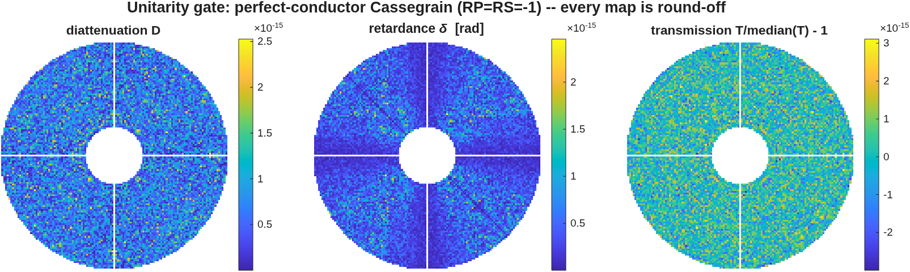
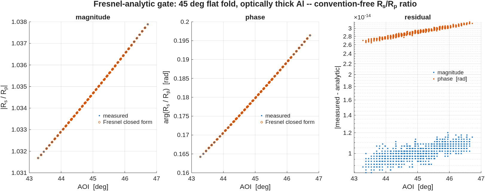
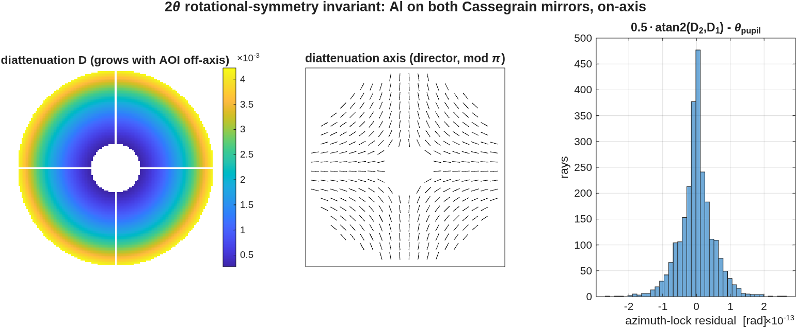
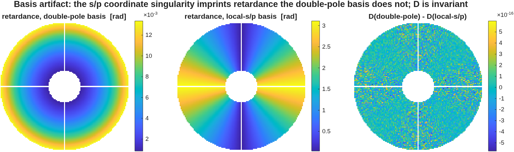

<!-- GENERATED FILE -- do not edit.
     Source: 30_phase2_jones.md.in
     Numbers: generated/numbers.json (MATLAB driver)
     Regenerate: make polval-regen  (docs/macos-manual)
-->
# Phase 2a/2b — Jones pupil and polarization-aberration maps

The engine has no Jones matrix. `macos.jones_pupil` builds one the standard
polarization-ray-trace way, entirely in the binding layer: trace twice with
orthogonal input states, harvest the per-ray vector field and the ray
geometry at the chosen element, and assemble a 2×2 complex Jones matrix at
every pupil point. `macos.pol_maps` then decomposes it per point into
diattenuation and retardance via a closed-form 2×2 polar decomposition in the
Pauli basis.

Vignetted points are `NaN`, never zero — zero-filling would seed every pupil
statistic with a ring of perfect nulls.

## 2.1 Unitarity gate

**Claim.** A lossless, polarization-neutral system produces a Jones pupil
that is unitary times a scalar at every unvignetted point.

This is the single most diagnostic cheap test available: it catches basis
errors, normalization errors and sign errors together. The stock Cassegrain
mirrors carry the engine's perfect-conductor idiom (`IndRef=1`,
`Extinc=1e22`), which gives `RP = RS = −1` to ~1e-22 — so any stock conductor
prescription is a unitarity gate for free.

| Quantity | Measured | Truth |
|---|---|---|
| unvignetted pupil points | 11484 | — |
| max diattenuation `D` | 2.53e-15 | 0 |
| max retardance `δ` | 2.46e-15 rad | 0 |
| longitudinal leak, max &#124;E·k̂&#124;/&#124;E&#124; | 5.25e-17 | 0 |

**Transmission uniformity — a worked case of the statistic exceeding the
physics.** The transmission map takes only 30 distinct
double-precision values across the whole pupil; its true peak-to-valley
spread about the median is 6.09e-15 and its RMS is 9.21e-16. But
`mean()` over 11484 points accumulates its own summation error of
5.06e-14 — *larger than the spread it is being used to measure*. So
the `std/mean` statistic that the CI gate asserts, 5.06e-14, is
dominated by that floor rather than by any property of the optical system.
It remains a perfectly valid upper bound, and the gate is sound; it is simply
not a measurement of non-uniformity. The figure panel is therefore referenced
to the median (an exactly selected element, no accumulation), and both
numbers are published so the gap is evidenced rather than asserted.

**Pinned by** `tJonesPupil/test_unitarity_gate` (mmacos),
`test_jones_pupil.py` (pymacos).

## 2.2 Fresnel-analytic gate

**Claim.** The per-ray reflection coefficients the engine produces at a
coated surface match the closed-form Fresnel result.

This is ladder rung 1 — exact analytic truth, no reference code involved. The
rig is a 45° flat fold with an optically thick aluminium layer (skin depth
~13 nm, layer 200 nm), emitted by the bench builder. The comparison is made
on the **ratio** `RS/RP`, which is convention-free: the launch-frame and
exit-frame factors cancel, so there is nothing to fit and no sign ambiguity
to argue about.

| Quantity | Measured | Truth |
|---|---|---|
| unvignetted rays | 1257 | — |
| AOI spread over the footprint | 43.28° … 46.72° | — |
| max &#124;RS/RP&#124; residual | 1.20e-14 | 0 |
| max arg(RS/RP) residual | 3.18e-14 rad | 0 |
| max per-ray diattenuation residual | 1.11e-14 | 0 |
| mean diattenuation of the Al fold | 0.0341 | closed form |

The AOI spread matters: the gate is not a single-angle coincidence but a
curve match across the beam footprint, magnitude *and* phase.

This gate is also the regression anchor for engine defects 2 and 3 in
*Conventions*. If the signed-cosine defect returns, the measured-to-analytic
ratio becomes exactly `(RP/RS)²` — a signature, not just a failure.

**Pinned by** `tJonesPupil/test_fold_fresnel_analytic`.

## 2.3 Rotational-symmetry (2θ) invariant

**Claim.** An on-axis rotationally symmetric system produces diattenuation
whose axis is locked to the pupil azimuth — the characteristic 2θ pattern —
with no circular component, growing with radius as the angle of incidence
grows off-axis.

Cheap, strong, and highly basis-sensitive: a broken reference frame breaks
the symmetry. Both Cassegrain mirrors are aluminium-coated for this test.

The centre panel draws the diattenuation axis as a *director* (headless,
double-ended) because it is defined only mod π. The tangential pattern it
traces is the signature being tested.

| Quantity | Measured | Truth |
|---|---|---|
| azimuth-lock residual, max | 2.62e-13 rad | 0 |
| max circular diattenuation component | 3.86e-16 | 0 |
| D(outer ring) / D(inner ring) | 4.12 | > 1, grows with AOI |

Reported separately, per the convention stated in the frontmatter:

| | Measured |
|---|---|
| pupil-**mean** diattenuation | 2.258e-03 |
| pupil-**variation** (RMS) diattenuation | 1.140e-03 |

The mean is a state change; only the variation can drive a contrast floor or
a phase-shifting interferometry systematic. For this aluminium Cassegrain the
two are the same order, which is exactly why quoting a single conflated RMS
would be misleading.

**Pinned by** `tJonesPupil/test_2theta_symmetry`.

## 2.4 Reference-frame artifact: double-pole vs local s/p

**Claim.** Diattenuation is invariant to the output basis; retardance is not,
and the local s/p basis imprints a large artifact that the double-pole basis
does not.

The 3×3 polarization-ray-trace matrix is basis-independent, but the 2×2 Jones
pupil is not. The naive local s/p basis carries a coordinate singularity on
axis which appears as spurious tilt- and astigmatism-like retardance. At the
levels a coronagraph contrast budget cares about, that artifact can exceed
the physics — which is why the default basis is double-pole and why
`local-sp` is documented as diagnostic-only, never for budget numbers.

| Quantity | Measured | Expected |
|---|---|---|
| D basis-invariance residual | 5.99e-16 | 0 (singular-value invariant) |
| retardance variation, double-pole | 3.607e-03 rad | the physics |
| retardance variation, local s/p | 8.913e-01 rad | physics + artifact |
| artifact inflation factor | 247.1× | ≫ 1 |

The left and centre panels are the argument in one picture: the double-pole
retardance is a smooth radial map at the 3.607e-03 rad level, while the
same system in the local s/p basis shows a full-scale azimuthal pattern
spanning most of [0, π]. The right panel confirms that diattenuation, being a
singular-value invariant, is unmoved at 5.99e-16.

**Pinned by** `tJonesPupil/test_basis_invariance_and_sp_artifact`.

## 2.5 Decomposition algebra

`macos.pol_maps` is pure MATLAB/NumPy and is gated independently of the
engine against a synthetic diattenuator-times-retarder product, whose
diattenuation, retardance magnitude and retardance axis are recovered
exactly. The near-π retardance branch ambiguity — where `(δ, n̂)` and
`(2π − δ, −n̂)` are indistinguishable — raises an explicit `ambiguous` flag
rather than silently picking a branch.

**Pinned by** `tJonesPupil/test_pol_maps_synthetic_identity`.
