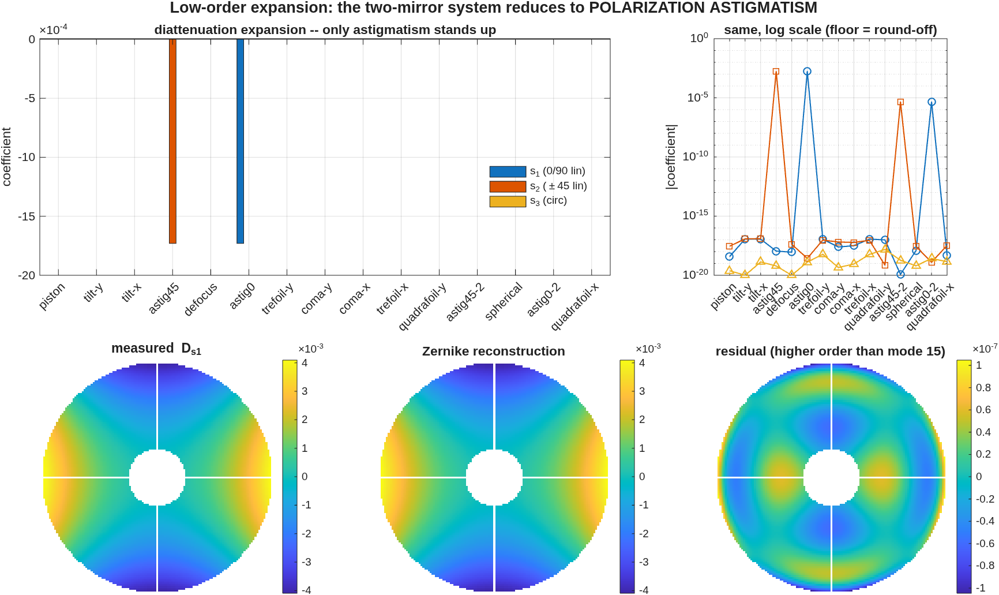

<!-- GENERATED FILE -- do not edit.
     Source: 30_phase2_jones.md.in
     Numbers: generated/numbers.json (MATLAB driver)
     Regenerate: make polval-regen  (docs/macos-manual)
-->
# Phase 2a/2b — Jones pupil and polarization-aberration maps

The engine has no Jones matrix. `macos.jones_pupil` builds one the standard
polarization-ray-trace way, entirely in the binding layer: trace twice with
orthogonal input states, harvest the per-ray vector field and the ray
geometry at the chosen element, and assemble a 2×2 complex Jones matrix at
every pupil point. `macos.pol_maps` then decomposes it per point into
diattenuation and retardance via a closed-form 2×2 polar decomposition in the
Pauli basis.

Vignetted points are `NaN`, never zero — zero-filling would seed every pupil
statistic with a ring of perfect nulls.

## 2.1 Unitarity gate

**Claim.** A lossless, polarization-neutral system produces a Jones pupil
that is unitary times a scalar at every unvignetted point.

This is the single most diagnostic cheap test available: it catches basis
errors, normalization errors and sign errors together. The stock Cassegrain
mirrors carry the engine's perfect-conductor idiom (`IndRef=1`,
`Extinc=1e22`), which gives `RP = RS = −1` to ~1e-22 — so any stock conductor
prescription is a unitarity gate for free.

| Quantity | Measured | Truth |
|---|---|---|
| unvignetted pupil points | 11484 | — |
| max diattenuation `D` | 2.61e-15 | 0 |
| max retardance `δ` | 5.79e-16 rad | 0 |
| longitudinal leak, max &#124;E·k̂&#124;/&#124;E&#124; | 5.25e-17 | 0 |

**Transmission uniformity — a worked case of the statistic exceeding the
physics.** The transmission map takes only 32 distinct
double-precision values across the whole pupil; its true peak-to-valley
spread about the median is 6.09e-15 and its RMS is 9.26e-16. But
`mean()` over 11484 points accumulates its own summation error of
5.06e-14 — *larger than the spread it is being used to measure*. So
the `std/mean` statistic that the CI gate asserts, 5.06e-14, is
dominated by that floor rather than by any property of the optical system.
It remains a perfectly valid upper bound, and the gate is sound; it is simply
not a measurement of non-uniformity. The figure panel is therefore referenced
to the median (an exactly selected element, no accumulation), and both
numbers are published so the gap is evidenced rather than asserted.

**Pinned by** `tJonesPupil/test_unitarity_gate` (mmacos),
`test_jones_pupil.py` (pymacos).

## 2.2 Fresnel-analytic gate

**Claim.** The per-ray reflection coefficients the engine produces at a
coated surface match the closed-form Fresnel result.

This is ladder rung 1 — exact analytic truth, no reference code involved. The
rig is a 45° flat fold with an optically thick aluminium layer (skin depth
~13 nm, layer 200 nm), emitted by the bench builder. The comparison is made
on the **ratio** `RS/RP`, which is convention-free: the launch-frame and
exit-frame factors cancel, so there is nothing to fit and no sign ambiguity
to argue about.

| Quantity | Measured | Truth |
|---|---|---|
| unvignetted rays | 1257 | — |
| AOI spread over the footprint | 43.28° … 46.72° | — |
| max &#124;RS/RP&#124; residual | 1.20e-14 | 0 |
| max arg(RS/RP) residual | 3.16e-14 rad | 0 |
| max per-ray diattenuation residual | 1.12e-14 | 0 |
| mean diattenuation of the Al fold | 0.0341 | closed form |

The AOI spread matters: the gate is not a single-angle coincidence but a
curve match across the beam footprint, magnitude *and* phase.

This gate is also the regression anchor for engine defects 2 and 3 in
*Conventions*. If the signed-cosine defect returns, the measured-to-analytic
ratio becomes exactly `(RP/RS)²` — a signature, not just a failure.

**Pinned by** `tJonesPupil/test_fold_fresnel_analytic`.

## 2.3 Rotational-symmetry (2θ) invariant

**Claim.** An on-axis rotationally symmetric system produces diattenuation
whose axis is locked to the pupil azimuth — the characteristic 2θ pattern —
with no circular component, growing with radius as the angle of incidence
grows off-axis.

Cheap, strong, and highly basis-sensitive: a broken reference frame breaks
the symmetry. Both Cassegrain mirrors are aluminium-coated for this test.

The centre panel draws the diattenuation axis as a *director* (headless,
double-ended) because it is defined only mod π. The tangential pattern it
traces is the signature being tested.

| Quantity | Measured | Truth |
|---|---|---|
| azimuth-lock residual, max | 2.18e-13 rad | 0 |
| max circular diattenuation component | 3.15e-16 | 0 |
| D(outer ring) / D(inner ring) | 4.12 | > 1, grows with AOI |

Reported separately, per the convention stated in the frontmatter:

| | Measured |
|---|---|
| pupil-**mean** diattenuation | 2.258e-03 |
| pupil-**variation** (RMS) diattenuation | 1.140e-03 |

The mean is a state change; only the variation can drive a contrast floor or
a phase-shifting interferometry systematic. For this aluminium Cassegrain the
two are the same order, which is exactly why quoting a single conflated RMS
would be misleading.

**Pinned by** `tJonesPupil/test_2theta_symmetry`.

## 2.4 Reference-frame artifact: double-pole vs local s/p

**Claim.** Diattenuation is invariant to the output basis; retardance is not,
and the local s/p basis imprints a large artifact that the double-pole basis
does not.

The 3×3 polarization-ray-trace matrix is basis-independent, but the 2×2 Jones
pupil is not. The naive local s/p basis carries a coordinate singularity on
axis which appears as spurious tilt- and astigmatism-like retardance. At the
levels a coronagraph contrast budget cares about, that artifact can exceed
the physics — which is why the default basis is double-pole and why
`local-sp` is documented as diagnostic-only, never for budget numbers.

| Quantity | Measured | Expected |
|---|---|---|
| D basis-invariance residual | 6.70e-16 | 0 (singular-value invariant) |
| retardance variation, double-pole | 3.607e-03 rad | the physics |
| retardance variation, local s/p | 8.913e-01 rad | physics + artifact |
| artifact inflation factor | 247.1× | ≫ 1 |

The left and centre panels are the argument in one picture: the double-pole
retardance is a smooth radial map at the 3.607e-03 rad level, while the
same system in the local s/p basis shows a full-scale azimuthal pattern
spanning most of [0, π]. The right panel confirms that diattenuation, being a
singular-value invariant, is unmoved at 6.70e-16.

**Pinned by** `tJonesPupil/test_basis_invariance_and_sp_artifact`.

## 2.5 Low-order expansion — the two-mirror literature form

**Claim.** Expanded onto a Zernike basis, an on-axis rotationally symmetric
two-mirror system reduces to **polarization astigmatism** and nothing else.

This is the gate that makes MACOS results comparable with the published
polarization-aberration literature, which is written in aberration terms
rather than as maps. `macos.pol_zernike` performs the expansion (a
least-squares fit — on an obscured pupil circular Zernikes are not
orthogonal, so a projection would cross-talk).

The prediction from standard theory is sharp. Diattenuation at a metal
mirror grows as the square of the angle of incidence, the angle of incidence
grows linearly with pupil radius, and the axis is locked to the pupil
azimuth. So the maps go as ρ²·cos2θ and ρ²·sin2θ — which in the Pauli
representation is *exactly* astigmatism: `astig0` in s₁, `astig45` in s₂,
equal magnitude, with no circular content and no defocus.

| Quantity | Measured | Truth from theory |
|---|---|---|
| astig0 coefficient, s₁ | -1.7294e-03 | — |
| astig45 coefficient, s₂ | -1.7294e-03 | equal to astig0 |
| astig pair mismatch | 1.89e-07 | 0 |
| retardance astig0, s₁ | 8.9982e-03 rad | — |
| largest **other** linear coefficient | 7.18e-15 | 0 |
| largest **circular** (s₃) coefficient | 8.86e-16 | 0 |
| ρ⁴ astigmatism companion | 2.60e-03 | present, sub-dominant |

Every term the theory forbids — piston, tilt, defocus, coma, trefoil,
spherical, and the entire circular component — sits at 7.18e-15 of the
astigmatic term, which is round-off. The one additional term theory *does*
allow, the ρ⁴ companion arising because the angle of incidence is not
exactly linear in pupil radius across a real conic pair, is present at
2.60e-03 — sub-dominant, as it should be.

**The radial law, checked independently.** The diattenuation *magnitude* map
is rotationally symmetric to 1.04e-07, so it expands into piston and
defocus alone — which is precisely what a ρ² profile looks like in a Zernike
basis. Extrapolating that fit to the centre of the pupil gives
3.21e-05 of the edge value. That is a real prediction being met: at
normal incidence there is no diattenuation, the pupil centre is obscured so
no data constrains it, and nothing in the fit was told to arrange it.

Modes 1–15 leave 2.97e-10 of the linear maps' variance uncaptured —
a residual RMS of 1.80e-05 relative to the astigmatic term
(condition number 1.357 over this annulus). That remainder is real
higher-order content, visible as a smooth pattern in the residual panel of
the figure, not noise: worth stating, because a fit that captured everything
would more likely mean the basis was fitting itself than that the physics
had exactly 15 terms.

**Scope of the comparison.** This is a match against the *analytic form*
predicted by the literature — the 2θ azimuthal structure, the quadratic
radial law, the vanishing circular component. It is **not** a numeric
regression against a specific published two-mirror system; no such system is
set up here, and rung 5 of the validation ladder stays partly open for that
reason. What the expansion buys is that such a comparison is now a
term-by-term exercise rather than a map-shape argument.

**Pinned by** `tJonesPupil/test_pol_zernike_two_mirror_form` and
`test_pol_zernike_synthetic_recovery` (mmacos), with the same two gates
mirrored in `test_jones_pupil.py` (pymacos). The synthetic gate builds the
maps *from* known coefficients on an annulus and requires them back exactly,
which is what pins the fit itself rather than the physics.

*Sampling note.* The astigmatic pair matches to 1.89e-07 rather
than to round-off. That residual is pupil discretization, not physics:
measured 1.9e-7 at model size 128 and 5.8e-8 at 256, identical for
diattenuation and for retardance. The related non-symmetric term in the
magnitude map is quadrafoil-**x** (cos4θ) while quadrafoil-**y** (sin4θ)
stays at 1e-17 — a square pixel grid is four-fold symmetric about its own
axes, and physics on a rotationally symmetric system has no way to prefer
them.

## 2.6 Decomposition algebra

`macos.pol_maps` is pure MATLAB/NumPy and is gated independently of the
engine against a synthetic diattenuator-times-retarder product, whose
diattenuation, retardance magnitude and retardance axis are recovered
exactly. The near-π retardance branch ambiguity — where `(δ, n̂)` and
`(2π − δ, −n̂)` are indistinguishable — raises an explicit `ambiguous` flag
rather than silently picking a branch.

**Pinned by** `tJonesPupil/test_pol_maps_synthetic_identity`.
