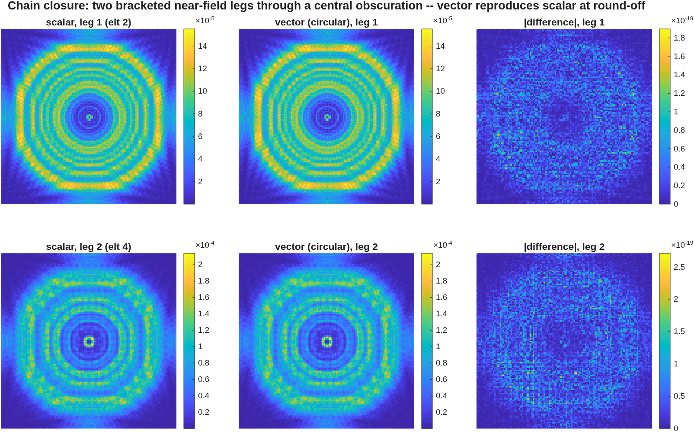
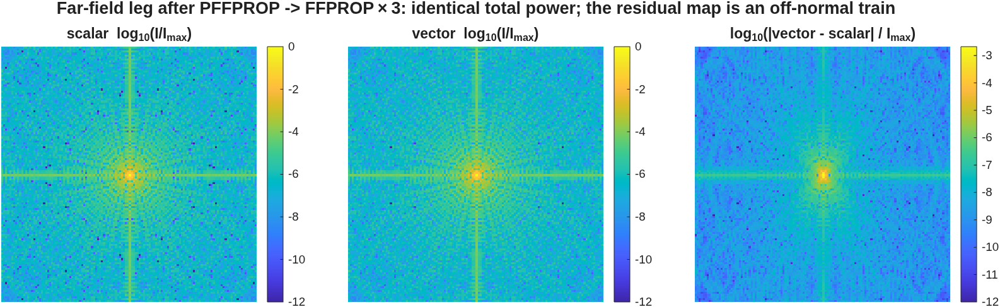

<!-- GENERATED FILE -- do not edit.
     Source: 40_phase3a_chain.md.in
     Numbers: generated/numbers.json (MATLAB driver)
     Regenerate: make polval-regen  (docs/macos-manual)
-->
# Phase 3a Tranche 1 — vector propagation across the chain

Before this work, vector diffraction covered exactly one propagation leg —
the far-field FFT — and the polarized field assembly rebuilt the diffraction
grid from the rays at *every* physical leg, erasing whatever the previous leg
had diffracted. A physical-optics chain (pupil → focal-plane mask → Lyot →
focal) therefore could not preserve a vector field, whatever the kernel
coverage.

Tranche 1 closes the chain for **mask-type** systems: those whose elements
between physical legs are non-polarizing (obscuring, reference, focal plane),
so the per-ray transfer between legs is a scalar phase and a per-plane scalar
update is exact. Chains with coated or reflective surfaces *between* legs
need the running per-ray Jones transfer of Tranche 2, which is not done — see
*Coverage and gaps*.

## What changed

* Every leg now loops the same scalar kernel over the three Cartesian
  component planes: near-field, plane-to-plane, sphere legs, the
  sphere↔plane transforms, Fresnel and both DFT legs. The loop range collapses
  to a single iteration in scalar mode, so **scalar paths stay bit-identical**.
* The bare per-component far-field FFT was retired in favour of the scalar
  far-field kernel run three times, so vector and scalar far-field legs now
  share one kernel by construction. It had omitted the Fresnel-integral output
  factors — harmless for a terminal intensity hop, fatal for a chain, because
  the output curvature is the next leg's input.
* The field assembly now **seeds once and then updates**, applying the same
  incremental geometric phase the non-polarized branch always used.
* Masks are applied to all three planes, each call handed a fresh copy of the
  obscuration frame (the mask routine re-orthogonalizes its argument in
  place).

**Per-component propagation is rigorous, not an approximation.** In a
homogeneous isotropic medium each Cartesian component of a monochromatic
field independently satisfies the scalar Helmholtz equation; component
coupling enters only through boundary conditions, which the engine already
handles per ray via the s/p machinery at each surface. Applying the same
scalar kernel to each component introduces no vector-specific approximation.
The vector legs inherit exactly the scalar legs' paraxial validity envelope —
no better and no worse.

## A third defect, found while implementing

`RayE` carries no aperture clipping: the surface routines report vignetting
through a separate flag and never zero the field. Seeding the grid from it
therefore *resurrected rays that the ray-side masking had already
extinguished*. Both polarized branches now gate the seed on the ray-pass
flag.

The consequence is a strong, cheap invariant that did not previously hold and
is now gate 3.1 below: **polarization-on with vector diffraction off is
bit-identical to polarization-off.** It was wrong by 0.21 .. 0.38
relative error before the fix.

## The gate prescription

`Rx_VecChain.in` is built so that the comparison is **exact by construction**
rather than defended by a tolerance: a collimated on-axis source through flat,
normal-incidence, uncoated planes. The ray field direction is then a constant
unit vector, the field factorises as `E_k = e_k · u(x,y)`, and propagating
the three planes separately and summing `Σ|E_k|²` must reproduce the scalar
intensity to round-off — for *any* input polarization state. Two bracketed
near-field legs distinguish a seed-once implementation from a reload-every-leg
one, and a central obscuration on the intermediate stop puts the mask on the
vector path.

**The 45° and circular input states are load-bearing.** With an x-only source
all the energy sits in component plane 1, which even the old single-plane
propagator carried correctly — so an x-polarization-only gate passes
vacuously. This was confirmed by rebuilding the pre-fix engine and re-running:
it fails these gates at 0.21 .. 0.38 relative error and mis-states
total power by 4-7% *(external, captured 2026-07-26 —
historical, requires rebuilding the pre-fix engine)*.

## 3.1 Polarized-scalar reduces exactly to the scalar path

**Claim.** With polarization on and vector diffraction off, the engine
reproduces a polarization-off run exactly — same seed amplitude, same
incremental phase, same vignetting.

| Quantity | Measured | Truth |
|---|---|---|
| bitwise equal at both legs | 1 | 1 (true) |

Bitwise, not to a tolerance. **Pinned by**
`tVecChain/test_polarized_scalar_is_bit_identical`.

## 3.2 Vector equals scalar at every leg, every input state

**Claim.** On the polarization-neutral gate train, the vector chain
reproduces the scalar intensity at round-off after each leg, for every input
polarization state.

Normalized-shape residual, `‖v/Σv − s/Σs‖ / ‖s/Σs‖`:

| Input state | Leg 1 | Leg 2 |
|---|---|---|
| x-polarized | 4.50e-16 | 6.42e-16 |
| 45° linear | 4.50e-16 | 6.42e-16 |
| circular | 4.50e-16 | 6.42e-16 |

Worst case over all states and legs: **6.42e-16**, against a truth of
exactly zero. The difference panels in the figure are at the 1e-19 level
against intensities of 1e-5 to 1e-4.

**Pinned by** `tVecChain/test_vector_equals_scalar_every_state`.

## 3.3 Energy conservation per leg

**Claim.** Each vectorized kernel preserves `Σ|E|²` to round-off — the FFT
core is unitary and the three component planes partition the scalar norm.

| Leg | Total-power residual vs scalar |
|---|---|
| 1 | 0.00e+00 |
| 2 | 1.23e-16 |

**Pinned by** `tVecChain/test_energy_conserved_per_leg`. This is rung 1 of the
validation ladder.

## 3.4 Masks act on the vector path

**Claim.** An amplitude mask costs the vector run the same fraction of the
power it costs the scalar run.

A 0/1 transmittance is a diagonal Jones matrix `t·I`, so it must apply
identically to all three planes. If the ray-side masking were still
single-plane, the stale Ey/Ez planes would keep their share of the blocked
power.

| Quantity | Measured | Truth |
|---|---|---|
| leg2/leg1 throughput, scalar | 0.969658 | — |
| worst throughput mismatch, vector | 1.14e-16 | 0 |

This compares *throughput* rather than looking for the obscuration's shadow,
deliberately: at this Fresnel number the centre of the obscuration is an Arago
bright spot, not a null, so a "is there a shadow" test would be testing the
wrong thing.

**Pinned by** `tVecChain/test_mask_throughput_identical_on_vector_path`.

## 3.5 Far-field normalization A/B

**Claim.** Now that the vector far-field leg runs the scalar kernel per
plane, its total power equals the scalar total exactly.

This was an intended normalization change: the retired routine applied only
a bare per-component transform, omitting the Fresnel output factors.

| Quantity | Measured | |
|---|---|---|
| scalar total power | 1.815495e+06 | |
| vector total power, **before** the fix | 8.937660518e-01 | *(external, historical)* |
| vector total power, after | 1.815495e+06 | |
| vector-vs-scalar total residual | 1.54e-15 | truth 0 |

**Pinned by** `tVecChain/test_far_field_vector_matches_scalar_normalization`.

### An unverified attribution, carried forward

This prescription is a real off-normal train, so vector and scalar
intensities are *not* expected to agree pointwise — only in total power. The
measured map difference is 2.56e-03.

That difference is *believed* to be the train's out-of-plane field content.
The order is right: at the exit pupil the ratio |Ez|/|Ex| has median
3.82e-02 and maximum 8.79e-02 over 11484 unvignetted
rays. **But it is not verified.** There is no plane-selectable complex-field
getter, so the per-plane contribution to the propagated intensity cannot be
isolated and the attribution cannot be tested. It is a plausible explanation,
not a validated one.

Nothing in this document depends on it: the assertions *bound* the difference,
they do not explain it. A plane-selectable complex-field getter would close it
out, and Phase 2c's co/cross-polarized decomposition needs the same
capability, so it should probably land there.

*(When probing per-ray fields for this kind of check: gate on the ray-pass
status first. Obscured rays carry a zero field, and `atan2(0,0)` returns 0,
which reads convincingly as "zero phase, zero out-of-plane content".)*

## 3.6 Validated scalar physics is undisturbed

**Claim.** Vectorization does not perturb the scalar results that were
previously validated against PROPER. This is the strongest available gate on
the change, because it is the one comparison with an independent code.

Re-running the pymacos PROPER-comparison suite with polarization on
reproduces the committed scalar-to-PROPER residual of 4.836e-13
exactly, for both polarization-off and polarization-on/vector-off. With
vector diffraction on, the near-field leg differs by 1.3e-2 at
identical total power — the same unverified out-of-plane attribution
discussed above applies, and is likewise not relied upon.

Suite status at the landing: 26/26 PROPER comparisons,
6645 pass in the pymacos suite, 412 pass, 0 fail in the mmacos
suite. *(All external, captured 2026-07-26.)*

This is rung 3 of the validation ladder, and the only rung on this page that
involves a second implementation.
