## SECTION 2: Technical Overview

This section provides a technical orientation to Modeling and Analysis for Controlled Optical Systems, providing brief reviews of geometric and physical optics. Though in the form of a tutorial, it is intended mainly as a summary of definitions and approach.

### Geometry and Coordinate Systems

Optical systems are composed of *elements* — mirrors, lenses, detectors, gratings, holographic optical elements, and others — that have optical properties. These optical ele-ments are distributed in 3-space, which is to say, they are placed at different locations. *Where* they are located is of critical importance. Telescopes, cameras, optical systems in general depend on precise element positioning to achieve good optical performance.

Equally important is element *orientation*—where each element is pointed. Angles of reflection or refraction of a light beam depend on the orientation in 3-space of each surface in the system.

#### Global Coordinates

MACOS requires the user to specify the locations and orientations of elements using vectors in a single *global coordinate system,* as opposed to the usual approach of specifying each optical element relative to the preceding element. A single user-defined coordinate system is often more convenient when preparing models to be integrated with structural models: the structural coordinates can be used for the optical model as well. It facilitates checking results, especially for decentered and tilted systems. A global coordinate system also eliminates unnecessary calculations from the ray-trace. All MACOS calculations are actually done in the user-specified global coordinate system (Ref. Redding and Breckenridege). Specifying the system in those coordinates eliminates coordinate transformations as well as ray calculations at dummy surfaces. The result is significantly faster execution times.

To illustrate the choice of a global coordinate system, consider the simple 2-mirror Cassegrain telescope drawn in Figure 1.

In this optical system there are three optical elements: the primary mirror (PM); the secondary mirror (SM); and a focal plane (FP). Two possible global coordinate system are

-   The structural coordinate frame (*Frame A)*, which would be shared by structural models, simplifying integration of optics and structures models.

-   A frame centered at an optical element, such as the primary mirror, and aligned with the optical axis of the system (*Frame B*). This frame is more natural for optical layout. It can also be convenient when comparing results with optical design programs.

The location of each element is defined in MACOS using a 3-vector called VptElt (for “vertex point”). For the primary mirror of our example, VptElt is drawn from the origin of the global coordinate system to the vertex of the element, which is shown as the small circle. VptElt is indexed by 1=x, 2=y, 3=z coordinate values. For planes and

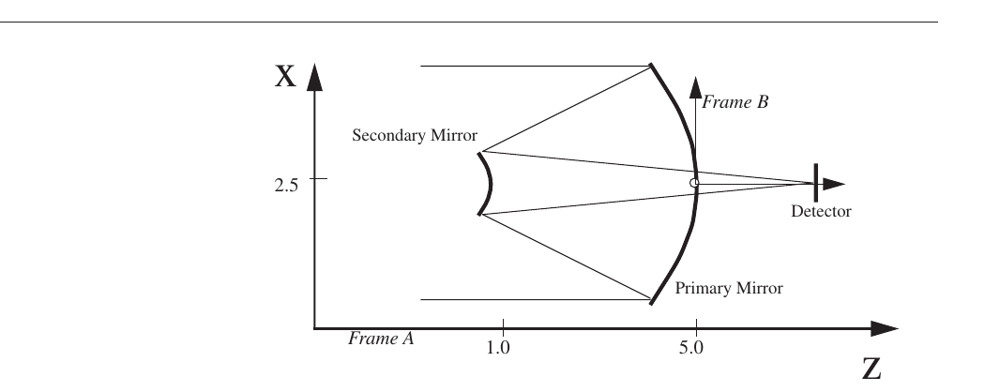

**FIGURE 1** Coordinate systems for the Cassegrain telescope example.

spheres, which have no unique vertex, VptElt can be any point on the surface. For the two example frames, VptElt takes values as listed in Tables 1 and 2

**TABLE 1.** Primary mirror location specification

+-----------------------+-----------------------+----------------------+
| **Location**          | **Frame A**           | **Frame B**          |
+=======================+=======================+======================+
| VptElt(1)             | 2.5                   | 0.0                  |
+-----------------------+-----------------------+----------------------+
| VptElt(2)             | 0.0                   | 0.0                  |
+-----------------------+-----------------------+----------------------+
| VptElt(3)             | 5.0                   | 0.0                  |
+-----------------------+-----------------------+----------------------+

**TABLE 2.** Secondary mirror location specification

+-----------------------+-----------------------+----------------------+
| **Location**          | **Frame A**           | **Frame B**          |
+=======================+=======================+======================+
| VptElt(1)             | 2.5                   | 0.0                  |
+-----------------------+-----------------------+----------------------+
| VptElt(2)             | 0.0                   | 0.0                  |
+-----------------------+-----------------------+----------------------+
| VptElt(3)             | 1.0                   | -4.0                 |
+-----------------------+-----------------------+----------------------+

Comparing the intervertex spacings of the two mirrors (the difference of the PM and SM VptElt), you can see that they are the same in either frame. It does not matter what frame is used, provided the relative location of each element is correct.

**FIGURE 2** Principal axis directions

The orientation of each element is specified by a *unit-vector* (a 3-vector of length 1) called PsiElt. For conicoid elements PsiElt is the *principal axis direction* of the element surface: the direction of a line drawn from the vertex of the element towards the nearest geometric focus. Figure 2 shows the principal axis for elliptical and paraboloidal mirrors. The principal axes for spheres or flats, which have no unique vertex, are defined from VptElt.

For the primary and secondary mirrors in our example, the principal axes are pointed in the negative z direction (Table 3). Since Frame A and Frame B have the same orientation, (they differ only in translation) the values of PsiElt are the same in both coordinate frames.

**TABLE 3.** Mirror orientations

+-----------------------+-----------------------+----------------------+
| **Orientation**       | **Primary Mirror**    | **Secondary Mirror** |
+=======================+=======================+======================+
| PsiElt(1)             | 0.0                   | 0.0                  |
+-----------------------+-----------------------+----------------------+
| PsiElt(2)             | 0.0                   | 0.0                  |
+-----------------------+-----------------------+----------------------+
| PsiElt(3)             | -1.0                  | -1.0                 |
+-----------------------+-----------------------+----------------------+

Detailed discussion of how elements are specified is provided in Section 4.

#### Local coordinates

MACOS allows the user to explicitly specify three types of local coordinates: *element coordinates*, *output coordinates*, and *surface coordinates*. Also important, but not explicitly set at each surface, are *beam coordinates*.

*Element coordinates* allow the user to simulate optical *actuators*, such as steering mirrors or translation stages, by defining coordinates local to the controlled element and aligned with the actuator axes. Actions of the steering mirror are rotations about, or translations along, that axis, and are easily implemented via the MACOS PERturb command (see Section 5.3.7). These *element coordinates* can also be imbedded into a linear model of the system using the MACOS BUIld and EXPort commands (see Sections 8.2.1 and 3.8.5). This enables creation of optical models directly in terms of actuator actions.

*Output coordinates* are used when calculating certain graphical outputs, such as spot diagrams. They help define sensing axes for simulating *detectors* (e.g., rows and columns of CCDs). When embedded in a linear model, they define the optical outputs of that model by selecting and transforming the optical states into combinations specified by the user.

Element coordinates are centered at a *rotation point*, specified as a 3-vector RptElt, which is the (0,0,0) point of the element coordinate system expressed in global coordinates. All rotations imparted to the element through the PERturb function are about RptElt.

The element coordinate axes are 6-vectors which describe rotational and translational perturbation to the element. Each 6-vector consists of two 3-vectors designating the rotation and translation, respectively. Usually an element will be actuated in rotation or translation only, but the option exists to use coupled rotation/translation coordinates.

*Surface coordinates* are required to define propertires of certain surface types, such as Zernike surfaces, and are described in Section 4.

*Beam coordinates* define the orientation of the ray and diffraction grids at particular elements. They are initially defined at the source, and propagated to each subsequent optic by the ray tracing process. In general they are not the same at each element (due to tilting, rotating and inverting properties of the optical system). Beam coordinates can be computed at any surface using the MACOS COORD command.

### Geometric Optics: Tracing Rays

Geometric optics capture the *particle nature* of light. In geometric optics, light beams are represented as bundles of *rays*, which are the trajectories of individual photons. Rays are generally composed of numerous straight-line segments, with direction changes at the reflective or refractive surfaces of optical elements (curved segments occur in regions of continuously changing refractive index). *Ray-tracing* is the process of propagating a bundle of rays through an entire optical system.

Ray-tracing is an extremely valuable tool for determining the performance of optical systems. For example, characteristics of a well-designed imaging system include an extremely small *spot diagram* at the detector focal plane. Spot diagrams are plots of the pierce points of a ray bundle on a surface, and a small spot indicates a tight focus. An example is provided by the Cassegrain telescope of Figure 3. Two spot diagrams are shown in Figure 4. The unaberrated telescope indeed has a focus at a single spot (diameter is approximately 10-10 in arbitrary units). Misaligning the primary mirror causes the spot to spread as shown in Figure 4 to approximately 2x10-8.

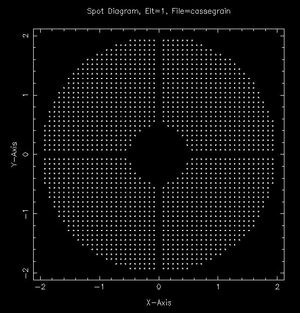{width="2.9811023622047244in" height="3.1102362204724407in"}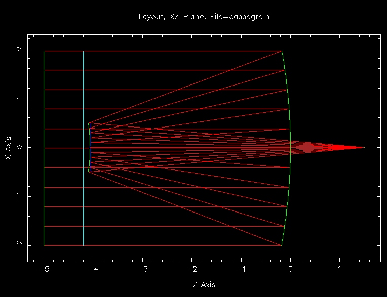{width="3.819291338582677in" height="2.9354330708661416in"}

Spot diagram at entrance pupil

Cross-section of ray-trace

**FIGURE 3** Ray trace of a Cassegrain telescope

As another example, interferometer systems can be evaluated by calculating the flatness of two interfering wavefronts at a pupil of a system. The wavefront of an extended beam is accurately represented by an *Optical Path Difference* (OPD) map at a particular surface, such as the beam-splitter where the interference is to take place.

The predictions of geometric optics are exact only in cases where the wavelength of the light is infinitely small. Of course, no such system exists. Geometric optics do provide extremely good predictions in a wide range of cases, where wavelengths are small compared to the dimensions of the optical system. Even in systems with long wavelengths and large diffraction effects, geometric optics are useful for determining the best design conditions.

One thing that ray-tracing cannot do is predict the intensity pattern of a focused spot. For that, use the image simulations features decribed in Section 7.

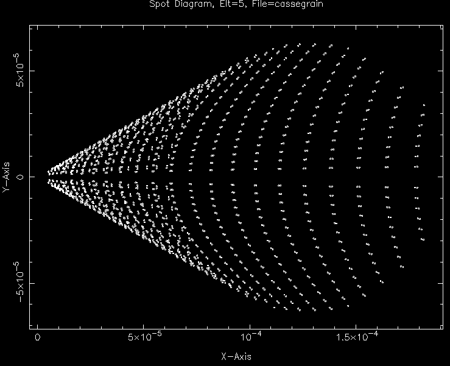{width="3.695275590551181in" height="3.0in"}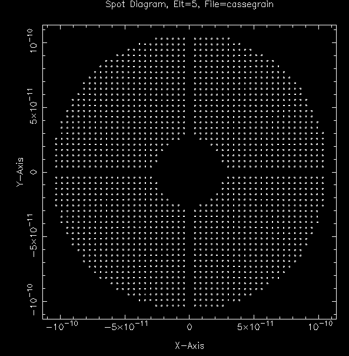{width="2.9618110236220474in" height="3.017322834645669in"}

Focal plane spot diagram Focal plane spot diagram

(unaberrated system) (primary mirror tilted 1e-4 radians)

**FIGURE 4** Spot diagrams for Cassegrain.in.

Near-focus is a region where diffraction effects dominate, as a perfectly-focused spot is itself infinitely small. For this case as well as others, *physical optics* approaches must be employed. Physical optics capture the wave nature of light and can accurately account for diffraction around obstructions, or in tightly focused beams, or at diffraction gratings. The MACOS approach to physical optics is discussed in the Section 6.

The exit pupil is a conjugate (an image) of the aperture stop of the system. For the Cassegrain telescope example, the entrance pupil is located at the primary mirror. A point source at the primary produces a virtual image behind the secondary mirror (see Figure 5). The exit pupil is a spherical “reference” surface at the virtual image point, with center of curvature on the focal plane. This surface coincides with the nominal spherical wavefront converging on the geometric focus.The OPD distribution at the exit pupil determines the image quality. Perfect optical systems have zero OPD; the wavefront leaving the optical system is spherical. In an aberrated optical system the OPD is non-zero as shown in Figure 6.

### Physical Optics: Diffraction

Physical optics capture the *wave nature* of light. In physical optics, Huygen’s Principle states that each point within a beam of light radiates a spherical wave of light. A *wave-front* is the envelope of all the waves emitted at a particular instant of time. Waves of light propagate through an optical train by bouncing off of mirrors or bending through lenses, much as predicted by geometric optics. Unlike geometric optics, however, physical optics predicts that light can leak back into areas of shadow, or areas outside of the edge of the geometric beam. This process is *diffraction* and is important when modelling images, the propagation of beams over long distances, and other phenomena.

Exit pupil at virtual image

Point source on stop

{width="0.10551181102362205in" height="0.4515748031496063in"}{width="0.13543307086614173in" height="0.11535433070866141in"}{width="0.13622047244094487in" height="0.11377952755905511in"}{width="0.13543307086614173in" height="0.11535433070866141in"}{width="0.13622047244094487in" height="0.11377952755905511in"}Primary Mirror

Focal Plane

**FIGURE 5** Exit pupil for Cassegrain.in

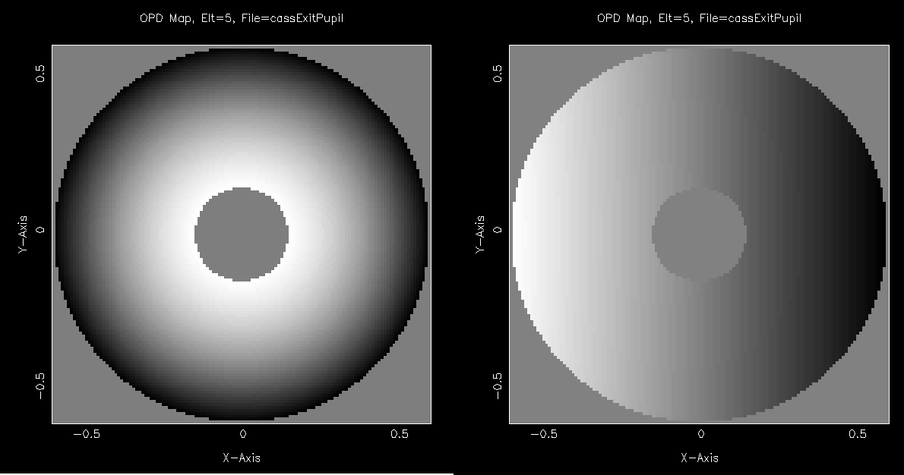{width="5.949305555555555in" height="3.129861111111111in"}

Unaberrated (defocused) Aberrated OPD (coma)

**FIGURE 6** OPD at the exit pupil

The physics underlying diffraction and the free-space propagation of light are captured in Maxwell’s equations. Physical optics theories have simplified these equations, enabling practical solutions to optical problems. *Scalar diffraction theory* assumes time invariance and ignores polarization effects (Ref. Goodman). *Fresnel propagation theory* further assumes that the beam is paraxial, or a small beam divergence/convergence. This allows the expression of the propagation of light from one planar surface to another planar surface in terms of the *paraxial wave equation*.

Geometric optics is the solution of Maxwell’s equations in the limit of an infinitesimally small wavelength. This is a good approximation for many practical optics problems.

Diffraction effects start to dominate the propagation of a beam when the beam size approaches its wavelength (i.e., near focus), or when the dimensions of a surface approaches the beam wavelength (i.e., diffraction grating grooves), or when the beam is projected over distances exceeding its Rayleigh length (Ref. Goodman, Siegman).

The paraxial wave equation can be solved using two-dimensional Fourier transformations for free-space propagation between planes. MACOS implements these using computationally efficient fast Fourier transforms (FFTs). Care must be taken when using Fourier optics because of the approximations inherent in the Fresnel assumptions. Using FFTs brings additional concerns of *sampling density*, *aliasing* and *wrap-around*. Violating the Fresnel conditions, or sampling incorrectly, can affect the accuracy of computed results. MACOS provides several features to help you set problems up correctly.

In a physical optics computer model, the light beam is evaluated on *reference surfaces*. These are “dummy” surfaces located in the beam and aligned to the beam. They have no optical effect and are essentially transparent screens on which the beam is sampled.

The light on the reference surface is represented as a *complex matrix*, each element of which is the complex amplitude of the scalar field at a particular location. These locations are distributed as a regular rectangular grid of points across each reference surface (Fig. 7). Light is *propagated* between these reference surfaces using algorithms based (in the case of Fresnel diffraction) on the solutions to the paraxial wave equation.

The complex amplitudes can be interpreted as having *magnitude* and *phase*. Viewed geometrically, the phases describe the OPD (see Fig. 8). If a reference surface is not aligned with a particular wavefront, the phases will vary “rapidly” across the reference surface grid. On the other hand, if the reference surface is nearly aligned with the wave-front, the phases vary only slowly. The magnitude describes the amplitude of the electromagnetic field across the exit pupil.

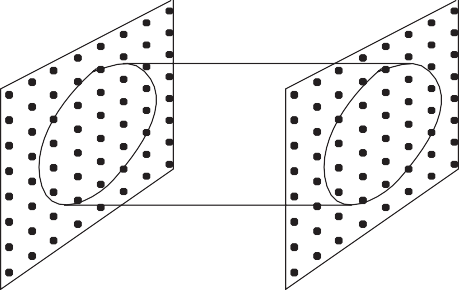{width="2.3916666666666666in" height="1.5069444444444444in"}First reference surface

Second reference surface

**FIGURE 7** Sampling grid for a collimated beam

*Sampling* refers to the density of samples per phase crossing. The FFT algorithm works quite well when there are many (at least 4 to 8) sampling points per phase crossing.

When there are fewer, the ability of the FFT to capture higher spatial frequency effects is diminished. This difficulty can become acute when trying to sample diverging or converging waves using planar reference surfaces. Fortunately, this is not necessary. A coordinate transformation (Ref. Sziklas and Siegman) allows the paraxial wave equation to be applied to converging or diverging beams, by removing the spherical component of phase from the light. This is equivalent to sampling the light on a *spherical reference surface*.

Sampling on a sphere takes out the need to sample the spherical part of the wavefront.

Sampling on a plane must be higher to capture the spherical part of the wavefront.

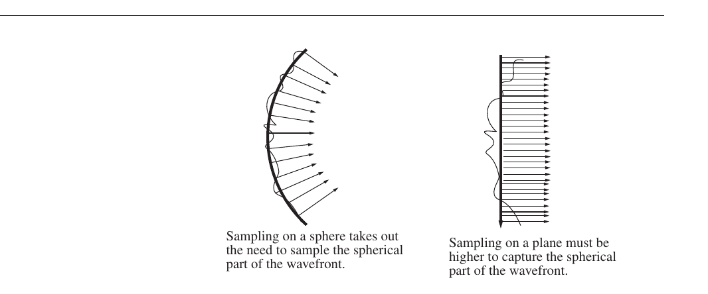

**FIGURE 8** Sampling a converging beam

Using a spherical reference surface in a converging or diverging beam allows the sampling to be determined by the aberrations in the beam, which are the phase distortions, or the deviations from the nominal spherical wave. This vastly reduces the sampling requirement for most optics problems.

Whether planar or spherical reference surfaces are to be used to sample a particular light beam depends on the curvature of the wavefronts that make up that beam, and also on the width of the beam. MACOS has functions that allow the geometric determination of the curvature. These functions fit pairs of reference surfaces into the beam at specified points, setting up near-field propagations.

The width of the beam grid relative to the amplitude grid is set to avoid aliasing. *Aliasing* is an artifact of the FFT algorithm, which transforms amplitudes distributed in space to frequencies distributed in the spatial frequency domain. Because the FFT is a periodic calculation, the frequencies computed for the amplitudes are replicated at higher frequencies. If the beam is too wide compared to the extent of the amplitude matrix, some of the replicated “beams” can leak back into the main beam. This effect is aliasing.

The main symptom of aliasing in a diffraction computation is a “noisy looking” beam intensity pattern. Aliasing causes spikes to appear in the beam. These are usually most pronounced in regions of high intensity. Aliasing can be minimized by *padding* the amplitude matrix so that the gridpoints that coincide with the beam occupy about half of the width, or about a quarter of the area of the grid (Figure 9). The padding has the effect of restricting aliasing to very high-frequency effects which are usually of quite low amplitude. Additional padding can be specified by using smaller values of the nGridPts parameter, which governs the relative size of the ray and diffraction grid.

MACOS does not currently provide shaped windowing features.

The width of the beam in regions far from focus is determined geometrically. When the beam is small compared to the wavelength, the width is determined largely by diffraction considerations. Near focus, diffraction effects dominate. MACOS is set up to automatically require adequate padding in diffraction calculations for imaging systems.

Nonetheless, the user is urged to be aware of the rules for constructing diffraction models, as discussed in Section 6. Good discussions of these issues are available (Ref.

Lawrence).

The shape and quality of the *point-spread function* (PSF) are a good indicator of the performance of the optical system. The PSF is the image or intensity pattern due to a point

1/4 L 1/2 L 1/4 L

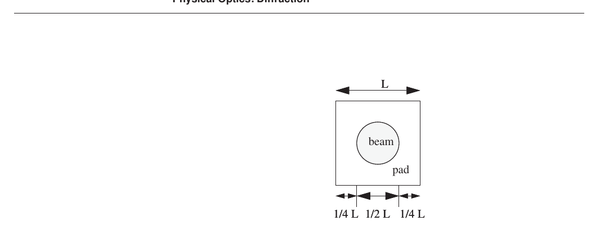

**FIGURE 9** Padding the amplitude matrix.

source. Without aberrations, geometrical optics predicts infinitely small images: a delta function of infinite amplitude and zero width. Alas due to diffraction from finite sized apertures of the optical system, the PSF is never a delta function. If the aberrations are small the imaging performance of a system is not degraded, but the performance is *diffraction limited*. As the aberrations in the optical system are increased, the PSF degrades further: its peak value decreases, the side-lobes grow, and the pattern spread out.

#### Single Plane Diffraction

The simplest and most common PSF calculation uses a ray trace to compute the OPD in the exit pupil of the optical system followed by a single *far-field diffraction propagation* to the focal plane. Figure 10 shows the PSFs computed by MACOS for the Cassegrain telescope calculated in this fashion (see Figure 6 for the OPD maps).

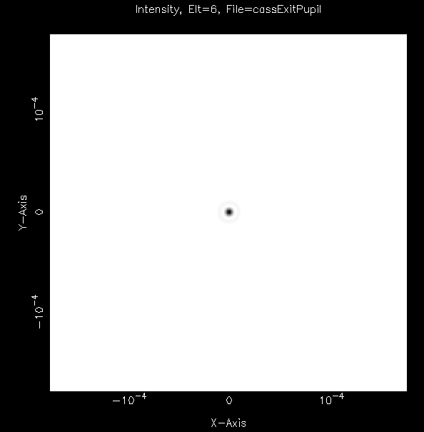{width="2.97007874015748in" height="3.0181102362204726in"}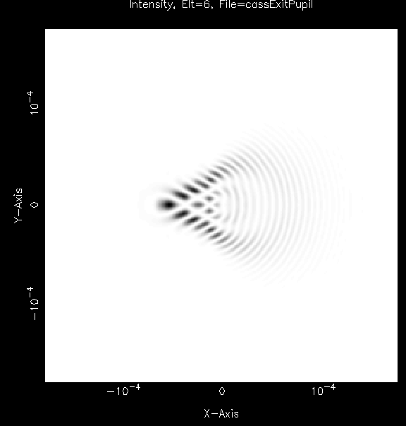{width="2.8751968503937007in" height="3.0090551181102363in"})

Unaberrated (defocused) Aberrated OPD (coma)

**FIGURE 10** Point spread functions for Cassegrain.in

#### Conventional Multi-plane Diffraction

Conventional physical optics modeling of multi-plane diffraction phenomena *unfolds* the optical beam train into an equivalent set of *thin lenses* arranged in linear fashion along the optical axis.2,4 The effect of the lenses is modeled using the *thin-phase approximation*. This approach assumes that:

-   The beam is paraxial, so that phase changes occur as a quadratic function of distance from the center of the array.

-   The grid does not change shape or dimension across the lens; the beam out of the lens is the same size as the beam into the lens.

-   The lens has no thickness, so all phase changes occur in a plane.

MACOS does not make these approximations. MACOS does not unfold the system nor use the thin-phase approximation.

#### Multi-plane Diffraction in MACOS

MACOS multi-plane diffraction models are set up by placing reference surfaces immediately before and after the optical elements of a system, or at the start and end of free-space propagations. These reference surfaces are optimized in pairs using MACOS ORS, SRS and FEX functions, discussed in Sections 5 and 6.

MACOS diffraction calculations use four basic propagators:

1.  Geometric propagator.

2.  Fresnel near-field sphere-to-sphere propagator for converging or diverging beams.

3.  Fresnel/Fraunhofer far-field sphere-to-plane propagator.

4.  Fresnel near-field plane-to-plane propagator for collimated beams.

The Fresnel propagators are used for the free-space propagations in much the same way as in standard codes. They determine the amplitude on the downstream reference surface based on the amplitude on the upstream reference surface. These propagators are described in more detail in Section 6.

MACOS uses the geometric propagator to determine phase changes across optical elements. The geometric propagator uses rays as *phase probes* aligned with particular amplitude matrix grid points. The phases are determined directly from the exact optical path lengths calculated for the rays from the first reference surface, through the optical elements, to the next reference surface. If necessary due to aberrations through the optical elements, the rays can be regridded to assure alignment with the diffraction grid points. Compared to thin-phase, the MACOS approach

-   Does not assume that the beam is paraxial through the optical element (though an assumption of paraxial beams is built into the Fresnel free-space propagators).

-   Does not assume that the beam out of the lens is the same size as the beam into the lens.

-   Does not assume all phase changes occur in a plane.

-   More accurately accounts for geometric effects, such as field-dependant aberrations.

The MACOS geometric propagator does not compute magnitude changes unless polarization ray-trace is being used.

**Polarized Light**

### Polarized Light

MACOS polarized light summary: wht polarized light is; representation of polarized TE fields using rays; polarization rt; interfaces; coatings; vector diffraction.
