## SECTION 4: Describing Optical Systems

*Systems*

A first MACOS session typically begins by invoking the NEW command. This begins a dialog whose function is to define the data used by MACOS in its computations. This data comprises the optical prescription, and is saved by MACOS as an “.in-file,” which can be edited and reused later using the OLD command. The contents of the .in-file can be altered within a MACOS session using MODIFY, PERTURB or other commands, and saved as a new .in-file using the SAVE command. The .in-files can also be created and edited off-line using a text editor. The commands covered in this section are:

    NEW DRAw
    OLD (LOAd)
    SUMmarize STAtus RESet SHOw
    MODify BEAM SAVe

### Specifying the Light Source

The NEW dialog begins by asking the user for information about the light source, such as where it is located, in what direction it is oriented, and what its optical properties are. After the source is defined, similar questions are asked about each optical element in turn. This section is intended to help the user provide the appropriate answers to these questions. It is also intended to define MACOS variable names, which are used in the

.in-files to specify aspects of the prescription.

MACOS represents light sources as *beams*, consisting of a ray bundle and an associated complex amplitude matrix (or matrices). Beams can be collimated or focused, as per Figure 11. In addition, the illumination profile of a beam can be specified as uniform, gaussian, dipole or cosine-to-a-power, using the BEAM command discussed in a later section. Collimated beams are composed of a bundle of parallel rays, originating at a plane in front of the entrance aperture. Collimated beams are used to represent the light received from a point-source at an infinite distance from the system. They are also used when collimated light sources, such as some lasers, are to be modeled. Focused beams are bundles of rays converging to or diverging from a point in space and represent the light from a nearby point source. Focused beams are defined on a spherical surface whose center of curvature is at the source point.

The properties that must be specified by the user include:

-   Source position and direction, defined by the position and orientation of the “chief” ray (really the gut ray – the ray that lies in the center of the beam)

-   Aperture size (collimated source) or angle (point source)

```{=html}
<!-- -->
```
-   Aperture shape (circular, square, hexagonal, pie, flower)

-   Illumination profile (flat, gaussian, dipole or cosine-to-a-power)

-   Wavelength

-   Flux through the defined aperture

-   Polarization state (if using polarization ray-trace analysis functions)

-   Segmentation (unsegmented, hexagonal segments, or “pie” segments)

-   Coordinates to define the orientation of the beam to the optical elements

#### Source Position and Orientation

In MACOS, a *light source* is a surface but not an element. The surface is defined by a single wavefront emitted from a single point source. The zSource parameter is the distance from the origin of the light to the light source surface, as defined by the location of the chief ray, ChfRayPos (see Figure 11). Collimated sources are specified by zSource=1d22. For point sources, the convention is that the sign of zSource is positive for a converging beam and negative for an expanding beam.

{width="7.283464566929133e-2in" height="7.637795275590552e-2in"}{width="0.20354330708661417in" height="0.11023622047244094in"}{width="0.17834645669291338in" height="0.10708661417322834in"}{width="0.11653543307086614in" height="0.13818897637795274in"}

    ChfRayPos ChfRayPos

{width="7.362204724409449e-2in" height="7.362204724409449e-2in"}{width="0.5070866141732283in" height="0.10748031496062992in"}{width="0.29645669291338583in" height="0.34291338582677167in"}


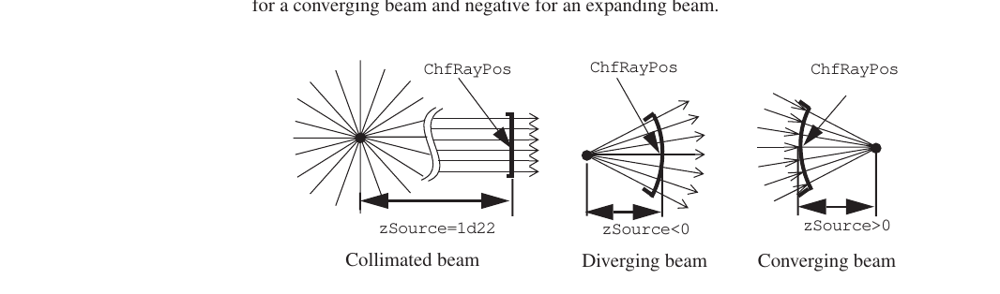

**FIGURE 11** Light sources

The location and orientation of the light source is determined from the *chief ray*. The MACOS “chief ray” is the central or gut ray of the beam, as discussed in Section 2.2. It is the center ray of the incident beam bundle. It is normally a true chief ray as well, passing through the center of the system stop. This condition is enforced by the user, using the STOP or CENTER commands, as described later.

To define the source, the user must specify in the global coordinate system:

-   Chief ray position vector

-   Chief ray direction vector

These are set by the 3-vector inputs ChfRayPos and ChfRayDir. If the source is collimated, then every ray in the beam starts out with its direction equal to ChfRayDir. The position of each ray is calculated from ChfRayPos, the shape and type of aperture, and the specified ray density. If the source is a point source, appropriate position and direction is computed so that each ray starts from the surface of a sphere centered at the source point.

NOTE: Converging or diverging sources **should not be located at the source point**, or, for example, divide-by-zero errors will result when performing diffraction analysis.

#### Refractive Index and Extinction Coefficient at the Source

The refractive index is, in general, a complex number. The real part is the conventional index, giving the speed of light in the particular medium, and so defining the direction

[changes a ray experiences at refractive interfaces. The imaginary part is the extinction]{.underline}

**Specifying the Light Source**

coefficient, which defines the attenuation of the field in the medium. Only the index (real part) is significant in MACOS scalar ray-tracing calculations. The extinction coefficient is used only when polarization ray-trace is selected, by use of the POL command.

-   The real part of the refractive index of the source medium is specified by IndRef. If ChfRayPos is in a vacuum, then IndRef=1. For many applications it is sufficient to approximate the index of refraction of air as 1, although the exact value depends on the pressure and temperature.

-   The negative of the imaginary part of the refractive index, the extinction coefficient, of the source medium is specified by Extinc. For lossless media such as vacuum and air, set ExtInc=0. For perfect metals, set ExtInc=1d22. This parameter is used only when polarization ray-tracing is turned on.

The user must specify the index explicitly for the source only. For other elements, particular glasses can be specified, and the index will be varied as a function of the wavelength of the beam. The source IndRef and Extinc are not changed automatically with changes in wavelength. The user can implement such changes as needed using the MODIFY command.

#### Wavelength

The wavelength is specified by the wavelen variable. For most calculations, MACOS uses one wavelength at a time. Multiple-wavelength images can be generated using the COMPOSE command to define detector parameters, using use the MODify command to change the wavelen (and Flux) variables (see Section 4.10.2), then using the ADD command to separately propagate and accumulate different wavelength and flux level images at the detector. This procedure can be automated by using “.filt” filter files and the MULtispec command.

#### Flux

The total flux of the source illumination through the aperture area (defined by the Aperture, Obscuration and GridType parameters) is specified by Flux.This parameter is used in MACOS to facilitate the radiometric modeling of systems. It is useful when constructing composite images of multiple sources or at multiple wavelengths. This procedure can be automated by using “.filt” filter files and the MULtispec command.

#### Aperture

The aperture size is set by the Aperture parameter, whose interpretation is different for collimated or point sources. If the source is collimated (zSource=1d22), Aperture is the *diameter* of the input beam. If it is a point source(zSource\<1d22), Aperture is the full *angle* (entered in radians like all angles in MACOS) subtended by the two marginal rays (see Figure 12). Thus, the numerical aperture of the system is

    N.A. = n*sin(Aperture) (4.1)

where n is the index of refraction.

Obscurations can be defined in the source beam if desired. Obscuration size is specified in the same way as the aperture, with the parameter Obscratn setting the diameter or angle of a *central* obscuration.

    Aperture

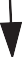{width="0.10708661417322834in" height="0.2937007874015748in"}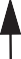{width="0.10708661417322834in" height="0.3047244094488189in"}

Collimated beam

    Aperture


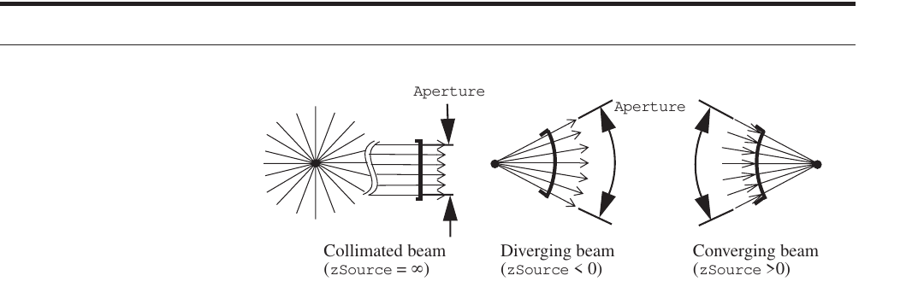

**FIGURE 12** Aperture sizing

NOTE: This aperture obscuration option can be useful, but is not the best way to represent most beam-train obscurations. It is better to explicitly place obscurations on the appropriate elements as discussed in Section 4.6.

The entrance aperture can have several shapes, as shown in Figure 13, depending on whether the system is monolithic – in which all optics are of one piece – or segmented – in which at least one mirror is split into separate segments. For monolithic systems, the aperture shape can be round or square, as set by the GridType parameter. For segmented systems the options are hexagonal array, round with 6 pie-shaped outer segments, or round with an arbitrary number of outer segments. For computational efficiency, the segmentation is defined at the light source.


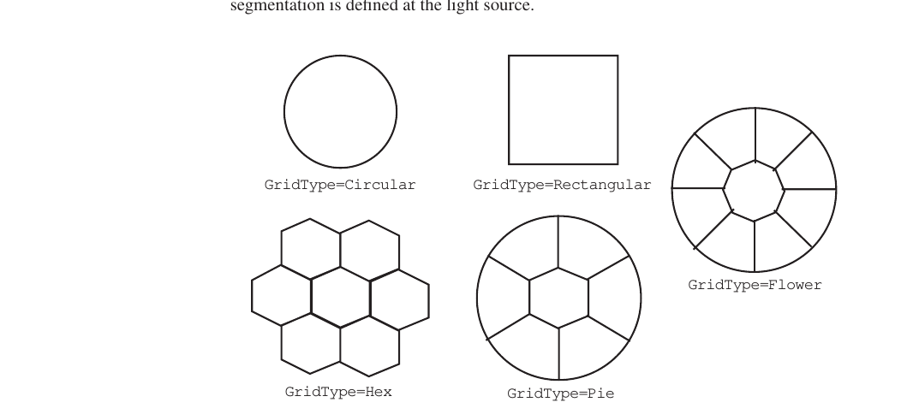

**FIGURE 13** Aperture shapes

It is not necessary to segment the aperture to use lenslet arrays, as discussed later.

NOTE: Registration of a segmented aperture on a segmented mirror may shift when the beam incidence angle changes, or when intervening optics are perturbed. This can cause rays that nominally strike one mirror segment to move to another. In these conditions, the user should check to ensure proper registration.

#### Ray Grids

The density of rays across the beam and the orientation of the ray grid are set by three

[parameters:]{.underline}

**Example Light Source**

-   Number of ray grid points across the aperture is set by nGridPts

-   Ray grid coordinate vectors xGrid and yGrid determine the global orientation of the ray grid and so the beam coordinates

The ray grid is laid out on the surface that defines the light source, according to a coordinate system for which zGrid equals the negative chief ray direction ChfRayDir and xGrid is as specified by the user (see Figure 14). The number of rays across the aperture is set by nGridPts.

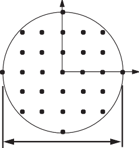{width="1.2361111111111112in" height="1.3083333333333333in"}

    yGrid

Coordinates

    yGrid=zGrid x xGrid


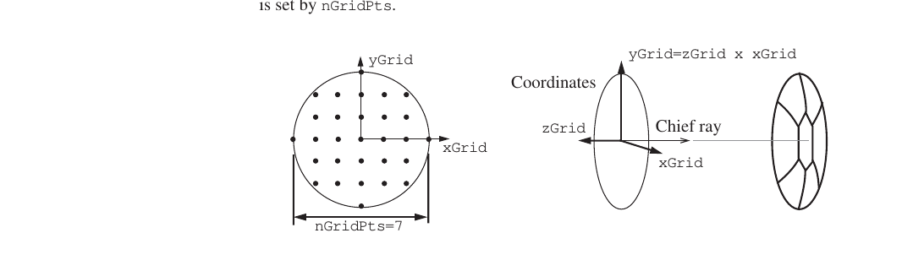

**FIGURE 14** Ray grid layout

### Example Light Source

MACOS obtains the information it needs to build an optical prescription (an “.in-file” dataset) through the NEW file definition dialog. The first questions in this dialog are about the light source and the latter questions pertain to the optical elements.

For the first example, we start the prescription for a Cassegrain telescope, Cassegrain.in, shown in Figure 15. The light source is a point source at infinity so the wave-front incident on the telescope is collimated. In the example dialog, the prompts are exactly as MACOS gives them. The correct user response is indicated in **bold** text, and the name of the variable being set is in ***italic*** text.


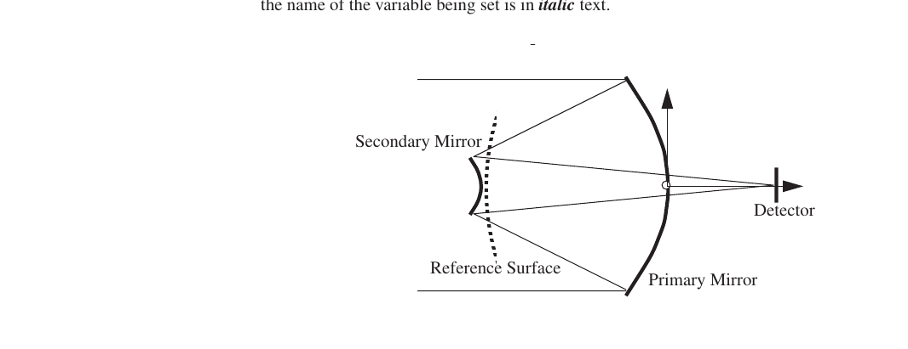

**FIGURE 15** Cassegrain telescope layout

    Prompt Response VariableName

MACOS\>**new**

    Enter file name: Cassegrain
    File Cassegrain.in being created. filenam
    Enter chief ray input direction vector (x,y,z) [0.,0.,1.0]:0,0,1 ChfRayDir Enter chief ray location vector (x,y,z) [0.,0.,0.]:0,0,-5 ChfRayPos Enter distance from source [1.000000E+22]:1d22 zSource
    Enter chief ray index of refraction [1.00000]:1 IndRef
    Enter chief ray extinction coefficient [0.]:0 Extinc
    Enter monochromatic wavelength [6.000000E-07]:1d-6 Wavelen
    Enter intensity (flux over aperture area) [1.00000]:1 Flux
    + +
    | Source ray grid types: |
    | Circular Square Hex |
    | Pie Flower |
    + +
    Enter source grid type [Circular]: Circular GridType
    Enter aperture diameter or angle [1.00000]:4 Aperture
    Enter number of grid points [65]:15 nGridPts Enter input plane x-axis vector (x,y,z) [1.00000,0.,0.]:-1,0,0 xGrid Enter input plane y-axis vector (x,y,z) [0.,1.00000,0.]:0,-1,0 yGrid Enter number of elements [no default]: 5 nElt

This dialog produces the following lines in the prescription file Cassegrain.in: ChfRayDir= 0.000000000D+00 0.000000000D+00 1.000000000D+00

    ChfRayPos= 0.000000000D+00 0.000000000D+00 -5.000000000D+00 zSource= 1.000000000D+22
    IndRef= 1.000000000D+00 Extinc= 0.000000000D+00 Wavelen= 1.000000000D-06 Flux= 1.000000000D+00
    GridType= Circular Aperture= 4.000000000D+00 Obscratn= 0.000000000D+00
    nGridpts= 15
    xGrid= -1.000000000D+00 0.000000000D+00 0.000000000D+00 yGrid= 0.000000000D+00 -1.000000000D+00 0.000000000D+00
    nElt= 5

The Cassegrain.in example is finished in Section 4.8.

Now consider the case of a non-collimated input beam, zSource not equal to infinity. A Cassegrain telescope has been turned into a beam projector. The light source is now located where the detector was previously located as shown in Figure 16.

MACOS\>**new**

    Enter file name: zsourc
    File zsourc.in being created.
    Enter chief ray input direction vector (x,y,z) [0.,0.,1.0]:0,0,1 ChfRayDir Enter chief ray location vector (x,y,z) [0.,0.,0.]:0,0,-1 ChfRayPos Enter distance from source [1.000000E+22]:-0.1 zSource
    Enter chief ray index of refraction [1.00000]:1 IndRef
    Enter chief ray extinction coefficient [0.]:0 Extinc
    Enter monochromatic wavelength [6.000000E-07]:1d-3 Wavelen
    Enter intensity (flux over aperture area) [1.00000]:1 Flux
    + +
    | Source ray grid types: |
    | Circular Square Hex |
    | Pie Flower |
    + +
    Enter source grid type [Circular]: Circular GridType
    Enter aperture diameter or angle [1.00000]:0.1076 Aperture
    Enter number of grid points [65]:25 nGridPts
    Enter input plane x-axis vector (x,y,z) [1.00000,0.,0.]:-1,0,0 xGrid

**Specifying Optics**

-1.1 -1.0


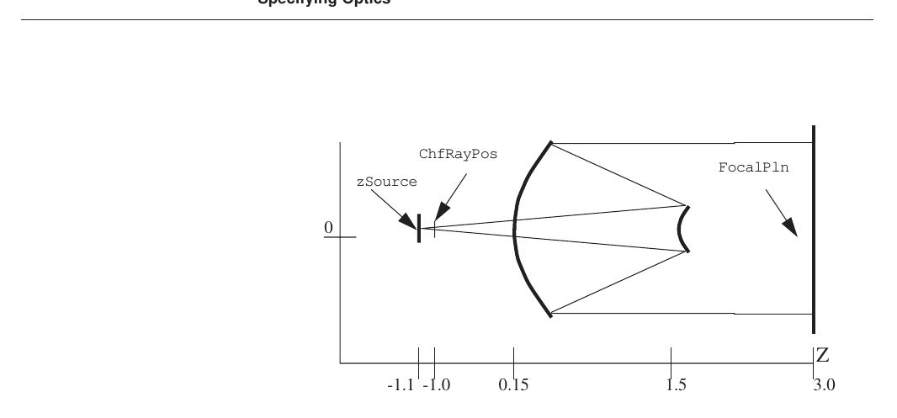

**FIGURE 16** Non-collimated light source example

    Enter input plane y-axis vector (x,y,z) [0.,1.00000,0.]:0,-1,0 yGrid
    Enter number of elements [no default]: 6 nElt

This results in the following lines in the prescription file zsource.in:

    ChfRayDir= 0.000000000D+00 0.000000000D+00 1.000000000D+00 ChfRayPos= 0.000000000D+00 0.000000000D+00 -1.000000000D+00 zSource= -1.000000000D-01
    IndRef= 1.000000000D+00 Extinc= 0.000000000D+00 Wavelen= 1.000000000D-03 Flux= 1.000000000D+00
    GridType= Circular Aperture= 1.076000000D-01 Obscratn= 0.000000000D+00
    nGridpts= 25
    xGrid= -1.000000000D+00 0.000000000D+00 0.000000000D+00 yGrid= 0.000000000D+00 -1.000000000D+00 0.000000000D+00
    nElt= 6

Notice that the Aperture entry has changed significantly, since Aperture now represents an angle, instead of the diameter of the input beam. The ChfRayPos is now a small distance in front of the source, so zSource is now negative to indicate an diverging beam.

### Specifying Optics

The next part of the new dialog is the specification of the optical elements. The first step in defining the beam train is actually the last step in the source dialog: specifying the number nElt of optical elements in the beam train. The number of elements is equal to the number of active optical surfaces, plus any reference (dummy) surfaces, plus 2 return surfaces for an exit pupil, if desired.

The new dialog continues by prompting the user for all data needed to define each optic. Optics are specified one at a time, in the sequence in which they are encountered by the light from the source (except nonsequential and segmented optics). Some optics, such as mirrors, are realized by a single *element*, or optically active surface. Other optics require

two or more elements. Lenses require two refracting elements, one for each surface (see the example in Section 4.4.2). Corner cubes require three non-sequential reflecting elements. Each element in multiple-element optics is entered separately.

The first step in specifying an element is to define its *type* (e.g., Reflector) and its *surface type* (e.g., Conic). Table 5 lists the elements currently supported by MACOS, and Table 6 lists the surface types. Further data required to define the surfaces may be requested, depending on specified surface type.

**TABLE 5.** Element types

+---------------------+-----------------+-----------------------------+
| **Element Type      | **Allowed       | **Description**             |
| (**Element=..**)**  | Surface Types** |                             |
+=====================+=================+=============================+
| Reflector           | all             | reflective surfaces (e.g.,  |
|                     |                 | mirrors)                    |
+---------------------+-----------------+-----------------------------+
| Refractor           | all             | refractive surfaces (e.g.,  |
|                     |                 | lenses)                     |
+---------------------+-----------------+-----------------------------+
| LensArray           | conics or       | lens arrays                 |
|                     | aspheres        |                             |
+---------------------+-----------------+-----------------------------+
| Grating             | all             | reflective diffraction      |
|                     |                 | gratings                    |
+---------------------+-----------------+-----------------------------+
| HOE                 | all             | reflective holographic      |
|                     |                 | optical elements            |
+---------------------+-----------------+-----------------------------+
| NSReflector         | conics          | non-sequential reflective   |
|                     |                 | surfaces                    |
+---------------------+-----------------+-----------------------------+
| NSRefractor         | conics          | non-sequential refractors   |
+---------------------+-----------------+-----------------------------+
| Segment             | all             | segmented mirrors           |
+---------------------+-----------------+-----------------------------+
| ObsSrf              | conics          | obscuring surfaces          |
+---------------------+-----------------+-----------------------------+
| FocalPln            | flats           | focal planes                |
+---------------------+-----------------+-----------------------------+
| RefSrf              | conics          | reference surfaces          |
+---------------------+-----------------+-----------------------------+
| ReturnSrf           | conics          | return surfaces             |
+---------------------+-----------------+-----------------------------+

**TABLE 6.** Surface types

+--------------+-------------------------------------------------------+
| **Surface    | **Surface Description**                               |
| Type         |                                                       |
| (**Sur       |                                                       |
| face=..**)** |                                                       |
+==============+=======================================================+
| Flat         | Planar                                                |
+--------------+-------------------------------------------------------+
| Conic        | Conicoid of revolution. Precise shape is defined by   |
|              | conic constant                                        |
|              |                                                       |
|              | KcElt and radius KrElt parameters (or fElt and eElt)  |
+--------------+-------------------------------------------------------+
| Toric        | Toric or cylindrical shapes, defined by separate      |
|              | radius parameters in x and y directions.              |
+--------------+-------------------------------------------------------+
| Anamorphic   | “Saddle” shapes, defined by separate conic and radius |
|              | parameters in x and y directions.                     |
+--------------+-------------------------------------------------------+
| Aspheric     | Base conicoid, with 10th-order aspheric deviation.    |
+--------------+-------------------------------------------------------+
| Monomial     | Base conicoid, with 14th-order cartesian polynomial   |
|              | deviation.                                            |
+--------------+-------------------------------------------------------+
| Zernike      | Base conicoid, with deviation defined by Zernike      |
|              | polynomials.                                          |
+--------------+-------------------------------------------------------+
| Interpolated | Base conicoid, with deviation defined by X-Y-Z data   |
|              | triplets                                              |
+--------------+-------------------------------------------------------+
| GridData     | Base conicoid, with deviation defined by square       |
|              | matrix pixels                                         |
+--------------+-------------------------------------------------------+
| User-defined | Deformable mirrors defined using influence functions. |
+--------------+-------------------------------------------------------+

The second step is to define element location, orientation and rotation point, as discussed in Section 2.1:

-   Element *location* is specified by the VptElt vector. This is a three-vector in global coordinates giving the location of the vertex of the element.

**Element Types**

-   Element *orientation* is specified by the psiElt vector. This is a unit magnitude three-vector in global coordinates giving the direction of the principal axis of the element.

-   Element *rotation point*, RptElt, defines the pivot point for rotations of the element implemented using the Perturb command. It also defines the coupling between rotation and translation for the Build command. Together with any element coordinates, Telt, RptElt governs the element response to perturbations.

The third step is to define any aperture or obscurations that might occur at the element. Apertures define the margins of the element, and can be circular or rectangular. Obscurations are circular or rectangular regions on the surface of the element where light is completely absorbed. Negative obscurations “un-absorb” the light, countering the effect of an obscuration in regions where they overlap. Obscurations and apertures can be placed anywhere on the surface.

The fourth step is to define the zElt and PropType diffraction propagation parameters, which are needed if the element is at the start or end of a diffraction propagation.

The final step is to specify element coordinates (Telt), if they are desired.

In the next several subsections, each of these steps is discussed more carefully, and examples are shown.

### Element Types

Element type and surface shape are each most critical in the determination of the properties of an optic. In this subsection we define the MACOS element types and illustrate their use through a sequence of specific examples.

#### Reflectors

Mirrors are entered as type Reflector. Reflectors can have any surface type or shape; the user will be prompted for different parameters depending on which surface type is chosen. No element-specific parameters are required for reflectors unless polarization ray-tracing is turned on. In that case, Extinc and IndRef should be carefully specified, as they determine the transmission of the beam past the reflective interface.

This example shows how to enter a flat mirror in MACOS:

    Enter Element 1 Data:
    Enter element name (no blanks) [Elt]: flatMirror EltName
    + +
    | Element types: |
    | Reflector NSReflector Segment |
    | Refractor NSRefractor LensArray |
    | FocalPlane Reference Return |
    | HOE Grating Obscuring |
    + +
    Enter element type :reflect Element
    + +

+--------------------------+---------------------+----------------+---+
| \| Surface types:        |                     |                | \ |
|                          |                     |                | | |
+==========================+=====================+================+===+
| \| Flat                  | Conic               | Aspheric       | \ |
|                          |                     |                | | |
+--------------------------+---------------------+----------------+---+
| \| Anamorphic            | Zernike             | Monomial       | \ |
|                          |                     |                | | |
+--------------------------+---------------------+----------------+---+
| \| Interpolated          | UserDefined         |                | \ |
|                          |                     |                | | |
+--------------------------+---------------------+----------------+---+

    + +
    Enter surface type :flat Surface
    Enter element vertex location (x,y,z) [no default]: 0,0,0 VptElt
    Enter element rotation point (x,y,z) [0.,0.,0.]:0,0,0 RptElt Enter element principal axis (x,y,z) [0.,0.,-1.00000]:0,0,-1 psiElt Do you want an aperture on this element? [NO]: no
    Enter number of obscurations [0]:0
    Enter Fresnel propagation distance [1.000000E+22]:1d22 zElt
    + +
    | Propagation types: |
    | Geometric GeomUpdate FarField |
    | NFSpherical NFS1surf |
    | NFPlane NFP1surf |
    | NF1 NF2 |
    | SpatialFilter SF1surf |
    + +
    Enter propagation type [Geometric]: Geometric PropType
    Do you wish to use element-based coordinates?: [NO]: no
    Enter element index of refraction [1.00000]:1 IndRef
    Enter element extinction coefficient [1.000000E+22]:1d22 Extinc

This results in the following lines in the prescription file:

+----------+--------------------+-------------------------------------+
| iElt=    | 1                  |                                     |
| EltName= |                    |                                     |
| Element= | flatMirror         |                                     |
|          | Reflector          |                                     |
| Surface= |                    |                                     |
|          | Flat               |                                     |
+==========+====================+=====================================+
| fElt=    | 1.000000000D+22    |                                     |
+----------+--------------------+-------------------------------------+
| eElt=    | 0.000000000D+00    |                                     |
+----------+--------------------+-------------------------------------+
| KrElt=   | -1.000000000D+22   |                                     |
+----------+--------------------+-------------------------------------+
| KcElt=   | 0.000000000D+00    |                                     |
+----------+--------------------+-------------------------------------+
| psiElt=  | 0.000000000D+00    | 0.000000000D+00 -1.000000000D+00    |
+----------+--------------------+-------------------------------------+
| VptElt=  | 0.000000000D+00    | 0.000000000D+00 0.000000000D+00     |
+----------+--------------------+-------------------------------------+
| RptElt=  | 0.000000000D+00    | 0.000000000D+00 0.000000000D+00     |
+----------+--------------------+-------------------------------------+
| IndRef=  | 1.000000000D+00    |                                     |
+----------+--------------------+-------------------------------------+
| Extinc=  | 1.000000000D+22    |                                     |
+----------+--------------------+-------------------------------------+
| nObs=    | 0                  |                                     |
+----------+--------------------+-------------------------------------+
| ApType=  | None               |                                     |
+----------+--------------------+-------------------------------------+
| zElt=    | 1.000000000D+22    |                                     |
+----------+--------------------+-------------------------------------+
| P        | Geometric          |                                     |
| ropType= |                    |                                     |
+----------+--------------------+-------------------------------------+
| nECoord= | -6                 |                                     |
+----------+--------------------+-------------------------------------+

#### Refractors

A refracting element is the interface between two media of differing index of refraction, such as air and glass. Rays traversing the interface are, of course, bent at the interface. lenses, windows and other refracting optics are actually modeled using 2 optical elements, both of type Refractor. The first element defines the front surface of the optic and sets the index for the ray traveling inside the optic. The second element defines the back surface, and resets the index to the value outside the optic.

Some refracting elements, such as prisms, use more than two elements, and may require use of nonsequential reflectors and refractors as well – see Section 4.4.13. Arrays of lenslets are covered in Section 4.4.4.

As with reflectors, refractors in MACOS may have any surface shape. The index of refraction IndRef can be set directly in the prescription, or indirectly, by specifying a particular glass for the element. To set the index directly, select FixedIndex glass type and then specify the index. No other element-specific parameters are required, unless polarization ray-tracing is turned on. In that case, Extinc must be specified as well.

This example lens has a spherical front surface and a planar rear surface, as illustrated in Figure 17:

**Element Types**

    Enter Element 1 Data:
    Enter element name (no blanks) [Elt]: lens_front EltName
    + +
    | Element types: |
    | Reflector NSReflector Segment |
    | Refractor NSRefractor LensArray |
    | FocalPlane Reference Return |
    | HOE Grating TrGrating |
    | RfPolarizer TrPolarizer Obscuring |
    + +
    Enter element type :refractor Element
    + +
    | Surface types: |
    | Flat Conic Aspheric |
    | Anamorphic Zernike Monomial |
    | Interpolated UserDefined Grid data |
    | Toric InfluenceFcn |
    + +
    Enter surface type :conic Surface
    Enter element vertex location (x,y,z) [no default]: 0,0,0 VptElt
    Enter element rotation point (x,y,z) [0.,0.,0.]:0,0,0 RptElt Enter element principal axis (x,y,z) [0.,0.,-1.00000]:0,0,-1 psiElt Enter e&f or Kc&Kr (1=e&f,2=Kc&Kr)? [1]:1
    Enter element focal length [1.000000E+22]:1 fElt
    Enter element eccentricity [0.]:0 eElt
    Do you want an aperture on this element? [NO]: no
    Enter number of obscurations [0]:0
    Enter Fresnel propagation distance [1.000000E+22]:1d22 zElt
    + +
    | Propagation types: |
    | Geometric GeomUpdate FarField |
    | NFSpherical NFS1surf |
    | NFPlane NFP1surf |
    | NF1 NF2 |
    | SpatialFilter SF1surf |
    + +
    Enter propagation type [Geometric]: Geometric PropType
    Do you wish to use element-based coordinates?: [NO]: no
    Enter glass type [FixedIndex]: BK7 GlassElt
    Enter Element 2 Data:
    Enter element name (no blanks) [Elt]: lens_back EltName
    + +
    | Element types: |
    | Reflector NSReflector Segment |
    | Refractor NSRefractor LensArray |
    | FocalPlane Reference Return |
    | HOE Grating TrGrating |
    | RfPolarizer TrPolarizer Obscuring |
    + +
    Enter element type :refractor Element
    + +
    | Surface types: |
    | Flat Conic Aspheric |
    | Anamorphic Zernike Monomial |
    | Interpolated UserDefined Grid data |
    | Toric InfluenceFcn |
    + +
    Enter surface type :flat Surface
    Enter element vertex location (x,y,z) [no default]: 0,0,0.1 VptElt Enter element rotation point (x,y,z) [0.,0.,0.]:0,0,0 RptElt Enter element principal axis (x,y,z) [0.,0.,-1.00000]:0,0,-1 psiElt Do you want an aperture on this element? [NO]: no
    Enter number of obscurations [0]:0
    Enter Fresnel propagation distance [1.000000E+22]:1d22 zElt
    + +
    | Propagation types: |
    | Geometric GeomUpdate FarField |
    | NFSpherical NFS1surf |
    | NFPlane NFP1surf |
    | NF1 NF2 |
    | SpatialFilter SF1surf |
    + +
    Enter propagation type [Geometric]: Geometric PropType
    Do you wish to use element-based coordinates?: [NO]: no
    Enter glass type [FixedIndex]: FixedIndex GlassElt
    Enter element index of refraction [1.00000]:1 IndRef
    Enter element extinction coefficient [0.00000]:0 Extinc

NOTE: It is not uncommon to “lose” rays, if they miss the properly defined area of a lens, that is, if the rays miss the region where the 2 surfaces of the lens are sequential. If rays extend beyond the intersection point of the two elements, the rays become undefined and are not traced further as shown in Figure 17.

This ray hits the elements out of sequence, becomes undefined


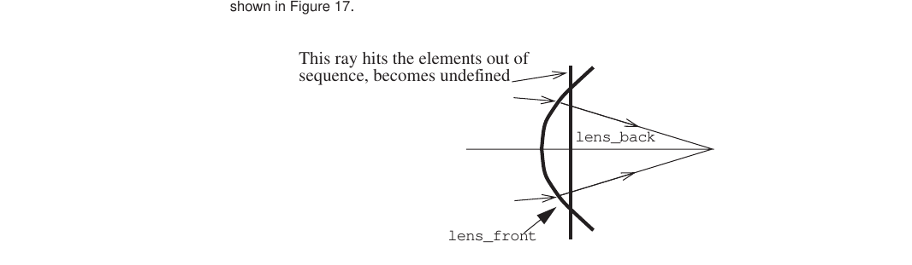

**FIGURE 17** Ray bundle must pass within surface intersection points of the refracting elements for all rays to be traced properly

#### Glass Tables

Version 2.8 of MACOS comes with a single glass table, which incorporates the Schott glass types as of May 1999 (from [http://schottglass.com).](http://schottglass.com/) This table is a text file, macos.glass, located in the MACOS data directory. See Section 3.8.4 for details on how to specify this directory.

The user may specify the index of glasses or other optical materials in several ways:

-   By selecting from the materials in the provided macos.glass file, as in the first part of the example in Section 4.4.2.

-   By using a different macos.glass file, located in the MACOS data directory. The user can easily add other materials to a private copy of macos.glass, using the MACOS_DATA environment variable to define its location.

-   By directly specifying the 6 Sellmeier glass coefficients in the prescription. These coefficients are B1, B2, B3, C1, C2, C3 from the manufacturers catalog. Note that the MACOS SAVE command saves the coefficients of each glass in the prescription file, even if the glass data was originally derived from the MACOS glass table.

**Element Types**

-   By declaring a material to be FixedIndex, and then specifying the index, in the prescription. This approach uses a single value of the index for any wavelength of light.

The form of the glass table is simple. Each glass is defined in a single row of the file, with the first entry being the name of the glass, followed by the 6 Sellmeier coefficients. The following shows the first few entries from macos.glass:

+-----------------+------------+------------+------------+----------+
| Air 0d0 0d0 0d0 | 0d0 0d0    |            |            |          |
|                 | 0d0        |            |            |          |
+=================+============+============+============+==========+
| BaF13           | 1.51       | 1.07       | 9.39       | 4.49     |
| 1.57068590E+00  | 295152E-01 | 638026E+00 | 377487E-03 | 479866E- |
| 02              |            |            |            |          |
| 1.13934126E+02  |            |            |            |          |
+-----------------+------------+------------+------------+----------+
| BaF3            | 1.33       | 8.85       | 8.87       | 4.20     |
| 1.32064267E+00  | 572683E-01 | 521821E-01 | 798715E-03 | 290346E- |
+-----------------+------------+------------+------------+----------+
| 02              |            |            |            |          |
| 1.11729167E+02  |            |            |            |          |
+-----------------+------------+------------+------------+----------+
| BaF4            | 1.46       | 9.12       | 9.29       | 4.40     |
| 1.37492590E+00  | 354500E-01 | 643359E-01 | 554343E-03 | 426654E- |
+-----------------+------------+------------+------------+----------+
| 02              |            |            |            |          |
| 1.16607899E+02  |            |            |            |          |
+-----------------+------------+------------+------------+----------+

#### Lens Arrays

Lens arrays (a.k.a. lenticular arrays or lenslet arrays) are refracting optics. Usually, a lens array will have one flat surface and one surface figured into a mosaic of regularly distributed lenslets (Figure 18). Lens arrays are used most often in Hartmann wavefront sensors. An example adaptive optics wavefront sensor is provided in Appendix A.4.

MACOS uses a LensArray element type to model the bumpy surface of a lens array. LensArray elements are specified much as Refractor elements are, with the addition of a few new parameters. LensArray elements can have conic or aspheric lenslet shapes. Enter shape parameters that describe a single lenslet, and all the other lenslets will be automatically replicated. The location and orientation parameters VptElt and psiElt define the plane containing all of the lenslet vertices, and specify the orientation of each lenslet.

The first new parameter is LensArrayType, which can have two values: LensArray-Typ=1 for hexagonal arrays; and LensArrayTyp=2 for rectangular arrays. The second new parameter is LensArrayWidth, which is the width of a single lenslet (flat to flat for hexagonal lenslets) (Figure 18).

{width="0.13818897637795274in" height="8.661417322834646e-2in"}{width="8.385826771653543e-2in" height="0.13818897637795274in"}yMon

yMon

    LensArrayWidth
    pMon

xMon xMon

Top View, rectangular array (LensArrayTyp=1)


Top View, hex array (LensArrayTyp=2)

Side View of Center Row

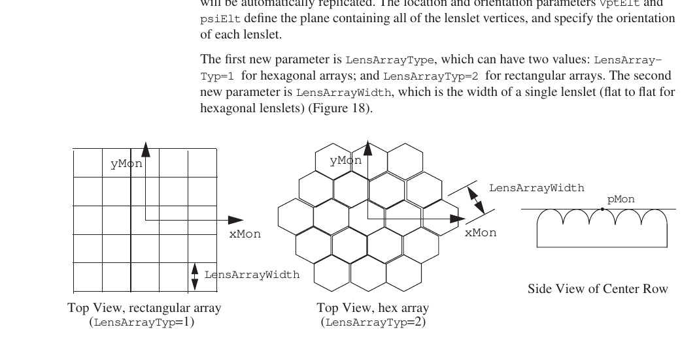

**FIGURE 18** Hexagonal lens array

LensArray elements use a surface coordinate system to define the location and orientation of the lenslet grid on the underlying plane. The variable pMon is the center of the coordinate system, defining the vertex position of the “central” lenslet. pMon can differ

from VptElt, though only the projection of pMon onto the plane is significant. The variables xMon, yMon, and zMon define the surface coordinate frame as shown in Figure 27.

An additional example of the use of lenslet arrays is provided in Appendix A.4.

    Enter element name (no blanks) [Elt]: LensArray EltName
    + +
    | Element types: |
    | Reflector NSReflector Segment |
    | Refractor NSRefractor LensArray |
    | FocalPlane Reference Return |
    | HOE Grating Obscuring |
    + +
    Enter element type :LensArray Element
    + +
    | Surface types: |
    | Flat Conic Aspheric |
    | Anamorphic Zernike Monomial |
    | Interpolated UserDefined |
    + +
    Enter surface type :Conic Surface
    Enter element vertex location (x,y,z) [no default]: 0,0,0 VptElt
    Enter element rotation point (x,y,z) [0.,0.,0.]:0,0,0 RptElt Enter element principal axis (x,y,z) [0.,0.,-1.00000]:0,0,1 psiElt Enter e&f or Kc&Kr (1=e&f,2=Kc&Kr)? [1]:2
    Enter Conic Constant [0.]:0 KcElt
    Enter Radius [-1.000000E+22]:-0.8 KrElt
    Do you want an aperture on this element? [NO]:
    Enter number of obscurations [0]:
    Enter Fresnel propagation distance [0.800000]:1d22 zElt
    + +
    | Propagation types: |
    | Geometric GeomUpdate FarField |
    | NFSpherical NFS1surf |
    | NFPlane NFP1surf |
    | NF1 NF2 |
    | SpatialFilter SF1surf |
    + +
    Enter propagation type [Geometric]: Geometric PropType
    Do you wish to use element-based coordinates?: [NO]:
    Enter glass type [FixedIndex]: FixedIndex GlassElt
    Enter element index of refraction [1.00000]:1.5 IndRef
    Enter element extinction coefficient [0.]:0 Extinc
    Enter surface reference point location (x,y,z) [0.,0.,0.]:0,0,0 pMon Enter surface x-axis unit vector (x,y,z) [1.00000,0.,0.]:1,0,0 xMon Enter surface y-axis unit vector (x,y,z) [0.,1.00000,0.]:0,1,0 yMon Enter surface z-axis unit vector (x,y,z) [0.,0.,1.00000]:0,0,1 zMon Orthoganalized zMon= 0. 0. 1.0000000000000
    Enter lenslet width [1.00000]:0.1 LensArrayWidth
    Enter lens array type (1=hex, 2=square) [1]:1 LensArrayType

This results in the following lines in the prescription file:

    iElt= 1
    EltName= LensArray Element= LensArray Surface= Conic
    fElt= 8.000000000D-01 eElt= 0.000000000D+00 KrElt= -8.000000000D-01 KcElt= 0.000000000D+00
    psiElt= 0.000000000D+00 0.000000000D+00 1.000000000D+00 VptElt= 0.000000000D+00 0.000000000D+00 0.000000000D+00 RptElt= 0.000000000D+00 0.000000000D+00 0.000000000D+00
    IndRef= 1.500000000D+00

**Element Types**

    Extinc= 0.000000000D+00
    pMon= 0.000000000D+00 0.000000000D+00 0.000000000D+00 xMon= 1.000000000D+00 0.000000000D+00 0.000000000D+00 yMon= 0.000000000D+00 1.000000000D+00 0.000000000D+00 zMon= 0.000000000D+00 0.000000000D+00 1.000000000D+00
    LensArrayType= 1 LensArrayWidth= 1.000000000D-01
    nObs= 0
    ApType= None
    zElt= 1.000000000D+22
    PropType= Geometric nECoord= -6

#### Reflective Gratings

Diffraction gratings are surfaces that have been ruled into a highly regular array of grooves. The rulings scatter light in all directions. The periodicity of the ruling causes there to be coherence in the light scattered in particular discrete directions. These directions correspond to various “diffraction orders,” which are functions of the ruling direction, the ruling width, and the wavelength of the incident beam (ref. Hecht). The amount of power scattered into each order is a more subtle matter, depending on the the detailed shape of the rulings. MACOS provides grating elements that model the beam diffracted into any specified order, but does not predict the intensity of the diffracted beams.

MACOS gratings can be defined on any surface shape. Enter surface parameters to define the underlying element, just as you would to define a regular mirror. Three additional element-specific parameters are required to define the grating geometry. These are:

-   OrderHOE: The diffraction order you wish to trace off of the grating surface.

-   h1HOE: A unit 3-vector perpendicular to the ruling direction and the psiElt vector. This vector is rotated and translated appropriately if the element is perturbed using the MACOS Perturb command.

-   RulingWidth: The fixed distance between rules as projected to a flat plane underlying the surface. Distance between rules *along the curved surface* can vary if the surface shape is curved, which will be the case with a conic or aspheric surface type.

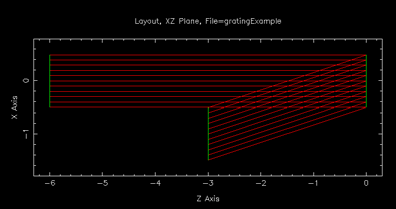{width="2.609722222222222in" height="1.3715277777777777in"}The following example shows the new dialog used to specify a grating on a flat surface. The complete prescription, with a collimated source illuminating the grating at normal incidence, is provided in Appendix A.2. Figure 19 shows the diffracted beam at a couple of orders.

*Order=1 Order=-2*

**FIGURE 19** Diffraction grating showing diffraction orders 1 and -2.

    Enter Element 1 Data:
    Enter element name (no blanks) [Elt]: Grating
    + +
    | Element types: |
    | Reflector NSReflector Segment |
    | Refractor NSRefractor LensArray |
    | FocalPlane Reference Return |
    | HOE Grating Obscuring |
    + +
    Enter element type :Grating
    + +
    | Surface types: |
    | Flat Conic Aspheric |
    | Anamorphic Zernike Monomial |
    | Interpolated UserDefined |
    + +
    Enter surface type :Flat
    Enter element vertex location (x,y,z) [no default]: 0,0,0
    Enter element rotation point (x,y,z) [0.,0.,0.]:0,0,0
    Enter element principal axis (x,y,z) [0.,0.,-1.00000]:0,0,-1 Do you want an aperture on this element? [NO]: no
    Enter number of obscurations [0]:0
    Enter Fresnel propagation distance [1.000000E+22]:1d22
    + +
    | Propagation types: |
    | Geometric GeomUpdate FarField |
    | NFSpherical NFS1surf |
    | NFPlane NFP1surf |
    | NF1 NF2 |
    | SpatialFilter SF1surf |
    + +
    Enter propagation type [Geometric]: Geometric
    Do you wish to use element-based coordinates?: [NO]: no
    Enter element index of refraction [1.00000]:1
    Enter element extinction coefficient [1.000000E+22]:1d22
    Enter diffraction order [1.00000]:1 OrderHOE Enter spacing of grating ruling [1.00000]:18.97366596d-7 RuleWidth Enter vector perp to grating ruling (x,y,z) [no default]: 0,1,0 h1HOE

This dialog produced the following prescription data:

    iElt= 1
    EltName= Grating Element= Grating Surface= Flat
    KrElt= -1.000000000D+22 KcElt= 0.000000000D+00
    psiElt= 0.000000000D+00 0.000000000D+00 -1.000000000D+00 VptElt= 0.000000000D+00 0.000000000D+00 0.000000000D+00 RptElt= 0.000000000D+00 0.000000000D+00 0.000000000D+00 IndRef= 1.000000000D+00
    Extinc= 1.000000000D+22
    h1HOE= 0.000000000D+00 1.000000000D+00 0.000000000D+00 OrderHOE= 1.000000000D+00
    RuleWidth= 1.897366596D-06
    nObs= 0
    ApType= None
    zElt= 1.000000000D+22
    PropType= Geometric nECoord= -6

**Element Types**

#### Transmissive Gratings

The transmissive grating elements, like the reflective gratings of the previous section, use surfaces that have been ruled into a highly regular array of grooves to diffract light. The periodicity of the ruling causes there to be coherence in the light scattered in particular discrete directions. These directions correspond to various “diffraction orders,” which are functions of the ruling direction, the ruling width, and the wavelength of the incident beam (ref. Hecht).

MACOS grating elements model the beam diffracted into any specified order, but do not predict the intensity of the diffracted beams.

MACOS gratings can be defined on any surface shape. Enter surface parameters to define the underlying element, just as you would to define a regular mirror. Three additional element-specific parameters are required to define the grating geometry. These are:

-   OrderHOE: The diffraction order you wish to trace off of the grating surface.

-   h1HOE: A unit 3-vector perpendicular to the ruling direction and the psiElt vector. This vector is rotated and translated appropriately if the element is perturbed using the MACOS Perturb command.

-   RulingWidth: The fixed distance between rules as projected to a flat plane underlying the surface. Distance between rules *along the curved surface* can vary if the surface shape is curved, which will be the case with a conic or aspheric surface type.

#### Reflective Holographic Optical Elements (HOEs)

Holgraphic optical elements (HOEs) are diffractive elements that can be used to produce a more complex output beam than is possible with straight-ruled gratings. They are typically formed by interfering two coherent beams on the surface of the underlying optic. The surface is covered with photo-sensitive material, so the interference is recorded as areas of exposed and unexposed fringes. The piece is then etched to turn the interference photograph into permanent features on the surface of the optic. Subsequent illumination by one of the 2 reference beams produces a diffracted beam in the form and direction of the second beam. The result is a diffraction grating. MACOS currently supports reflective HOEs only.

MACOS HOEs can be defined on any surface shape. Enter surface parameters to define the underlying element, just as you would to define the shape of a regular mirror. The HOE grating is then defined using additional element-specific parameters. These parameters set up the original HOE interference geometry, so the grating on any point of the surface can be computed from the intended reference beams. The reference beams are rotated and translated appropriately if the element is perturbed using the MACOS Perturb command. The parameters are:

-   h1HOE: The first is the input reference beam point source location in x,y,z. A collimated reference beam is located at infinity (1d22). Note that the reference beams have spherical (or flat) wavefronts only.

-   h2HOE: The second is the ouput reference beam point source location in x,y,z.

-   OrderHOE: The third is the diffraction order to be used to define the grating and to be ray-traced through the rest of the optical system. MACOS currently does not allow you to trace a different order than was used to define the grating.

```{=html}
<!-- -->
```
-   WaveHOE: The last is the construction or reference wavelength. The beam is traced using the source wavelength (Wavelen) which can be different.

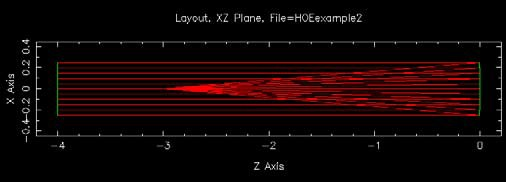{width="3.3716535433070867in" height="1.213779527559055in"}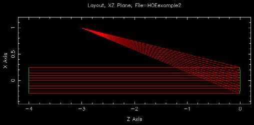{width="3.3791338582677164in" height="1.6716535433070867in"}The following example shows the new dialog used to specify a HOE on a parabolic surface. The complete prescription, with a collimated source illuminating the HOE at normal incidence, is provided in Appendix A.2. Figure 20 shows the output beam for both the diffracted beam and the reflected beam. Both will be present in an actual system, illustrating one use of the HOE: a means for splitting light off the same surface.

*Diffracted beam Reflected beam*

**FIGURE 20** Holographic optical element (HOE), showing diffracted and reflected beams.

    Enter Element 1 Data:
    Enter element name (no blanks) [Elt]: HOEonMirror
    + +
    | Element types: |
    | Reflector NSReflector Segment |
    | Refractor NSRefractor LensArray |
    | FocalPlane Reference Return |
    | HOE Grating Obscuring |
    + +
    Enter element type :HOE
    + +
    | Surface types: |
    | Flat Conic Aspheric |
    | Anamorphic Zernike Monomial |
    | Interpolated UserDefined |
    + +
    Enter surface type :Conic
    Enter element vertex location (x,y,z) [no default]: 0,0,0
    Enter element rotation point (x,y,z) [0.,0.,0.]:
    Enter element principal axis (x,y,z) [0.,0.,-1.00000]: Enter e&f or Kc&Kr (1=e&f,2=Kc&Kr)? [1]:1
    Enter element focal length [1.000000E+22]:3 Enter element eccentricity [0.]:1
    Do you want an aperture on this element? [NO]: Enter number of obscurations [0]:
    Enter Fresnel propagation distance [3.00000]:1d22
    + +
    | Propagation types: |
    | Geometric GeomUpdate FarField |
    | NFSpherical NFS1surf |
    | NFPlane NFP1surf |
    | NF1 NF2 |
    | SpatialFilter SF1surf |
    + +
    Enter propagation type [Geometric]: Geometric
    Do you wish to use element-based coordinates?: [NO]: no
    Enter element index of refraction [1.00000]:1
    Enter element extinction coefficient [1.000000E+22]:1d22

**Element Types**

    Enter input reference point (x,y,z) [no default]: 0,0,-1d22 h1HOE
    Enter output reference point (x,y,z) [no default]: 1,0,-3 h2HOE
    Enter diffraction order [1.00000]: 1 OrderHOE
    Enter reference wavelength [1.000000E-07]:6e-7 WaveHOE

This dialog produced the following prescription data:

+----------+--------------------+-------------------------------------+
| iElt=    | 1                  |                                     |
| EltName= |                    |                                     |
| Element= | HOEonMirror HOE    |                                     |
|          |                    |                                     |
| Surface= | Conic              |                                     |
+==========+====================+=====================================+
| KrElt=   | -6.000000000D+00   |                                     |
+----------+--------------------+-------------------------------------+
| KcElt=   | -1.000000000D+00   |                                     |
+----------+--------------------+-------------------------------------+
| psiElt=  | 0.000000000D+00    | 0.000000000D+00 -1.000000000D+00    |
+----------+--------------------+-------------------------------------+
| VptElt=  | 0.000000000D+00    | 0.000000000D+00 0.000000000D+00     |
+----------+--------------------+-------------------------------------+
| RptElt=  | 0.000000000D+00    | 0.000000000D+00 0.000000000D+00     |
+----------+--------------------+-------------------------------------+
| IndRef=  | 1.000000000D+00    |                                     |
+----------+--------------------+-------------------------------------+
| Extinc=  | 1.000000000D+22    |                                     |
+----------+--------------------+-------------------------------------+
| h1HOE=   | 0.000000000D+00    | 0.000000000D+00 -1.000000000D+22    |
+----------+--------------------+-------------------------------------+
| h2HOE=   | 1.000000000D+00    | 0.000000000D+00 -3.000000000D+00    |
+----------+--------------------+-------------------------------------+
| O        | 1.000000000D+00    |                                     |
| rderHOE= |                    |                                     |
+----------+--------------------+-------------------------------------+
| WaveHOE= | 6.000000000D-07    |                                     |
+----------+--------------------+-------------------------------------+
| nObs=    | 0                  |                                     |
+----------+--------------------+-------------------------------------+
| ApType=  | None               |                                     |
+----------+--------------------+-------------------------------------+
| zElt=    | 1.000000000D+22    |                                     |
+----------+--------------------+-------------------------------------+
| P        | Geometric          |                                     |
| ropType= |                    |                                     |
+----------+--------------------+-------------------------------------+
| nECoord= | -6                 |                                     |
+----------+--------------------+-------------------------------------+

#### Reference Surfaces or Dummy Elements

Reference surfaces are “dummy” elements, with no direct effect on the light. They are used in MACOS to define the start and stop points of diffraction propagations. They are also used to provide a screen on which to project the beam for viewing using ray-trace or diffraction commands. They have many other uses as well.

As discussed in Section , reference surfaces can be aligned with the nominally spherical (or flat) wavefront of a particular beam. When done correctly, the reference surface then defines the nominal reference wavefront, or the wavefront the beam would have if it were perfect. The OPD of the actual beam wavefront on the surface (Section 5.2.5) then represents the deviation from perfection of the beam wavefront. These differences drive the MACOS diffraction propagators. This approach greatly reduces the sampling density required to avoid undersampling a wavefront for diffraction (ref. Siegman and Szicklas).

MACOS provides functions that help assure that reference surfaces used for diffraction calculations are correctly set up. These are:

-   ORS: Optimizes a reference surface to provide best sampling of a beam (Section 6.3.1).

-   SRS: Slaves one reference surface to another to properly set up a near-field diffraction propagation (Section 6.3.2).

Figure 21 illustrates a typical scenario, with a reference surface inserted in the focused beam of a lens. The reference surface has its center located at the focus of the lens, and so is aligned with the ideal (spherical) wavefront. The Cassegrain example (see Appendix A.1) provides another example; indeed all of the examples in the Appendix use reference surfaces.


**FIGURE 21** Reference surface correctly aligned with wavefront.

    Enter element name (no blanks) [Elt]: ref_surf EltName
    + +
    | Element types: |
    | Reflector NSReflector Segment |
    | Refractor NSRefractor LensArray |
    | FocalPlane Reference Return |
    | HOE Grating Obscuring |
    + +
    Enter element type :Reference Element
    + +
    | Surface types: |
    | Flat Conic Aspheric |
    | Anamorphic Zernike Monomial |
    | Interpolated UserDefined |
    + +
    Enter surface type :Conic Surface
    Enter element vertex location (x,y,z) [no default]: 0,0,0 VptElt
    Enter element rotation point (x,y,z) [0.,0.,0.]:0,0,0 RptElt Enter element principal axis (x,y,z) [0.,0.,-1.00000]:0,0,1 psiElt Enter e&f or Kc&Kr (1=e&f,2=Kc&Kr)? [1]:1
    Enter element focal length [1.000000E+22]:5.4 fElt
    Enter element eccentricity [0.]:0 eElt
    Do you want an aperture on this element? [NO]: no
    Enter number of obscurations [0]:0
    Enter Fresnel propagation distance [5.40000]:5.4 zElt
    + +
    | Propagation types: |
    | Geometric GeomUpdate FarField |
    | NFSpherical NFS1surf |
    | NFPlane NFP1surf |
    | NF1 NF2 |
    | SpatialFilter SF1surf |
    + +
    Enter propagation type [Geometric]: Geometric PropType
    Do you wish to use element-based coordinates?: [NO]: no

This dialog produced the following prescription data:

    iElt= 3
    EltName= ref_surf Element= Reference Surface= Conic
    KrElt= -5.400000000D+00 KcElt= 0.000000000D+00
    psiElt= 0.000000000D+00 0.000000000D+00 1.000000000D+00 VptElt= 0.000000000D+00 0.000000000D+00 0.000000000D+00 RptElt= 0.000000000D+00 0.000000000D+00 0.000000000D+00 IndRef= 1.000000000D+00
    Extinc= 0.000000000D+00
    nObs= 0
    ApType= None
    zElt= 5.400000000D+00
    PropType= Geometric
    nECoord= -6

**Element Types**

#### Focal Planes

The focal plane is a reference element, but one that always has a flat surface. The only difference between MACOS FocalPlane and Reference elements is in the way that linear models are computed for them. Use focal planes to end a prescription that is to be used for linear models! As a a reference element, a focal plane element has no direct optical effect. Focal planes are commonly used to terminate far-field diffraction propagations.

    Enter element name (no blanks) [Elt]: focal_plane EltName
    + +
    | Element types: |
    | Reflector NSReflector Segment |
    | Refractor NSRefractor LensArray |
    | FocalPlane Reference Return |
    | HOE Grating Obscuring |
    + +
    Enter element type :FocalPlane Element
    + +
    | Surface types: |
    | Flat Conic Aspheric |
    | Anamorphic Zernike Monomial |
    | Interpolated UserDefined |
    + +
    Enter surface type :Flat Surface
    Enter element vertex location (x,y,z) [no default]: 0,0,2 VptElt
    Enter element rotation point (x,y,z) [0.,0.,2.00000]:0,0,2 RptElt Enter element principal axis (x,y,z) [0.,0.,-1.00000]:0,0,1 psiElt Do you want an aperture on this element? [NO]: no
    Enter number of obscurations [0]:0
    Enter Fresnel propagation distance [1.000000E+22]:1d22 zElt
    + +
    | Propagation types: |
    | Geometric GeomUpdate FarField |
    | NFSpherical NFS1surf |
    | NFPlane NFP1surf |
    | NF1 NF2 |
    | SpatialFilter SF1surf |
    + +
    Enter propagation type [Geometric]: Geometric PropType

This dialog produced the following prescription data:

    iElt= 5
    EltName= focal_plane Element= FocalPlane Surface= Flat
    KrElt= -1.000000000D+22 KcElt= 0.000000000D+00
    psiElt= 0.000000000D+00 0.000000000D+00 1.000000000D+00 VptElt= 0.000000000D+00 0.000000000D+00 2.000000000D+00 RptElt= 0.000000000D+00 0.000000000D+00 2.000000000D+00 IndRef= 1.000000000D+00
    Extinc= 0.000000000D+00
    nObs= 0
    ApType= None
    zElt= 1.000000000D+22
    PropType= Geometric nECoord= -6

#### Return Surfaces

The return surface is another element which is used for calculations. It has no effect on wavefront propagation. Specifically, two return surfaces in sequence are used to find the position of the exit pupil of the system in the FEX command. This discussed more thoroughly in Section 5.3.

    Enter element name (no blanks) [Elt]: return EltName
    + +
    | Element types: |
    | Reflector NSReflector Segment |
    | Refractor NSRefractor LensArray |
    | FocalPlane Reference Return |
    | HOE Grating Obscuring |
    + +
    Enter element type :Return Element
    + +
    | Surface types: |
    | Flat Conic Aspheric |
    | Anamorphic Zernike Monomial |
    | Interpolated UserDefined |
    + +
    Enter surface type :Conic Surface
    Enter element vertex location (x,y,z) [no default]: 0,0,1 VptElt
    Enter element rotation point (x,y,z) [0.,0.,1.00000]:0,0,1 RptElt Enter element principal axis (x,y,z) [0.,0.,-1.00000]:0,0,1 psiElt Enter e&f or Kc&Kr (1=e&f,2=Kc&Kr)? [1]:1
    Enter element focal length [1.000000E+22]:5 fElt
    Enter element eccentricity [0.]:0 eElt
    Do you want an aperture on this element? [NO]: no
    Enter number of obscurations [0]:0
    Enter Fresnel propagation distance [5.00000]:5 zElt
    + +
    | Propagation types: |
    | Geometric GeomUpdate FarField |
    | NFSpherical NFS1surf |
    | NFPlane NFP1surf |
    | NF1 NF2 |
    | SpatialFilter SF1surf |
    + +
    Enter propagation type [Geometric]: Geometric PropType
    Do you wish to use element-based coordinates?: [NO]: no

This dialog produced the following prescription data:

    iElt= 1
    EltName= return Element= Return Surface= Conic
    KrElt= -5.000000000D+00 KcElt= 0.000000000D+00
    psiElt= 0.000000000D+00 0.000000000D+00 1.000000000D+00 VptElt= 0.000000000D+00 0.000000000D+00 1.000000000D+00 RptElt= 0.000000000D+00 0.000000000D+00 1.000000000D+00 IndRef= 1.000000000D+00
    Extinc= 0.000000000D+00
    nObs= 0
    ApType= None
    zElt= 5.000000000D+00
    PropType= Geometric nECoord= -6

**Element Types**

#### Hex and Pie Segmented Mirrors

Segmented systems (e.g. telescopes with segmented primary mirrors) are defined at the light source using GridType=hex or GridType=pie. This section describes entering the segmented surfaces. Figures 22 and 23 show the geometry for a segmented pie-shaped aperture and a large array of hexagonal segments, respectively. In both cases, the pannel coordinates are given by three variables (X,L,R). The segments must be entered in as elements in the same order they are listed in SegCoord. Segmented surfaces also require

-   nSeg: number of segments

-   gap: spacing between segments

-   width: width of segments (flat to flat)


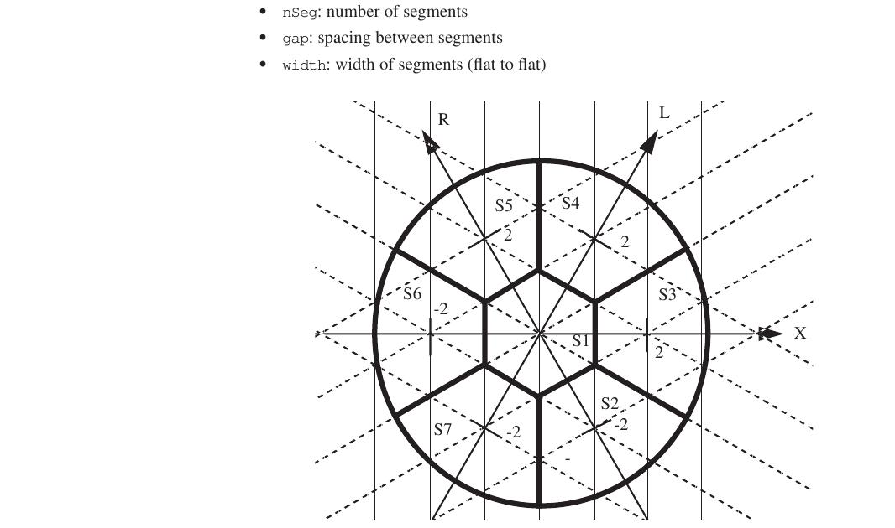

**FIGURE 22** Hexagonal coordinates X,L,R for a pie-shaped segmented mirror.

More than 1 segmented mirror can be used in a single prescription. In the case of 2 segmented mirrors, the segments are required to be lined up, so that the segmentation defined at the source is valid for both beams.

An example of a segment mirror .in-file (seg.in) is in Appendix A.5. The panels are numbered in the same order as they are in the Figure 23.

Input data:

    + +
    | Source ray grid types: |
    | Circular Square Hex |
    | Pie Flower |
    + +
    Enter source grid type [Circular]: Pie GridType
    Enter aperture diameter or angle [1.00000]:3.65 Aperture
    Enter number of grid points [128]:31 nGridPts

|                  |     |         |         |          | 67       |          | 66       |              | 65      |         | 64      |         | 63      |          | 62      |         |        |        |         |
|----|----|----|----|----|----|----|----|----|----|----|----|----|----|----|----|----|----|----|-------|
|                  |     |         |         |          | -5,5,10  |          | -3,6,9   |              | -1,7,8  |         | 1,8,7   |         | 3,9,6   |          | 5,10,5  |         |        |        |         |
|                  |     |         |         | 68       |          | 42       |          | 41           |         | 40      |         | 39      |         | 38       |         | 91      |        |        |         |
|                  |     |         |         | -6,3,9   |          | -4,4,8   |          | -2,5,7       |         | 0,6,6   |         | 2,7,5   |         | 4,8,4    |         | 6,9,3   |        |        |         |
|                  |     |         | 69      |          | 43       |          | 23       |              | 22      |         | 21      |         | 20      |          | 61      |         | 90     |        |         |
|                  |     |         | -7,1,8  |          | -5,2,7   |          | -3,3,6   |              | -1,4,5  |         | 1,5,4   |         | 3,6,3   |          | 5,7,2   |         | 7,8,1  |        |         |
|                  |     | 70      |         | 44       |          | 24       |          | 10           |         | 9       |         | 8       |         | 37       |         | 60      |        | 89     |         |
|                  |     | -8,-1,7 |         | -6,0,6   |          | -4,1,5   |          | -2,2,4       |         | 0,3,3   |         | 2,4,2   |         | 4,5,1    |         | 6,6,0   |        | 8,7,-1 |         |
| 71               |     |         | 45      |          | 25       |          | 11       |              | 3       |         | 2       |         | 19      |          | 36      |         | 59     |        | 88      |
| -9,-3,6          |     | -7,-2,5 |         | -5,-1,4  |          | -3,0,3   |          | -1,1,2 1,2,1 |         |         |         | 3,3,0   |         | 5,4,-1   |         | 7,5,-2  |        | 9,6,-3 |         |
| 72               | 46  |         | 26      |          | 12       |          | 4        |              | 1       |         | 7       |         | 18      |          | 35      |         | 58     |        | 87      |
| -10,-5,5 -8,-4,4 |     |         | -6,-3,3 |          | -4,-2,2  |          | -2,-1,1  |              | 0,0,0   |         | 2,1,-1  |         | 4,2,-2  |          | 6,3,-3  |         | 8,4,-4 |        | 10,5,-5 |
| 73               |     | 47      |         | 27       |          | 13       |          | 5            |         | 6       |         | 17      |         | 34       |         | 57      |        | 86     |         |
| -9,-6,3          |     | -7,-5,2 |         | -5,-4,1  |          | -3,-3,0  |          | -1,-2,-1     |         | 1,-1,-2 |         | 3,0,-3  |         | 5,1,-4   |         | 7,2,-5  |        | 9,3,-6 |         |
| 74               |     |         | 48      |          | 28       |          | 14       |              | 15      |         | 16      |         | 33      |          | 56      |         | 85     |        |         |
| -8,-7,1          |     |         | -6,-6,0 |          | -4,-5,-1 |          | -2,-4,-2 |              | 0,-3,-3 |         | 2,-2,-4 |         | 4,-1,-5 |          | 6,0,-6  |         | 8,1,-7 |        |         |
| 75               |     |         |         | 49       |          | 29       |          | 30           |         | 31      |         | 32      |         | 55       |         | 84      |        |        |         |
| -7,-8,-1         |     |         |         | -5,-7,-2 |          | -3,-6,-3 |          | -1,-5,-4     |         | 1,-4,-5 |         | 3,-3,-6 |         | 5,-2,-7  |         | 7,-1,-8 |        |        |         |
| 76               |     |         |         |          | 50       |          | 51       |              | 52      |         | 53      |         | 54      |          | 83      |         |        |        |         |
| -6,-9,-3         |     |         |         |          | -4,-8,-4 |          | -2,-7,-5 |              | 0,-6,-6 |         | 2,-5,-7 |         | 4,-4,-8 |          | 6,-3,-9 |         |        |        |         |
| 77               |     |         |         |          |          | 78       |          | 79           |         | 80      |         | 81      |         | 82       |         |         |        |        |         |
| -5,-10,-5        |     |         |         |          |          | -3,-9,-6 |          | -1,-8,-7     |         | 1,-7,-8 |         | 3,-6,-9 |         | 5,-5,-10 |         |         |        |        |         |

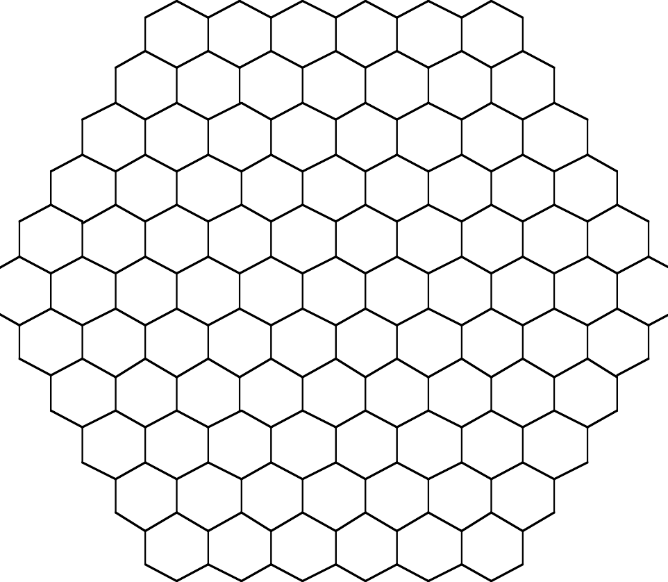{width="5.013888888888889in" height="4.361111111111111in"}**FIGURE 23** Hexagonal coordinates X,L,R for a large array

    Enter input plane x-axis vector (x,y,z) [1.00000,0.,0.]:1,0,0 xGrid Enter input plane y-axis vector (x,y,z) [0.,1.00000,0.]:0,1,0 yGrid Enter number of segments [no default]: 7 nSeg
    Enter segment width: [3.65000]:1.2 width
    Enter gap between segments: [0.]:0 gap
    Enter 3 segment 1 hex coords [no default]: 0,0,0 SegCoord
    Enter 3 segment 2 hex coords [no default]: 1,-1,-2
    Enter 3 segment 3 hex coords [no default]: 2,1,-1
    Enter 3 segment 4 hex coords [no default]: 1,2,1
    Enter 3 segment 5 hex coords [no default]: -1,1,2
    Enter 3 segment 6 hex coords [no default]: -2,-1,1
    Enter 3 segment 7 hex coords [no default]: -1,-2,-1
    Enter segment plane x-axis vector (x,y,z) [1.00000,0.,0.]:1,0,0 SegXgrid

Element data:

    Enter Element 1 Data:
    Enter element name (no blanks): (Elt): s1 EltName
    + +
    | Element types: |
    | Reflector NSReflector Segment |
    | Refractor NSRefractor LensArray |
    | FocalPlane Reference Return |
    | HOE Grating Obscuring |
    + +
    Enter element type :Segment Element
    + +
    | Surface types: |

**Element Types**

+---+---------------------+---------------------+----------------+---+
| \ | Flat                | Conic               | Aspheric       | \ |
| | |                     |                     |                | | |
+===+=====================+=====================+================+===+
| \ | Anamorphic          | Zernike             | Monomial       | \ |
| | |                     |                     |                | | |
+---+---------------------+---------------------+----------------+---+
| \ | Interpolated        | UserDefined         |                | \ |
| | |                     |                     |                | | |
+---+---------------------+---------------------+----------------+---+

    + +
    Enter surface type :Conic Surface
    Enter element vertex location (x,y,z) [no default]: 0,0,0 VptElt
    Enter element rotation point (x,y,z) [0.,0.,0.]:0,0,0 RptElt Enter element principal axis (x,y,z) [0.,0.,-1.00000]:0,0,-1 psiElt Enter e&f or Kc&Kr (1=e&f,2=Kc&Kr)? [1]:1
    Enter element focal length [1.000000E+22]:1.46 fElt
    Enter element eccentricity [0.]:1 eElt
    Do you want an aperture on this element? [NO]:
    Enter number of obscurations [0]:
    Enter Fresnel propagation distance [1.46000]:1.46 zElt
    + +
    | Propagation types: |
    | Geometric GeomUpdate FarField |
    | NFSpherical NFS1surf |
    | NFPlane NFP1surf |
    | NF1 NF2 |
    | SpatialFilter SF1surf |
    + +
    Enter propagation type [Geometric]: Geometric PropType
    Do you wish to use element-based coordinates?: [NO]:
    Enter element index of refraction [1.00000]:
    Enter element extinction coefficient [1.000000E+22]:

+----------+--------------------+-------------------------------------+
| iElt=    | 1                  |                                     |
+==========+====================+=====================================+
| EltName= | s1                 |                                     |
+----------+--------------------+-------------------------------------+
| Element= | Segment            |                                     |
+----------+--------------------+-------------------------------------+
| Surface= | Conic              |                                     |
+----------+--------------------+-------------------------------------+
| fElt=    | 1.460000000D+00    |                                     |
+----------+--------------------+-------------------------------------+
| eElt=    | 1.000000000D+00    |                                     |
+----------+--------------------+-------------------------------------+
| KrElt=   | -2.920000000D+00   |                                     |
+----------+--------------------+-------------------------------------+
| KcElt=   | -1.000000000D+00   |                                     |
+----------+--------------------+-------------------------------------+
| psiElt=  | 0.000000000D+00    | 0.000000000D+00 -1.000000000D+00    |
+----------+--------------------+-------------------------------------+
| VptElt=  | 0.000000000D+00    | 0.000000000D+00 0.000000000D+00     |
+----------+--------------------+-------------------------------------+
| RptElt=  | 0.000000000D+00    | 0.000000000D+00 0.000000000D+00     |
+----------+--------------------+-------------------------------------+
| IndRef=  | 1.000000000D+00    |                                     |
+----------+--------------------+-------------------------------------+
| Extinc=  | 1.000000000D+22    |                                     |
+----------+--------------------+-------------------------------------+
| nObs=    | 0                  |                                     |
+----------+--------------------+-------------------------------------+
| ApType=  | None               |                                     |
+----------+--------------------+-------------------------------------+
| zElt=    | 1.460000000D+00    |                                     |
+----------+--------------------+-------------------------------------+
| P        | Geometric          |                                     |
| ropType= |                    |                                     |
+----------+--------------------+-------------------------------------+
| nECoord= | -6                 |                                     |
+----------+--------------------+-------------------------------------+

    Is this correct? [YES]:
    Enter Element 2 Data:
    Enter element name (no blanks) [Elt]: s2 EltName
    + +
    | Element types: |
    | Reflector NSReflector Segment |
    | Refractor NSRefractor LensArray |
    | FocalPlane Reference Return |
    | HOE Grating Obscuring |
    + +
    Enter element type :Segment Element
    + +
    | Surface types: |
    | Flat Conic Aspheric |

+------------+----------+---------+-------+---------------------------+
| \|         | An       | Zernike | Mon   | \|                        |
|            | amorphic |         | omial |                           |
+============+==========+=========+=======+===========================+
| \|         | Inte     | User    |       | \|                        |
|            | rpolated | Defined |       |                           |
+------------+----------+---------+-------+---------------------------+

    + +
    Enter surface type :Conic Surface
    Enter element rotation point (x,y,z) [0.,0.,0.]:.6124997330,-1.060881274,
    .2569563356
    Do you want an aperture on this element? [NO]:
    Enter number of obscurations [0]:
    Enter Fresnel propagation distance [1.46000]:1.46 zElt
    + +
    | Propagation types: |
    | Geometric GeomUpdate FarField |
    | NFSpherical NFS1surf |
    | NFPlane NFP1surf |
    | NF1 NF2 |
    | SpatialFilter SF1surf |
    + +
    Enter propagation type [Geometric]: Geometric PropType
    Do you wish to use element-based coordinates?: [NO]:
    Enter element index of refraction [1.00000]:
    Enter element extinction coefficient [1.000000E+22]:
    iElt= 2
    EltName= s2 Element= Segment Surface= Conic
    fElt= 1.460000000D+00 eElt= 1.000000000D+00 KrElt= -2.920000000D+00 KcElt= -1.000000000D+00
    psiElt= 0.000000000D+00 0.000000000D+00 -1.000000000D+00 VptElt= 0.000000000D+00 0.000000000D+00 0.000000000D+00 RptElt= 6.124997330D-01 -1.060881274D+00 2.569563356D-01 IndRef= 1.000000000D+00
    Extinc= 1.000000000D+22
    nObs= 0
    ApType= None
    zElt= 1.460000000D+00
    PropType= Geometric nECoord= -6
    Is this correct? [YES]:
    ...
    Enter Element 7 Data:
    Enter element name (no blanks) [Elt]: s7 EltName
    + +
    | Element types: |
    | Reflector NSReflector Segment |
    | Refractor NSRefractor LensArray |
    | FocalPlane Reference Return |
    | HOE Grating Obscuring |
    + +
    Enter element type :Segment Element
    + +
    | Surface types: |
    | Flat Conic Aspheric |
    | Anamorphic Zernike Monomial |
    | Interpolated UserDefined |
    + +
    Enter surface type :Conic Surface
    Enter element rotation point (x,y,z) [0.,0.,0.]:-.612500534,-1.060880811,
    .2569563356
    Do you want an aperture on this element? [NO]:
    Enter number of obscurations [0]:
    Enter Fresnel propagation distance [1.46000]:1.46 zElt

**Element Types**

    + +
    | Propagation types: |
    | Geometric GeomUpdate FarField |
    | NFSpherical NFS1surf |
    | NFPlane NFP1surf |
    | NF1 NF2 |
    | SpatialFilter SF1surf |
    + +
    Enter propagation type [Geometric]: Geometric PropType
    Do you wish to use element-based coordinates?: [NO]:
    Enter element index of refraction [1.00000]:
    Enter element extinction coefficient [1.000000E+22]:
    iElt= 7
    EltName= s7 Element= Segment Surface= Conic
    fElt= 1.460000000D+00 eElt= 1.000000000D+00 KrElt= -2.920000000D+00 KcElt= -1.000000000D+00
    psiElt= 0.000000000D+00 0.000000000D+00 -1.000000000D+00 VptElt= 0.000000000D+00 0.000000000D+00 0.000000000D+00 RptElt= -6.125005340D-01 -1.060880811D+00 2.569563356D-01 IndRef= 1.000000000D+00
    Extinc= 1.000000000D+22
    nObs= 0
    ApType= None
    zElt= 1.460000000D+00
    PropType= Geometric nECoord= -6
    Is this correct? [YES]:

#### Generating segmented prescriptions: SegMirMaker

Hand-editing a .in file to define every segment of a 7- or 19-segment mirror is tedious. MACOS v4.00 ships with a separate tool, SegMirMaker, in MACOS_resources/segmirmaker/, that generates a .presc (suitable for inclusion in a .in file) and an Hx.m edge-sensor measurement matrix from a parent prescription.

SegMirMaker accepts:

A MACOS .in parent prescription. The parent element can be any conic or FreeForm surface.

The number of rings (nRing = 1 for 7-segment, 2 for 19-segment, etc.).

The axis orientation psi, segment size or aperture diameter, inter-segment gap, and segment standoff.

3-DOF (piston/tip/tilt) or 6-DOF segments.

For FreeForm parents, SegMirMaker copies the parent's lFF, FFCoef, FF coordinate frame, grid data, and grid frame verbatim into every segment, so all segments share the parent's underlying FreeForm shape. Each segment's Mon slot is left empty (MonZernCoef = 0) but with lMon = L2 (half the segment width); the user can later add per-segment figure error via the Mon Zernike coefficients without re-running SegMirMaker.

SegMirMaker is the modernized successor to the SMPGe ('Segmented Mirror Prescription Generator') VAX Fortran tool from 1992; the original is preserved in MACOS_resources/segmirmaker/Archive/SMPGe.for. See MACOS_resources/segmirmaker/README.md for full usage.

#### Flower Segmented Mirrors

Flower segmented mirrors consist of a central segment surrounded by “petal” segments. As such, they are like the “pie” segmented mirrors of the previous section, except flower segmentation is not limited to a hexagonal geometry. Flower segmentation is defined at the light source using GridType=Flower. Two other parameters are used to define the segmentation:

-   nPetals: number of petals surrounding the central segment

-   radCtr: radius of the largest inscribed circle defining the size of the center segment

Only 1 segment coordinate is needed per segment, to specify its location in sequence around the central segment, with the 0th segment being the center segment, the 1st segment having one edge along the SegXgrid axis and the other along a line rotated 360°/

nPetals towards the SegYgrid axis, and the 2nd and subsequent segments located in the same sequence around the center segment. See Fig. 24 for an illustration.

{width="0.11041666666666666in" height="0.26666666666666666in"}


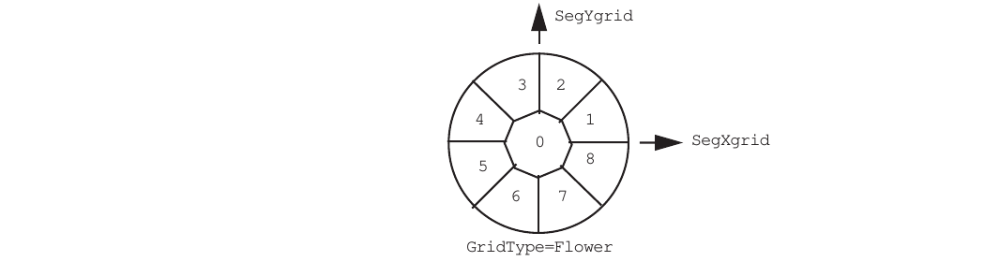

**FIGURE 24**Flower segmentation, showing segment coordinates

#### Reflective Non-Sequential Surfaces

In most optical systems, all rays strike one element before passing on to the next element. There are exceptions, such as corner cube reflectors, where some rays will strike an element before others. These are modeled in MACOS using non-sequential surfaces. There is no limit on the number of non-sequential elements and the order that the non-sequential elements are entered into MACOS does not matter. However, there must be sequential surfaces before and after the group of non-sequential surfaces. For the purpose of the following discussion, we call them the first and second surfaces, respectively. After the ray passes the first sequential surface, MACOS solves for the next surface that the ray strikes which can be any of the group of non-sequential surfaces or the second sequential surface. If the ray hits a non-sequential surface, the procedure continues until the second sequential surface is encountered. After the second sequential surface is encountered the ray trace proceeds normally. Figure 25 shows the corner cube reflector example. The .in-file is in Appendix A.3

NOTE: Geometric propagation only is supported through non-squential elements.


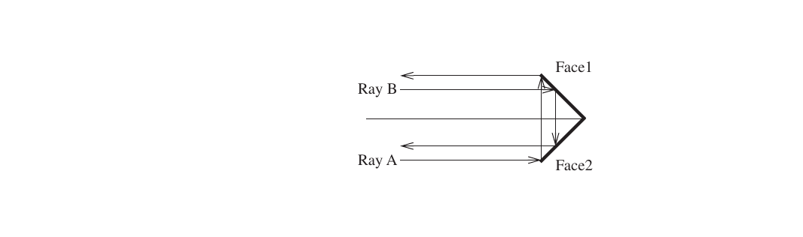

**FIGURE 25** Non-sequential surface: Ray A has Face2 as first element, Ray B’s first element is Face1.

Corner cube example

    Enter element name (no blanks) [Elt]: Face1 EltName
    + +

+-----------------------+---------+-----------------------------------+
| \| Element types:     |         | \|                                |
+=======================+=========+===================================+
| \| Reflector          | NSRe    | Segment \|                        |
|                       | flector |                                   |
+-----------------------+---------+-----------------------------------+
| \| Refractor          | NSRe    | LensArray \|                      |
|                       | fractor |                                   |
+-----------------------+---------+-----------------------------------+
| \| FocalPlane         | Re      | Return \|                         |
|                       | ference |                                   |
+-----------------------+---------+-----------------------------------+

**Element Types**

    | HOE Grating Obscuring |
    + +
    Enter element type :NSReflector Element
    + +
    | Surface types: |
    | Flat Conic Aspheric |
    | Anamorphic Zernike Monomial |
    | Interpolated UserDefined |
    + +
    Enter surface type :Flat Surface
    Enter element vertex location (x,y,z) [no default]: 0,0,0 VptElt
    Enter element rotation point (x,y,z) [0.,0.,0.]:0,0,0 RptElt Enter element principal axis (x,y,z) [0.,0.,-1.00000]:-.7071,0,-.7071 psiElt Do you want an aperture on this element? [NO]:
    Enter number of obscurations [0]:
    Enter Fresnel propagation distance [1.000000E+22]:1d22 zElt
    + +
    | Propagation types: |
    | Geometric GeomUpdate FarField |
    | NFSpherical NFS1surf |
    | NFPlane NFP1surf |
    | NF1 NF2 |
    | SpatialFilter SF1surf |
    + +
    Enter propagation type [Geometric]: Geometric PropType
    Do you wish to use element-based coordinates?: [NO]:
    Enter element index of refraction [1.00000]:1d0 Enter element extinction coefficient [1.000000E+22]:
    Enter element name (no blanks) [Elt]: Face2 EltName
    + +
    | Element types: |
    | Reflector NSReflector Segment |
    | Refractor NSRefractor LensArray |
    | FocalPlane Reference Return |
    | HOE Grating Obscuring |
    + +
    Enter element type :NSReflector Element
    + +
    | Surface types: |
    | Flat Conic Aspheric |
    | Anamorphic Zernike Monomial |
    | Interpolated UserDefined |
    + +
    Enter surface type :Flat Surface
    Enter element vertex location (x,y,z) [no default]: 0,0,0 VptElt
    Enter element rotation point (x,y,z) [0.,0.,0.]:0,0,0 RptElt Enter element principal axis (x,y,z) [0.,0.,-1.00000]:.7071,0,-.7071 psiElt Do you want an aperture on this element? [NO]:
    Enter number of obscurations [0]:
    Enter Fresnel propagation distance [1.000000E+22]:1d22 zElt
    + +
    | Propagation types: |

+-------------------------+---------------------+-----------------+---+
| \| Geometric            | GeomUpdate          | FarField        | \ |
|                         |                     |                 | | |
+=========================+=====================+=================+===+
| \| NFSpherical          | NFS1surf            |                 | \ |
|                         |                     |                 | | |
+-------------------------+---------------------+-----------------+---+
| \| NFPlane              | NFP1surf            |                 | \ |
|                         |                     |                 | | |
+-------------------------+---------------------+-----------------+---+

+------------+----------+-----------+---------------------------------+
| \|         | NF1      | NF2       | \|                              |
+============+==========+===========+=================================+
| \|         | Spati    | SF1surf   | \|                              |
|            | alFilter |           |                                 |
+------------+----------+-----------+---------------------------------+

    + +
    Enter propagation type [Geometric]: Geometric PropType
    Do you wish to use element-based coordinates?: [NO]:
    Enter element index of refraction [1.00000]:1d0 Enter element extinction coefficient [1.000000E+22]:

#### Refractive Non-Sequential Surfaces

Refractive non-sequential surfaces are very similiar to reflective non-sequential surface (see Section 4.4.13). An example illustrating their application is a Luneberg Lens Antenna is provided in Appendix A.3. The Luneberg Lens is a stepped-gradient index lens consisting of concentric spherical shells, which grow denser as they decrease in radius. A point source on the surface produces rays that follow nearly elliptical trajectories, emerging on the other side of the lens in a collimated beam. Using multiple point sources distributed on the surface, the Luneberg Lens can provide instantaneous, solid-state beam coverage over nearly 4π steradians.

### Element Surface Types

#### Flat Surfaces

Flat surfaces are completely defined by a point (the “vertex” VptElt) on the surface, and the unit vector normal to the surface at that point (psiElt). Technically, the *vertex* of a plane or sphere is undefined; the user is free to pick any point on the surface as the vertex. In MACOS, a flat surface is a spherical surface with an infinite radius of curvature, KrElt=1d22. See Section 4.4.1 for an example of entering flat surface data.

#### Conic Surfaces

Conic surfaces – really conicoids of revolution – include the most common optical shapes: spheres, ellipsoids, paraboloids, hyperboloids. Flat surfaces are spheroids with an infinite radius of curvature. MACOS specifies the shape of a conic surface using two surface-specific parameters: the conic constant KcElt and the “radius,” KrElt. Table 7 lists the common names associated with special values of the conic constant.

**TABLE 7.** Conic coefficients

+---------------------+------------------------------------------------+
| **Conic             | **Conic section**                              |
| coefficient**       |                                                |
+=====================+================================================+
| KcElt\<-1           | hyperboloid                                    |
+---------------------+------------------------------------------------+
| KcElt=-1            | paraboloid                                     |
+---------------------+------------------------------------------------+
| -1\<KcElt\<0        | ellipsoid with major axis on the principal     |
|                     | axis (also known as prolate spheroid), psiElt  |
+---------------------+------------------------------------------------+
| KcElt=0             | sphere                                         |
+---------------------+------------------------------------------------+
| KcElt\>0            | oblate ellipsoid                               |
+---------------------+------------------------------------------------+

MACOS also accepts input of conic parameters in terms of the geometric focal length (which is *not* the same as optical focal length of a spherical mirror) and eccentricity which are denoted fElt and eElt, respectively. Eccentricity and focal length are related to the conic constant and radius by:

*eElt* =

**(4.1)**

**Element Surface Types**

*fElt* =

----------–---*K*----*r*---*E*----*l*--*t*----------

**(4.2)**

(1 + –*KcElt*)

The “sag equation” for a conic surface, which is to say, the equation which defines all points on the surface, is:

*Z*(*h*) =

-----------------------------------------------------------------------------------------------

**(4.3)**

\[*KrElt* + (*KrElt*)2 – (1 + *KcElt* )*h*^2^)\]

Here h is the radial distance to the projection of the point of incidence onto a plane perpendicular to the principal axis and including the surface vertex; and Z is the height of the surface above that plane (Figure 26).

    psiElt

Point of incidence vector

Optical surface

Z(h)

h

{width="8.897637795275591e-2in" height="0.14645669291338584in"}{width="0.1437007874015748in" height="0.10551181102362205in"}**FIGURE 26** Conic mirror parameters

Note that the *vertex* of a conic refers to the geometric vertex except in the case of an oblate ellipsoid. For an oblate ellipsoid (KcElt\>0), the “vertex” is taken as the point where the minor axis intersects the surface.

See Section 4.4.2 for an example of entering conic surface data.

#### Generalized (10th-Order) Aspheric Surfaces

Generalized aspheric surfaces use a conic surface as a base, and then impose a deviation on it, defined by additional, higher order, symmetric terms in radius h. In MACOS, generalized aspheric surfaces take the form

*h*^2^ 4 6 8 10

*Z*(*h*) =

----------------------------------------------------------------------------------------------- + *Ah* + *Bh* + *Ch* + *Dh*

**(4.1)**

\[*KrElt* + (*KrElt*)2 – (1 + *KcElt* )*h*^2^)\]

where h is the radial pupil coordinate (the magnitude projection of the of the point of incidence vector onto the plane perpendicular to psiElt as shown in Figure 29), KrElt is the radius of curvature of the element, KcElt is the conic constant, and A, B, C, D are the aspheric coefficients, AsphCoef(i), with AsphCoef(1) = A, AsphCoef(2) = B, AsphCoef(3) = C, and AsphCoef(4) = D.

Note: The A,B,C,D parameters are used by optical design codes as well, except that the signs of the coefficients may differ in some cases. The sign of the coefficients in some codes is a function of the direction of the incident ray. MACOS references surfaces to a global coordinate system and does not assume a particular direction of the beam in defining the optical train. In MACOS the coefficients are positive in the direction of the element psiElt vector.

This example shows how to enter a higher order aspheric reflector.

    Enter element name (no blanks) [Elt]: gen_asphere EltType
    + +
    | Element types: |
    | Reflector NSReflector Segment |
    | Refractor NSRefractor LensArray |
    | FocalPlane Reference Return |
    | HOE Grating Obscuring |
    + +
    Enter element type :Reflector Element
    + +
    | Surface types: |
    | Flat Conic Aspheric |
    | Anamorphic Zernike Monomial |
    | Interpolated UserDefined |
    + +
    Enter surface type :Aspheric Surface
    Enter element vertex location (x,y,z) [no default]: 0,0,0 VptElt
    Enter element rotation point (x,y,z) [0.,0.,0.]:0,0,0 RptElt
    Enter element principal axis (x,y,z) [0.,0.,-1.00000]:0,0,1 psiElt
    Enter e&f or Kc&Kr (1=e&f,2=Kc&Kr)? [1]:2
    Enter Conic Constant [0.]:-1 KcElt
    Enter Radius [-1.000000E+22]:5 KrElt
    Do you want an aperture on this element? [NO]:
    Enter number of obscurations [0]:
    Enter Fresnel propagation distance [2.50000]:5 zElt
    + +
    | Propagation types: |
    | Geometric GeomUpdate FarField |
    | NFSpherical NFS1surf |
    | NFPlane NFP1surf |
    | NF1 NF2 |
    | SpatialFilter SF1surf |
    + +
    Enter propagation type [Geometric]: Geometric PropType
    Do you wish to use element-based coordinates?: [NO]:
    Enter element index of refraction [1.00000]:
    Enter element extinction coefficient [1.000000E+22]:
    Enter aspheric coefficients A,B,C,D [0,0,0,0]:1e-9,2e-19,3e-17,4e-20 AsphCoef

This dialog produced the following prescription data:

+--------+----------------+--------------+-----------------------------+
| iElt=  | 1              |              |                             |
| El     |                |              |                             |
| tName= | gen_asphere    |              |                             |
| El     | Reflector      |              |                             |
| ement= |                |              |                             |
|        | Aspheric       |              |                             |
| Su     |                |              |                             |
| rface= |                |              |                             |
+========+================+==============+=============================+
| KrElt= | -5             |              |                             |
|        | .000000000D+00 |              |                             |
+--------+----------------+--------------+-----------------------------+
| KcElt= | -1             |              |                             |
|        | .000000000D+00 |              |                             |
+--------+----------------+--------------+-----------------------------+
| p      | 0              | 0.0          | 1.000000000D+00             |
| siElt= | .000000000D+00 | 00000000D+00 |                             |
+--------+----------------+--------------+-----------------------------+
| V      | 0              | 0.0          | 0.000000000D+00             |
| ptElt= | .000000000D+00 | 00000000D+00 |                             |
+--------+----------------+--------------+-----------------------------+
| R      | 0              | 0.0          | 0.000000000D+00             |
| ptElt= | .000000000D+00 | 00000000D+00 |                             |
+--------+----------------+--------------+-----------------------------+
| I      | 1              |              |                             |
| ndRef= | .000000000D+00 |              |                             |
+--------+----------------+--------------+-----------------------------+
| E      | 1              |              |                             |
| xtinc= | .000000000D+22 |              |                             |
+--------+----------------+--------------+-----------------------------+
| Asp    | 1              | 2.0          | 3.000000000D-17             |
| hCoef= | .000000000D-09 | 00000000D-19 | 4.00000000D-20              |
+--------+----------------+--------------+-----------------------------+
| nObs=  | 0              |              |                             |
+--------+----------------+--------------+-----------------------------+
| A      | None           |              |                             |
| pType= |                |              |                             |
+--------+----------------+--------------+-----------------------------+
| zElt=  | 5              |              |                             |
|        | .000000000D+00 |              |                             |
+--------+----------------+--------------+-----------------------------+
| Pro    | Geometric      |              |                             |
| pType= |                |              |                             |
+--------+----------------+--------------+-----------------------------+
| nE     | -6             |              |                             |
| Coord= |                |              |                             |
+--------+----------------+--------------+-----------------------------+

#### Zernike Surfaces

Zernike surfaces add a deformation—described by a Zernike polynomial—to the surface of a conicoid. The deformation is entered as the “excess sag” of the surface (*not* the wavefront error). MACOS allows up to the first 45 Zernike terms to be added to a conicoid base surface shape. The Zernike polynomial set that is used is that defined by Malacara in his book, “Optical Shop Testing.” The ordering of the polynomials used in

**Element Surface Types**

MACOS, and well as two other popular orderings, are shown in Table 8. In the next release of MACOS, the user will be able to select from these three orderings, as well as only enter the first 36 terms if so desired (for backwards compatibility with previous versions of MACOS).

**TABLE 8.** Zernike polynomials

+------------+----------+---------+----------------------------------+
| **MACOS**  | **Code V | **F     | **Polynomial**                   |
|            | (Noll)** | RINGE** |                                  |
| **(M       |          |         |                                  |
| alacara)** |          | **(Fr   |                                  |
|            |          | inge)** |                                  |
+============+==========+=========+==================================+
| 1          | 1        | 1       | 1                                |
+------------+----------+---------+----------------------------------+
| 2          | 3        | 3       | R sin(A)                         |
+------------+----------+---------+----------------------------------+
| 3          | 2        | 2       | R cos(A)                         |
+------------+----------+---------+----------------------------------+
| 4          | 6        | 6       | R^2^ sin(2A)                     |
+------------+----------+---------+----------------------------------+
| 5          | 5        | 4       | 2R2-1                            |
+------------+----------+---------+----------------------------------+
| 6          | 4        | 5       | R^2^ cos(2A)                     |
+------------+----------+---------+----------------------------------+
| 7          | 10       | 11      | R^3^ sin(3A)                     |
+------------+----------+---------+----------------------------------+
| 8          | 9        | 8       | (3R^3^-2R) sin(A)                |
+------------+----------+---------+----------------------------------+
| 9          | 8        | 7       | (3R^3^-2R) cos(A)                |
+------------+----------+---------+----------------------------------+
| 10         | 7        | 10      | R^3^ cos(3A)                     |
+------------+----------+---------+----------------------------------+
| 11         | 15       | 18      | R^4^sin(4A)                      |
+------------+----------+---------+----------------------------------+
| 12         | 14       | 13      | (4R^4^-3R^2^) sin(2A)            |
+------------+----------+---------+----------------------------------+
| 13         | 13       | 9       | 6R4-6R2+1                        |
+------------+----------+---------+----------------------------------+
| 14         | 12       | 12      | (4R^4^-3R^2^) cos(2A)            |
+------------+----------+---------+----------------------------------+
| 15         | 11       | 17      | R^4^ cos(4A)                     |
+------------+----------+---------+----------------------------------+
| 16         | 21       | 27      | R^5^ sin(5A)                     |
+------------+----------+---------+----------------------------------+
| 17         | 20       | 20      | (5R^5^-4R^3^) sin(3A)            |
+------------+----------+---------+----------------------------------+
| 18         | 19       | 15      | (10R5-12R3+3R) sin(A)            |
+------------+----------+---------+----------------------------------+
| 19         | 18       | 14      | (10R5-12R3+3R) cos(A)            |
+------------+----------+---------+----------------------------------+
| 20         | 17       | 19      | (5R^5^-4R^3^) cos(3A)            |
+------------+----------+---------+----------------------------------+
| 21         | 16       | 26      | R^5^ cos(5A)                     |
+------------+----------+---------+----------------------------------+
| 22         | 28       |         | R^6^ sin(6A)                     |
+------------+----------+---------+----------------------------------+
| 23         | 27       | 29      | (6R^6^-5R^4^) sin(4A)            |
+------------+----------+---------+----------------------------------+
| 24         | 26       | 22      | (15R6-20R4+6R2) sin(2A)          |
+------------+----------+---------+----------------------------------+
| 25         | 25       | 16      | 20R^6^-30R^4^+12R^2^+1           |
+------------+----------+---------+----------------------------------+
| 26         | 24       | 21      | (15R6-20R4+6R2) cos(2A)          |
+------------+----------+---------+----------------------------------+
| 27         | 23       | 28      | (6R^6^-5R^4^) cos(4A)            |
+------------+----------+---------+----------------------------------+
| 28         | 22       |         | R^6^ cos(6A)                     |
+------------+----------+---------+----------------------------------+
| 29         | 36       |         | R^7^ sin(7A)                     |
+------------+----------+---------+----------------------------------+
| 30         | 35       |         | (7R^7^-6R^5^) sin(5A)            |
+------------+----------+---------+----------------------------------+
| 31         | 34       | 31      | (21R7-30R5+10R3) sin(3A)         |
+------------+----------+---------+----------------------------------+
| 32         | 33       | 24      | (35R7-60R5+30R3-4R) sin(A)       |
+------------+----------+---------+----------------------------------+
| 33         | 32       | 23      | (35R7-60R5+30R3-4R) cos(A)       |
+------------+----------+---------+----------------------------------+

**TABLE 8.** Zernike polynomials

+------------+----------+---------+----------------------------------+
| **MACOS**  | **Code V | **F     | **Polynomial**                   |
|            | (Noll)** | RINGE** |                                  |
| **(M       |          |         |                                  |
| alacara)** |          | **(Fr   |                                  |
|            |          | inge)** |                                  |
+============+==========+=========+==================================+
| 34         | 31       | 30      | (21R7-30R5+10R3) cos(3A)         |
+------------+----------+---------+----------------------------------+
| 35         | 30       |         | (7R^7^-6R^5^) cos(5A)            |
+------------+----------+---------+----------------------------------+
| 36         | 29       |         | R^7^ cos(7A)                     |
+------------+----------+---------+----------------------------------+
| 37         | 45       |         | R^8^ sin(8A)                     |
+------------+----------+---------+----------------------------------+
| 38         | 44       |         | (8R^8^-7R^6^) sin(6A)            |
+------------+----------+---------+----------------------------------+
| 39         | 43       |         | (28R8-42R6+15R4) sin(4A)         |
+------------+----------+---------+----------------------------------+
| 40         | 42       | 33      | (56R8-105R6+60R4-10R2) sin(2A)   |
+------------+----------+---------+----------------------------------+
| 41         | 41       | 25      | 70R8-140R6+90R4-20R2+1           |
+------------+----------+---------+----------------------------------+
| 42         | 40       | 32      | (56R8-105R6+60R4-10R2) cos(2A)   |
+------------+----------+---------+----------------------------------+
| 43         | 39       |         | (28R8-42R6+15R4) cos(4A)         |
+------------+----------+---------+----------------------------------+
| 44         | 38       |         | (8R^8^-7R^6^) cos(6A)            |
+------------+----------+---------+----------------------------------+
| 45         | 37       |         | R^8^ cos(8A)                     |
+------------+----------+---------+----------------------------------+

KcElt and KrElt (or eElt and fElt) are the parameters that describe the conicoid. The deviations occur only in the z-direction of a special coordinate frame. The variable pMon is the center of the coordinate frame. The variables xMon, yMon, and zMon define the special coordinate frame as shown in Figure 27.The variable lMon is the semi-diameter of the circle to which the Zernike deviations are scaled (remember that Zernikes are defined on a unit circle).

z Zernike deviations {width="0.22291666666666668in" height="0.17847222222222223in"}

    psiElt

occur only in z direction

    zMon

{width="0.23661417322834646in" height="0.19015748031496063in"}

Top View


Exaggerated side view with coordinate description

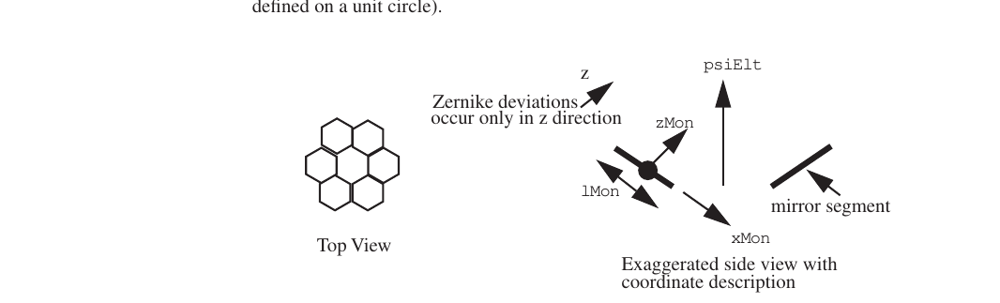

**FIGURE 27** Specialized coordinate frame

Zernike polynomials, listed in Table 8, are orthogonal over a unit circle. The polar coordinates (R, A) are related to the coordinates of the projection of the point of incidence vector onto the plane perpendicular defined by xMon and yMon (X, Y) by X=R lMon cos(A) and Y=R lMon sin(A). The more common Seidel aberrations can be calculated from the Zernike coefficients (ref. Malacara).An example using a Zernike surface to simulate deformations on the primary mirror of a small telescope is provided in Appendix A.7. The following dialog illustrates the responses the NEW command expects in entering a Zernike reflector:

    Enter element name (no blanks) [Elt]: zern_surface EltName
    + +

+-----------------------+---------+-----------------------------------+
| \| Element types:     |         | \|                                |
+=======================+=========+===================================+
| \| Reflector          | NSRe    | Segment \|                        |
|                       | flector |                                   |
+-----------------------+---------+-----------------------------------+
| \| Refractor          | NSRe    | LensArray \|                      |
|                       | fractor |                                   |
+-----------------------+---------+-----------------------------------+
| \| FocalPlane         | Re      | Return \|                         |
|                       | ference |                                   |
+-----------------------+---------+-----------------------------------+

**Element Surface Types**

    | HOE Grating Obscuring |
    + +
    Enter element type :Reflector Element
    + +
    | Surface types: |
    | Flat Conic Aspheric |
    | Anamorphic Zernike Monomial |
    | Interpolated UserDefined |
    + +
    Enter surface type :Zernike Surface
    Enter element vertex location (x,y,z) [no default]: 0,0,0 VptElt
    Enter element rotation point (x,y,z) [0.,0.,0.]:0,0,0 RptElt Enter element principal axis (x,y,z) [0.,0.,-1.00000]:0,0,-1 psiElt Enter e&f or Kc&Kr (1=e&f,2=Kc&Kr)? [1]:2
    Enter Conic Constant [0.]:0 KcElt
    Enter Radius [-1.000000E+22]:1d22 KrElt
    Do you want an aperture on this element? [NO]:
    Enter number of obscurations [0]:
    Enter Fresnel propagation distance [1.000000E+22]:1d22 zElt
    + +
    | Propagation types: |
    | Geometric GeomUpdate FarField |
    | NFSpherical NFS1surf |
    | NFPlane NFP1surf |
    | NF1 NF2 |
    | SpatialFilter SF1surf |
    + +
    Enter propagation type [Geometric]: Geometric PropType
    Do you wish to use element-based coordinates?: [NO]:
    Enter element index of refraction [1.00000]:1
    Enter element extinction coefficient [1.000000E+22]:
    Enter Zernike coefficients 1-6 [0.,0.,0.,0.,0.,0.]:.0001,0,.00002,0,0, .00001
    ZernCoef
    Enter Zernike coefficients 7-12 [0.,0.,0.,0.,0.,0.]:0,0,.000001,.00002,0,0 Zern-Coef
    Enter Zernike coefficients 13-18 [0.,0.,0.,0.,0.,0.]:0,.000003,.000001,0,0, .000002
    ZernCoef
    EnterZernikecoefficients19-24[0.,0.,0.,0.,0.,0.]:.0000005,.0000001,0,0,.000002,.00004
    ZernCoef
    Enter Zernike coefficients 25-30 [0.,0.,0.,0.,0.,0.]:.0000001,0,0,0, .000001,0
    ZernCoef
    Enter Zernike coefficients 31-36 [0.,0.,0.,0.,0.,0.]:0,0,0,0,0,0 ZernCoef
    Enter Zernike coefficients 37-42 [0.,0.,0.,0.,0.,0.]:0,0,0,0,0,0 ZernCoef
    Enter Zernike coefficients 43-45 [0.,0.,0.]:0,0,0 ZernCoef Enter surface reference point location (x,y,z) [0.,0.,0.]:0,0,0 pMon Enter surface x-axis unit vector (x,y,z) [-1.00000,0.,0.]:1,0,0 xMon Enter surface y-axis unit vector (x,y,z) [0.,-1.00000,0.]:0,1,0 yMon Enter surface z-axis unit vector (x,y,z) [0.,0.,-1.00000]:0,0,1 zMon Orthoganalized zMon= 0. 0. 1.0000000000000
    Enter scale length [1.00000]:1 lMon

This dialog produced the following prescription data:

    iElt= 1
    EltName= zern_surface Element= Reflector Surface= Zernike
    KrElt= -1.000000000D+22 KcElt= 0.000000000D+00
    psiElt= 0.000000000D+00 0.000000000D+00 -1.000000000D+00 VptElt= 0.000000000D+00 0.000000000D+00 0.000000000D+00

+-----------------+------------------------+---------------------------+
| RptElt=         | 0.000000000D+00        | 0.000000000D+00           |
|                 | 0.000000000D+00        |                           |
+=================+========================+===========================+
| IndRef=         | 1.000000000D+00        |                           |
+-----------------+------------------------+---------------------------+
| Extinc=         | 1.000000000D+22        |                           |
+-----------------+------------------------+---------------------------+
| ZernCoef=       | 1.000000000D-04        | 2.000000000D-05           |
|                 | 0.000000000D+00        | 0.000000000D+00           |
+-----------------+------------------------+---------------------------+

    0.000000000D+00 1.000000000D-05
    0.000000000D+00 0.000000000D+00 1.000000000D-06 2.000000000D-05
    0.000000000D+00 0.000000000D+00
    0.000000000D+00 3.000000000D-06 1.000000000D-06 0.000000000D+00
    0.000000000D+00 2.000000000D-06
    5.000000000D-07 1.000000000D-07 0.000000000D+00 0.000000000D+00
    2.000000000D-06 4.000000000D-05
    1.000000000D-07 0.000000000D+00 0.000000000D+00 0.000000000D+00
    1.000000000D-06 0.000000000D+00
    0.000000000D+00 0.000000000D+00 0.000000000D+00 0.000000000D+00
    0.000000000D+00 0.000000000D+00
    0.000000000D+00 0.000000000D+00 0.000000000D+00 0.000000000D+00
    0.000000000D+00 0.000000000D+00

+-----------+---------------------------------------+------------------+
|           | 0.000000000D+00 0.000000000D+00       | 0.000000000D+00  |
+===========+=======================================+==================+
| pMon=     | 0.000000000D+00 0.000000000D+00       | 0.000000000D+00  |
+-----------+---------------------------------------+------------------+
| xMon=     | 1.000000000D+00 0.000000000D+00       | 0.000000000D+00  |
+-----------+---------------------------------------+------------------+
| yMon=     | 0.000000000D+00 1.000000000D+00       | 0.000000000D+00  |
+-----------+---------------------------------------+------------------+
| zMon=     | 0.000000000D+00 0.000000000D+00       | 1.000000000D+00  |
+-----------+---------------------------------------+------------------+
| lMon=     | 1.000000000D+00                       |                  |
+-----------+---------------------------------------+------------------+
| nObs=     | 0                                     |                  |
+-----------+---------------------------------------+------------------+
| ApType=   | None                                  |                  |
+-----------+---------------------------------------+------------------+
| zElt=     | 1.000000000D+22                       |                  |
+-----------+---------------------------------------+------------------+
| PropType= | Geometric                             |                  |
+-----------+---------------------------------------+------------------+
| nECoord=  | -6                                    |                  |
+-----------+---------------------------------------+------------------+

#### Sparse Zernike input

In addition to the dense MonCoef form (120 coefficients in Cartesian monomial order), MACOS reads Zernike coefficients in a sparse 'modes + coefs' form:

    MonZernType= BornWolf
    nMonZernCoef= 4
    MonZernModes= 4 9 16 25
    MonZernCoef= -4.819E+00 4.001E+00 1.197E+00 2.269E-03

MonZernType selects the Zernike ordering and normalization. Supported types: ANSI, BornWolf, Fringe, NormANSI, NormBornWolf, NormFringe, NormNoll, Noll, NormAnnularNoll, NormHex, ExtFringe. The Norm\* variants use RMS normalization; the unprefixed variants are unnormalized.

Conversion to the internal monomial form (MonCoef) happens automatically at trace time. The same scheme applies to FF Zernikes: FFZernType, nFFZernCoef, FFZernModes, FFZernCoef. Modes are 1-indexed.

#### Monomial Surfaces

MACOS has a second polynomial-based deformed-surface type, evaluated as a sum of Cartesian monomials. The generating function is:

**(4.1)**

The user must specify 120 coefficients in the prescription file.

#### Toric Surfaces

Toric surfaces are surfaces that have different shapes in some specified orthogonal x-and y-axes.Cylindrical and toroidal surfaces are two examples. Toric surfaces are distinguished from the anamorphic surfaces by there being a non-zero conic constant in ony 1 of the axes. MACOS toric surfaces are entered using the standard KrElt and KcElt format, except that two sets of these conic parameters are entered: one set for each of the x-and y-axis directions. The variable AnaCoef holds the values in the following order: Krx, Kry, Kcx. In addition, a specialized coordinate frame must be used to define the local x- and y-axes for these variables. This is the same specialized coordinate frame used in Section 4.5.4 and is defined by pMon, xMon, yMon, and zMon as shown in Figure 27. An example of an (cylindrical) anamorphic surface as defined in a .in-file is shown below

#### Anamorphic Surfaces

Anamorphic surfaces are surfaces that have different (conic) shapes in some specified orthogonal x- and y-axes. Cylindrical optics and astigmatic plates are two examples. MACOS anamorphic surfaces are entered using the standard KrElt and KcElt format, except that two sets of these conic parameters are entered: one set for each of the x- and

**Element Surface Types**

y-axis directions. The variable AnaCoef holds the values in the following order: Krx, Kry, Kcx, Kcy. In addition, a specialized coordinate frame must be used to define the local x- and y-axes for these variables. This is the same specialized coordinate frame used in Section 4.5.4 and is defined by pMon, xMon, yMon, and zMon as shown in Figure 27. An example of an (cylindrical) anamorphic surface as defined in a .in-file is shown below.

    iElt= 1
    EltName= ana_surf Element= Refractor Surface= Anamorph
    psiElt= 0.000000000D+00 0.000000000D+00 -1.000000000D+00 VptElt= 0.000000000D+00 0.000000000D+00 0.000000000D+00 RptElt= 0.000000000D+00 0.000000000D+00 0.000000000D+00 IndRef= 1.000000000D+00
    Extinc= 1.000000000D+22
    AnaCoef= -1.700000000D+02 -1.000000000D+00 -1.000000000D+22 0.000000000D+00 pMon= 0.000000000D+00 0.000000000D+00 0.000000000D+00
    xMon= -1.000000000D+00 0.000000000D+00 0.000000000D+00 yMon= 0.000000000D+00 1.000000000D+00 0.000000000D+00 zMon= 0.000000000D+00 0.000000000D+00 -1.000000000D+00
    nObs= 0
    ApType= None
    zElt= 1.000000000D+22
    PropType= Geometric nECoord= -6

#### User-Defined Surfaces: Deformable Mirrors

MACOS comes with 5 built-in user-defined surfaces. These surfaces use influence functions to model standard deformable mirror configurations for adaptive optics applications. They assume a grid of push-pull actuators spread out in regular patterns across the surface of the element. Coefficients that define the extension of each actuator are read from a file (or are directly modified by a calling program, if you are using SMACOS). The mirror coefficient file is specified in the prescription (or through the MODIFY command) as:

    UDSrfFile=’filename’

The supplied deformable mirror types are listed in order of UDSrfType:

1.  349-actuator deformable mirror. Actuators are located on a 7-mm spacing square grid. Units are inches.

2.  349-actuator deformable mirror. Actuators are located on a 7-mm spacing square grid. Units are cm.

3.  397-actuator deformable mirror. Actuators are located on a 7-mm spacing hex grid. Units are cm.

4.  349-actuator deformable mirror with squared-out influence function. Actuators are located on a 7-mm spacing square grid. Units are cm.

5.  349-actuator deformable mirror with ideal actuator influence functions (bilinear approximation). Actuators are located on a 7-mm spacing square grid. Units are inches.

6.  349-actuator deformable mirror with squared-out influence function. Actuators are located on a 7-mm spacing square grid. Units are cm.

An example of the use of deformable mirrors, as well as lenslet arrays and the ATMOS

atmospheric phase disturbance command, is provided in Appendix A.4.

#### Interpolated Surfaces Using Regularly Gridded Data

MACOS provides interpolated surfaces of 2 types. The first type uses regular square gridded data, in the form of a matrix, whose rows and columns are filled with values giving the surface height deviation from a base conicoid of revolution. This form of interpolated surface, described in this section, is compatible with the high-density information typically generated by optical test interferometers. It uses linear interpolation to determine the intercept point of each ray at the optical surface, rather than the more compute-intensive 3rd-order interpolation of the more general X-Y-Z interpolated surface discussed in the next section.

Grid-data surfaces are defined using 3 additional parameters. These are:

-   mGridMat: the dimension of the gridded data matrix (nGridMat by nGridMat)

-   GridSrfdx: spacing of the data grids in base units

-   GridFile: name of the text file containing the nGridMat by nGridMat surface matrix

The maximum number of grid-data surfaces, and the maximum number of points for grid-data surfaces, are limited at compile time, by setting the mGridSrf and mGridMat parameters in the param.cmn file.

The surface data file GridFile should be in ASCII text, with nGridMat rows and

nGridMat columns. The data is read in using the following Fortran READ sequence:

    ((GridMat(i,j,jGridSrf),i=1,nGridMat),j=1,nGridMat)

The i and j indices correspond to the xMon and yMon coordinates, respectively:. The matrix is assumed centered at the pMon point. Increasing index values represent steps of size GridSrfdx along that axis. The maximum extent of the surface is ±(nGridMat/ 2)\*GridSrfdx in either direction. Rays that fall outside the covered area are passed, but using only the base conic to determine direction and pathlength.

The data is read in when the prescription is read. No setup computations are required (no SINT command). Interpolation data can also be provided to SMACOS directly from a calling program that includes the appropriate common statements (see Section 9.2.3).

#### Interpolated Surfaces Using X-Y-Z Data

Interpolated surfaces using X-Y-Z data triplets allow arbitrary perturbations to be applied to a base conic-of-revolution surface, using irregularly sampled data. Compared to the gridded-data surface of the previous section, the X-Y-Z interpolated surfaces are slower to compute, using a 3rd-order, triangular, continuous surface interpolation algorithm. They also require large amounts of RAM.

The maximum number of interpolated data surfaces, and the maximum number of points for interpolated data surfaces, are limited at compile time, by setting the mIntSrf and mDP parameters in the param.cmn file. These settings are shown in the command window as MACOS is started up.

The interpolation data is entered from an input file, which is not read until the user executes a SINT (Surface INTerpolator) command. The SINT command reads the data files defining the surface(s) and precomputes interpolation coefficients used in the ray trace.

**Obscurations and Apertures**

If rays are traced prior to executing the SINT command, the interpolated surfaces are converted to conic surfaces and the interpolation data is not used.

Interpolation data can also be provided to SMACOS directly from a calling program that includes the appropriate common statements (see Section 9.2.3).

The input data file can be in either binary or text data format. A binary surface data file is expected to have the name “filnam.srf*N*.bin,” where filnam is the .in-file root name and *N* is the element number. A text surface data file is expected to have the name “filnam.srf*N*.txt.” If no file with the expected name is found, the user is prompted for a different file name. If none is provided, the surface is not initialized and will be converted to a conic when rays are traced.

The first line of the file contains two integer numbers: nDP, the number of nodes for the optical element; and iComputeDZ, which indicates whether slope data is provided or not. If iComputeDZ=1, slopes are to be estimated from the height data; iComputeDZ=0 indicates that slopes are provided in the data file.

The nDP subsequent lines of the file contain the data for the interpolation. The data for one node is in one row in the file. Each row has 3 or 5 real numbers, giving the x and y coordinates of the data point, the surface height at that point, and then, if iComputeDZ=0, the x and y slopes at that point. The grid defining the data does not need to be a regular grid. The grid points need not be in any particular order in the data file.

#### FreeForm Surfaces

FreeForm (SrfType = 14, Surface = FreeForm) is a single MACOS surface type combining up to four independent contributions:

    z(rho) = z_conic(rho) + z_Mon(rho) + z_FF(rho) + z_grid(rho)

where:

z_conic is the conic of revolution defined by KrElt, KcElt, and the optical axis psiElt through the vertex VptElt.

z_Mon is a Cartesian-monomial sag in the local frame (pMon, xMon, yMon, zMon), normalized by aperture lMon, with coefficients MonCoef (or sparse MonZernCoef). Active only when lMon \> 0.

z_FF is a free-form Zernike sag in an independent frame (pFF, xFF, yFF, zFF), normalized by lFF, with coefficients FFCoef (or sparse FFZernCoef). Active only when lFF \> 0.

z_grid is an interpolated sag from a regularly-gridded data array, on an independent frame (pData, xData, yData, zData) with grid spacing GridSrfdx. Active only when nGridMat \> 0.

Mon, FF, and grid contributions can be enabled in any combination; setting the corresponding sentinel to zero (or omitting it from the prescription) disables that term.

Why three independent frames. In segmented mirrors generated by SegMirMaker (§4.4.11), the FF coefficients describe the parent surface and the FF frame is parent-aligned (so all segments share the same FF Zernike set), while the Mon frame is per-segment (face-aligned) so each segment can carry its own figure error via MonZernCoef. The grid frame is parent-aligned so the data array represents a global perturbation map.

Independence is enforced in the surface evaluation. The FreeFormSrf routine treats Mon, FF, and grid sags as displacements along their own z-axes (zMon, zFF, zData). Earlier versions assumed all three shared a single z-axis, which produced incorrect intersections when, for example, the segment Mon frame was face-aligned with zMon = -psi while zFF = +psi (a 180-deg mismatch).

Example. Conic + Mon + FF + grid:

    iElt= 1
    EltName= primary
    Element= Reflector
    Surface= FreeForm
    KrElt= -1.000D+02
    KcElt= -1.0
    psiElt= 0 0 1
    VptElt= 0 0 0
    RptElt= 0 0 0
    lMon= 50.0
    pMon= 0 0 0
    xMon= 1 0 0
    yMon= 0 1 0
    zMon= 0 0 1
    MonZernType= BornWolf
    nMonZernCoef= 16
    MonZernModes= 1 3 4 5 9 10 11 12 13 19 20 21 22 23 24 25
    MonZernCoef= 1.197E+0 ...
    lFF= 100.0
    pFF= 0 0 0
    xFF= 1 0 0
    yFF= 0 1 0
    zFF= 0 0 1
    FFZernType= BornWolf
    nFFZernCoef= 16
    FFZernModes= ...
    FFZernCoef= ...
    nGridMat= 256
    GridFile= flat.txt
    GridSrfdx= 31.25
    pData= 0 0 0
    xData= 1 0 0
    yData= 0 1 0
    zData= 0 0 1

### Obscurations and Apertures

Apertures are the areas through which light can pass. MACOS supports circular and rectangular apertures as shown in Figure 28. When a wavefront is propagated, the intensity that does not go through the hole is set to zero. Likewise, obscurations block light that falls within their interior. Figure 29 shows the types of obscurations implemented in MACOS: circular, rectangular, annular, and triangular. Geometrical rays are unaffected by the obscurations; the rays are traced through the optical system regardless. However, the OBScuration command will allow one to view only the unobscured rays in the spot diagram.

When entering data for obscurations and apertures, fElt, eElt, and, psiElt are required inputs. This may seem unnatural, but including these properties allows curvature to be given to apertures and obscurations. If an aperture or obscuration is planar, then fElt=1d22 and eElt=0. In this case, psiElt is normal to the plane. However, if the obscuration or aperture is not planar, such as an obscuration caused by mirror support pads, fElt, eElt, and, psiElt are the same as they would be for that mirror. All obscuring apertures are defined on the plane defined by psiElt and VptElt and projected onto the surface.

This section has three different examples. The first example is of an element representing a square aperture in front of the primary mirror.

    Enter element name (no blanks) [Elt]: Sq_Ap EltName
    + +
    | Element types: |


**FIGURE 28** Examples of apertures types.

Circle Rectangle Ring Triangle

Composite obscurations

{width="0.2548611111111111in" height="0.2548611111111111in"}**FIGURE 29** Examples of obscuration types and some composite obscurations.

+---+--------------------+----------------------+---------------------+
| \ | Reflector          | NSReflector          | Segment \|          |
| | |                    |                      |                     |
+===+====================+======================+=====================+
| \ | Refractor          | NSRefractor          | LensArray \|        |
| | |                    |                      |                     |
+---+--------------------+----------------------+---------------------+
| \ | FocalPlane         | Reference            | Return \|           |
| | |                    |                      |                     |
+---+--------------------+----------------------+---------------------+
| \ | HOE                | Grating              | Obscuring \|        |
| | |                    |                      |                     |
+---+--------------------+----------------------+---------------------+

    + +
    Enter element type :Obscuring Element
    + +
    | Surface types: |
    | Flat Conic Aspheric |
    | Anamorphic Zernike Monomial |
    | Interpolated UserDefined |
    + +
    Enter surface type :Flat Surface
    Enter element vertex location (x,y,z) [no default]: 0,0,-5.4 VptElt Enter element rotation point (x,y,z) [0.,0.,-5.40000]:0,0,-5.4 RptElt Enter element principal axis (x,y,z) [0.,0.,-1.00000]:0,0,-1 psiElt Do you want an aperture on this element? [NO]: yes
    + +
    | Aperture types: |
    | Circular Rectangular |
    + +
    Enter aperture type [Circular]: Rectangular ApType Enter aperture xmin,xmax,ymin,ymax [-0.500000,0.500000,-0.500000,0.500000]: - 1.5,1.5,-1.5,1.5 ApVec
    Enter number of obscurations [0]:0 nObs
    Enter element x-axis vector (x,y,z) [-1.00000,0.,0.]:1,0,0 xObs
    Enter Fresnel propagation distance [1.000000E+22]:1d22 zElt
    + +
    | Propagation types: |

**Obscurations and Apertures**

+---+----------------------+-------------------+-----------------+---+
| \ | Geometric            | GeomUpdate        | FarField        | \ |
| | |                      |                   |                 | | |
+===+======================+===================+=================+===+
| \ | NFSpherical          | NFS1surf          |                 | \ |
| | |                      |                   |                 | | |
+---+----------------------+-------------------+-----------------+---+
| \ | NFPlane              | NFP1surf          |                 | \ |
| | |                      |                   |                 | | |
+---+----------------------+-------------------+-----------------+---+
| \ | NF1                  | NF2               |                 | \ |
| | |                      |                   |                 | | |
+---+----------------------+-------------------+-----------------+---+
| \ | SpatialFilter        | SF1surf           |                 | \ |
| | |                      |                   |                 | | |
+---+----------------------+-------------------+-----------------+---+

    + +
    Enter propagation type [Geometric]: Geometric PropType
    Do you wish to use element-based coordinates?: [NO]:

This dialog produced the following prescription data:

+--------+----------------+--------------------------------------------+
| iElt=  | 1              |                                            |
| El     |                |                                            |
| tName= | Sq_Ap          |                                            |
| El     | Obscuring      |                                            |
| ement= |                |                                            |
|        | Flat           |                                            |
| Su     |                |                                            |
| rface= |                |                                            |
+========+================+============================================+
| KrElt= | -1             |                                            |
|        | .000000000D+22 |                                            |
+--------+----------------+--------------------------------------------+
| KcElt= | 0              |                                            |
|        | .000000000D+00 |                                            |
+--------+----------------+--------------------------------------------+
| p      | 0              | 0.000000000D+00 -1.000000000D+00           |
| siElt= | .000000000D+00 |                                            |
+--------+----------------+--------------------------------------------+
| V      | 0              | 0.000000000D+00 -5.400000000D+00           |
| ptElt= | .000000000D+00 |                                            |
+--------+----------------+--------------------------------------------+
| R      | 0              | 0.000000000D+00 -5.400000000D+00           |
| ptElt= | .000000000D+00 |                                            |
+--------+----------------+--------------------------------------------+
| I      | 1              |                                            |
| ndRef= | .000000000D+00 |                                            |
+--------+----------------+--------------------------------------------+
| E      | 0              |                                            |
| xtinc= | .000000000D+00 |                                            |
+--------+----------------+--------------------------------------------+
| nObs=  | 0              |                                            |
+--------+----------------+--------------------------------------------+
| A      | Rectangular    |                                            |
| pType= |                |                                            |
+--------+----------------+--------------------------------------------+
| ApVec= | -1             | 1.500000000D+00 -1.500000000D+00           |
|        | .500000000D+00 | 1.50000000D+00                             |
+--------+----------------+--------------------------------------------+
| zElt=  | 1              |                                            |
|        | .000000000D+22 |                                            |
+--------+----------------+--------------------------------------------+
| Pro    | Geometric      |                                            |
| pType= |                |                                            |
+--------+----------------+--------------------------------------------+
| nE     | -6             |                                            |
| Coord= |                |                                            |
+--------+----------------+--------------------------------------------+

The second example shows an obscuration consisting of four circles (see Figure 29). This is similar to what was done to model the Hubble Space Telescope’s primary mirror which was drilled in three places for rubber retaining rings. This example is a Cassegrain telescope example with four support pads on the primary mirror. fElt and eElt are the same as the primary mirror. NGridpts was also increased so the obscurations could be seen in the focal plane. Note that the support pads are located just in front of the primary mirror.

    Enter Element 1 Data:
    Enter element name (no blanks) [Elt]: 4CircObs EltName
    + +
    | Element types: |
    | Reflector NSReflector Segment |
    | Refractor NSRefractor LensArray |
    | FocalPlane Reference Return |
    | HOE Grating Obscuring |
    + +
    Enter element type :Obscuring Element
    + +
    | Surface types: |
    | Flat Conic Aspheric |
    | Anamorphic Zernike Monomial |
    | Interpolated UserDefined |
    + +
    Enter surface type :Conic Surface
    Enter element vertex location (x,y,z) [no default]: 0,0,-.01 VptElt Enter element rotation point (x,y,z) [0.,0.,-1.000000E-02]:0,0,-.01 RptElt Enter element principal axis (x,y,z) [0.,0.,-1.00000]:0,0,-1 psiElt Enter e&f or Kc&Kr (1=e&f,2=Kc&Kr)? [1]:1
    Enter element focal length [1.000000E+22]:5.4 fElt
    Enter element eccentricity [0.]:1 eElt
    Do you want an aperture on this element? [NO]: yes
    + +
    | Aperture types: |
    | Circular Rectangular |
    + +
    Enter aperture type [Circular]: Circular ApType
    Enter aperture radius, x, y [0.500000,0.,0.]:2,0,0 ApVec
    Enter number of obscurations [0]:4 nObs
    + +
    | Obscuration types: |
    | Circle NegCircle |
    | Rectangle NegRectangle |
    | Annulus NegAnnulus |
    | Triangle NegTriangle |
    | Ellipse NegEllipse |
    + +
    Enter obscuration type [Circle]: Circle ObsType
    Enter obscuration radius, x, y [no default]: 0.2,1,1 ObsVec
    Enter obscuration type [Circle]: Circle ObsType
    Enter obscuration radius, x, y [no default]: 0.2,1,-1 ObsVec
    Enter obscuration type [Circle]: Circle ObsType
    Enter obscuration radius, x, y [no default]: 0.2,-1,1 ObsVec
    Enter obscuration type [Circle]: Circle ObsType
    Enter obscuration radius, x, y [no default]: 0.2,-1,-1 ObsVec
    Enter element x-axis vector (x,y,z) [-1.00000,0.,0.]:1,0,0 xObs
    Enter Fresnel propagation distance [5.40000]:5.4 zElt
    + +
    | Propagation types: |
    | Geometric GeomUpdate FarField |
    | NFSpherical NFS1surf |
    | NFPlane NFP1surf |
    | NF1 NF2 |
    | SpatialFilter SF1surf |
    + +
    Enter propagation type [Geometric]: Geometric PropType
    Do you wish to use element-based coordinates?: [NO]:

This dialog produced the following prescription data:

    iElt= 1
    EltName= 4CircObs Element= Obscuring Surface= Conic
    KrElt= -1.080000000D+01 KcElt= -1.000000000D+00
    psiElt= 0.000000000D+00 0.000000000D+00 -1.000000000D+00 VptElt= 0.000000000D+00 0.000000000D+00 -1.000000000D-02 RptElt= 0.000000000D+00 0.000000000D+00 -1.000000000D-02 IndRef= 1.000000000D+00
    Extinc= 0.000000000D+00
    nObs= 4
    ObsType= Circle
    ObsVec= 2.000000000D-01 1.000000000D+00 1.000000000D+00
    ObsType= Circle
    ObsVec= 2.000000000D-01 1.000000000D+00 -1.000000000D+00
    ObsType= Circle
    ObsVec= 2.000000000D-01 -1.000000000D+00 1.000000000D+00
    ObsType= Circle
    ObsVec= 2.000000000D-01 -1.000000000D+00 -1.000000000D+00 xObs= 1.000000000D+00 0.000000000D+00 0.000000000D+00
    ApType= Circular
    ApVec= 2.000000000D+00 0.000000000D+00 0.000000000D+00 zElt= 5.400000000D+00
    PropType= Geometric nECoord= -6

**Obscurations and Apertures**

The third example shows an obscuration produced by a secondary mirror and it’s support spider: two rectangles and a circle (see Figure 29). These planar obscurations obscure the primary mirror.

    Enter Element 1 Data:
    Enter element name (no blanks) [Elt]: SpiderObs EltName
    + +
    | Element types: |
    | Reflector NSReflector Segment |
    | Refractor NSRefractor LensArray |
    | FocalPlane Reference Return |
    | HOE Grating Obscuring |
    + +
    Enter element type :Obscuring Element
    + +
    | Surface types: |
    | Flat Conic Aspheric |
    | Anamorphic Zernike Monomial |
    | Interpolated UserDefined |
    + +
    Enter surface type :Flat Surface
    Enter element vertex location (x,y,z) [no default]: 0,0,-5.4 VptElt Enter element rotation point (x,y,z) [0.,0.,-5.40000]:0,0,-5.4 RptElt Enter element principal axis (x,y,z) [0.,0.,-1.00000]:0,0,-1 psiElt Do you want an aperture on this element? [NO]: yes
    + +
    | Aperture types: |
    | Circular Rectangular |
    + +
    Enter aperture type [Circular]: Circular ApType
    Enter aperture radius, x, y [0.500000,0.,0.]:2,0,0 ApVec
    Enter number of obscurations [0]:3 nObs
    + +
    | Obscuration types: |
    | Circle NegCircle |
    | Rectangle NegRectangle |
    | Annulus NegAnnulus |
    | Triangle NegTriangle |
    | Ellipse NegEllipse |
    + +
    Enter obscuration type [Circle]: Circle ObsType
    Enter obscuration radius, x, y [no default]: 0.5,0,0 ObsVec
    Enter obscuration type [Circle]: Rectangle ObsType Enter obscuration xmin, xmax, ymin, ymax [no default]: -.25,.25,-2,2 ObsVec Enter obscuration type [Circle]: Rectangle ObsType Enter obscuration xmin, xmax, ymin, ymax [no default]: -2,2,-.25,.25 ObsVec Enter element x-axis vector (x,y,z) [-1.00000,0.,0.]:1,0,0 xObs
    Enter Fresnel propagation distance [1.000000E+22]:1d22 zElt
    + +
    | Propagation types: |
    | Geometric GeomUpdate FarField |
    | NFSpherical NFS1surf |
    | NFPlane NFP1surf |
    | NF1 NF2 |
    | SpatialFilter SF1surf |
    + +
    Enter propagation type [Geometric]: Geometric PropType
    Do you wish to use element-based coordinates?: [NO]:

This dialog produced the following prescription data:

+----------------+------------+---------------------------------------+
| iElt= EltName= | 1          |                                       |
| Element=       |            |                                       |
| Surface=       | SpiderObs  |                                       |
|                | Obscuring  |                                       |
|                |            |                                       |
|                | Flat       |                                       |
+================+============+=======================================+
| KrElt=         | -1.000     |                                       |
|                | 000000D+22 |                                       |
+----------------+------------+---------------------------------------+
| KcElt=         | 0.000      |                                       |
|                | 000000D+00 |                                       |
+----------------+------------+---------------------------------------+
| psiElt=        | 0.000      | 0.000000000D+00 -1.000000000D+00      |
|                | 000000D+00 |                                       |
+----------------+------------+---------------------------------------+
| VptElt=        | 0.000      | 0.000000000D+00 -5.400000000D+00      |
|                | 000000D+00 |                                       |
+----------------+------------+---------------------------------------+
| RptElt=        | 0.000      | 0.000000000D+00 -5.400000000D+00      |
|                | 000000D+00 |                                       |
+----------------+------------+---------------------------------------+
| IndRef=        | 1.000      |                                       |
|                | 000000D+00 |                                       |
+----------------+------------+---------------------------------------+
| Extinc=        | 0.000      |                                       |
|                | 000000D+00 |                                       |
+----------------+------------+---------------------------------------+
| nObs=          | 3          |                                       |
+----------------+------------+---------------------------------------+
| ObsType=       | Circle     |                                       |
+----------------+------------+---------------------------------------+
| ObsVec=        | 5.000      | 0.000000000D+00 0.000000000D+00       |
|                | 000000D-01 |                                       |
+----------------+------------+---------------------------------------+
| ObsType=       | Rectangle  |                                       |
+----------------+------------+---------------------------------------+
| ObsVec=        | -2.500     | 2.500000000D-01 -2.000000000D+00      |
|                | 000000D-01 | 2.00000000D+00                        |
+----------------+------------+---------------------------------------+
| ObsType=       | Rectangle  |                                       |
+----------------+------------+---------------------------------------+
| ObsVec=        | -2.000     | 2.000000000D+00 -2.500000000D-01      |
|                | 000000D+00 | 2.50000000D-01                        |
+----------------+------------+---------------------------------------+
| xObs=          | 1.000      | 0.000000000D+00 0.000000000D+00       |
|                | 000000D+00 |                                       |
+----------------+------------+---------------------------------------+
| ApType=        | Circular   |                                       |
+----------------+------------+---------------------------------------+
| ApVec=         | 2.000      | 0.000000000D+00 0.000000000D+00       |
|                | 000000D+00 |                                       |
+----------------+------------+---------------------------------------+
| zElt=          | 1.000      |                                       |
|                | 000000D+22 |                                       |
+----------------+------------+---------------------------------------+
| PropType=      | Geometric  |                                       |
+----------------+------------+---------------------------------------+
| nECoord=       | -6         |                                       |
+----------------+------------+---------------------------------------+

### Specifying Coatings

Multi-layer coatings are not supported in this release of MACOS.

### Example Telescope

In Section 4.2.2 the source data for the Cassegrain telescope example was entered. This section finishes the example adding the necessary optical elements: the primary mirror, secondary mirror, reference surface, and focal plane. Figure 15 shows the telescope. Table 9 lists the optical design.

**TABLE 9.** Cassegraing telescope design

+--------------+-------------+-------------+--------+---------------+
| **Element**  | **Focal     | **Ecc       | **Diam | **Distance    |
|              | length**    | entricity** | eter** | from          |
|              |             |             |        | primary**     |
+==============+=============+=============+========+===============+
| Primary      | 5.4         | 1.0         | 4.0    |               |
| Mirror       |             |             |        |               |
+--------------+-------------+-------------+--------+---------------+
| Secondary    | 1.338854098 | 1.634183595 | 1.0    | 4.061145901   |
| Mirror       |             |             |        |               |
+--------------+-------------+-------------+--------+---------------+
| Focal Plane  | 1d22        | 0.0         |        | 1.5           |
+--------------+-------------+-------------+--------+---------------+

Continuation of MACOS input from Section 4.2.2.

    Enter Element 1 Data:
    Enter element name (no blanks) [Elt]: SecMirObs
    + +
    | Element types: |
    | Reflector NSReflector Segment |
    | Refractor NSRefractor LensArray |
    | FocalPlane Reference Return |
    | HOE Grating Obscuring |
    + +
    Enter element type :Obscuring
    + +

+-----------------------+--------+---------+---------------------------+
| \| Surface types:     |        |         | \|                        |
+=======================+========+=========+===========================+
| \| Flat               | Conic  | A       | \|                        |
|                       |        | spheric |                           |
+-----------------------+--------+---------+---------------------------+
| \| Anamorphic         | Z      | M       | \|                        |
|                       | ernike | onomial |                           |
+-----------------------+--------+---------+---------------------------+

**Example Telescope**

    | Interpolated UserDefined |
    + +
    Enter surface type :Flat
    Enter element vertex location (x,y,z) [no default]: 0,0,-5.4 Enter element rotation point (x,y,z) [0.,0.,-5.40000]:0,0,-5.4 Enter element principal axis (x,y,z) [0.,0.,-1.00000]:0,0,-1 Do you want an aperture on this element? [NO]: yes
    + +
    | Aperture types: |
    | Circular Rectangular |
    + +
    Enter aperture type [Circular]: Circular
    Enter aperture radius, x, y [0.500000,0.,0.]:2,0,0 Enter number of obscurations [0]:1
    + +
    | Obscuration types: |
    | Circle NegCircle |
    | Rectangle NegRectangle |
    | Annulus NegAnnulus |
    | Triangle NegTriangle |
    | Ellipse NegEllipse |
    + +
    Enter obscuration type [Circle]: Circle
    Enter obscuration radius, x, y [no default]: 0.5,0,0
    Enter element x-axis vector (x,y,z) [-1.00000,0.,0.]:1,0,0 Enter Fresnel propagation distance [1.000000E+22]:1d22
    + +
    | Propagation types: |
    | Geometric GeomUpdate FarField |
    | NFSpherical NFS1surf |
    | NFPlane NFP1surf |
    | NF1 NF2 |
    | SpatialFilter SF1surf |
    + +
    Enter propagation type [Geometric]: Geometric
    Do you wish to use element-based coordinates?: [NO]:

+----------+--------------------+-------------------------------------+
| iElt=    | 1                  |                                     |
| EltName= |                    |                                     |
| Element= | SecMirObs          |                                     |
|          | Obscuring          |                                     |
| Surface= |                    |                                     |
|          | Flat               |                                     |
+==========+====================+=====================================+
| fElt=    | 1.000000000D+22    |                                     |
+----------+--------------------+-------------------------------------+
| eElt=    | 0.000000000D+00    |                                     |
+----------+--------------------+-------------------------------------+
| KrElt=   | -1.000000000D+22   |                                     |
+----------+--------------------+-------------------------------------+
| KcElt=   | 0.000000000D+00    |                                     |
+----------+--------------------+-------------------------------------+
| psiElt=  | 0.000000000D+00    | 0.000000000D+00 -1.000000000D+00    |
+----------+--------------------+-------------------------------------+
| VptElt=  | 0.000000000D+00    | 0.000000000D+00 -5.400000000D+00    |
+----------+--------------------+-------------------------------------+
| RptElt=  | 0.000000000D+00    | 0.000000000D+00 -5.400000000D+00    |
+----------+--------------------+-------------------------------------+
| IndRef=  | 1.000000000D+00    |                                     |
+----------+--------------------+-------------------------------------+
| Extinc=  | 0.000000000D+00    |                                     |
+----------+--------------------+-------------------------------------+
| nObs=    | 1                  |                                     |
+----------+--------------------+-------------------------------------+
| ObsType= | Circle             |                                     |
+----------+--------------------+-------------------------------------+
| ObsVec=  | 5.000000000D-01    | 0.000000000D+00 0.000000000D+00     |
+----------+--------------------+-------------------------------------+
| xObs=    | 1.000000000D+00    | 0.000000000D+00 0.000000000D+00     |
+----------+--------------------+-------------------------------------+
| ApType=  | Circular           |                                     |
+----------+--------------------+-------------------------------------+
| ApVec=   | 2.000000000D+00    | 0.000000000D+00 0.000000000D+00     |
+----------+--------------------+-------------------------------------+
| zElt=    | 1.000000000D+22    |                                     |
+----------+--------------------+-------------------------------------+
| P        | Geometric          |                                     |
| ropType= |                    |                                     |
+----------+--------------------+-------------------------------------+
| nECoord= | -6                 |                                     |
+----------+--------------------+-------------------------------------+

    Is this correct? [YES]:
    Enter Element 2 Data:
    Enter element name (no blanks) [Elt]: Primary
    + +
    | Element types: |
    | Reflector NSReflector Segment |
    | Refractor NSRefractor LensArray |
    | FocalPlane Reference Return |
    | HOE Grating Obscuring |
    + +
    Enter element type :Reflector
    + +
    | Surface types: |
    | Flat Conic Aspheric |
    | Anamorphic Zernike Monomial |
    | Interpolated UserDefined |
    + +
    Enter surface type :Conic
    Enter element vertex location (x,y,z) [no default]: 0,0,0
    Enter element rotation point (x,y,z) [0.,0.,0.]:0,0,0
    Enter element principal axis (x,y,z) [0.,0.,-1.00000]:0,0,-1 Enter e&f or Kc&Kr (1=e&f,2=Kc&Kr)? [1]:1
    Enter element focal length [1.000000E+22]:5.4 Enter element eccentricity [0.]:1
    Do you want an aperture on this element? [NO]: Enter number of obscurations [0]:
    Enter Fresnel propagation distance [5.40000]:5.4
    + +
    | Propagation types: |
    | Geometric GeomUpdate FarField |
    | NFSpherical NFS1surf |
    | NFPlane NFP1surf |
    | NF1 NF2 |
    | SpatialFilter SF1surf |
    + +
    Enter propagation type [Geometric]: Geometric
    Do you wish to use element-based coordinates?: [NO]: Enter element index of refraction [1.00000]:
    Enter element extinction coefficient [1.000000E+22]:

+----------+--------------------+-------------------------------------+
| iElt=    | 2                  |                                     |
| EltName= |                    |                                     |
| Element= | Primary Reflector  |                                     |
|          |                    |                                     |
| Surface= | Conic              |                                     |
+==========+====================+=====================================+
| fElt=    | 5.400000000D+00    |                                     |
+----------+--------------------+-------------------------------------+
| eElt=    | 1.000000000D+00    |                                     |
+----------+--------------------+-------------------------------------+
| KrElt=   | -1.080000000D+01   |                                     |
+----------+--------------------+-------------------------------------+
| KcElt=   | -1.000000000D+00   |                                     |
+----------+--------------------+-------------------------------------+
| psiElt=  | 0.000000000D+00    | 0.000000000D+00 -1.000000000D+00    |
+----------+--------------------+-------------------------------------+
| VptElt=  | 0.000000000D+00    | 0.000000000D+00 0.000000000D+00     |
+----------+--------------------+-------------------------------------+
| RptElt=  | 0.000000000D+00    | 0.000000000D+00 0.000000000D+00     |
+----------+--------------------+-------------------------------------+
| IndRef=  | 1.000000000D+00    |                                     |
+----------+--------------------+-------------------------------------+
| Extinc=  | 1.000000000D+22    |                                     |
+----------+--------------------+-------------------------------------+
| nObs=    | 0                  |                                     |
+----------+--------------------+-------------------------------------+
| ApType=  | None               |                                     |
+----------+--------------------+-------------------------------------+
| zElt=    | 5.400000000D+00    |                                     |
+----------+--------------------+-------------------------------------+
| P        | Geometric          |                                     |
| ropType= |                    |                                     |
+----------+--------------------+-------------------------------------+
| nECoord= | -6                 |                                     |
+----------+--------------------+-------------------------------------+

    Is this correct? [YES]:
    Enter Element 3 Data:
    Enter element name (no blanks) [Elt]: Secondary
    + +

**Example Telescope**

+--------------------------+---------------------+---------------------+
| \| Element types:        |                     | \|                  |
+==========================+=====================+=====================+
| \| Reflector             | NSReflector         | Segment \|          |
+--------------------------+---------------------+---------------------+
| \| Refractor             | NSRefractor         | LensArray \|        |
+--------------------------+---------------------+---------------------+
| \| FocalPlane            | Reference           | Return \|           |
+--------------------------+---------------------+---------------------+
| \| HOE                   | Grating             | Obscuring \|        |
+--------------------------+---------------------+---------------------+

    + +
    Enter element type :Reflector
    + +
    | Surface types: |
    | Flat Conic Aspheric |
    | Anamorphic Zernike Monomial |
    | Interpolated UserDefined |
    + +
    Enter surface type :Conic
    Enter element vertex location (x,y,z) [no default]: 0,0,-4.0611459018
    Enter element rotation point (x,y,z) [0.,0.,-4.06115]:0,0,-5.4 Enter element principal axis (x,y,z) [0.,0.,-1.00000]:0,0,-1 Enter e&f or Kc&Kr (1=e&f,2=Kc&Kr)? [1]:1
    Enter element focal length [1.000000E+22]:1.3388540982 Enter element eccentricity [0.]:1.6341835953
    Do you want an aperture on this element? [NO]: Enter number of obscurations [0]:
    Enter Fresnel propagation distance [1.33885]:1.3388540982
    + +
    | Propagation types: |
    | Geometric GeomUpdate FarField |
    | NFSpherical NFS1surf |
    | NFPlane NFP1surf |
    | NF1 NF2 |
    | SpatialFilter SF1surf |
    + +
    Enter propagation type [Geometric]: Geometric
    Do you wish to use element-based coordinates?: [NO]: Enter element index of refraction [1.00000]:
    Enter element extinction coefficient [1.000000E+22]:

+----------+--------------------+-------------------------------------+
| iElt=    | 3                  |                                     |
| EltName= |                    |                                     |
| Element= | Secondary          |                                     |
|          | Reflector          |                                     |
| Surface= |                    |                                     |
|          | Conic              |                                     |
+==========+====================+=====================================+
| fElt=    | 1.338854098D+00    |                                     |
+----------+--------------------+-------------------------------------+
| eElt=    | 1.634183595D+00    |                                     |
+----------+--------------------+-------------------------------------+
| KrElt=   | -3.526787502D+00   |                                     |
+----------+--------------------+-------------------------------------+
| KcElt=   | -2.670556023D+00   |                                     |
+----------+--------------------+-------------------------------------+
| psiElt=  | 0.000000000D+00    | 0.000000000D+00 -1.000000000D+00    |
+----------+--------------------+-------------------------------------+
| VptElt=  | 0.000000000D+00    | 0.000000000D+00 -4.061145902D+00    |
+----------+--------------------+-------------------------------------+
| RptElt=  | 0.000000000D+00    | 0.000000000D+00 -5.400000000D+00    |
+----------+--------------------+-------------------------------------+
| IndRef=  | 1.000000000D+00    |                                     |
+----------+--------------------+-------------------------------------+
| Extinc=  | 1.000000000D+22    |                                     |
+----------+--------------------+-------------------------------------+
| nObs=    | 0                  |                                     |
+----------+--------------------+-------------------------------------+
| ApType=  | None               |                                     |
+----------+--------------------+-------------------------------------+
| zElt=    | 1.338854098D+00    |                                     |
+----------+--------------------+-------------------------------------+
| P        | Geometric          |                                     |
| ropType= |                    |                                     |
+----------+--------------------+-------------------------------------+
| nECoord= | -6                 |                                     |
+----------+--------------------+-------------------------------------+

    Is this correct? [YES]:
    Enter Element 4 Data:
    Enter element name (no blanks) [Elt]: Ref_surf
    + +

+-----------------------+---------+-----------------------------------+
| \| Element types:     |         | \|                                |
+=======================+=========+===================================+
| \| Reflector          | NSRe    | Segment \|                        |
|                       | flector |                                   |
+-----------------------+---------+-----------------------------------+
| \| Refractor          | NSRe    | LensArray \|                      |
|                       | fractor |                                   |
+-----------------------+---------+-----------------------------------+
| \| FocalPlane         | Re      | Return \|                         |
|                       | ference |                                   |
+-----------------------+---------+-----------------------------------+
| \| HOE                | Grating | Obscuring \|                      |
+-----------------------+---------+-----------------------------------+

    + +
    Enter element type :Reference
    + +
    | Surface types: |
    | Flat Conic Aspheric |
    | Anamorphic Zernike Monomial |
    | Interpolated UserDefined |
    + +
    Enter surface type :Conic
    Enter element vertex location (x,y,z) [no default]: 0,0,-4.0601459018 Enter element rotation point (x,y,z) [0.,0.,-4.06015]:0,0,-4.0601459018 Enter element principal axis (x,y,z) [0.,0.,-1.00000]:0,0,1
    Enter e&f or Kc&Kr (1=e&f,2=Kc&Kr)? [1]:1
    Enter element focal length [1.000000E+22]:5.5601459018 Enter element eccentricity [0.]:0
    Do you want an aperture on this element? [NO]: Enter number of obscurations [0]:
    Enter Fresnel propagation distance [5.56015]:5.5601459018
    + +
    | Propagation types: |
    | Geometric GeomUpdate FarField |
    | NFSpherical NFS1surf |
    | NFPlane NFP1surf |
    | NF1 NF2 |
    | SpatialFilter SF1surf |
    + +
    Enter propagation type [Geometric]: FarField
    Do you wish to use element-based coordinates?: [NO]:

+----------+--------------------+-------------------------------------+
| iElt=    | 4                  |                                     |
| EltName= |                    |                                     |
| Element= | Ref_surf Reference |                                     |
|          |                    |                                     |
| Surface= | Conic              |                                     |
+==========+====================+=====================================+
| fElt=    | 5.560145902D+00    |                                     |
+----------+--------------------+-------------------------------------+
| eElt=    | 0.000000000D+00    |                                     |
+----------+--------------------+-------------------------------------+
| KrElt=   | -5.560145902D+00   |                                     |
+----------+--------------------+-------------------------------------+
| KcElt=   | 0.000000000D+00    |                                     |
+----------+--------------------+-------------------------------------+
| psiElt=  | 0.000000000D+00    | 0.000000000D+00 1.000000000D+00     |
+----------+--------------------+-------------------------------------+
| VptElt=  | 0.000000000D+00    | 0.000000000D+00 -4.060145902D+00    |
+----------+--------------------+-------------------------------------+
| RptElt=  | 0.000000000D+00    | 0.000000000D+00 -4.060145902D+00    |
+----------+--------------------+-------------------------------------+
| IndRef=  | 1.000000000D+00    |                                     |
+----------+--------------------+-------------------------------------+
| Extinc=  | 0.000000000D+00    |                                     |
+----------+--------------------+-------------------------------------+
| nObs=    | 0                  |                                     |
+----------+--------------------+-------------------------------------+
| ApType=  | None               |                                     |
+----------+--------------------+-------------------------------------+
| zElt=    | 5.560145902D+00    |                                     |
+----------+--------------------+-------------------------------------+
| P        | FarField           |                                     |
| ropType= |                    |                                     |
+----------+--------------------+-------------------------------------+
| nECoord= | -6                 |                                     |
+----------+--------------------+-------------------------------------+

    Is this correct? [YES]:
    Enter Element 5 Data:
    Enter element name (no blanks) [Elt]: foc_pln
    + +
    | Element types: |
    | Reflector NSReflector Segment |
    | Refractor NSRefractor LensArray |
    | FocalPlane Reference Return |
    | HOE Grating Obscuring |
    + +
    Enter element type :FocalPlane

**Editing .In-Files**

    + +
    | Surface types: |
    | Flat Conic Aspheric |
    | Anamorphic Zernike Monomial |
    | Interpolated UserDefined |
    + +
    Enter surface type :Flat
    Enter element vertex location (x,y,z) [no default]: 0,0,1.5 Enter element rotation point (x,y,z) [0.,0.,1.50000]:0,0,1.5 Enter element principal axis (x,y,z) [0.,0.,-1.00000]:0,0,1 Do you want an aperture on this element? [NO]:
    Enter number of obscurations [0]:
    Enter Fresnel propagation distance [1.000000E+22]:0
    + +
    | Propagation types: |
    | Geometric GeomUpdate FarField |
    | NFSpherical NFS1surf |
    | NFPlane NFP1surf |
    | NF1 NF2 |
    | SpatialFilter SF1surf |
    + +
    Enter propagation type [Geometric]: Geometric
    Do you wish to use element-based coordinates?: [NO]:

+----------+--------------------+-------------------------------------+
| iElt=    | 5                  |                                     |
| EltName= |                    |                                     |
| Element= | foc_pln FocalPlane |                                     |
|          |                    |                                     |
| Surface= | Flat               |                                     |
+==========+====================+=====================================+
| fElt=    | 1.000000000D+22    |                                     |
+----------+--------------------+-------------------------------------+
| eElt=    | 0.000000000D+00    |                                     |
+----------+--------------------+-------------------------------------+
| KrElt=   | -1.000000000D+22   |                                     |
+----------+--------------------+-------------------------------------+
| KcElt=   | 0.000000000D+00    |                                     |
+----------+--------------------+-------------------------------------+
| psiElt=  | 0.000000000D+00    | 0.000000000D+00 1.000000000D+00     |
+----------+--------------------+-------------------------------------+
| VptElt=  | 0.000000000D+00    | 0.000000000D+00 1.500000000D+00     |
+----------+--------------------+-------------------------------------+
| RptElt=  | 0.000000000D+00    | 0.000000000D+00 1.500000000D+00     |
+----------+--------------------+-------------------------------------+
| IndRef=  | 1.000000000D+00    |                                     |
+----------+--------------------+-------------------------------------+
| Extinc=  | 0.000000000D+00    |                                     |
+----------+--------------------+-------------------------------------+
| nObs=    | 0                  |                                     |
+----------+--------------------+-------------------------------------+
| ApType=  | None               |                                     |
+----------+--------------------+-------------------------------------+
| zElt=    | 0.000000000D+00    |                                     |
+----------+--------------------+-------------------------------------+
| P        | Geometric          |                                     |
| ropType= |                    |                                     |
+----------+--------------------+-------------------------------------+
| nECoord= | -6                 |                                     |
+----------+--------------------+-------------------------------------+

    nOutCord= 0
    Tout=
    Is this correct? [YES]:
    Enter xOut (x,y,z) [-1.00000,0.,0.]:1,0,0
    Enter yOut (x,y,z) [0.,1.00000,0.]:0,1,0

This completes the input example. The file is now saved as Cassegrain.in within the directory in which MACOS is running. The input file is included in Appendix A.1.

### Editing .In-Files

Once a prescription has been entered and stored as a .in-file, the user can edit and reuse it for further analyses. Editing an .in-file is a matter of opening the file in the text editor

of your choice. On Unix machines this can be vi, Emacs, TextEdit, or another text editor. On the Macintosh, Qued-M, MPW Editor, BBEdit, Alpha, or other text or word processors can be used.

Files can be opened in directories other than the one MACOS is running in, by using appropriate path descriptors in specifying the file name. On Unix systems, the full name takes the form: “subdirectory/subdirectory/filename.” On Macintosh systems, the full name takes the form: “:subdirectory:subdirectory:filename.”

There are some simple rules for .in-files that must be followed to avoid ambiguities in the data. These are:

-   The first data block must be for the source.

-   Each element’s data must be in a block starting with ‘iElt=’ followed by the number of that element. All data within that data block refers to that element. The end of the data block is indicated by the next ‘iElt=’ line or the ‘nOutCord=’ line.

-   Ordering within data blocks is generally not important, except that nObs must preceed the description of the obscurations.

-   The last element data block must be followed by the ‘nOutCord=’ specifying the number of output coordinates and the output coordinate matrix.

-   Blank lines can be used to separate data for clarity.

-   Comments must be preceeded by a ‘%’ sign

-   Data strings can be entered in free format. Up to 16 decimals of precision will be recognized.

Data for a single element must be grouped together, but the order of the data is not important as long as the ‘iElt=’ statement is first. When a new ‘iElt=’ statement is encountered, MACOS checks to make sure all the necessary data has been provided for the previous element. If data for an element has not been provided, MACOS will do one of two things. For some elements, MACOS will provide “default” data for that element. Other data is “necessary” for an .in-file and MACOS will print a warning that the .in-file was not loaded and the name of the omitted variable. A listing of the defaults provided for variables is included in Section 4.11.

### Commands

MACOS provides the user several commands to help setup the optical prescription, to modify or perturb the optical prescription, and to list parameters of the optical system. Commands to help Some of these are described here; others are mentioned here but described elsewhere.

#### OLD and LOAD

Previously created .in-files are loaded using the OLD command. This command has one argument, the name of the input file (minus the “.in” suffix). For instance, to load the Cassegrain.in prescription:

MACOS\> old Cassegrain

LOAd also work identically:

MACOS\> loa Cassegrain

#### VALIDATE

The VALidate command syntax-checks a .in prescription file without loading it into MACOS. This is useful when sharing or hand-editing prescription files: rather than discovering a typo halfway through a load, the user can check the file first. Like OLD, the command takes the filename (with or without the .in suffix):

MACOS\> validate Cassegrain

If the file is well-formed, MACOS prints "Cassegrain.in: OK". If a problem is detected, the message identifies the offending line and key, for example:

Cassegrain.in: line 76: key "ZernType" has no value

The same check runs automatically as part of the OLD and LOAD commands; if it fails, the load is aborted and the user is re-prompted for a different filename, leaving the previously loaded prescription untouched.

**Commands**

#### MODIFY

The MODify command allows the user to change the current optical prescription without editing the .in-file. These changes are not saved in a .in-file unless the SAVe command is used. This allows the user to perturb elements, modify the prescription, and save the results if desired. Any of the .in-file variables listed in Section 4.4.1 can be changed.

MACOS\>**mod**

    MOD: (q): h
    MACOS MODify Function MODify Syntax Examples:
    Flux=3
    ChfRayPos(1)=2-MOD 1st element of vector ChfRayPos(:)=2,0,0-MOD all elements of vector RptElt(3,2)=3-MOD 3rd element of vector for iElt=2 RptElt(:,2)=1.5,3,0-MOD all elements of vector for iElt=2
    Quit: quit Modify function.

To use the MODify command, just type MOD. The user will then be prompted for the modification. If a MODification is successful, it will be echoed at the terminal. For instance to change the eccentricity of element 2 to 1.03.

MACOS\>**mod**

    MOD: (q): eElt(2)=1.03 eElt( 2) = 1.030000000D+00 KcElt( 2) = -1.060900000D+00 KrElt( 2) = -2.842000000D+00

If a MOD is not successful, it will not be echoed.

    MOD: (q): eeElt(2)=1.04
    MOD: (q):

There are 2 ways to enter use MODify for vectors and arrays. The first is changing one element of the vector or array at a time:

    MOD: (q): VptElt(3,2)=4.2

The second is to re-enter the entire vector:

    MOD: (q): VptElt(:,2)=1.0,0.0,3.0

The SHOw command can be used to display the element’s data.

#### SAVE

The SAVe command writes a new .in-file containing the current optical prescription data to disk. Parameters changed as the result of a PERturb or MODify command will be written as modified. This command takes one argument: the new .in-file name (without the “.in” suffix). If the specified file already exists, the user is asked if it should be overwritten.

#### SUMMARIZE

The SUMmarize command displays a brief summary of the loaded optical system, listing each element and showing its type, conic constant KcElt, and radius of curvature KrElt.

#### STATUS

The STAtus command displays information about some of the current states.

MACOS\>**status**

    Status for file cass_ap3:
    Current element for OPD calculations= 4 Current element for WF/Spot calculations= 5 Obscuration option for ray-trace= 0 Current WF plot type=SLICE
    REGRID option= F Composed image= T
    Pixel location set by chief ray option= F

#### RESET

The RESet command reinitializes some of the current states (see below) to their default values.

MACOS\>**reset** MACOS\>**status**

    Status for file cass_ap3:
    Current element for OPD calculations= 0 Current element for WF/Spot calculations= 0 Obscuration option for ray-trace= 0 Current WF plot type=GRAY
    REGRID option= F Composed image= F
    Pixel location set by chief ray option= F

#### SHOW

The SHOw command displays all the prescription data for a particular element. It has one argument, the element number.

### Summary of Prescription Variables

Tables 10 through 12 provide a summary of the MACOS prescription variables and their default values. When MACOS loads an .in-file, these defaults are used variables, if the user has not supplied values. When a default is used, the user is notified, e.g.:

    Default used for zSource

Not all variables have defaults, and these variables must be specified by the user. If one of these variables is not given a value in the .in-file, then the .in-file is not loaded and the user is notified; for instance:

    VptElt(1) must be specified by user Input file not properly loaded

The variables are shown with their index types in parentheses. These indices are:

-   iObs: which obscuration in an element (can be up to 6 obscurations per element).

-   iElt: number of the element in the .in-file.

-   iAxis: ranges over the x,y,z coordinates in the global coordinate system.

-   iPert: ranges over x,y,z rotations, x,y,z translations in the u-vector.

-   iLin: ranges over the x,y,z components of the ray direction perturbation, the x,y,z components of the ray transverse aberration and the pathlength perturbation in the linear state vector x.

-   iAsCoef: A, B, C, and D coefficients described in Section 4.5.3.

**Summary of Prescription Variables**

-   iAp: either radius,x,y, or xmin,xmax,ymin,ymax depending on ApType.

-   iZern: the 36 Zernike coefficients.

-   iLayer: ranges over the coating layers.

All variables can be changed with the MODify command.

**TABLE 10.** Light source variables

+---------------------+-----------------+-----------------------------+
| **Source            | **Defaults**    | **Description**             |
| Variables**         |                 |                             |
+=====================+=================+=============================+
| Aperture            | 1.0D0           | input aperture              |
+---------------------+-----------------+-----------------------------+
| BeamType            | 1 (uniform)     | beam intensity              |
+---------------------+-----------------+-----------------------------+
| ChfRayDir(iAxis)    | NO DEFAULT      | chief ray direction         |
+---------------------+-----------------+-----------------------------+
| ChfRayPos(iAxis)    | (0.0            | chief ray location          |
|                     | D0,0.0D0,0.0D0) |                             |
+---------------------+-----------------+-----------------------------+
| CosPower            |                 |                             |
+---------------------+-----------------+-----------------------------+
| ExtInc(0)           | 0.0D0           | extinction coefficient      |
+---------------------+-----------------+-----------------------------+
| Ex0                 |                 | electric field strength of  |
|                     |                 | source along x-axis         |
+---------------------+-----------------+-----------------------------+
| Ey0                 |                 | electric field strength of  |
|                     |                 | source along x-axis         |
+---------------------+-----------------+-----------------------------+
| Flux                | 1.0D0           | total intensity received    |
|                     |                 | across the unobscured       |
|                     |                 | aperture                    |
+---------------------+-----------------+-----------------------------+
| gap                 | 0.0D0           | spacing between segments in |
|                     |                 | seg-mented apertures        |
+---------------------+-----------------+-----------------------------+
| GridType            | 1 (circular)    | type of input aperture      |
+---------------------+-----------------+-----------------------------+
| IndRef(0)           | 1.0D0           | real part of index of       |
|                     |                 | refraction of input medium  |
+---------------------+-----------------+-----------------------------+
| nElt                | NO DEFAULT      | number of elements          |
+---------------------+-----------------+-----------------------------+
| nGridPts            | IFIX(mpts/2)    | number of ray grid points   |
|                     |                 | across the aperture         |
+---------------------+-----------------+-----------------------------+
| nSeg                | 0               | number of segments          |
+---------------------+-----------------+-----------------------------+
| Obscratn            | 0.0D0           | input obscuration           |
+---------------------+-----------------+-----------------------------+
| rxBeam              |                 | beam diameter in            |
|                     |                 | x-direction                 |
+---------------------+-----------------+-----------------------------+
| ryBeam              |                 | beam diameter in            |
|                     |                 | y-direction                 |
+---------------------+-----------------+-----------------------------+
| SegCo-ord(xyz,iElt) | NO DEFAULT      | segment location in the     |
|                     |                 | entrance pupil              |
+---------------------+-----------------+-----------------------------+
| Wavelen             | 6.0D-7          | wavelength of light         |
+---------------------+-----------------+-----------------------------+
| width               | Aperture        | width of segments           |
+---------------------+-----------------+-----------------------------+
| xGrid(iAxis)        | NO DEFAULT      | orientation of input x-axis |
|                     |                 | vector                      |
+---------------------+-----------------+-----------------------------+
| yGrid(iAxis)        | cross product   | orientation of input y-axis |
|                     | of xGrid and    | vector                      |
|                     | ChRay-Dir       |                             |
+---------------------+-----------------+-----------------------------+
| zGrid(iAxis)        |                 | orientation of input z-axis |
|                     |                 | vector                      |
+---------------------+-----------------+-----------------------------+
| Zelt(0)             |                 |                             |
+---------------------+-----------------+-----------------------------+
| zSource             | 1.0D22          | distance of light source    |
|                     |                 | from point of origin        |
+---------------------+-----------------+-----------------------------+

**TABLE 11.** Element variables

+---------------------------+-----------------+-----------------------+
| **Element variables**     | **Default       | **Description**       |
|                           | values**        |                       |
+===========================+=================+=======================+
| AnaCoef(iAna,iElt)        |                 | anamorphic            |
|                           |                 | coefficients          |
+---------------------------+-----------------+-----------------------+
| ApType                    | 1 (circle)      | aperture type         |
+---------------------------+-----------------+-----------------------+
| ApVec(iAp,iElt)           | NO DEFAULT      | aperture definition   |
|                           |                 | informa-tion          |
+---------------------------+-----------------+-----------------------+
| AsphCoef(iAsCoef,iElt)    | (0.0            | asphere coefficients  |
|                           | D0,0.0D0,0.0D0, | (4)                   |
|                           | 0.0D0)          |                       |
+---------------------------+-----------------+-----------------------+
| CoatIndxElt(iLayer, iElt) |                 | index of coating      |
|                           |                 | layers                |
+---------------------------+-----------------+-----------------------+
| CoatThkElt(iLayer,iElt)   |                 | thickness of coating  |
|                           |                 | layers                |
+---------------------------+-----------------+-----------------------+
| eElt(iElt)                | 0.0D0           | element eccentricity  |
+---------------------------+-----------------+-----------------------+
| EltName(iElt)             | ' ' (blanks)    | element name          |
+---------------------------+-----------------+-----------------------+
| Element(iElt)             | NO DEFAULT      | element type          |
+---------------------------+-----------------+-----------------------+
| ExtInc(iElt)              | 0.0D0           | extinction            |
|                           |                 | coefficient           |
+---------------------------+-----------------+-----------------------+
| fElt(iElt)                | 1.0D22          | element focal length  |
+---------------------------+-----------------+-----------------------+
| h1HOE(iAxis,iElt)         |                 |                       |
+---------------------------+-----------------+-----------------------+
| h2HOE(iAxis,iElt          |                 |                       |
+---------------------------+-----------------+-----------------------+
| IndRef(iElt)              | 1.0D0           | real part of          |
|                           |                 | refactive index for   |
|                           |                 | element               |
+---------------------------+-----------------+-----------------------+
| KcElt(iElt)               | 0.0D0           | element conic         |
|                           |                 | constant              |
+---------------------------+-----------------+-----------------------+
| KrElt(iElt)               | -1.0D22         | element conic radius  |
+---------------------------+-----------------+-----------------------+
| LensArrayType(iElt)       | 1               | type of lens in array |
|                           |                 | (hex, square)         |
+---------------------------+-----------------+-----------------------+
| LensArrayWidth(iElt)      | 1               | width of a single     |
|                           |                 | lens in the array     |
+---------------------------+-----------------+-----------------------+
| lMon(iElt)                | Aperture        | scale length for      |
|                           |                 | monomial (Zernike)    |
|                           |                 | element calcula-tions |
+---------------------------+-----------------+-----------------------+
| MonCoef(iMon,iElt)        |                 | monomial coefficients |
+---------------------------+-----------------+-----------------------+
| nCoatElt(iElt)            |                 | number of coatings    |
+---------------------------+-----------------+-----------------------+
| nECoord(iElt)             | -6              | number of element     |
|                           |                 | coordi-nates          |
+---------------------------+-----------------+-----------------------+
| nLayer                    |                 | number of layers in   |
|                           |                 | coating, maximum 20   |
+---------------------------+-----------------+-----------------------+
| nObs(iElt)                | 0               | number of             |
|                           |                 | obscurations          |
+---------------------------+-----------------+-----------------------+
| ObsType(iObs,iElt)        | 1 (circle)      | obscuration type      |
+---------------------------+-----------------+-----------------------+
| ObsVec(iAp,iObs,iElt)     | (0.0            | obscuration           |
|                           | D0,0.0D0,0.0D0, | definition            |
|                           |                 | infor-mation          |
|                           | 0.0             |                       |
|                           | D0,0.0D0,0.0D0) |                       |
+---------------------------+-----------------+-----------------------+
| OrderHOE(iElt)            |                 | diffraction order of  |
|                           |                 | HOE to trace          |
+---------------------------+-----------------+-----------------------+
| PinHole()                 |                 | pin hole              |
+---------------------------+-----------------+-----------------------+
| pMon(iAxis,iElt)          | VptElt          | reference for         |
|                           |                 | monomial (Zernike)    |
|                           |                 | surface calcula-tions |
+---------------------------+-----------------+-----------------------+

**Summary of Prescription Variables**

**TABLE 11.** Element variables

+---------------------------+-----------------+-----------------------+
| **Element variables**     | **Default       | **Description**       |
|                           | values**        |                       |
+===========================+=================+=======================+
| PropType(iElt)            | 1 (Rays Only)   | type of propagation   |
|                           |                 | from element iElt to  |
|                           |                 | element iElt+1        |
+---------------------------+-----------------+-----------------------+
| psiElt(iAxis,iElt)        | NO DEFAULT      | element principal     |
|                           |                 | axis vec-tor          |
+---------------------------+-----------------+-----------------------+
| RptElt(iAxis,iElt)        | VptElt          | element rotation      |
|                           |                 | point                 |
+---------------------------+-----------------+-----------------------+
| RuleWidth(iElt)           |                 | grating ruling width  |
+---------------------------+-----------------+-----------------------+
| Surface(iElt)             |                 | surface type          |
+---------------------------+-----------------+-----------------------+
| T                         | (1.0            | element local         |
| Elt(iPert,iElt-Cord,iElt) | D0,0.0D0,0.0D0, | coordinates           |
|                           |                 | transformation matrix |
|                           | 0.0             |                       |
|                           | D0,0.0D0,0.0D0) |                       |
|                           |                 |                       |
|                           | (0.0            |                       |
|                           | D0,1.0D0,0.0D0, |                       |
|                           |                 |                       |
|                           | 0.0             |                       |
|                           | D0,0.0D0,0.0D0) |                       |
|                           |                 |                       |
|                           | (0.0            |                       |
|                           | D0,0.0D0,0.0D0, |                       |
|                           |                 |                       |
|                           | 1.0             |                       |
|                           | D0,0.0D0,0.0D0) |                       |
|                           |                 |                       |
|                           | (0.0            |                       |
|                           | D0,0.0D0,0.0D0, |                       |
|                           |                 |                       |
|                           | 1.0             |                       |
|                           | D0,0.0D0,0.0D0) |                       |
|                           |                 |                       |
|                           | (0.0            |                       |
|                           | D0,0.0D0,0.0D0, |                       |
|                           |                 |                       |
|                           | 0.0             |                       |
|                           | D0,1.0D0,0.0D0) |                       |
|                           |                 |                       |
|                           | (0.0            |                       |
|                           | D0,0.0D0,0.0D0, |                       |
|                           |                 |                       |
|                           | 0.0             |                       |
|                           | D0,0.0D0,1.0D0) |                       |
+---------------------------+-----------------+-----------------------+
| UDSrfCoef(iCoef,iElt)     |                 | user defined surface  |
|                           |                 | coeffi-cients         |
+---------------------------+-----------------+-----------------------+
| UDSrfType(iElt)           |                 | user defined surface  |
|                           |                 | type                  |
+---------------------------+-----------------+-----------------------+
| VptElt(iAxis,iElt)        | NO DEFAULT      | element vertex point  |
+---------------------------+-----------------+-----------------------+
| xMon(iAxis,iElt)          | xGrid           | x-axis for monomial   |
|                           |                 | (Zernike) surface     |
|                           |                 | calcula-tions         |
+---------------------------+-----------------+-----------------------+
| xObs(iAxis,iElt)          | NO DEFAULT      | orientation of x-axis |
|                           |                 | for each element      |
+---------------------------+-----------------+-----------------------+
| yMon(iAxis,iElt)          | cross product   | y-axis for monomial   |
|                           | of              | (Zernike) surface     |
|                           |                 | calcula-tions         |
|                           | psiElt and xMon |                       |
+---------------------------+-----------------+-----------------------+
| WaveHOE(iElt)             |                 | recording wavelength  |
|                           |                 | for HOE               |
+---------------------------+-----------------+-----------------------+
| zElt(iElt)                | fElt            | Fresnel propagation   |
|                           |                 | distance              |
+---------------------------+-----------------+-----------------------+

**TABLE 11.** Element variables

+---------------------------+-----------------+-----------------------+
| **Element variables**     | **Default       | **Description**       |
|                           | values**        |                       |
+===========================+=================+=======================+
| ZernCoef(iZern,iElt)      | (0.0            | Zernike coefficients  |
|                           | D0,0.0D0,0.0D0, |                       |
+---------------------------+-----------------+-----------------------+
|                           | 0.0             |                       |
|                           | D0,0.0D0,0.0D0) |                       |
+---------------------------+-----------------+-----------------------+
|                           | (0.0            |                       |
|                           | D0,0.0D0,0.0D0, |                       |
+---------------------------+-----------------+-----------------------+
|                           | 0.0             |                       |
|                           | D0,0.0D0,0.0D0) |                       |
+---------------------------+-----------------+-----------------------+
|                           | (0.0            |                       |
|                           | D0,0.0D0,0.0D0, |                       |
+---------------------------+-----------------+-----------------------+
|                           | 0.0             |                       |
|                           | D0,0.0D0,0.0D0) |                       |
+---------------------------+-----------------+-----------------------+
|                           | (0.0            |                       |
|                           | D0,0.0D0,0.0D0, |                       |
+---------------------------+-----------------+-----------------------+
|                           | 0.0             |                       |
|                           | D0,0.0D0,0.0D0) |                       |
+---------------------------+-----------------+-----------------------+
|                           | (0.0            |                       |
|                           | D0,0.0D0,0.0D0, |                       |
+---------------------------+-----------------+-----------------------+
|                           | 0.0             |                       |
|                           | D0,0.0D0,0.0D0) |                       |
+---------------------------+-----------------+-----------------------+
|                           | (0.0            |                       |
|                           | D0,0.0D0,0.0D0, |                       |
+---------------------------+-----------------+-----------------------+
|                           | 0.0             |                       |
|                           | D0,0.0D0,0.0D0) |                       |
+---------------------------+-----------------+-----------------------+
|                           | (0.0            |                       |
|                           | D0,0.0D0,0.0D0, |                       |
+---------------------------+-----------------+-----------------------+
|                           | 0.0             |                       |
|                           | D0,0.0D0,0.0D0) |                       |
+---------------------------+-----------------+-----------------------+
|                           | (0.0            |                       |
|                           | D0,0.0D0,0.0D0) |                       |
+---------------------------+-----------------+-----------------------+
| zMon(iAxis,iElt)          | psiElt          | z-axis for monomial   |
|                           |                 | (Zernike) surface     |
|                           |                 | calcula-tions         |
+---------------------------+-----------------+-----------------------+

**TABLE 12.** Output variables

+----------------------+--------------+--------------------------------+
| **Output Variables** | **Defaults** | **Description**                |
+======================+==============+================================+
| Tout(iLin,iPert)     | NO DEFAULT   | the output coordinate          |
|                      |              | transformation matrix          |
+----------------------+--------------+--------------------------------+
| nOutCord             | NO DEFAULT   | number of output coordinates   |
+----------------------+--------------+--------------------------------+
