## SECTION 5: Ray-Trace Analysis

MACOS ray-trace commands define a bundle of rays at the light source, and then advance each ray element-by-element through the beam train. Individual rays can be followed through the system, or the entire bundle can be traced to display OPD maps or spot diagrams at particular elements. Placement of reference surfaces using ORS and SRS is introduced. The system exit pupil can be placed using the FEX command. Using the PERturb and MODify commands, individual elements can be altered and the analyses repeated. The commands defined in this section include:

    DRAW MAP
    RAY SPOt
    OPD OBS
    PERturb PREad
    CENter STOP
    FEX COORDinates
    FFP PFP
    POLarization NOPolarizaton SINT

### Background

Having loaded the .in-file prescription that describes the optical system to MACOS, the user can trace rays to analyze the system. MACOS provides ray-trace commands that produce useful graphical (or file) outputs, such as SPOT and OPD. As discussed earlier, spot diagrams are graphs of the pierce points of the beam rays on a particular surface. They provide a measure of the geometric beam or image shape and are extremely useful in gauging performance. OPD maps show the wavefront profile at a particular surface. When used with an appropriate reference or return surface, OPD generates the wave-front error map of the system.

MACOS also provides commands to help setup appropriate reference surfaces. These include FEX, ORS and SRS (ORS and SRS are discussed later, in Section 6.3). Both SPOT and OPD provide means to quantify system performance, whether for design, tolerancing or simulation, for instrument-level or system-level analyses.

Detailed summaries of the paths taken by single rays can be generated using the RAY command. The optical train can be visualized using the DRAW command. These commands are useful in verifying design layout and correctness, as well as for single-ray performance measurements.

In addition to these commands, which generate specific data products, MACOS provides commands that can be used to change the system or the beam path in specific ways. The PERturb command implements a kinematically correct single-axis rotation and translation perturbation of an element or the beam source, and can be used to alter the system according to effects of misalignments or disturbances. The CENTER and STOP commands are used to set up the correct beam path through the optical train, by enforcing the system stop. The FEX command sets up return surfaces at exit pupils for OPD evaluation and for diffraction calculations. Commands such as FFP and PFP are

used to find the field angles that place the beam at particular points on an element, and are very useful in simulating imaging systems.

Before we describe the MACOS ray-trace commands, we will summarize how MACOS computes a ray-trace and introduce some of the internal MACOS variables that store ray-trace information. These variables are directly accessible to user programs that use the SMACOS include files.

A full beam ray-trace is initiated when the user issues an OPD or SPOT command (other commands, such as BUILD, INTensity or several of the other diffraction commands also initiate a full-beam ray-trace). Along with the command, the user specifies the element where the requested data is to be generated.

MACOS keeps track of the current position of the beam in the beam train. If the starting element for the trace is the source, then MACOS generates the starting ray states at the source point, using the source prescription data. Otherwise the trace starts where it left off previously. From the starting element, the beam is traced to the specified ending element. MACOS works in 2 loops to trace the beam from the starting element to the end element. The inner loop traces a single ray past each element until it reaches the specified ending element. The outer loop traces successive rays, following the order illustrated by the MAP command, until all rays have been traced.

In MACOS, “tracing rays” means updating specific ray-state variables so that they hold values appropriate for the specified end element. These variables include:

-   RayPos(1:3,iRay) stores a 3-vector giving the position of the current segment of ray iRay in global coordinates. The current segment is the one that ends at the last element specified in an OPD, SPOt, BUild command. The last element after a diffraction propagation command (such as INTensity) depends on the type of propagation used just prior to the current element.

-   RayDir(1:3,iRay) stores a unit magnitude 3-vector giving the direction of the *next* segment of ray iRay. If the current element is a mirror, RayDir gives the direction of the reflected ray. If it is a refracting surface, RayDir gives the direction of the refracted ray.

-   RayL(iRay) stores a scalar giving the *geometric* length (not the optical path length which includes the effect of the index of refraction) of the *current segment* of ray iRay.

-   CumRayL(iRay) stores a scalar giving the *cumulative optical* length (includes effects of non-unity index of refraction) of the ray iRay up to and including the current segment. It gives the optical pathlength from the source to the current element.

-   RayIndex(iRay)stores the current index of refraction of the ray. These definitions are illustrated in Figure 30.

### Ray-Trace Commands

1.  **DRAW**

The DRAW command produces a drawing of the beam train, showing the optical element surfaces and the beam propagating through them. The beam is represented by eleven rays. The elements are drawn in cross-section, using the ray-intercept points from 100 rays across the beam to define the surfaces. The drawing is in a specified (xz, yz or xy) plane, and the surfaces and rays are drawn as the projection of the onto that plane. Tilted or folded systems can sometimes produce strange results! Different colors are used to distinguish between rays and several different element types.

**Ray-Trace Commands**

{width="0.11456692913385827in" height="0.11811023622047244in"}{width="0.14251968503937007in" height="9.645669291338582e-2in"}{width="0.3153543307086614in" height="8.385826771653543e-2in"}{width="0.14291338582677166in" height="9.803149606299212e-2in"}{width="8.346456692913386e-2in" height="0.14566929133858267in"}{width="0.14291338582677166in" height="9.724409448818898e-2in"}{width="0.14173228346456693in" height="9.921259842519685e-2in"}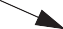{width="0.3251968503937008in" height="0.15in"}{width="0.14291338582677166in" height="9.724409448818898e-2in"}

    RayL2
    RayL1 RayL3
    CumRayL=RayL1*RayIndex1
    +RayL2*RayIndex2
    +RayL3*RayIndex3

x

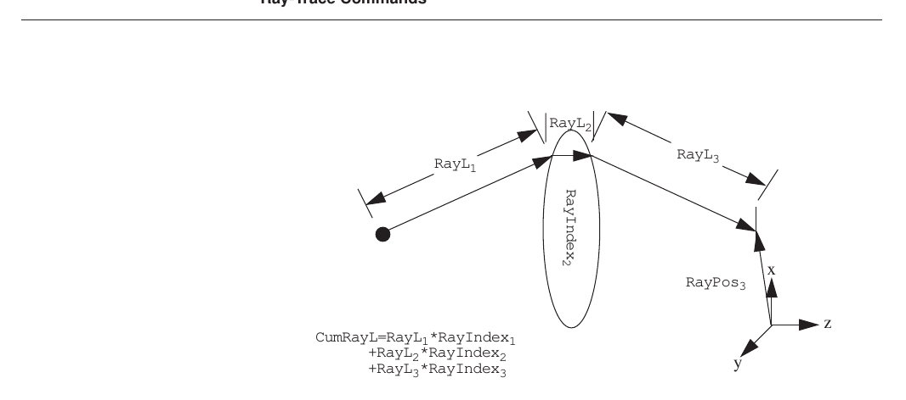

**FIGURE 30** Ray state definitions

The user is asked to specify the starting element, the stopping element, and the viewing plane. The following example draws the ImageDemo.in prescription (see Appendix) beam train from the source (element 0) to element 11:

    Enter first element to include: [0]: 0
    Enter last element to include: [13]: 11
    Enter drawing plane (XZ, YZ or XY in source coords): [XZ]: xz

The result is shown in Figure 31. The system is somewhat aberrated, so the beam does not come to a clean focus! A close-up of refractive elements 6-11 is specified by changing the starting element:

    Enter first element to include: [0]: 6
    Enter last element to include: [13]: 11
    Enter drawing plane (XZ, YZ or XY in source coords): [XZ]: xz

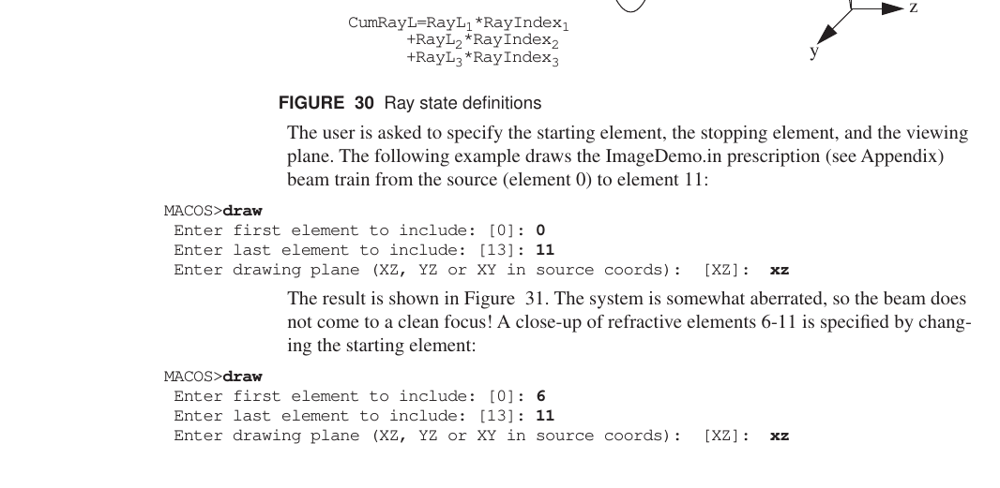

**FIGURE 31** DRAW views of ImageDemo.in

2.  **MAP**

Single rays are specified by their “ray ID” number, iRay. This number must be specified in tracing individual rays, printing individual ray partials, or in accessing ray state data directly using the SMACOS include files.

The relative location of each ray in the pupil can be displayed using the MAP command. When there are more than 15 rays across the aperture, only a subset of the ray numbers are shown. The chief ray is always ray number 1 (iRay=1) and is not displayed by MAP. For Cassegrain.in, the MAP command produces the following:

MACOS\>**map**

Map of rays at input aperture:

+-----------------+----------------------------+---+---+----------------+
| 0 84            | 85 86 87 88 89 90 91 92 93 | 9 | 9 | 0              |
|                 | 94                         | 5 | 6 |                |
+=================+============================+===+===+================+
| 69 70           | 71 72 73 74 75 76 77 78 79 | 8 | 8 | 83             |
|                 | 80                         | 1 | 2 |                |
+-----------------+----------------------------+---+---+----------------+
| 0 56            | 57 58 59 60 61 62 63 64 65 | 6 | 6 | 0              |
|                 | 66                         | 7 | 8 |                |
+-----------------+----------------------------+---+---+----------------+
| 0 43            | 44 45 46 47 48 49 50 51 52 | 5 | 5 | 0              |
|                 | 53                         | 4 | 5 |                |
+-----------------+----------------------------+---+---+----------------+
| 0 30            | 31 32 33 34 35 36 37 38 39 | 4 | 4 | 0              |
|                 | 40                         | 1 | 2 |                |
+-----------------+----------------------------+---+---+----------------+
| 0 0             | 19 20 21 22 23 24 25 26 27 | 2 | 0 | 0              |
|                 | 28                         | 9 |   |                |
+-----------------+----------------------------+---+---+----------------+
| 0 0             | 0 10 11 12 13 14 15 16 17  | 0 | 0 | 0              |
|                 | 18                         |   |   |                |
+-----------------+----------------------------+---+---+----------------+
| 0 0             | 0 0 3 4 5 6 7 8 9 0        | 0 | 0 | 0              |
+-----------------+----------------------------+---+---+----------------+
| 0 0             | 0 0 0 0 0 2 0 0 0 0        | 0 | 0 | 0              |
+-----------------+----------------------------+---+---+----------------+

MACOS\>

MACOS\>**map**

The lower left corner is the (x=0, y=0) point for the aperture coordinates defined by the ChfRayDir (=-zGrid) and xGrid vectors. The view is looking into the optical system from the source.

When using MAP with a segmented system, a map of the segments is also printed, showing which segment each ray hits. For SegmentDemo.in, the following map is produced.

Map of rays at input aperture:

    Hit Map

MACOS\>

3.  **Undefined Rays**

If a MAP command is used after a ray-trace or diffraction command such as OPD, SPOt or INTensity, some of the rays may disappear. This indicates that those rays became *undefined* because the rays:

-   missed an optical element

**Ray-Trace Commands**

-   hit an optical element out of order

-   hit two non-sequential surfaces simultaneously

as shown in Figure 32. Undefined rays are called out during the trace command. The surface where a ray became undefined can be pinpointed using the RAY command.

Misses element Must go backwards to hit next element.

Hits elements simultaneously.

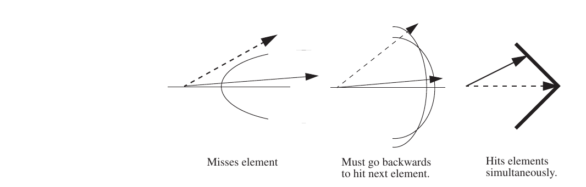

**FIGURE 32** Example with defined rays (solid) and undefined rays (dashed)

1.  **RAY**

The RAY command traces specific rays and prints the results. RAY has one argument, the number of the ray to be printed (iRay). The chief ray for Cassegrain.in is printed as:

MACOS\>**ray**

    Enter number of ray (1=chief ray, 0=quit):1 Ray 1 is the chief ray.
    Ray 1 segment from Element 0 (InputRay) to Element 1 (SecMirOb): Starting point= 0.000000000D+00 0.000000000D+00 -6.000000000D+00
    End point= 0.000000000D+00 0.000000000D+00 -5.400000000D+00 Direction= 0.000000000D+00 0.000000000D+00 1.000000000D+00
    Segment Length= 6.000000000D-01 Total Length= 6.000000000D-01
    Index(i-1)= 1.000000000D+00 0.000000000D+00 Index(i)= 1.000000000D+00 0.000000000D+00
    Ray 1 is obscured by element 1
    Ray 1 segment from Element 1 (SecMirOb) to Element 2 (Primary ): Starting point= 0.000000000D+00 0.000000000D+00 -5.400000000D+00
    End point= 0.000000000D+00 0.000000000D+00 -8.881784197D-16 Direction= 0.000000000D+00 0.000000000D+00 1.000000000D+00
    Segment Length= 5.400000000D+00 Total Length= 6.000000000D+00
    Index(i-1)= 1.000000000D+00 0.000000000D+00 Index(i)= 1.000000000D+00 0.000000000D+00
    Ray 1 segment from Element 2 (Primary ) to Element 3 (Secondar): Starting point= 0.000000000D+00 0.000000000D+00 -8.881784197D-16
    End point= 0.000000000D+00 0.000000000D+00 -4.061145902D+00 Direction= 0.000000000D+00 0.000000000D+00 -1.000000000D+00
    Segment Length= 4.061145902D+00 Total Length= 1.006114590D+01
    Index(i-1)= 1.000000000D+00 0.000000000D+00 Index(i)= 1.000000000D+00 0.000000000D+00
    Ray 1 segment from Element 3 (Secondar) to Element 4 (Ref_surf):
    Starting point= 0.000000000D+00 0.000000000D+00 -4.061145902D+00 End point= 0.000000000D+00 0.000000000D+00 -4.060145902D+00 Direction= 0.000000000D+00 0.000000000D+00 1.000000000D+00
    Segment Length= 1.000000000D-03 Total Length= 1.006214590D+01
    Index(i-1)= 1.000000000D+00 0.000000000D+00 Index(i)= 1.000000000D+00 0.000000000D+00
    Ray 1 segment from Element 4 (Ref_surf) to Element 5 (foc_pln ): Starting point= 0.000000000D+00 0.000000000D+00 -4.060145902D+00
    End point= 0.000000000D+00 0.000000000D+00 1.500000000D+00 Direction= 0.000000000D+00 0.000000000D+00 1.000000000D+00
    Segment Length= 5.560145902D+00 Total Length= 1.562229180D+01
    Index(i-1)= 1.000000000D+00 0.000000000D+00 Index(i)= 1.000000000D+00 0.000000000D+00

This printout gives the start and end point of each segment of the ray in global coordinates. The direction is a unit vector in global coordinates. The segment length refers to the geometric distance between the ray start and end points; it is not scaled by index of refraction. The total length gives a running sum of the length of the ray that is scaled by the index of refraction. The index give the index of refraction for the previous and current element.

To print the lower marginal ray, we see from the MAP command that the iRay number is 2, and respond accordingly:

MACOS\>**ray**

    Enter number of ray (1=chief ray, 0=quit):2
    Ray 2 has aperture coordinates 8 and 1.
    WF coordinates are 129 and 122.
    Adjacent rays are 0, 0, 0, 6.
    Ray 2 segment from Element 0 (InputRay) to Element 1 (SecMirOb): Starting point= -4.440892099D-16 -2.000000000D+00 -6.000000000D+00
    End point= -4.440892099D-16 -2.000000000D+00 -5.400000000D+00 Direction= 0.000000000D+00 0.000000000D+00 1.000000000D+00
    Segment Length= 6.000000000D-01 Total Length= 6.000000000D-01
    Index(i-1)= 1.000000000D+00 0.000000000D+00 Index(i)= 1.000000000D+00 0.000000000D+00
    Ray 2 segment from Element 1 (SecMirOb) to Element 2 (Primary ): Starting point= -4.440892099D-16 -2.000000000D+00 -5.400000000D+00
    End point= -4.440892099D-16 -2.000000000D+00 -1.851851852D-01 Direction= 0.000000000D+00 0.000000000D+00 1.000000000D+00
    Segment Length= 5.214814815D+00 Total Length= 5.814814815D+00
    Index(i-1)= 1.000000000D+00 0.000000000D+00 Index(i)= 1.000000000D+00 0.000000000D+00
    Ray 2 segment from Element 2 (Primary ) to Element 3 (Secondar): Starting point= -4.440892099D-16 -2.000000000D+00 -1.851851852D-01
    End point= -1.110223024D-16 -4.999999999D-01 -4.096296297D+00 Direction= 7.951199381D-17 3.580901857D-01 -9.336870027D-01
    Segment Length= 4.188888889D+00 Total Length= 1.000370370D+01
    Index(i-1)= 1.000000000D+00 0.000000000D+00 Index(i)= 1.000000000D+00 0.000000000D+00
    Ray 2 segment from Element 3 (Secondar) to Element 4 (Ref_surf): Starting point= -1.110223024D-16 -4.999999999D-01 -4.096296297D+00
    End point= -1.098674950D-16 -4.947992095D-01 -4.038085968D+00 Direction= 1.975982230D-17 8.899032834D-02 9.960324902D-01
    Segment Length= 5.844219807D-02 Total Length= 1.006214590D+01
    Index(i-1)= 1.000000000D+00 0.000000000D+00 Index(i)= 1.000000000D+00 0.000000000D+00
    Ray 2 segment from Element 4 (Ref_surf) to Element 5 (foc_pln ):

**Ray-Trace Commands**

    Starting point= -1.098674950D-16 -4.947992095D-01 -4.038085968D+00 End point= -1.877761358D-26 -8.456685352D-11 1.500000000D+00 Direction= 1.975982230D-17 8.899032834D-02 9.960324902D-01
    Segment Length= 5.560145902D+00 Total Length= 1.562229180D+01
    Index(i-1)= 1.000000000D+00 0.000000000D+00 Index(i)= 1.000000000D+00 0.000000000D+00

This printout is similar to the chief ray printout. However, the first three lines are new. They specify the ray grid coordinates, the coordinates of the diffraction amplitude matrix grid point with which the ray is associated, and the iRay numbers of the adjacent rays. The adjacent rays are listed in (-x, +x, -y, +y) order.

2.  **OPD**

The commands that perform full-beam ray-trace analyses are SPOt and OPD. The OPD (for Optical Path Difference) command traces the full bundle of rays to a specified element. At that element it computes an OPD for each ray and plots the beam OPD map. It also computes and prints the RMS OPD for the full beam.

The optical path difference of a ray is the difference between the optical pathlength of that ray and the chief ray. A positive OPD indicates that the ray travelled farther than the chief ray.

The OPD map as plotted is always a square grid corresponding to the aperture ray grid printed out in the MAP command. To see the true locations of the rays the SPOt command must be used. Rays which are obscured or vignetted by obscurations or apertures on the current or previous elements are not plotted by default. The OBScuration command changes which rays are plotted and is discussed in Section 5.2.7.

OPD plots will be representative of the system wavefront error *if evaluated at an exit pupil or other appropriate reference surface*. Such a surface will generally be located in the near-field region of the beam, at a point where the ray grid is regular.

NOTE: OPD plots made in a caustic or other region where the beam sampling geometry is disrupted will not auccurately capture system wavefront error. Better results may usually be obtained by using a near- or far-field diffraction propagation to the point of interest, and then plotting the phase of the complex amplitude (see Section 6).

The OPD command has a single argument iElt which is the number of the element where the OPD map or spot diagram is to be computed. The element numbering is as specified when creating the .in-file.

OPD plots are not affected by STRETCH setting. OPD plots are always on a linear scale.

The default plot type is GRAy scale. The plot type can be changed with the following commands: WIRe, SLIce, GRAy, COLumn, ROW, CONtour, TEXt, MATlab,FITs, or BINary. These plotting commands are discussed in more detail in Section 7.3.

The following examples show output of the OPD command with the GRAY, WIRe, and

    BINary plot types for Cassegrain.in.

MACOS\>**opd**

    Enter element where OPD is to be evaluated [0]:3 Tracing 150 rays...
    Compute time was 0.1445 sec RMS OPD error is 1.609556E-02
    Graphics device/type (? to see list, default /NULL): /xw

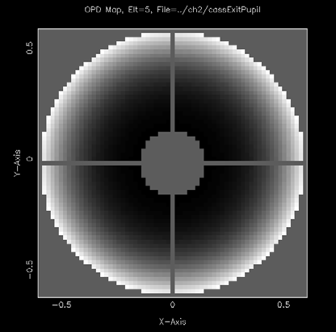{width="2.777083333333333in" height="2.7402777777777776in"}

**FIGURE 33** OPD GRAy scale plot

MACOS\>**wire**

Plot type set to WIRE

MACOS\>**opd**

    Enter element where OPD is to be evaluated [3]:3 RMS OPD error is 1.609556E-02

Type \<RETURN\> for next page:

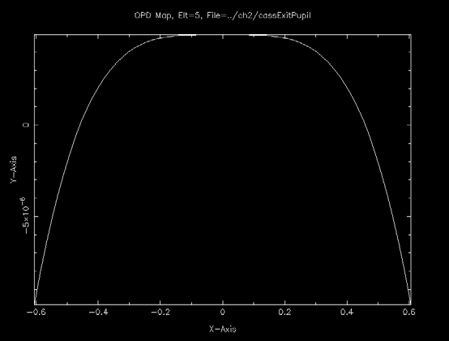{width="3.6930555555555555in" height="2.8in"}

**FIGURE 34** OPD ROW plot

MACOS\>**bin**

Plot type set to BINARY

MACOS\>**opd**

    Enter element where OPD is to be evaluated [3]:3 RMS OPD error is 1.609556E-02
    Writing OPD Map, Elt=3
    DIRECT ACCESS File=Cassegrain.OPD3

**Ray-Trace Commands**

    Binary array is of dimension 128 128 0. Magnitude of central pixel is 0.0000000000D+00

3.  **SPOT**

Like the OPD command, the SPOt command traces the full bundle of rays to a specified element. At that element it computes and plots a spot diagram.

A spot diagram is an x-y plot across the beam. It puts a dot at the point of incidence of each ray as projected onto a plane across the specified element (see Figure 35).

Rays which are obscured or vignetted by obscurations or apertures on the current or previous elements are not plotted by default. The OBScuration command changes which rays are plotted and is discussed in Section 5.2.7.

The SPOt command has the argument iElt: the number of the element where the spot diagram is to be computed. In addition, the user is asked to select which output coordinates to use to define the x and y axes. The choices are Tout, Enter or Beam (see Section 4). SPOt plots an x-y scatter format unless plot types TEXt, BINary, or MATlab are selected, in which case a “.spot” file is written to disk. Figures 4 and 36 show spot diagrams for Cassegrain.in.

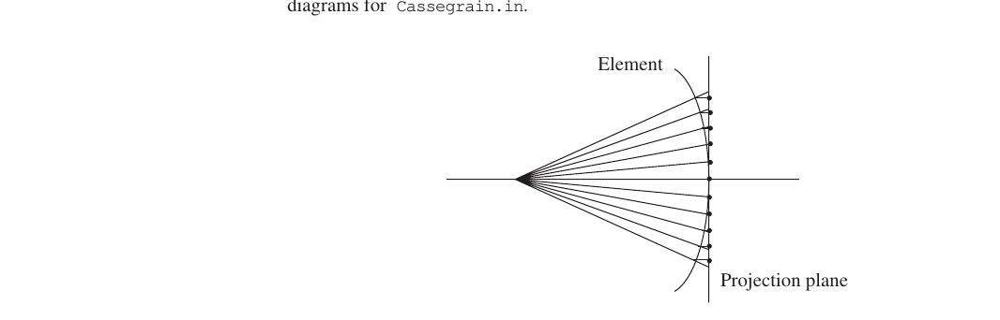

**FIGURE 35** Spot on the projection plane

MACOS\>**spot**

    Enter element where spot diagram is to be computed [0]:4 Enter output coordinate option (Tout, Enter or Beam): [Tout]: Tracing 150 rays...
    Compute time was 0.3086 sec
    Graphics device/type (? to see list): /xw
    Chief ray location: x= 0.0000000D+00 y= 0.0000000D+00 Centroid of spot diagram: x=-5.2080625E-18 y= 0.0000000E+00 MACOS>

4.  **OBSCURATION**

By default, the SPOt and OPD commands do not plot rays which are obscured or vignetted by obscurations or apertures on the current or previous elements. The OBScuration command is used to change this default.

    OBS has three settings. OBS=ALL plots every ray -- even rays that are obscured. OBS=POSITIVE, the default, plots only rays that are not obscured on the current or on any previous element. OBS=NEGATIVE plots only those rays that are obscured some-

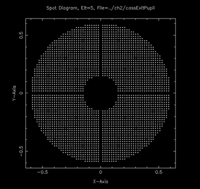{width="2.223611111111111in" height="2.1069444444444443in"}

**FIGURE 36** Exit pupil and detector SPOt diagram for Cassegrain.in.

where upstream of the specified element. Of course, rays that become undefined upstream are not plotted under any of these options.

Figure 37 shows spot diagrams of the Cassegrain telescope, for comparison with Figure

36\. The spot diagram on the left is plotted with OBS=ALL, showing all rays. The spot diagram on the right is plotted with OBS=NEGATIVE, showing only obscured rays.

MACOS\>**spot**

    Enter element where spot diagram is to be computed [4]:5 Enter output coordinate option (Tout, Enter or Beam): [Tout]: Tracing 150 rays...
    Compute time was 0.1211 sec
    Chief ray location: x= 0.0000000D+00 y= 0.0000000D+00 Centroid of spot diagram: x=-1.1055660E-16 y=-1.1055660E-16 Type <RETURN> for next page:

MACOS\>**obs**

    Enter ray-trace obscuration option (ALL, POSITIVE, NEGATIVE) [POSITIVE]: ALL

All rays plotted on spot diagrams

MACOS\>**spot**

    Enter element where spot diagram is to be computed [5]:5 Enter output coordinate option (Tout, Enter or Beam): [Tout]:
    Chief ray location: x= 0.0000000D+00 y= 0.0000000D+00 Centroid of spot diagram: x= 7.1761210E-17 y= 7.1761210E-17 Type <RETURN> for next page:

MACOS\>

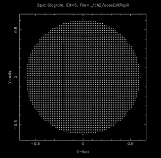{width="2.0902777777777777in" height="2.0541666666666667in"}

    OBS=ALL OBS=NEGATIVE

**FIGURE 37** Exit pupil Spot diagrams with alternate OBS settings

**Beam Set-Up Commands**

#### SEGRAYTRACE

Trace a single ray that passes through the geometric center of a chosen segment element, printing the ray state at every downstream surface. Useful for verifying that segmented-mirror prescriptions place segments where you expect, by comparing the ray interception point to the segment’s rotation point (its RptElt). The ray starting point is derived from the source segment coordinates.

    MACOS> SEGRAYTRACE
    Enter segment number (0=quit): [0]: 5
    Ray 1 segment from Element 0 (InputRay) to Element 5 (Seg5):
    Starting point= ...
    End point = ... (should be RptElt(:,5))
    Direction = ...
    ...
    Enter segment number (0=quit): [0]: 0
    MACOS>

The source ray's position is automatically offset from ChfRayPos so the resulting ray (parallel to ChfRayDir for a collimated source, or aimed from ChfRayPos for a point source) lands exactly at the segment's center. The segment-dispatch path is forced to fire only on the chosen segment via RayToSegMap; other segments are skipped.

If SegMirMaker utility was used to generate the segment prescription, the trace endpoint at the segment's element should match RptElt to within SFFZPSolve's tolerance (\~1e-11 mm). Larger mismatches diagnose generator bugs:

-   \~180-deg rotational mismatch (e.g. Seg2's endpoint matches Seg5's RptElt): the segment-numbering psi-flip in the generator didn't fire when it should have.

-   \~mm radial mismatch in the surface-normal direction: the generator computed RptElt on the conic only, missing the FF Zernike sag.

The command requires an Rx loaded with at least one Segment element; otherwise it prints 'Element N is not a Segment' and re-prompts.

#### Per-ray status reporting

Every ray in a trace records its terminal status:

OK (0) -- successfully terminated at last requested element

Obscured (1) -- blocked by an obscuration or aperture

Miss (2) -- missed a surface (no intersection found)

Bracket (3) -- root-finding bracket failure on a composite (FreeForm / aspheric / grid) surface

MaxIter (4) -- root-finder hit its iteration limit

Undef (5) -- initial state, never updated

The end-of-trace WARN summary breaks down failures by category and records the offending element index for the first failure of each ray. Bracket / iter messages are throttled after the first 20 to keep the terminal usable when many rays fail.

### Beam Set-Up Commands

The next several commands are designed primarily to help the user correctly set up particular computations, such as computation of beam wavefront error, or diffraction computations. These commands help the user implement perturbations of the optical train to evaluate performance impacts of misalignments, different field angles, or “zoom” settings. The STOP command specifies the system stop, either at an element or at a point in global coordinates, to help in defining the beam. It is required by other commands, such as PERTURB, FFP, PFP and FEX, that might move the source. The CENTER command finds source positions that cause the beam to be centered at a specified element. The FFP and PFP commands find source field angles that place the beam at a particular point on a particular surface, such as on a detector. The FEX command finds the system exit pupil and places a return surface at that point. These commands, together with the ORS and SRS commands discussed in the next section, provide a full capability for correctly setting up most ray-trace and diffraction analyses.

1.  **STOP**

The lateral position of a beam propagating through a system is constrained by the presence of a system stop. The system stop is an aperture somewhere in the system through which the beam passes. It defines the beam position and (usually its shape), as per Figure 38. Certain commands (PERturb, FFP, PFP and FEX) require knowledge of the stop position to enforce the correct beam geometry.

The system stop is specified using the STOp command. STOp does not center the beam in the stop (CENTEr can be used to do this). It merely defines the system stop position. This information is used to constrain the beam when setting exit pupils or perturbing the source.

*System stop aperture defines beam position for changing field angles*

*Changing field angle moves image position*

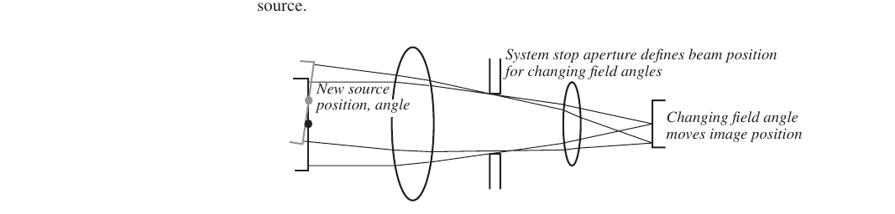

**FIGURE 38** System stop

STOp has 2 or 3 arguments, depending on whether the stop is to be specified at an element or at a point in object space. The first argument is a character string specifying whether the stop is to be tied to a particular element (ELT) or to a particular point in object space (OBJ).

If the former, the next parameter requested is the element number. This is followed by a request for an offset vector: a 2-vector in local beam coordinates giving the center of the stop with respect to the vertex of the element (VptElt).

If the stop is to be specified in object space, the next request is for the 3-vector coordinates of the stop position.

MACOS\>**stop**

The following examples illustrate the setting of stops for the Cassegrain.in example prescription. The first example sets the stop at the nominal location in 3-space of the primary mirror vertex:

    Stop at ELT or OBJect point? [OBJ]: object
    Enter stop position in object space (x,y,z): [0.,0.,0.]:0,0,0 MACOS>

MACOS\>**stop**

The second example puts the stop at the secondary mirror. The STOp command computes the equivalent object-space stop position:

    Stop at ELT or OBJect point? [OBJ]: elt Enter system stop element number: [1]:3 Enter offset vector (dx,dy): [0.,0.]:0,0
    Computed StopPos= 0.000000000D+00 0.000000000D+00 1.637981902D+01 MACOS>

2.  **CENTER**

The CENTEr command solves for a new source position that places the beam at a specified point on a specified element. This command is useful for enforcing the system stop; it has other applications as well. This command has two arguments: the element number of the element where the beam is to be placed; and the offset of the center of the beam from the vertex of the element. The CENTEr comand changes the source chief ray position ChfRayPos but not the field angle.

The following example uses the Cassegrain.in example to center a perturbed beam, with the result shown by tracing the chief ray to the specified element:

MACOS\>**center**

    Enter system stop element number: [1]:2 Enter offset vector (dx,dy): [0.,0.]:0,0
    Beam centered in 2 iterations, error= 3.231486333D-15 MACOS>ray
    Enter number of ray (1=chief ray, 0=quit): [0]: 1
    Ray 1 is the chief ray.
    Ray 1 segment from Element 0 (InputRay) to Element 1 (SecMirOb): Starting point= 6.055112155D-17 5.000007357D-03 -5.000005690D+00
    End point= 6.055112155D-17 4.200001400D-03 -4.200000000D+00 Direction= 0.000000000D+00 -9.999998333D-04 9.999995000D-01
    Segment Length= 8.000060899D-01 Total Length= 8.000060899D-01
    Index(i-1)= 1.000000000D+00 0.000000000D+00 Index(i)= 1.000000000D+00 0.000000000D+00
    Ray 1 is obscured by element 1
    Ray 1 segment from Element 1 (SecMirOb) to Element 2 (Primary ): Starting point= 6.055112155D-17 4.200001400D-03 -4.200000000D+00
    End point= 6.055112155D-17 -3.230922474D-15 0.000000000D+00 Zeroed!
    Direction= 0.000000000D+00 -9.999998333D-04 9.999995000D-01
    Segment Length= 4.200002100D+00 Total Length= 5.000008190D+00
    Index(i-1)= 1.000000000D+00 0.000000000D+00 Index(i)= 1.000000000D+00 0.000000000D+00
    (etc...)

3.  **COORD**

The COOrdinates command computes beam coordinates at any specified element. Beam coordinates are the projection onto that element of the xGrid and yGrid axes defined at the source element (see previous section). The COORDinates command takes

[a single argument: the element number iElt. It prints out two orthogonal unit vectors in]{.underline}

**Beam Set-Up Commands**

MACOS\>**coord**

response. These vectors are the projection onto the surface at the chief ray of the xGrid

and yGrid axes.

These coordinates are computed using four differential chief rays. The first two differ slightly in x- and y-*angle* from the nominal chief ray. In the near-field of the source, such as at a pupil element, the incidence points of these rays on the element differ enough to indicate the projected axes directions. The second two differential chief rays differ in x- and y-*position* from the nominal chief ray. They are used to indicate axes direction in the far-field of the beam, such as at a focal plane.

Note: The beam coordinates may undergo a sign change in the vicinity of a focus. The unit vectors will be correct and consistent, however, their signs may abruptly flip. Use common sense in interpreting the results of the COORD command!

The following example uses the Cassegrain.in example, determining the coordinates projection onto the secondary obscurations (iElt=1), the exit pupil (iElt=5), and the detector (iElt=6):

    Enter element number: [1]:1
    Computed xLocal= -1.000000000D+00 0.000000000D+00 0.000000000D+00 Computed yLocal= 0.000000000D+00 -1.000000000D+00 0.000000000D+00 Computed zLocal= 0.000000000D+00 0.000000000D+00 1.000000000D+00

MACOS\>coord 5

    Enter element number: [1]: 5
    Computed xLocal= -9.999999998D-01 0.000000000D+00 2.229180881D-05 Computed yLocal= 0.000000000D+00 -9.999999998D-01 2.229180881D-05 Computed zLocal= 2.229180880D-05 2.229180880D-05 9.999999995D-01

MACOS\>coord 6

    Enter element number: [1]: 6
    Computed xLocal= -1.000000000D+00 0.000000000D+00 0.000000000D+00 Computed yLocal= 0.000000000D+00 -1.000000000D+00 0.000000000D+00 Computed zLocal= 0.000000000D+00 0.000000000D+00 1.000000000D+00

MACOS\>pert 6

4.  **FFP**

The find field point (FFP) command finds the field angles for which the chief ray intersects a specified element at a specified point. It resets both the source position and angle (ChfRayAng and ChfRayPos) to both satisfy the system stop condition and to place the beam at the given point.

The FFP command has two arguments: the element number of the surface at which the chief ray intercept is specified; and the offset of the chief ray from the vertex of the target element in global coordinates. The STOP command must be used prior to invoking FFP.

The following example uses the Cassegrain.in example, finding the beam that offsets an image by (1e-3, -2e-3):

MACOS\>**stop**

    Stop at ELT or OBJect point? [Elt]: obj 0,0,0
    Enter stop position in object space (x,y,z): [0.,0.,0.]: 0,0,0 MACOS>ffp 6
    Enter element number: [6]:
    Enter offset vector in global units (dx,dy): [0.,0.]:1e-3,-2e-3 Field angle finder results:
    Did 1 iterations, error= 6.936774704D-11
    Old dx= 0.000000000D+00 New dx= 1.000000031D-03 0.000000000D+00 -2.000000062D-03
    Old crd= 0.000000000D+00 New crd= 4.458354140D-05 0.000000000D+00 -8.916708280D-05
    1.000000000D+00 9.999999950D-01 Old crp= 0.000000000D+00 New crp= -2.229177070D-04 0.000000000D+00 4.458354140D-04
    -5.000000000D+00 -4.999999975D+00
    Accept the new chief ray? [YES]: yes

MACOS\>**ray 1 *Trace ray to show new incidence point...***

    Enter number of ray (1=chief ray, 0=quit): [0]: 1 Ray 1 is the chief ray.
    Ray 1 segment from Element 0 (InputRay) to Element 1 (SecMirOb): Starting point= -2.229177070D-04 4.458354140D-04 -4.999999975D+00
    End point= -1.872508748D-04 3.745017496D-04 -4.200000000D+00 Direction= 4.458354140D-05 -8.916708280D-05 9.999999950D-01
    Segment Length= 7.999999791D-01 Total Length= 7.999999791D-01
    Index(i-1)= 1.000000000D+00 0.000000000D+00 Index(i)= 1.000000000D+00 0.000000000D+00
    (etc...)
    Ray 1 segment from Element 5 (ExitPupi) to Element 6 (Detector): Starting point= 1.812075347D-04 -3.624150694D-04 -4.060145887D+00
    End point= 1.000000031D-03 -2.000000062D-03 1.500010000D+00 Direction= 1.472607007D-04 -2.945214014D-04 9.999999458D-01
    Segment Length= 5.560156189D+00 Total Length= 1.462230217D+01
    Index(i-1)= 1.000000000D+00 0.000000000D+00 Index(i)= 1.000000000D+00 0.000000000D+00

MACOS\>

5.  **PFP**

The pixel field point (PFP) command is the same as the FFP command, in that it finds the field angles for which the chief ray intersects a specified element at a specified point. It differs in that the incidence point is specified in pixel coordinates. PFP resets both the source position and angle (ChfRayAng and ChfRayPos) to both satisfy the system stop condition and to place the beam at the target point.

The PFP command has two arguments: the element number of the surface at which the chief ray intercept is specified; and the offset of the chief ray from the vertex of the target element in global coordinates. The STOP command must be used prior to invoking PFP.

The following example uses the Cassegrain.in example, finding the beam that puts an image at pixel location (20, -100):

MACOS\>**PFP 6**

    Enter element number: [6]:6
    Enter pixel size for placing image on pixel array: [0.]:15e-4 Enter image position in pixel units (dx,dy): [0.,0.]:20,-100 Field angle finder results:
    Did 2 iterations, error= 1.581159622D-12
    Old dx= 1.000000031D-03 New dx= 3.000000000D-02
    -2.000000062D-03 -1.500000000D-01 Old crd= 4.458354140D-05 New crd= 1.337301749D-03
    -8.916708280D-05 -6.686508743D-03
    9.999999950D-01 9.999767508D-01 Old crp= -2.229177070D-04 New crp= -6.686508743D-03 4.458354140D-04 3.343254372D-02
    -4.999999975D+00 -4.999883754D+00
    Accept the new chief ray? [YES]:

**Beam Set-Up Commands**

MACOS\>**ray 1 *Trace ray to show new incidence point...***

    Enter number of ray (1=chief ray, 0=quit): [0]: 1 Ray 1 is the chief ray.
    Ray 1 segment from Element 0 (InputRay) to Element 1 (SecMirOb): Starting point= -6.686508743D-03 3.343254372D-02 -4.999883754D+00
    End point= -5.616797930D-03 2.808398965D-02 -4.200000000D+00 Direction= 1.337301749D-03 -6.686508743D-03 9.999767508D-01
    Segment Length= 7.999023513D-01 Total Length= 7.999023513D-01
    Index(i-1)= 1.000000000D+00 0.000000000D+00 Index(i)= 1.000000000D+00 0.000000000D+00
    (etc...)
    Ray 1 segment from Element 5 (ExitPupi) to Element 6 (Detector): Starting point= 5.436452666D-03 -2.718226333D-02 -4.060076800D+00
    End point= 3.000000000D-02 -1.500000000D-01 1.500010000D+00 Direction= 4.416714741D-03 -2.208357371D-02 9.997463720D-01
    Segment Length= 5.561497351D+00 Total Length= 1.462402454D+01
    Index(i-1)= 1.000000000D+00 0.000000000D+00 Index(i)= 1.000000000D+00 0.000000000D+00

MACOS\>

6.  **FEX**

The Find EXit pupil (FEX) command computes the location of the system exit pupil and places an optimized spherical reference surface at that point. By “optimized,” we mean that the spherical reference surface is correctly set up to perform a far-field diffraction propagation to the next element, which is usually a detector.

To use FEX, the prescription must be set up with two return surfaces followed by a detector focal plane or reference surface. The first return surface is placed at the location of the focal plane detector, and the second is placed in the vicinity of the exit pupil. FEX locates the second precisely at the exit pupil location and computes its orientation and curvature based on the position of the detector element.

FEX works for systems where the exit pupil is located in front of the detector. It is not useful for telecentric systems (where the exit pupil is at infinity) or for cases where the exit pupil is located behind the detector.

FEX traces two rays: the nominal chief ray and a differential chief ray. The field angle of differential chief ray differs by 1 arcsecond from the nominal chief ray angle. Both rays are traced to the detector return surface and then backwards to find their intersection. The intersection of the nominal and differential chief rays defines the center of the exit pupil. The parameters of the exit pupil (the second return surface) are set as follows:

-   vertex, VptElt, to the center of the exit pupil

-   radius of curvature, KrElt, to the distance between the exit pupil and detector

-   principal axis, PsiElt, to the chief ray direction, ChfRayDir

The result is a reference sphere aligned with the spherical wavefront converging to the point where the chief ray hits the detector. This configuration correctly models diffraction images at that point field point. If the optical system is perturbed, the FEX command must be rerun.

FEX requires two arguments: the number iElt of the exit pupil return surface and the location in global coordinates of the vertex of the aperture stop.

For example, we added two return surfaces to the Cassegrain.in prescription just before the detector using a text editor (see Section 4.9). The first is a return surface at the detector location. The second is close to the exit pupil. The entire .in-file is in Appendix A.1.4.

MACOS\>**show 5**

    Enter number of element (0=aperture): [0]: 5

+----------+--------------------+-------------------------------------+
| iElt=    | 5                  |                                     |
| EltName= |                    |                                     |
| Element= | rtn1 Return        |                                     |
|          |                    |                                     |
| Surface= | Conic              |                                     |
+==========+====================+=====================================+
| fElt=    | 1.000000000D+22    |                                     |
+----------+--------------------+-------------------------------------+
| eElt=    | 0.000000000D+00    |                                     |
+----------+--------------------+-------------------------------------+
| KrElt=   | -1.000000000D+22   |                                     |
+----------+--------------------+-------------------------------------+
| KcElt=   | 0.000000000D+00    |                                     |
+----------+--------------------+-------------------------------------+
| psiElt=  | 0.000000000D+00    | 0.000000000D+00 1.000000000D+00     |
+----------+--------------------+-------------------------------------+
| VptElt=  | 0.000000000D+00    | 0.000000000D+00 1.500000000D+00     |
+----------+--------------------+-------------------------------------+
| RptElt=  | 0.000000000D+00    | 0.000000000D+00 1.500000000D+00     |
+----------+--------------------+-------------------------------------+
| IndRef=  | 1.000000000D+00    |                                     |
+----------+--------------------+-------------------------------------+
| Extinc=  | 0.000000000D+00    |                                     |
+----------+--------------------+-------------------------------------+
| nObs=    | 0                  |                                     |
+----------+--------------------+-------------------------------------+
| ApType=  | None               |                                     |
+----------+--------------------+-------------------------------------+
| zElt=    | 0.000000000D+00    |                                     |
+----------+--------------------+-------------------------------------+
| P        | Geometric          |                                     |
| ropType= |                    |                                     |
+----------+--------------------+-------------------------------------+
| nECoord= | -6                 |                                     |
+----------+--------------------+-------------------------------------+

    nECoord= -6

MACOS\>**show 6**

    Enter number of element (0=aperture): [0]: 6

+----------+--------------------+-------------------------------------+
| iElt=    | 6                  |                                     |
| EltName= |                    |                                     |
| Element= | rtn2 Return        |                                     |
|          |                    |                                     |
| Surface= | Conic              |                                     |
+==========+====================+=====================================+
| fElt=    | 6.000000000D+00    |                                     |
+----------+--------------------+-------------------------------------+
| eElt=    | 0.000000000D+00    |                                     |
+----------+--------------------+-------------------------------------+
| KrElt=   | -6.000000000D+00   |                                     |
+----------+--------------------+-------------------------------------+
| KcElt=   | 0.000000000D+00    |                                     |
+----------+--------------------+-------------------------------------+
| psiElt=  | 0.000000000D+00    | 0.000000000D+00 1.000000000D+00     |
+----------+--------------------+-------------------------------------+
| VptElt=  | 0.000000000D+00    | 0.000000000D+00 -4.500000000D+00    |
+----------+--------------------+-------------------------------------+
| RptElt=  | 0.000000000D+00    | 0.000000000D+00 -4.500000000D+00    |
+----------+--------------------+-------------------------------------+
| IndRef=  | 1.000000000D+00    |                                     |
+----------+--------------------+-------------------------------------+
| Extinc=  | 0.000000000D+00    |                                     |
+----------+--------------------+-------------------------------------+
| nObs=    | 0                  |                                     |
+----------+--------------------+-------------------------------------+
| ApType=  | None               |                                     |
+----------+--------------------+-------------------------------------+
| zElt=    | 6.000000000D+00    |                                     |
+----------+--------------------+-------------------------------------+
| P        | Geometric          |                                     |
| ropType= |                    |                                     |
+----------+--------------------+-------------------------------------+
| nECoord= | -6                 |                                     |
+----------+--------------------+-------------------------------------+

Then the exit pupil is optimized:

MACOS\>**fex**

    Enter number of exit pupil return surface: [5]:6 Tracing 173 rays...
    Chief ray location: x= 0.0000000D+00 y= 0.0000000D+00 z=-
    4.5000000D+00
    Centroid location: x= 7.9797280D-17 y= 8.6736174D-17 z=-
    4.4875916D+00
    Centroid offset from chief ray: x=-7.9797280D-17 y=-8.6736174D-17 z=-1.2408352D-02
    Exit pupil finder results:
    Old f= 6.000000000D+00 New f= 6.790667844D+00

**Beam Set-Up Commands**

    Old z= 6.000000000D+00 New z= 6.790667844D+00 Old psi= 0.000000000D+00 New psi= 9.936451891D-17 0.000000000D+00 1.080049119D-16
    1.000000000D+00 1.000000000D+00 Old Vpt= 0.000000000D+00 New Vpt= 0.000000000D+00 0.000000000D+00 0.000000000D+00
    -4.500000000D+00 -5.290667844D+00
    Accept the new element? [YES]:

MACOS\>

7.  **PERTURB**

The PERturb command allows the user to change the current optical prescription by rotating or translating the light source or any of the optical elements. PERturb accepts as arguments rotation and translation perturbation vectors, which it applies directly to the prescription data. Rotations of an element are taken about the prescription rotation point RptElt. Subsequent ray traces or propagations will use the new prescription.

PERturb differs from MODify in that it changes only the position and orientation of elements (MODIFY can be used to change any parameter in the prescription). PERturb is also different from MODify in that PERturb uses the rotation point and proper kinematics to apply rotational perturbations (PERturb rotations are relative to the old orientation) and MODify specifies a absolute location. PERturb is not limited to small motions.

To reset the prescription to its unperturbed condition, it is necessary to explicitly reverse the PERturb commands executed previously or to reload the prescription using the OLD command. Due to the noncommutativity of rotations, the latter method is to be preferred if more than one rotation has been applied.

The PERturb command takes arguments specifying the element to be perturbed and the perturbation vectors. The element is specified by number iElt which is in the range: 0 (the source) to nElt (the number of elements in the active prescription). Units for rotation perturbations are radians. The units of the translation perturbations are in the chosen base units (meters, inches, whatever).

Rotations are applied using Euler axis/angle parameters (Ref. Hughes). The axis of the rotation is given by the direction of the rotation perturbation vector. The angle is given by its magnitude. This approach is used in preference to Euler angles or quaternions as it provides a smooth transition to the usual small-angle linear approximations.

If iElt=0, indicating the source is to be perturbed, the user is prompted for the location of the aperture stop in global coordinates. For instance to look 0.5 deg (8.72664d-3 rad) off the x-axis, a rotation about the y-axis is commanded:

MACOS\>**perturb**

    Enter element to be perturbed: [0]:0
    Enter rotational perturbation vector (x,y,z): [0.,0.,0.]:0,8.72664d-3,0 Enter translational perturbation vector (x,y,z): [0.,0.,0.]:0,0,0 Computing new perturbed system parameters

MACOS\>

If iElt\>0, indicating a regular element, the user is asked whether the perturbation vectors are in local element coordinates or in global coordinates. If in local coordinates, the user is prompted for a single 6-vector perturbation in those coordinates. If in global

coordinates, the user is prompted for a rotational perturbation 3-vector, then a translational 3-vector. For instance, to translate the secondary mirror in Cassegrain.in:

MACOS\>**pert**

    Enter element to be perturbed:3
    Enter coordinate system for perturbation (ELEMENT or GLOBAL): [GLOBAL]: Enter rotational perturbation vector (x,y,z): [0.,0.,0.]:0,0,0
    Enter translational perturbation vector (x,y,z): [0.,0.,0.]:0,0,1d-6 Computing new perturbed system parameters

MACOS\>

8.  **PREAD**

The PREad command reads element perturbations from a specified datafile. MACOS assumes that the name of the perturbation file is infilename.pert. If this file does not exist, MACOS prompts for ther perturbation file name.

The perturbation file must be in the following all numeric format. The perturbations must be in global coordinates. The order of the perturbation vectors in the .pert-file must be identical to the order of the elements (the first perturbation vector corresponds to the first element, the sixth perturbation vector corresponds with the sixth element). Each element must have a perturbation vector. If an element is unperturbed, then a string of zeroes should be entered as its perturbation vector. The perturbation vectors are rotational perturbations and translational perturbations. The 6 components of the perturbation vector must be separated by spaces.

MACOS\>**pre**

    File Cassegrain.pert read. MACOS>

9.  **ATMOS**

MACOS provides an atmospheric phase disturbance function with the ATMos command. ATMos imposes a ray pathlength and direction perturbation on the beam at a specified element. The ray perturbations are derived from a Kolmogorov phase disturbance model, parameterized by the atmospheric turbulence coherence length r0, and driven by a random number generator. The seed for the random number generator can be set using the SEED command.

ATMos provides two options for specifying the atmospheric grid. The RAY option treats each ray as an independant but correlated random variable, determining the phase disturbance (and so the direction and OPD) for each ray directly from the Kolmogorov generating function. The ATM option implicitly defines a coarser grid of “atmospheric states” than the ray grid provides. Essentially, the phase disturbance is determined for cells whose size is specified by the user, but which will be in general larger than the ray grid cell size. Ray direction and OPD values are computed by interpolating from the surface defined by the atmospheric phase states to the ray grid cells.

ATMOS takes four or five arguments, depending on how the grid is to be specified (RAY or ATM). An example of the use of ATMOS in an adaptive optics system model is provided in Appendix A.4. A sample dialog showing use of ATMOS follows:

MACOS\>**atm**

    Enter number of atmosphere phase screen element: [0]:1 Enter atmosphere r0: [12.4492]: 24
    Enter atmosphere wavelength: [2.854331E-05]: 2.854331E-05 Enter atmosphere tilt participation (0-1): [1.00000]:0 Use RAY grid or separate ATMospheric grid? [RAY]: atm
    Computed xLocal= 0.000000000D+00 -1.000000000D+00 0.000000000D+00 Computed yLocal= -1.000000000D+00 0.000000000D+00 0.000000000D+00 Computed zLocal= 0.000000000D+00 0.000000000D+00 -1.000000000D+00

**Beam Set-Up Commands**

    Tracing 12113 rays... Compute time was 0.2266 sec
    Enter grid spacing: [1.56840]:20 MACOS>

Here the “tilt participation” regulates the percentage of the Kolmogorov that is to be included in the phase screen. Tilt is explicitly removed when this factor is set to zero, and increases proportionally as the factor goes to 1, which signifies full Kolmogorov tilt. An example, showing a typical atmospheric wavefront from AOexample.jou (Appendix A.4), is shown in Figure 39.

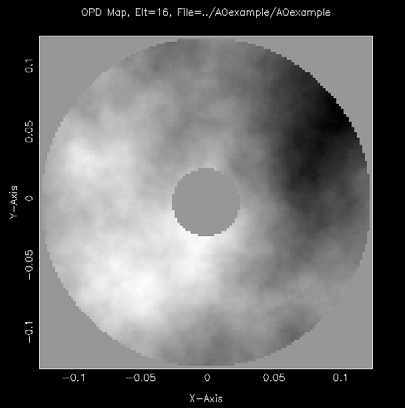{width="2.691666666666667in" height="2.720138888888889in"}

**FIGURE 39** Atmospheric disturbances (AOexample).

10. **POLARIZATION**

The POLarization command turns on polarization ray tracing. The default is no polarization ray tracing. The command prompts for the complex source field components Ex0 and Ey0, and (when the model supports it) also enables vector diffraction. See the *Polarized Ray Tracing* subsection below for the physics, conventions and analysis tools.

11. **NOPOLARIZATION**

The NOPOlarization command turns off polarization ray tracing. This is the default setting.

12. **SINT**

The Surface INTerpolate (SINT) command activates the surface interpolation of elements. Prior to using the SINT command, the surface is assumed to be a conic-of-revolution. MACOS assumes that the interpolation input file has the name in-file.srf#, where \# is the number of the element the data describes. If that file does not exist, MACOS prompts the user for the name of the file.

MACOS\>**SINT**

    Computing interpolated surface data... Compute time was 5.7871 sec

MACOS\>

### Polarized Ray Tracing

With polarization on (POLarization command, or the `polarization`
function in the mmacos/pymacos bindings), every ray carries a complex
3-vector electric field in addition to its geometry. The trace then
models three effects the scalar trace ignores:

- **Source polarization state.** Rays launch with field
  E = Ex0·xGrid + Ey0·yGrid, where (Ex0, Ey0) are the complex source
  amplitudes entered at the POLarization prompt (or carried in the
  prescription by the `Ex0Ey0=` keyword, Section 4). For a collimated
  source this launch frame is the source grid frame, uniform across the
  beam; for a point source each ray uses a local frame
  (y = unit(RayDir × xGrid), x = y × RayDir) that reduces to the grid
  frame on the chief ray.

- **Surface polarization effects.** At each reflector and refractor the
  field is decomposed into s and p components in the local plane of
  incidence, and the surface's complex Fresnel coefficients are
  applied — from the element's own complex index (`IndRef=`/`Extinc=`,
  Section 4) for a bare surface, or from the multilayer thin-film
  recursion when the element carries a `Coating=` stack (Section 4).
  The propagation phase of each leg, including any absorption in the
  medium, is accumulated in the field as well.

- **Vector diffraction.** With polarization on, the diffraction
  commands can propagate the three field components independently
  (VECtor/SCAlar, Section 6). Vector diffraction covers every
  propagation leg, so a multi-leg chain preserves the vector field;
  see Section 6 for the one remaining limitation, which concerns
  coated or reflecting surfaces placed *between* two propagation legs.

Conventions, fixed throughout the engine: the absorbing refractive
index is N = n − iκ with κ > 0 meaning loss, under the time-harmonic
convention exp(+iωt); coating layer indices follow the same rule. A
mirror described by the standard perfect-conductor idiom
(`IndRef= 1.0`, `Extinc= 1.0E+22`) reflects with RP = RS = −1 and is
therefore polarization-neutral: it changes ray geometry but introduces
no diattenuation or retardance. Real coated mirrors are modeled with a
metal coating stack (an optically thick metal layer reproduces the bare
metal's Fresnel coefficients regardless of substrate).

**Polarization analysis.** The per-ray field at any element can be
harvested through the bindings (`ray_field`), and the standard
polarization-aberration analysis is built on top of it: `jones_pupil`
assembles the 2×2 Jones matrix at every pupil point from two traces
with orthogonal source states, and `pol_maps` decomposes it into
diattenuation and retardance maps (with the pupil mean — a state
change — separated from the spatially varying part that drives error
budgets). `pol_zernike` then expands those maps onto a Zernike basis,
giving the standard polarization-aberration terms — piston, tilt,
defocus, astigmatism and up — so that a MACOS result can be compared
with the published literature term by term rather than by map shape.
For an on-axis rotationally symmetric two-mirror system the expansion
reduces, as the theory requires, to pure *polarization astigmatism*:
diattenuation and retardance grow as the square of the pupil radius
with an axis locked to the pupil azimuth, and every other term —
including the entire circular component — sits at round-off. These
functions and their conventions, including the choice of pupil
reference basis (double-pole by default), are documented in the MACOS
Command Reference, Part II. The interactive CLI exposes the underlying
trace and coating machinery; the Jones-pupil analysis layer is
binding-only.

**Polarization contrast floor.** For a coronagraph the question is not
the shape of the aberration but how much light it puts where the dark
zone should be. `pol_contrast_floor` answers it directly: it propagates
with vector diffraction on and splits the detector field into a
co-polarized, a cross-polarized and a longitudinal channel. The
cross-polarized channel is the part no scalar deformable-mirror control
can remove, so its peak-normalized level is the polarization-limited
contrast floor, and the function also reports how that floor moves with
the coating choice.

Two points of method matter. First, the split is taken at the detector
rather than in the pupil. Because the chain is linear in the input
polarization state and all three components propagate with the same
kernel, a spatially uniform analyzer commutes with propagation, so
projecting after the propagation gives the same answer as projecting
before it — and it avoids the Jones pupil, which cannot serve as a
pupil multiplier because it carries the accumulated optical path
length. Second, "co-polarized" is defined against the *mean output*
state, not the input state. A train may rotate the polarization
geometrically while introducing neither diattenuation nor retardance;
charging that rotation to the cross-polarized channel would report an
aberration where there is none, since an observer would simply align
the analyzer to the output. The analyzer used is therefore the dominant
eigenvector of the pupil coherency matrix, which is insensitive to the
common wavefront and by construction minimizes cross-polarized power.

An unpolarized source is modeled as two traces with orthogonal input
states summed in intensity, never as one trace with the second state
inferred from it. The floor reported on a chain that places coated or
reflecting surfaces between two propagation legs is a lower bound, for
the reason given in Section 6; the function measures the shortfall and
warns rather than leaving it to the reader.
