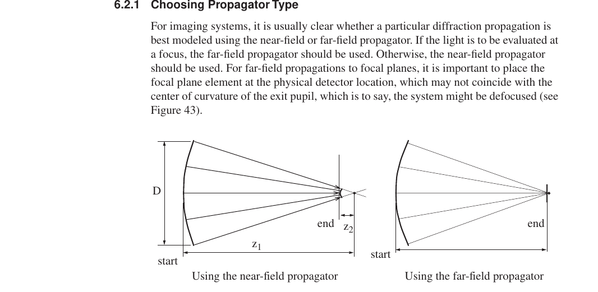
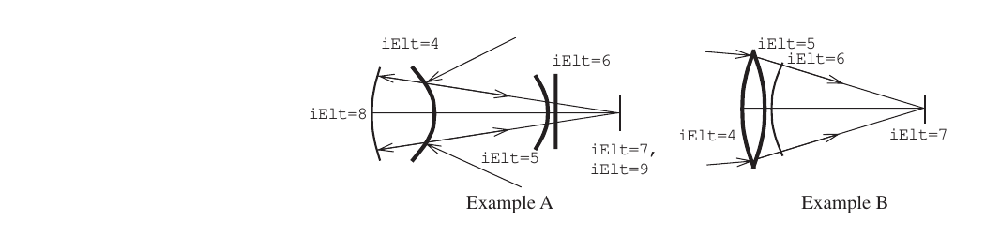
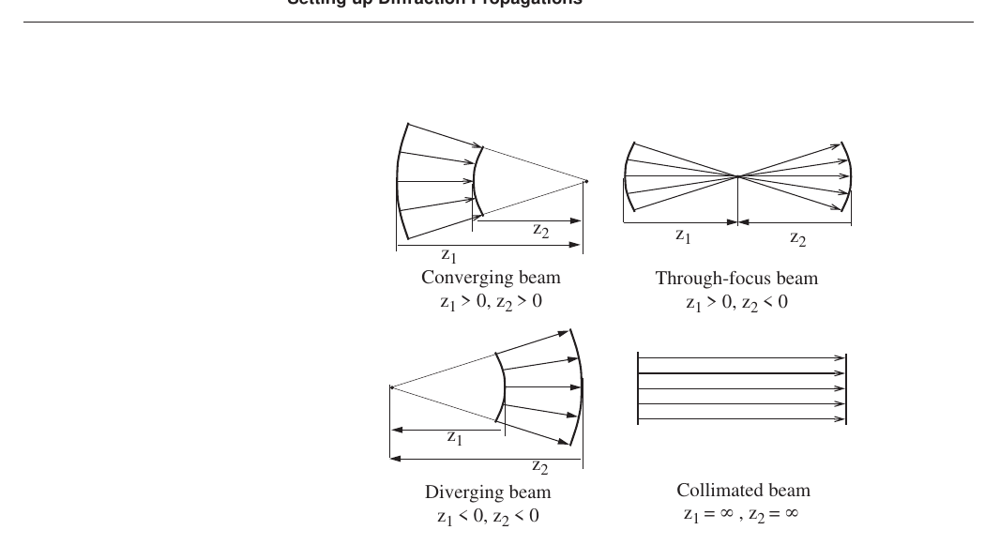
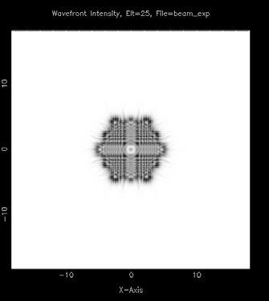

## SECTION 6: Diffraction Analysis

This section presents commands for physical optics modeling. Most optical systems are adequately modeled using a single-plane, exit-pupil diffraction model. Other systems are better modeled using multiple planes of diffraction. This section describes how to set up .in-files and other necessary data for both cases. The commands discussed in this section are:

    ORS SRS
    BEAm REGrid
    SCAlar VECtor

The diffraction modeling routines of MACOS can accurately compute both near-field

(Fresnel diffraction) and far-field (Fraunhoffer diffraction) effects. Roughly speaking, near-field propagation takes the beam from pupil to pupil, regions where the beam is large compared to a wavelength. Far-field propagations take the beam from a pupil to a focal point, or from a focal point to a pupil. In the vicinity of a focus, the beam diameter approaches a wavelength.

Examples of systems where near-field diffraction is important include laser beam transfer systems, or spatial filters, where the beam propagates from pupil to pupil via a far-field plane where an aperture or obscuration is placed. Examples of far-field diffraction include imaging systems and high-gain directional antennas. In some cases both types of diffraction are important, and multiple planes of diffraction should be used.

### Single- versus Multi-plane Diffraction

The first step in setting up a problem is to decide whether the important diffraction effects can be captured using a single-plane model, or whether multi-plane diffraction is necessary. Most imaging systems are adequately modeled using the single-plane approach, with one far-field diffraction being used to create the image. Section 6.2.2 discusses the set up of the .in-file for a single far-field propagation.

Systems for which diffraction effects of beam truncation due to apertures or obscurations in the beam train may be significant may be best modeled using multiple planes of diffraction. Examples are systems with spatial filters, such as coronograph instruments. Examples of systems requiring near-field propagation, whether multi-plane or no, include telecentric systems, defocused systems, or any system for which intermediate-plane intensities are desired.

If a multi-plane model is necessary, the first step is to lay out the optical system and determine the sequence of propagations. Consider the Cassegrain telescope with relay optics (including a fold near the focus of the main telescope) shown in Figure 40. Figure 41 shows reference surfaces added for multiplane diffraction calculations. The beam is partially obscured at the main and relay telescope secondary mirror supports (“spiders”). There are 4 diffraction propagations which are clearly shown in the diffraction schematic, Figure 42. Note that points A and D are used in the model twice. The first time each is used to model the spider obscurations. The second time, the points are used as a reference surfaces for diffraction calculations.

Spiders

Primary

Relay secondary Relay primary Focal plane

**FIGURE 40** Optical schematic of Cassegrain telescope and relay optics example

The first near-field propagation, PropType=5, occurs between the main telescope

3 zElt6

A 5 6 7 B

**FIGURE 41** Reference surfaces for multi-plane diffraction in Cassegrain telescope and relay optics example

    2 3 4 5 6 7 8 9 10 11 12 13 14

A A B C D D

**FIGURE 42** Diffraction schematic for Cassegrain telescope and relay optics example

primary and secondary mirror (between reference surfaces 3 and 4 which are located close to these optics). The reference surfaces share a common center of curvature at point A. Since this is a converging beam, the zElt parameters are positive for both reference surfaces (see Section 6.1.4).

The second near-field propagation occurs between the secondary mirror and the relay camera’s secondary mirror support “spiders.” It is a “through-focus” propagation, with zElt=6 positive (converging beam) and zElt=8 negative (diverging beam). The reference point for this propagation is point B. The fold mirror is included in the propagation.

The third propagation is at the converging beam between the relay primary and secondary. This near-field propagation is centered at point C.

**Setting up Diffraction Propagations**

The last propagation is a far-field propagation, PropType=3, to the focal plane. It is centered at the focal plane, point D.

### Setting up Diffraction Propagations

To use MACOS diffraction features, the .in-file prescription must be set up correctly. A surface which does not change the wavefront (reference, obscuring, return, or focal plane elements) must ideally be placed at the start and end of each diffraction propagation. Each pair of reference surfaces must be defined together—*slaved* to each other—so as to avoid spurious phase errors. Slaving reference surfaces to each other means ensuring that they share a common axis and a common center of curvature. The reference surfaces should be *optimized* to minimize sampling errors. The beam must be adequately *padded* to avoid aliasing. In certain conditions, the rays that are used to determine geometric phase should be *regridded*.

MACOS provides several commands to help ensure that the prescription data is set up correctly. The FEX command (discussed earlier in Section 5.3.6) optimizes placement of a return surface at an exit pupil for far-field diffraction propagation. The ORS command optimizes a reference surface for minimum sampling error by matching it to the best-fit sphere and aligning it to the chief ray. The SRS command slaves one reference surface to another, solving for location, orientation, and radius of the starting (or ending) surface of a near- or far-field diffraction propagation as a function of the parameters of the ending (or starting) surface. Used together, FEX, ORS and SRS enable the correct setup of any MACOS diffraction propagation.

The FEX, ORS and SRS commands are run after a .in-file prescription is loaded. They *refine* the prescription for elements defined in the .in-file. The results can be saved in a new .in-file using the SAVe command. If a PERturb, MODify, FFP, PFP, CENTER, or other command changes the source position or angle, or the position, angle or figure of an element in the propagation path, FEX, ORS and SRS should be rerun.

The results of propagation commands (such as INtensity or PIXilate) are stored in particular internal MACOS arrays. These arrays are accessible through SMACOS common statements and the SMACOS call line. These include the ray-trace data variables defined in Section 5.1. Additional diffraction-specific arrays include:

-   WFElt(mdttl,mdttl,mWF) holds complex amplitude matrices that store the results of propagation commands (such as INtensity). Here mdttl is the maximum dimension of the “wavefront” amplitude arrays, and is defined in the paramXXX.cmn include files.

-   PixArray(mPix,mPix) stores the results of a pixilated image generation command (such as PIXilate or ADD). Here mPix is defined in the paramXXX.cmn include files.

MACOS implicitly enforces a padding requirement of at least 50% at compile time through internal data array declaration statements. This is accomplished by restricting the ray grid, which defines the maximum extent of the ray beam, to occupy the central half of the WFElt(mdttl,mdttl,mWF) matrices (see Section 2.3).

Once the surfaces for the diffraction calculations are properly set up, the beam can be propagated through the system by invoking one of the propagation commands described in this section (such as INtensity). These commands use geometric and Fresnel propagators to propagate the complex amplitude matrix to the specified element. They then plot the appropriate data product.

We list here the available diffraction propagators (Table 13).

**TABLE 13** MACOS diffraction propagators

+-----------------+----------------------------------------------------+
| *               | **Description**                                    |
| *PropType=...** |                                                    |
+=================+====================================================+
| Geometric       | Geometric propagator, updates phase only as eiϕ    |
+-----------------+----------------------------------------------------+
| FarField        | Fresnel/Fraunhaufer far-field propagator: sphere-  |
|                 | or plane- to-plane                                 |
+-----------------+----------------------------------------------------+
| NFSpherical     | Fresnel near-field propagator: sphere- to-sphere   |
+-----------------+----------------------------------------------------+
| NFPlane         | Fresnel near-field propagator: plane- to-plane     |
+-----------------+----------------------------------------------------+
| NF1             | Part 1 of the near-field propagator: sphere-       |
|                 | to-plane. Use when an obscuration is to be imposed |
|                 | at an intermediate focus                           |
+-----------------+----------------------------------------------------+
| NF2             | Part 2 of the near-field propagator:               |
|                 | plane-to-sphere                                    |
+-----------------+----------------------------------------------------+
| GeomUpdate      | Geometric propagator, forces update at each        |
|                 | surface (don’t use)                                |
+-----------------+----------------------------------------------------+
| NFS1surf        | Near-field propagator: sphere- to-sphere, using    |
|                 | end ref surf only                                  |
+-----------------+----------------------------------------------------+
| NFP1surf        | Near-field propagator: plane- to-plane, using end  |
|                 | ref surf only                                      |
+-----------------+----------------------------------------------------+
| SpatialFilter   | Near-field propagator: sphere- to-sphere, with     |
|                 | spatial filter                                     |
+-----------------+----------------------------------------------------+
| SF1surf         | Near-field propagator with spatial filter, using   |
|                 | end ref surf only                                  |
+-----------------+----------------------------------------------------+

#### Choosing Propagator Type

For imaging systems, it is usually clear whether a particular diffraction propagation is best modeled using the near-field or far-field propagator. If the light is to be evaluated at a focus, the far-field propagator should be used. Otherwise, the near-field propagator should be used. For far-field propagations to focal planes, it is important to place the focal plane element at the physical detector location, which may not coincide with the center of curvature of the exit pupil, which is to say, the system might be defocused (see Figure 43).

D

end z2

Using the near-field propagator Using the far-field propagator

**FIGURE 43** Imaging a defocused beam

Some systems require near-field propagation to model image formation. For example, spacecraft fine guidance sensors are defocused to spread a star image over multiple pixels to improve centroiding accuracies (see Figure 43). These images can be accurately generated using the near-field propagators followed by a geometric propagation to the focal plane. The intensity in each pixel can then computed using the PIXilate command described in Section 7.2.2.

**Setting up Diffraction Propagations**

Other conditions requiring near-field propagations include the presence of a spatial filter, occulting mask, or other intensity-altering object at an intermediate far-field point in the beam.

In some cases the choice of propagator will not be clear. Evaluating the Fresnel number *Fn* may help determine the choice. Consider the defocused beam of Figure 43. Here the first reference surface has diameter D and axial distance, i.e distance from the center of curvature, *z1*. The second reference surface is located at an axial distance *z2*. The Fresnel number *Fn* is

2

*Fn* = ------------------------

λ(*z*2 – *z*1 )

**(EQ 1)**

Both far- and near-field propagators should be tested when *Fn* is in the range (0.1 – 1.0).

Obvious aliasing effects may also be mitigated by changing the sampling of the pupil, by increasing the diffraction grid size, the ray grid size, or both. This may require using larger MACOS executable sizes (e.g., macos512 if aliasing is seen with macos256), as well as larger values for nGridPts.

#### Far-Field

Consider the two cases of far-field diffraction shown in Figure 44. Both are typical of systems where a far-field diffraction to a focal plane is required to compute an image or point-spread function. This may be the only diffraction computation in the system (a single-plane model) or it may be the last of several propagations in a multi-plane model.

**FIGURE 44** Far-field propagation examples

Example A in Figure 44 is set up for *exit pupil diffraction*. The light is incident on element 4 (the secondary mirror in some reimaging optics) and is reflected to two refractive surfaces (elements 5 and 6) which together form a lens. Finally, the light forms an image on element 7. For exit pupil diffraction, MACOS needs two additional surfaces in the model: elements 8 and 9. Elements 7 and 8 must be *return surfaces* with element 7 located at the focal plane and element 8 located at the exit pupil. From element 7, MACOS traces light backwards in image space (this is the way MACOS performs the calcualtion, light does not actually propagate in this fashion) until it reaches the exit pupil (element 8). The path length of this segment is negative for the purposes of geometric propagation. It then reverses direction until reaching the focal plane (element 9). Element 9 must be a *focal plane surface*.

The exit pupil surface must be a sphere with radius of curvature equal to the distance from the exit pupil to the image on the focal plane. The FEX command can be used to setup the exit pupil location, principal axis, and radius of curvature based on the chief ray. The Fresnel propagation distance for the exit pupil, zElt, must be set to the radius of curvature of the exit pupil element.

NOTE: The principal axis of the exit pupil should be set along the line connecting the center of the exit pupil and the center of the image. The FEX command sets it along the chief ray which is not the same for systems with a large amount of odd aberrations, such as coma. For some applications, there can be a significant difference.

We assign the geometric propagator (PropType=1) to all elements, except for the exit pupil (element 8) which is assigned the far-field propagator (PropType=3). This directs MACOS to use the far-field propagator to compute the amplitude matrix at the focal plane, based on the phases calculated at the exit pupil by the geometric propagator.

The main advantage of using the exit pupil for far-field diffraction is that the ray grid is usually well-formed there. If a system is significantly aberrated, sampling at non-pupil planes may give distorted ray grids which causes a poor match between the locations of the ray grid and the locations of the complex amplitude matrix grid used in the diffraction calculations. However if the system is well corrected and the ray grid is regular, a different plane may be used. A spot diagram at the plane provides a good qualitative check. Another check is provided by the propagation diffraction summary, which gives information on the “dx” or ray spacing across the reference surface.

Example B illustrates a system that uses a reference surface located away from the exit pupil to mark the start of a far-field diffraction calculation. Two fewer surfaces are required in this case, as the reference surface is placed in the beam between the final optical element (element 6) and the focal plane. All elements are assigned PropType=1, except the reference surface which is assigned PropType=3 to mark the start of the far-field propagation. Again, the reference surface is be a sphere with radius of curvature equal to the distance from the reference surface to the point of incidence of the chief ray with the focal plane. The SRS command can be used to find the orientation and radius for the reference surface.

#### Near-Field

There are basically four cases of near-field diffraction (see Figure 45). The algorithm uses planar reference surfaces. The first three cases deal with converging/diverging beams and use spherical reference surfaces. They employ the angular spectrum propagation algorithm for the paraxial equation and the Sziklas/Seigman algorithm for spherical wavefronts.The fourth case, nearly collimated light, uses the propagation algorithm based on the standard form angular spectrum propagation for the paraxial wave equation(see, e.g. Goodman \[2\])

The first three types are distinguished by the signs of the Fresnel propagation distance z to the *reference point*, the center of curvature of *both* of the reference spheres. z is positive when the light is moving towards the reference point, as in converging beam. In a diverging beam, the light is moving away from the reference point and z is negative.

Both z’s are infinite for a collimated beam.

WARNING: In aberrated systems, the ray grid can lose its regularity. This is likely to be more pronounced near to focus, but can occur anywhere. The grid regularity can be restored using the REGrid command described in Section 6.3.3. In some cases this should be accompanied by an OPD interpolation step, which is not included in this release of MACOS.

Table 14 list the values for reference parameters for near-field propagations. The Fresnel propagation distances are entered both as the zElt parameters for each reference surface and as the focal length, fElt (or the radius of curvature, KrElt) of the element. The sphere-to-sphere propagations are all specified by setting PropType=5 for the first reference surface. The end reference surface has PropType=1, indicating geometric

**Setting up Diffraction Propagations**

Converging beam z1 \> 0, z2 \> 0

Through-focus beam z1 \> 0, z2 \< 0

Diverging beam z1 \< 0, z2 \< 0

**FIGURE 45** Near-field diffraction examples

Collimated beam z1 = ∞ , z2 = ∞

propagation following the surface. The plane-to-plane propagation has PropType=4. (Unpowered elements such as fold mirrors can be included within the scope of a propagation by specifying PropType=5 or 4.) The last element must have PropType=1.

NOTE: PropType=2 assumes no phase change from the previous element and should be used with extreme caution.

**TABLE 14.** Reference surface parameters for near-field propagation

+------------------------+----------------------+---------------------+
| **Parameter**          | **Referece Surface   | **Reference Surface |
|                        | 1**                  | 2**                 |
+========================+======================+=====================+
| zElt                   | z1                   | z2                  |
+------------------------+----------------------+---------------------+
| fElt                   | \|z1\|               | \|z2\|              |
+------------------------+----------------------+---------------------+
| eElt                   | 0                    | 0                   |
+------------------------+----------------------+---------------------+
| KrElt                  | -\|z1\|              | -\|z2\|             |
+------------------------+----------------------+---------------------+
| KcElt                  | 0                    | 0                   |
+------------------------+----------------------+---------------------+
| PropType               | 4,5                  | 1                   |
+------------------------+----------------------+---------------------+

The locations and orientations of the reference surfaces must be specified.

-   Vertex location, VptElt, should be close to the optical element at the appropriate extreme of the propagation, but not so close that the surface intersects the optical element which would cause some rays to become undefined.

-   The principal axis, psiElt, should be set so that the chief ray is normal to the reference surface.

Initial guesses can be refined later with the ORS and SRS commands.

### Commands

#### ORS

The Optimize Reference Surface (ORS) command is used to refine the prescription for a reference surface used in near-field diffraction. To use ORS, the prescription must be set up with a reference surface at the desired location (VptElt) and with an approximate principal axis (psiElt). ORS requires one argument: the number iElt of the reference surface to be optimized.

ORS first relocates the reference surface so that the chief ray intersects the vertex point (VptElt). Then ORS tilts the specified reference surface so that psiElt is in alignment with the chief ray. Finally, ORS iteratively solves for the value of fElt that minimizes the OPD over a 15 by 15 grid of rays. The solution is the radius of the reference sphere that best fits the wavefront at that location. This process usually converges quite quickly. If it doesn’t, a message may appear indicating a problem. The usual source of difficulty is that the surface has been put in backwards! Try changing the signs of psiElt using the MODify command and repeat.

NOTE: ORS may not find the optimal reference surface for systems with a large amont of odd aberrations, such as coma. In these systems, the minimum OPD is obtained when the reference sphere is tilted from the chief ray.

The ORS command prints the old and new values of the element parameters and asks the user if the new ones are acceptable. Enter yes to accept the new values are for subsequent computations. Enter no to retain the previous values. The new element data will not be kept unless a SAVe command is used to store the data. For example, using the seg.in example in Appendix A.5:

MACOS\>**ors**

    Enter number of element to be optimized:12 Reference surface optimization results:
    RMSmin= 1.673727619D-06 nCalls= 11
    Old f= 2.450000000D-01 New f= 2.486198802D-01 Old z= 2.450000000D-01 New z= 2.486198802D-01 Old psi= 2.382657340D-01 New psi= 2.382657340D-01 0.000000000D+00 0.000000000D+00
    9.712000000D-01 9.712000000D-01 Old Vpt= 7.630588700D-04 New Vpt= 7.630594517D-04 0.000000000D+00 0.000000000D+00
    -1.495089150D+00 -1.495089150D+00
    Accept the new element data? (YES):

MACOS\>

#### SRS

The Slave Reference Surface (SRS) command is used to slave one of the two reference surfaces used in a diffraction propagation to the other reference surface. It applies these changes directly to the element prescription. To use SRS, the prescription must be set up with a reference surface at the start and end of the propagation. If the propagation is a far-field propagation, the second surface can be a focal plane. To use SRS, the slaved reference surface must be in the MACOS prescription at the desired location (VptElt) and with an approximate principal axis (psiElt).

SRS is to be used in conjunction with ORS. ORS is run first for the first of the two reference surfaces, then SRS is run for the second. ORS requires two arguments: the number iElt of the reference surface to be slaved and the number iElt to which the reference surface is to be slaved.

SRS first relocates the reference surface so that the chief ray intersects the vertex point (VptElt). Then SRS tilts the specified reference surface so that psiElt is normal to the

**Commands**

MACOS\>**srs**

surface. Finally, SRS solves for the propagation distance zElt based on the zElt of the surface it is being slaved to and the optical path length between the surfaces along the chief ray. It computes the other element parameters accordingly.

The SRS command prints the old and new values of the element parameters and asks the user if the new ones are acceptable. Enter yes to accept the new values for subsequent computations. Enter no to retain the previous values. The new element data will not be kept unless a SAVe command is used to store the data. Continuing with the seg.in example gives

    Enter number of element to be slaved:13 Enter number of element to slave to:12 Reference surface recalculation results:
    Old f= 1.237919100D-01 New f= 1.274117874D-01 Old z= 1.237919100D-01 New z= 1.274117874D-01 Old psi= 2.382657340D-01 New psi= 2.382657340D-01 0.000000000D+00 0.000000000D+00
    9.712000000D-01 9.712000000D-01 Old Vpt= 2.964279300D-02 New Vpt= 2.964279465D-02
    0.000000000D+00 0.000000000D+00
    -1.377371850D+00 -1.377371850D+00
    Accept the new element? (YES):

MACOS\>

#### REGRID

This feature is undergoing revision and not currently supported.

#### SCALAR

The SCAlar command sets a toggle to use a scalar formula when calculating single-plane diffraction (see Section 6.1). The SCAlar command has no arguments.

Scalar diffraction is the default and the only mode when polarization ray tracing is off (see Section 5.3.10). Vector diffraction is the default with polarization on.

#### VECTOR

The VECtor command sets a toggle to use vector formula when calculating single-plane diffraction (see Section 6.1). The VECtor command has no arguments.

Scalar diffraction is the default and the only mode when polarization ray tracing is off (see Section 5.3.11). Vector diffraction is the default with polarization on.

Scope caveat: vector diffraction currently applies to the far-field (Fraunhofer) propagation leg only, where the three field components Ex, Ey, Ez are propagated as independent scalar fields. Near-field and plane-to-plane legs propagate a single scalar plane, so a multi-leg diffraction chain does not yet preserve the vector field between legs. In vector mode the three wavefront storage planes are repurposed as Ex/Ey/Ez, so only a single wavefront can be active.

#### Propagation commands

Several commands, such as INT, LOG, ADD, etc. cause the beam to be propagated to the specified element using MACOS combined ray-trace and diffraction computations.

These commands are described in the next section.

#### BEAM

The BEAm command allows the user to select a source beam profile. The default is a uniform beam. Alternatives are Gaussian, cosine-to-a-power, and dipole beam profiles.

MACOS\>**in**

If a Gaussian beam is choosen, the user is then prompted for the diameter of the beam in x and y, where the diameter is the standard deviation of the Gaussian profile.

Figure 46 shows the intensity for a beam expander using a uniform beam and the intensity for the same system using a Gaussian beam.

    Enter number of element where data is to be generated: [25]: 25
    Tracing 4641 rays and propagating 65536 grid points... NF/PP Prop between Elt 24 and Elt 25 to WF 1:
    z1= 0.0000D+00 dx1= 1.4286D-01
    z2= 1.0000D+06 dx2= 1.4286D-01 min= 1.4286D-01 max= 1.4286D-01 dev= 6.8863D-
    15 lin=100.00%
    Compute time was 23.8438 sec Wavefront Propagation Data Summary:
    Wavelength= 8.0000000D-07; Transmission Distance= 0.0000000D+00 u-v plane diam= 3.6428574E+01 du= 1.4285715E-01
    x-y plane diam= 3.6428574E+01 dx= 1.4285715E-01 Type <RETURN> for next page:

MACOS\>**beam**

    Enter beam type (UNIFORM, GAUSSIAN, COS**POWER, DIPOLE): [UNIFORM]: gau
    Enter x beam waist radius: [1.00000]: 0.3 Enter y beam waist radius: [1.00000]: 0.3 MACOS>in
    Enter number of element where data is to be generated: [25]: 25
    Tracing 4641 rays and propagating 65536 grid points... NF/PP Prop between Elt 24 and Elt 25 to WF 1:
    z1= 0.0000D+00 dx1= 1.4286D-01
    z2= 1.0000D+06 dx2= 1.4286D-01 min= 1.4286D-01 max= 1.4286D-01 dev= 6.8863D-
    15 lin=100.00%
    Compute time was 20.4062 sec Wavefront Propagation Data Summary:
    Wavelength= 8.0000000D-07; Transmission Distance= 0.0000000D+00 u-v plane diam= 3.6428574E+01 du= 1.4285715E-01
    x-y plane diam= 3.6428574E+01 dx= 1.4285715E-01 Type <RETURN> for next page:

MACOS\>

{width="2.21875in" height="2.5in"}

Uniform beam Gaussian beam

**FIGURE 46** Propagation examples with Gaussian and uniform beams
