## SECTION 7: Beam Propagation and Image Simulation

*Image Simulation*

This section presents the MACOS image generation and plotting commands. The com-plex amplitude matrices can be plotted to show pupil functions, point images, or images of extended objects. Composed images can combine multiple objects or multiple colors. Pixel array detectors can be simulated. Noise effects and image blurring can be simu-lated. Plot types include wireframe, contour, grayscale, row, and columns. Text and binary outputs are also available. The commands discussed in this section are:

    INtensity GAIn
    PIxilate AMplitude
    WINdow COMpose
    ADD DADD
    MULTISPEC RFILT
    NOISE SEED
    BLUR LOG
    REAl IMAGinary
    GRAy WIRe
    SLIce CONtour
    COLumn ROW
    TEXt BINary
    FITs MATlab
    GBLUR

### Background

MACOS propagation commands, such as INtensity, propagate the beam through the optics to produce a complex amplitude matrix or matrices representing the light beam as projected onto a particular surface. The commands described in this section generate the complex amplitude matrices, perform basic analyses on them, and plot the results. Plots of intensity, magnitude and phase, and the real and imaginary parts of the amplitude are available. Images, or intensity plots, can be digitized or *pixilated*, simulating the images received by a pixel array detector such as a CCD. Multiple-source images can be composed on a single pixel array, allowing the accumulation of multiple-color or multiple object images. Simulated noise can be added.

Propagation works as follows. If no propagation command has been executed on the current system, it starts at the source. The rays are initialized according to the aperture and source geometry. The complex amplitude matrices are initialized to zero for those grid points that are not associated with rays (e.g. padding in the wavefront array). The grid points which are associated with rays are initialized to achieve uniform amplitude with total magnitude equal to the value set by the Flux .in-file parameter. If a propagation has been performed previously, to an element upstream from the current element, then the previous values of the complex amplitude matrix are the starting point for the current computations.

The light is then advanced surface-by-surface through the system. Rays are traced to determine the phases that drive the geometric and Fresnel propagators. The propagators

are invoked at the end of each specified diffraction to update the complex amplitude matrices. Depending on the compile-time parameter mWF, one or more of these are stored in the WFElt array. These are accessible to the image generation commands for plotting. The propagation terminates when it has computed the complex amplitude at the specified last element.

Propagation commands print a summary of the scaling calculations for Fresnel propagation. These provide information on the regularity of the ray grid (the “lin” or linearity is displayed as a percentage) at each reference surface. Warnings are issued if rays become undefined (usually indicative of a problem with the .in-file prescription).

### Beam Propagation Commands

To introduce and motivate the various beam propagation and image simulation commands, we will use a couple of examples. The first example is a simple non-optimized coronagraph. As shown on Figure 47, this system consists of three telescopes in sequence. At the focus of the first telescope is an occulting mask (iElt=6), which is designed to suppress the light from the core of an on-axis star. The beam is then re-expanded. A second mask is placed at the system stop (iElt=11), which is located in the collimated beam between the second and third telescopes. This forms a Lyot stop, which suppresses high-frequency light scattered from the occulted axial star. The detected on-axis image (iElt=16) is a somewhat complex and chaotic PSF, with greatly reduced core intensity.

Off-axis images are passed with very little attenuation, yielding near-ideal PSFs. The net effect is to greatly increase the visibility of dim off-axis objects compared to bright on-axis objects. Coronographs can greatly decrease dynamic range between 2 very close objects, such as a star and a planet might provide, enabling easier observation of the dimmer object.

The prescription and macro for generating the results plotted in this section are coroExample.in and coroExample.jou, respectively. These files are listed in Appendix A.6.

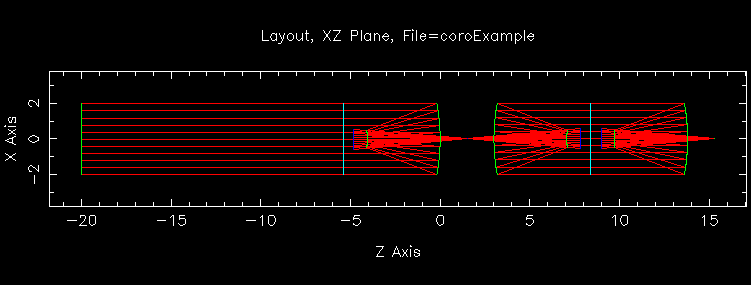{width="5.0in" height="1.9in"}

**FIGURE 47** DRAW sketch of coroExample.in system.

#### INTENSITY

The INtensity command takes the complex amplitude matrix at the specified element, computes the modulus squared to determine the intensity, and plots or exports it according to the active plot option (see Section 7.3).

**Beam Propagation Commands**

The INtensity command only accepts one argument–the number of the surface at which the intensity is viewed. This surface must be a stored wavefront. In the default gray scale plot, the intensity is displayed with black and white corresponding to the maixmum and minimum intensities, respectively.

We begin the example by propagating the on-axis beam through the first part of a near-field diffraction propagation (PropType=NF1), observing the image at the focus of the first telescope, both with and without the occulting mask:

MACOS\> **mod**

    MOD: [q]: nObs(6)=0 Turns off the occulting mask
    nObs( 6) = 0 MOD: [q]: q MACOS> int 6
    Enter number of element where data is to be generated: [1]: 6 Tracing 12661 rays and propagating 262144 grid points...
    Prop to reference point Elt 5 and Elt 6 to WF 1:
    z1= 6.3293D+00 dx1= 8.8773D-03 min= 8.8703D-03 max= 8.8832D-03 dev= 3.7728D-06 lin= 99.96%
    z2= 1.0000D+30 dx2= 1.3925D-06
    Compute time was 8.7598 sec Wavefront Propagation Data Summary:
    Wavelength= 1.0000000D-06; Source Flux= 1.0000000D+00 u-v plane diam= 4.5362873D+00 du= 8.8772746D-03
    x-y plane diam= 7.1158918D-04 dx= 1.3925425D-06
    Peak intensity= 3.7152264D-02; Peak occurs at i= 257, j= 257
    Sum of intensity= 8.7709310D-01 MACOS>

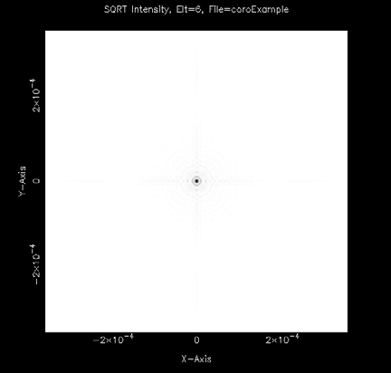{width="2.890972222222222in" height="2.7465277777777777in"}

**FIGURE 48** Unocculted image at first focal plane (coronagraph example)

Continuing with the example, the beam intensity can be observed at the other points of interest in the coronagraph, simply by specifying the appropriate element numbers. At the pupil, the Lyot stop, and then at the detector, the intensity plots are generated by:

MACOS\> **int 10**

    Enter number of element where data is to be generated: [6]: 10 Tracing 12661 rays and propagating 262144 grid points...
    Prop from reference point Elt 6 and Elt 7 to WF 1:
    z1= 1.0000D+30 dx1= 1.3925D-06
    z2=-6.3293D+00 dx2= 8.8773D-03 min= 8.8703D-03 max= 8.8832D-03 dev= 3.7728D-06 lin= 99.96%
    Geometric Prop between Elt 6 and Elt 10 to WF 1 Compute time was 6.8867 sec
    Wavefront Propagation Data Summary:
    Wavelength= 1.0000000D-06; Source Flux= 1.0000000D+00 u-v plane diam= 0.0000000D+00 du= 0.0000000D+00
    x-y plane diam= 1.6256657D+01 dx= 3.1813417D-02
    Peak intensity= 7.6769075D-05; Peak occurs at i= 258, j= 297 Sum of intensity= 1.3185163D-01

MACOS\> **int 11**

    Enter number of element where data is to be generated: [10]: 11 Tracing 12661 rays and propagating 262144 grid points...
    Geometric Prop between Elt 10 and Elt 11 to WF 1 Compute time was 0.4170 sec
    Wavefront Propagation Data Summary:
    Wavelength= 1.0000000D-06; Source Flux= 1.0000000D+00 u-v plane diam= 1.6256657D+01 du= 3.1813417D-02
    x-y plane diam= 1.6094488D+01 dx= 3.1496063D-02
    Peak intensity= 2.9045304D-05; Peak occurs at i= 267, j= 320 Sum of intensity= 4.4725472D-02

MACOS\>

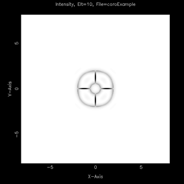{width="2.0701388888888888in" height="2.066666666666667in"}

**FIGURE 49** On-axis beam profile at a pupil; at the Lyot stop; and at the detector (coronagraph example)

#### PIXILATE

The PIxilate command is used to simulate discrete element detectors. MACOS calculates wavefront propagation on an array size which is independent of the detector size. The physical dimension of the diffracted image pixels is in general different from the detector pixel size being used to sample the signal. The PIxilate command imposes a square detector area over the intensity pattern. It averages the INtensity pattern within each detector pixel and sets that average equal to the value within the pixel. This is shown schematically in Figure 50. The PIxilated grid is centered on the chief ray (unless the PLOcate command has been executed) and the image location is determined by the Fourier transform of the exit pupil OPD map. Residual tilt in the OPD will shift the image from the chief ray intercept on the focal plane.

The PIxilate command has three arguments: the number of pixels per side (of the detector), the pixel width, and the element where the signal is to be PIxilated.

Continuing our example, we use the pixilate command to get a closer look at the occulted and unocculted images at the first focus:

Point-spread function Pixel boundaries Pixilated image

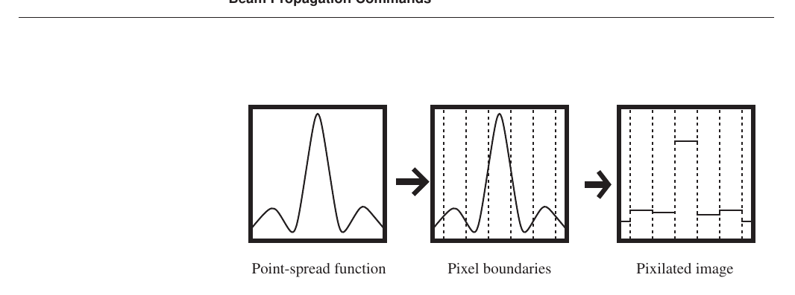

**FIGURE 50** Pixilization of images

MACOS\> **pix 6**

    Enter number of element where data is to be generated: [6]: 6 Wavefront Propagation Data Summary:
    Wavelength= 1.0000000D-06; Source Flux= 1.0000000D+00 u-v plane diam= 2.2394683D+00 du= 1.7633609D-02
    x-y plane diam= 3.5613167D-04 dx= 2.8041864D-06 Enter number of pixels per side: [128]: 64
    Enter size of pixel: [2.804186E-06]:
    Peak intensity= 1.6217206D-01; Peak occurs at i= 65, j= 65 Sum of intensity= 9.0994070D-01

MACOS\> **mod**

    MOD: [q]: nObs(6)=1 Reinstates the occulting mask
    nObs( 6) = 1
    MOD: [q]: q

MACOS\> **pix 6 64 2.804186E-06**

    Enter number of element where data is to be generated: [16]: 6 Tracing 3210 rays and propagating 16384 grid points...
    Prop to reference point Elt 5 and Elt 6 to WF 1:
    z1= 6.3293D+00 dx1= 1.7634D-02 min= 1.7628D-02 max= 1.7637D-02 dev= 2.6054D-06 lin= 99.99%
    z2= 1.0000D+30 dx2= 2.8042D-06
    Compute time was 0.4272 sec Wavefront Propagation Data Summary:
    Wavelength= 1.0000000D-06; Source Flux= 1.0000000D+00 u-v plane diam= 2.2394683D+00 du= 1.7633609D-02
    x-y plane diam= 3.5613167D-04 dx= 2.8041864D-06 Enter number of pixels per side: [128]: 64
    Enter size of pixel: [2.804186E-06]:
    Peak intensity= 8.2110545D-04; Peak occurs at i= 65, j= 72
    Sum of intensity= 1.1480418D-01 Note the reduced intensity

MACOS\>

#### STRETCH

It is often important to be able to visualize very low-level details of an image or beam. This may require changing the stretch of the image: the scaling of the intensity. Plotting on a log10 or sqrt intensity scale greatly increases the dynamic range of an image. The MACOS STRetch command changes the intensity scaling, to log10, sqrt, or linear scale.

An example of setting the stretch is:

MACOS\> **stretch**

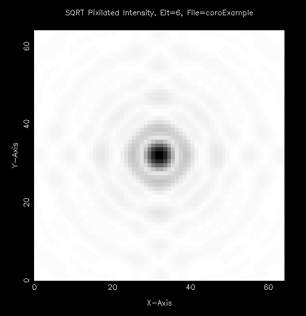{width="2.04375in" height="2.1069444444444443in"}

**FIGURE 51** Pixilated images at first focal plane (coronagraph example)

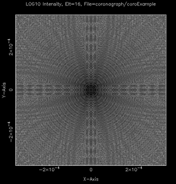{width="1.95in" height="2.033333333333333in"}

**FIGURE 52** Pixilated images at log10 and sqrt stretch (coronagraph example)

    Enter image stretch type (LINEAR, LOG10, SQRT): [LINEAR]: log10

#### WINDOW

Using PIXilate to simulate detector images has a drawback: if the FEX command is used correctly, the image will always be centered in the PixArray window, even at differing field angles. The WINdow command provides a means of fixing the detector in space, so that changes in field angle result in appropriate motion of the image on the detector. WINdow sets PixArray equal to a specific region on the detector.

WINdow has four arguments. The first is a character string indicating the user’s choice of output coordinate options. The second is the pixel size. The third is the location of the element vertex in pixel coords (this is used to define the origin of a pixel coordinate system, whose axis directions are defined by the previously selected coordinates. The fourth is the location in pixel coordinates of the center of the window:

MACOS\> **win**

    Enter output coordinate option (Tout, Enter or Beam): [Tout]: Tout
    Enter pixel size for placing window: [0.]: 1.392542d-6 Enter pixel coords of element vertex (x,y): [0.,0.]: 0,0 Enter window location in pixel coords (x,y): [0.,0.]: 0,0

#### COMPOSE

The COMpose command defines the pixel size and dimensions for a detector window. It also sets up an accumulate option, whereby images from a series of propagations, under

**Beam Propagation Commands**

arbitrarily different conditions, can be incoherently added. It is useful for creating composite images from multiple-source or multiple-wavelength objects.

COMpose images are created by successive applications of the ADD command. ADD propagates the current beam, pixilates the intensity to the COMpose grid, and adds it to what is already present. COMpose is also used with the NOIse and BLUR commands, to add simulated noise to an image. An example using the COMpose and ADD commands is presented in Section 7.2.6.

COMpose has three arguments: the number of pixels per side (of the detector), the pixel width, and the element where the signal is to be COMposed.

Continuing the coronagraph example, a pixel array is defined at the detector element:

MACOS\> **compose**

    Enter element where image is to be composed: [16]: 16
    Enter number of pixels per side: [512]: 64
    Enter size of pixel: [1.000000E-03]: 1.392542E-06

#### ADD

The ADD command propagates the current beam, pixilates the intensity to the COMpose

grid, and adds it to the composed pixel array image, which is stored in PixArray.

Continuing the coronagraph example, the on-axis image is added to the detector pixel array:

MACOS\> **add**

    Wavefront Propagation Data Summary:
    Wavelength= 1.0000000D-06; Source Flux= 1.0000000D+00 u-v plane diam= 4.5362873D+00 du= 8.8772746D-03
    x-y plane diam= 7.1158918D-04 dx= 1.3925425D-06
    Peak intensity= 3.8883158D-04; Peak occurs at i= 257, j= 257 Sum of intensity= 4.4725467D-02
    Image added. Plot composed image? [YES]: yes

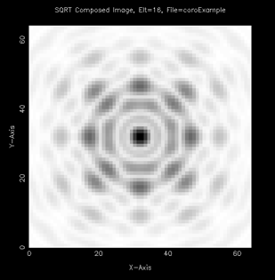{width="2.0618055555555554in" height="2.1in"}

**FIGURE 53** Axial image ADDed to begin composed image.

#### Propagating a Perturbed Beam

The next step in the coronograph example is to define an off-axis star and propagate it to the detector, adding it into the composed image. The result is an image with 2 PSFs on

it, allowing us to evaluate the effectiveness of the coronagraph in reducing dynamic range between neighboring objects.

MACOS\> **stop**

    Stop at ELT or OBJect point? [Elt]: elt Enter system stop element number: [1]: 11 Enter offset vector (dx,dy): [0.,0.]: 0,0
    Computed StopPos= 0.000000000D+00 0.000000000D+00 -1.427723273D+02

MACOS\> **ffpˆ *Find field angles that put the off-axis ***Enter element number: \[16\]: **6 *spot right next to the occulting disk ***Enter offset vector in global units (dx,dy): \[0.,0.\]: **2d-5,2d-5**

    Field angle finder results:
    Did 1 iterations, error= 1.424113342D-15
    Old dx= 0.000000000D+00 New dx= 2.000000000D-05 0.000000000D+00 2.000000000D-05
    Old crd= 0.000000000D+00 New crd= 8.916721422D-07 0.000000000D+00 -8.916721422D-07
    1.000000000D+00 1.000000000D+00 Old crp= 0.000000000D+00 New crp= 1.094726641D-04 0.000000000D+00 -1.094726641D-04
    -2.000000000D+01 -2.000000000D+01
    Accept the new chief ray? [YES]: yes

MACOS\> **ors *Find new reference surfaces for diffraction propagation***

    Enter number of element to be optimized: [1]: 5
    Reference surface optimization results:
    TTL OPD= 1.656171318D-09 nCalls= 18
    Old f= 6.329334641D+00 New f= 6.329334641D+00 Old z= 6.329334641D+00 New z= 6.329334641D+00 Old psi= 0.000000000D+00 New psi= -2.730547038D-06 0.000000000D+00 2.730547038D-06
    1.000000000D+00 1.000000000D+00 Old Vpt= 0.000000000D+00 New Vpt= 3.728254596D-05 0.000000000D+00 -3.728254596D-05
    -4.829334641D+00 -4.829334641D+00
    Accept the new element data? [YES]: yes

MACOS\> **ors**

    Enter number of element to be optimized: [1]: 7
    Reference surface optimization results:
    TTL OPD= 1.656171779D-09 nCalls= 18
    Old f= 6.329334641D+00 New f= 6.329334641D+00 Old z= -6.329334641D+00 New z= -6.329334641D+00 Old psi= 0.000000000D+00 New psi= 2.730547038D-06 0.000000000D+00 -2.730547038D-06
    -1.000000000D+00 -1.000000000D+00 Old Vpt= 0.000000000D+00 New Vpt= 2.717454041D-06 0.000000000D+00 -2.717454041D-06
    7.829334641D+00 7.829334641D+00
    Accept the new element data? [YES]: yes

MACOS\> **fex *Find new exit pupil as well***

    Enter number of exit pupil return surface: [15]: 15
    Tracing 333 rays...
    Chief ray location: x=-2.0000000D-05 y= 2.0000000D-05 z=
    1.5300000D+01
    Centroid location: x=-2.0042495D-05 y= 2.0042495D-05 z=
    1.5300000D+01
    Centroid offset from chief ray: x= 4.2495119D-08 y=-4.2495119D-08 z=-6.7501560D-14
    Exit pupil finder results:
    Old f= 6.329334641D+00 New f= 7.324539719D+00

+-----------------+-----------------+----------------------------------+
| Old z=          | 6.329334641D+00 | 7.324539719D+00                  |
|                 | New z=          |                                  |
+=================+=================+==================================+
| Old psi=        | 0.000000000D+00 | -2.736348769D-06                 |
|                 | New psi=        |                                  |
+-----------------+-----------------+----------------------------------+
|                 | 0.000000000D+00 | 2.736348769D-06                  |
+-----------------+-----------------+----------------------------------+
|                 | 1.000000000D+00 | 1.000000000D+00                  |
+-----------------+-----------------+----------------------------------+
| Old Vpt=        | 0.000000000D+00 | 1.263889675D-13                  |
|                 | New Vpt=        |                                  |
+-----------------+-----------------+----------------------------------+
|                 | 0.000000000D+00 | -1.263889675D-13                 |
+-----------------+-----------------+----------------------------------+

**Beam Propagation Commands**

    8.970665359D+00 7.975460281D+00
    Accept the new element? [YES]: yes

MACOS\> **mod *This object is 100 times dimmer than the on-axis object***

    MOD: [q]: flux=0.01 Flux = 1.000000000D-02 MOD: [q]: q

MACOS\> **stretch**

    Enter image stretch type (LINEAR, LOG10, SQRT): [LINEAR]: log10

MACOS\> **int *This image is shown in Figure 54***

    Enter number of element where data is to be generated: [16]: 6
    Tracing 12661 rays and propagating 262144 grid points... Prop to reference point Elt 5 and Elt 6 to WF 1:
    z1= 6.3293D+00 dx1= 8.8773D-03 min= 8.8703D-03 max= 8.8832D-03 dev= 3.7730D-06 lin= 99.96%
    z2= 1.0000D+30 dx2= 1.3925D-06
    Compute time was 8.9688 sec Wavefront Propagation Data Summary:
    Wavelength= 1.0000000D-06; Source Flux= 1.0000000D-02 u-v plane diam= 4.5362873D+00 du= 8.8772746D-03
    x-y plane diam= 7.1158918D-04 dx= 1.3925425D-06
    Peak intensity= 3.7145605D-04; Peak occurs at i= 257, j= 257 Sum of intensity= 8.6867251D-03

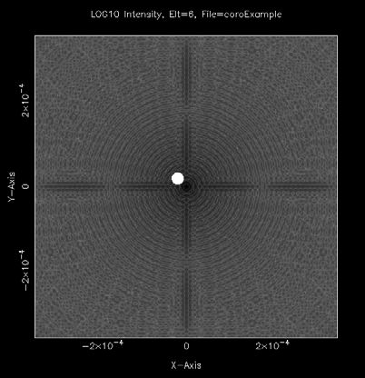{width="2.6798611111111112in" height="2.7729166666666667in"}

**FIGURE 54** Off-axis image at the first focus, showing closeness to occulting mask.

MACOS\> **add *Now the off-axis star is added to the composed image (Figure 55)***

    Tracing 12661 rays and propagating 262144 grid points... Prop from reference point Elt 6 and Elt 7 to WF 1:
    z1= 1.0000D+30 dx1= 1.3925D-06
    z2=-6.3293D+00 dx2= 8.8773D-03 min= 8.8703D-03 max= 8.8832D-03 dev= 3.7728D-06 lin= 99.96%
    Scalar FF Prop between Elt 15 and Elt 16 to WF 1:
    z1= 7.3245D+00 dx1= 1.0273D-02 min= 1.0265D-02 max= 1.0280D-02 dev= 4.3667D-06 lin= 99.96%
    z2= 0.0000D+00 dx2= 1.3925D-06
    Compute time was 14.0371 sec Wavefront Propagation Data Summary:
    Wavelength= 1.0000000D-06; Source Flux= 1.0000000D-02
    u-v plane diam= 5.2495594D+00 du= 1.0273110D-02 x-y plane diam= 7.1158918D-04 dx= 1.3925425D-06
    Peak intensity= 2.2644562D-04; Peak occurs at i= 257, j= 257 Sum of intensity= 6.8026488D-03
    Image added. Plot composed image? [YES]: yes

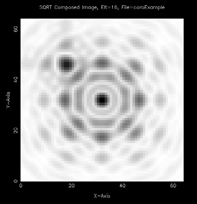{width="2.689583333333333in" height="2.7868055555555555in"}

**FIGURE 55** Off-axis image added to composed detector image. Note that the image dynamic range is about 1, while the objects differ by 100 in flux.

#### GBLUR

The GBLUR command is used to simulate “long-exposure” jitter effects or other phenomena that cause smooth spreading of the image. It propagates the beam to the specified surface, and then convolves the resulting intensity with a gaussian. It adds the result to the pixel array buffer (PixArray) and optionally displays it. The blurring is done at the WF sampling density, rather than the pixel density, which will generally be more accurate if the blurring occurs prior to the digitization of the image at the detector. Before using GBLUR, the user must invoke the COMPose command to set the detector pixel geometry. The width of the blur kernel is defined in the function arguments.

The following example sets up a typical case. The detector is first defined, at element 21, by specifying the number and size of the pixels. Note that the pixel size is specified to be the same as the WF pixel size (dx) for this example, which shows the blurred image at its highest resolution.

The GBLUR function is then invoked, first with a kernel width much smaller than the pixel size, and then with a kernel size much larger. The results

MACOS\> **compose**

    Enter element where image is to be composed: [21]: 21
    Enter number of pixels per side: [128]: 128
    Enter size of pixel: [1.000000E-03]: 1.0007177D-05

MACOS\> **gblur**

    Wavefront Propagation Data Summary:
    Wavelength= 1.0000000D-06; Source Flux= 1.0000000D+00 u-v plane diam= 1.6365868D-01 du= 1.2886510D-03
    x-y plane diam= 1.2709115D-03 dx= 1.0007177D-05
    Peak intensity= 9.5305603D-02; Peak occurs at i= 65, j= 65 Sum of intensity= 8.6054104D-01
    Enter Gaussian blur kernel width in base units (0,0): [0.,0.]: 1d-6,1d-6
    Image added. Plot composed image? [YES]: yes

**Beam Propagation Commands**

Type \<RETURN\> for next page:

MACOS\> **gblur**

    Wavefront Propagation Data Summary:
    Wavelength= 1.0000000D-06; Source Flux= 1.0000000D+00 u-v plane diam= 1.6365868D-01 du= 1.2886510D-03
    x-y plane diam= 1.2709115D-03 dx= 1.0007177D-05
    Peak intensity= 9.5305603D-02; Peak occurs at i= 65, j= 65 Sum of intensity= 8.6054104D-01
    Enter Gaussian blur kernel width in base units (0,0): [0.,0.]: 300d-6,300d-6
    Image added. Plot composed image? [YES]: yes

Type \<RETURN\> for next page: MACOS\>

**FIGURE 56** GBLUR example.

#### DAD

The DAD command displays the current COMposed image. This is useful if you have forgotten what the composed image looks like, or if you want to view it using a different stretch or plot type. It has no arguments.

#### GAIN

The GAIn command computes the ratio of the light diffracted by the optical system to a uniformly radiating point source of the same intensity. It is used mainly to evaluate the far-field performance of radio-frequency antennas. This command has one argument, the surface on which to compute the gain. An example is provided by the Luneberg Lens Antenna (Appendix A.3.3), and shown in Figure 58.

#### AMPLITUDE and PHASE

Each element in the MACOS wavefront propagation matrix is a complex number which can be expressed in terms of its real and imaginary components (i.e., a + b\*i where a and b are real numbers). This complex number is a vector in the complex plane with two components, real and imaginary as shown in Figure 59.

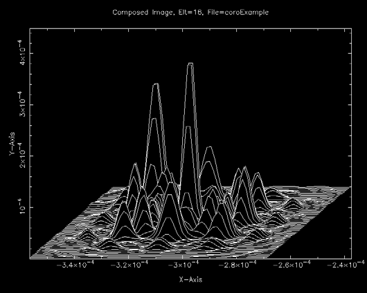{width="3.540277777777778in" height="2.8270833333333334in"}

**FIGURE 57** Composed detector image displayed at linear stretch, slice plot type.

**FIGURE 58** Far-field gain of Luneberg Lens Antenna.

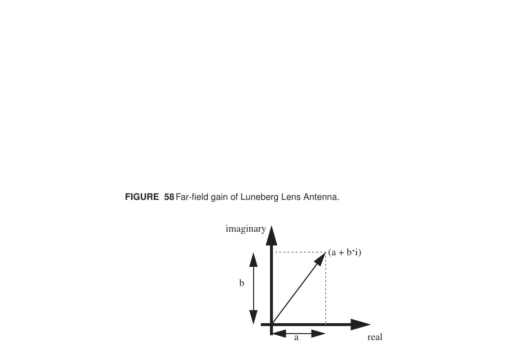

**FIGURE 59** Graphing numbers in the complex plane

The AMplitude and PHASE commands directly plot the corresponding components of the complex amplitude matrix. Figure 60 provides an example. The first plot shows the

**Beam Propagation Commands**

MACOS\>**amp**

amplitude or length of the vector. The second plot shows the phase of the vector, or the angle which the vector makes with the real axis modulo 360 degrees. The AMplitude command requires the wavefront element number nElt as input.

This example uses CassWithExitPupil.in in Appendix A.1.4.

    Enter element where WF is to be plotted:5 Wavefront plane 1 is evaluated at this element. Wavefront Propagation Data Summary:
    Wavelength= 1.0000000D-06; Transmission Distance= 5.5601459D+00 u-v plane diam= 8.4230375E+00 du= 3.3031520E-02
    x-y plane diam= 1.6767097E-04 dx= 6.5753318E-07

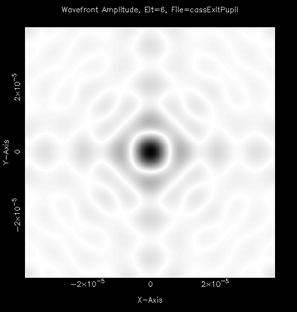{width="1.9833333333333334in" height="2.079861111111111in"}

Amplitude Phase

**FIGURE 60** AMplitude example

#### REAL and IMAGINARY

As discussed in Section 7.2.11, the wavefront propagation matrix elements are complex numbers. The REAl and IMAGINARY commands display these two components of the complex amplitude matrix. Figure 61 shows the real and imaginary components. The first graph displays the real component of each complex pixel number in the array. The second graph shows the imaginary component. The single command argument is the element number of interest.

This example uses CassWithExitPupil.in in Appendix A.1.4.

MACOS\>**real**

    Enter element where WF is to be plotted:5 Wavefront plane 1 is evaluated at this element. Wavefront Propagation Data Summary:
    Wavelength= 1.0000000D-06; Transmission Distance= 5.5601459D+00 u-v plane diam= 8.4230375E+00 du= 3.3031520E-02
    x-y plane diam= 1.6767097E-04 dx= 6.5753318E-07 Type <RETURN> for next page:

Type \<RETURN\> for next page: MACOS\>

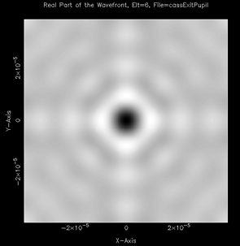{width="1.9701388888888889in" height="2.020138888888889in"}

Real part Imaginary part

**FIGURE 61** REAl example

### Image polarity and stretch-aware labels

Image polarity (IMGMODE). Image-type plots (INTensity, PIXillated, OPD-as-image) can be rendered in either of two polarities:

-   Astronomical (default, 'ASTRO' or 'NEG'): large pixel values render dark, small values render bright. Matches the PGPlot convention many MACOS users are accustomed to.

-   Conventional ('CONV' or 'POS'): large values bright, small values dark. Matches general scientific imaging.

Toggle with the IMGMODE command:

    MACOS> IMGMODE
    Enter image polarity (NEG/POS, ASTRO/CONV): [NEG]: CONV

The setting persists for the session. It does not affect the non-image plot types (CONTOUR, SLICE, WIRE, SPOTDIAG, PLOTCOL), which always render with black ink on white.

Stretch-aware colorbar labels. When STRETCH is active (LOG10 or SQRT), the colorbar wedge label reflects the active stretch:

-   INT, STRETCH=LIN: label 'Intensity'

-   INT, STRETCH=LOG10: label 'LOG10 Intensity'

-   INT, STRETCH=SQRT: label 'SQRT Intensity'

-   PIX, STRETCH=LOG10: label 'LOG10 Pixel value'

-   OPD with BaseUnits: label 'OPD (mm)' etc.

The label is set by the command handler before the draw routine emits it, so the polarity / stretch and the label always match.

Bottom-of-plot annotation. Most image plot types now print one or two annotation lines just below the colorbar:

-   OPD: 'OPD=\<rms\> \<unit\> RMS, \<pv\> \<unit\> P-V'

-   SPOT: 'RMS spot radius=\<r\> \<unit\>'

-   INT: 'Peak pixel=\<MaxInt\>'

-   PIX: 'Peak pixel=\<maxval\>'

### Plot Type Commands

#### GRAY

The GRAy command resets the type of plot to GRAy scale. This is the default plot type. It has no arguments.

#### WIRE

The WIRe command takes all the values in an array and first plots them as three dimensional points. Then each point is then connected to its nearest neighbor on the grid by a line. Perspective is added and the obscured lines are removed. The result is a surface-like representation of the data as shown in Figure 62. There is no scale on the graph. The WIRe command is always used in conjunction with other commands and has no arguments.

MACOS\>**wire** MACOS\>**in**

    Enter element where WF is to be plotted:5 Wavefront plane 1 is evaluated at this element. Wavefront Propagation Data Summary:
    Wavelength= 1.0000000D-06; Transmission Distance= 5.5601459D+00 u-v plane diam= 8.4230375E+00 du= 3.3031520E-02
    x-y plane diam= 1.6767097E-04 dx= 6.5753318E-07 Type <RETURN> for next page:

MACOS\>

#### SLICE

The SLIce command is very similar to the WIRe command in that it displays the array of data as a surface. In this instance, the graph also contains a scale so the data values can be read directly. Like the WIRe command, SLIce is used with other commands and has no arguments.

Figure 57 provides an illustration of the SLICE plot type.

**Plot Type Commands**

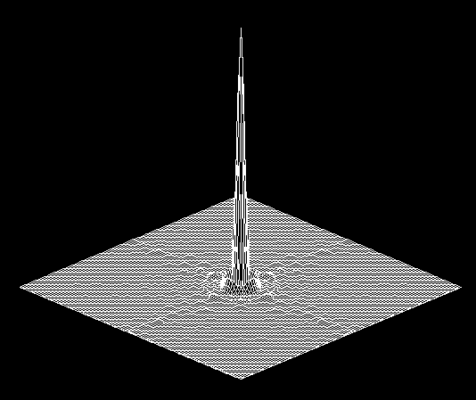{width="3.563888888888889in" height="2.9930555555555554in"}

**FIGURE 62** WIRe plot

#### CONTOUR

The CONtour command sets the plot type to display data using a contour map (an elevation map). Data points with similar values are connected by the same line. The CONtour map shows graphically those points with similar values. The CONtour command has no arguments.

This example uses CassWithExitPupil.in in Appendix A.1.4. Figure 63 shows the results.

MACOS\>**con** MACOS\>**opd**

    Enter element where OPD is to be evaluated:5 Average OPD is -1.894794E-12
    Average total path is 1.5622291803998E+01 Average delta path is -3.7770819600190E-01 RMS OPD error is 1.091947E-12

Type \<RETURN\> for next page:

MACOS\>

#### COLUMN and ROW

The COLumn and ROW commands set the plot type to display a slice across the data surface. The slice is along a column or row of the data matrix, respectively. The user is prompted for the column or row number when the data is to be plotted out (for instance, when an INTensity command is issued). The COLumn and ROW commands have no arguments.

This example uses CassWithExitPupil.in in Appendix A.1.4. Figure 64 shows the results.

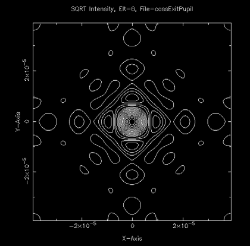{width="2.8in" height="2.7597222222222224in"}

**FIGURE 63** CONtour example

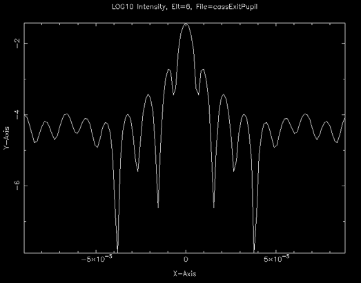{width="3.4923611111111112in" height="2.7333333333333334in"}

**FIGURE 64** COLumn example

#### TEXT

The TEXt command writes the data points in the array to a file for further analysis. The file is in ASCII format and can be printed or read into a text editor. There are up to mdttl rows of numbers, each with up to mdttl numbers across: this can be quite a large file! The data points are the same as numbers used to create the graphical display. They are single precision. The TEXt command creates files as output and has no arguments. The filenames specify the contents and are of the format: \[filename\].\[image type\]\[surface number\].txt where \[image type\] can be in (intensity), am (amplitude), ph (phase), re (real), im (imaginary), spot, and OPD.

This example uses CassWithExitPupil.in in Appendix A.1.4. The TEXt file is stored in **CassWithExitPupil.int5.txt**

**Plot Type Commands**

MACOS\>**text** MACOS\>**intensity**

    Enter element where WF is to be plotted:5 Wavefront plane 1 is evaluated at this element. Wavefront Propagation Data Summary:
    Wavelength= 1.0000000D-06; Transmission Distance= 5.5601459D+00 u-v plane diam= 8.4230375E+00 du= 3.3031520E-02
    x-y plane diam= 1.6767097E-04 dx= 6.5753318E-07 Writing Wavefront Intensity, Elt=5
    FORMATTED File=CassWithExitPupil.int5.txt MACOS>

#### BINARY

The BINary command writes numerical files which can be used by other signal/image processing software. It takes the array data and writes it out to a file in BINary format. The BINary command produces files for output and has no arguments. The filenames specify the contents and are of the format: \[filename\].\[image type\]\[surface number\] where \[image type\] can be in (intensity), am (amplitude), ph (phase), re (real), im (imaginary), spot, and OPD.

#### MATLAB

The MATlab command writes the data arrays to MATlab format. The MATlab command produces files for output and has no arguments. The filenames specify the contents and are of the format: \[filename\].\[image type\]\[surface number\].dat where \[image type\] can be in (intensity), am (amplitude), ph (phase), re (real), im (imaginary), spot, and OPD.

#### FITS

The FITs command writes the data arrays to fits format files. The FITs command produces files for output and has no arguments. The filenames specify the contents and are of the format: \[filename\].\[image type\]\[surface number\].fit, where \[image type\] can be in (intensity), am (amplitude), ph (phase), re (real), im (imaginary), and OPD.
