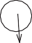
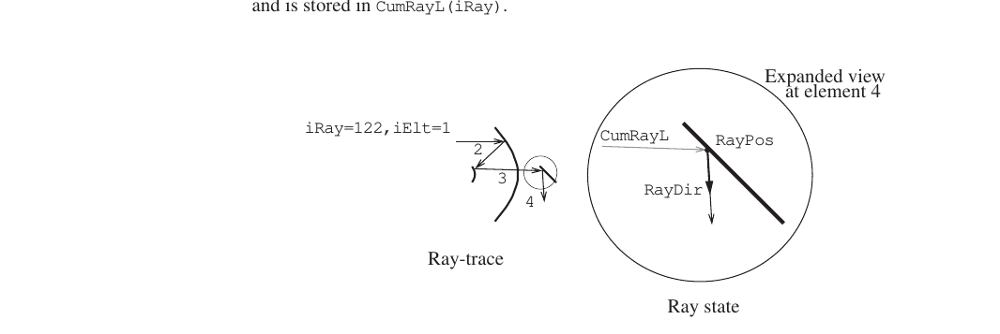
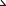
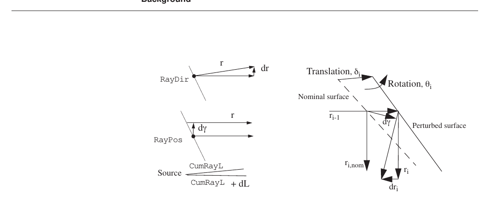
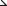
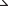

## SECTION 8: Differential Ray-Tracing and Linear Optical Models

The MACOS differential ray-trace functions are used to compute optical sensitivity matrices. These provide linear models of the effects of optical element perturbations on optical performance. The linear models can be exercised internally to MACOS using functions such as LPErturb, LOPd and LINtensity which parallel commands introduced earlier. Linear optical models can also be EXPported for use external to MACOS.

    BUild DMBuild PArtials LPErturb LPRead LREset LSPot LOPd
    LPIxillate LINtensity EXPort

### Background

*linear models* of optical systems provide a linear matrix transformation between element perturbations and ray perturbations. These optical models can be used in place of the full-blown ray-trace calculations for systems that undergo only small changes. They can also be used in ways that the nonlinear models cannot, such as in linear statistical studies.

Linear models are generally valid where

-   The small-angle approximation is valid for changes in ray direction

-   The ray transverse aberration is “small” relative to the curvature of the optical elements

The limits are not absolute, but vary from system to system. The user can check the range of validity of a linear model for a particular system. This is done by using the MACOS LPErtrurb, LOPd, LSPot and LINtensity commands to exercise the linear model. Results are compared with exact results produced for the same cases using the MACOS PERturb, OPD, SPOt and INtensity commands. If, over the expected range of perturbation values, the linear models produce results that are within the accuracy requirements of the particular analysis, then they can be safely used for that analysis. Otherwise a nonlinear SMACOS model should be used.

#### Linear Ray States

Rays are defined at any particular point in a beam train by their location, direction and length. In MACOS, the current *exact ray state* is defined as the position, direction and path length of a ray immediately after the current element (see Figure 65). The *position* of the iRayth ray is a 3-vector giving the point of incidence with the current element. MACOS stores it in the array RayPos as RayPos(1:3,iRay). The *direction* of the iRayth ray is a unit-magnitude 3-vector stored in RayDir(1:3,iRay). Note that if the current element is a mirror or lens, the direction is of the reflected or refracted ray. The *optical path length* of the iRayth ray from the source to the current element is a scalar and is stored in CumRayL(iRay).

Expanded view at element 4

    iRay=122,iElt=1
    CumRayL

{width="0.23661417322834646in" height="0.3299212598425197in"}

**FIGURE 65** Ray state

The effect of a *perturbation* in the optical system, such as a rotation or translation of an optical element, is to *change the ray state* at every downstream element. Such perturbations can be applied using the PERturb command, and the ray retraced to find the new ray state.

If a perturbation is sufficiently small, it will effect the rays *linearly*. That is, the new ray state at every downstream element is very nearly a linear function of the perturbation. This is true for some range of perturbation magnitudes that varies with each system, but is in general many times the wavelength of light.

MACOS linear modeling features use *analytic differential* ray-trace equations to compute the partial derivatives of the rays with respect to element perturbations. The differential ray-trace equations are derived in References 1, 8, and 9. They provide a set of analytical formulas giving the ray partial derivative matrices in a form that is easily computed.

The *linear ray state* differs slightly from the exact ray state. The linear ray state is a single 7-vector, composed of a 3-vector of *ray direction perturbation*, a 3-vector of *ray transverse aberration*, and a scalar for *ray optical path difference*. It is written *x*

{width="3.611111111111111e-2in" height="3.0555555555555555e-2in"} *dr*

*x* = *d*γ

*dL*

**(8.1)**

where *d***r** is the ray direction perturbation. The ray direction perturbation is a 3-vector whose magnitude is small compared to 1 and which is perpendicular to the ray direction, RayDir. The total ray direction is equal to the vector sum of RayDir and *d***r** (to the accuracy of the small angle approximation). Figure 66 shows the linear ray state.

### **Background**

r

    RayDir

dr Translation, δi

Nominal surface

Rotation, θi

    RayPo

Source

    CumRayL CumRayL

\+ dL

ri-1

ri,nom

**FIGURE 66** Linear ray state

The transverse aberration γ is the lateral displacement of the ray. It is a vector perpendicular to the ray direction, from the nominal ray position to a point on the perturbed ray. It is not necessarily located on the surface of the element and is not, in general, the derivative of the ray position, RayPos. Exceptions are the focal-plane element type and any surface that is perpendicular to the nominal ray direction.

The path length perturbation, dL, is the difference between the optical path length of the perturbed and nominal rays. It is not the OPD, as that is the difference of the ray and the chief ray. However, the OPD is easily computed from dL as discussed below.

#### Linear Models

The linear ray state at a particular element is a function of perturbations of the upstream elements and of perturbations in the input ray. These perturbations are with respect to a “nominal state” (*xn* )*nom* , which may or may not be zero. For each ray at an element n, the linear ray state has the functional form:

*xn* = (*xn* )*nom* + [∂*xn*]{.underline} *u*1 + … + [∂*xn*]{.underline} *un* + [∂*xn*]{.underline} *x*0

**(8.1)**

∂*u*1

∂*un*

∂*x*0

Here the *u* vectors are 6-vectors of element perturbations, composed of 3-vectors θ for element rotational perturbation and δ for element translation perturbation:

*u* =

**(8.2)**

The individual optical sensitivity matrices can be printed using the PARtials command. The sensitivity of the nth ray to perturbations of the input (source) ray is a 7 by 7 matrix of the form:

[∂*xn*]{.underline}

∂*x*0

=

[∂*rn*]{.underline}

∂γ 0

∂γ *n*

∂γ 0

∂*Ln*

∂γ 0

**(8.3)**

The sensitivity of the nth ray to perturbations of the ith element is a 7 by 6 matrix of the form:

[∂*xn*]{.underline} =

∂*ui*

**(8.4)**

The complete expression for the linear ray state for a single ray in terms of element and input-ray perturbations is written in matrix form as:

*x* = (*xn* )*nom* +

[∂*xn*]{.underline} [∂*xn*]{.underline} … [∂*xn*]{.underline}

**(8.5)**

∂*x*0 ∂*u*1 ∂*un*

The same form is extended to give the linear ray state for multiple rays at the same element

+-----+---+---------+---+---+-------------------+---+---+---------------------+
|     |   |         |   |   |                   |   |   |                     |
+-----+---+---------+---+---+-------------------+---+---+---------------------+
| *   | = | *xray*1 | \ |   | [∂                |   | * | **(8.6)**           |
| xra |   |         | + |   | *xn*]{.underline} |   | x |                     |
| y*1 |   | …       |   |   | [∂                |   | * |                     |
|     |   |         |   |   | *xn*]{.underline} |   | 0 |                     |
| …   |   | *xraym  |   |   | …                 |   | * |                     |
|     |   | nom*    |   |   | [∂                |   | u |                     |
| *   |   |         |   |   | *xn*]{.underline} |   | * |                     |
| xra |   |         |   |   |                   |   | 1 |                     |
| ym* |   |         |   |   | ∂*x*0 ∂*u*1 ∂*un  |   |   |                     |
|     |   |         |   |   | ray*1             |   | … |                     |
|     |   |         |   |   |                   |   |   |                     |
|     |   |         |   |   | …                 |   | * |                     |
|     |   |         |   |   |                   |   | u |                     |
|     |   |         |   |   | [∂                |   | n |                     |
|     |   |         |   |   | *xn*]{.underline} |   | * |                     |
|     |   |         |   |   | [∂                |   |   |                     |
|     |   |         |   |   | *xn*]{.underline} |   |   |                     |
|     |   |         |   |   | …                 |   |   |                     |
|     |   |         |   |   | [∂                |   |   |                     |
|     |   |         |   |   | *xn*]{.underline} |   |   |                     |
+-----+---+---------+---+---+-------------------+---+---+---------------------+
|     |   |         |   |   | ∂*x*0 ∂*u*1 ∂*un  |   |   |                     |
|     |   |         |   |   | raym*             |   |   |                     |
+-----+---+---------+---+---+-------------------+---+---+---------------------+

Both of these equations have the form *x* = *xnom* + *Cu* , where the *C-matrix* is the *optical sensitivity matrix*, giving the change in ray state due to perturbations of the optical elements. The C-matrix provides a linear model of the optical system. The MACOS BUild command assembles these sensitivities from the individual ray partial derivatives.

It can be extremely useful to incorporate local coordinates directly into the optical sensitivity C-matrices. If the perturbations for one element are to be applied in coordinates other than the global coordinate system–perhaps in an actuator coordinate system–then that local coordinate transformation matrix can be included directly within the C-matrix. The transform from element iElt coordinates to global coordinates is written

*GTiElt* .

**Commands for Building Models**

Similarly, local coordinates can be used at the output end of the linear model. This allows for the creation of models for ray direction only, or transverse aberration or path length only. Focal-plane axes are easily incorporated. We write the transform for ray state from global coordinates to output coordinates as *^out^TG* . As an example, the 1x7 output transform matrix that captures only the path length ray state in global coordinates is

*pathlengthTG* =

0 0 0 0 0 0 1

**(8.7)**

As another example, the 2x7 output transform which takes the transverse aberration in ray state and casts it into detector coordinates *x* and *y* is

*detectorTG* =

0 0 0 *x*ˆ 0

0 0 0 *y*ˆ 0

**(8.8)**

Both actuator and detector coordinates are specified by the user as part of the .in-file prescription.

With the input and output coordinate matrices included, the C-matrix takes the form:

*outTG* [∂*xn*]{.underline} *GT*0 [∂*xn*]{.underline} *GT*1 … [∂*xn*]{.underline} *GTn*

*xray*1

… =

∂*x*0

∂*u*1

…

∂*un*

*ray*1

**(8.9)**

*xraym*

*outTG* [∂*xn*]{.underline} *G* 0 [∂*xn*]{.underline} *G* 1

[∂*xn*]{.underline} *G n*

{width="3.611111111111111e-2in" height="3.0555555555555555e-2in"} *T* {width="4.3055555555555555e-2in" height="3.0555555555555555e-2in"} *T*

∂*x*0 ∂*u*1

… {width="4.3055555555555555e-2in" height="3.0555555555555555e-2in"} *T*

∂*un*

*ray*nRay

### Commands for Building Models

#### BUILD

The BUild command traces all of the rays in a beam from the source to the specified final element. It then computes the full C-matrix linear model, giving the sensitivity of each ray at the last element to perturbations of each element in the beam train. It has one argument, the number iElt of the last element in the propagation.

BUild performs the MACOS differential ray-trace calculations, and must be performed before exercising commands that manipulate linear models, such as LPE, LOP, LSP, LIN, or before EXPorting C-matrix information.

Note that the BUild command ignores the presence of reference surfaces and obscuring surfaces unless they are the last surface. The BUild command currently does not work if there are return surfaces in the beam train.

MACOS\>**build**

As an example, consider the Cassegrain.in (see Appendix A.1.2). This prescription has output coordinates set up to compute a wavefront model as discussed previously. Once the prescription is loaded using the OLD command, the C-matrix is easily built:

    Enter terminal element number:4
    Tracing 150 rays and BUILDing linear model... Compute time was 0.4141 sec

MACOS\>

#### DMBUILD

The DMBuild command is not used in this version.

### Commands for Changing Models

#### LPERTURB

The LPErturb command allows the user to enter an element perturbation for use with the linear model analysis commands. LPErturb takes different arguments depending on whether element input coordinates are to be used. The first argument iElt is the number of the element to be perturbed. Note that element 0 (the source) cannot be perturbed using LPErturb. The second argument is a yes-or-no response indicating whether input coordinates are to be used. If NO is selected, the next two prompts are for rotational and translational 3-vector perturbations. If YES is selected, a vector of the same length as the number of input coordinates is input in the input coordinate system.

After each LPErturb command, the current perturbation vector (in global coordinates) is printed out. The LPErturb command *adds* the perturbation data to the existing perturbation vector. Multiple LPErturb commands sum each perturbation with the previous perturbation vector. The perturbation vector can be reset to zero using the LREset command. Using Cassegrain.in:

MACOS\>**lperturb**

    Enter element to be perturbed:3 Use element coordinates? (NO):
    Enter rotational perturbation vector (x,y,z):0,1e-7,0 Enter translational perturbation vector (x,y,z):0,0,0
    Element 1 Linear Perturbations:
    Rotational= 0.000000D+00 0.000000D+00 0.000000D+00 Translational= 0.000000D+00 0.000000D+00 0.000000D+00
    Element 2 Linear Perturbations:
    Rotational= 0.000000D+00 0.000000D+00 0.000000D+00 Translational= 0.000000D+00 0.000000D+00 0.000000D+00
    Element 3 Linear Perturbations:
    Rotational= 0.000000D+00 1.000000D-07 0.000000D+00 Translational= 0.000000D+00 0.000000D+00 0.000000D+00
    Element 4 Linear Perturbations:
    Rotational= 0.000000D+00 0.000000D+00 0.000000D+00 Translational= 0.000000D+00 0.000000D+00 0.000000D+00
    Element 5 Linear Perturbations:
    Rotational= 0.000000D+00 0.000000D+00 0.000000D+00 Translational= 0.000000D+00 0.000000D+00 0.000000D+00 MACOS>

**Commands for Exercisizing Models**

#### LPREAD

The LPRead command reads element perturbations from a specified datafile. MACOS assumes that the name of the perturbation file is infile.pert. If this file does not exist, MACOS prompts for the perturbation file name.

The perturbation file must be in the following all numeric format. The perturbations must be in global coordinates. The order of the perturbation vectors in the .pert-file must be identical to the order of the elements (the first perturbation vector corresponds to the first element, the sixth perturbation vector corresponds with the sixth element). Each element must have a perturbation vector. If an element is unperturbed, then a string of zeroes should be entered as its perturbation vector. The perturbation vectors have 6 components: a 3-vector rotational perturbations and a 3-vector translational perturbations. The 6 components must be separated by spaces.

MACOS\>**lpr** FileCassegrain.pert read. MACOS\>

#### LRESET

The LREset command zeros any previously entered linear perturbations. It should be used, when necessary, to reset the linear perturbation vector after LPErturb commands.

### Commands for Exercisizing Models

#### PARTIALS

The PARtials command prints individual optical sensitivity matrices for specified rays. The user is asked whether to print in input/output or global coordinates. For Cassegrain.in, the partials of the chief ray in global coordinates are:

MACOS\>**partials**

    Enter ray number for partials (0=done, 1=chief ray):1 Print partials in actuator/sensor coordinates? (YES): no
    Partial of ray 1 at Element 4 (Ref_surf) to ray at Element 0 (Inpu-tRay)
    0.3036E+01 0.0000E+00 0.0000E+00 -0.4458E-01 0.0000E+00 0.0000E+00
    0.0000E+00
    0.0000E+00 0.3036E+01 0.0000E+00 0.0000E+00 -0.4458E-01 0.0000E+00
    0.0000E+00
    0.0000E+00 0.0000E+00 0.1000E+01 0.0000E+00 0.0000E+00 0.0000E+00
    0.0000E+00
    0.5549E+01 0.0000E+00 0.0000E+00 0.2479E+00 0.0000E+00 0.0000E+00
    0.0000E+00
    0.0000E+00 0.5549E+01 0.0000E+00 0.0000E+00 0.2479E+00 0.0000E+00
    0.0000E+00
    0.0000E+00 0.0000E+00 0.1006E+02 0.0000E+00 0.0000E+00 0.1000E+01
    0.0000E+00
    0.0000E+00 0.0000E+00 0.0000E+00 0.0000E+00 0.0000E+00 0.0000E+00
    0.1000E+01
    Partial of ray 1 at Element 4 (Ref_surf) to Element 2 (Primary ) per-turbations
    0.0000E+00 -0.6606E+01 0.0000E+00 0.6117E+00 0.0000E+00 0.0000E+00
    0.6606E+01 0.0000E+00 0.0000E+00 0.0000E+00 0.6117E+00 0.0000E+00
    0.0000E+00 0.0000E+00 0.0000E+00 0.0000E+00 0.0000E+00 0.0000E+00

+--------------------+--------+--------+--------+--------+-----------+
| 0.0000E+00         | -0.81  | 0.00   | 0.75   | 0.00   | 0         |
|                    | 22E+01 | 00E+00 | 21E+00 | 00E+00 | .0000E+00 |
+====================+========+========+========+========+===========+
| 0.8122E+01         | 0.00   | 0.00   | 0.00   | 0.75   | 0         |
|                    | 00E+00 | 00E+00 | 00E+00 | 21E+00 | .0000E+00 |
+--------------------+--------+--------+--------+--------+-----------+
| 0.0000E+00         | 0.00   | 0.00   | 0.00   | 0.00   | 0         |
|                    | 00E+00 | 00E+00 | 00E+00 | 00E+00 | .0000E+00 |
+--------------------+--------+--------+--------+--------+-----------+
| 0.0000E+00         | 0.00   | 0.00   | 0.00   | 0.00   | 0         |
|                    | 00E+00 | 00E+00 | 00E+00 | 00E+00 | .2000E+01 |
+--------------------+--------+--------+--------+--------+-----------+

    Partial of ray 1 at Element 4 (Ref_surf) to Element 3 (Secondar) per-turbations
    0.0000E+00 0.1241E+01 0.0000E+00 -0.5671E+00 0.0000E+00 0.0000E+00
    -0.1241E+01 0.0000E+00 0.0000E+00 0.0000E+00 -0.5671E+00 0.0000E+00 0.0000E+00 0.0000E+00 0.0000E+00 0.0000E+00 0.0000E+00 0.0000E+00
    0.0000E+00 0.0000E+00 0.0000E+00 0.0000E+00 0.0000E+00 0.0000E+00
    0.0000E+00 0.0000E+00 0.0000E+00 0.0000E+00 0.0000E+00 0.0000E+00
    0.0000E+00 0.0000E+00 0.0000E+00 0.0000E+00 0.0000E+00 0.0000E+00
    0.0000E+00 0.0000E+00 0.0000E+00 0.0000E+00 0.0000E+00 -0.2000E+01
    Partial of ray 1 at Element 4 (Ref_surf) to Element 4 (Ref_surf) per-turbations
    0.0000E+00 0.0000E+00 0.0000E+00 0.0000E+00 0.0000E+00 0.0000E+00
    0.0000E+00 0.0000E+00 0.0000E+00 0.0000E+00 0.0000E+00 0.0000E+00
    0.0000E+00 0.0000E+00 0.0000E+00 0.0000E+00 0.0000E+00 0.0000E+00
    0.0000E+00 0.0000E+00 0.0000E+00 0.0000E+00 0.0000E+00 0.0000E+00
    0.0000E+00 0.0000E+00 0.0000E+00 0.0000E+00 0.0000E+00 0.0000E+00
    0.0000E+00 0.0000E+00 0.0000E+00 0.0000E+00 0.0000E+00 0.0000E+00
    0.0000E+00 0.0000E+00 0.0000E+00 0.0000E+00 0.0000E+00 0.0000E+00
    Enter ray number for partials (0=done, 1=chief ray):

The specific partials take the form in Eqns. 8.3 and 8.4. The first matrix shows that source chief ray direction perturbations are magnified 3.036 times at the reference surface. The effect on ray direction at the reference surface of primary mirror tilts and decenters are magnified by 6.606 and 0.5671 times, respectively.

The path length partials show a factor-of-two sensitivity for this ray. Looking at the OPD partials only for a marginal ray, these numbers change:

    Enter ray number for partials (0=done, 1=chief ray):2 Print partials in actuator/sensor coordinates? (YES): y
    Partial of ray 2 at Element 4 (Ref_surf) to ray at Element 0 (Inpu-tRay)
    0.2996E+01 -0.2639E-17 0.1976E-16 -0.4450E-01 0.3920E-19 0.0000E+00
    0.0000E+00
    -0.2639E-17 0.2984E+01 0.8899E-01 0.3920E-19 -0.4432E-01 0.0000E+00 0.0000E+00
    0.5643E+01 -0.4971E-17 0.1977E-15 0.2500E+00 -0.2202E-18 0.1976E-
    16 0.0000E+00
    -0.4971E-17 0.5620E+01 0.8902E+00 -0.2202E-18 0.2490E+00 0.8899E-01 0.0000E+00
    0.0000E+00 0.0000E+00 0.0000E+00 0.0000E+00 0.0000E+00 0.0000E+00
    0.1000E+01
    Partial of ray 2 at Element 4 (Ref_surf) to Element 2 (Primary ) per-turbations

+----------+-----------+----------+-----------+-----------+----------+
| -0.      | -0        | 0.       | 0         | -0        | 0.       |
| 4462E-16 | .6401E+01 | 0000E+00 | .5827E+00 | .8407E-17 | 4262E-16 |
+==========+===========+==========+===========+===========+==========+
| 0.       | 0         | 0.       | -0        | 0         | 0.       |
| 6200E+01 | .4462E-16 | 0000E+00 | .8407E-17 | .5448E+00 | 1920E+00 |
+----------+-----------+----------+-----------+-----------+----------+
| -0.      | -0        | 0.       | 0         | -0        | 0.       |
| 1069E-15 | .8239E+01 | 0000E+00 | .7500E+00 | .1533E-16 | 7920E-16 |
+----------+-----------+----------+-----------+-----------+----------+
| 0.       | 0         | 0.       | -0        | 0         | 0.       |
| 7757E+01 | .1069E-15 | 0000E+00 | .1533E-16 | .6810E+00 | 3567E+00 |
+----------+-----------+----------+-----------+-----------+----------+
| -0.      | 0         | 0.       | -0        | -0        | 0.       |
| 3934E+01 | .8735E-15 | 0000E+00 | .7951E-16 | .3581E+00 | 1934E+01 |
+----------+-----------+----------+-----------+-----------+----------+

    Partial of ray 2 at Element 4 (Ref_surf) to Element 3 (Secondar) per-turbations
    -0.3440E-17 0.1228E+01 0.5551E-16 -0.5382E+00 0.8367E-17 -0.4262E-16
    -0.1244E+01 0.3440E-17 0.0000E+00 0.8367E-17 -0.5005E+00 -0.1920E+00 0.3146E-16 -0.6986E-32 0.0000E+00 0.3062E-32 0.1379E-16 -0.9888E-16
    0.1417E+00 -0.3146E-16 0.0000E+00 0.1379E-16 0.6210E-01 -0.4453E+00
    0.6140E+00 -0.1363E-15 0.0000E+00 0.5975E-16 0.2691E+00 -0.1930E+01
    Partial of ray 2 at Element 4 (Ref_surf) to Element 4 (Ref_surf) per-turbations
    0.0000E+00 0.0000E+00 0.0000E+00 0.0000E+00 0.0000E+00 0.0000E+00
    0.0000E+00 0.0000E+00 0.0000E+00 0.0000E+00 0.0000E+00 0.0000E+00
    0.0000E+00 0.0000E+00 0.0000E+00 0.0000E+00 0.0000E+00 0.0000E+00
    0.0000E+00 0.0000E+00 0.0000E+00 0.0000E+00 0.0000E+00 0.0000E+00

**Commands for Exercisizing Models**

    0.0000E+00 0.0000E+00 0.0000E+00 0.0000E+00 0.0000E+00 0.0000E+00
    Enter ray number for partials (0=done, 1=chief ray):

#### LOPD

The LOPd command generates an OPD map of the beam at the final surface of the linear model. It parallels the OPD command discussed in Section 5.2.5. Using Cassegrain.in:

MACOS\>**lopd**

    Tracing perturbed system Average OPD is 1.822578E-12
    RMS OPD including piston is 3.023756E-08 RMS WFE excluding piston is 3.023755E-08 Type <RETURN> for next page:

#### LSPOT

The LSPot command generates a spot diagram of the beam at the final surface of the linear model. It parallels the SPOt command discussed in Section 5.2.6. Using Cassegrain.in:

MACOS\>**lspot**

    Tracing perturbed system Average OPD is -9.502741E-07
    RMS OPD including piston is 1.081200E-01 RMS WFE excluding piston is 1.081200E-01 Type <RETURN> for next page:

#### LINTENSITY

The LINtensity command computes beam wavefront phase at the final surface of the linear model and then performs a single far-field propagation to the next element in the prescription. If the last element in the linear model is the last element in the prescription, the user is prompted for transmission distance and other information. LINtensity performs calculations that parallel the propagation commands discussed in Sections 6.3 and 7.2.1, respectively. Using Cassegrain.in:

MACOS\>**lintensity** Tracing perturbed system

    Average OPD is 1.822578E-12
    RMS OPD including piston is 3.023756E-08 RMS WFE excluding piston is 3.023755E-08 FFT/Point Spread Function Data Summary:
    Wavelength= 9.9999999748E-07; Transmission Distance= 5.5601458549E+00 u-v plane diam= 1.8044868469E+01 du= 7.0764191449E-02
    x-y plane diam= 7.8265948105E-05 dx= 3.0692527275E-07

Type \<RETURN\> for next page:

#### LPIXILATE

The LPIxilate command computes beam wavefront phase at the final surface of the linear model and then performs a single far-field propagation to the next element in the prescription. If the last element in the linear model is the last element in the prescription, the user is prompted for transmission distance and other information. Finaly, the image

MACOS\>**lpix**

is pixilated. The LPIxilate command parallels the PIxilate command discussed Section 6.3. Using Cassegrain.in:

    Tracing perturbed system Average OPD is 1.822375E-12
    RMS OPD including piston is 2.104591E-12 RMS WFE excluding piston is 1.052736E-12 FFT/Point Spread Function Data Summary:
    Wavelength= 9.9999999748E-07; Transmission Distance= 5.5601458549E+00 u-v plane diam= 1.8044868469E+01 du= 7.0764191449E-02
    x-y plane diam= 7.8265948105E-05 dx= 3.0692527275E-07
    Enter number of pixels per side:10 Enter size of pixel:1e-7

Type \<RETURN\> for next page:

### Commands for Exporting Models

The EXPort command provides a way to export the C-Matrix of the linear model and is discussed in Section 3.8.5.
